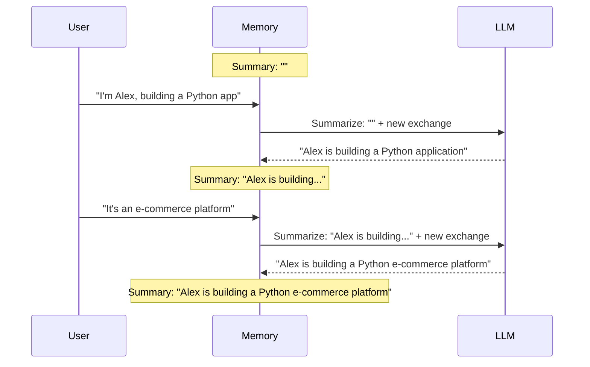
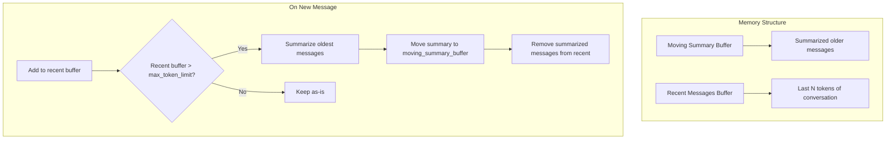

# Summary Memory: Intelligent Conversation Compression

## Introduction

As conversations grow longer, buffer-based memory becomes increasingly expensive—both in tokens and processing time. Summary memory offers an elegant solution: use an LLM to compress conversation history into a concise summary, preserving essential information while dramatically reducing token usage.

This approach trades some precision for efficiency. You lose exact quotes but retain the gist of the conversation. For many applications—especially long-running sessions—this trade-off is highly favorable.

This lesson covers two summary-based memory implementations:

| Memory Type | Strategy | Key Characteristic |
|-------------|----------|-------------------|
| **ConversationSummaryMemory** | Summarize entire history | Progressive summarization after each turn |
| **ConversationSummaryBufferMemory** | Hybrid approach | Recent messages + summary of older ones |

### What We'll Cover

- How progressive summarization works
- Full implementation of summary memory
- Hybrid buffer + summary approach
- Custom summarization prompts
- Performance and accuracy trade-offs
- Migration to modern patterns

### Prerequisites

- Understanding of [Memory Concepts](./01-memory-concepts.md)
- Understanding of [Buffer Memory](./02-buffer-memory.md)
- LangChain chain basics

---

## ConversationSummaryMemory

`ConversationSummaryMemory` maintains a running summary of the conversation. After each exchange, it updates the summary to incorporate the new information.

### How Progressive Summarization Works



Each new exchange is combined with the existing summary, and the LLM produces an updated summary.

### Basic Usage

```python
from langchain.memory import ConversationSummaryMemory
from langchain.chains import ConversationChain
from langchain_openai import ChatOpenAI

# LLM for both conversation and summarization
llm = ChatOpenAI(model="gpt-4o-mini", temperature=0)

# Create summary memory
memory = ConversationSummaryMemory(llm=llm)

# Create chain
chain = ConversationChain(llm=llm, memory=memory, verbose=True)

# Have a long conversation
chain.invoke({"input": "Hi, I'm Sarah and I'm a data scientist at a healthcare startup"})
chain.invoke({"input": "We're building a patient outcome prediction model"})
chain.invoke({"input": "We're using XGBoost for now but considering deep learning"})
chain.invoke({"input": "Our main challenge is data privacy compliance"})

# Check the summary
print(memory.load_memory_variables({}))
```

**Output:**
```python
{
    'history': 'Sarah is a data scientist at a healthcare startup. She is building a patient outcome prediction model using XGBoost and is considering transitioning to deep learning. The main challenge she faces is ensuring data privacy compliance.'
}
```

Notice how 4 exchanges are compressed into a concise paragraph.

### Configuration Options

| Parameter | Type | Default | Description |
|-----------|------|---------|-------------|
| `llm` | LLM | Required | LLM used for summarization |
| `memory_key` | str | `"history"` | Variable name for prompt injection |
| `human_prefix` | str | `"Human"` | Prefix for user messages |
| `ai_prefix` | str | `"AI"` | Prefix for AI messages |
| `buffer` | str | `""` | Initial summary (can preload) |
| `return_messages` | bool | `False` | Return as SystemMessage |

### The Summarization Prompt

LangChain uses a specific prompt for summarization:

```python
from langchain.memory.prompt import SUMMARY_PROMPT

print(SUMMARY_PROMPT.template)
```

**Default Template:**
```text
Progressively summarize the lines of conversation provided, adding onto the previous summary returning a new summary.

EXAMPLE
Current summary:
The human asks what the AI thinks of artificial intelligence. The AI thinks artificial intelligence is a force for good.

New lines of conversation:
Human: Why do you think artificial intelligence is a force for good?
AI: Because artificial intelligence will help humans reach their full potential.

New summary:
The human asks what the AI thinks of artificial intelligence. The AI thinks artificial intelligence is a force for good because it will help humans reach their full potential.
END OF EXAMPLE

Current summary:
{summary}

New lines of conversation:
{new_lines}

New summary:
```

### Custom Summarization Prompts

```python
from langchain.prompts import PromptTemplate
from langchain.memory import ConversationSummaryMemory
from langchain_openai import ChatOpenAI

# Custom prompt focused on technical details
custom_prompt = PromptTemplate(
    input_variables=["summary", "new_lines"],
    template="""Update the technical project summary with the new conversation details.
Focus on: technologies, architectures, decisions made, and problems identified.

Current technical summary:
{summary}

New conversation:
{new_lines}

Updated technical summary:"""
)

llm = ChatOpenAI(model="gpt-4o-mini")

memory = ConversationSummaryMemory(
    llm=llm,
    prompt=custom_prompt
)

# The summary will now focus on technical aspects
memory.save_context(
    {"input": "We're using PostgreSQL for our main database"},
    {"output": "PostgreSQL is a solid choice. Are you using any caching layer?"}
)
memory.save_context(
    {"input": "Yes, Redis for session management and query caching"},
    {"output": "Great architecture. Redis pairs well with PostgreSQL."}
)

print(memory.load_memory_variables({}))
```

**Output:**
```python
{'history': 'Technical stack: PostgreSQL as main database, Redis for session management and query caching.'}
```

### Preloading Context

You can initialize memory with existing summary:

```python
memory = ConversationSummaryMemory(
    llm=llm,
    buffer="Previous session: User is Alex, a Python developer working on an API project."
)

# New conversation continues from this context
memory.save_context(
    {"input": "What framework should I use for the API?"},
    {"output": "For Python APIs, FastAPI is excellent for performance and developer experience."}
)

print(memory.load_memory_variables({}))
```

---

## ConversationSummaryBufferMemory

This hybrid approach maintains **recent messages verbatim** while summarizing older ones. It provides the best of both worlds: exact context for recent exchanges and compressed history for older ones.

### How Hybrid Memory Works



### Basic Usage

```python
from langchain.memory import ConversationSummaryBufferMemory
from langchain.chains import ConversationChain
from langchain_openai import ChatOpenAI

llm = ChatOpenAI(model="gpt-4o-mini", temperature=0)

# Keep recent messages up to 200 tokens, summarize the rest
memory = ConversationSummaryBufferMemory(
    llm=llm,
    max_token_limit=200,
    return_messages=True
)

chain = ConversationChain(llm=llm, memory=memory)

# Long conversation
responses = [
    chain.invoke({"input": "I'm building a recommendation system for an e-commerce site"}),
    chain.invoke({"input": "We have about 10 million products and 50 million users"}),
    chain.invoke({"input": "Currently using collaborative filtering but it's slow"}),
    chain.invoke({"input": "Considering switching to a neural approach"}),
    chain.invoke({"input": "What embedding dimension should I use?"}),
]

# Check memory state
context = memory.load_memory_variables({})
print("Summary (older):", memory.moving_summary_buffer[:100], "...")
print("\nRecent messages:", len(context["history"]))
```

### Configuration Options

| Parameter | Type | Default | Description |
|-----------|------|---------|-------------|
| `llm` | LLM | Required | LLM for summarization |
| `max_token_limit` | int | `2000` | Token limit for recent buffer |
| `memory_key` | str | `"history"` | Prompt variable name |
| `return_messages` | bool | `False` | Return as message objects |
| `moving_summary_buffer` | str | `""` | Initial summary |
| `human_prefix` | str | `"Human"` | User message prefix |
| `ai_prefix` | str | `"AI"` | AI message prefix |

### Understanding the Token Limit

The `max_token_limit` controls when summarization kicks in:

```python
from langchain.memory import ConversationSummaryBufferMemory
from langchain_openai import ChatOpenAI

llm = ChatOpenAI(model="gpt-4o-mini")

# Small limit to demonstrate summarization
memory = ConversationSummaryBufferMemory(
    llm=llm,
    max_token_limit=100,  # Very small for demo
    return_messages=True
)

# Add messages
for i in range(5):
    memory.save_context(
        {"input": f"This is message number {i+1} with some extra content"},
        {"output": f"This is response number {i+1} with additional details"}
    )
    
    # Check state after each message
    context = memory.load_memory_variables({})
    print(f"Turn {i+1}:")
    print(f"  Summary: {memory.moving_summary_buffer[:50]}...")
    print(f"  Recent messages: {len(context['history'])}")
    print()
```

**Output:**
```
Turn 1:
  Summary: ...
  Recent messages: 2

Turn 2:
  Summary: ...
  Recent messages: 4

Turn 3:
  Summary: The conversation involves numbered messages...
  Recent messages: 2  # Older messages summarized!

Turn 4:
  Summary: The conversation involves numbered messages...
  Recent messages: 4

Turn 5:
  Summary: The conversation continues with numbered messages through message 4...
  Recent messages: 2  # Summarized again!
```

### Accessing Both Components

```python
# The summary of older messages
print("Summary buffer:", memory.moving_summary_buffer)

# The recent messages (within token limit)
context = memory.load_memory_variables({})
for msg in context["history"]:
    print(f"{msg.type}: {msg.content[:50]}...")

# Prune explicitly if needed
memory.prune()
```

### When to Use Each

| Scenario | Memory Type | Why |
|----------|-------------|-----|
| Very long conversations (100+ turns) | SummaryMemory | Minimum token usage |
| Medium conversations with recent context needs | SummaryBufferMemory | Balance of detail and compression |
| Need exact quotes from history | Buffer/Window | Summary loses exact wording |
| Token budget is extremely tight | SummaryMemory | Most aggressive compression |
| Need to reference recent specifics | SummaryBufferMemory | Recent messages preserved |

---

## The Summarizer Mixin

Both summary memory types use `SummarizerMixin`, which provides the core summarization logic:

```python
"""Understanding the summarization internals."""
from langchain.memory.summary import SummarizerMixin

# Key method signature
def predict_new_summary(
    self, 
    messages: list[BaseMessage], 
    existing_summary: str
) -> str:
    """Predict a new summary given messages and existing summary."""
    # Uses self.llm and self.prompt to generate new summary
    ...
```

### Custom Summarizer Implementation

```python
from langchain.memory import ConversationSummaryMemory
from langchain.prompts import PromptTemplate
from langchain_openai import ChatOpenAI

# Domain-specific summarization
medical_summary_prompt = PromptTemplate(
    input_variables=["summary", "new_lines"],
    template="""You are summarizing a medical consultation conversation.
Extract and maintain: patient symptoms, diagnoses discussed, medications mentioned, 
follow-up actions, and any concerns raised.

Current summary:
{summary}

New conversation:
{new_lines}

Updated medical summary (keep all medical details):"""
)

llm = ChatOpenAI(model="gpt-4o-mini", temperature=0)

medical_memory = ConversationSummaryMemory(
    llm=llm,
    prompt=medical_summary_prompt
)

# Simulate medical consultation
medical_memory.save_context(
    {"input": "I've been having headaches for the past week"},
    {"output": "I see. Can you describe the headaches? Location, severity, frequency?"}
)
medical_memory.save_context(
    {"input": "They're behind my eyes, moderate pain, daily in the afternoon"},
    {"output": "That pattern suggests tension headaches, possibly related to eye strain."}
)
medical_memory.save_context(
    {"input": "I do work at a computer all day"},
    {"output": "I recommend taking breaks every 20 minutes and we'll check your vision."}
)

print(medical_memory.load_memory_variables({})["history"])
```

**Output:**
```
Patient reports: Daily afternoon headaches behind eyes for one week, moderate severity.
Suspected diagnosis: Tension headaches, possibly related to eye strain.
Contributing factors: Extended computer use.
Recommended actions: Take breaks every 20 minutes, vision check scheduled.
```

---

## Modern Approach: Custom Summary History

Here's how to implement summary-based memory with `RunnableWithMessageHistory`:

```python
"""Modern summary memory implementation."""
from langchain_core.chat_history import InMemoryChatMessageHistory
from langchain_core.messages import BaseMessage, HumanMessage, AIMessage, SystemMessage
from langchain_core.runnables.history import RunnableWithMessageHistory
from langchain_core.prompts import ChatPromptTemplate, MessagesPlaceholder
from langchain_openai import ChatOpenAI


class SummarizingChatHistory(InMemoryChatMessageHistory):
    """Chat history that summarizes older messages."""
    
    def __init__(
        self, 
        llm: ChatOpenAI,
        max_messages: int = 10,
        summary_prompt: str | None = None
    ):
        super().__init__()
        self.llm = llm
        self.max_messages = max_messages
        self.summary = ""
        self.summary_prompt = summary_prompt or self._default_prompt()
    
    def _default_prompt(self) -> str:
        return """Summarize the following conversation, preserving key facts and context:

Existing summary: {summary}

New messages to incorporate:
{messages}

Updated summary:"""
    
    def add_messages(self, messages: list[BaseMessage]) -> None:
        super().add_messages(messages)
        
        # Check if we need to summarize
        if len(self.messages) > self.max_messages:
            self._summarize_oldest()
    
    def _summarize_oldest(self) -> None:
        """Summarize oldest messages and keep recent ones."""
        # Take oldest messages (beyond our limit)
        num_to_summarize = len(self.messages) - self.max_messages
        messages_to_summarize = self.messages[:num_to_summarize]
        
        # Format messages for summarization
        formatted = "\n".join([
            f"{m.type}: {m.content}" for m in messages_to_summarize
        ])
        
        # Generate new summary
        prompt = self.summary_prompt.format(
            summary=self.summary or "No previous summary",
            messages=formatted
        )
        response = self.llm.invoke(prompt)
        self.summary = response.content
        
        # Keep only recent messages
        self.messages = self.messages[num_to_summarize:]
    
    @property
    def messages_with_summary(self) -> list[BaseMessage]:
        """Get messages including summary as system message."""
        if self.summary:
            summary_msg = SystemMessage(content=f"Previous conversation summary: {self.summary}")
            return [summary_msg] + self.messages
        return self.messages


# Usage
llm = ChatOpenAI(model="gpt-4o-mini", temperature=0)

store: dict[str, SummarizingChatHistory] = {}

def get_summarizing_history(session_id: str) -> SummarizingChatHistory:
    if session_id not in store:
        store[session_id] = SummarizingChatHistory(
            llm=llm,
            max_messages=6  # Keep last 3 exchanges
        )
    return store[session_id]

# Build chain with custom history
prompt = ChatPromptTemplate.from_messages([
    ("system", "You are a helpful assistant."),
    MessagesPlaceholder(variable_name="history"),
    ("human", "{input}")
])

chain = prompt | llm

chain_with_memory = RunnableWithMessageHistory(
    chain,
    get_summarizing_history,
    input_messages_key="input",
    history_messages_key="history"
)

# Test
config = {"configurable": {"session_id": "user-1"}}

for i in range(10):
    response = chain_with_memory.invoke(
        {"input": f"Message {i+1}: Tell me about topic {i+1}"},
        config=config
    )
    print(f"Turn {i+1} - History has {len(store['user-1'].messages)} messages")
    if store['user-1'].summary:
        print(f"  Summary: {store['user-1'].summary[:80]}...")
```

---

## Performance Considerations

### Summarization Latency

Summary memory adds an LLM call after each exchange for summarization. This can significantly impact latency:

```python
import time

llm = ChatOpenAI(model="gpt-4o-mini")

# Measure summarization overhead
memory = ConversationSummaryMemory(llm=llm)

start = time.time()
for i in range(5):
    memory.save_context(
        {"input": f"Message {i}"},
        {"output": f"Response {i}"}
    )
elapsed = time.time() - start

print(f"5 summarizations took: {elapsed:.2f}s")
print(f"Average per turn: {elapsed/5:.2f}s")
```

**Typical Output:**
```
5 summarizations took: 3.45s
Average per turn: 0.69s
```

### Optimization Strategies

| Strategy | Implementation | Trade-off |
|----------|---------------|-----------|
| **Async summarization** | Background task after response | Complexity |
| **Batch summarization** | Summarize every N turns | Some recent context lost |
| **Faster model** | Use gpt-3.5-turbo for summaries | Quality may decrease |
| **Summary buffer** | Only summarize overflow | Best balance |

### Async Summarization Pattern

```python
"""Async summarization for reduced latency."""
import asyncio
from langchain.memory import ConversationSummaryMemory
from langchain_openai import ChatOpenAI

llm = ChatOpenAI(model="gpt-4o-mini")
memory = ConversationSummaryMemory(llm=llm)

async def chat_with_async_summary(user_input: str) -> str:
    # Get current context
    context = memory.load_memory_variables({})
    
    # Generate response (this is what user waits for)
    response = await llm.ainvoke(f"{context}\nHuman: {user_input}")
    response_text = response.content
    
    # Summarize in background (user doesn't wait)
    asyncio.create_task(
        save_context_async(user_input, response_text)
    )
    
    return response_text

async def save_context_async(input_text: str, output_text: str):
    """Background summarization."""
    # Note: This is simplified; real impl needs proper async memory
    memory.save_context(
        {"input": input_text},
        {"output": output_text}
    )
```

---

## Accuracy Trade-offs

Summary memory is **lossy compression**. Information can be lost or distorted:

### Information Loss Examples

| Original | Summary Might Become |
|----------|---------------------|
| "My order number is 45678" | "User has an order inquiry" |
| "The error happens at 3pm daily" | "User reports a recurring error" |
| "I prefer the blue version" | "User has a color preference" |

### Mitigation Strategies

```python
# 1. Use custom prompts that preserve specific details
detail_preserving_prompt = PromptTemplate(
    input_variables=["summary", "new_lines"],
    template="""Summarize while PRESERVING:
- Specific numbers, IDs, dates, times
- Names and identifiers
- Technical specifications
- User preferences and requirements

Current: {summary}
New: {new_lines}
Updated summary (keep all specifics):"""
)

# 2. Use SummaryBufferMemory for critical recent context
memory = ConversationSummaryBufferMemory(
    llm=llm,
    max_token_limit=1000  # Keep more recent context
)

# 3. Combine with entity memory for key facts
# (Covered in next lesson)
```

---

## Best Practices

| Practice | Why It Matters |
|----------|----------------|
| **Use SummaryBufferMemory by default** | Preserves recent exact context |
| **Set appropriate token limits** | Too low = excessive summarization |
| **Custom prompts for domains** | Generic prompts lose domain details |
| **Monitor summary quality** | Log summaries to catch drift |
| **Consider async patterns** | Reduce user-perceived latency |

### Recommended Configurations

```python
# Long-running support conversations
support_memory = ConversationSummaryBufferMemory(
    llm=llm,
    max_token_limit=1500,  # Good balance
    return_messages=True
)

# Technical documentation chat
tech_memory = ConversationSummaryMemory(
    llm=llm,
    prompt=technical_summary_prompt  # Preserves specs
)

# Quick interactions (summary may be overkill)
# Consider: BufferWindowMemory instead
```

---

## Hands-on Exercise

### Your Task

Build a "meeting notes" memory system that:

1. Summarizes conversation into structured meeting notes format
2. Extracts and preserves: action items, decisions, and attendees mentioned
3. Provides both full notes and a quick summary
4. Uses `ConversationSummaryBufferMemory` pattern

### Requirements

```python
# Expected interface
meeting = MeetingMemory()

meeting.add_exchange(
    "Let's discuss the Q4 roadmap. Sarah and Mike are joining.",
    "Great, I'll take notes. What's the first agenda item?"
)
meeting.add_exchange(
    "We need to decide on the database migration timeline",
    "What options are we considering?"
)
meeting.add_exchange(
    "Either December or January. Mike prefers January for testing time.",
    "Makes sense. Should we decide now or gather more input?"
)
meeting.add_exchange(
    "Let's decide now. We'll go with January. Sarah will lead the migration.",
    "Noted. January migration, Sarah as lead. What's next?"
)

# Get structured notes
print(meeting.get_notes())
```

**Expected Output:**
```
MEETING NOTES

Attendees: Sarah, Mike

DECISIONS:
- Database migration scheduled for January
- Sarah will lead the migration

ACTION ITEMS:
- Sarah: Lead database migration (January)

DISCUSSION SUMMARY:
Discussed Q4 roadmap, specifically database migration timing...
```

<details>
<summary>💡 Hints (click to expand)</summary>

- Create a custom summarization prompt with structured output
- Track attendees separately as they're mentioned
- Parse the summary for action items and decisions
- Use regex or LLM to extract structured elements

</details>

<details>
<summary>✅ Solution (click to expand)</summary>

```python
"""Meeting notes memory with structured extraction."""
from langchain.memory import ConversationSummaryBufferMemory
from langchain.prompts import PromptTemplate
from langchain_openai import ChatOpenAI
import re


class MeetingMemory:
    """Memory system that generates structured meeting notes."""
    
    def __init__(self):
        self.llm = ChatOpenAI(model="gpt-4o-mini", temperature=0)
        
        # Custom prompt for meeting notes format
        meeting_notes_prompt = PromptTemplate(
            input_variables=["summary", "new_lines"],
            template="""You are a meeting notes assistant. Update the meeting notes with new discussion content.

ALWAYS maintain this structure:
ATTENDEES: [names mentioned]
DECISIONS: [decisions made, with bullet points]
ACTION ITEMS: [tasks assigned, with owner and deadline if mentioned]
DISCUSSION: [summary of topics discussed]

Current notes:
{summary}

New discussion:
{new_lines}

Updated meeting notes (maintain structure, preserve all attendees/decisions/actions):"""
        )
        
        self.memory = ConversationSummaryBufferMemory(
            llm=self.llm,
            max_token_limit=500,
            prompt=meeting_notes_prompt
        )
        
        # Track attendees explicitly
        self.attendees: set[str] = set()
    
    def add_exchange(self, human_input: str, ai_response: str) -> None:
        """Add a meeting exchange."""
        # Extract names (simple heuristic)
        self._extract_attendees(human_input)
        self._extract_attendees(ai_response)
        
        self.memory.save_context(
            {"input": human_input},
            {"output": ai_response}
        )
    
    def _extract_attendees(self, text: str) -> None:
        """Extract potential attendee names from text."""
        # Simple pattern: capitalized words that might be names
        # In production, use NER
        patterns = [
            r'\b([A-Z][a-z]+)\s+(?:is|are|will|shall|should)\b',
            r'\b([A-Z][a-z]+)\s+(?:prefers?|suggests?|leads?|joins?)\b',
            r'\b(?:with|and)\s+([A-Z][a-z]+)\b',
        ]
        
        for pattern in patterns:
            matches = re.findall(pattern, text)
            for match in matches:
                # Filter out common false positives
                if match not in ['I', 'We', 'The', 'This', 'That', 'What', 'When', 'Where']:
                    self.attendees.add(match)
    
    def get_notes(self) -> str:
        """Get formatted meeting notes."""
        # Get summary from memory
        context = self.memory.load_memory_variables({})
        summary = self.memory.moving_summary_buffer or "No discussion summary yet."
        
        # Format with explicit attendee tracking
        notes = f"""MEETING NOTES

Attendees: {', '.join(sorted(self.attendees)) or 'None mentioned'}

{summary}

---
Recent Discussion (verbatim):
"""
        
        # Add recent messages
        if "history" in context:
            history = context["history"]
            if isinstance(history, str):
                notes += history
            else:
                for msg in history:
                    prefix = "Speaker" if msg.type == "human" else "Notes"
                    notes += f"\n{prefix}: {msg.content}"
        
        return notes
    
    def get_quick_summary(self) -> str:
        """Get just the summary without recent verbatim."""
        return self.memory.moving_summary_buffer or "No summary yet."
    
    def get_attendees(self) -> list[str]:
        """Get list of mentioned attendees."""
        return sorted(self.attendees)


# Test the implementation
if __name__ == "__main__":
    meeting = MeetingMemory()
    
    exchanges = [
        (
            "Let's discuss the Q4 roadmap. Sarah and Mike are joining.",
            "Great, I'll take notes. What's the first agenda item?"
        ),
        (
            "We need to decide on the database migration timeline",
            "What options are we considering?"
        ),
        (
            "Either December or January. Mike prefers January for testing time.",
            "Makes sense. Should we decide now or gather more input?"
        ),
        (
            "Let's decide now. We'll go with January. Sarah will lead the migration.",
            "Noted. January migration, Sarah as lead. What's next?"
        ),
        (
            "That's all for today. Thanks everyone.",
            "Meeting concluded. Notes have been recorded."
        )
    ]
    
    for human, ai in exchanges:
        meeting.add_exchange(human, ai)
    
    print(meeting.get_notes())
    print("\n=== Quick Summary ===")
    print(meeting.get_quick_summary())
    print("\n=== Attendees ===")
    print(meeting.get_attendees())
```

</details>

### Bonus Challenges

- [ ] Add automatic extraction of deadlines and dates
- [ ] Implement meeting templates (standup, planning, retrospective)
- [ ] Export notes to Markdown with proper formatting

---

## Summary

Summary memory enables long conversations by compressing history through LLM-powered summarization:

✅ **ConversationSummaryMemory** — Full progressive summarization, minimal tokens  
✅ **ConversationSummaryBufferMemory** — Hybrid with recent verbatim + older summary  
✅ **Custom prompts essential** — Generic prompts lose domain-specific details  
✅ **Latency trade-off** — Each save triggers summarization LLM call  
✅ **Lossy compression** — Specific details may be generalized  
✅ **Best for long conversations** — Short chats don't benefit

**Next:** [Entity Memory](./04-entity-memory.md) — Learn how to extract and track named entities across conversations.

---

## Further Reading

- [LangChain Summary Memory](https://python.langchain.com/docs/modules/memory/types/summary/)
- [Summary Buffer Memory](https://python.langchain.com/docs/modules/memory/types/summary_buffer/)
- [Prompt Engineering for Summarization](https://www.promptingguide.ai/techniques/summarization)

---

<!-- 
Sources Consulted:
- LangChain GitHub: langchain_classic/memory/summary.py
- LangChain GitHub: langchain_classic/memory/summary_buffer.py
- LangChain GitHub: langchain/memory/prompt.py (SUMMARY_PROMPT)
-->
