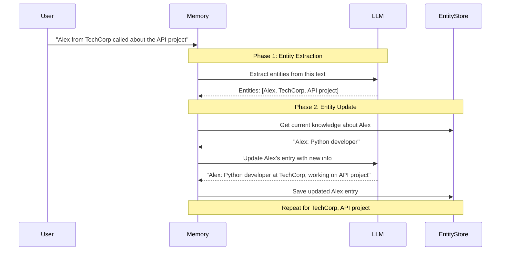

# Entity Memory: Tracking People, Places, and Things

## Introduction

Entity memory takes a fundamentally different approach from buffer or summary memory. Instead of storing the conversation itself, it **extracts and maintains information about specific entities**—people, organizations, products, concepts—mentioned throughout the dialogue. This creates a knowledge base that grows with each interaction, enabling the AI to recall facts about specific subjects across very long conversations.

Think of it as building a personal database about the topics discussed: "Alex" becomes associated with "Python developer, works at TechCorp, building an API project," and this knowledge persists regardless of how many turns ago Alex was mentioned.

### What We'll Cover

- How entity extraction and storage works
- ConversationEntityMemory implementation
- Entity store backends (InMemory, Redis, SQLite)
- Custom entity extraction prompts
- Combining entity memory with other memory types
- Production patterns and best practices

### Prerequisites

- Understanding of [Memory Concepts](./01-memory-concepts.md)
- Familiarity with key-value stores
- Basic understanding of named entity recognition concepts

---

## How Entity Memory Works

Entity memory operates in two phases for each conversation turn:



### The Entity Store Concept

Entities are stored in a key-value structure:

| Entity (Key) | Knowledge (Value) |
|--------------|-------------------|
| "Alex" | "Python developer at TechCorp, working on API project, prefers FastAPI" |
| "TechCorp" | "Technology company where Alex works, building API products" |
| "API Project" | "FastAPI-based REST API being developed by Alex at TechCorp" |

---

## ConversationEntityMemory

The main class for entity-based memory management.

### Basic Usage

```python
from langchain.memory import ConversationEntityMemory
from langchain.chains import ConversationChain
from langchain_openai import ChatOpenAI

llm = ChatOpenAI(model="gpt-4o-mini", temperature=0)

# Create entity memory
memory = ConversationEntityMemory(llm=llm)

# Create chain
chain = ConversationChain(llm=llm, memory=memory, verbose=True)

# Have a conversation
chain.invoke({"input": "Hi, I'm Alex and I work at TechCorp as a Python developer"})
chain.invoke({"input": "I'm currently building a REST API using FastAPI"})
chain.invoke({"input": "My colleague Sarah is helping with the database design"})

# Check stored entities
print("=== Stored Entities ===")
for entity in memory.entity_store.store:
    print(f"\n{entity}:")
    print(f"  {memory.entity_store.get(entity, '')}")
```

**Output:**
```
=== Stored Entities ===

Alex:
  Alex is a Python developer at TechCorp who is currently building a REST API using FastAPI.

TechCorp:
  TechCorp is a company where Alex works as a Python developer.

Sarah:
  Sarah is Alex's colleague who is helping with database design for the REST API project.

FastAPI:
  FastAPI is the framework Alex is using to build a REST API.
```

### Configuration Options

| Parameter | Type | Default | Description |
|-----------|------|---------|-------------|
| `llm` | LLM | Required | LLM for entity extraction and summarization |
| `entity_store` | BaseEntityStore | InMemoryEntityStore | Storage backend |
| `entity_cache` | list[str] | [] | Recently mentioned entities |
| `k` | int | 3 | Number of recent exchanges to include |
| `chat_history_key` | str | "history" | Key for recent conversation |
| `entity_summarization_prompt` | PromptTemplate | Default | Prompt for updating entities |
| `entity_extraction_prompt` | PromptTemplate | Default | Prompt for finding entities |
| `human_prefix` | str | "Human" | Prefix for user messages |
| `ai_prefix` | str | "AI" | Prefix for AI messages |

### Understanding the Memory Output

When loaded, entity memory provides both conversation history and entity context:

```python
memory = ConversationEntityMemory(llm=llm, k=3)

# After several exchanges...
context = memory.load_memory_variables({"input": "What did Alex say about the project?"})

print(context.keys())
# dict_keys(['history', 'entities'])

print("History (last k exchanges):")
print(context['history'])

print("\nEntities (knowledge about mentioned entities):")
print(context['entities'])
```

**Output:**
```
History (last k exchanges):
Human: I'm Alex and I work at TechCorp
AI: Nice to meet you, Alex! What do you do at TechCorp?
Human: I'm building a REST API using FastAPI
AI: FastAPI is a great choice for REST APIs...

Entities (knowledge about mentioned entities):
Alex: Python developer at TechCorp, building a REST API with FastAPI.
```

---

## Entity Extraction Deep Dive

### The Extraction Prompt

LangChain uses a prompt to identify entities in each message:

```python
from langchain.memory.prompt import ENTITY_EXTRACTION_PROMPT

print(ENTITY_EXTRACTION_PROMPT.template)
```

**Default Template:**
```text
You are an AI assistant reading the transcript of a conversation between an AI and a human. Extract all of the proper nouns from the last line of conversation. As a guideline, a proper noun is generally capitalized. You should definitely extract all names and places.

The conversation history is provided just for context so the AI has relevant context. Only extract proper nouns from the last line of conversation. Do not extract common nouns.

Return the output as a single comma-separated list, or NONE if there is nothing of note to return (e.g. the user is just asking a question or making a comment).

EXAMPLE
Conversation history:
Person #1: how's it going today?
AI: "It's going great! How about you?"
Person #1: good! busy working on Langchain. lots to do.
AI: "That sounds like a lot of work! What kind of things are you doing to make Langchain better?"
Last line:
Person #1: i'm trying to improve Langchain's interfaces, the move to Python 3.9 has made this harder to do.
Output: Langchain, Python
END OF EXAMPLE

Conversation history (for reference only):
{history}
Last line of conversation (extract proper nouns from here):
Human: {input}
Output:
```

### Custom Entity Extraction

```python
from langchain.prompts import PromptTemplate
from langchain.memory import ConversationEntityMemory
from langchain_openai import ChatOpenAI

# Technical project entity extraction
tech_extraction_prompt = PromptTemplate(
    input_variables=["history", "input"],
    template="""Extract technical entities from the last message.

Types to extract:
- People (names)
- Technologies (languages, frameworks, tools)
- Projects (project names, products)
- Organizations (companies, teams)
- Systems (databases, services, APIs)

Conversation context:
{history}

Last message:
Human: {input}

Entities (comma-separated, or NONE if no entities found):"""
)

llm = ChatOpenAI(model="gpt-4o-mini")

memory = ConversationEntityMemory(
    llm=llm,
    entity_extraction_prompt=tech_extraction_prompt
)

# Test extraction
memory.save_context(
    {"input": "We're using PostgreSQL with Redis caching at Acme Corp"},
    {"output": "That's a solid stack. How's the performance?"}
)

print("Extracted entities:", list(memory.entity_store.store.keys()))
```

**Output:**
```
Extracted entities: ['PostgreSQL', 'Redis', 'Acme Corp']
```

---

## Entity Summarization

When an entity is mentioned again, its knowledge is **updated**, not replaced:

### The Summarization Prompt

```python
from langchain.memory.prompt import ENTITY_SUMMARIZATION_PROMPT

print(ENTITY_SUMMARIZATION_PROMPT.template)
```

**Default Template:**
```text
You are an AI assistant helping a human keep track of facts about relevant people, places, and concepts in their life. Update the summary of the provided entity in the "Entity" section based on the last line of your conversation with the human. If you are writing the summary for the first time, return a single sentence.
The update should only include facts that are relayed in the last line of conversation about the provided entity, and should only contain facts about the provided entity.

If there is no new information about the provided entity or the information is not worth noting (not an important or relevant fact to remember long-term), return the existing summary unchanged.

Full conversation history (for context):
{history}

Entity to summarize:
{entity}

Existing summary of {entity}:
{summary}

Last line of conversation:
Human: {input}
AI: {output}
Updated summary:
```

### Entity Knowledge Evolution

```python
memory = ConversationEntityMemory(llm=llm)

# First mention
memory.save_context(
    {"input": "Alex is a Python developer"},
    {"output": "Nice to meet Alex!"}
)
print("After 1st mention:", memory.entity_store.get("Alex", ""))

# Second mention - adds information
memory.save_context(
    {"input": "Alex prefers FastAPI over Flask"},
    {"output": "FastAPI is indeed very performant!"}
)
print("After 2nd mention:", memory.entity_store.get("Alex", ""))

# Third mention - adds more
memory.save_context(
    {"input": "Alex has been coding for 10 years"},
    {"output": "That's a lot of experience!"}
)
print("After 3rd mention:", memory.entity_store.get("Alex", ""))
```

**Output:**
```
After 1st mention: Alex is a Python developer.
After 2nd mention: Alex is a Python developer who prefers FastAPI over Flask.
After 3rd mention: Alex is a Python developer with 10 years of experience who prefers FastAPI over Flask.
```

---

## Entity Store Backends

LangChain provides multiple storage backends for entities:

### InMemoryEntityStore (Default)

Simple dictionary-based storage, no persistence:

```python
from langchain.memory.entity import InMemoryEntityStore

store = InMemoryEntityStore()

# Basic operations
store.set("Alex", "Python developer")
print(store.get("Alex", ""))  # "Python developer"
print(store.exists("Alex"))   # True
store.delete("Alex")
print(store.exists("Alex"))   # False
store.clear()  # Remove all
```

### RedisEntityStore

Persistent storage with Redis, supports TTL:

```python
from langchain.memory.entity import RedisEntityStore
from langchain.memory import ConversationEntityMemory
from langchain_openai import ChatOpenAI

# Create Redis-backed store
redis_store = RedisEntityStore(
    url="redis://localhost:6379",
    key_prefix="entities:",      # Namespace for keys
    session_id="user-123",       # Per-user isolation
    ttl=3600                     # 1 hour expiration
)

# Use with entity memory
llm = ChatOpenAI(model="gpt-4o-mini")
memory = ConversationEntityMemory(
    llm=llm,
    entity_store=redis_store
)

# Entities persist across restarts
memory.save_context(
    {"input": "I'm Alex from TechCorp"},
    {"output": "Hello Alex!"}
)

# Later, even after app restart:
# memory.entity_store.get("Alex") still returns the data
```

### RedisEntityStore Configuration

| Parameter | Type | Default | Description |
|-----------|------|---------|-------------|
| `url` | str | Required | Redis connection URL |
| `key_prefix` | str | `"entities:"` | Key namespace prefix |
| `session_id` | str | `"default"` | Session isolation |
| `ttl` | int | `None` | Time-to-live in seconds |

### SQLiteEntityStore

File-based persistent storage:

```python
from langchain.memory.entity import SQLiteEntityStore
from langchain.memory import ConversationEntityMemory
from langchain_openai import ChatOpenAI

# Create SQLite-backed store
sqlite_store = SQLiteEntityStore(
    session_id="user-123",
    db_file="entities.db"  # Persistent file
)

# Use with entity memory
llm = ChatOpenAI(model="gpt-4o-mini")
memory = ConversationEntityMemory(
    llm=llm,
    entity_store=sqlite_store
)

# Entities persist to disk
memory.save_context(
    {"input": "The project is called Project Phoenix"},
    {"output": "Project Phoenix sounds exciting!"}
)
```

### UpstashRedisEntityStore

For serverless Redis deployments:

```python
from langchain.memory.entity import UpstashRedisEntityStore

store = UpstashRedisEntityStore(
    url="https://your-upstash-url.upstash.io",
    token="your-upstash-token",
    session_id="user-123",
    ttl=7200  # 2 hours
)
```

### Store Comparison

| Store | Persistence | Scalability | Use Case |
|-------|-------------|-------------|----------|
| **InMemory** | ❌ None | Single process | Development, testing |
| **Redis** | ✅ Yes | Horizontal | Production, multi-server |
| **SQLite** | ✅ Yes | Single file | Single-server, edge |
| **Upstash** | ✅ Yes | Serverless | Lambda, Edge functions |

---

## Custom Entity Store

Implement your own storage backend:

```python
from langchain.memory.entity import BaseEntityStore
from typing import Optional
import json

class FileEntityStore(BaseEntityStore):
    """Simple file-based entity store."""
    
    def __init__(self, file_path: str):
        self.file_path = file_path
        self._load()
    
    def _load(self) -> None:
        """Load entities from file."""
        try:
            with open(self.file_path, 'r') as f:
                self._data = json.load(f)
        except FileNotFoundError:
            self._data = {}
    
    def _save(self) -> None:
        """Save entities to file."""
        with open(self.file_path, 'w') as f:
            json.dump(self._data, f, indent=2)
    
    def get(self, key: str, default: Optional[str] = None) -> Optional[str]:
        """Get entity knowledge."""
        return self._data.get(key, default)
    
    def set(self, key: str, value: Optional[str]) -> None:
        """Set entity knowledge."""
        if value is None:
            self.delete(key)
        else:
            self._data[key] = value
            self._save()
    
    def delete(self, key: str) -> None:
        """Delete entity."""
        if key in self._data:
            del self._data[key]
            self._save()
    
    def exists(self, key: str) -> bool:
        """Check if entity exists."""
        return key in self._data
    
    def clear(self) -> None:
        """Clear all entities."""
        self._data = {}
        self._save()


# Usage
from langchain.memory import ConversationEntityMemory
from langchain_openai import ChatOpenAI

file_store = FileEntityStore("entities.json")
llm = ChatOpenAI(model="gpt-4o-mini")

memory = ConversationEntityMemory(
    llm=llm,
    entity_store=file_store
)
```

---

## Entity Memory with Prompt Templates

To use entity memory effectively, your prompt should include entity context:

```python
from langchain.prompts import PromptTemplate
from langchain.memory import ConversationEntityMemory
from langchain.chains import ConversationChain
from langchain_openai import ChatOpenAI

# Prompt that uses entity context
entity_prompt = PromptTemplate(
    input_variables=["entities", "history", "input"],
    template="""You are a helpful assistant with knowledge about the following entities:

{entities}

Recent conversation:
{history}

Current input: {input}

Response:"""
)

llm = ChatOpenAI(model="gpt-4o-mini")

memory = ConversationEntityMemory(
    llm=llm,
    return_messages=False  # String format for this prompt
)

chain = ConversationChain(
    llm=llm,
    memory=memory,
    prompt=entity_prompt
)
```

---

## Combining Entity Memory with Other Types

Entity memory works best when combined with buffer or summary memory for complete context:

```python
"""Combined memory: entities + buffer window."""
from langchain.memory import (
    ConversationEntityMemory,
    ConversationBufferWindowMemory,
    CombinedMemory
)
from langchain_openai import ChatOpenAI

llm = ChatOpenAI(model="gpt-4o-mini")

# Entity memory for facts about people/things
entity_memory = ConversationEntityMemory(
    llm=llm,
    memory_key="entities",
    chat_history_key="entity_history"  # Avoid key conflict
)

# Buffer window for recent conversation
buffer_memory = ConversationBufferWindowMemory(
    k=5,
    memory_key="history",
    return_messages=True
)

# Combine both memories
combined = CombinedMemory(memories=[entity_memory, buffer_memory])

# Both are available in prompt
context = combined.load_memory_variables({"input": "Tell me about Alex"})
print(context.keys())
# dict_keys(['entities', 'entity_history', 'history'])
```

---

## Modern Implementation Pattern

Here's how to implement entity-style memory with the modern `RunnableWithMessageHistory` approach:

```python
"""Modern entity memory pattern."""
from dataclasses import dataclass, field
from langchain_core.chat_history import InMemoryChatMessageHistory
from langchain_core.messages import BaseMessage, HumanMessage, AIMessage, SystemMessage
from langchain_core.runnables.history import RunnableWithMessageHistory
from langchain_core.prompts import ChatPromptTemplate, MessagesPlaceholder
from langchain_openai import ChatOpenAI


@dataclass
class EntityAwareChatHistory(InMemoryChatMessageHistory):
    """Chat history with entity extraction and storage."""
    
    llm: ChatOpenAI = field(default_factory=lambda: ChatOpenAI(model="gpt-4o-mini"))
    entities: dict[str, str] = field(default_factory=dict)
    max_messages: int = 10
    
    def add_messages(self, messages: list[BaseMessage]) -> None:
        super().add_messages(messages)
        
        # Extract entities from new messages
        for msg in messages:
            if msg.type == "human":
                self._extract_and_update_entities(msg.content)
        
        # Trim to max
        if len(self.messages) > self.max_messages:
            self.messages = self.messages[-self.max_messages:]
    
    def _extract_and_update_entities(self, text: str) -> None:
        """Extract entities from text and update store."""
        extraction_prompt = f"""Extract proper nouns (names, companies, technologies, projects) from:
"{text}"

Return as comma-separated list, or NONE if none found:"""
        
        response = self.llm.invoke(extraction_prompt)
        entities = response.content.strip()
        
        if entities.upper() != "NONE":
            for entity in entities.split(","):
                entity = entity.strip()
                if entity:
                    self._update_entity(entity, text)
    
    def _update_entity(self, entity: str, context: str) -> None:
        """Update knowledge about an entity."""
        existing = self.entities.get(entity, "No existing information.")
        
        update_prompt = f"""Update knowledge about "{entity}" based on new context.

Existing knowledge: {existing}
New context: {context}

Updated summary (one sentence, include all relevant facts):"""
        
        response = self.llm.invoke(update_prompt)
        self.entities[entity] = response.content.strip()
    
    def get_entity_context(self) -> str:
        """Get formatted entity knowledge for prompt injection."""
        if not self.entities:
            return "No entity information available."
        
        lines = []
        for entity, knowledge in self.entities.items():
            lines.append(f"- {entity}: {knowledge}")
        return "\n".join(lines)


# Session store
store: dict[str, EntityAwareChatHistory] = {}

def get_entity_history(session_id: str) -> EntityAwareChatHistory:
    if session_id not in store:
        store[session_id] = EntityAwareChatHistory()
    return store[session_id]


# Build chain with entity awareness
llm = ChatOpenAI(model="gpt-4o-mini")

prompt = ChatPromptTemplate.from_messages([
    ("system", """You are a helpful assistant. Use this knowledge about entities mentioned in the conversation:

{entities}"""),
    MessagesPlaceholder(variable_name="history"),
    ("human", "{input}")
])


def format_input(inputs: dict) -> dict:
    """Add entity context to inputs."""
    session_id = inputs.get("session_id", "default")
    history = store.get(session_id)
    entities = history.get_entity_context() if history else "No entities yet."
    return {**inputs, "entities": entities}


chain = prompt | llm

chain_with_memory = RunnableWithMessageHistory(
    chain,
    get_entity_history,
    input_messages_key="input",
    history_messages_key="history"
)


# Usage with entity context injection
def chat(message: str, session_id: str) -> str:
    history = get_entity_history(session_id)
    
    # Inject entity context
    inputs = {
        "input": message,
        "entities": history.get_entity_context()
    }
    
    config = {"configurable": {"session_id": session_id}}
    response = chain_with_memory.invoke(inputs, config=config)
    return response.content


# Test
print(chat("I'm Alex, a Python developer at TechCorp", "user-1"))
print(chat("I'm building an API project", "user-1"))
print("\n=== Stored Entities ===")
for entity, knowledge in store["user-1"].entities.items():
    print(f"{entity}: {knowledge}")
```

---

## Performance Considerations

### LLM Call Overhead

Entity memory makes **multiple LLM calls per save**:

1. Entity extraction (1 call)
2. Entity summarization (N calls, one per entity)

```python
# If a message mentions 5 entities, that's 6 LLM calls!
# This can add significant latency and cost
```

### Optimization Strategies

| Strategy | Implementation | Trade-off |
|----------|---------------|-----------|
| **Batch extraction** | Extract every N turns | Some entities missed temporarily |
| **Async processing** | Background entity updates | Eventual consistency |
| **Limit entities** | Cap at most important | Some context lost |
| **Faster model** | gpt-3.5-turbo for extraction | Lower quality extraction |

```python
# Example: Batch entity extraction
class BatchEntityMemory:
    def __init__(self, batch_size: int = 5):
        self.batch_size = batch_size
        self.pending_extractions: list[str] = []
    
    def save_context(self, inputs, outputs):
        self.pending_extractions.append(inputs["input"])
        
        # Only extract every batch_size turns
        if len(self.pending_extractions) >= self.batch_size:
            self._batch_extract()
            self.pending_extractions = []
    
    def _batch_extract(self):
        # Extract entities from all pending at once
        combined = "\n".join(self.pending_extractions)
        # Single LLM call for batch
        ...
```

---

## Best Practices

| Practice | Why It Matters |
|----------|----------------|
| **Use persistent stores in production** | InMemory loses data on restart |
| **Custom extraction prompts** | Domain-specific entities need custom logic |
| **Monitor entity count** | Unbounded entities increase costs |
| **Set TTL for stale entities** | Old entities may become irrelevant |
| **Combine with buffer memory** | Entities alone lack conversation flow |

### When to Use Entity Memory

| Good Fit | Poor Fit |
|----------|----------|
| CRM/support with customer data | Short, anonymous chats |
| Technical projects with many components | Simple Q&A |
| Long-term relationship tracking | One-off interactions |
| Domain with specific named entities | Generic conversations |

---

## Hands-on Exercise

### Your Task

Build a "contact manager" memory system that:

1. Extracts and tracks people mentioned in conversation
2. Stores their role, company, and relationship to user
3. Provides lookup functionality by name
4. Persists to a JSON file

### Requirements

```python
# Expected interface
contacts = ContactMemory("contacts.json")

contacts.process_message("I met Sarah from Acme Corp, she's their CTO")
contacts.process_message("Sarah mentioned her colleague Mike handles sales")

# Lookup
print(contacts.get_contact("Sarah"))
# {"name": "Sarah", "company": "Acme Corp", "role": "CTO", "notes": "..."}

print(contacts.list_contacts())
# ["Sarah", "Mike"]
```

<details>
<summary>💡 Hints (click to expand)</summary>

- Create a structured extraction prompt for people + their attributes
- Use JSON output parsing for structured data
- Store as nested dict: `{name: {company, role, notes}}`
- Merge new info with existing contact data

</details>

<details>
<summary>✅ Solution (click to expand)</summary>

```python
"""Contact manager with entity-style memory."""
import json
from pathlib import Path
from langchain_openai import ChatOpenAI
from langchain_core.output_parsers import JsonOutputParser
from pydantic import BaseModel, Field


class Person(BaseModel):
    """Extracted person information."""
    name: str = Field(description="Person's name")
    company: str | None = Field(description="Company they work for", default=None)
    role: str | None = Field(description="Their job title or role", default=None)
    relationship: str | None = Field(description="How they relate to user", default=None)


class ContactMemory:
    """Memory system for tracking contacts."""
    
    def __init__(self, file_path: str):
        self.file_path = Path(file_path)
        self.llm = ChatOpenAI(model="gpt-4o-mini", temperature=0)
        self.contacts: dict[str, dict] = self._load()
    
    def _load(self) -> dict:
        """Load contacts from file."""
        if self.file_path.exists():
            with open(self.file_path) as f:
                return json.load(f)
        return {}
    
    def _save(self) -> None:
        """Save contacts to file."""
        with open(self.file_path, 'w') as f:
            json.dump(self.contacts, f, indent=2)
    
    def process_message(self, message: str) -> list[str]:
        """Extract and store contacts from a message."""
        extraction_prompt = f"""Extract all people mentioned in this text.
For each person, extract:
- name: Their name
- company: Company they work for (if mentioned)
- role: Their job title/role (if mentioned)  
- relationship: Their relationship to the speaker (if mentioned)

Text: "{message}"

Return as JSON array of objects. If no people mentioned, return empty array [].
Example: [{{"name": "John", "company": "Acme", "role": "CEO", "relationship": "client"}}]

JSON:"""
        
        response = self.llm.invoke(extraction_prompt)
        
        try:
            # Parse JSON response
            content = response.content.strip()
            if content.startswith("```"):
                content = content.split("```")[1]
                if content.startswith("json"):
                    content = content[4:]
            
            people = json.loads(content)
            
            updated = []
            for person in people:
                name = person.get("name")
                if name:
                    self._update_contact(name, person)
                    updated.append(name)
            
            self._save()
            return updated
            
        except json.JSONDecodeError:
            return []
    
    def _update_contact(self, name: str, new_info: dict) -> None:
        """Update or create contact entry."""
        existing = self.contacts.get(name, {
            "name": name,
            "company": None,
            "role": None,
            "relationship": None,
            "notes": []
        })
        
        # Merge new info (don't overwrite with None)
        for key in ["company", "role", "relationship"]:
            if new_info.get(key):
                existing[key] = new_info[key]
        
        # Track all raw mentions
        existing.setdefault("notes", [])
        
        self.contacts[name] = existing
    
    def add_note(self, name: str, note: str) -> None:
        """Add a note to a contact."""
        if name in self.contacts:
            self.contacts[name].setdefault("notes", []).append(note)
            self._save()
    
    def get_contact(self, name: str) -> dict | None:
        """Get contact by name."""
        return self.contacts.get(name)
    
    def list_contacts(self) -> list[str]:
        """List all contact names."""
        return list(self.contacts.keys())
    
    def search_by_company(self, company: str) -> list[dict]:
        """Find contacts at a company."""
        return [
            c for c in self.contacts.values()
            if c.get("company", "").lower() == company.lower()
        ]
    
    def get_summary(self) -> str:
        """Get formatted summary of all contacts."""
        if not self.contacts:
            return "No contacts stored."
        
        lines = []
        for name, info in self.contacts.items():
            parts = [name]
            if info.get("role"):
                parts.append(info["role"])
            if info.get("company"):
                parts.append(f"at {info['company']}")
            lines.append(" - ".join(parts))
        
        return "\n".join(lines)


# Test the implementation
if __name__ == "__main__":
    contacts = ContactMemory("test_contacts.json")
    
    # Process some messages
    contacts.process_message("I met Sarah from Acme Corp, she's their CTO")
    contacts.process_message("Sarah introduced me to Mike, the sales director")
    contacts.process_message("Later I spoke with Jennifer, our new intern")
    
    # Look up contacts
    print("=== Sarah ===")
    print(contacts.get_contact("Sarah"))
    
    print("\n=== All Contacts ===")
    print(contacts.list_contacts())
    
    print("\n=== Contact Summary ===")
    print(contacts.get_summary())
    
    print("\n=== Acme Corp employees ===")
    print(contacts.search_by_company("Acme Corp"))
```

</details>

### Bonus Challenges

- [ ] Add fuzzy name matching for variations ("Sarah", "Sara", "Sarah Smith")
- [ ] Implement relationship graph between contacts
- [ ] Add automatic deduplication of similar contacts

---

## Summary

Entity memory provides a powerful way to track facts about specific subjects across long conversations:

✅ **Entity extraction** — LLM identifies proper nouns and concepts  
✅ **Progressive knowledge building** — Information accumulates over time  
✅ **Multiple storage backends** — InMemory, Redis, SQLite, custom  
✅ **Complements other memory types** — Best combined with buffer or summary  
✅ **LLM overhead** — Multiple calls per turn, consider batching  
✅ **Custom prompts essential** — Domain-specific extraction improves quality

**Next:** [Vector Memory](./05-vector-memory.md) — Learn semantic search over conversation history for intelligent context retrieval.

---

## Further Reading

- [LangChain Entity Memory](https://python.langchain.com/docs/modules/memory/types/entity_summary/)
- [Named Entity Recognition](https://en.wikipedia.org/wiki/Named-entity_recognition)
- [Redis Documentation](https://redis.io/documentation)
- [SQLite Documentation](https://www.sqlite.org/docs.html)

---

<!-- 
Sources Consulted:
- LangChain GitHub: langchain_classic/memory/entity.py
- LangChain GitHub: langchain/memory/prompt.py (ENTITY_EXTRACTION_PROMPT, ENTITY_SUMMARIZATION_PROMPT)
- Redis Entity Store implementation details
-->