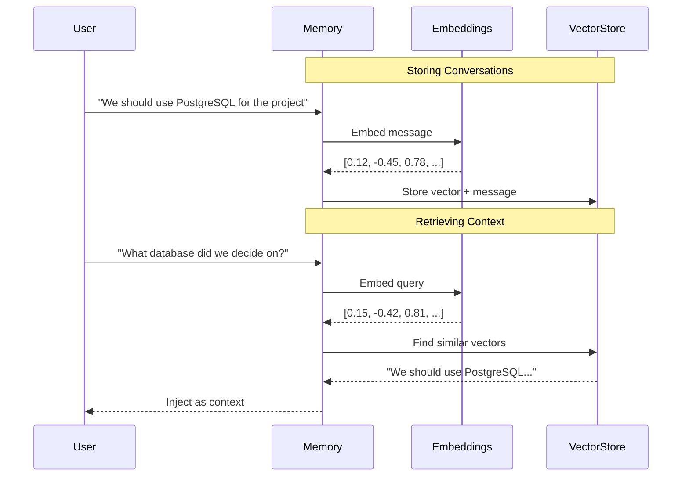
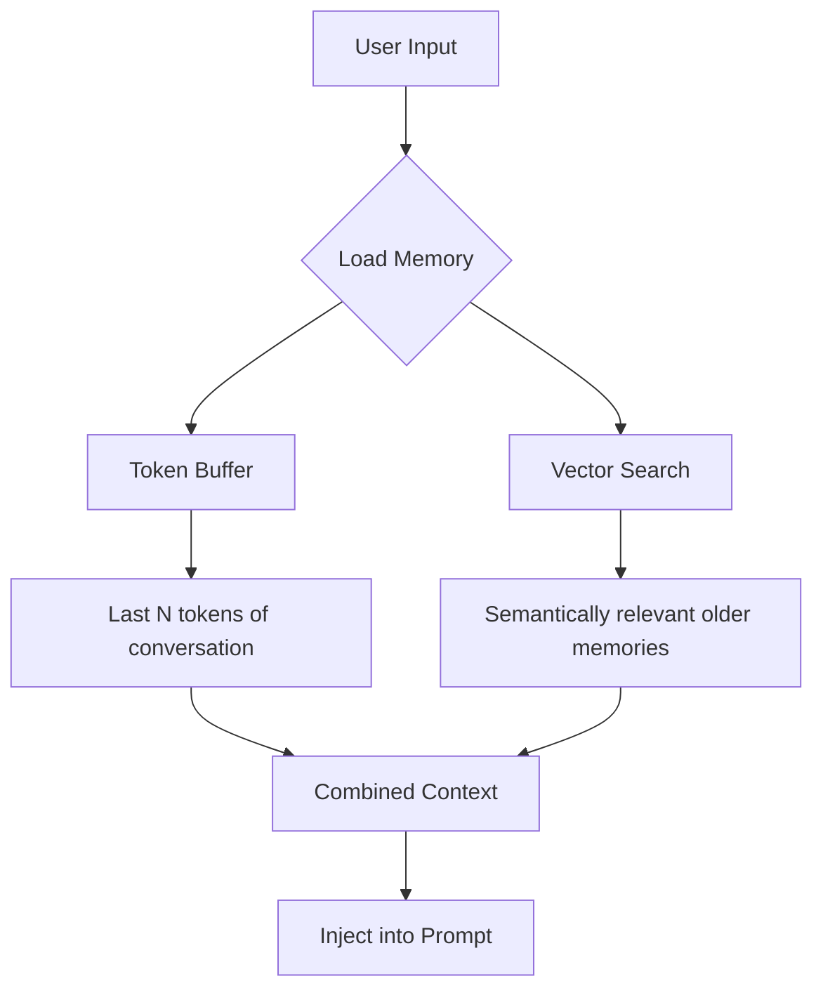

# Vector Memory: Semantic Search Over Conversation History

## Introduction

Vector memory represents the most sophisticated approach to conversation context retrieval. Instead of maintaining linear history or extracting entities, it stores conversation fragments as **embeddings** in a vector database and retrieves the most **semantically relevant** context for each new query. This enables recall of pertinent information from conversations that happened hours, days, or even months ago—even when the exact keywords differ.

Consider a user asking "What was that database thing we discussed?" Vector memory can retrieve the conversation about "PostgreSQL migration strategy" because the semantic meaning is related, even though no words overlap.

### What We'll Cover

- How semantic search works in conversation context
- VectorStoreRetrieverMemory implementation
- ConversationVectorStoreTokenBufferMemory (hybrid approach)
- Embedding strategies and chunking
- Vector store backends (Chroma, Pinecone, FAISS)
- Production patterns and best practices

### Prerequisites

- Understanding of [Memory Concepts](./01-memory-concepts.md)
- Basic knowledge of embeddings and vector search
- Familiarity with vector databases (helpful but not required)

---

## How Vector Memory Works

Vector memory transforms conversation history into searchable semantic space:



### Why Semantic Search Matters

| Query | Would Match (Semantic) | Would NOT Match (Keyword) |
|-------|----------------------|---------------------------|
| "What database?" | "PostgreSQL for the project" | ✅ Similar meaning |
| "Tell me about the DB" | "PostgreSQL for the project" | ❌ "DB" ≠ "PostgreSQL" |
| "Storage solution?" | "PostgreSQL for the project" | ❌ Different words |
| "What did we decide for data?" | "PostgreSQL for the project" | ❌ No overlap |

Semantic search understands **meaning**, not just keywords.

---

## VectorStoreRetrieverMemory

The primary class for vector-based memory in LangChain.

### Basic Usage

```python
from langchain.memory import VectorStoreRetrieverMemory
from langchain_openai import OpenAIEmbeddings
from langchain_community.vectorstores import Chroma
from langchain_openai import ChatOpenAI

# Create vector store
embeddings = OpenAIEmbeddings()
vectorstore = Chroma(
    collection_name="conversation_memory",
    embedding_function=embeddings
)

# Create retriever
retriever = vectorstore.as_retriever(
    search_kwargs={"k": 5}  # Retrieve top 5 relevant memories
)

# Create vector memory
memory = VectorStoreRetrieverMemory(
    retriever=retriever,
    memory_key="relevant_history",
    input_key="input"
)

# Store some conversation history
memory.save_context(
    {"input": "What's the best database for our Python web app?"},
    {"output": "For a Python web app, PostgreSQL is excellent. It has great Python library support with psycopg2 and SQLAlchemy."}
)

memory.save_context(
    {"input": "What about caching?"},
    {"output": "Redis is the go-to choice for caching. It integrates seamlessly with Python using redis-py."}
)

memory.save_context(
    {"input": "We need real-time features too"},
    {"output": "For real-time, consider WebSockets with Socket.IO or using Redis Pub/Sub for message passing."}
)

# Query semantically related context
context = memory.load_memory_variables({"input": "What was the storage recommendation?"})
print(context["relevant_history"])
```

**Output:**
```
input: What's the best database for our Python web app?
output: For a Python web app, PostgreSQL is excellent. It has great Python library support with psycopg2 and SQLAlchemy.

input: What about caching?
output: Redis is the go-to choice for caching. It integrates seamlessly with Python using redis-py.
```

### Configuration Options

| Parameter | Type | Default | Description |
|-----------|------|---------|-------------|
| `retriever` | VectorStoreRetriever | Required | The retriever to search history |
| `memory_key` | str | `"history"` | Key for prompt injection |
| `input_key` | str | `None` | Key for input (for query embedding) |
| `return_docs` | bool | `False` | Return Document objects vs strings |
| `exclude_input_keys` | list[str] | [] | Keys to exclude from stored context |

### Understanding the Storage Format

Each save stores the exchange as a document:

```python
# What gets stored in the vector store
document_content = """input: What's the best database for our Python web app?
output: For a Python web app, PostgreSQL is excellent..."""

# Metadata includes the original keys
metadata = {
    "input": "What's the best database...",
    "output": "For a Python web app..."
}
```

---

## Vector Store Backends

### Chroma (Local Development)

```python
from langchain_community.vectorstores import Chroma
from langchain_openai import OpenAIEmbeddings

# In-memory (development)
vectorstore = Chroma(
    collection_name="memory",
    embedding_function=OpenAIEmbeddings()
)

# Persistent (data survives restarts)
vectorstore = Chroma(
    collection_name="memory",
    embedding_function=OpenAIEmbeddings(),
    persist_directory="./chroma_db"
)
```

### FAISS (Fast Local Search)

```python
from langchain_community.vectorstores import FAISS
from langchain_openai import OpenAIEmbeddings

# Create from texts
texts = ["First memory", "Second memory"]
vectorstore = FAISS.from_texts(texts, OpenAIEmbeddings())

# Save and load
vectorstore.save_local("faiss_index")
loaded = FAISS.load_local("faiss_index", OpenAIEmbeddings())
```

### Pinecone (Production Scale)

```python
from langchain_pinecone import PineconeVectorStore
from langchain_openai import OpenAIEmbeddings
from pinecone import Pinecone

# Initialize Pinecone
pc = Pinecone(api_key="your-api-key")
index = pc.Index("conversation-memory")

# Create vector store
vectorstore = PineconeVectorStore(
    index=index,
    embedding=OpenAIEmbeddings(),
    namespace="user-123"  # Per-user isolation
)
```

### Backend Comparison

| Backend | Persistence | Scale | Use Case |
|---------|-------------|-------|----------|
| **Chroma** | Optional | Single machine | Development, small production |
| **FAISS** | File-based | Single machine | High-performance local |
| **Pinecone** | Cloud | Massive | Production, multi-tenant |
| **Weaviate** | Cloud/Self-hosted | Large | Production with rich filtering |
| **Qdrant** | Cloud/Self-hosted | Large | Production, hybrid search |

---

## ConversationVectorStoreTokenBufferMemory

A hybrid approach combining **token buffer** (recent context) with **vector search** (older context):



### Basic Usage

```python
from langchain.memory import ConversationVectorStoreTokenBufferMemory
from langchain_openai import OpenAIEmbeddings, ChatOpenAI
from langchain_community.vectorstores import Chroma

# Setup
llm = ChatOpenAI(model="gpt-4o-mini")
embeddings = OpenAIEmbeddings()
vectorstore = Chroma(
    collection_name="hybrid_memory",
    embedding_function=embeddings
)

# Create hybrid memory
memory = ConversationVectorStoreTokenBufferMemory(
    llm=llm,  # For token counting
    vectorstore=vectorstore,
    memory_key="history",
    max_token_limit=500,  # Recent conversation token limit
    return_messages=True
)

# Conversations are stored in both buffer and vector store
memory.save_context(
    {"input": "I'm building an e-commerce platform"},
    {"output": "Great! What features do you need?"}
)

# Recent messages in buffer, older ones searchable via vectors
context = memory.load_memory_variables({"input": "What platform?"})
```

### Configuration

| Parameter | Type | Default | Description |
|-----------|------|---------|-------------|
| `llm` | LLM | Required | For token counting |
| `vectorstore` | VectorStore | Required | Vector store for semantic search |
| `memory_key` | str | `"history"` | Prompt variable name |
| `max_token_limit` | int | `2000` | Token limit for recent buffer |
| `return_messages` | bool | `False` | Return Message objects |

---

## Embedding Strategies

### What Gets Embedded

By default, both input and output are combined into one document:

```python
# Default: Combined embedding
"input: What database? output: PostgreSQL is great..."
```

### Custom Embedding Strategies

```python
"""Separate embeddings for questions and answers."""
from langchain.memory import VectorStoreRetrieverMemory
from langchain_community.vectorstores import Chroma
from langchain_openai import OpenAIEmbeddings

class SeparateEmbeddingMemory:
    """Store questions and answers as separate vectors."""
    
    def __init__(self):
        embeddings = OpenAIEmbeddings()
        self.questions_store = Chroma(
            collection_name="questions",
            embedding_function=embeddings
        )
        self.answers_store = Chroma(
            collection_name="answers",
            embedding_function=embeddings
        )
        self.qa_pairs: dict[str, str] = {}  # question_id -> answer
    
    def save_context(self, inputs: dict, outputs: dict) -> None:
        import uuid
        
        question = inputs["input"]
        answer = outputs["output"]
        pair_id = str(uuid.uuid4())
        
        # Store question with ID
        self.questions_store.add_texts(
            texts=[question],
            metadatas=[{"pair_id": pair_id, "type": "question"}]
        )
        
        # Store answer with same ID
        self.answers_store.add_texts(
            texts=[answer],
            metadatas=[{"pair_id": pair_id, "type": "answer"}]
        )
        
        self.qa_pairs[pair_id] = answer
    
    def search_similar_questions(self, query: str, k: int = 3) -> list[dict]:
        """Find similar past questions and their answers."""
        results = self.questions_store.similarity_search(query, k=k)
        
        qa_results = []
        for doc in results:
            pair_id = doc.metadata.get("pair_id")
            if pair_id and pair_id in self.qa_pairs:
                qa_results.append({
                    "question": doc.page_content,
                    "answer": self.qa_pairs[pair_id]
                })
        
        return qa_results
```

### Chunking Long Conversations

For long exchanges, consider chunking:

```python
"""Chunk long conversations for better retrieval."""
from langchain.text_splitter import RecursiveCharacterTextSplitter

class ChunkedVectorMemory:
    def __init__(self, vectorstore, chunk_size: int = 500):
        self.vectorstore = vectorstore
        self.splitter = RecursiveCharacterTextSplitter(
            chunk_size=chunk_size,
            chunk_overlap=50
        )
    
    def save_context(self, inputs: dict, outputs: dict) -> None:
        # Combine input/output
        full_text = f"Q: {inputs['input']}\nA: {outputs['output']}"
        
        # Chunk if long
        chunks = self.splitter.split_text(full_text)
        
        # Store each chunk with ordering metadata
        for i, chunk in enumerate(chunks):
            self.vectorstore.add_texts(
                texts=[chunk],
                metadatas=[{"chunk_index": i, "total_chunks": len(chunks)}]
            )
```

---

## Modern Implementation Pattern

Here's how to implement vector memory with `RunnableWithMessageHistory`:

```python
"""Modern vector memory with RunnableWithMessageHistory."""
from langchain_core.chat_history import BaseChatMessageHistory
from langchain_core.messages import BaseMessage, HumanMessage, AIMessage
from langchain_core.runnables.history import RunnableWithMessageHistory
from langchain_core.prompts import ChatPromptTemplate, MessagesPlaceholder
from langchain_openai import ChatOpenAI, OpenAIEmbeddings
from langchain_community.vectorstores import Chroma
from typing import Sequence


class VectorBackedChatHistory(BaseChatMessageHistory):
    """Chat history with vector-based retrieval for older messages."""
    
    def __init__(
        self,
        session_id: str,
        vectorstore: Chroma,
        embeddings: OpenAIEmbeddings,
        recent_k: int = 6,  # Keep last 3 exchanges
        retrieve_k: int = 4  # Retrieve 4 relevant old messages
    ):
        self.session_id = session_id
        self.vectorstore = vectorstore
        self.embeddings = embeddings
        self.recent_k = recent_k
        self.retrieve_k = retrieve_k
        self._messages: list[BaseMessage] = []
    
    @property
    def messages(self) -> list[BaseMessage]:
        """Get recent messages only."""
        return self._messages[-self.recent_k:]
    
    def add_messages(self, messages: Sequence[BaseMessage]) -> None:
        """Add messages to history and vector store."""
        for msg in messages:
            self._messages.append(msg)
            
            # Store in vector database for future retrieval
            self.vectorstore.add_texts(
                texts=[msg.content],
                metadatas=[{
                    "session_id": self.session_id,
                    "type": msg.type,
                    "index": len(self._messages)
                }]
            )
    
    def get_relevant_history(self, query: str) -> list[BaseMessage]:
        """Get semantically relevant messages from full history."""
        # Search vector store
        results = self.vectorstore.similarity_search(
            query,
            k=self.retrieve_k,
            filter={"session_id": self.session_id}
        )
        
        # Convert to messages
        relevant = []
        for doc in results:
            msg_type = doc.metadata.get("type", "human")
            if msg_type == "human":
                relevant.append(HumanMessage(content=doc.page_content))
            else:
                relevant.append(AIMessage(content=doc.page_content))
        
        return relevant
    
    def clear(self) -> None:
        """Clear history."""
        self._messages = []
        # Note: Vector store entries persist


# Setup
embeddings = OpenAIEmbeddings()
vectorstore = Chroma(
    collection_name="chat_memory",
    embedding_function=embeddings
)

store: dict[str, VectorBackedChatHistory] = {}


def get_vector_history(session_id: str) -> VectorBackedChatHistory:
    if session_id not in store:
        store[session_id] = VectorBackedChatHistory(
            session_id=session_id,
            vectorstore=vectorstore,
            embeddings=embeddings
        )
    return store[session_id]


# Build chain with relevant context injection
llm = ChatOpenAI(model="gpt-4o-mini")

prompt = ChatPromptTemplate.from_messages([
    ("system", "You are a helpful assistant. Here's relevant context from earlier:\n{relevant_context}"),
    MessagesPlaceholder(variable_name="history"),
    ("human", "{input}")
])

chain = prompt | llm

chain_with_memory = RunnableWithMessageHistory(
    chain,
    get_vector_history,
    input_messages_key="input",
    history_messages_key="history"
)


def chat(message: str, session_id: str) -> str:
    """Chat with vector-backed context retrieval."""
    history = get_vector_history(session_id)
    
    # Get relevant older context
    relevant = history.get_relevant_history(message)
    relevant_context = "\n".join([
        f"{m.type}: {m.content[:100]}..." for m in relevant
    ]) if relevant else "No relevant prior context."
    
    config = {"configurable": {"session_id": session_id}}
    response = chain_with_memory.invoke(
        {"input": message, "relevant_context": relevant_context},
        config=config
    )
    return response.content


# Test
print(chat("I'm building an e-commerce site with Python", "user-1"))
print(chat("What payment provider should I use?", "user-1"))
print(chat("Let's talk about shipping now", "user-1"))

# Later... vector search retrieves relevant context
print(chat("What was I building again?", "user-1"))  # Finds e-commerce mention
```

---

## Performance Optimization

### Embedding Caching

Embeddings are expensive. Cache them:

```python
from langchain.embeddings import CacheBackedEmbeddings
from langchain.storage import LocalFileStore

# Create cached embeddings
underlying = OpenAIEmbeddings()
cache = LocalFileStore("./embedding_cache")

cached_embeddings = CacheBackedEmbeddings.from_bytes_store(
    underlying_embeddings=underlying,
    document_embedding_cache=cache,
    namespace=underlying.model
)

# Use cached embeddings in vector store
vectorstore = Chroma(
    embedding_function=cached_embeddings
)
```

### Batch Operations

```python
"""Batch save for efficiency."""
class BatchVectorMemory:
    def __init__(self, vectorstore, batch_size: int = 10):
        self.vectorstore = vectorstore
        self.batch_size = batch_size
        self.pending: list[str] = []
        self.pending_metadata: list[dict] = []
    
    def save_context(self, inputs: dict, outputs: dict) -> None:
        text = f"Q: {inputs['input']} A: {outputs['output']}"
        self.pending.append(text)
        self.pending_metadata.append(inputs)
        
        if len(self.pending) >= self.batch_size:
            self._flush()
    
    def _flush(self) -> None:
        if self.pending:
            self.vectorstore.add_texts(
                texts=self.pending,
                metadatas=self.pending_metadata
            )
            self.pending = []
            self.pending_metadata = []
```

### Filtering for Relevance

Use metadata filters to improve retrieval:

```python
# Store with rich metadata
vectorstore.add_texts(
    texts=["PostgreSQL is great for ACID compliance"],
    metadatas=[{
        "topic": "database",
        "session_id": "user-123",
        "timestamp": "2024-01-15T10:30:00Z",
        "importance": "high"
    }]
)

# Retrieve with filters
retriever = vectorstore.as_retriever(
    search_type="similarity",
    search_kwargs={
        "k": 5,
        "filter": {
            "session_id": "user-123",
            "topic": "database"
        }
    }
)
```

---

## Best Practices

| Practice | Why It Matters |
|----------|----------------|
| **Use session-based namespacing** | Prevent cross-user memory leakage |
| **Cache embeddings** | Reduce API costs significantly |
| **Hybrid with recent buffer** | Ensure immediate context is exact |
| **Add metadata for filtering** | Improve retrieval precision |
| **Chunk long messages** | Better semantic matching |
| **Monitor retrieval quality** | Irrelevant retrievals harm responses |

### When to Use Vector Memory

| Good Fit | Poor Fit |
|----------|----------|
| Long conversations (100+ turns) | Short, focused chats |
| Need to recall old details | Linear, sequential tasks |
| Topic shifts throughout conversation | Single-topic conversations |
| Support/documentation scenarios | Real-time requirements |

---

## Common Pitfalls

| ❌ Mistake | ✅ Solution |
|-----------|-------------|
| No session isolation | Add session_id to metadata filters |
| Embedding every message | Batch or selective embedding |
| Retrieving too many results | Limit k, use relevance threshold |
| Ignoring recency | Combine with buffer memory |
| No embedding cache | Use CacheBackedEmbeddings |

---

## Hands-on Exercise

### Your Task

Build a "knowledge recall" memory system that:

1. Stores conversation exchanges as vectors
2. Retrieves the 3 most relevant past exchanges for each query
3. Tracks recall statistics (hits, misses, average similarity)
4. Provides a search interface for explicit history lookup

### Requirements

```python
# Expected interface
recall = KnowledgeRecallMemory()

# Store conversations
recall.store("What's the best framework for APIs?", "FastAPI is excellent for modern APIs")
recall.store("How do I handle auth?", "Use OAuth2 with JWT tokens")
recall.store("What about database?", "PostgreSQL with SQLAlchemy ORM")

# Automatic recall
context = recall.get_relevant_context("I need to build a secure API")
# Returns: FastAPI and OAuth2 exchanges (semantically related)

# Explicit search
results = recall.search("authentication")
# Returns: OAuth2 exchange

# Stats
print(recall.get_stats())
# {'total_stored': 3, 'total_queries': 2, 'avg_similarity': 0.82}
```

<details>
<summary>💡 Hints (click to expand)</summary>

- Use Chroma with similarity score threshold
- Track query count and similarity scores
- Implement explicit search as similarity_search_with_score
- Store metadata for each exchange

</details>

<details>
<summary>✅ Solution (click to expand)</summary>

```python
"""Knowledge recall memory with statistics tracking."""
from dataclasses import dataclass, field
from langchain_openai import OpenAIEmbeddings
from langchain_community.vectorstores import Chroma
import uuid


@dataclass
class KnowledgeRecallMemory:
    """Memory system with semantic recall and statistics."""
    
    collection_name: str = "knowledge_recall"
    similarity_threshold: float = 0.7
    
    # Statistics
    total_queries: int = 0
    total_retrievals: int = 0
    similarity_scores: list[float] = field(default_factory=list)
    
    def __post_init__(self):
        self.embeddings = OpenAIEmbeddings()
        self.vectorstore = Chroma(
            collection_name=self.collection_name,
            embedding_function=self.embeddings
        )
        self.stored_count = 0
    
    def store(self, question: str, answer: str) -> str:
        """Store a Q&A exchange."""
        exchange_id = str(uuid.uuid4())
        
        # Store as combined text for embedding
        combined = f"Q: {question}\nA: {answer}"
        
        self.vectorstore.add_texts(
            texts=[combined],
            metadatas=[{
                "id": exchange_id,
                "question": question,
                "answer": answer,
                "type": "qa_exchange"
            }]
        )
        
        self.stored_count += 1
        return exchange_id
    
    def get_relevant_context(
        self, 
        query: str, 
        k: int = 3
    ) -> list[dict]:
        """Get semantically relevant past exchanges."""
        self.total_queries += 1
        
        # Search with scores
        results = self.vectorstore.similarity_search_with_score(query, k=k)
        
        relevant = []
        for doc, score in results:
            # Convert distance to similarity (Chroma uses L2 distance)
            similarity = 1 / (1 + score)
            
            self.similarity_scores.append(similarity)
            
            if similarity >= self.similarity_threshold:
                self.total_retrievals += 1
                relevant.append({
                    "question": doc.metadata.get("question", ""),
                    "answer": doc.metadata.get("answer", ""),
                    "similarity": round(similarity, 3)
                })
        
        return relevant
    
    def search(self, query: str, k: int = 5) -> list[dict]:
        """Explicit search through history."""
        results = self.vectorstore.similarity_search_with_score(query, k=k)
        
        return [
            {
                "question": doc.metadata.get("question", ""),
                "answer": doc.metadata.get("answer", ""),
                "similarity": round(1 / (1 + score), 3)
            }
            for doc, score in results
        ]
    
    def get_stats(self) -> dict:
        """Get recall statistics."""
        avg_sim = (
            sum(self.similarity_scores) / len(self.similarity_scores)
            if self.similarity_scores else 0
        )
        
        return {
            "total_stored": self.stored_count,
            "total_queries": self.total_queries,
            "total_retrievals": self.total_retrievals,
            "avg_similarity": round(avg_sim, 3),
            "hit_rate": round(
                self.total_retrievals / max(self.total_queries, 1), 3
            )
        }
    
    def format_context(self, relevant: list[dict]) -> str:
        """Format relevant exchanges for prompt injection."""
        if not relevant:
            return "No relevant prior context found."
        
        lines = ["Relevant prior knowledge:"]
        for item in relevant:
            lines.append(f"Q: {item['question']}")
            lines.append(f"A: {item['answer']}")
            lines.append("")
        
        return "\n".join(lines)


# Test the implementation
if __name__ == "__main__":
    recall = KnowledgeRecallMemory()
    
    # Store some knowledge
    recall.store(
        "What's the best framework for APIs?",
        "FastAPI is excellent for modern Python APIs. It's fast, async-first, and has automatic OpenAPI documentation."
    )
    recall.store(
        "How do I handle authentication?",
        "Use OAuth2 with JWT tokens. FastAPI has built-in support for OAuth2 with Password flow."
    )
    recall.store(
        "What about the database?",
        "PostgreSQL with SQLAlchemy ORM is a great choice. Use Alembic for migrations."
    )
    recall.store(
        "How should I structure the project?",
        "Use a layered architecture: routers, services, repositories. Keep business logic in services."
    )
    
    print("=== Relevant Context Test ===")
    context = recall.get_relevant_context("I need to build a secure API endpoint")
    for item in context:
        print(f"[{item['similarity']}] Q: {item['question'][:50]}...")
    
    print("\n=== Explicit Search ===")
    results = recall.search("database setup")
    for item in results:
        print(f"[{item['similarity']}] {item['answer'][:60]}...")
    
    print("\n=== Statistics ===")
    print(recall.get_stats())
    
    print("\n=== Formatted Context ===")
    print(recall.format_context(context))
```

</details>

### Bonus Challenges

- [ ] Add time-based decay to similarity scores
- [ ] Implement relevance feedback (mark retrievals as helpful/unhelpful)
- [ ] Create a hybrid that combines keyword search with semantic search

---

## Summary

Vector memory enables intelligent retrieval of relevant conversation context through semantic search:

✅ **Semantic matching** — Finds relevant context even without keyword overlap  
✅ **Scales to long histories** — Efficient retrieval regardless of conversation length  
✅ **VectorStoreRetrieverMemory** — Primary implementation for vector-based recall  
✅ **Hybrid approaches work best** — Combine with buffer for recent exact context  
✅ **Multiple backends** — Chroma, FAISS, Pinecone for different scales  
✅ **Cache embeddings** — Essential for cost and performance optimization

**Next:** [Memory Integration](./06-memory-integration.md) — Learn modern patterns with RunnableWithMessageHistory, LCEL integration, and production persistence.

---

## Further Reading

- [LangChain Vector Store Memory](https://python.langchain.com/docs/modules/memory/types/vectorstore_retriever_memory/)
- [Chroma Documentation](https://docs.trychroma.com/)
- [Pinecone Documentation](https://docs.pinecone.io/)
- [FAISS Documentation](https://faiss.ai/)
- [Embedding Caching](https://python.langchain.com/docs/modules/data_connection/caching_embeddings/)

---

<!-- 
Sources Consulted:
- LangChain GitHub: langchain_classic/memory/vectorstore.py
- LangChain GitHub: langchain_classic/memory/vectorstore_token_buffer_memory.py
- Chroma documentation
- OpenAI Embeddings documentation
-->
