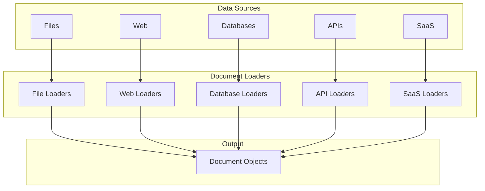
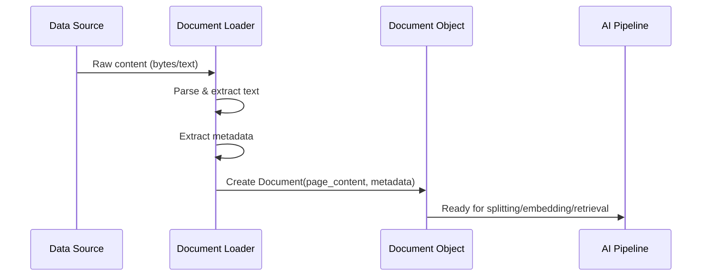

# Document Loaders

## Introduction

Document loaders are the gateway to bringing your data into LangChain's AI pipelines. Before you can embed, split, or retrieve content, you need to **load** it from its source—whether that's a local text file, a PDF, a web page, or a database. LangChain provides 100+ built-in loaders that handle this critical first step, transforming raw data into structured `Document` objects ready for processing.

Think of document loaders as universal data importers: they abstract away the complexity of parsing different file formats, handling character encodings, managing pagination, and extracting metadata. Whether you're building a RAG system over company documents or creating a knowledge base from web content, mastering document loaders is essential.

### What We'll Cover

- **Loader Fundamentals**: Understanding the `Document` class, `BaseLoader` interface, and lazy loading patterns
- **Text File Loaders**: Loading plain text files, directories, and using glob patterns
- **PDF Loaders**: Extracting text, tables, and images from PDFs with various parsers
- **Web Loaders**: Scraping web pages, handling JavaScript, and crawling sitemaps
- **Structured Data Loaders**: Loading CSV, JSON, databases, and API data
- **Custom Loaders**: Creating your own loaders for specialized data sources

### Prerequisites

Before starting this lesson, you should have:

- Completed [Lesson 1: LangChain Fundamentals](../01-langchain-fundamentals/00-langchain-fundamentals.md)
- Basic Python knowledge (file I/O, iterators, generators)
- Understanding of document processing concepts
- Familiarity with different file formats (PDF, CSV, JSON, HTML)

### Lesson Structure

This lesson is organized into focused sub-lessons:

| Sub-lesson | Focus | Key Topics |
|------------|-------|------------|
| [01-loader-fundamentals](./01-loader-fundamentals.md) | Core concepts | Document class, BaseLoader, lazy loading, metadata |
| [02-text-file-loaders](./02-text-file-loaders.md) | Text files | TextLoader, DirectoryLoader, glob patterns, encoding |
| [03-pdf-loaders](./03-pdf-loaders.md) | PDF processing | PyPDFLoader, PDFPlumber, OCR, table extraction |
| [04-web-loaders](./04-web-loaders.md) | Web scraping | WebBaseLoader, async loading, JavaScript, sitemaps |
| [05-structured-data-loaders](./05-structured-data-loaders.md) | Structured data | CSVLoader, JSONLoader, databases, APIs |
| [06-custom-loaders](./06-custom-loaders.md) | Custom solutions | Creating loaders, extending BaseLoader |

---

## Loader Ecosystem Overview

LangChain's document loaders can be categorized by data source type:



### Loader Categories

| Category | Example Loaders | Use Cases |
|----------|-----------------|-----------|
| **Text Files** | TextLoader, DirectoryLoader | Local documents, code files |
| **PDFs** | PyPDFLoader, PDFPlumberLoader | Research papers, reports, scanned docs |
| **Web** | WebBaseLoader, SitemapLoader | Websites, documentation, blogs |
| **Structured Data** | CSVLoader, JSONLoader | Spreadsheets, configuration files |
| **Databases** | SQLDatabaseLoader, MongodbLoader | Enterprise data, analytics |
| **SaaS** | NotionDBLoader, GoogleDriveLoader | Cloud documents, productivity tools |

### The Document Loading Pipeline



---

## Quick Reference

### Common Loaders by Use Case

| Use Case | Recommended Loader | Why |
|----------|-------------------|-----|
| Plain text files | `TextLoader` | Simple, handles encoding |
| Multiple files | `DirectoryLoader` | Batch processing with patterns |
| PDF documents | `PyPDFLoader` | Reliable, page-aware |
| PDFs with tables | `PDFPlumberLoader` | Better table extraction |
| Web pages | `WebBaseLoader` | BeautifulSoup parsing |
| JavaScript sites | `PlaywrightURLLoader` | Full browser rendering |
| CSV files | `CSVLoader` | Column-aware loading |
| JSON files | `JSONLoader` | jq-style data extraction |
| Notion pages | `NotionDBLoader` | Direct API integration |

### Installation

Most loaders require additional dependencies:

```bash
# Core text loaders (included with langchain-community)
pip install langchain-community

# PDF loaders
pip install pypdf  # PyPDFLoader
pip install pdfplumber  # PDFPlumberLoader
pip install pymupdf  # PyMuPDFLoader

# Web loaders
pip install beautifulsoup4  # WebBaseLoader
pip install playwright  # PlaywrightURLLoader
pip install aiohttp  # AsyncHtmlLoader

# Structured data
pip install jq  # JSONLoader with jq support

# All common loaders
pip install langchain-community[loaders]
```

---

## Key Concepts Preview

### The Document Class

Every loader produces `Document` objects with two core properties:

```python
from langchain_core.documents import Document

doc = Document(
    page_content="This is the actual text content...",
    metadata={
        "source": "file.txt",
        "page": 1,
        "author": "John Doe"
    }
)
```

### Lazy Loading Pattern

LangChain loaders support memory-efficient lazy loading:

```python
from langchain_community.document_loaders import TextLoader

loader = TextLoader("large_file.txt")

# Lazy: yields documents one at a time
for doc in loader.lazy_load():
    process(doc)

# Eager: loads all into memory
docs = loader.load()
```

### Metadata Importance

Metadata enables:
- **Filtering**: Retrieve only documents matching criteria
- **Source Attribution**: Know where information came from
- **Deduplication**: Identify and handle duplicate content
- **Context**: Provide additional information to LLMs

---

## Learning Path

We recommend following the sub-lessons in order:

1. **Start with [Loader Fundamentals](./01-loader-fundamentals.md)** to understand the core abstractions
2. **Move to [Text File Loaders](./02-text-file-loaders.md)** for the most common use case
3. **Explore [PDF Loaders](./03-pdf-loaders.md)** for document processing
4. **Learn [Web Loaders](./04-web-loaders.md)** for web scraping
5. **Master [Structured Data Loaders](./05-structured-data-loaders.md)** for databases and APIs
6. **Build [Custom Loaders](./06-custom-loaders.md)** for specialized needs

Each sub-lesson includes:
- Conceptual explanation
- Production-ready code examples
- Best practices and common pitfalls
- Hands-on exercises

---

## Summary

✅ Document loaders convert raw data into structured `Document` objects  
✅ LangChain provides 100+ built-in loaders for various data sources  
✅ All loaders produce consistent output: `page_content` + `metadata`  
✅ Lazy loading enables memory-efficient processing of large datasets  
✅ Metadata is crucial for filtering, attribution, and context  
✅ Choose loaders based on your data source and requirements

**Next:** [Loader Fundamentals](./01-loader-fundamentals.md)

---

## Navigation

| Previous | Up | Next |
|----------|-------|------|
| [Memory Systems](../05-memory-systems/00-memory-systems.md) | [Unit 8 Overview](../00-overview.md) | [Loader Fundamentals](./01-loader-fundamentals.md) |

---

<!-- 
Sources Consulted:
- LangChain Core document_loaders/base.py: https://github.com/langchain-ai/langchain/tree/main/libs/core/langchain_core/document_loaders/base.py
- LangChain Core documents/base.py: https://github.com/langchain-ai/langchain/tree/main/libs/core/langchain_core/documents/base.py
- LangChain document_loaders __init__.py: https://github.com/langchain-ai/langchain/tree/main/libs/langchain/langchain_classic/document_loaders/__init__.py
-->
