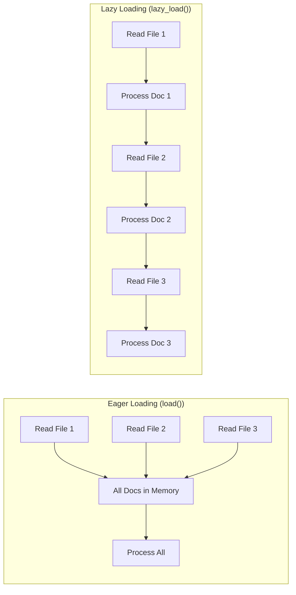

# Loader Fundamentals

## Introduction

Before loading your first document, you need to understand LangChain's core abstractions. Every document loader—whether it reads PDFs, scrapes websites, or queries databases—produces the same output: `Document` objects. This consistency is what makes LangChain's pipeline so powerful.

In this lesson, we'll explore the foundational concepts that every loader relies on: the `Document` class that standardizes content representation, the `BaseLoader` interface that defines how loaders work, and the lazy loading pattern that enables memory-efficient processing of large datasets.

### What We'll Cover

- The `Document` class: structure, fields, and best practices
- The `BaseLoader` abstract base class and its key methods
- Lazy loading vs. eager loading patterns
- The `Blob` abstraction for raw data handling
- Metadata strategies and conventions
- Document identity and deduplication

### Prerequisites

- Python knowledge: classes, generators, abstract base classes
- Completed [LangChain Fundamentals](../01-langchain-fundamentals/00-langchain-fundamentals.md)
- Basic understanding of file I/O operations

---

## The Document Class

The `Document` class is the universal container for content in LangChain. Every loader, text splitter, retriever, and chain that handles text works with `Document` objects.

### Document Structure

```python
from langchain_core.documents import Document

# Create a document with content and metadata
doc = Document(
    page_content="LangChain is a framework for developing applications powered by language models.",
    metadata={
        "source": "langchain_docs/introduction.md",
        "author": "LangChain Team",
        "date": "2024-01-15",
        "page": 1
    },
    id="doc_001"  # Optional unique identifier
)

print(f"Content: {doc.page_content}")
print(f"Metadata: {doc.metadata}")
print(f"ID: {doc.id}")
```

**Output:**
```
Content: LangChain is a framework for developing applications powered by language models.
Metadata: {'source': 'langchain_docs/introduction.md', 'author': 'LangChain Team', 'date': '2024-01-15', 'page': 1}
ID: doc_001
```

### Document Properties

| Property | Type | Required | Description |
|----------|------|----------|-------------|
| `page_content` | `str` | Yes | The actual text content |
| `metadata` | `dict[str, Any]` | Yes (default: `{}`) | Arbitrary metadata about the content |
| `id` | `str \| None` | No | Unique identifier for deduplication |
| `type` | `Literal["Document"]` | Auto | Type discriminator for serialization |

### Working with Documents

```python
from langchain_core.documents import Document

# Documents are immutable by default - create new ones instead of modifying
original = Document(
    page_content="Original content",
    metadata={"version": 1}
)

# Create a modified copy
updated = Document(
    page_content=original.page_content + " with additions",
    metadata={**original.metadata, "version": 2}
)

print(f"Original: {original.metadata['version']}")
print(f"Updated: {updated.metadata['version']}")
```

**Output:**
```
Original: 1
Updated: 2
```

### Document Comparison

Documents support equality comparison based on their content:

```python
from langchain_core.documents import Document

doc1 = Document(page_content="Hello", metadata={"source": "a"})
doc2 = Document(page_content="Hello", metadata={"source": "a"})
doc3 = Document(page_content="Hello", metadata={"source": "b"})

print(f"doc1 == doc2: {doc1 == doc2}")  # Same content and metadata
print(f"doc1 == doc3: {doc1 == doc3}")  # Different metadata
```

**Output:**
```
doc1 == doc2: True
doc1 == doc3: False
```

> **Note:** Two documents are equal if both `page_content` AND `metadata` match. The `id` field is excluded from comparison.

---

## The BaseLoader Interface

All document loaders inherit from `BaseLoader`, an abstract base class that defines the standard interface for loading documents.

### BaseLoader Methods

```python
from abc import ABC, abstractmethod
from typing import Iterator, AsyncIterator
from langchain_core.documents import Document

class BaseLoader(ABC):
    """Abstract base class for document loaders."""
    
    @abstractmethod
    def lazy_load(self) -> Iterator[Document]:
        """Load documents lazily (one at a time)."""
        pass
    
    def load(self) -> list[Document]:
        """Load all documents into memory."""
        return list(self.lazy_load())
    
    async def alazy_load(self) -> AsyncIterator[Document]:
        """Async lazy loading (yields documents one at a time)."""
        # Default implementation - override for true async
        for doc in self.lazy_load():
            yield doc
    
    async def aload(self) -> list[Document]:
        """Async version of load()."""
        return [doc async for doc in self.alazy_load()]
    
    def load_and_split(
        self, 
        text_splitter=None
    ) -> list[Document]:
        """Load and optionally split documents."""
        from langchain_text_splitters import RecursiveCharacterTextSplitter
        
        if text_splitter is None:
            text_splitter = RecursiveCharacterTextSplitter()
        
        docs = self.load()
        return text_splitter.split_documents(docs)
```

### Method Comparison

| Method | Returns | Memory Usage | Use Case |
|--------|---------|--------------|----------|
| `lazy_load()` | `Iterator[Document]` | Low (one at a time) | Large datasets, streaming |
| `load()` | `list[Document]` | High (all in memory) | Small datasets, convenience |
| `alazy_load()` | `AsyncIterator[Document]` | Low | Async contexts, I/O bound |
| `aload()` | `list[Document]` | High | Async contexts, convenience |
| `load_and_split()` | `list[Document]` | High | Direct to vector store |

### Using a Loader

```python
from langchain_community.document_loaders import TextLoader

# Create a sample file for demonstration
with open("sample.txt", "w") as f:
    f.write("Line 1: Introduction to document loading.\n")
    f.write("Line 2: LangChain makes it easy.\n")
    f.write("Line 3: Let's get started!")

# Initialize the loader
loader = TextLoader("sample.txt")

# Option 1: Eager loading (all at once)
docs = loader.load()
print(f"Loaded {len(docs)} document(s)")
print(f"Content: {docs[0].page_content[:50]}...")

# Option 2: Lazy loading (one at a time)
for doc in loader.lazy_load():
    print(f"Processing: {doc.metadata['source']}")
```

**Output:**
```
Loaded 1 document(s)
Content: Line 1: Introduction to document loading.
Line ...
Processing: sample.txt
```

---

## Lazy Loading Pattern

Lazy loading is the preferred pattern for handling large datasets. Instead of loading everything into memory, the loader yields documents one at a time.

### Why Lazy Loading Matters



### Memory Comparison Example

```python
from langchain_community.document_loaders import DirectoryLoader
import sys

# Imagine loading 1000 large documents

# EAGER: All documents loaded into memory at once
# Memory usage: ~1000 * document_size
def eager_approach(loader):
    docs = loader.load()  # All in memory!
    for doc in docs:
        yield doc

# LAZY: One document in memory at a time
# Memory usage: ~1 * document_size
def lazy_approach(loader):
    for doc in loader.lazy_load():  # One at a time
        yield doc

# The lazy approach can handle datasets larger than RAM
```

### Implementing Lazy Loading

When creating custom loaders, always implement `lazy_load()` first:

```python
from langchain_core.document_loaders import BaseLoader
from langchain_core.documents import Document
from typing import Iterator
import os

class DirectoryTextLoader(BaseLoader):
    """Custom loader that lazily loads text files from a directory."""
    
    def __init__(self, directory: str):
        self.directory = directory
    
    def lazy_load(self) -> Iterator[Document]:
        """Yield documents one at a time."""
        for filename in os.listdir(self.directory):
            if filename.endswith('.txt'):
                filepath = os.path.join(self.directory, filename)
                
                with open(filepath, 'r', encoding='utf-8') as f:
                    content = f.read()
                
                yield Document(
                    page_content=content,
                    metadata={
                        "source": filepath,
                        "filename": filename
                    }
                )
    
    # load() is inherited from BaseLoader and calls lazy_load()
```

### Async Lazy Loading

For I/O-bound operations, use async lazy loading:

```python
from langchain_core.document_loaders import BaseLoader
from langchain_core.documents import Document
from typing import AsyncIterator
import aiofiles
import asyncio
import os

class AsyncDirectoryLoader(BaseLoader):
    """Async loader for text files."""
    
    def __init__(self, directory: str):
        self.directory = directory
    
    def lazy_load(self):
        """Sync version - runs async code in event loop."""
        loop = asyncio.get_event_loop()
        async_gen = self.alazy_load()
        while True:
            try:
                yield loop.run_until_complete(async_gen.__anext__())
            except StopAsyncIteration:
                break
    
    async def alazy_load(self) -> AsyncIterator[Document]:
        """True async loading."""
        for filename in os.listdir(self.directory):
            if filename.endswith('.txt'):
                filepath = os.path.join(self.directory, filename)
                
                async with aiofiles.open(filepath, 'r') as f:
                    content = await f.read()
                
                yield Document(
                    page_content=content,
                    metadata={"source": filepath}
                )

# Usage in async context
async def main():
    loader = AsyncDirectoryLoader("./docs")
    async for doc in loader.alazy_load():
        print(f"Loaded: {doc.metadata['source']}")
```

---

## The Blob Abstraction

`Blob` is a lower-level abstraction representing raw binary or text data. Some loaders use blobs as an intermediate step before parsing into documents.

### Blob Class Overview

```python
from langchain_core.document_loaders import Blob

# Create blob from file
blob = Blob.from_path("document.pdf")

print(f"Source: {blob.source}")
print(f"Mimetype: {blob.mimetype}")
print(f"Encoding: {blob.encoding}")

# Access content
text = blob.as_string()      # For text content
binary = blob.as_bytes()     # For binary content
stream = blob.as_bytes_io()  # For streaming
```

### Blob Properties

| Property | Type | Description |
|----------|------|-------------|
| `data` | `bytes \| str \| None` | Raw content (if loaded in memory) |
| `path` | `PathLike \| None` | Path to source file |
| `source` | `str` | Identifier (path or description) |
| `mimetype` | `str \| None` | MIME type (e.g., "application/pdf") |
| `encoding` | `str` | Text encoding (default: "utf-8") |
| `metadata` | `dict` | Additional metadata |

### Creating Blobs

```python
from langchain_core.document_loaders import Blob
import tempfile
import os

# From file path (lazy - reads on demand)
blob_from_file = Blob.from_path("sample.txt")

# From raw data (eager - data in memory)
blob_from_data = Blob.from_data(
    data=b"Binary content here",
    mime_type="application/octet-stream"
)

# From string
text_blob = Blob(
    data="Text content",
    encoding="utf-8",
    mimetype="text/plain"
)

print(f"File blob source: {blob_from_file.source}")
print(f"Data blob mimetype: {blob_from_data.mimetype}")
```

### Blob Parser Pattern

Blobs are often used with parsers that convert raw data into documents:

```python
from langchain_core.document_loaders import Blob, BaseBlobParser
from langchain_core.documents import Document
from typing import Iterator

class SimpleTextParser(BaseBlobParser):
    """Parse text blobs into documents."""
    
    def lazy_parse(self, blob: Blob) -> Iterator[Document]:
        """Parse blob content into documents."""
        text = blob.as_string()
        
        # Split by paragraphs
        paragraphs = text.split('\n\n')
        
        for i, para in enumerate(paragraphs):
            if para.strip():
                yield Document(
                    page_content=para.strip(),
                    metadata={
                        "source": blob.source,
                        "paragraph": i + 1,
                        "mimetype": blob.mimetype
                    }
                )

# Usage
blob = Blob.from_path("article.txt")
parser = SimpleTextParser()

for doc in parser.lazy_parse(blob):
    print(f"Paragraph {doc.metadata['paragraph']}: {doc.page_content[:50]}...")
```

---

## Metadata Strategies

Metadata is often more important than the content itself for retrieval and filtering. Well-designed metadata enables powerful search and attribution.

### Common Metadata Fields

| Field | Type | Description | Example |
|-------|------|-------------|---------|
| `source` | `str` | Origin of the content | `"docs/guide.pdf"` |
| `page` | `int` | Page number in document | `5` |
| `row` | `int` | Row number (for CSVs) | `42` |
| `line` | `int` | Line number | `156` |
| `chunk_id` | `str` | ID after text splitting | `"doc1_chunk_3"` |
| `title` | `str` | Document title | `"User Guide"` |
| `author` | `str` | Content author | `"Jane Doe"` |
| `created_at` | `str` | Creation timestamp | `"2024-01-15T10:30:00Z"` |
| `language` | `str` | Content language | `"en"` |

### Metadata Best Practices

```python
from langchain_core.documents import Document
from datetime import datetime
import hashlib

def create_document_with_metadata(
    content: str,
    source: str,
    **extra_metadata
) -> Document:
    """Create a document with standardized metadata."""
    
    # Generate content hash for deduplication
    content_hash = hashlib.md5(content.encode()).hexdigest()
    
    # Standard metadata
    metadata = {
        "source": source,
        "content_hash": content_hash,
        "loaded_at": datetime.utcnow().isoformat(),
        "char_count": len(content),
        "word_count": len(content.split()),
    }
    
    # Add any extra metadata
    metadata.update(extra_metadata)
    
    return Document(
        page_content=content,
        metadata=metadata,
        id=content_hash  # Use hash as ID for deduplication
    )

# Usage
doc = create_document_with_metadata(
    content="This is the document content...",
    source="reports/q1_2024.pdf",
    author="Finance Team",
    department="Finance",
    confidentiality="internal"
)

print(doc.metadata)
```

**Output:**
```python
{
    'source': 'reports/q1_2024.pdf',
    'content_hash': 'a1b2c3d4e5f6...',
    'loaded_at': '2024-01-15T10:30:00.000000',
    'char_count': 32,
    'word_count': 5,
    'author': 'Finance Team',
    'department': 'Finance',
    'confidentiality': 'internal'
}
```

### Hierarchical Metadata

For complex documents, use nested structures:

```python
from langchain_core.documents import Document

# For a PDF with multiple sections
doc = Document(
    page_content="Content from section 2.1...",
    metadata={
        "source": "manual.pdf",
        "hierarchy": {
            "chapter": "2",
            "chapter_title": "Getting Started",
            "section": "2.1",
            "section_title": "Installation"
        },
        "page_range": {"start": 15, "end": 17},
        "tags": ["installation", "setup", "prerequisites"]
    }
)
```

### Metadata for Filtering

Design metadata with retrieval in mind:

```python
from langchain_core.documents import Document

# Documents designed for filtered retrieval
docs = [
    Document(
        page_content="Python installation guide...",
        metadata={
            "language": "python",
            "doc_type": "tutorial",
            "difficulty": "beginner",
            "updated": "2024-01"
        }
    ),
    Document(
        page_content="Advanced Python decorators...",
        metadata={
            "language": "python",
            "doc_type": "reference",
            "difficulty": "advanced",
            "updated": "2024-02"
        }
    ),
    Document(
        page_content="JavaScript async patterns...",
        metadata={
            "language": "javascript",
            "doc_type": "tutorial",
            "difficulty": "intermediate",
            "updated": "2024-01"
        }
    )
]

# Filter by metadata during retrieval
def filter_docs(docs, **filters):
    """Filter documents by metadata fields."""
    result = []
    for doc in docs:
        if all(doc.metadata.get(k) == v for k, v in filters.items()):
            result.append(doc)
    return result

# Find all Python tutorials
python_tutorials = filter_docs(docs, language="python", doc_type="tutorial")
print(f"Found {len(python_tutorials)} Python tutorials")
```

**Output:**
```
Found 1 Python tutorials
```

---

## Document Identity and Deduplication

When loading documents from multiple sources or reloading updated content, deduplication becomes essential.

### Using Document IDs

```python
from langchain_core.documents import Document
import hashlib

def generate_doc_id(content: str, source: str) -> str:
    """Generate a unique ID for a document."""
    # Combine content and source for uniqueness
    unique_string = f"{source}:{content}"
    return hashlib.sha256(unique_string.encode()).hexdigest()[:16]

# Create documents with IDs
doc1 = Document(
    page_content="Important content",
    metadata={"source": "file1.txt"},
    id=generate_doc_id("Important content", "file1.txt")
)

doc2 = Document(
    page_content="Important content",  # Same content
    metadata={"source": "file2.txt"},  # Different source
    id=generate_doc_id("Important content", "file2.txt")
)

print(f"Doc1 ID: {doc1.id}")
print(f"Doc2 ID: {doc2.id}")
print(f"IDs match: {doc1.id == doc2.id}")  # Different sources = different IDs
```

**Output:**
```
Doc1 ID: 8a7b6c5d4e3f2a1b
Doc2 ID: 1a2b3c4d5e6f7a8b
IDs match: False
```

### Deduplication Strategies

```python
from langchain_core.documents import Document
from typing import List
from collections import defaultdict

def deduplicate_by_id(docs: List[Document]) -> List[Document]:
    """Remove duplicates keeping the first occurrence."""
    seen = set()
    unique = []
    
    for doc in docs:
        doc_id = doc.id or hash(doc.page_content)
        if doc_id not in seen:
            seen.add(doc_id)
            unique.append(doc)
    
    return unique

def deduplicate_by_content(docs: List[Document]) -> List[Document]:
    """Remove duplicates based on content hash."""
    seen_hashes = {}
    unique = []
    
    for doc in docs:
        content_hash = hashlib.md5(doc.page_content.encode()).hexdigest()
        
        if content_hash not in seen_hashes:
            seen_hashes[content_hash] = doc
            unique.append(doc)
    
    return unique

def deduplicate_merge_metadata(docs: List[Document]) -> List[Document]:
    """Merge metadata when content matches."""
    content_to_docs = defaultdict(list)
    
    for doc in docs:
        content_to_docs[doc.page_content].append(doc)
    
    unique = []
    for content, matching_docs in content_to_docs.items():
        # Merge all metadata
        merged_metadata = {}
        sources = []
        
        for doc in matching_docs:
            merged_metadata.update(doc.metadata)
            if "source" in doc.metadata:
                sources.append(doc.metadata["source"])
        
        merged_metadata["sources"] = sources
        
        unique.append(Document(
            page_content=content,
            metadata=merged_metadata
        ))
    
    return unique
```

---

## Best Practices

| Practice | Why It Matters |
|----------|----------------|
| Always use `lazy_load()` for large datasets | Prevents memory exhaustion |
| Include `source` in metadata | Essential for attribution and debugging |
| Generate consistent document IDs | Enables reliable deduplication |
| Validate content before creating Document | Prevents empty or malformed documents |
| Use appropriate encoding | Prevents character corruption |
| Log loader errors, don't fail silently | Helps identify problematic files |

---

## Common Pitfalls

| ❌ Mistake | ✅ Solution |
|-----------|-------------|
| Using `load()` for thousands of files | Use `lazy_load()` and process incrementally |
| Ignoring metadata | Include source, timestamps, and filtering keys |
| Not handling encoding errors | Specify encoding or use error handling |
| Creating documents with empty content | Validate content before creating Document |
| Hardcoding file paths in metadata | Use relative paths or normalize paths |

---

## Hands-on Exercise

### Your Task

Build a document loader utility that:
1. Creates properly structured `Document` objects
2. Implements lazy loading
3. Generates unique IDs for deduplication
4. Adds comprehensive metadata

### Requirements

1. Create a function `load_text_files(directory)` that:
   - Lazily loads all `.txt` files from a directory
   - Generates unique IDs based on content + source
   - Includes metadata: source, filename, size, word_count, loaded_at
   
2. Create a function `deduplicate_documents(docs)` that:
   - Removes duplicate documents by content hash
   - Preserves the first occurrence

3. Test with sample files

### Expected Result

```python
# After running your code:
docs = list(load_text_files("./sample_docs"))
print(f"Loaded: {len(docs)} documents")
print(f"First doc metadata: {docs[0].metadata}")

unique_docs = deduplicate_documents(docs)
print(f"After deduplication: {len(unique_docs)} documents")
```

<details>
<summary>💡 Hints (click to expand)</summary>

- Use `os.listdir()` and `os.path.getsize()` for file operations
- Use `hashlib.md5()` for content hashing
- Remember to use `yield` for lazy loading
- Use `datetime.utcnow().isoformat()` for timestamps
- Consider using a generator expression in the deduplication function

</details>

<details>
<summary>✅ Solution (click to expand)</summary>

```python
from langchain_core.documents import Document
from typing import Iterator, List
from datetime import datetime
import hashlib
import os

def load_text_files(directory: str) -> Iterator[Document]:
    """Lazily load text files with comprehensive metadata."""
    for filename in sorted(os.listdir(directory)):
        if not filename.endswith('.txt'):
            continue
            
        filepath = os.path.join(directory, filename)
        
        try:
            with open(filepath, 'r', encoding='utf-8') as f:
                content = f.read()
            
            # Skip empty files
            if not content.strip():
                continue
            
            # Generate unique ID
            content_hash = hashlib.md5(
                f"{filepath}:{content}".encode()
            ).hexdigest()
            
            yield Document(
                page_content=content,
                metadata={
                    "source": filepath,
                    "filename": filename,
                    "size_bytes": os.path.getsize(filepath),
                    "word_count": len(content.split()),
                    "char_count": len(content),
                    "loaded_at": datetime.utcnow().isoformat()
                },
                id=content_hash[:16]
            )
        except Exception as e:
            print(f"Warning: Could not load {filepath}: {e}")

def deduplicate_documents(docs: List[Document]) -> List[Document]:
    """Remove duplicates by content hash, keeping first occurrence."""
    seen = {}
    unique = []
    
    for doc in docs:
        content_hash = hashlib.md5(doc.page_content.encode()).hexdigest()
        
        if content_hash not in seen:
            seen[content_hash] = True
            unique.append(doc)
    
    return unique

# Test the implementation
if __name__ == "__main__":
    # Create sample directory and files
    os.makedirs("sample_docs", exist_ok=True)
    
    files = {
        "doc1.txt": "This is the first document.",
        "doc2.txt": "This is the second document.",
        "doc3.txt": "This is the first document.",  # Duplicate content
    }
    
    for name, content in files.items():
        with open(f"sample_docs/{name}", "w") as f:
            f.write(content)
    
    # Load and deduplicate
    docs = list(load_text_files("sample_docs"))
    print(f"Loaded: {len(docs)} documents")
    
    for doc in docs:
        print(f"  - {doc.metadata['filename']}: {doc.page_content[:30]}...")
    
    unique = deduplicate_documents(docs)
    print(f"\nAfter deduplication: {len(unique)} documents")
    
    # Cleanup
    import shutil
    shutil.rmtree("sample_docs")
```

**Output:**
```
Loaded: 3 documents
  - doc1.txt: This is the first document...
  - doc2.txt: This is the second document...
  - doc3.txt: This is the first document...

After deduplication: 2 documents
```

</details>

### Bonus Challenges

- [ ] Add async loading support with `aiofiles`
- [ ] Implement metadata merging for duplicates
- [ ] Add file type detection based on content
- [ ] Create a progress bar for large directories

---

## Summary

✅ `Document` is the universal container: `page_content` + `metadata` + optional `id`  
✅ `BaseLoader` defines the standard interface: `load()`, `lazy_load()`, and async variants  
✅ Always prefer `lazy_load()` for memory-efficient processing of large datasets  
✅ `Blob` provides low-level abstraction for raw file data  
✅ Well-designed metadata enables filtering, attribution, and deduplication  
✅ Use content-based IDs for reliable deduplication across loaders

**Next:** [Text File Loaders](./02-text-file-loaders.md)

---

## Navigation

| Previous | Up | Next |
|----------|-------|------|
| [Document Loaders Overview](./00-document-loaders.md) | [Document Loaders](./00-document-loaders.md) | [Text File Loaders](./02-text-file-loaders.md) |

---

<!-- 
Sources Consulted:
- LangChain Core documents/base.py: https://github.com/langchain-ai/langchain/tree/main/libs/core/langchain_core/documents/base.py
- LangChain Core document_loaders/base.py: https://github.com/langchain-ai/langchain/tree/main/libs/core/langchain_core/document_loaders/base.py
- LangChain Core document_loaders/blob_loaders.py: https://github.com/langchain-ai/langchain/tree/main/libs/core/langchain_core/document_loaders/blob_loaders.py
-->
