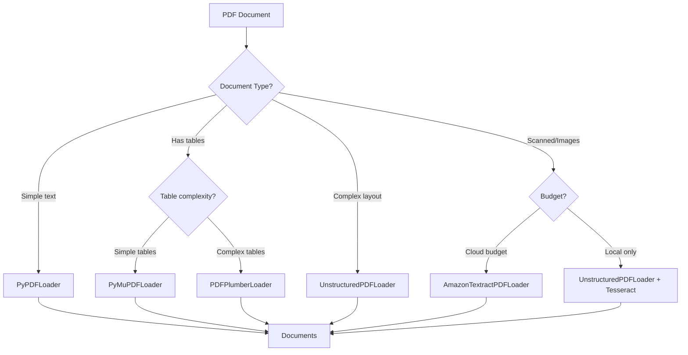

# PDF Loaders

## Introduction

PDF documents are ubiquitous in enterprise environments—research papers, contracts, reports, manuals, and invoices all come in PDF format. Unlike plain text, PDFs encode content in complex structures with fonts, images, tables, and layout information. LangChain provides multiple PDF loaders, each optimized for different use cases.

Choosing the right PDF loader significantly impacts extraction quality. Some excel at simple text PDFs, others handle scanned documents with OCR, and specialized loaders preserve table structures. In this lesson, we'll explore the full spectrum of PDF loading options.

### What We'll Cover

- `PyPDFLoader` for reliable page-by-page loading
- `PDFPlumberLoader` for table-heavy documents
- `PyMuPDFLoader` for fast processing
- `UnstructuredPDFLoader` for complex layouts
- OCR support for scanned PDFs
- Choosing the right loader for your use case
- Production patterns for PDF processing

### Prerequisites

- Completed [Text File Loaders](./02-text-file-loaders.md)
- Basic understanding of PDF document structure
- Familiarity with Python package installation

---

## PDF Loader Comparison

Before diving into each loader, here's a comparison to help you choose:

| Loader | Speed | Tables | Images | OCR | Dependencies | Best For |
|--------|-------|--------|--------|-----|--------------|----------|
| `PyPDFLoader` | ★★★★ | ★★ | ✗ | ✗ | `pypdf` | Simple text PDFs |
| `PDFPlumberLoader` | ★★★ | ★★★★★ | ✗ | ✗ | `pdfplumber` | Table extraction |
| `PyMuPDFLoader` | ★★★★★ | ★★★ | ★★★★ | ✗ | `pymupdf` | Speed, images |
| `PDFMinerLoader` | ★★ | ★★ | ✗ | ✗ | `pdfminer.six` | Layout preservation |
| `UnstructuredPDFLoader` | ★★ | ★★★★ | ★★★ | ★★★★ | `unstructured` | Complex documents |
| `AmazonTextractPDFLoader` | ★ | ★★★★★ | ★★★★★ | ★★★★★ | AWS SDK | Scanned docs, forms |



---

## PyPDFLoader

`PyPDFLoader` is the most commonly used PDF loader. It's reliable, fast, and creates one document per page with page numbers in metadata.

### Installation

```bash
pip install pypdf
```

### Basic Usage

```python
from langchain_community.document_loaders import PyPDFLoader

# Load a PDF file
loader = PyPDFLoader("sample.pdf")
docs = loader.load()

print(f"Loaded {len(docs)} pages")

# Each page is a separate document
for doc in docs[:3]:  # First 3 pages
    print(f"\n--- Page {doc.metadata['page']} ---")
    print(f"Source: {doc.metadata['source']}")
    print(f"Content preview: {doc.page_content[:200]}...")
```

**Output:**
```
Loaded 15 pages

--- Page 0 ---
Source: sample.pdf
Content preview: Introduction to Machine Learning

Machine learning is a subset of artificial intelligence...

--- Page 1 ---
Source: sample.pdf
Content preview: Chapter 1: Supervised Learning

In supervised learning, the algorithm learns from labeled...

--- Page 2 ---
Source: sample.pdf
Content preview: 1.1 Classification

Classification is the task of predicting a discrete class label...
```

> **Note:** Page numbers are 0-indexed in `pypdf`. The first page is page 0.

### PyPDFLoader Options

```python
from langchain_community.document_loaders import PyPDFLoader

# Extract images along with text
loader = PyPDFLoader(
    "document_with_images.pdf",
    extract_images=True  # Requires additional dependencies
)

# Load with password for encrypted PDFs
loader = PyPDFLoader(
    "encrypted.pdf",
    password="secret123"
)
```

### PyPDFDirectoryLoader

Load all PDFs from a directory:

```python
from langchain_community.document_loaders import PyPDFDirectoryLoader

# Load all PDFs in a directory
loader = PyPDFDirectoryLoader("./pdf_documents/")
docs = loader.load()

print(f"Loaded {len(docs)} pages from all PDFs")

# Group by source file
from collections import Counter
sources = Counter(doc.metadata['source'] for doc in docs)
for source, count in sources.items():
    print(f"  {source}: {count} pages")
```

**Output:**
```
Loaded 127 pages from all PDFs
  ./pdf_documents/report.pdf: 45 pages
  ./pdf_documents/manual.pdf: 67 pages
  ./pdf_documents/summary.pdf: 15 pages
```

### Lazy Loading with PyPDF

```python
from langchain_community.document_loaders import PyPDFLoader

loader = PyPDFLoader("large_document.pdf")

# Process pages one at a time (memory efficient)
for page_doc in loader.lazy_load():
    page_num = page_doc.metadata['page']
    
    # Process only pages with specific content
    if "conclusion" in page_doc.page_content.lower():
        print(f"Found conclusion on page {page_num}")
        process_conclusion(page_doc)
        break
```

---

## PDFPlumberLoader

`PDFPlumberLoader` excels at extracting structured data from PDFs, especially tables. It uses the `pdfplumber` library which provides precise text positioning.

### Installation

```bash
pip install pdfplumber
```

### Basic Usage

```python
from langchain_community.document_loaders import PDFPlumberLoader

loader = PDFPlumberLoader("financial_report.pdf")
docs = loader.load()

print(f"Loaded {len(docs)} pages")
print(f"\nPage 1 content:\n{docs[0].page_content[:500]}")
```

### Table Extraction

PDFPlumber's main strength is table extraction:

```python
import pdfplumber
from langchain_core.documents import Document

def load_pdf_with_tables(filepath: str) -> list[Document]:
    """Load PDF with explicit table extraction."""
    documents = []
    
    with pdfplumber.open(filepath) as pdf:
        for page_num, page in enumerate(pdf.pages):
            # Extract regular text
            text = page.extract_text() or ""
            
            # Extract tables
            tables = page.extract_tables()
            table_text = ""
            
            for i, table in enumerate(tables):
                table_text += f"\n\n[Table {i+1}]\n"
                for row in table:
                    # Clean None values
                    cleaned_row = [cell or "" for cell in row]
                    table_text += " | ".join(cleaned_row) + "\n"
            
            # Combine text and tables
            full_content = text + table_text
            
            documents.append(Document(
                page_content=full_content,
                metadata={
                    "source": filepath,
                    "page": page_num,
                    "has_tables": len(tables) > 0,
                    "table_count": len(tables)
                }
            ))
    
    return documents

# Usage
docs = load_pdf_with_tables("quarterly_report.pdf")

# Find pages with tables
table_pages = [d for d in docs if d.metadata['has_tables']]
print(f"Found {len(table_pages)} pages with tables")
```

### Advanced Table Extraction

```python
import pdfplumber
import pandas as pd

def extract_tables_as_dataframes(filepath: str) -> dict:
    """Extract all tables as pandas DataFrames."""
    all_tables = {}
    
    with pdfplumber.open(filepath) as pdf:
        for page_num, page in enumerate(pdf.pages):
            tables = page.extract_tables()
            
            for table_idx, table in enumerate(tables):
                if not table or len(table) < 2:
                    continue
                
                # First row as header
                header = table[0]
                data = table[1:]
                
                # Create DataFrame
                df = pd.DataFrame(data, columns=header)
                
                key = f"page_{page_num}_table_{table_idx}"
                all_tables[key] = df
    
    return all_tables

# Usage
tables = extract_tables_as_dataframes("data_report.pdf")

for name, df in tables.items():
    print(f"\n{name}:")
    print(df.head())
```

### PDFPlumber Settings

Fine-tune extraction with settings:

```python
import pdfplumber

def load_with_custom_settings(filepath: str) -> list:
    """Load PDF with customized extraction settings."""
    
    # Table extraction settings
    table_settings = {
        "vertical_strategy": "text",
        "horizontal_strategy": "text",
        "snap_tolerance": 3,
        "snap_x_tolerance": 3,
        "snap_y_tolerance": 3,
        "join_tolerance": 3,
        "edge_min_length": 3,
        "min_words_vertical": 3,
        "min_words_horizontal": 1,
    }
    
    documents = []
    
    with pdfplumber.open(filepath) as pdf:
        for page_num, page in enumerate(pdf.pages):
            # Use custom settings for table extraction
            tables = page.extract_tables(table_settings)
            text = page.extract_text()
            
            documents.append({
                "page": page_num,
                "text": text,
                "tables": tables
            })
    
    return documents
```

---

## PyMuPDFLoader

`PyMuPDFLoader` (using the `pymupdf` library, formerly `fitz`) is the fastest PDF loader and can extract images.

### Installation

```bash
pip install pymupdf
```

### Basic Usage

```python
from langchain_community.document_loaders import PyMuPDFLoader

loader = PyMuPDFLoader("report.pdf")
docs = loader.load()

print(f"Loaded {len(docs)} pages")

# PyMuPDF provides rich metadata
for doc in docs[:2]:
    print(f"\nPage {doc.metadata['page']}:")
    print(f"  Source: {doc.metadata['source']}")
    print(f"  File path: {doc.metadata.get('file_path')}")
    print(f"  Total pages: {doc.metadata.get('total_pages')}")
```

### Image Extraction with PyMuPDF

```python
import fitz  # PyMuPDF
from langchain_core.documents import Document
import os

def load_pdf_with_images(
    filepath: str,
    image_output_dir: str = "./extracted_images"
) -> list[Document]:
    """Load PDF and extract images."""
    os.makedirs(image_output_dir, exist_ok=True)
    
    documents = []
    doc = fitz.open(filepath)
    
    for page_num in range(len(doc)):
        page = doc[page_num]
        
        # Extract text
        text = page.get_text()
        
        # Extract images
        image_list = page.get_images()
        image_refs = []
        
        for img_idx, img in enumerate(image_list):
            xref = img[0]
            base_image = doc.extract_image(xref)
            image_bytes = base_image["image"]
            image_ext = base_image["ext"]
            
            # Save image
            image_filename = f"page{page_num}_img{img_idx}.{image_ext}"
            image_path = os.path.join(image_output_dir, image_filename)
            
            with open(image_path, "wb") as f:
                f.write(image_bytes)
            
            image_refs.append(image_path)
        
        documents.append(Document(
            page_content=text,
            metadata={
                "source": filepath,
                "page": page_num,
                "images": image_refs,
                "image_count": len(image_refs)
            }
        ))
    
    doc.close()
    return documents

# Usage
docs = load_pdf_with_images("illustrated_guide.pdf")

for doc in docs:
    if doc.metadata['image_count'] > 0:
        print(f"Page {doc.metadata['page']}: {doc.metadata['image_count']} images")
        for img_path in doc.metadata['images']:
            print(f"  - {img_path}")
```

### Speed Comparison

```python
import time
from langchain_community.document_loaders import (
    PyPDFLoader,
    PDFPlumberLoader,
    PyMuPDFLoader
)

def benchmark_loaders(filepath: str):
    """Compare loading speed of different PDF loaders."""
    loaders = {
        "PyPDF": PyPDFLoader,
        "PDFPlumber": PDFPlumberLoader,
        "PyMuPDF": PyMuPDFLoader
    }
    
    results = {}
    
    for name, LoaderClass in loaders.items():
        try:
            start = time.time()
            loader = LoaderClass(filepath)
            docs = loader.load()
            elapsed = time.time() - start
            
            results[name] = {
                "time": elapsed,
                "pages": len(docs),
                "chars": sum(len(d.page_content) for d in docs)
            }
        except Exception as e:
            results[name] = {"error": str(e)}
    
    return results

# Run benchmark
results = benchmark_loaders("large_document.pdf")

print("PDF Loader Benchmark:")
print("-" * 50)
for name, data in results.items():
    if "error" in data:
        print(f"{name}: ERROR - {data['error']}")
    else:
        print(f"{name}: {data['time']:.2f}s | {data['pages']} pages | {data['chars']} chars")
```

**Sample Output:**
```
PDF Loader Benchmark:
--------------------------------------------------
PyPDF: 2.34s | 150 pages | 425000 chars
PDFPlumber: 8.67s | 150 pages | 428000 chars
PyMuPDF: 0.89s | 150 pages | 423000 chars
```

---

## UnstructuredPDFLoader

`UnstructuredPDFLoader` uses the `unstructured` library for intelligent document parsing. It can handle complex layouts, extract elements by type, and supports OCR.

### Installation

```bash
# Basic installation
pip install unstructured

# With PDF support
pip install "unstructured[pdf]"

# With all document types
pip install "unstructured[all-docs]"
```

### Basic Usage

```python
from langchain_community.document_loaders import UnstructuredPDFLoader

# Simple mode: entire document as one chunk
loader = UnstructuredPDFLoader("complex_document.pdf")
docs = loader.load()

print(f"Loaded as {len(docs)} document(s)")
print(f"Content preview: {docs[0].page_content[:300]}...")
```

### Element-Based Loading

```python
from langchain_community.document_loaders import UnstructuredPDFLoader

# Elements mode: separate document per element type
loader = UnstructuredPDFLoader(
    "research_paper.pdf",
    mode="elements"  # Returns individual elements
)

docs = loader.load()

# Analyze element types
from collections import Counter
categories = Counter(d.metadata.get('category', 'unknown') for d in docs)

print("Element breakdown:")
for category, count in categories.most_common():
    print(f"  {category}: {count}")
```

**Output:**
```
Element breakdown:
  NarrativeText: 45
  Title: 8
  ListItem: 23
  Table: 3
  Header: 7
  Footer: 7
```

### Strategies for Different PDFs

```python
from langchain_community.document_loaders import UnstructuredPDFLoader

# Strategy: "fast" - text extraction only (fastest)
fast_loader = UnstructuredPDFLoader(
    "text_only.pdf",
    strategy="fast"
)

# Strategy: "hi_res" - high resolution parsing (best quality, slower)
hires_loader = UnstructuredPDFLoader(
    "complex_layout.pdf",
    strategy="hi_res"
)

# Strategy: "ocr_only" - OCR for scanned documents
ocr_loader = UnstructuredPDFLoader(
    "scanned_document.pdf",
    strategy="ocr_only"
)

# Auto strategy: library chooses best approach
auto_loader = UnstructuredPDFLoader(
    "mixed_document.pdf",
    strategy="auto"
)
```

### OCR Configuration

```python
from langchain_community.document_loaders import UnstructuredPDFLoader

# Configure OCR settings
loader = UnstructuredPDFLoader(
    "scanned_contract.pdf",
    strategy="ocr_only",
    ocr_languages="eng+fra",  # English and French
    infer_table_structure=True,  # Attempt to detect tables
)

docs = loader.load()
print(f"OCR extracted {len(docs[0].page_content)} characters")
```

---

## PDF Parser Classes

For more control, use the underlying parser classes:

```python
from langchain_community.document_loaders.parsers.pdf import (
    PyPDFParser,
    PDFPlumberParser,
    PyMuPDFParser,
    PDFMinerParser
)
from langchain_core.document_loaders import Blob

# Create a blob from the PDF
blob = Blob.from_path("document.pdf")

# Use different parsers
parsers = {
    "PyPDF": PyPDFParser(),
    "PDFPlumber": PDFPlumberParser(),
    "PyMuPDF": PyMuPDFParser(),
    "PDFMiner": PDFMinerParser()
}

for name, parser in parsers.items():
    docs = list(parser.lazy_parse(blob))
    total_chars = sum(len(d.page_content) for d in docs)
    print(f"{name}: {len(docs)} pages, {total_chars} chars")
```

### Custom PDF Processing Pipeline

```python
from langchain_core.document_loaders import Blob, BaseBlobParser
from langchain_core.documents import Document
from typing import Iterator
import fitz  # PyMuPDF

class EnhancedPDFParser(BaseBlobParser):
    """Custom PDF parser with enhanced features."""
    
    def __init__(
        self,
        extract_images: bool = False,
        extract_links: bool = True,
        min_text_length: int = 10
    ):
        self.extract_images = extract_images
        self.extract_links = extract_links
        self.min_text_length = min_text_length
    
    def lazy_parse(self, blob: Blob) -> Iterator[Document]:
        """Parse PDF with enhanced metadata."""
        pdf_data = blob.as_bytes()
        doc = fitz.open(stream=pdf_data, filetype="pdf")
        
        # Document-level metadata
        pdf_metadata = doc.metadata
        
        for page_num in range(len(doc)):
            page = doc[page_num]
            
            # Extract text
            text = page.get_text()
            
            # Skip pages with minimal text
            if len(text.strip()) < self.min_text_length:
                continue
            
            # Build metadata
            metadata = {
                "source": blob.source,
                "page": page_num,
                "total_pages": len(doc),
                "pdf_title": pdf_metadata.get("title", ""),
                "pdf_author": pdf_metadata.get("author", ""),
                "pdf_created": pdf_metadata.get("creationDate", ""),
            }
            
            # Extract links
            if self.extract_links:
                links = page.get_links()
                urls = [link.get("uri", "") for link in links if link.get("uri")]
                metadata["links"] = urls
                metadata["link_count"] = len(urls)
            
            # Count images
            if self.extract_images:
                images = page.get_images()
                metadata["image_count"] = len(images)
            
            yield Document(
                page_content=text,
                metadata=metadata
            )
        
        doc.close()

# Usage
blob = Blob.from_path("research_paper.pdf")
parser = EnhancedPDFParser(extract_links=True, extract_images=True)

for doc in parser.lazy_parse(blob):
    print(f"Page {doc.metadata['page']}: "
          f"{doc.metadata['link_count']} links, "
          f"{doc.metadata.get('image_count', 0)} images")
```

---

## Production Patterns

### Pattern 1: Intelligent Loader Selection

```python
from langchain_community.document_loaders import (
    PyPDFLoader,
    PDFPlumberLoader,
    UnstructuredPDFLoader
)
from langchain_core.documents import Document
import fitz

def analyze_pdf(filepath: str) -> dict:
    """Analyze PDF to determine best loader."""
    doc = fitz.open(filepath)
    
    analysis = {
        "pages": len(doc),
        "has_text": False,
        "has_images": False,
        "has_tables": False,
        "is_scanned": False,
        "total_chars": 0,
        "total_images": 0
    }
    
    for page_num in range(min(5, len(doc))):  # Check first 5 pages
        page = doc[page_num]
        text = page.get_text()
        images = page.get_images()
        
        analysis["total_chars"] += len(text)
        analysis["total_images"] += len(images)
        
        if text.strip():
            analysis["has_text"] = True
        if images:
            analysis["has_images"] = True
        
        # Simple heuristic: if images but little text, likely scanned
        if images and len(text) < 100:
            analysis["is_scanned"] = True
    
    doc.close()
    return analysis

def select_loader(filepath: str) -> type:
    """Select the best loader based on PDF analysis."""
    analysis = analyze_pdf(filepath)
    
    if analysis["is_scanned"]:
        print(f"Detected scanned PDF → UnstructuredPDFLoader with OCR")
        return lambda f: UnstructuredPDFLoader(f, strategy="ocr_only")
    
    if analysis["has_tables"]:
        print(f"Detected tables → PDFPlumberLoader")
        return PDFPlumberLoader
    
    print(f"Standard PDF → PyPDFLoader")
    return PyPDFLoader

def smart_load_pdf(filepath: str) -> list[Document]:
    """Load PDF with automatically selected loader."""
    LoaderClass = select_loader(filepath)
    loader = LoaderClass(filepath)
    return loader.load()

# Usage
docs = smart_load_pdf("unknown_document.pdf")
print(f"Loaded {len(docs)} documents")
```

### Pattern 2: Batch PDF Processing

```python
from langchain_community.document_loaders import PyPDFLoader
from langchain_core.documents import Document
from concurrent.futures import ThreadPoolExecutor, as_completed
from dataclasses import dataclass
import os
import glob

@dataclass
class PDFLoadResult:
    filepath: str
    success: bool
    documents: list[Document] = None
    error: str = None
    page_count: int = 0

def load_single_pdf(filepath: str) -> PDFLoadResult:
    """Load a single PDF with error handling."""
    try:
        loader = PyPDFLoader(filepath)
        docs = loader.load()
        return PDFLoadResult(
            filepath=filepath,
            success=True,
            documents=docs,
            page_count=len(docs)
        )
    except Exception as e:
        return PDFLoadResult(
            filepath=filepath,
            success=False,
            error=str(e)
        )

def batch_load_pdfs(
    directory: str,
    max_workers: int = 4
) -> tuple[list[Document], list[PDFLoadResult]]:
    """Load all PDFs from directory in parallel."""
    
    pdf_files = glob.glob(os.path.join(directory, "**/*.pdf"), recursive=True)
    print(f"Found {len(pdf_files)} PDF files")
    
    all_documents = []
    failures = []
    
    with ThreadPoolExecutor(max_workers=max_workers) as executor:
        futures = {
            executor.submit(load_single_pdf, f): f 
            for f in pdf_files
        }
        
        for future in as_completed(futures):
            result = future.result()
            if result.success:
                all_documents.extend(result.documents)
                print(f"✓ {result.filepath}: {result.page_count} pages")
            else:
                failures.append(result)
                print(f"✗ {result.filepath}: {result.error}")
    
    return all_documents, failures

# Usage
docs, failures = batch_load_pdfs("./pdf_archive", max_workers=8)
print(f"\nTotal: {len(docs)} pages from PDFs")
print(f"Failed: {len(failures)} files")
```

### Pattern 3: PDF with Chunking Strategy

```python
from langchain_community.document_loaders import PyPDFLoader
from langchain_text_splitters import RecursiveCharacterTextSplitter
from langchain_core.documents import Document

def load_and_chunk_pdf(
    filepath: str,
    chunk_size: int = 1000,
    chunk_overlap: int = 200,
    preserve_page_boundaries: bool = True
) -> list[Document]:
    """Load PDF and chunk with smart options."""
    
    loader = PyPDFLoader(filepath)
    raw_docs = loader.load()
    
    splitter = RecursiveCharacterTextSplitter(
        chunk_size=chunk_size,
        chunk_overlap=chunk_overlap,
        separators=["\n\n", "\n", ". ", " ", ""]
    )
    
    if preserve_page_boundaries:
        # Split each page separately to preserve page metadata
        all_chunks = []
        for doc in raw_docs:
            page_chunks = splitter.split_documents([doc])
            
            # Add chunk index within page
            for i, chunk in enumerate(page_chunks):
                chunk.metadata["chunk_index"] = i
                chunk.metadata["chunks_in_page"] = len(page_chunks)
            
            all_chunks.extend(page_chunks)
        return all_chunks
    else:
        # Split across page boundaries
        return splitter.split_documents(raw_docs)

# Usage
chunks = load_and_chunk_pdf(
    "long_document.pdf",
    chunk_size=500,
    chunk_overlap=50,
    preserve_page_boundaries=True
)

print(f"Created {len(chunks)} chunks")

# Analyze chunk distribution
from collections import Counter
pages = Counter(c.metadata['page'] for c in chunks)
print(f"Chunks per page: min={min(pages.values())}, max={max(pages.values())}")
```

---

## Best Practices

| Practice | Why It Matters |
|----------|----------------|
| Benchmark loaders on your actual documents | Performance varies significantly by PDF type |
| Use `PyMuPDFLoader` for speed-critical applications | 3-10x faster than alternatives |
| Use `PDFPlumberLoader` for financial/tabular data | Best table extraction accuracy |
| Enable OCR only when needed | Adds significant processing time |
| Extract images separately if needed | Keeps text extraction fast |
| Preserve page metadata through chunking | Enables citation and navigation |

---

## Common Pitfalls

| ❌ Mistake | ✅ Solution |
|-----------|-------------|
| Using OCR loader for text PDFs | Check if PDF has selectable text first |
| Ignoring encrypted PDFs | Catch decryption errors, provide password option |
| Loading entire large PDFs at once | Use lazy loading or page limits |
| Discarding page numbers | Preserve for citation and debugging |
| Using one loader for all PDFs | Match loader to document characteristics |
| Not handling PDFs with form fields | Use UnstructuredPDFLoader for complex PDFs |

---

## Hands-on Exercise

### Your Task

Build a PDF processing utility that:
1. Analyzes a PDF to determine its characteristics
2. Selects the appropriate loader
3. Extracts text with metadata
4. Handles tables specially (if present)

### Requirements

1. Create an `analyze_pdf(filepath)` function that returns:
   - Page count
   - Whether it has images
   - Estimated text density
   - Recommended loader

2. Create a `process_pdf(filepath)` function that:
   - Uses the analysis to select a loader
   - Loads the document
   - Returns documents with enhanced metadata

3. Test with different PDF types

### Expected Result

```python
analysis = analyze_pdf("sample.pdf")
print(analysis)
# {'pages': 10, 'has_images': True, 'text_density': 'high', 'recommended': 'PyPDFLoader'}

docs = process_pdf("sample.pdf")
print(f"Loaded {len(docs)} pages")
```

<details>
<summary>💡 Hints (click to expand)</summary>

- Use `fitz` (PyMuPDF) for fast PDF analysis
- Calculate text density as characters per page
- Consider images-to-text ratio for scan detection
- Use a dictionary to map analysis results to loader classes
- Add timing information to metadata

</details>

<details>
<summary>✅ Solution (click to expand)</summary>

```python
from langchain_community.document_loaders import (
    PyPDFLoader,
    PDFPlumberLoader,
    PyMuPDFLoader
)
from langchain_core.documents import Document
import fitz
import time

def analyze_pdf(filepath: str) -> dict:
    """Analyze PDF characteristics."""
    doc = fitz.open(filepath)
    
    total_chars = 0
    total_images = 0
    total_tables = 0  # Approximation
    
    for page_num in range(len(doc)):
        page = doc[page_num]
        text = page.get_text()
        images = page.get_images()
        
        total_chars += len(text)
        total_images += len(images)
        
        # Simple table detection: look for tabular patterns
        lines = text.split('\n')
        for line in lines:
            if line.count('|') > 2 or line.count('\t') > 2:
                total_tables += 1
                break
    
    doc.close()
    
    # Calculate metrics
    pages = len(doc) if doc else 1
    chars_per_page = total_chars / pages
    images_per_page = total_images / pages
    
    # Determine text density
    if chars_per_page > 2000:
        text_density = "high"
    elif chars_per_page > 500:
        text_density = "medium"
    elif chars_per_page > 100:
        text_density = "low"
    else:
        text_density = "minimal"
    
    # Determine if scanned (images but little text)
    is_scanned = images_per_page > 0.5 and chars_per_page < 200
    
    # Recommend loader
    if is_scanned:
        recommended = "UnstructuredPDFLoader"
    elif total_tables > 0:
        recommended = "PDFPlumberLoader"
    elif total_images > pages * 2:
        recommended = "PyMuPDFLoader"  # Good with images
    else:
        recommended = "PyPDFLoader"  # Fast for text
    
    return {
        "pages": pages,
        "total_chars": total_chars,
        "total_images": total_images,
        "has_images": total_images > 0,
        "has_tables": total_tables > 0,
        "text_density": text_density,
        "is_scanned": is_scanned,
        "recommended": recommended
    }

def process_pdf(filepath: str) -> list[Document]:
    """Process PDF with automatically selected loader."""
    start_time = time.time()
    
    # Analyze
    analysis = analyze_pdf(filepath)
    print(f"Analysis: {analysis['recommended']} recommended")
    print(f"  Pages: {analysis['pages']}, Density: {analysis['text_density']}")
    
    # Select loader
    loader_map = {
        "PyPDFLoader": PyPDFLoader,
        "PDFPlumberLoader": PDFPlumberLoader,
        "PyMuPDFLoader": PyMuPDFLoader,
    }
    
    LoaderClass = loader_map.get(analysis['recommended'], PyPDFLoader)
    
    # Load
    loader = LoaderClass(filepath)
    docs = loader.load()
    
    # Enhance metadata
    load_time = time.time() - start_time
    
    for doc in docs:
        doc.metadata.update({
            "loader_used": analysis['recommended'],
            "load_time_seconds": round(load_time, 3),
            "pdf_has_images": analysis['has_images'],
            "pdf_has_tables": analysis['has_tables'],
            "pdf_text_density": analysis['text_density']
        })
    
    return docs

# Test
if __name__ == "__main__":
    import sys
    
    # Test with a sample PDF
    if len(sys.argv) > 1:
        filepath = sys.argv[1]
    else:
        # Create a test PDF
        doc = fitz.open()
        page = doc.new_page()
        page.insert_text((72, 72), "Sample PDF\n\nThis is test content.")
        doc.save("test_sample.pdf")
        doc.close()
        filepath = "test_sample.pdf"
    
    analysis = analyze_pdf(filepath)
    print(f"\n=== PDF Analysis ===")
    for key, value in analysis.items():
        print(f"  {key}: {value}")
    
    print(f"\n=== Processing ===")
    docs = process_pdf(filepath)
    print(f"\nLoaded {len(docs)} pages")
    
    if docs:
        print(f"\nFirst page metadata:")
        for key, value in docs[0].metadata.items():
            print(f"  {key}: {value}")
```

</details>

### Bonus Challenges

- [ ] Add table extraction and formatting for PDFPlumber
- [ ] Implement OCR fallback for low text density pages
- [ ] Create a PDF comparison report across loaders
- [ ] Add progress tracking for large PDFs

---

## Summary

✅ `PyPDFLoader` is the reliable default for most text PDFs  
✅ `PDFPlumberLoader` excels at table extraction  
✅ `PyMuPDFLoader` is fastest and handles images well  
✅ `UnstructuredPDFLoader` handles complex layouts and OCR  
✅ Analyze your PDFs before choosing a loader  
✅ Use lazy loading for large PDF collections  
✅ Preserve page numbers for citation and debugging

**Next:** [Web Loaders](./04-web-loaders.md)

---

## Navigation

| Previous | Up | Next |
|----------|-------|------|
| [Text File Loaders](./02-text-file-loaders.md) | [Document Loaders](./00-document-loaders.md) | [Web Loaders](./04-web-loaders.md) |

---

<!-- 
Sources Consulted:
- LangChain PyPDFLoader: https://github.com/langchain-ai/langchain/tree/main/libs/community/langchain_community/document_loaders/pdf.py
- LangChain PDF Parsers: https://github.com/langchain-ai/langchain/tree/main/libs/community/langchain_community/document_loaders/parsers/pdf.py
- pdfplumber documentation: https://github.com/jsvine/pdfplumber
- PyMuPDF documentation: https://pymupdf.readthedocs.io/
-->
