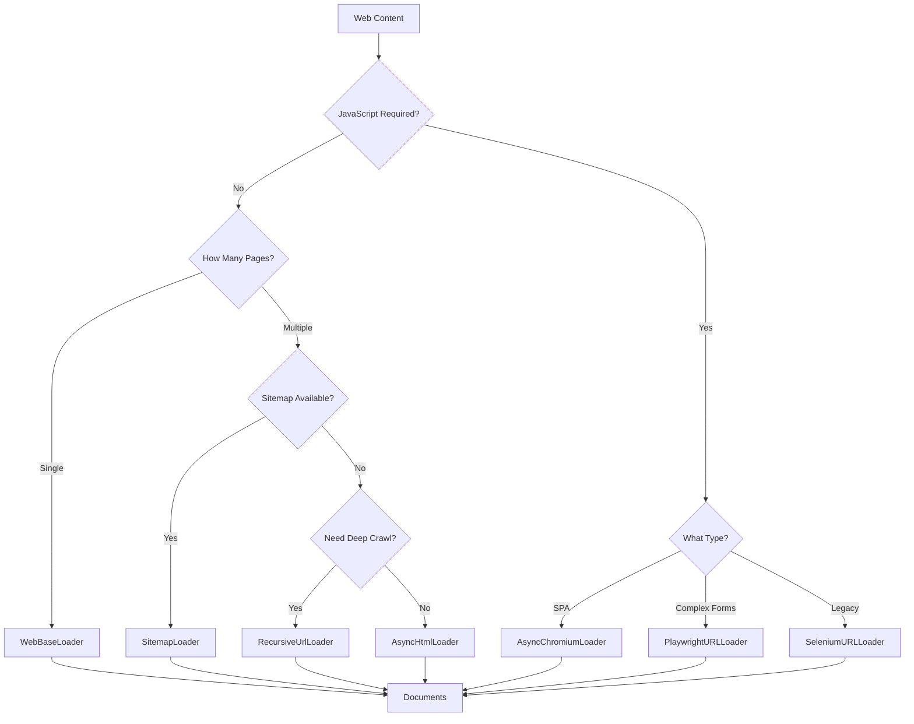

# Web Loaders

## Introduction

The web is an infinite source of knowledge for AI applications. From documentation sites to news articles, blogs to wikis—web content can dramatically enhance your AI's knowledge base. LangChain provides a comprehensive suite of web loaders that handle everything from simple HTML pages to complex JavaScript-rendered sites.

Web loading presents unique challenges: handling different HTML structures, dealing with JavaScript-rendered content, respecting robots.txt and rate limits, and crawling multiple pages efficiently. In this lesson, we'll master the tools and techniques for reliable web content extraction.

### What We'll Cover

- `WebBaseLoader` for simple HTML loading with BeautifulSoup
- `AsyncHtmlLoader` for concurrent page fetching
- `AsyncChromiumLoader` and browser-based loaders for JavaScript sites
- `SitemapLoader` for structured site crawling
- `RecursiveUrlLoader` for deep site crawling
- Rate limiting and ethical scraping practices
- Production patterns for web scraping

### Prerequisites

- Completed [Text File Loaders](./02-text-file-loaders.md)
- Basic understanding of HTML structure
- Familiarity with async/await patterns
- Understanding of HTTP requests

---

## Web Loader Comparison

Choose the right loader based on your target site:

| Loader | JavaScript | Speed | Async | Complexity | Best For |
|--------|------------|-------|-------|------------|----------|
| `WebBaseLoader` | ✗ | ★★★★ | ✗ | Low | Static HTML pages |
| `AsyncHtmlLoader` | ✗ | ★★★★★ | ✓ | Low | Bulk static pages |
| `AsyncChromiumLoader` | ✓ | ★★ | ✓ | Medium | SPA, JS-heavy sites |
| `PlaywrightURLLoader` | ✓ | ★★ | ✓ | Medium | Complex interactions |
| `SeleniumURLLoader` | ✓ | ★ | ✗ | Medium | Legacy, complex sites |
| `SitemapLoader` | ✗ | ★★★★ | ✓ | Low | Structured sites |
| `RecursiveUrlLoader` | ✗ | ★★★ | ✗ | Medium | Deep crawling |



---

## WebBaseLoader

`WebBaseLoader` is the simplest web loader, using BeautifulSoup to parse HTML. It's perfect for static pages with straightforward HTML structure.

### Installation

```bash
pip install beautifulsoup4 lxml
```

### Basic Usage

```python
from langchain_community.document_loaders import WebBaseLoader

# Load a single URL
loader = WebBaseLoader("https://example.com")
docs = loader.load()

print(f"Loaded {len(docs)} document(s)")
print(f"Content preview: {docs[0].page_content[:300]}...")
print(f"Metadata: {docs[0].metadata}")
```

**Output:**
```
Loaded 1 document(s)
Content preview: Example Domain

This domain is for use in illustrative examples in documents...

Metadata: {'source': 'https://example.com', 'title': 'Example Domain', 'language': 'en'}
```

### Loading Multiple URLs

```python
from langchain_community.document_loaders import WebBaseLoader

urls = [
    "https://python.langchain.com/docs/introduction",
    "https://python.langchain.com/docs/get_started/quickstart",
    "https://python.langchain.com/docs/concepts"
]

loader = WebBaseLoader(urls)
docs = loader.load()

print(f"Loaded {len(docs)} documents")
for doc in docs:
    print(f"  - {doc.metadata['source']}: {len(doc.page_content)} chars")
```

### BeautifulSoup Configuration

Control what HTML elements are extracted:

```python
from langchain_community.document_loaders import WebBaseLoader
import bs4

# Custom BeautifulSoup parsing
loader = WebBaseLoader(
    web_paths=["https://example.com/article"],
    bs_kwargs={
        "parse_only": bs4.SoupStrainer(
            class_=("article-content", "post-body")  # Only these classes
        )
    }
)

docs = loader.load()
print(f"Extracted content: {docs[0].page_content[:200]}...")
```

### Extracting Specific Elements

```python
from langchain_community.document_loaders import WebBaseLoader
import bs4

# Extract only main content, excluding navigation/footer
loader = WebBaseLoader(
    web_paths=["https://blog.example.com/post/123"],
    bs_kwargs={
        "parse_only": bs4.SoupStrainer(
            name=["article", "main", "div"],
            class_=lambda x: x and ("content" in x or "article" in x)
        )
    }
)

docs = loader.load()
```

### Custom Headers and Session

```python
from langchain_community.document_loaders import WebBaseLoader
import requests

# Custom session with headers
session = requests.Session()
session.headers.update({
    "User-Agent": "Mozilla/5.0 (compatible; MyBot/1.0)",
    "Accept": "text/html,application/xhtml+xml",
    "Accept-Language": "en-US,en;q=0.9"
})

loader = WebBaseLoader(
    web_paths=["https://api.example.com/page"],
    session=session
)

docs = loader.load()
```

---

## AsyncHtmlLoader

`AsyncHtmlLoader` fetches multiple pages concurrently using aiohttp, dramatically speeding up bulk loading.

### Installation

```bash
pip install aiohttp
```

### Basic Usage

```python
from langchain_community.document_loaders import AsyncHtmlLoader

urls = [
    "https://example.com/page1",
    "https://example.com/page2", 
    "https://example.com/page3",
    "https://example.com/page4",
    "https://example.com/page5",
]

# Fetch all URLs concurrently
loader = AsyncHtmlLoader(urls)
docs = loader.load()

print(f"Loaded {len(docs)} pages")
for doc in docs:
    print(f"  - {doc.metadata['source']}: {len(doc.page_content)} chars")
```

### With HTML Transformation

The raw HTML often needs cleaning. Combine with an HTML transformer:

```python
from langchain_community.document_loaders import AsyncHtmlLoader
from langchain_community.document_transformers import Html2TextTransformer

# Load raw HTML
urls = ["https://example.com/page1", "https://example.com/page2"]
loader = AsyncHtmlLoader(urls)
raw_docs = loader.load()

# Transform HTML to clean text
html2text = Html2TextTransformer()
clean_docs = html2text.transform_documents(raw_docs)

print("Raw HTML length:", len(raw_docs[0].page_content))
print("Clean text length:", len(clean_docs[0].page_content))
```

### Async Configuration

```python
from langchain_community.document_loaders import AsyncHtmlLoader
import aiohttp

# Custom timeout and headers
loader = AsyncHtmlLoader(
    urls=["https://example.com/page1", "https://example.com/page2"],
    header_template={
        "User-Agent": "CustomBot/1.0",
        "Accept": "text/html"
    },
    timeout=30,  # seconds
)

docs = loader.load()
```

### Rate-Limited Async Loading

```python
import asyncio
import aiohttp
from langchain_core.documents import Document

async def fetch_with_rate_limit(
    urls: list[str],
    requests_per_second: float = 2.0,
    timeout: int = 30
) -> list[Document]:
    """Fetch URLs with rate limiting."""
    
    delay = 1.0 / requests_per_second
    documents = []
    
    async with aiohttp.ClientSession() as session:
        for url in urls:
            try:
                async with session.get(url, timeout=timeout) as response:
                    if response.status == 200:
                        html = await response.text()
                        documents.append(Document(
                            page_content=html,
                            metadata={
                                "source": url,
                                "status_code": response.status
                            }
                        ))
                    else:
                        print(f"Failed {url}: HTTP {response.status}")
            except Exception as e:
                print(f"Error {url}: {e}")
            
            # Rate limit
            await asyncio.sleep(delay)
    
    return documents

# Usage
urls = [f"https://example.com/page/{i}" for i in range(10)]
docs = asyncio.run(fetch_with_rate_limit(urls, requests_per_second=2.0))
print(f"Loaded {len(docs)} pages")
```

---

## Browser-Based Loaders

For JavaScript-rendered sites (SPAs, dynamic content), you need a browser engine.

### AsyncChromiumLoader

Uses Playwright's Chromium for lightweight browser rendering:

```bash
pip install playwright
playwright install chromium
```

```python
from langchain_community.document_loaders import AsyncChromiumLoader

# Load JavaScript-rendered pages
urls = [
    "https://react-app.example.com",
    "https://vue-app.example.com"
]

loader = AsyncChromiumLoader(urls)
docs = loader.load()

print(f"Loaded {len(docs)} pages with JavaScript executed")
```

### PlaywrightURLLoader

More control over browser behavior:

```python
from langchain_community.document_loaders import PlaywrightURLLoader

# Load with custom options
loader = PlaywrightURLLoader(
    urls=["https://spa.example.com/dashboard"],
    remove_selectors=["header", "footer", "nav"],  # Remove these elements
    headless=True,  # Run without visible browser
    timeout=30000,  # milliseconds
)

docs = loader.load()
```

### Advanced Playwright Usage

```python
from langchain_community.document_loaders import PlaywrightURLLoader
from playwright.async_api import async_playwright
from langchain_core.documents import Document
import asyncio

async def load_with_interactions(
    url: str,
    wait_for_selector: str = None,
    click_selectors: list[str] = None
) -> Document:
    """Load page with custom interactions."""
    
    async with async_playwright() as p:
        browser = await p.chromium.launch(headless=True)
        page = await browser.new_page()
        
        # Navigate
        await page.goto(url)
        
        # Wait for specific element
        if wait_for_selector:
            await page.wait_for_selector(wait_for_selector, timeout=10000)
        
        # Perform clicks (e.g., "Load More" buttons)
        if click_selectors:
            for selector in click_selectors:
                try:
                    await page.click(selector)
                    await page.wait_for_timeout(1000)  # Wait for content
                except:
                    pass
        
        # Get final content
        content = await page.content()
        title = await page.title()
        
        await browser.close()
        
        return Document(
            page_content=content,
            metadata={
                "source": url,
                "title": title
            }
        )

# Usage: Load a page that requires clicking "Load More"
doc = asyncio.run(load_with_interactions(
    url="https://infinite-scroll.example.com",
    wait_for_selector=".article-list",
    click_selectors=["button.load-more"] * 3  # Click 3 times
))
```

### SeleniumURLLoader

For legacy sites or complex automation:

```bash
pip install selenium webdriver-manager
```

```python
from langchain_community.document_loaders import SeleniumURLLoader

# Basic Selenium loading
loader = SeleniumURLLoader(
    urls=["https://legacy-app.example.com"],
    browser="chrome",  # or "firefox"
    headless=True
)

docs = loader.load()
```

### Browser Loader Comparison

```python
import time
from langchain_community.document_loaders import (
    WebBaseLoader,
    AsyncChromiumLoader,
    PlaywrightURLLoader
)

def benchmark_loaders(url: str):
    """Compare loading times for different loaders."""
    results = {}
    
    # WebBaseLoader (no JS)
    try:
        start = time.time()
        loader = WebBaseLoader(url)
        docs = loader.load()
        results["WebBaseLoader"] = {
            "time": time.time() - start,
            "chars": len(docs[0].page_content)
        }
    except Exception as e:
        results["WebBaseLoader"] = {"error": str(e)}
    
    # AsyncChromiumLoader (with JS)
    try:
        start = time.time()
        loader = AsyncChromiumLoader([url])
        docs = loader.load()
        results["AsyncChromiumLoader"] = {
            "time": time.time() - start,
            "chars": len(docs[0].page_content)
        }
    except Exception as e:
        results["AsyncChromiumLoader"] = {"error": str(e)}
    
    return results

# Compare
url = "https://example-spa.com"
results = benchmark_loaders(url)

for loader, data in results.items():
    if "error" in data:
        print(f"{loader}: ERROR - {data['error']}")
    else:
        print(f"{loader}: {data['time']:.2f}s, {data['chars']} chars")
```

---

## SitemapLoader

`SitemapLoader` efficiently loads content from sites that provide a sitemap.xml file.

### Basic Usage

```python
from langchain_community.document_loaders.sitemap import SitemapLoader

# Load all pages from sitemap
loader = SitemapLoader(
    web_path="https://example.com/sitemap.xml"
)

docs = loader.load()
print(f"Loaded {len(docs)} pages from sitemap")
```

### Filtering URLs

```python
from langchain_community.document_loaders.sitemap import SitemapLoader
import re

# Filter function to select specific pages
def filter_urls(urls: list[str]) -> list[str]:
    """Keep only blog posts from 2024."""
    pattern = r"/blog/2024/"
    return [url for url in urls if re.search(pattern, url)]

loader = SitemapLoader(
    web_path="https://blog.example.com/sitemap.xml",
    filter_urls=filter_urls
)

docs = loader.load()
print(f"Loaded {len(docs)} blog posts from 2024")
```

### With Custom Parsing

```python
from langchain_community.document_loaders.sitemap import SitemapLoader
import bs4

# Extract only article content
loader = SitemapLoader(
    web_path="https://docs.example.com/sitemap.xml",
    bs_kwargs={
        "parse_only": bs4.SoupStrainer(class_="documentation-content")
    },
    parsing_function=lambda soup: soup.get_text(separator="\n", strip=True)
)

docs = loader.load()
```

### Concurrent Loading

```python
from langchain_community.document_loaders.sitemap import SitemapLoader

loader = SitemapLoader(
    web_path="https://large-site.com/sitemap.xml",
    requests_per_second=5,  # Rate limiting
    requests_kwargs={
        "timeout": 30,
        "headers": {"User-Agent": "DocumentLoader/1.0"}
    }
)

docs = loader.load()
```

### Handling Multiple Sitemaps

```python
from langchain_community.document_loaders.sitemap import SitemapLoader
from langchain_core.documents import Document
import requests
from xml.etree import ElementTree

def load_sitemap_index(sitemap_index_url: str) -> list[Document]:
    """Load from a sitemap index (multiple sitemaps)."""
    
    # Fetch sitemap index
    response = requests.get(sitemap_index_url)
    root = ElementTree.fromstring(response.content)
    
    # Extract individual sitemap URLs
    ns = {"sm": "http://www.sitemaps.org/schemas/sitemap/0.9"}
    sitemap_urls = [
        elem.text for elem in root.findall(".//sm:loc", ns)
    ]
    
    print(f"Found {len(sitemap_urls)} sitemaps")
    
    # Load from each sitemap
    all_docs = []
    for sitemap_url in sitemap_urls:
        try:
            loader = SitemapLoader(web_path=sitemap_url)
            docs = loader.load()
            all_docs.extend(docs)
            print(f"  Loaded {len(docs)} from {sitemap_url}")
        except Exception as e:
            print(f"  Error loading {sitemap_url}: {e}")
    
    return all_docs

# Usage
docs = load_sitemap_index("https://big-site.com/sitemap_index.xml")
print(f"Total: {len(docs)} documents")
```

---

## RecursiveUrlLoader

`RecursiveUrlLoader` crawls a site by following links, great for sites without sitemaps.

### Basic Usage

```python
from langchain_community.document_loaders.recursive_url_loader import RecursiveUrlLoader

# Crawl starting from a root URL
loader = RecursiveUrlLoader(
    url="https://docs.example.com/getting-started/",
    max_depth=2  # Follow links 2 levels deep
)

docs = loader.load()
print(f"Crawled {len(docs)} pages")
```

### With Content Extraction

```python
from langchain_community.document_loaders.recursive_url_loader import RecursiveUrlLoader
from bs4 import BeautifulSoup

def extract_content(html: str) -> str:
    """Extract clean text from HTML."""
    soup = BeautifulSoup(html, "lxml")
    
    # Remove unwanted elements
    for tag in soup(["script", "style", "nav", "footer", "header"]):
        tag.decompose()
    
    # Get text
    text = soup.get_text(separator="\n", strip=True)
    return text

loader = RecursiveUrlLoader(
    url="https://docs.example.com/",
    max_depth=3,
    extractor=extract_content  # Custom extraction function
)

docs = loader.load()
```

### Link Filtering

```python
from langchain_community.document_loaders.recursive_url_loader import RecursiveUrlLoader
from urllib.parse import urlparse

def should_follow(url: str, base_url: str) -> bool:
    """Filter which links to follow."""
    parsed = urlparse(url)
    base_parsed = urlparse(base_url)
    
    # Stay on same domain
    if parsed.netloc != base_parsed.netloc:
        return False
    
    # Skip certain paths
    skip_patterns = ["/api/", "/auth/", "/admin/", "/search"]
    for pattern in skip_patterns:
        if pattern in parsed.path:
            return False
    
    # Only documentation pages
    if not parsed.path.startswith("/docs/"):
        return False
    
    return True

loader = RecursiveUrlLoader(
    url="https://example.com/docs/",
    max_depth=3,
    link_regex=r"href=[\"']([^\"']+)[\"']",  # Regex to find links
    # Note: Custom link filtering may require extending the loader
)
```

### Production Recursive Loader

```python
from langchain_core.documents import Document
from bs4 import BeautifulSoup
from urllib.parse import urljoin, urlparse
import requests
from typing import Iterator
import time

class ProductionRecursiveLoader:
    """Production-ready recursive web loader with controls."""
    
    def __init__(
        self,
        start_url: str,
        max_depth: int = 3,
        max_pages: int = 100,
        delay_seconds: float = 1.0,
        allowed_domains: list[str] = None,
        exclude_patterns: list[str] = None
    ):
        self.start_url = start_url
        self.max_depth = max_depth
        self.max_pages = max_pages
        self.delay = delay_seconds
        self.allowed_domains = allowed_domains or [urlparse(start_url).netloc]
        self.exclude_patterns = exclude_patterns or []
        self.visited = set()
    
    def _should_visit(self, url: str) -> bool:
        """Check if URL should be visited."""
        if url in self.visited:
            return False
        
        parsed = urlparse(url)
        
        # Check domain
        if parsed.netloc not in self.allowed_domains:
            return False
        
        # Check exclude patterns
        for pattern in self.exclude_patterns:
            if pattern in url:
                return False
        
        return True
    
    def _extract_links(self, html: str, base_url: str) -> list[str]:
        """Extract all links from HTML."""
        soup = BeautifulSoup(html, "lxml")
        links = []
        
        for a in soup.find_all("a", href=True):
            href = a["href"]
            full_url = urljoin(base_url, href)
            
            # Clean URL
            parsed = urlparse(full_url)
            clean_url = f"{parsed.scheme}://{parsed.netloc}{parsed.path}"
            
            if self._should_visit(clean_url):
                links.append(clean_url)
        
        return list(set(links))
    
    def _extract_content(self, html: str) -> str:
        """Extract clean content from HTML."""
        soup = BeautifulSoup(html, "lxml")
        
        # Remove unwanted elements
        for tag in soup(["script", "style", "nav", "footer", "aside"]):
            tag.decompose()
        
        # Find main content
        main = soup.find(["main", "article"]) or soup.find("body")
        
        if main:
            return main.get_text(separator="\n", strip=True)
        return ""
    
    def lazy_load(self) -> Iterator[Document]:
        """Crawl and yield documents."""
        to_visit = [(self.start_url, 0)]  # (url, depth)
        pages_loaded = 0
        
        while to_visit and pages_loaded < self.max_pages:
            url, depth = to_visit.pop(0)
            
            if url in self.visited or depth > self.max_depth:
                continue
            
            self.visited.add(url)
            
            try:
                response = requests.get(url, timeout=30)
                if response.status_code != 200:
                    continue
                
                html = response.text
                content = self._extract_content(html)
                
                if content.strip():
                    pages_loaded += 1
                    yield Document(
                        page_content=content,
                        metadata={
                            "source": url,
                            "depth": depth,
                            "crawl_order": pages_loaded
                        }
                    )
                
                # Add new links to visit
                if depth < self.max_depth:
                    new_links = self._extract_links(html, url)
                    for link in new_links:
                        to_visit.append((link, depth + 1))
                
                time.sleep(self.delay)
                
            except Exception as e:
                print(f"Error loading {url}: {e}")
    
    def load(self) -> list[Document]:
        """Load all documents."""
        return list(self.lazy_load())

# Usage
loader = ProductionRecursiveLoader(
    start_url="https://docs.example.com/",
    max_depth=2,
    max_pages=50,
    delay_seconds=1.0,
    exclude_patterns=["/api/", "/admin/", ".pdf"]
)

docs = loader.load()
print(f"Crawled {len(docs)} pages")
```

---

## HTML Processing

Raw HTML needs transformation before use in AI applications.

### Html2TextTransformer

```python
from langchain_community.document_loaders import AsyncHtmlLoader
from langchain_community.document_transformers import Html2TextTransformer

# Load raw HTML
loader = AsyncHtmlLoader(["https://example.com/article"])
raw_docs = loader.load()

# Transform to clean markdown-style text
transformer = Html2TextTransformer()
clean_docs = transformer.transform_documents(raw_docs)

print("Before transformation:")
print(raw_docs[0].page_content[:200])
print("\nAfter transformation:")
print(clean_docs[0].page_content[:200])
```

### BeautifulSoupTransformer

```python
from langchain_community.document_loaders import AsyncHtmlLoader
from langchain_community.document_transformers import BeautifulSoupTransformer

# Load HTML
loader = AsyncHtmlLoader(["https://example.com"])
raw_docs = loader.load()

# Transform with specific tag extraction
transformer = BeautifulSoupTransformer()
clean_docs = transformer.transform_documents(
    raw_docs,
    tags_to_extract=["p", "h1", "h2", "h3", "li"],  # Only these tags
    remove_unwanted_tags=["script", "style", "nav"]
)
```

### Custom HTML Processing

```python
from langchain_core.documents import Document
from bs4 import BeautifulSoup
import re

def clean_html_content(doc: Document) -> Document:
    """Custom HTML cleaning pipeline."""
    html = doc.page_content
    soup = BeautifulSoup(html, "lxml")
    
    # Remove unwanted elements
    for tag in soup(["script", "style", "nav", "footer", "aside", "form"]):
        tag.decompose()
    
    # Extract title
    title = soup.find("title")
    title_text = title.get_text(strip=True) if title else ""
    
    # Extract main content (priority order)
    main_content = (
        soup.find("main") or
        soup.find("article") or
        soup.find("div", class_=re.compile(r"content|main|post", re.I)) or
        soup.find("body")
    )
    
    if main_content:
        # Get text with proper spacing
        text = main_content.get_text(separator="\n", strip=True)
        
        # Clean up excessive whitespace
        text = re.sub(r'\n\s*\n', '\n\n', text)
        text = re.sub(r' +', ' ', text)
    else:
        text = ""
    
    return Document(
        page_content=text,
        metadata={
            **doc.metadata,
            "title": title_text,
            "content_length": len(text)
        }
    )

# Usage
raw_doc = Document(page_content="<html>...", metadata={"source": "url"})
clean_doc = clean_html_content(raw_doc)
```

---

## Production Patterns

### Pattern 1: Robust Web Loader with Retries

```python
from langchain_core.documents import Document
from langchain_community.document_loaders import WebBaseLoader
import requests
from requests.adapters import HTTPAdapter
from urllib3.util.retry import Retry
import time

class RobustWebLoader:
    """Web loader with retries, timeouts, and error handling."""
    
    def __init__(
        self,
        max_retries: int = 3,
        timeout: int = 30,
        delay_between_requests: float = 1.0
    ):
        self.timeout = timeout
        self.delay = delay_between_requests
        
        # Configure session with retries
        self.session = requests.Session()
        retry_strategy = Retry(
            total=max_retries,
            backoff_factor=1,
            status_forcelist=[429, 500, 502, 503, 504]
        )
        adapter = HTTPAdapter(max_retries=retry_strategy)
        self.session.mount("http://", adapter)
        self.session.mount("https://", adapter)
        
        self.session.headers.update({
            "User-Agent": "DocumentLoader/1.0 (+https://example.com/bot)"
        })
    
    def load(self, urls: list[str]) -> list[Document]:
        """Load URLs with robust error handling."""
        documents = []
        
        for url in urls:
            try:
                response = self.session.get(url, timeout=self.timeout)
                response.raise_for_status()
                
                documents.append(Document(
                    page_content=response.text,
                    metadata={
                        "source": url,
                        "status_code": response.status_code,
                        "content_type": response.headers.get("content-type", "")
                    }
                ))
                
            except requests.exceptions.RequestException as e:
                print(f"Failed to load {url}: {e}")
                documents.append(Document(
                    page_content="",
                    metadata={
                        "source": url,
                        "error": str(e)
                    }
                ))
            
            time.sleep(self.delay)
        
        return documents

# Usage
loader = RobustWebLoader(max_retries=3, timeout=30)
docs = loader.load(["https://example.com/page1", "https://example.com/page2"])
```

### Pattern 2: Respectful Web Scraping

```python
from langchain_core.documents import Document
from urllib.parse import urlparse
from urllib.robotparser import RobotFileParser
import requests
import time

class RespectfulWebLoader:
    """Web loader that respects robots.txt and rate limits."""
    
    def __init__(self, user_agent: str = "DocumentLoader/1.0"):
        self.user_agent = user_agent
        self.robot_parsers = {}
        self.last_request_time = {}
    
    def _get_robot_parser(self, url: str) -> RobotFileParser:
        """Get robots.txt parser for domain."""
        parsed = urlparse(url)
        domain = f"{parsed.scheme}://{parsed.netloc}"
        
        if domain not in self.robot_parsers:
            rp = RobotFileParser()
            rp.set_url(f"{domain}/robots.txt")
            try:
                rp.read()
            except:
                pass  # Assume allowed if robots.txt fails
            self.robot_parsers[domain] = rp
        
        return self.robot_parsers[domain]
    
    def _get_crawl_delay(self, url: str) -> float:
        """Get crawl delay from robots.txt or default."""
        rp = self._get_robot_parser(url)
        delay = rp.crawl_delay(self.user_agent)
        return delay if delay else 1.0
    
    def can_fetch(self, url: str) -> bool:
        """Check if URL can be fetched per robots.txt."""
        rp = self._get_robot_parser(url)
        return rp.can_fetch(self.user_agent, url)
    
    def load(self, urls: list[str]) -> list[Document]:
        """Load URLs respecting robots.txt."""
        documents = []
        
        for url in urls:
            # Check robots.txt
            if not self.can_fetch(url):
                print(f"Blocked by robots.txt: {url}")
                continue
            
            # Respect crawl delay
            parsed = urlparse(url)
            domain = parsed.netloc
            delay = self._get_crawl_delay(url)
            
            if domain in self.last_request_time:
                elapsed = time.time() - self.last_request_time[domain]
                if elapsed < delay:
                    time.sleep(delay - elapsed)
            
            # Fetch
            try:
                response = requests.get(
                    url,
                    headers={"User-Agent": self.user_agent},
                    timeout=30
                )
                
                self.last_request_time[domain] = time.time()
                
                if response.status_code == 200:
                    documents.append(Document(
                        page_content=response.text,
                        metadata={"source": url}
                    ))
                    
            except Exception as e:
                print(f"Error loading {url}: {e}")
        
        return documents

# Usage
loader = RespectfulWebLoader(user_agent="MyBot/1.0 (+https://mysite.com)")
docs = loader.load(["https://example.com/page1", "https://example.com/page2"])
```

### Pattern 3: Documentation Site Loader

```python
from langchain_community.document_loaders.sitemap import SitemapLoader
from langchain_core.documents import Document
from bs4 import BeautifulSoup
import re

class DocumentationLoader:
    """Specialized loader for documentation sites."""
    
    def __init__(
        self,
        sitemap_url: str,
        content_selector: str = "main, article, .content",
        title_selector: str = "h1, title"
    ):
        self.sitemap_url = sitemap_url
        self.content_selector = content_selector
        self.title_selector = title_selector
    
    def _parse_doc_page(self, soup: BeautifulSoup) -> dict:
        """Extract structured content from doc page."""
        
        # Get title
        title_elem = soup.select_one(self.title_selector)
        title = title_elem.get_text(strip=True) if title_elem else ""
        
        # Get main content
        content_elem = soup.select_one(self.content_selector)
        
        if not content_elem:
            return None
        
        # Extract headings for TOC
        headings = []
        for h in content_elem.find_all(["h1", "h2", "h3"]):
            headings.append({
                "level": int(h.name[1]),
                "text": h.get_text(strip=True)
            })
        
        # Get code blocks
        code_blocks = []
        for code in content_elem.find_all("code"):
            code_blocks.append(code.get_text())
        
        # Get clean text
        text = content_elem.get_text(separator="\n", strip=True)
        
        return {
            "title": title,
            "content": text,
            "headings": headings,
            "code_block_count": len(code_blocks)
        }
    
    def load(self) -> list[Document]:
        """Load all documentation pages."""
        
        # Use sitemap loader
        loader = SitemapLoader(
            web_path=self.sitemap_url,
            parsing_function=lambda soup: self._parse_doc_page(soup)
        )
        
        raw_docs = loader.load()
        
        # Transform to clean documents
        documents = []
        for doc in raw_docs:
            if doc.page_content:
                parsed = eval(doc.page_content)  # Parsing function returns dict as string
                if parsed:
                    documents.append(Document(
                        page_content=parsed["content"],
                        metadata={
                            "source": doc.metadata["source"],
                            "title": parsed["title"],
                            "headings": parsed["headings"],
                            "code_blocks": parsed["code_block_count"]
                        }
                    ))
        
        return documents

# Usage
loader = DocumentationLoader(
    sitemap_url="https://docs.langchain.com/sitemap.xml",
    content_selector=".markdown-content"
)

docs = loader.load()
print(f"Loaded {len(docs)} documentation pages")
```

---

## Best Practices

| Practice | Why It Matters |
|----------|----------------|
| Respect robots.txt | Legal and ethical requirement |
| Implement rate limiting | Avoid IP bans and server overload |
| Use appropriate User-Agent | Identify your bot properly |
| Handle errors gracefully | One failed page shouldn't stop the crawl |
| Transform HTML to clean text | Raw HTML wastes tokens and confuses LLMs |
| Use sitemaps when available | More efficient than crawling |
| Set reasonable timeouts | Prevent hanging on slow servers |

---

## Common Pitfalls

| ❌ Mistake | ✅ Solution |
|-----------|-------------|
| Ignoring robots.txt | Always check with RobotFileParser |
| No rate limiting | Add 1-2 second delays between requests |
| Loading JavaScript sites without browser | Use Playwright or Selenium |
| Keeping raw HTML | Transform with Html2TextTransformer |
| Not handling redirects | Use requests with `allow_redirects=True` |
| Ignoring character encoding | Check response headers or detect encoding |
| Infinite crawl depth | Set `max_depth` and `max_pages` limits |

---

## Hands-on Exercise

### Your Task

Build a documentation scraper that:
1. Loads pages from a documentation site
2. Extracts clean content (no navigation, ads, etc.)
3. Preserves structure (title, headings, code blocks)
4. Respects rate limits

### Requirements

1. Create a `DocScraper` class with:
   - `__init__(base_url, delay=1.0)`
   - `load_page(url)` - Load single page with content extraction
   - `load_sitemap(sitemap_url)` - Load all pages from sitemap
   - Rate limiting between requests

2. Content extraction should:
   - Remove scripts, styles, navigation
   - Extract page title
   - Preserve code blocks
   - Clean up whitespace

3. Test with a real documentation site

### Expected Result

```python
scraper = DocScraper("https://docs.python.org/3/", delay=1.0)
doc = scraper.load_page("https://docs.python.org/3/tutorial/index.html")

print(f"Title: {doc.metadata['title']}")
print(f"Content length: {len(doc.page_content)}")
```

<details>
<summary>💡 Hints (click to expand)</summary>

- Use BeautifulSoup's `decompose()` to remove unwanted elements
- Use `soup.select_one()` for CSS selector matching
- Track last request time per domain for rate limiting
- Use `response.encoding` or detect with chardet
- Consider caching robots.txt parsers

</details>

<details>
<summary>✅ Solution (click to expand)</summary>

```python
from langchain_core.documents import Document
from bs4 import BeautifulSoup
from urllib.parse import urlparse, urljoin
import requests
import time
import re

class DocScraper:
    """Documentation site scraper with clean extraction."""
    
    def __init__(self, base_url: str, delay: float = 1.0):
        self.base_url = base_url
        self.delay = delay
        self.last_request = 0
        self.session = requests.Session()
        self.session.headers.update({
            "User-Agent": "DocScraper/1.0 (Educational)"
        })
    
    def _wait_for_rate_limit(self):
        """Enforce rate limiting."""
        elapsed = time.time() - self.last_request
        if elapsed < self.delay:
            time.sleep(self.delay - elapsed)
        self.last_request = time.time()
    
    def _fetch(self, url: str) -> str | None:
        """Fetch URL with rate limiting."""
        self._wait_for_rate_limit()
        
        try:
            response = self.session.get(url, timeout=30)
            response.raise_for_status()
            return response.text
        except Exception as e:
            print(f"Error fetching {url}: {e}")
            return None
    
    def _extract_content(self, html: str, url: str) -> Document | None:
        """Extract clean content from HTML."""
        soup = BeautifulSoup(html, "lxml")
        
        # Get title
        title_elem = soup.find("title")
        title = title_elem.get_text(strip=True) if title_elem else ""
        
        # Remove unwanted elements
        unwanted = ["script", "style", "nav", "header", "footer", 
                   "aside", "form", "iframe"]
        for tag in soup(unwanted):
            tag.decompose()
        
        # Also remove by class/id patterns
        for elem in soup.find_all(class_=re.compile(
            r"nav|menu|sidebar|footer|header|ad|social", re.I
        )):
            elem.decompose()
        
        # Find main content
        main = (
            soup.find("main") or
            soup.find("article") or
            soup.find("div", class_=re.compile(r"content|main|body", re.I)) or
            soup.find("body")
        )
        
        if not main:
            return None
        
        # Extract code blocks before converting to text
        code_blocks = []
        for code in main.find_all("pre"):
            code_text = code.get_text(strip=True)
            if code_text:
                code_blocks.append(code_text)
        
        # Get headings
        headings = []
        for h in main.find_all(["h1", "h2", "h3", "h4"]):
            headings.append({
                "level": int(h.name[1]),
                "text": h.get_text(strip=True)
            })
        
        # Get clean text
        text = main.get_text(separator="\n", strip=True)
        
        # Clean up whitespace
        text = re.sub(r'\n\s*\n\s*\n', '\n\n', text)
        text = re.sub(r' +', ' ', text)
        
        return Document(
            page_content=text,
            metadata={
                "source": url,
                "title": title,
                "headings": headings,
                "code_block_count": len(code_blocks),
                "char_count": len(text)
            }
        )
    
    def load_page(self, url: str) -> Document | None:
        """Load a single page."""
        html = self._fetch(url)
        if html:
            return self._extract_content(html, url)
        return None
    
    def load_sitemap(self, sitemap_url: str) -> list[Document]:
        """Load all pages from sitemap."""
        from xml.etree import ElementTree
        
        html = self._fetch(sitemap_url)
        if not html:
            return []
        
        # Parse sitemap XML
        try:
            root = ElementTree.fromstring(html)
            ns = {"sm": "http://www.sitemaps.org/schemas/sitemap/0.9"}
            urls = [
                elem.text for elem in root.findall(".//sm:loc", ns)
            ]
        except Exception as e:
            print(f"Error parsing sitemap: {e}")
            return []
        
        print(f"Found {len(urls)} URLs in sitemap")
        
        # Load each page
        documents = []
        for i, url in enumerate(urls):
            print(f"Loading {i+1}/{len(urls)}: {url}")
            doc = self.load_page(url)
            if doc:
                documents.append(doc)
        
        return documents

# Test
if __name__ == "__main__":
    scraper = DocScraper("https://docs.python.org/3/", delay=1.0)
    
    # Load single page
    doc = scraper.load_page(
        "https://docs.python.org/3/tutorial/index.html"
    )
    
    if doc:
        print(f"\n=== Page Loaded ===")
        print(f"Title: {doc.metadata['title']}")
        print(f"Headings: {len(doc.metadata['headings'])}")
        print(f"Code blocks: {doc.metadata['code_block_count']}")
        print(f"Content length: {doc.metadata['char_count']} chars")
        print(f"\nFirst 300 chars:")
        print(doc.page_content[:300])
```

</details>

### Bonus Challenges

- [ ] Add robots.txt checking
- [ ] Implement concurrent loading with asyncio
- [ ] Add content deduplication across pages
- [ ] Create a CLI interface for the scraper

---

## Summary

✅ `WebBaseLoader` is simple and effective for static HTML pages  
✅ `AsyncHtmlLoader` enables fast concurrent loading of multiple pages  
✅ Browser-based loaders (Playwright, Selenium) handle JavaScript-rendered content  
✅ `SitemapLoader` efficiently crawls structured sites  
✅ `RecursiveUrlLoader` discovers and crawls pages by following links  
✅ Always respect robots.txt and implement rate limiting  
✅ Transform raw HTML to clean text before use

**Next:** [Structured Data Loaders](./05-structured-data-loaders.md)

---

## Navigation

| Previous | Up | Next |
|----------|-------|------|
| [PDF Loaders](./03-pdf-loaders.md) | [Document Loaders](./00-document-loaders.md) | [Structured Data Loaders](./05-structured-data-loaders.md) |

---

<!-- 
Sources Consulted:
- LangChain WebBaseLoader: https://github.com/langchain-ai/langchain/tree/main/libs/community/langchain_community/document_loaders/web_base.py
- LangChain AsyncHtmlLoader: https://github.com/langchain-ai/langchain/tree/main/libs/community/langchain_community/document_loaders/async_html.py
- LangChain SitemapLoader: https://github.com/langchain-ai/langchain/tree/main/libs/community/langchain_community/document_loaders/sitemap.py
- LangChain RecursiveUrlLoader: https://github.com/langchain-ai/langchain/tree/main/libs/community/langchain_community/document_loaders/recursive_url_loader.py
-->
