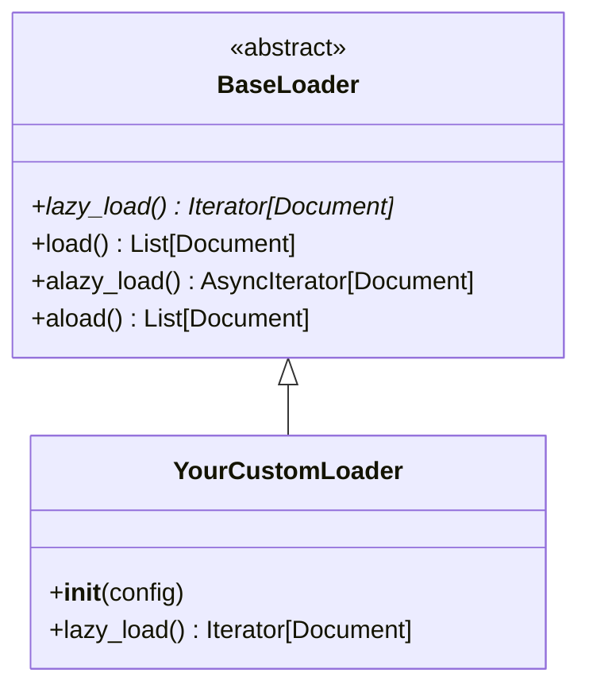

# Custom Loaders

## Introduction

While LangChain provides 100+ built-in loaders, you'll inevitably encounter data sources that require custom solutions—proprietary file formats, internal APIs, specialized databases, or unique parsing requirements. Building custom loaders isn't difficult once you understand the patterns.

In this lesson, we'll create production-ready custom loaders from scratch. You'll learn to extend `BaseLoader`, implement lazy loading for memory efficiency, handle errors gracefully, and integrate with the broader LangChain ecosystem.

### What We'll Cover

- Extending `BaseLoader` for custom loaders
- Implementing `lazy_load()` for memory efficiency
- Creating blob-based parsers for file formats
- Building async loaders for I/O-bound operations
- Error handling and logging patterns
- Testing and validation strategies
- Real-world custom loader examples

### Prerequisites

- Completed [Loader Fundamentals](./01-loader-fundamentals.md)
- Solid understanding of Python classes and generators
- Familiarity with async/await patterns
- Basic knowledge of the data source you want to load

---

## BaseLoader Architecture

Every LangChain loader inherits from `BaseLoader`. Let's understand its structure:

```python
from abc import ABC, abstractmethod
from typing import Iterator, AsyncIterator, List
from langchain_core.documents import Document

class BaseLoader(ABC):
    """Abstract base class for document loaders.
    
    You MUST implement `lazy_load()`. Other methods have default implementations.
    """
    
    @abstractmethod
    def lazy_load(self) -> Iterator[Document]:
        """Load documents lazily, one at a time.
        
        This is the only method you MUST implement.
        """
        pass
    
    def load(self) -> List[Document]:
        """Load all documents into a list.
        
        Default implementation calls lazy_load() and collects results.
        """
        return list(self.lazy_load())
    
    async def alazy_load(self) -> AsyncIterator[Document]:
        """Async lazy loading.
        
        Default implementation wraps lazy_load(). Override for true async.
        """
        for doc in self.lazy_load():
            yield doc
    
    async def aload(self) -> List[Document]:
        """Async load all documents.
        
        Default implementation calls alazy_load() and collects results.
        """
        return [doc async for doc in self.alazy_load()]
```



---

## Creating Your First Custom Loader

Let's start with a simple example: a loader for Markdown files that extracts front matter.

### Basic Structure

```python
from langchain_core.document_loaders import BaseLoader
from langchain_core.documents import Document
from typing import Iterator
import re

class MarkdownWithFrontMatterLoader(BaseLoader):
    """Load Markdown files and extract YAML front matter as metadata."""
    
    def __init__(self, file_path: str, encoding: str = "utf-8"):
        """Initialize the loader.
        
        Args:
            file_path: Path to the Markdown file
            encoding: File encoding (default: utf-8)
        """
        self.file_path = file_path
        self.encoding = encoding
    
    def lazy_load(self) -> Iterator[Document]:
        """Load the Markdown file and yield a Document."""
        with open(self.file_path, 'r', encoding=self.encoding) as f:
            content = f.read()
        
        # Parse front matter
        front_matter, body = self._parse_front_matter(content)
        
        yield Document(
            page_content=body.strip(),
            metadata={
                "source": self.file_path,
                **front_matter
            }
        )
    
    def _parse_front_matter(self, content: str) -> tuple[dict, str]:
        """Extract YAML front matter from Markdown content."""
        pattern = r'^---\s*\n(.*?)\n---\s*\n(.*)$'
        match = re.match(pattern, content, re.DOTALL)
        
        if match:
            try:
                import yaml
                front_matter = yaml.safe_load(match.group(1))
                body = match.group(2)
                return front_matter or {}, body
            except:
                pass
        
        return {}, content

# Usage
loader = MarkdownWithFrontMatterLoader("article.md")
docs = loader.load()

print(f"Title: {docs[0].metadata.get('title')}")
print(f"Content: {docs[0].page_content[:100]}...")
```

### Testing the Loader

```python
# Create a test file
test_content = """---
title: My Article
author: Jane Doe
date: 2024-01-15
tags:
  - python
  - langchain
---

# Introduction

This is the article content...
"""

with open("test_article.md", "w") as f:
    f.write(test_content)

# Test the loader
loader = MarkdownWithFrontMatterLoader("test_article.md")
docs = loader.load()

print(f"Title: {docs[0].metadata['title']}")
print(f"Author: {docs[0].metadata['author']}")
print(f"Tags: {docs[0].metadata['tags']}")
print(f"Content preview: {docs[0].page_content[:50]}...")
```

**Output:**
```
Title: My Article
Author: Jane Doe
Tags: ['python', 'langchain']
Content preview: # Introduction

This is the article content...
```

---

## Directory Loaders

Often you need to load multiple files of a custom type. Here's a pattern for directory-based loaders:

```python
from langchain_core.document_loaders import BaseLoader
from langchain_core.documents import Document
from typing import Iterator
import os
import glob

class CustomDirectoryLoader(BaseLoader):
    """Load all files of a custom type from a directory."""
    
    def __init__(
        self,
        directory: str,
        glob_pattern: str = "**/*",
        file_loader_cls: type = None,
        file_loader_kwargs: dict = None,
        recursive: bool = True
    ):
        """Initialize the directory loader.
        
        Args:
            directory: Path to the directory
            glob_pattern: Pattern to match files
            file_loader_cls: Loader class for individual files
            file_loader_kwargs: Arguments for file loader
            recursive: Whether to search subdirectories
        """
        self.directory = directory
        self.glob_pattern = glob_pattern
        self.file_loader_cls = file_loader_cls
        self.file_loader_kwargs = file_loader_kwargs or {}
        self.recursive = recursive
    
    def lazy_load(self) -> Iterator[Document]:
        """Lazily load documents from all matching files."""
        pattern = os.path.join(self.directory, self.glob_pattern)
        files = glob.glob(pattern, recursive=self.recursive)
        
        for file_path in sorted(files):
            if os.path.isfile(file_path):
                yield from self._load_file(file_path)
    
    def _load_file(self, file_path: str) -> Iterator[Document]:
        """Load a single file using the configured loader."""
        try:
            loader = self.file_loader_cls(
                file_path,
                **self.file_loader_kwargs
            )
            yield from loader.lazy_load()
        except Exception as e:
            print(f"Warning: Failed to load {file_path}: {e}")

# Usage
loader = CustomDirectoryLoader(
    directory="./docs",
    glob_pattern="**/*.md",
    file_loader_cls=MarkdownWithFrontMatterLoader,
    recursive=True
)

docs = loader.load()
print(f"Loaded {len(docs)} documents")
```

---

## Blob-Based Loaders

For binary file formats, use the blob pattern for better abstraction:

```python
from langchain_core.document_loaders import Blob, BaseBlobParser
from langchain_core.documents import Document
from typing import Iterator

class CustomBinaryParser(BaseBlobParser):
    """Parse a custom binary format into documents."""
    
    def __init__(self, chunk_size: int = 1000):
        self.chunk_size = chunk_size
    
    def lazy_parse(self, blob: Blob) -> Iterator[Document]:
        """Parse binary blob into documents.
        
        Args:
            blob: The binary blob to parse
            
        Yields:
            Document objects extracted from the blob
        """
        # Get binary content
        data = blob.as_bytes()
        
        # Example: Parse a simple custom format
        # Header: 4 bytes (magic number)
        # Content: rest of file
        
        if len(data) < 4:
            return
        
        magic = data[:4]
        if magic != b'CUST':  # Custom file magic number
            raise ValueError(f"Invalid file format: {blob.source}")
        
        content = data[4:].decode('utf-8', errors='ignore')
        
        yield Document(
            page_content=content,
            metadata={
                "source": blob.source,
                "mimetype": blob.mimetype,
                "size_bytes": len(data)
            }
        )

# Usage with FileSystemBlobLoader
from langchain_community.document_loaders.blob_loaders import FileSystemBlobLoader

blob_loader = FileSystemBlobLoader(
    path="./custom_files",
    glob="**/*.cust"
)

parser = CustomBinaryParser()

for blob in blob_loader.yield_blobs():
    for doc in parser.lazy_parse(blob):
        print(f"Loaded: {doc.metadata['source']}")
```

### Creating a Complete Blob-Based Loader

```python
from langchain_core.document_loaders import BaseLoader, Blob, BaseBlobParser
from langchain_core.documents import Document
from typing import Iterator
import os

class CustomFileLoader(BaseLoader):
    """Complete loader combining blob loading and parsing."""
    
    def __init__(
        self,
        file_path: str,
        parser: BaseBlobParser = None
    ):
        self.file_path = file_path
        self.parser = parser or DefaultParser()
    
    def lazy_load(self) -> Iterator[Document]:
        """Load and parse the file."""
        blob = Blob.from_path(self.file_path)
        yield from self.parser.lazy_parse(blob)

class DefaultParser(BaseBlobParser):
    """Default text parser."""
    
    def lazy_parse(self, blob: Blob) -> Iterator[Document]:
        text = blob.as_string()
        yield Document(
            page_content=text,
            metadata={"source": blob.source}
        )
```

---

## Async Loaders

For I/O-bound operations (network requests, database queries), async loaders provide better performance:

```python
from langchain_core.document_loaders import BaseLoader
from langchain_core.documents import Document
from typing import Iterator, AsyncIterator
import aiohttp
import asyncio

class AsyncAPILoader(BaseLoader):
    """Async loader for REST API endpoints."""
    
    def __init__(
        self,
        urls: list[str],
        content_key: str = "content",
        headers: dict = None
    ):
        self.urls = urls
        self.content_key = content_key
        self.headers = headers or {}
    
    def lazy_load(self) -> Iterator[Document]:
        """Sync wrapper for async loading."""
        # Run async code in sync context
        loop = asyncio.get_event_loop()
        docs = loop.run_until_complete(self.aload())
        yield from docs
    
    async def alazy_load(self) -> AsyncIterator[Document]:
        """True async lazy loading."""
        async with aiohttp.ClientSession(headers=self.headers) as session:
            for url in self.urls:
                doc = await self._fetch_url(session, url)
                if doc:
                    yield doc
    
    async def aload(self) -> list[Document]:
        """Load all documents concurrently."""
        async with aiohttp.ClientSession(headers=self.headers) as session:
            tasks = [self._fetch_url(session, url) for url in self.urls]
            results = await asyncio.gather(*tasks, return_exceptions=True)
            
            return [doc for doc in results if isinstance(doc, Document)]
    
    async def _fetch_url(self, session: aiohttp.ClientSession, url: str) -> Document | None:
        """Fetch a single URL."""
        try:
            async with session.get(url) as response:
                if response.status != 200:
                    return None
                
                data = await response.json()
                content = data.get(self.content_key, "")
                
                return Document(
                    page_content=str(content),
                    metadata={
                        "source": url,
                        "status_code": response.status,
                        **{k: v for k, v in data.items() if k != self.content_key}
                    }
                )
        except Exception as e:
            print(f"Error fetching {url}: {e}")
            return None

# Usage
async def main():
    loader = AsyncAPILoader(
        urls=[
            "https://api.example.com/articles/1",
            "https://api.example.com/articles/2",
            "https://api.example.com/articles/3",
        ],
        content_key="body",
        headers={"Authorization": "Bearer token123"}
    )
    
    # Async usage
    async for doc in loader.alazy_load():
        print(f"Loaded: {doc.metadata['source']}")
    
    # Or load all at once
    docs = await loader.aload()
    print(f"Total: {len(docs)} documents")

# asyncio.run(main())
```

---

## Error Handling Patterns

Robust loaders handle errors gracefully:

```python
from langchain_core.document_loaders import BaseLoader
from langchain_core.documents import Document
from typing import Iterator
from dataclasses import dataclass
from enum import Enum
import logging

logging.basicConfig(level=logging.INFO)
logger = logging.getLogger(__name__)

class ErrorStrategy(Enum):
    """How to handle errors during loading."""
    RAISE = "raise"      # Raise exception immediately
    SKIP = "skip"        # Skip failed items, log warning
    INCLUDE = "include"  # Include error info in document

@dataclass
class LoadResult:
    """Result of loading a single item."""
    success: bool
    document: Document | None = None
    error: str | None = None
    source: str | None = None

class RobustLoader(BaseLoader):
    """Loader with comprehensive error handling."""
    
    def __init__(
        self,
        sources: list[str],
        error_strategy: ErrorStrategy = ErrorStrategy.SKIP
    ):
        self.sources = sources
        self.error_strategy = error_strategy
        self.results: list[LoadResult] = []
    
    def lazy_load(self) -> Iterator[Document]:
        """Load with error handling."""
        for source in self.sources:
            result = self._load_single(source)
            self.results.append(result)
            
            if result.success and result.document:
                yield result.document
            elif not result.success:
                if self.error_strategy == ErrorStrategy.RAISE:
                    raise RuntimeError(f"Failed to load {source}: {result.error}")
                elif self.error_strategy == ErrorStrategy.INCLUDE:
                    yield Document(
                        page_content=f"Error loading content: {result.error}",
                        metadata={
                            "source": source,
                            "error": result.error,
                            "is_error": True
                        }
                    )
                else:  # SKIP
                    logger.warning(f"Skipped {source}: {result.error}")
    
    def _load_single(self, source: str) -> LoadResult:
        """Load a single source with error capture."""
        try:
            # Your loading logic here
            content = self._do_load(source)
            
            return LoadResult(
                success=True,
                document=Document(
                    page_content=content,
                    metadata={"source": source}
                ),
                source=source
            )
        except Exception as e:
            return LoadResult(
                success=False,
                error=str(e),
                source=source
            )
    
    def _do_load(self, source: str) -> str:
        """Actual loading logic - override in subclass."""
        with open(source, 'r') as f:
            return f.read()
    
    def get_statistics(self) -> dict:
        """Get loading statistics."""
        return {
            "total": len(self.results),
            "success": sum(1 for r in self.results if r.success),
            "failed": sum(1 for r in self.results if not r.success),
            "errors": [
                {"source": r.source, "error": r.error}
                for r in self.results if not r.success
            ]
        }

# Usage
loader = RobustLoader(
    sources=["file1.txt", "file2.txt", "nonexistent.txt"],
    error_strategy=ErrorStrategy.SKIP
)

docs = loader.load()
stats = loader.get_statistics()

print(f"Loaded: {stats['success']}/{stats['total']}")
if stats['errors']:
    print("Errors:")
    for err in stats['errors']:
        print(f"  - {err['source']}: {err['error']}")
```

---

## Metadata Enrichment

Add computed or external metadata to documents:

```python
from langchain_core.document_loaders import BaseLoader
from langchain_core.documents import Document
from typing import Iterator, Callable
import hashlib
from datetime import datetime
import os

class MetadataEnrichedLoader(BaseLoader):
    """Loader that enriches documents with additional metadata."""
    
    def __init__(
        self,
        base_loader: BaseLoader,
        enrichers: list[Callable[[Document], dict]] = None
    ):
        self.base_loader = base_loader
        self.enrichers = enrichers or []
    
    def lazy_load(self) -> Iterator[Document]:
        """Load and enrich documents."""
        for doc in self.base_loader.lazy_load():
            enriched_metadata = dict(doc.metadata)
            
            for enricher in self.enrichers:
                try:
                    additional = enricher(doc)
                    enriched_metadata.update(additional)
                except Exception as e:
                    enriched_metadata[f"enricher_error"] = str(e)
            
            yield Document(
                page_content=doc.page_content,
                metadata=enriched_metadata
            )

# Built-in enrichers
def content_stats_enricher(doc: Document) -> dict:
    """Add content statistics."""
    content = doc.page_content
    return {
        "char_count": len(content),
        "word_count": len(content.split()),
        "line_count": content.count('\n') + 1
    }

def hash_enricher(doc: Document) -> dict:
    """Add content hash for deduplication."""
    content = doc.page_content
    return {
        "content_hash": hashlib.md5(content.encode()).hexdigest(),
        "content_hash_short": hashlib.md5(content.encode()).hexdigest()[:8]
    }

def timestamp_enricher(doc: Document) -> dict:
    """Add loading timestamp."""
    return {
        "loaded_at": datetime.utcnow().isoformat(),
        "loaded_timestamp": datetime.utcnow().timestamp()
    }

def file_metadata_enricher(doc: Document) -> dict:
    """Add file system metadata if source is a file."""
    source = doc.metadata.get("source", "")
    
    if os.path.isfile(source):
        stat = os.stat(source)
        return {
            "file_size": stat.st_size,
            "file_modified": datetime.fromtimestamp(stat.st_mtime).isoformat(),
            "file_extension": os.path.splitext(source)[1]
        }
    return {}

# Usage
from langchain_community.document_loaders import TextLoader

base_loader = TextLoader("article.txt")

enriched_loader = MetadataEnrichedLoader(
    base_loader=base_loader,
    enrichers=[
        content_stats_enricher,
        hash_enricher,
        timestamp_enricher,
        file_metadata_enricher
    ]
)

docs = enriched_loader.load()
print(f"Enriched metadata: {docs[0].metadata}")
```

---

## Production-Ready Loader Template

Here's a comprehensive template for production loaders:

```python
from langchain_core.document_loaders import BaseLoader
from langchain_core.documents import Document
from typing import Iterator, Optional
from dataclasses import dataclass, field
import logging
import hashlib
from datetime import datetime

logger = logging.getLogger(__name__)

@dataclass
class LoaderConfig:
    """Configuration for the loader."""
    source_path: str
    encoding: str = "utf-8"
    skip_empty: bool = True
    max_content_length: Optional[int] = None
    metadata_prefix: str = ""
    generate_ids: bool = True

@dataclass  
class LoaderStats:
    """Statistics from the loading process."""
    total_processed: int = 0
    total_loaded: int = 0
    total_skipped: int = 0
    total_errors: int = 0
    errors: list = field(default_factory=list)
    start_time: datetime = field(default_factory=datetime.utcnow)
    end_time: Optional[datetime] = None
    
    def complete(self):
        self.end_time = datetime.utcnow()
    
    @property
    def duration_seconds(self) -> float:
        end = self.end_time or datetime.utcnow()
        return (end - self.start_time).total_seconds()

class ProductionLoader(BaseLoader):
    """Production-ready loader with comprehensive features.
    
    Features:
    - Configurable via dataclass
    - Statistics tracking
    - Error handling with logging
    - Content validation
    - Automatic ID generation
    - Metadata enrichment
    """
    
    def __init__(self, config: LoaderConfig):
        """Initialize with configuration.
        
        Args:
            config: Loader configuration dataclass
        """
        self.config = config
        self.stats = LoaderStats()
        self._validate_config()
    
    def _validate_config(self):
        """Validate configuration on init."""
        if not self.config.source_path:
            raise ValueError("source_path is required")
    
    def lazy_load(self) -> Iterator[Document]:
        """Load documents with full tracking and error handling."""
        logger.info(f"Starting load from {self.config.source_path}")
        
        try:
            for item in self._get_items():
                self.stats.total_processed += 1
                
                try:
                    doc = self._process_item(item)
                    
                    if doc:
                        self.stats.total_loaded += 1
                        yield doc
                    else:
                        self.stats.total_skipped += 1
                        
                except Exception as e:
                    self.stats.total_errors += 1
                    self.stats.errors.append({
                        "item": str(item)[:100],
                        "error": str(e)
                    })
                    logger.warning(f"Error processing item: {e}")
        
        finally:
            self.stats.complete()
            logger.info(
                f"Load complete: {self.stats.total_loaded} loaded, "
                f"{self.stats.total_skipped} skipped, "
                f"{self.stats.total_errors} errors in {self.stats.duration_seconds:.2f}s"
            )
    
    def _get_items(self) -> Iterator:
        """Get items to process. Override in subclass."""
        # Default: read file as single item
        with open(self.config.source_path, 'r', encoding=self.config.encoding) as f:
            yield f.read()
    
    def _process_item(self, item) -> Optional[Document]:
        """Process a single item into a Document.
        
        Args:
            item: Raw item from _get_items()
            
        Returns:
            Document or None if item should be skipped
        """
        content = self._extract_content(item)
        
        # Skip empty content
        if self.config.skip_empty and not content.strip():
            return None
        
        # Truncate if needed
        if self.config.max_content_length:
            content = content[:self.config.max_content_length]
        
        # Build metadata
        metadata = self._build_metadata(item, content)
        
        # Generate ID
        doc_id = None
        if self.config.generate_ids:
            doc_id = self._generate_id(content, metadata)
        
        return Document(
            page_content=content,
            metadata=metadata,
            id=doc_id
        )
    
    def _extract_content(self, item) -> str:
        """Extract content from item. Override for custom formats."""
        return str(item)
    
    def _build_metadata(self, item, content: str) -> dict:
        """Build metadata dictionary."""
        prefix = self.config.metadata_prefix
        
        metadata = {
            f"{prefix}source": self.config.source_path,
            f"{prefix}loaded_at": datetime.utcnow().isoformat(),
            f"{prefix}char_count": len(content),
            f"{prefix}word_count": len(content.split())
        }
        
        # Add item-specific metadata
        metadata.update(self._extract_item_metadata(item))
        
        return metadata
    
    def _extract_item_metadata(self, item) -> dict:
        """Extract metadata from item. Override in subclass."""
        return {}
    
    def _generate_id(self, content: str, metadata: dict) -> str:
        """Generate unique document ID."""
        source = metadata.get(f"{self.config.metadata_prefix}source", "")
        unique_str = f"{source}:{content}"
        return hashlib.sha256(unique_str.encode()).hexdigest()[:16]
    
    def get_stats(self) -> LoaderStats:
        """Get loading statistics."""
        return self.stats

# Example: Extend for specific use case
class CSVProductionLoader(ProductionLoader):
    """Production CSV loader extending base template."""
    
    def __init__(
        self,
        config: LoaderConfig,
        content_column: str,
        delimiter: str = ","
    ):
        super().__init__(config)
        self.content_column = content_column
        self.delimiter = delimiter
    
    def _get_items(self) -> Iterator:
        """Yield rows from CSV."""
        import csv
        
        with open(self.config.source_path, 'r', encoding=self.config.encoding) as f:
            reader = csv.DictReader(f, delimiter=self.delimiter)
            for row in reader:
                yield row
    
    def _extract_content(self, item: dict) -> str:
        """Get content from specified column."""
        return item.get(self.content_column, "")
    
    def _extract_item_metadata(self, item: dict) -> dict:
        """Include all other columns as metadata."""
        return {
            k: v for k, v in item.items() 
            if k != self.content_column
        }

# Usage
config = LoaderConfig(
    source_path="products.csv",
    encoding="utf-8",
    skip_empty=True,
    generate_ids=True
)

loader = CSVProductionLoader(
    config=config,
    content_column="description"
)

docs = loader.load()
stats = loader.get_stats()

print(f"Loaded: {stats.total_loaded}")
print(f"Duration: {stats.duration_seconds:.2f}s")
```

---

## Testing Custom Loaders

Always test your loaders thoroughly:

```python
import pytest
from langchain_core.documents import Document
from your_module import CustomLoader, LoaderConfig

class TestCustomLoader:
    """Test suite for CustomLoader."""
    
    @pytest.fixture
    def sample_file(self, tmp_path):
        """Create a sample file for testing."""
        file_path = tmp_path / "test.txt"
        file_path.write_text("Sample content\nLine 2")
        return str(file_path)
    
    @pytest.fixture
    def loader(self, sample_file):
        """Create loader instance."""
        return CustomLoader(sample_file)
    
    def test_load_returns_documents(self, loader):
        """Test that load() returns a list of Documents."""
        docs = loader.load()
        
        assert isinstance(docs, list)
        assert len(docs) > 0
        assert all(isinstance(d, Document) for d in docs)
    
    def test_lazy_load_is_generator(self, loader):
        """Test that lazy_load() returns an iterator."""
        result = loader.lazy_load()
        
        assert hasattr(result, '__iter__')
        assert hasattr(result, '__next__')
    
    def test_document_has_content(self, loader):
        """Test that documents have content."""
        docs = loader.load()
        
        assert docs[0].page_content
        assert len(docs[0].page_content) > 0
    
    def test_document_has_source_metadata(self, loader, sample_file):
        """Test that documents have source in metadata."""
        docs = loader.load()
        
        assert "source" in docs[0].metadata
        assert docs[0].metadata["source"] == sample_file
    
    def test_handles_missing_file(self, tmp_path):
        """Test error handling for missing files."""
        loader = CustomLoader(str(tmp_path / "nonexistent.txt"))
        
        with pytest.raises(FileNotFoundError):
            loader.load()
    
    def test_handles_encoding_errors(self, tmp_path):
        """Test handling of encoding issues."""
        file_path = tmp_path / "binary.txt"
        file_path.write_bytes(b'\x80\x81\x82')
        
        loader = CustomLoader(str(file_path), encoding="utf-8")
        
        # Should not raise, should handle gracefully
        docs = loader.load()
        assert len(docs) >= 0
    
    def test_empty_file_handling(self, tmp_path):
        """Test handling of empty files."""
        file_path = tmp_path / "empty.txt"
        file_path.write_text("")
        
        loader = CustomLoader(str(file_path), skip_empty=True)
        docs = loader.load()
        
        assert len(docs) == 0
    
    def test_statistics_tracking(self, loader):
        """Test that statistics are tracked correctly."""
        loader.load()
        stats = loader.get_stats()
        
        assert stats.total_processed > 0
        assert stats.total_loaded > 0
        assert stats.duration_seconds >= 0

# Run tests
# pytest test_loader.py -v
```

---

## Real-World Examples

### Email Loader (Maildir Format)

```python
from langchain_core.document_loaders import BaseLoader
from langchain_core.documents import Document
from typing import Iterator
import email
import os
from email.header import decode_header

class MaildirLoader(BaseLoader):
    """Load emails from Maildir format directories."""
    
    def __init__(
        self,
        maildir_path: str,
        include_attachments: bool = False
    ):
        self.maildir_path = maildir_path
        self.include_attachments = include_attachments
    
    def lazy_load(self) -> Iterator[Document]:
        """Load emails from Maildir."""
        for subdir in ['cur', 'new']:
            dir_path = os.path.join(self.maildir_path, subdir)
            
            if not os.path.isdir(dir_path):
                continue
            
            for filename in os.listdir(dir_path):
                file_path = os.path.join(dir_path, filename)
                
                if os.path.isfile(file_path):
                    doc = self._parse_email(file_path)
                    if doc:
                        yield doc
    
    def _parse_email(self, file_path: str) -> Document | None:
        """Parse a single email file."""
        try:
            with open(file_path, 'rb') as f:
                msg = email.message_from_binary_file(f)
            
            # Extract content
            body = self._get_body(msg)
            
            if not body:
                return None
            
            # Extract metadata
            metadata = {
                "source": file_path,
                "from": self._decode_header(msg.get("From", "")),
                "to": self._decode_header(msg.get("To", "")),
                "subject": self._decode_header(msg.get("Subject", "")),
                "date": msg.get("Date", ""),
                "message_id": msg.get("Message-ID", "")
            }
            
            return Document(page_content=body, metadata=metadata)
            
        except Exception as e:
            print(f"Error parsing {file_path}: {e}")
            return None
    
    def _get_body(self, msg: email.message.Message) -> str:
        """Extract email body text."""
        if msg.is_multipart():
            for part in msg.walk():
                content_type = part.get_content_type()
                
                if content_type == "text/plain":
                    payload = part.get_payload(decode=True)
                    if payload:
                        return payload.decode('utf-8', errors='ignore')
        else:
            payload = msg.get_payload(decode=True)
            if payload:
                return payload.decode('utf-8', errors='ignore')
        
        return ""
    
    def _decode_header(self, header: str) -> str:
        """Decode email header."""
        decoded = decode_header(header)
        parts = []
        for data, charset in decoded:
            if isinstance(data, bytes):
                parts.append(data.decode(charset or 'utf-8', errors='ignore'))
            else:
                parts.append(data)
        return ' '.join(parts)

# Usage
loader = MaildirLoader("/home/user/Maildir/INBOX")
docs = loader.load()

for doc in docs[:5]:
    print(f"From: {doc.metadata['from']}")
    print(f"Subject: {doc.metadata['subject']}")
    print(f"Body preview: {doc.page_content[:100]}...")
    print("---")
```

### Log File Loader

```python
from langchain_core.document_loaders import BaseLoader
from langchain_core.documents import Document
from typing import Iterator
import re
from datetime import datetime

class LogFileLoader(BaseLoader):
    """Load and parse log files into structured documents."""
    
    # Common log patterns
    LOG_PATTERNS = {
        "apache": r'^(?P<ip>\S+) \S+ \S+ \[(?P<timestamp>[^\]]+)\] "(?P<request>[^"]*)" (?P<status>\d+) (?P<size>\S+)',
        "nginx": r'^(?P<ip>\S+) - (?P<user>\S+) \[(?P<timestamp>[^\]]+)\] "(?P<request>[^"]*)" (?P<status>\d+) (?P<size>\d+)',
        "syslog": r'^(?P<timestamp>\w+\s+\d+\s+[\d:]+) (?P<host>\S+) (?P<service>\S+): (?P<message>.*)$',
        "json": r'^\{.*\}$'
    }
    
    def __init__(
        self,
        file_path: str,
        log_format: str = "auto",
        combine_lines: int = 1
    ):
        self.file_path = file_path
        self.log_format = log_format
        self.combine_lines = combine_lines
        self._pattern = None
    
    def lazy_load(self) -> Iterator[Document]:
        """Load log entries as documents."""
        self._detect_format()
        
        with open(self.file_path, 'r', encoding='utf-8', errors='ignore') as f:
            buffer = []
            
            for line_num, line in enumerate(f, 1):
                line = line.strip()
                
                if not line:
                    continue
                
                if self.combine_lines > 1:
                    buffer.append(line)
                    if len(buffer) >= self.combine_lines:
                        yield self._parse_lines(buffer, line_num)
                        buffer = []
                else:
                    doc = self._parse_line(line, line_num)
                    if doc:
                        yield doc
            
            # Flush remaining buffer
            if buffer:
                yield self._parse_lines(buffer, line_num)
    
    def _detect_format(self):
        """Auto-detect log format from first few lines."""
        if self.log_format != "auto":
            self._pattern = re.compile(self.LOG_PATTERNS.get(self.log_format, self.log_format))
            return
        
        with open(self.file_path, 'r') as f:
            sample = f.readline()
        
        for name, pattern in self.LOG_PATTERNS.items():
            if re.match(pattern, sample):
                self.log_format = name
                self._pattern = re.compile(pattern)
                return
        
        # Default to raw lines
        self.log_format = "raw"
        self._pattern = None
    
    def _parse_line(self, line: str, line_num: int) -> Document | None:
        """Parse a single log line."""
        metadata = {
            "source": self.file_path,
            "line_number": line_num,
            "log_format": self.log_format
        }
        
        if self._pattern:
            match = self._pattern.match(line)
            if match:
                metadata.update(match.groupdict())
        
        return Document(page_content=line, metadata=metadata)
    
    def _parse_lines(self, lines: list[str], last_line: int) -> Document:
        """Parse multiple lines as single document."""
        content = "\n".join(lines)
        
        return Document(
            page_content=content,
            metadata={
                "source": self.file_path,
                "line_start": last_line - len(lines) + 1,
                "line_end": last_line,
                "log_format": self.log_format
            }
        )

# Usage
loader = LogFileLoader(
    file_path="/var/log/nginx/access.log",
    log_format="auto"
)

docs = loader.load()

for doc in docs[:5]:
    print(f"Line {doc.metadata['line_number']}: {doc.page_content[:80]}...")
    if 'status' in doc.metadata:
        print(f"  Status: {doc.metadata['status']}")
```

---

## Best Practices

| Practice | Why It Matters |
|----------|----------------|
| Always implement `lazy_load()` first | Memory efficiency, other methods derive from it |
| Use dataclasses for configuration | Clean API, easy validation |
| Track statistics during loading | Debugging and monitoring |
| Validate input in `__init__` | Fail fast with clear errors |
| Log at appropriate levels | Production visibility |
| Test with edge cases | Empty files, encoding issues, missing files |

---

## Common Pitfalls

| ❌ Mistake | ✅ Solution |
|-----------|-------------|
| Loading everything in `__init__` | Defer loading to `lazy_load()` |
| Not closing file handles | Use context managers (`with` statements) |
| Ignoring encoding issues | Specify encoding, handle errors |
| No error handling | Wrap loading logic in try/except |
| Hardcoding configuration | Use config objects or parameters |
| Not implementing lazy_load | It's the only required method |

---

## Hands-on Exercise

### Your Task

Build a custom loader for a hypothetical log format:

```
[2024-01-15 10:30:45] INFO  user=john action=login ip=192.168.1.1
[2024-01-15 10:30:47] ERROR user=jane action=upload error="File too large"
[2024-01-15 10:30:50] WARN  user=john action=download file="report.pdf"
```

### Requirements

1. Create a `CustomLogLoader` class that:
   - Parses each line into a Document
   - Extracts timestamp, level, and key=value pairs as metadata
   - Handles quoted values properly
   - Implements proper error handling

2. Add statistics tracking (total lines, by log level)

3. Support filtering by log level

### Expected Result

```python
loader = CustomLogLoader("app.log", min_level="WARN")
docs = loader.load()

for doc in docs:
    print(f"[{doc.metadata['level']}] {doc.metadata['action']}")
    print(f"  User: {doc.metadata['user']}")

stats = loader.get_stats()
print(f"Total: {stats['total']}, Errors: {stats['by_level']['ERROR']}")
```

<details>
<summary>💡 Hints (click to expand)</summary>

- Use regex to parse the log format
- Handle quoted values with: `r'(\w+)=(?:"([^"]*)"|(\S+))'`
- Use an enum or dict for log level ordering
- Store counts in a defaultdict for statistics
- Remember to handle malformed lines gracefully

</details>

<details>
<summary>✅ Solution (click to expand)</summary>

```python
from langchain_core.document_loaders import BaseLoader
from langchain_core.documents import Document
from typing import Iterator
from collections import defaultdict
from dataclasses import dataclass, field
import re
from datetime import datetime

@dataclass
class LogStats:
    """Statistics from log loading."""
    total: int = 0
    loaded: int = 0
    skipped: int = 0
    errors: int = 0
    by_level: dict = field(default_factory=lambda: defaultdict(int))

class CustomLogLoader(BaseLoader):
    """Loader for custom log format."""
    
    LOG_LEVELS = {"DEBUG": 0, "INFO": 1, "WARN": 2, "ERROR": 3, "FATAL": 4}
    
    LOG_PATTERN = re.compile(
        r'^\[(?P<timestamp>[\d\-\s:]+)\]\s+'
        r'(?P<level>\w+)\s+'
        r'(?P<pairs>.*)$'
    )
    
    PAIR_PATTERN = re.compile(r'(\w+)=(?:"([^"]*)"|(\S+))')
    
    def __init__(
        self,
        file_path: str,
        min_level: str = "DEBUG",
        encoding: str = "utf-8"
    ):
        self.file_path = file_path
        self.min_level = min_level
        self.min_level_num = self.LOG_LEVELS.get(min_level, 0)
        self.encoding = encoding
        self.stats = LogStats()
    
    def lazy_load(self) -> Iterator[Document]:
        """Load and parse log file."""
        with open(self.file_path, 'r', encoding=self.encoding) as f:
            for line_num, line in enumerate(f, 1):
                self.stats.total += 1
                
                doc = self._parse_line(line.strip(), line_num)
                
                if doc:
                    level = doc.metadata.get('level', 'INFO')
                    self.stats.by_level[level] += 1
                    
                    # Filter by level
                    level_num = self.LOG_LEVELS.get(level, 1)
                    if level_num >= self.min_level_num:
                        self.stats.loaded += 1
                        yield doc
                    else:
                        self.stats.skipped += 1
                else:
                    self.stats.errors += 1
    
    def _parse_line(self, line: str, line_num: int) -> Document | None:
        """Parse a single log line."""
        if not line:
            return None
        
        match = self.LOG_PATTERN.match(line)
        if not match:
            return None
        
        timestamp = match.group('timestamp')
        level = match.group('level')
        pairs_str = match.group('pairs')
        
        # Parse key=value pairs
        metadata = {
            "source": self.file_path,
            "line": line_num,
            "timestamp": timestamp,
            "level": level
        }
        
        for pair_match in self.PAIR_PATTERN.finditer(pairs_str):
            key = pair_match.group(1)
            value = pair_match.group(2) or pair_match.group(3)
            metadata[key] = value
        
        # Build content from pairs
        content_parts = [f"{k}={v}" for k, v in metadata.items() 
                        if k not in ("source", "line")]
        content = " ".join(content_parts)
        
        return Document(page_content=content, metadata=metadata)
    
    def get_stats(self) -> dict:
        """Get loading statistics."""
        return {
            "total": self.stats.total,
            "loaded": self.stats.loaded,
            "skipped": self.stats.skipped,
            "errors": self.stats.errors,
            "by_level": dict(self.stats.by_level)
        }

# Test
if __name__ == "__main__":
    # Create test log file
    log_content = """[2024-01-15 10:30:45] INFO  user=john action=login ip=192.168.1.1
[2024-01-15 10:30:47] ERROR user=jane action=upload error="File too large"
[2024-01-15 10:30:50] WARN  user=john action=download file="report.pdf"
[2024-01-15 10:30:52] DEBUG user=system action=cleanup count=5
[2024-01-15 10:30:55] INFO  user=jane action=logout duration=300"""

    with open("test_app.log", "w") as f:
        f.write(log_content)
    
    # Load with filter
    loader = CustomLogLoader("test_app.log", min_level="WARN")
    docs = loader.load()
    
    print("=== Loaded Documents (WARN+) ===")
    for doc in docs:
        print(f"[{doc.metadata['level']}] {doc.metadata.get('action', 'N/A')}")
        print(f"  User: {doc.metadata.get('user', 'N/A')}")
        if 'error' in doc.metadata:
            print(f"  Error: {doc.metadata['error']}")
    
    print("\n=== Statistics ===")
    stats = loader.get_stats()
    print(f"Total lines: {stats['total']}")
    print(f"Loaded: {stats['loaded']}")
    print(f"Skipped (below WARN): {stats['skipped']}")
    print(f"By level: {dict(stats['by_level'])}")
    
    # Cleanup
    import os
    os.remove("test_app.log")
```

**Output:**
```
=== Loaded Documents (WARN+) ===
[ERROR] upload
  User: jane
  Error: File too large
[WARN] download
  User: john

=== Statistics ===
Total lines: 5
Loaded: 2
Skipped (below WARN): 3
By level: {'INFO': 2, 'ERROR': 1, 'WARN': 1, 'DEBUG': 1}
```

</details>

### Bonus Challenges

- [ ] Add multi-line log entry support
- [ ] Implement async loading for remote log sources
- [ ] Add log aggregation (group by user/action)
- [ ] Create a real-time log tailing loader

---

## Summary

✅ Custom loaders extend `BaseLoader` and implement `lazy_load()`  
✅ Use blob parsers for binary file formats  
✅ Async loaders improve performance for I/O-bound operations  
✅ Robust error handling with statistics tracking is essential  
✅ Test edge cases: empty files, encoding issues, malformed data  
✅ Use the production template as a starting point  
✅ Enrich documents with computed metadata for better retrieval

**Next:** Return to [Document Loaders Overview](./00-document-loaders.md) or continue to the next lesson in Unit 8.

---

## Navigation

| Previous | Up | Next |
|----------|-------|------|
| [Structured Data Loaders](./05-structured-data-loaders.md) | [Document Loaders](./00-document-loaders.md) | [Text Splitters](../07-text-splitters/00-text-splitters.md) |

---

<!-- 
Sources Consulted:
- LangChain BaseLoader: https://github.com/langchain-ai/langchain/tree/main/libs/core/langchain_core/document_loaders/base.py
- LangChain BaseBlobParser: https://github.com/langchain-ai/langchain/tree/main/libs/core/langchain_core/document_loaders/blob_loaders.py
- LangChain Community Loaders: https://github.com/langchain-ai/langchain/tree/main/libs/community/langchain_community/document_loaders/
-->
