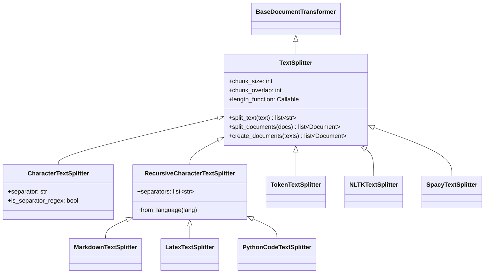
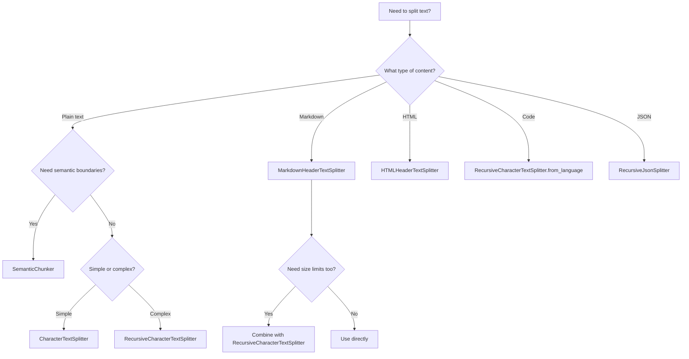

# Text Splitters in LangChain

## Introduction

Text splitting (also called chunking) is one of the most critical yet often underestimated steps in building effective RAG (Retrieval-Augmented Generation) applications. When you load a 50-page PDF or a complex codebase, you can't simply feed the entire content into an LLM—you need to break it into smaller, meaningful pieces that can be efficiently embedded, stored, and retrieved.

LangChain provides a comprehensive text splitting framework through the `langchain-text-splitters` package, offering everything from simple character-based splitting to sophisticated semantic chunking. The way you split your documents directly impacts retrieval accuracy, context relevance, and ultimately the quality of your AI application's responses.

> **🤖 AI Context:** Poor chunking is one of the top reasons RAG applications fail. A chunk that's too large loses semantic specificity in its embedding. A chunk that's too small loses context. Finding the right balance is both an art and a science.

---

## What We'll Cover

This lesson explores text splitting in depth across six focused sub-lessons:

| Lesson | Topic | Description |
|--------|-------|-------------|
| [01](./01-splitting-fundamentals.md) | Splitting Fundamentals | Core concepts: chunk size, overlap, length functions, semantic coherence |
| [02](./02-character-splitters.md) | Character Splitters | CharacterTextSplitter and RecursiveCharacterTextSplitter |
| [03](./03-document-type-splitters.md) | Document-Type Splitters | Markdown, HTML, JSON, and code-aware splitters |
| [04](./04-token-based-splitters.md) | Token-Based Splitters | Tiktoken, SentenceTransformers, and model-aware splitting |
| [05](./05-semantic-splitters.md) | Semantic Splitters | Embedding-based splitting with SemanticChunker |
| [06](./06-splitting-strategies.md) | Splitting Strategies | Best practices, optimization, and evaluation |

---

## Prerequisites

Before diving into text splitters, ensure you have:

- **Completed Lesson 6**: [Document Loaders](../06-document-loaders/00-document-loaders.md) — Understanding how documents are loaded
- **LangChain Core Knowledge**: Familiarity with Document objects and metadata
- **Python Environment**: Python 3.9+ with langchain packages installed

### Installation

```bash
# Core text splitters package
pip install langchain-text-splitters

# For token-based splitting
pip install tiktoken

# For semantic splitting (experimental)
pip install langchain-experimental

# For NLP-based splitting (optional)
pip install nltk spacy
```

---

## The Text Splitting Architecture

LangChain's text splitting system is built on a clean class hierarchy:



### Key Classes at a Glance

| Class | Package | Best For |
|-------|---------|----------|
| `CharacterTextSplitter` | langchain-text-splitters | Simple, single-separator splitting |
| `RecursiveCharacterTextSplitter` | langchain-text-splitters | Most general-purpose use cases |
| `MarkdownHeaderTextSplitter` | langchain-text-splitters | Markdown with header-based sections |
| `HTMLHeaderTextSplitter` | langchain-text-splitters | HTML documents |
| `RecursiveJsonSplitter` | langchain-text-splitters | Large JSON structures |
| `TokenTextSplitter` | langchain-text-splitters | Token-count based splitting |
| `SemanticChunker` | langchain-experimental | Embedding-based semantic splitting |

---

## Quick Start Example

Here's a complete example showing the most common text splitting pattern:

```python
from langchain_text_splitters import RecursiveCharacterTextSplitter
from langchain_core.documents import Document

# Sample document
long_text = """
# Introduction to Machine Learning

Machine learning is a subset of artificial intelligence that enables 
systems to learn and improve from experience without being explicitly 
programmed. It focuses on developing computer programs that can access 
data and use it to learn for themselves.

## Types of Machine Learning

### Supervised Learning
In supervised learning, the algorithm learns from labeled training data.
The model makes predictions based on input-output pairs provided during 
training.

### Unsupervised Learning
Unsupervised learning deals with unlabeled data. The algorithm tries to 
find hidden patterns or intrinsic structures in the input data.

### Reinforcement Learning
Reinforcement learning is about taking suitable actions to maximize 
reward in a particular situation. It is employed by various software 
and machines to find the best possible behavior or path.

## Applications

Machine learning has numerous applications including:
- Image and speech recognition
- Medical diagnosis
- Financial predictions
- Recommendation systems
- Natural language processing
"""

# Create the splitter
splitter = RecursiveCharacterTextSplitter(
    chunk_size=500,
    chunk_overlap=50,
    separators=["\n\n", "\n", " ", ""],
    length_function=len,
)

# Split the text
chunks = splitter.split_text(long_text)

print(f"Original length: {len(long_text)} characters")
print(f"Number of chunks: {len(chunks)}")
print(f"\nFirst chunk ({len(chunks[0])} chars):")
print(chunks[0])
```

**Output:**
```
Original length: 1247 characters
Number of chunks: 4

First chunk (389 chars):
# Introduction to Machine Learning

Machine learning is a subset of artificial intelligence that enables 
systems to learn and improve from experience without being explicitly 
programmed. It focuses on developing computer programs that can access 
data and use it to learn for themselves.

## Types of Machine Learning

### Supervised Learning
```

---

## Core Concepts Preview

### Chunk Size
The maximum size of each chunk. Default is typically 4000 characters:

```python
splitter = RecursiveCharacterTextSplitter(chunk_size=1000)
```

### Chunk Overlap
Characters shared between adjacent chunks to preserve context:

```python
splitter = RecursiveCharacterTextSplitter(
    chunk_size=1000,
    chunk_overlap=200  # 200 chars overlap between chunks
)
```

### Length Function
How to measure chunk size—characters or tokens:

```python
import tiktoken

# Character-based (default)
splitter = RecursiveCharacterTextSplitter(length_function=len)

# Token-based (for LLM context limits)
encoder = tiktoken.encoding_for_model("gpt-4")
splitter = RecursiveCharacterTextSplitter(
    length_function=lambda text: len(encoder.encode(text))
)
```

---

## When to Use Each Splitter



---

## Key Takeaways

✅ **Text splitting is foundational** — It directly impacts RAG retrieval quality

✅ **RecursiveCharacterTextSplitter is the default choice** — Works for most use cases

✅ **Use specialized splitters for structured content** — Markdown, HTML, code, JSON

✅ **Consider token-based splitting** — When working with LLM context limits

✅ **Semantic splitting offers precision** — At the cost of additional computation

---

## Lesson Navigation

**Start with the fundamentals:**

| Next Lesson | Description |
|-------------|-------------|
| [Splitting Fundamentals →](./01-splitting-fundamentals.md) | Deep dive into chunk_size, chunk_overlap, and core concepts |

**Or jump to a specific topic:**

- [Character Splitters](./02-character-splitters.md) — CharacterTextSplitter and RecursiveCharacterTextSplitter
- [Document-Type Splitters](./03-document-type-splitters.md) — Markdown, HTML, Code, JSON
- [Token-Based Splitters](./04-token-based-splitters.md) — Tiktoken and model-aware splitting
- [Semantic Splitters](./05-semantic-splitters.md) — Embedding-based chunking
- [Splitting Strategies](./06-splitting-strategies.md) — Best practices and optimization

---

## Further Reading

- [LangChain Text Splitters API Reference](https://python.langchain.com/docs/modules/data_connection/document_transformers/)
- [LangChain Text Splitters Package](https://github.com/langchain-ai/langchain/tree/main/libs/text-splitters)
- [Chunking Strategies for LLM Applications](https://www.pinecone.io/learn/chunking-strategies/)

---

**Previous:** [Document Loaders](../06-document-loaders/00-document-loaders.md) | **Next:** [Splitting Fundamentals](./01-splitting-fundamentals.md)

<!-- 
Sources Consulted:
- LangChain text-splitters package: https://github.com/langchain-ai/langchain/tree/main/libs/text-splitters
- langchain_text_splitters/__init__.py for class hierarchy
- langchain_text_splitters/base.py for TextSplitter base class
-->
