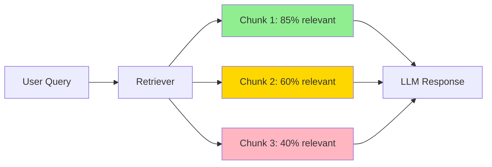

# Splitting Fundamentals

## Introduction

Before you can build an effective RAG application, you need to understand why and how to split your documents. Text splitting isn't just about breaking large files into smaller pieces—it's about creating semantically meaningful chunks that preserve context while enabling precise retrieval.

This lesson covers the foundational concepts that apply to all text splitters in LangChain: chunk size, overlap, length functions, and the critical balance between context and specificity.

### What We'll Cover

- Why chunking matters for RAG applications
- Chunk size: finding the right balance
- Chunk overlap: preserving context across boundaries
- Length functions: characters vs tokens
- Semantic coherence and metadata preservation
- The TextSplitter base class interface

### Prerequisites

- Understanding of [Document Loaders](../06-document-loaders/00-document-loaders.md)
- Basic Python knowledge
- Familiarity with LangChain Document objects

---

## Why Chunking Matters

When building RAG applications, chunking quality directly impacts three critical factors:

### 1. Embedding Quality

Embeddings work best when the text has a clear, focused meaning. A 500-word chunk about a single topic produces a more useful embedding than a 500-word chunk that covers five different topics.

```python
# ❌ Poor: Chunk covers multiple unrelated topics
chunk_bad = """
Machine learning uses statistical techniques. 
The capital of France is Paris.
Python was created by Guido van Rossum.
"""

# ✅ Good: Chunk has semantic coherence
chunk_good = """
Machine learning uses statistical techniques to give 
computers the ability to learn from data. These techniques 
include linear regression, decision trees, and neural networks.
"""
```

### 2. Retrieval Precision

When a user asks a question, your retriever searches for relevant chunks. Chunks that are too large return too much irrelevant content. Chunks that are too small may miss important context.



### 3. Context Window Efficiency

LLMs have limited context windows. If you retrieve 5 chunks of 2000 tokens each, you've used 10,000 tokens before even asking a question. Optimal chunk sizes maximize information density within context limits.

> **🔑 Key Insight:** The goal isn't to minimize or maximize chunk size—it's to find the size where each chunk contains exactly the right amount of context for your use case.

---

## The TextSplitter Base Class

All LangChain text splitters inherit from `TextSplitter`, which provides a consistent interface:

```python
from langchain_text_splitters import TextSplitter
from langchain_core.documents import Document

class TextSplitter:
    def __init__(
        self,
        chunk_size: int = 4000,
        chunk_overlap: int = 200,
        length_function: Callable[[str], int] = len,
        keep_separator: bool | str = False,
        add_start_index: bool = False,
        strip_whitespace: bool = True,
    ) -> None:
        ...
    
    def split_text(self, text: str) -> list[str]:
        """Split raw text into chunks."""
        ...
    
    def split_documents(self, documents: list[Document]) -> list[Document]:
        """Split Document objects, preserving metadata."""
        ...
    
    def create_documents(
        self, 
        texts: list[str], 
        metadatas: list[dict] | None = None
    ) -> list[Document]:
        """Create Document objects from texts."""
        ...
```

### Core Methods

| Method | Input | Output | Use Case |
|--------|-------|--------|----------|
| `split_text()` | `str` | `list[str]` | When you have raw text |
| `split_documents()` | `list[Document]` | `list[Document]` | When you have Documents from loaders |
| `create_documents()` | `list[str]` + metadata | `list[Document]` | When you need to add metadata to text |

### Example: Using Each Method

```python
from langchain_text_splitters import RecursiveCharacterTextSplitter
from langchain_core.documents import Document

splitter = RecursiveCharacterTextSplitter(
    chunk_size=200,
    chunk_overlap=20
)

# Method 1: split_text() - raw text to list of strings
raw_text = "A long document... " * 100
chunks = splitter.split_text(raw_text)
print(f"split_text() returned {len(chunks)} strings")

# Method 2: split_documents() - Documents to Documents
documents = [
    Document(page_content="First doc content... " * 50, metadata={"source": "file1.txt"}),
    Document(page_content="Second doc content... " * 50, metadata={"source": "file2.txt"}),
]
split_docs = splitter.split_documents(documents)
print(f"split_documents() returned {len(split_docs)} Documents")
print(f"Metadata preserved: {split_docs[0].metadata}")

# Method 3: create_documents() - texts + metadata to Documents
texts = ["Text one... " * 50, "Text two... " * 50]
metadatas = [{"source": "api"}, {"source": "api"}]
created_docs = splitter.create_documents(texts, metadatas=metadatas)
print(f"create_documents() returned {len(created_docs)} Documents")
```

**Output:**
```
split_text() returned 12 strings
split_documents() returned 7 Documents
Metadata preserved: {'source': 'file1.txt'}
create_documents() returned 7 Documents
```

---

## Chunk Size

Chunk size is the maximum number of units (characters or tokens) in each chunk. The default in LangChain is 4000 characters.

### Finding the Right Chunk Size

| Chunk Size | Pros | Cons | Best For |
|------------|------|------|----------|
| **Small (100-500)** | Precise retrieval, focused embeddings | Loses context, more chunks to process | Q&A with specific facts |
| **Medium (500-1500)** | Good balance of context and precision | May split mid-paragraph | General RAG applications |
| **Large (1500-4000)** | Rich context, fewer chunks | Less precise retrieval | Summarization, complex reasoning |

### Practical Guidelines

```python
from langchain_text_splitters import RecursiveCharacterTextSplitter

# For FAQ/documentation retrieval
faq_splitter = RecursiveCharacterTextSplitter(
    chunk_size=500,
    chunk_overlap=50
)

# For general RAG applications
general_splitter = RecursiveCharacterTextSplitter(
    chunk_size=1000,
    chunk_overlap=200
)

# For complex documents requiring more context
context_rich_splitter = RecursiveCharacterTextSplitter(
    chunk_size=2000,
    chunk_overlap=400
)
```

### Chunk Size and Model Context

Consider your LLM's context window when setting chunk size:

```python
# If using GPT-4-turbo (128K context)
# You can afford larger chunks + more retrieved documents

# If using a 4K context model
# Keep chunks smaller to fit more in context

import tiktoken

def calculate_max_chunks(
    context_limit: int,
    chunk_size_tokens: int,
    reserved_for_query: int = 500,
    reserved_for_response: int = 1000
) -> int:
    """Calculate how many chunks fit in context."""
    available = context_limit - reserved_for_query - reserved_for_response
    return available // chunk_size_tokens

# Example: 8K context model
max_chunks = calculate_max_chunks(
    context_limit=8192,
    chunk_size_tokens=500,
    reserved_for_query=500,
    reserved_for_response=1500
)
print(f"Can fit {max_chunks} chunks of 500 tokens")  # Output: 12
```

---

## Chunk Overlap

Overlap ensures context isn't lost at chunk boundaries. When a sentence or idea spans two chunks, overlap helps preserve the connection.

### How Overlap Works

```
Text: "Machine learning models learn patterns from data. These patterns 
       enable predictions on new, unseen examples."

Without overlap (chunk_size=50):
  Chunk 1: "Machine learning models learn patterns from da"
  Chunk 2: "ta. These patterns enable predictions on new,"
  Chunk 3: " unseen examples."

With overlap=15 (chunk_size=50):
  Chunk 1: "Machine learning models learn patterns from da"
  Chunk 2: "patterns from data. These patterns enable pred"
  Chunk 3: "enable predictions on new, unseen examples."
```

### Overlap Guidelines

| Scenario | Recommended Overlap | Rationale |
|----------|---------------------|-----------|
| Simple documents | 10-15% of chunk_size | Minimal context loss |
| Technical content | 15-25% of chunk_size | Preserve definitions/concepts |
| Narrative text | 20-30% of chunk_size | Maintain story flow |
| Code | 0-10% of chunk_size | Functions are self-contained |

```python
from langchain_text_splitters import RecursiveCharacterTextSplitter

# Calculate overlap as percentage
def create_splitter(chunk_size: int, overlap_percent: float = 0.15):
    """Create splitter with overlap as percentage of chunk size."""
    overlap = int(chunk_size * overlap_percent)
    return RecursiveCharacterTextSplitter(
        chunk_size=chunk_size,
        chunk_overlap=overlap
    )

# Example usage
splitter = create_splitter(chunk_size=1000, overlap_percent=0.20)
print(f"Chunk overlap: {splitter._chunk_overlap}")  # Output: 200
```

### Visualizing Overlap

```python
def visualize_chunks(text: str, splitter) -> None:
    """Visualize how chunks overlap."""
    chunks = splitter.split_text(text)
    
    for i, chunk in enumerate(chunks):
        print(f"\n--- Chunk {i+1} ({len(chunk)} chars) ---")
        print(chunk[:100] + "..." if len(chunk) > 100 else chunk)
        
        if i > 0:
            # Find overlap with previous chunk
            prev_chunk = chunks[i-1]
            overlap_text = ""
            for j in range(min(len(prev_chunk), len(chunk))):
                if prev_chunk[-j-1:] == chunk[:j+1] and j > 5:
                    overlap_text = chunk[:j+1]
            if overlap_text:
                print(f"  ↑ Overlap: '{overlap_text[:50]}...'")

# Example
text = "Paragraph one about machine learning. " * 10 + \
       "Paragraph two about deep learning. " * 10
       
splitter = RecursiveCharacterTextSplitter(chunk_size=200, chunk_overlap=50)
visualize_chunks(text, splitter)
```

---

## Length Functions

By default, LangChain measures chunk size in characters. But LLMs work with tokens, not characters. Using a token-based length function ensures your chunks fit precisely within model limits.

### Characters vs Tokens

```python
import tiktoken

text = "Artificial intelligence is transforming industries."

# Character count
char_count = len(text)
print(f"Characters: {char_count}")  # 51

# Token count (GPT-4)
encoder = tiktoken.encoding_for_model("gpt-4")
token_count = len(encoder.encode(text))
print(f"Tokens: {token_count}")  # 7

# Ratio varies by content
print(f"Chars per token: {char_count / token_count:.1f}")  # ~7.3
```

> **⚠️ Warning:** The character-to-token ratio varies significantly by language and content type. English averages ~4 chars/token, but code, URLs, and non-English text can be very different.

### Using Token-Based Length Functions

```python
from langchain_text_splitters import RecursiveCharacterTextSplitter
import tiktoken

# Method 1: Direct tiktoken integration
encoder = tiktoken.encoding_for_model("gpt-4")

splitter = RecursiveCharacterTextSplitter(
    chunk_size=500,  # Now means 500 tokens
    chunk_overlap=50,
    length_function=lambda text: len(encoder.encode(text))
)

# Method 2: Using from_tiktoken_encoder (recommended)
splitter = RecursiveCharacterTextSplitter.from_tiktoken_encoder(
    model_name="gpt-4",
    chunk_size=500,
    chunk_overlap=50
)

# Test it
text = "Hello world! " * 1000
chunks = splitter.split_text(text)
print(f"Number of chunks: {len(chunks)}")
print(f"First chunk token count: {len(encoder.encode(chunks[0]))}")
```

**Output:**
```
Number of chunks: 10
First chunk token count: 498
```

### Comparison: Character vs Token Splitting

```python
from langchain_text_splitters import RecursiveCharacterTextSplitter
import tiktoken

text = """
def calculate_fibonacci(n: int) -> list[int]:
    '''Calculate Fibonacci sequence up to n terms.'''
    if n <= 0:
        return []
    elif n == 1:
        return [0]
    sequence = [0, 1]
    while len(sequence) < n:
        sequence.append(sequence[-1] + sequence[-2])
    return sequence
""" * 5

# Character-based splitter
char_splitter = RecursiveCharacterTextSplitter(
    chunk_size=500,
    chunk_overlap=50
)

# Token-based splitter
token_splitter = RecursiveCharacterTextSplitter.from_tiktoken_encoder(
    model_name="gpt-4",
    chunk_size=100,  # 100 tokens ≈ 400-500 chars for code
    chunk_overlap=10
)

char_chunks = char_splitter.split_text(text)
token_chunks = token_splitter.split_text(text)

encoder = tiktoken.encoding_for_model("gpt-4")

print(f"Character-based: {len(char_chunks)} chunks")
for i, chunk in enumerate(char_chunks[:2]):
    print(f"  Chunk {i+1}: {len(chunk)} chars, {len(encoder.encode(chunk))} tokens")

print(f"\nToken-based: {len(token_chunks)} chunks")
for i, chunk in enumerate(token_chunks[:2]):
    print(f"  Chunk {i+1}: {len(chunk)} chars, {len(encoder.encode(chunk))} tokens")
```

---

## Semantic Coherence

The best splitting preserves meaning. A chunk should ideally contain a complete thought, not cut off mid-sentence or mid-paragraph.

### The RecursiveCharacterTextSplitter Approach

The recursive splitter tries separators in order, preferring to split at natural boundaries:

```python
default_separators = [
    "\n\n",    # First: paragraph breaks
    "\n",       # Then: line breaks
    " ",        # Then: word boundaries
    ""          # Finally: character by character
]
```

This means it will:
1. Try to split between paragraphs
2. If chunks are still too large, split between lines
3. If still too large, split between words
4. Only as a last resort, split mid-word

### Separator Strategy Example

```python
from langchain_text_splitters import RecursiveCharacterTextSplitter

text = """
# Chapter 1: Introduction

This is the first paragraph of the introduction. It contains 
important background information about the topic.

This is the second paragraph. It builds on the first paragraph
and introduces new concepts.

# Chapter 2: Methods

This chapter describes the methodology used in our research.
"""

# Default separators prioritize paragraph breaks
splitter = RecursiveCharacterTextSplitter(
    chunk_size=200,
    chunk_overlap=20,
    separators=["\n\n", "\n", " ", ""]  # default
)

chunks = splitter.split_text(text)
for i, chunk in enumerate(chunks):
    print(f"\n--- Chunk {i+1} ---")
    print(chunk.strip())
```

**Output:**
```
--- Chunk 1 ---
# Chapter 1: Introduction

This is the first paragraph of the introduction. It contains 
important background information about the topic.

--- Chunk 2 ---
This is the second paragraph. It builds on the first paragraph
and introduces new concepts.

--- Chunk 3 ---
# Chapter 2: Methods

This chapter describes the methodology used in our research.
```

Notice how the splitter kept paragraphs together and avoided splitting mid-sentence.

---

## Metadata Preservation

When splitting documents, metadata from the original document should flow to each chunk. LangChain handles this automatically with `split_documents()`:

```python
from langchain_text_splitters import RecursiveCharacterTextSplitter
from langchain_core.documents import Document

# Original document with metadata
doc = Document(
    page_content="A long document about Python programming... " * 50,
    metadata={
        "source": "python_tutorial.pdf",
        "page": 1,
        "author": "Jane Doe",
        "created": "2024-01-15"
    }
)

splitter = RecursiveCharacterTextSplitter(
    chunk_size=200,
    chunk_overlap=20,
    add_start_index=True  # Add position information
)

chunks = splitter.split_documents([doc])

print(f"Original: 1 document")
print(f"After splitting: {len(chunks)} chunks")
print(f"\nFirst chunk metadata: {chunks[0].metadata}")
print(f"Last chunk metadata: {chunks[-1].metadata}")
```

**Output:**
```
Original: 1 document
After splitting: 12 chunks

First chunk metadata: {'source': 'python_tutorial.pdf', 'page': 1, 
                       'author': 'Jane Doe', 'created': '2024-01-15', 
                       'start_index': 0}
Last chunk metadata: {'source': 'python_tutorial.pdf', 'page': 1, 
                      'author': 'Jane Doe', 'created': '2024-01-15', 
                      'start_index': 2156}
```

### The add_start_index Parameter

Setting `add_start_index=True` tracks where each chunk came from in the original document:

```python
splitter = RecursiveCharacterTextSplitter(
    chunk_size=500,
    chunk_overlap=50,
    add_start_index=True
)

text = "Paragraph 1. " * 20 + "Paragraph 2. " * 20 + "Paragraph 3. " * 20

docs = splitter.create_documents([text])

for i, doc in enumerate(docs):
    start = doc.metadata.get('start_index', 0)
    print(f"Chunk {i+1}: starts at index {start}, length {len(doc.page_content)}")
```

This is useful for:
- Debugging which chunks were retrieved
- Creating citations back to source documents
- Combining adjacent chunks when needed

---

## Hands-on Exercise

### Your Task

Build a document splitting pipeline that:
1. Takes a sample document (provided below)
2. Splits it using both character and token-based approaches
3. Compares the results
4. Finds the optimal chunk size for retrieval

### Sample Document

```python
sample_document = """
# Machine Learning Fundamentals

## 1. What is Machine Learning?

Machine learning is a subset of artificial intelligence (AI) that provides systems 
the ability to automatically learn and improve from experience without being 
explicitly programmed. Machine learning focuses on the development of computer 
programs that can access data and use it to learn for themselves.

The process of learning begins with observations or data, such as examples, direct 
experience, or instruction, in order to look for patterns in data and make better 
decisions in the future based on the examples that we provide.

## 2. Types of Machine Learning

### Supervised Learning

In supervised learning, algorithms learn from labeled training data, and make 
predictions on unseen data. The algorithm learns a function that maps input to 
output based on example input-output pairs.

Common algorithms include:
- Linear Regression
- Logistic Regression
- Decision Trees
- Random Forests
- Support Vector Machines
- Neural Networks

### Unsupervised Learning

Unsupervised learning is where you only have input data and no corresponding output 
variables. The goal is to model the underlying structure or distribution in the data 
in order to learn more about the data.

Common algorithms include:
- K-Means Clustering
- Hierarchical Clustering
- Principal Component Analysis
- Autoencoders

### Reinforcement Learning

Reinforcement learning is a type of machine learning where an agent learns to make 
decisions by taking actions in an environment to maximize cumulative reward. The 
agent learns from the consequences of its actions, rather than from being explicitly 
taught.

## 3. Model Evaluation

Evaluating machine learning models is crucial for understanding their performance. 
Common metrics include:

- Accuracy: The ratio of correctly predicted instances to total instances
- Precision: The ratio of correctly predicted positive observations
- Recall: The ratio of correctly predicted positive observations to all actual positives
- F1 Score: The weighted average of Precision and Recall
- ROC-AUC: Area under the Receiver Operating Characteristic curve

## 4. Conclusion

Machine learning is a powerful tool for extracting insights from data. Understanding 
the fundamentals is essential for building effective ML systems.
"""
```

### Requirements

1. Create two splitters: one character-based, one token-based
2. Use `chunk_size=500` for characters, `chunk_size=100` for tokens
3. Use 15% overlap for both
4. Print statistics about each approach
5. Identify which chunks contain information about "supervised learning"

### Expected Result

Your output should show:
- Number of chunks for each approach
- Average chunk size (in characters and tokens)
- Which chunks contain relevant information

<details>
<summary>💡 Hints (click to expand)</summary>

- Use `RecursiveCharacterTextSplitter` for both approaches
- Use `.from_tiktoken_encoder()` for token-based splitting
- Loop through chunks and check `if "supervised" in chunk.lower()`
- Calculate average size with `sum(len(c) for c in chunks) / len(chunks)`

</details>

<details>
<summary>✅ Solution (click to expand)</summary>

```python
from langchain_text_splitters import RecursiveCharacterTextSplitter
import tiktoken

# Sample document (use the one provided above)
sample_document = """..."""  # Full document here

# Character-based splitter (500 chars, 15% overlap)
char_splitter = RecursiveCharacterTextSplitter(
    chunk_size=500,
    chunk_overlap=75  # 15% of 500
)

# Token-based splitter (100 tokens, 15% overlap)
token_splitter = RecursiveCharacterTextSplitter.from_tiktoken_encoder(
    model_name="gpt-4",
    chunk_size=100,
    chunk_overlap=15  # 15% of 100
)

# Split the document
char_chunks = char_splitter.split_text(sample_document)
token_chunks = token_splitter.split_text(sample_document)

# Get encoder for analysis
encoder = tiktoken.encoding_for_model("gpt-4")

# Print statistics
print("=" * 50)
print("CHARACTER-BASED SPLITTING")
print("=" * 50)
print(f"Number of chunks: {len(char_chunks)}")
avg_chars = sum(len(c) for c in char_chunks) / len(char_chunks)
avg_tokens = sum(len(encoder.encode(c)) for c in char_chunks) / len(char_chunks)
print(f"Average chunk size: {avg_chars:.0f} chars, {avg_tokens:.0f} tokens")

# Find chunks about supervised learning
print("\nChunks containing 'supervised learning':")
for i, chunk in enumerate(char_chunks):
    if "supervised" in chunk.lower():
        print(f"  Chunk {i+1}: {chunk[:80]}...")

print("\n" + "=" * 50)
print("TOKEN-BASED SPLITTING")
print("=" * 50)
print(f"Number of chunks: {len(token_chunks)}")
avg_chars = sum(len(c) for c in token_chunks) / len(token_chunks)
avg_tokens = sum(len(encoder.encode(c)) for c in token_chunks) / len(token_chunks)
print(f"Average chunk size: {avg_chars:.0f} chars, {avg_tokens:.0f} tokens")

print("\nChunks containing 'supervised learning':")
for i, chunk in enumerate(token_chunks):
    if "supervised" in chunk.lower():
        print(f"  Chunk {i+1}: {chunk[:80]}...")
```

</details>

### Bonus Challenges

- [ ] Add the document source as metadata and verify it's preserved after splitting
- [ ] Experiment with different overlap percentages (5%, 25%, 50%) and compare results
- [ ] Create a custom length function that counts words instead of characters

---

## Summary

✅ **Chunking quality is critical** — It directly impacts embedding quality and retrieval precision

✅ **TextSplitter provides the foundation** — With `split_text()`, `split_documents()`, and `create_documents()`

✅ **Chunk size is a trade-off** — Smaller = more precise, larger = more context

✅ **Overlap preserves context** — Use 15-25% overlap for most use cases

✅ **Token-based length functions are accurate** — Use `from_tiktoken_encoder()` for LLM applications

✅ **Metadata is preserved automatically** — Use `add_start_index=True` for position tracking

---

**Next:** [Character Splitters](./02-character-splitters.md) — Deep dive into CharacterTextSplitter and RecursiveCharacterTextSplitter

---

## Further Reading

- [LangChain TextSplitter API Reference](https://api.python.langchain.com/en/latest/text_splitters/)
- [Tiktoken Encoding Documentation](https://github.com/openai/tiktoken)
- [Chunking for RAG Best Practices](https://www.pinecone.io/learn/chunking-strategies/)

---

**Previous:** [Text Splitters Overview](./00-text-splitters.md) | **Next:** [Character Splitters](./02-character-splitters.md)

<!-- 
Sources Consulted:
- langchain_text_splitters/base.py for TextSplitter class
- tiktoken library for token counting
- LangChain text splitting documentation
-->
