# Character Splitters

## Introduction

Character-based splitters are the workhorses of text splitting in LangChain. They split text based on string separators rather than semantic understanding, making them fast, predictable, and suitable for most use cases. This lesson covers the two primary character splitters: `CharacterTextSplitter` for simple cases and `RecursiveCharacterTextSplitter` for everything else.

### What We'll Cover

- CharacterTextSplitter: single-separator splitting
- RecursiveCharacterTextSplitter: hierarchical separator strategy
- Separator configuration and regex patterns
- Language-specific separators with `from_language()`
- The `keep_separator` parameter
- When to use each splitter

### Prerequisites

- Completion of [Splitting Fundamentals](./01-splitting-fundamentals.md)
- Understanding of regular expressions (helpful but not required)

---

## CharacterTextSplitter

The `CharacterTextSplitter` is the simplest splitter—it splits text on a single separator.

### Basic Usage

```python
from langchain_text_splitters import CharacterTextSplitter

# Default: split on double newlines (paragraphs)
splitter = CharacterTextSplitter(
    separator="\n\n",
    chunk_size=1000,
    chunk_overlap=200
)

text = """
First paragraph with important information.

Second paragraph with more details.

Third paragraph wrapping up the content.
"""

chunks = splitter.split_text(text)
for i, chunk in enumerate(chunks):
    print(f"Chunk {i+1}: {chunk[:50]}...")
```

**Output:**
```
Chunk 1: First paragraph with important information....
Chunk 2: Second paragraph with more details....
Chunk 3: Third paragraph wrapping up the content....
```

### Parameters

| Parameter | Type | Default | Description |
|-----------|------|---------|-------------|
| `separator` | str | `"\n\n"` | String to split on |
| `is_separator_regex` | bool | `False` | Treat separator as regex pattern |
| `chunk_size` | int | `4000` | Maximum chunk size |
| `chunk_overlap` | int | `200` | Characters to overlap |
| `keep_separator` | bool/str | `False` | Keep separator in chunks |
| `strip_whitespace` | bool | `True` | Strip whitespace from chunks |

### Using Different Separators

```python
from langchain_text_splitters import CharacterTextSplitter

# Split on single newlines
line_splitter = CharacterTextSplitter(
    separator="\n",
    chunk_size=500,
    chunk_overlap=50
)

# Split on periods (sentences)
sentence_splitter = CharacterTextSplitter(
    separator=". ",
    chunk_size=500,
    chunk_overlap=50,
    keep_separator="end"  # Keep period with sentence
)

# Split on custom delimiter
csv_splitter = CharacterTextSplitter(
    separator=",",
    chunk_size=100,
    chunk_overlap=0
)
```

### Regex Separators

For complex patterns, enable regex mode:

```python
from langchain_text_splitters import CharacterTextSplitter

# Split on any whitespace sequence
whitespace_splitter = CharacterTextSplitter(
    separator=r"\s+",
    is_separator_regex=True,
    chunk_size=500,
    chunk_overlap=50
)

# Split on sentence endings (. ! ?)
sentence_splitter = CharacterTextSplitter(
    separator=r"[.!?]+\s+",
    is_separator_regex=True,
    chunk_size=500,
    chunk_overlap=50
)

# Split on markdown headers
header_splitter = CharacterTextSplitter(
    separator=r"\n#{1,6}\s+",
    is_separator_regex=True,
    chunk_size=1000,
    chunk_overlap=100
)

# Test the sentence splitter
text = "Hello world! How are you? I am fine. Thanks for asking!"
chunks = sentence_splitter.split_text(text)
print(chunks)
```

**Output:**
```
['Hello world!', 'How are you?', 'I am fine.', 'Thanks for asking!']
```

### Lookaround Regex Patterns

For advanced splitting without consuming the separator:

```python
from langchain_text_splitters import CharacterTextSplitter

# Split BEFORE capital letters (useful for CamelCase)
camel_splitter = CharacterTextSplitter(
    separator=r"(?=[A-Z])",
    is_separator_regex=True,
    chunk_size=50,
    chunk_overlap=0
)

text = "ThisIsACamelCaseString"
chunks = camel_splitter.split_text(text)
print(chunks)  # ['This', 'Is', 'A', 'Camel', 'Case', 'String']

# Split AFTER certain patterns
after_splitter = CharacterTextSplitter(
    separator=r"(?<=\n\n)",  # After double newlines
    is_separator_regex=True,
    chunk_size=500,
    chunk_overlap=50
)
```

> **Note:** Lookaround patterns (`(?=...)`, `(?<=...)`, `(?!...)`, `(?<!...)`) are zero-width assertions that don't consume characters. They're useful when you want to split at a position without losing the separator.

---

## RecursiveCharacterTextSplitter

The `RecursiveCharacterTextSplitter` is the **recommended default** for most use cases. It tries multiple separators in order, preferring to split at natural boundaries.

### How It Works

The recursive splitter:
1. Tries the first separator (e.g., `\n\n` for paragraphs)
2. If any chunk is still too large, tries the next separator (e.g., `\n`)
3. Continues until all chunks are within size limits

```mermaid
flowchart TD
    A[Input Text] --> B{Split on '\n\n'}
    B --> C[Chunk 1: OK ✓]
    B --> D[Chunk 2: Too Large]
    B --> E[Chunk 3: OK ✓]
    
    D --> F{Split on '\n'}
    F --> G[Chunk 2a: OK ✓]
    F --> H[Chunk 2b: Still Large]
    
    H --> I{Split on ' '}
    I --> J[Chunk 2b-i: OK ✓]
    I --> K[Chunk 2b-ii: OK ✓]
```



### Basic Usage

```python
from langchain_text_splitters import RecursiveCharacterTextSplitter

splitter = RecursiveCharacterTextSplitter(
    chunk_size=500,
    chunk_overlap=50,
    separators=["\n\n", "\n", " ", ""],  # Default
)

text = """
# Introduction

This is the first paragraph of the document. It contains 
several sentences that explain the main topic.

This is the second paragraph. It provides additional context
and details that support the introduction.

## Section One

Here we dive into the first major section. This section
covers important concepts in detail.

### Subsection

More specific information goes here.
"""

chunks = splitter.split_text(text)
for i, chunk in enumerate(chunks):
    print(f"\n--- Chunk {i+1} ({len(chunk)} chars) ---")
    print(chunk.strip())
```

### Default Separators

The default separator list prioritizes semantic boundaries:

```python
default_separators = [
    "\n\n",  # Paragraph breaks (highest priority)
    "\n",    # Line breaks
    " ",     # Word boundaries
    ""       # Character by character (last resort)
]
```

### Custom Separators

Customize for your content type:

```python
from langchain_text_splitters import RecursiveCharacterTextSplitter

# For markdown documents
markdown_splitter = RecursiveCharacterTextSplitter(
    separators=[
        "\n## ",      # H2 headers
        "\n### ",     # H3 headers
        "\n#### ",    # H4 headers
        "\n\n",       # Paragraphs
        "\n",         # Lines
        " ",          # Words
        ""            # Characters
    ],
    chunk_size=1000,
    chunk_overlap=100
)

# For code
code_splitter = RecursiveCharacterTextSplitter(
    separators=[
        "\n\nclass ",     # Class definitions
        "\n\ndef ",       # Function definitions
        "\n\n",           # Blank lines
        "\n",             # New lines
        " ",              # Spaces
        ""                # Characters
    ],
    chunk_size=1500,
    chunk_overlap=150
)

# For legal/formal documents
legal_splitter = RecursiveCharacterTextSplitter(
    separators=[
        "\n\nARTICLE ",   # Article breaks
        "\n\nSection ",   # Section breaks
        "\n\n",           # Paragraphs
        ";\n",            # Clause endings
        "\n",             # Lines
        " ",              # Words
        ""                # Characters
    ],
    chunk_size=2000,
    chunk_overlap=200
)
```

### Regex Separators in Recursive Splitter

```python
from langchain_text_splitters import RecursiveCharacterTextSplitter

# Use regex patterns
splitter = RecursiveCharacterTextSplitter(
    separators=[
        r"\n#{1,6}\s+",   # Markdown headers (regex)
        r"\n\n",          # Paragraphs
        r"\n",            # Lines
        r"\s+",           # Whitespace
        r""               # Characters
    ],
    is_separator_regex=True,
    chunk_size=500,
    chunk_overlap=50
)
```

---

## The keep_separator Parameter

Control whether separators are included in chunks:

```python
from langchain_text_splitters import RecursiveCharacterTextSplitter

text = """Chapter 1: Introduction

Welcome to the book.

Chapter 2: Methods

This chapter covers methodology."""

# keep_separator=False (default) - separators removed
splitter_no_sep = RecursiveCharacterTextSplitter(
    chunk_size=100,
    chunk_overlap=0,
    keep_separator=False
)
print("keep_separator=False:")
for chunk in splitter_no_sep.split_text(text):
    print(f"  '{chunk.strip()[:40]}...'")

# keep_separator="start" - separator at chunk start
splitter_start = RecursiveCharacterTextSplitter(
    chunk_size=100,
    chunk_overlap=0,
    keep_separator="start"
)
print("\nkeep_separator='start':")
for chunk in splitter_start.split_text(text):
    print(f"  '{chunk.strip()[:40]}...'")

# keep_separator="end" - separator at chunk end
splitter_end = RecursiveCharacterTextSplitter(
    chunk_size=100,
    chunk_overlap=0,
    keep_separator="end"
)
print("\nkeep_separator='end':")
for chunk in splitter_end.split_text(text):
    print(f"  '{chunk.strip()[:40]}...'")
```

---

## Language-Specific Splitters with from_language()

The `RecursiveCharacterTextSplitter.from_language()` factory method creates splitters with language-specific separators:

### Supported Languages

```python
from langchain_text_splitters import Language

# All supported languages
for lang in Language:
    print(lang)
```

**Available Languages:**
- `Language.PYTHON`
- `Language.JAVA`
- `Language.JAVASCRIPT` / `Language.JS`
- `Language.TYPESCRIPT` / `Language.TS`
- `Language.CPP`
- `Language.GO`
- `Language.RUST`
- `Language.RUBY`
- `Language.PHP`
- `Language.SCALA`
- `Language.SWIFT`
- `Language.KOTLIN`
- `Language.MARKDOWN`
- `Language.LATEX`
- `Language.HTML`
- `Language.SOL` (Solidity)
- `Language.CSHARP`
- `Language.COBOL`
- `Language.C`
- `Language.LUA`
- `Language.PERL`
- `Language.HASKELL`
- `Language.ELIXIR`
- `Language.POWERSHELL`
- `Language.PROTO`
- `Language.RST`

### Using from_language()

```python
from langchain_text_splitters import (
    RecursiveCharacterTextSplitter,
    Language
)

# Python code splitter
python_splitter = RecursiveCharacterTextSplitter.from_language(
    language=Language.PYTHON,
    chunk_size=1000,
    chunk_overlap=100
)

python_code = '''
import os
from typing import List, Optional

class DataProcessor:
    """Process data from various sources."""
    
    def __init__(self, config: dict):
        self.config = config
        self._cache = {}
    
    def process(self, data: List[dict]) -> List[dict]:
        """Process a list of data records."""
        results = []
        for record in data:
            processed = self._process_single(record)
            results.append(processed)
        return results
    
    def _process_single(self, record: dict) -> dict:
        """Process a single record."""
        return {k: v.strip() for k, v in record.items()}


def main():
    processor = DataProcessor({})
    data = [{"name": " Alice "}, {"name": " Bob "}]
    result = processor.process(data)
    print(result)


if __name__ == "__main__":
    main()
'''

chunks = python_splitter.split_text(python_code)
print(f"Split into {len(chunks)} chunks:")
for i, chunk in enumerate(chunks):
    print(f"\n--- Chunk {i+1} ({len(chunk)} chars) ---")
    print(chunk.strip()[:200] + "..." if len(chunk) > 200 else chunk.strip())
```

### Language Separator Details

Get the separators for any language:

```python
from langchain_text_splitters import RecursiveCharacterTextSplitter, Language

# View Python separators
python_seps = RecursiveCharacterTextSplitter.get_separators_for_language(
    Language.PYTHON
)
print("Python separators:")
for sep in python_seps:
    print(f"  {repr(sep)}")

# View JavaScript separators
js_seps = RecursiveCharacterTextSplitter.get_separators_for_language(
    Language.JAVASCRIPT
)
print("\nJavaScript separators:")
for sep in js_seps:
    print(f"  {repr(sep)}")
```

**Output:**
```
Python separators:
  '\nclass '
  '\ndef '
  '\n\tdef '
  '\n\n'
  '\n'
  ' '
  ''

JavaScript separators:
  '\nfunction '
  '\nconst '
  '\nlet '
  '\nvar '
  '\nclass '
  '\nif '
  '\nfor '
  '\nwhile '
  '\nswitch '
  '\ncase '
  '\ndefault '
  '\n\n'
  '\n'
  ' '
  ''
```

### JavaScript/TypeScript Example

```python
from langchain_text_splitters import RecursiveCharacterTextSplitter, Language

js_splitter = RecursiveCharacterTextSplitter.from_language(
    language=Language.JAVASCRIPT,
    chunk_size=500,
    chunk_overlap=50
)

javascript_code = '''
// User service module
import { Database } from './database';

const CONFIG = {
    maxRetries: 3,
    timeout: 5000
};

class UserService {
    constructor(db) {
        this.db = db;
    }
    
    async getUser(id) {
        return await this.db.findById('users', id);
    }
    
    async createUser(userData) {
        const validated = this.validateUser(userData);
        return await this.db.insert('users', validated);
    }
    
    validateUser(data) {
        if (!data.email) throw new Error('Email required');
        if (!data.name) throw new Error('Name required');
        return data;
    }
}

function initializeApp() {
    const db = new Database();
    const userService = new UserService(db);
    return { db, userService };
}

export { UserService, initializeApp };
'''

chunks = js_splitter.split_text(javascript_code)
for i, chunk in enumerate(chunks):
    print(f"\n--- Chunk {i+1} ---")
    print(chunk.strip())
```

### Markdown Example

```python
from langchain_text_splitters import RecursiveCharacterTextSplitter, Language

md_splitter = RecursiveCharacterTextSplitter.from_language(
    language=Language.MARKDOWN,
    chunk_size=500,
    chunk_overlap=50
)

# View Markdown separators
md_seps = RecursiveCharacterTextSplitter.get_separators_for_language(
    Language.MARKDOWN
)
print("Markdown separators:")
for sep in md_seps[:5]:
    print(f"  {repr(sep)}")
```

**Output:**
```
Markdown separators:
  '\n#{1,6} '
  '```\n'
  '\n\\*\\*\\*+\n'
  '\n---+\n'
  '\n___+\n'
```

> **Note:** Markdown separators include regex patterns for headers (`#{1,6}`) and horizontal rules.

---

## CharacterTextSplitter vs RecursiveCharacterTextSplitter

### Comparison

| Feature | CharacterTextSplitter | RecursiveCharacterTextSplitter |
|---------|----------------------|-------------------------------|
| Separators | Single | Multiple (hierarchical) |
| Split quality | Predictable | Adaptive |
| Semantic preservation | Limited | Better |
| Use cases | Simple, structured data | Most documents |
| Performance | Slightly faster | Very fast |

### When to Use Each

```python
from langchain_text_splitters import (
    CharacterTextSplitter,
    RecursiveCharacterTextSplitter
)

# ✅ CharacterTextSplitter: Data is already well-structured
csv_like_data = "row1,value1\nrow2,value2\nrow3,value3"
splitter = CharacterTextSplitter(separator="\n", chunk_size=50)

# ✅ CharacterTextSplitter: You need exact control
log_lines = "INFO: Start\nDEBUG: Process\nERROR: Failed"
splitter = CharacterTextSplitter(separator="\n", chunk_size=100)

# ✅ RecursiveCharacterTextSplitter: General documents
article = "Long article with paragraphs and sections..."
splitter = RecursiveCharacterTextSplitter(chunk_size=1000)

# ✅ RecursiveCharacterTextSplitter: Code
code = "class MyClass:\n    def method(self):\n        pass"
splitter = RecursiveCharacterTextSplitter.from_language(Language.PYTHON)

# ✅ RecursiveCharacterTextSplitter: You're not sure
unknown_content = "Some text of unknown structure..."
splitter = RecursiveCharacterTextSplitter(chunk_size=1000)  # Safe default
```

---

## Practical Example: Document Processing Pipeline

```python
from langchain_text_splitters import RecursiveCharacterTextSplitter
from langchain_core.documents import Document

def create_processing_pipeline(
    chunk_size: int = 1000,
    chunk_overlap: int = 200,
    token_based: bool = True,
    model_name: str = "gpt-4"
):
    """Create a document processing pipeline with configurable splitting."""
    
    if token_based:
        splitter = RecursiveCharacterTextSplitter.from_tiktoken_encoder(
            model_name=model_name,
            chunk_size=chunk_size,
            chunk_overlap=chunk_overlap
        )
    else:
        splitter = RecursiveCharacterTextSplitter(
            chunk_size=chunk_size,
            chunk_overlap=chunk_overlap,
            add_start_index=True
        )
    
    return splitter


def process_documents(documents: list[Document], splitter) -> list[Document]:
    """Process documents through the splitter with logging."""
    
    print(f"Input: {len(documents)} documents")
    total_chars = sum(len(doc.page_content) for doc in documents)
    print(f"Total characters: {total_chars:,}")
    
    # Split documents
    split_docs = splitter.split_documents(documents)
    
    print(f"Output: {len(split_docs)} chunks")
    avg_size = sum(len(doc.page_content) for doc in split_docs) / len(split_docs)
    print(f"Average chunk size: {avg_size:.0f} chars")
    
    return split_docs


# Example usage
documents = [
    Document(
        page_content="Long document content here... " * 100,
        metadata={"source": "doc1.txt", "author": "Alice"}
    ),
    Document(
        page_content="Another document with different content... " * 80,
        metadata={"source": "doc2.txt", "author": "Bob"}
    ),
]

pipeline = create_processing_pipeline(
    chunk_size=500,
    chunk_overlap=50,
    token_based=False
)

processed = process_documents(documents, pipeline)

# Verify metadata preservation
print(f"\nSample chunk metadata: {processed[0].metadata}")
```

---

## Hands-on Exercise

### Your Task

Build a multi-language code splitter that:
1. Detects the programming language from file extension
2. Uses the appropriate language-specific splitter
3. Processes files and reports statistics

### Requirements

1. Support Python (.py), JavaScript (.js), and TypeScript (.ts)
2. Use `from_language()` for each
3. Track chunks per language
4. Report average chunk size per language

### Expected Result

```
Processing 3 files...

Python files:
  - app.py: 5 chunks, avg 450 chars

JavaScript files:
  - utils.js: 3 chunks, avg 380 chars

TypeScript files:
  - types.ts: 4 chunks, avg 420 chars
```

<details>
<summary>💡 Hints (click to expand)</summary>

- Use `Path(file).suffix` to get file extension
- Create a dict mapping extensions to Language enum values
- Use `from_language()` with the mapped language
- Store results in a nested dict structure

</details>

<details>
<summary>✅ Solution (click to expand)</summary>

```python
from langchain_text_splitters import RecursiveCharacterTextSplitter, Language
from pathlib import Path
from collections import defaultdict

# Language mapping
LANGUAGE_MAP = {
    ".py": Language.PYTHON,
    ".js": Language.JAVASCRIPT,
    ".ts": Language.TYPESCRIPT,
    ".java": Language.JAVA,
    ".go": Language.GO,
    ".rs": Language.RUST,
}

def get_splitter_for_file(filepath: str, chunk_size: int = 500) -> tuple:
    """Get appropriate splitter based on file extension."""
    ext = Path(filepath).suffix.lower()
    
    if ext in LANGUAGE_MAP:
        language = LANGUAGE_MAP[ext]
        splitter = RecursiveCharacterTextSplitter.from_language(
            language=language,
            chunk_size=chunk_size,
            chunk_overlap=50
        )
        return splitter, language.name
    else:
        # Default splitter for unknown extensions
        splitter = RecursiveCharacterTextSplitter(
            chunk_size=chunk_size,
            chunk_overlap=50
        )
        return splitter, "UNKNOWN"

def process_code_files(files: dict[str, str]) -> dict:
    """Process multiple code files with appropriate splitters."""
    
    results = defaultdict(list)
    
    print(f"Processing {len(files)} files...\n")
    
    for filepath, content in files.items():
        splitter, language = get_splitter_for_file(filepath)
        chunks = splitter.split_text(content)
        
        avg_size = sum(len(c) for c in chunks) / len(chunks) if chunks else 0
        
        results[language].append({
            "file": Path(filepath).name,
            "chunks": len(chunks),
            "avg_size": avg_size
        })
    
    # Print results
    for language, files_info in sorted(results.items()):
        print(f"{language} files:")
        for info in files_info:
            print(f"  - {info['file']}: {info['chunks']} chunks, "
                  f"avg {info['avg_size']:.0f} chars")
        print()
    
    return dict(results)

# Test with sample files
sample_files = {
    "src/app.py": '''
class Application:
    def __init__(self):
        self.config = {}
    
    def run(self):
        print("Running...")
        self.setup()
        self.execute()
    
    def setup(self):
        pass
    
    def execute(self):
        pass
''' * 3,
    
    "src/utils.js": '''
function formatDate(date) {
    return date.toISOString();
}

function parseJSON(str) {
    try {
        return JSON.parse(str);
    } catch (e) {
        return null;
    }
}

const CONFIG = { debug: true };
''' * 2,
    
    "src/types.ts": '''
interface User {
    id: number;
    name: string;
    email: string;
}

type UserRole = 'admin' | 'user' | 'guest';

class UserManager {
    private users: User[] = [];
    
    addUser(user: User): void {
        this.users.push(user);
    }
    
    getUser(id: number): User | undefined {
        return this.users.find(u => u.id === id);
    }
}
''' * 2,
}

results = process_code_files(sample_files)
```

</details>

### Bonus Challenges

- [ ] Add support for HTML and CSS files
- [ ] Implement a file reader that processes actual files from disk
- [ ] Add token counting using tiktoken for each chunk

---

## Summary

✅ **CharacterTextSplitter** — Simple, single-separator splitting for structured data

✅ **RecursiveCharacterTextSplitter** — The default choice for most documents

✅ **from_language()** — Automatic language-specific separators for 25+ languages

✅ **Regex separators** — Enable `is_separator_regex=True` for pattern matching

✅ **keep_separator** — Control whether separators appear at start, end, or are removed

✅ **Hierarchical splitting** — Recursive splitter tries separators in priority order

---

**Next:** [Document-Type Splitters](./03-document-type-splitters.md) — Markdown, HTML, JSON, and specialized splitters

---

## Further Reading

- [RecursiveCharacterTextSplitter API Reference](https://api.python.langchain.com/en/latest/text_splitters/langchain_text_splitters.character.RecursiveCharacterTextSplitter.html)
- [Language Enum Documentation](https://api.python.langchain.com/en/latest/text_splitters/langchain_text_splitters.base.Language.html)
- [Python Regex Documentation](https://docs.python.org/3/library/re.html)

---

**Previous:** [Splitting Fundamentals](./01-splitting-fundamentals.md) | **Next:** [Document-Type Splitters](./03-document-type-splitters.md)

<!-- 
Sources Consulted:
- langchain_text_splitters/character.py for CharacterTextSplitter and RecursiveCharacterTextSplitter
- langchain_text_splitters/base.py for Language enum
- Test files for usage patterns
-->
