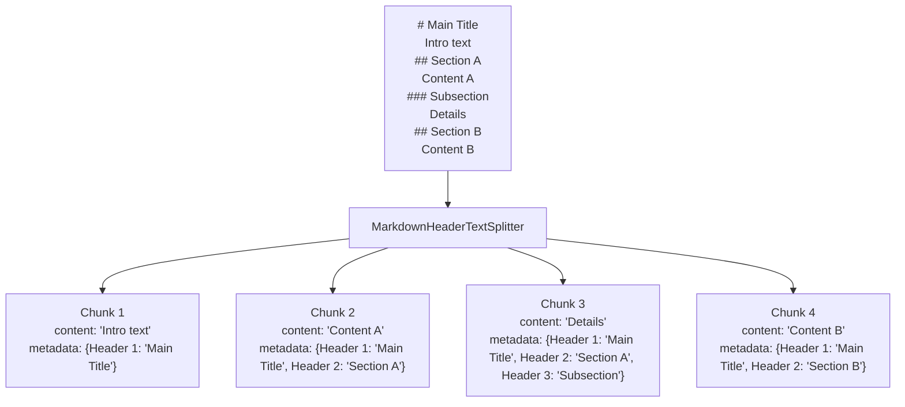
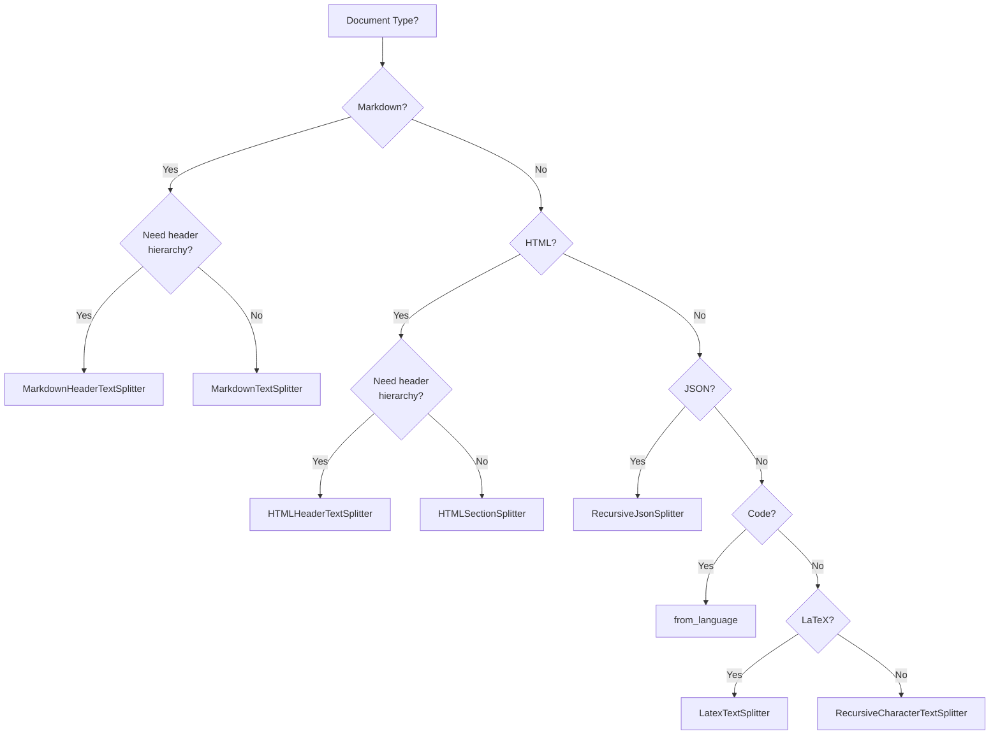

# Document-Type Splitters

## Introduction

Different document formats have inherent structure—Markdown uses headers, HTML uses tags, JSON uses nesting. Document-type splitters understand these structures and split content intelligently, preserving semantic meaning and document hierarchy. This lesson covers specialized splitters for Markdown, HTML, JSON, and code files.

### What We'll Cover

- MarkdownHeaderTextSplitter for header-based document structure
- MarkdownTextSplitter for general Markdown content
- HTMLHeaderTextSplitter and HTMLSectionSplitter
- RecursiveJsonSplitter for nested JSON data
- Code-aware splitting beyond from_language()

### Prerequisites

- Completion of [Character Splitters](./02-character-splitters.md)
- Basic familiarity with Markdown, HTML, and JSON formats

---

## MarkdownHeaderTextSplitter

The `MarkdownHeaderTextSplitter` splits Markdown documents based on header hierarchy, preserving document structure in chunk metadata.

### How It Works



### Basic Usage

```python
from langchain_text_splitters import MarkdownHeaderTextSplitter

# Define headers to split on (header pattern, metadata key)
headers_to_split_on = [
    ("#", "Header 1"),
    ("##", "Header 2"),
    ("###", "Header 3"),
]

splitter = MarkdownHeaderTextSplitter(
    headers_to_split_on=headers_to_split_on
)

markdown_document = """
# Introduction to Python

Python is a versatile programming language.

## Getting Started

First, install Python from python.org.

### Installation Steps

1. Download the installer
2. Run the installer
3. Verify installation

## Basic Syntax

Python uses indentation for code blocks.

### Variables

Variables don't need type declarations.

### Functions

Functions are defined with the `def` keyword.
"""

chunks = splitter.split_text(markdown_document)

for chunk in chunks:
    print(f"Content: {chunk.page_content[:50]}...")
    print(f"Metadata: {chunk.metadata}")
    print()
```

**Output:**
```
Content: Python is a versatile programming language....
Metadata: {'Header 1': 'Introduction to Python'}

Content: First, install Python from python.org....
Metadata: {'Header 1': 'Introduction to Python', 'Header 2': 'Getting Started'}

Content: 1. Download the installer
2. Run the installer
3. Verify installation...
Metadata: {'Header 1': 'Introduction to Python', 'Header 2': 'Getting Started', 'Header 3': 'Installation Steps'}

Content: Python uses indentation for code blocks....
Metadata: {'Header 1': 'Introduction to Python', 'Header 2': 'Basic Syntax'}

Content: Variables don't need type declarations....
Metadata: {'Header 1': 'Introduction to Python', 'Header 2': 'Basic Syntax', 'Header 3': 'Variables'}

Content: Functions are defined with the `def` keyword....
Metadata: {'Header 1': 'Introduction to Python', 'Header 2': 'Basic Syntax', 'Header 3': 'Functions'}
```

### Parameters

| Parameter | Type | Default | Description |
|-----------|------|---------|-------------|
| `headers_to_split_on` | list[tuple] | Required | Header patterns and metadata keys |
| `return_each_line` | bool | `False` | Return each line as separate chunk |
| `strip_headers` | bool | `True` | Remove headers from content |

### Preserving Headers in Content

```python
from langchain_text_splitters import MarkdownHeaderTextSplitter

# Keep headers in the chunk content
splitter = MarkdownHeaderTextSplitter(
    headers_to_split_on=[
        ("#", "Header 1"),
        ("##", "Header 2"),
    ],
    strip_headers=False  # Headers remain in content
)

markdown = """
# Main Title

Introduction text here.

## First Section

Content of first section.
"""

chunks = splitter.split_text(markdown)
print(chunks[1].page_content)
```

**Output:**
```
## First Section

Content of first section.
```

### Combining with RecursiveCharacterTextSplitter

For large sections that need further splitting:

```python
from langchain_text_splitters import (
    MarkdownHeaderTextSplitter,
    RecursiveCharacterTextSplitter
)

# First: split by headers
markdown_splitter = MarkdownHeaderTextSplitter(
    headers_to_split_on=[
        ("#", "Header 1"),
        ("##", "Header 2"),
    ]
)

# Second: split large chunks by size
text_splitter = RecursiveCharacterTextSplitter(
    chunk_size=500,
    chunk_overlap=50
)

# Long markdown document
markdown_doc = """
# Documentation

## Overview

This is a very long overview section that goes into extensive detail 
about the system architecture, design decisions, and implementation 
strategies. It covers multiple topics including...
""" + "Additional detailed content. " * 100 + """

## Installation

Installation instructions here...

## Usage

Usage examples here...
"""

# Step 1: Split by headers
header_chunks = markdown_splitter.split_text(markdown_doc)
print(f"After header split: {len(header_chunks)} chunks")

# Step 2: Further split large chunks
final_chunks = text_splitter.split_documents(header_chunks)
print(f"After size split: {len(final_chunks)} chunks")

# Metadata is preserved
for chunk in final_chunks[:3]:
    print(f"Metadata: {chunk.metadata}")
    print(f"Content length: {len(chunk.page_content)}")
    print()
```

---

## MarkdownTextSplitter

The `MarkdownTextSplitter` extends `RecursiveCharacterTextSplitter` with Markdown-aware separators. Unlike `MarkdownHeaderTextSplitter`, it doesn't track header hierarchy in metadata.

```python
from langchain_text_splitters import MarkdownTextSplitter

splitter = MarkdownTextSplitter(
    chunk_size=500,
    chunk_overlap=50
)

# View the separators it uses
print("Separators used:")
for sep in splitter._separators[:10]:
    print(f"  {repr(sep)}")
```

**Output:**
```
Separators used:
  '\n#{1,6} '
  '```\n'
  '\n\\*\\*\\*+\n'
  '\n---+\n'
  '\n___+\n'
  '\n\n'
  '\n'
  ' '
  ''
```

### When to Use Which

| Splitter | Use When |
|----------|----------|
| `MarkdownHeaderTextSplitter` | You need header hierarchy in metadata for retrieval |
| `MarkdownTextSplitter` | You just want smart splitting at Markdown boundaries |

---

## HTMLHeaderTextSplitter

Similar to Markdown, HTML documents can be split based on header tags:

```python
from langchain_text_splitters import HTMLHeaderTextSplitter

# Define HTML headers to split on
headers_to_split_on = [
    ("h1", "Header 1"),
    ("h2", "Header 2"),
    ("h3", "Header 3"),
]

splitter = HTMLHeaderTextSplitter(headers_to_split_on=headers_to_split_on)

html_document = """
<!DOCTYPE html>
<html>
<body>
    <h1>Main Documentation</h1>
    <p>Welcome to our documentation.</p>
    
    <h2>Installation</h2>
    <p>Follow these steps to install:</p>
    <ul>
        <li>Step 1: Download</li>
        <li>Step 2: Install</li>
    </ul>
    
    <h2>Configuration</h2>
    <p>Configure your settings in config.yaml</p>
    
    <h3>Database Settings</h3>
    <p>Set your database connection string.</p>
    
    <h3>API Settings</h3>
    <p>Configure API keys and endpoints.</p>
</body>
</html>
"""

chunks = splitter.split_text(html_document)

for chunk in chunks:
    print(f"Content: {chunk.page_content[:60]}...")
    print(f"Metadata: {chunk.metadata}")
    print()
```

**Output:**
```
Content: Welcome to our documentation....
Metadata: {'Header 1': 'Main Documentation'}

Content: Follow these steps to install:
Step 1: Download
Step 2: Install...
Metadata: {'Header 1': 'Main Documentation', 'Header 2': 'Installation'}

Content: Configure your settings in config.yaml...
Metadata: {'Header 1': 'Main Documentation', 'Header 2': 'Configuration'}

Content: Set your database connection string....
Metadata: {'Header 1': 'Main Documentation', 'Header 2': 'Configuration', 'Header 3': 'Database Settings'}

Content: Configure API keys and endpoints....
Metadata: {'Header 1': 'Main Documentation', 'Header 2': 'Configuration', 'Header 3': 'API Settings'}
```

### Fetching HTML from URLs

```python
from langchain_text_splitters import HTMLHeaderTextSplitter

splitter = HTMLHeaderTextSplitter(
    headers_to_split_on=[
        ("h1", "Header 1"),
        ("h2", "Header 2"),
    ]
)

# Split directly from URL
url = "https://example.com/documentation"
chunks = splitter.split_text_from_url(url)
```

### HTMLSectionSplitter

For more fine-grained control over HTML sections:

```python
from langchain_text_splitters import HTMLSectionSplitter

splitter = HTMLSectionSplitter(
    headers_to_split_on=[
        ("h1", "Header 1"),
        ("h2", "Header 2"),
    ]
)

# Works similarly but handles section elements differently
```

---

## RecursiveJsonSplitter

JSON documents have hierarchical structure. The `RecursiveJsonSplitter` splits JSON while preserving nesting:

```python
from langchain_text_splitters import RecursiveJsonSplitter
import json

splitter = RecursiveJsonSplitter(
    max_chunk_size=300,
    min_chunk_size=50
)

json_data = {
    "company": "TechCorp",
    "departments": [
        {
            "name": "Engineering",
            "teams": [
                {"name": "Frontend", "members": 12, "projects": ["Website", "Mobile App"]},
                {"name": "Backend", "members": 15, "projects": ["API", "Database"]},
                {"name": "DevOps", "members": 5, "projects": ["CI/CD", "Infrastructure"]}
            ]
        },
        {
            "name": "Product",
            "teams": [
                {"name": "Design", "members": 8, "projects": ["UX Research", "UI Design"]},
                {"name": "Management", "members": 4, "projects": ["Roadmap", "Analytics"]}
            ]
        }
    ],
    "locations": ["New York", "San Francisco", "London", "Tokyo"]
}

# Split into chunks
chunks = splitter.split_json(json_data)

for i, chunk in enumerate(chunks):
    print(f"--- Chunk {i+1} ---")
    print(json.dumps(chunk, indent=2)[:200])
    print()
```

### Creating Documents from JSON

```python
from langchain_text_splitters import RecursiveJsonSplitter

splitter = RecursiveJsonSplitter(max_chunk_size=200)

json_data = {
    "users": [
        {"id": 1, "name": "Alice", "email": "alice@example.com"},
        {"id": 2, "name": "Bob", "email": "bob@example.com"},
        {"id": 3, "name": "Charlie", "email": "charlie@example.com"}
    ],
    "settings": {
        "theme": "dark",
        "notifications": True
    }
}

# Create Document objects
docs = splitter.create_documents(
    texts=[json_data],  # Can pass multiple JSON objects
    metadatas=[{"source": "config.json"}]
)

for doc in docs:
    print(f"Content: {doc.page_content[:100]}...")
    print(f"Metadata: {doc.metadata}")
    print()
```

### Parameters

| Parameter | Type | Default | Description |
|-----------|------|---------|-------------|
| `max_chunk_size` | int | `2000` | Maximum chunk size in characters |
| `min_chunk_size` | int | `None` | Minimum chunk size (optional) |

---

## Code Splitters

Beyond `from_language()`, LangChain provides specialized code splitters:

### PythonCodeTextSplitter

```python
from langchain_text_splitters import PythonCodeTextSplitter

splitter = PythonCodeTextSplitter(
    chunk_size=500,
    chunk_overlap=50
)

python_code = '''
import os
from typing import List

class DataProcessor:
    """Process data from various sources."""
    
    def __init__(self, config: dict):
        self.config = config
    
    def process(self, items: List[str]) -> List[str]:
        """Process a list of items."""
        return [self._transform(item) for item in items]
    
    def _transform(self, item: str) -> str:
        return item.upper()

def main():
    processor = DataProcessor({})
    result = processor.process(["hello", "world"])
    print(result)

if __name__ == "__main__":
    main()
'''

chunks = splitter.split_text(python_code)
for i, chunk in enumerate(chunks):
    print(f"--- Chunk {i+1} ---")
    print(chunk.strip())
    print()
```

### LatexTextSplitter

For LaTeX documents:

```python
from langchain_text_splitters import LatexTextSplitter

splitter = LatexTextSplitter(
    chunk_size=500,
    chunk_overlap=50
)

latex_doc = r'''
\documentclass{article}
\begin{document}

\section{Introduction}
This paper presents our findings on machine learning.

\subsection{Background}
Machine learning has evolved significantly over the past decade.

\section{Methods}
We employed several techniques in our research.

\subsection{Data Collection}
Data was collected from multiple sources.

\subsection{Analysis}
Statistical analysis was performed using Python.

\section{Results}
Our results show significant improvements.

\end{document}
'''

chunks = splitter.split_text(latex_doc)
for chunk in chunks:
    print(f"Chunk: {chunk[:80]}...")
```

---

## Choosing the Right Document Splitter



### Decision Matrix

| Document Type | Splitter | When to Use |
|--------------|----------|-------------|
| Markdown | `MarkdownHeaderTextSplitter` | Need hierarchy for RAG retrieval |
| Markdown | `MarkdownTextSplitter` | Just need smart boundary splitting |
| HTML | `HTMLHeaderTextSplitter` | Need hierarchy from web pages |
| JSON | `RecursiveJsonSplitter` | API responses, config files |
| Code | `from_language()` | Any supported programming language |
| LaTeX | `LatexTextSplitter` | Academic papers, documentation |
| Mixed | Chain splitters | Complex documents with multiple formats |

---

## Practical Example: Documentation Processing Pipeline

```python
from langchain_text_splitters import (
    MarkdownHeaderTextSplitter,
    RecursiveCharacterTextSplitter
)
from langchain_core.documents import Document
from pathlib import Path

def process_markdown_docs(directory: str) -> list[Document]:
    """Process all Markdown files in a directory."""
    
    # Header splitter for structure
    header_splitter = MarkdownHeaderTextSplitter(
        headers_to_split_on=[
            ("#", "title"),
            ("##", "section"),
            ("###", "subsection"),
        ]
    )
    
    # Size splitter for large sections
    size_splitter = RecursiveCharacterTextSplitter(
        chunk_size=1000,
        chunk_overlap=100
    )
    
    all_chunks = []
    
    for md_file in Path(directory).glob("**/*.md"):
        content = md_file.read_text(encoding="utf-8")
        
        # Step 1: Split by headers
        header_chunks = header_splitter.split_text(content)
        
        # Add file metadata
        for chunk in header_chunks:
            chunk.metadata["source"] = str(md_file)
            chunk.metadata["file_name"] = md_file.name
        
        # Step 2: Split oversized chunks
        final_chunks = size_splitter.split_documents(header_chunks)
        all_chunks.extend(final_chunks)
    
    print(f"Processed {len(all_chunks)} chunks from {directory}")
    return all_chunks


def process_api_response(json_data: dict, source: str) -> list[Document]:
    """Process JSON API responses."""
    from langchain_text_splitters import RecursiveJsonSplitter
    
    splitter = RecursiveJsonSplitter(max_chunk_size=500)
    
    docs = splitter.create_documents(
        texts=[json_data],
        metadatas=[{"source": source, "type": "api_response"}]
    )
    
    return docs


# Usage example
if __name__ == "__main__":
    # Process documentation
    # docs = process_markdown_docs("./docs")
    
    # Process API response
    api_data = {
        "status": "success",
        "data": {
            "users": [
                {"id": 1, "name": "Alice"},
                {"id": 2, "name": "Bob"}
            ]
        }
    }
    api_docs = process_api_response(api_data, "users_api")
    print(f"API chunks: {len(api_docs)}")
```

---

## Hands-on Exercise

### Your Task

Build a multi-format document processor that:
1. Detects document type from file extension
2. Uses the appropriate document-type splitter
3. Combines with size-based splitting for large chunks
4. Tracks document structure in metadata

### Requirements

1. Support `.md`, `.html`, and `.json` files
2. For Markdown/HTML: preserve header hierarchy
3. For JSON: handle nested structures
4. Ensure all chunks are under 500 characters

### Expected Result

```
Processing documents...

Markdown: docs/readme.md
  - 4 chunks with header hierarchy

HTML: docs/guide.html
  - 6 chunks with section hierarchy

JSON: data/config.json
  - 3 chunks from nested structure

Total: 13 chunks processed
```

<details>
<summary>💡 Hints (click to expand)</summary>

- Create a dict mapping extensions to splitter types
- For Markdown/HTML, chain with RecursiveCharacterTextSplitter
- For JSON, use RecursiveJsonSplitter directly
- Track statistics in a results dict

</details>

<details>
<summary>✅ Solution (click to expand)</summary>

```python
from langchain_text_splitters import (
    MarkdownHeaderTextSplitter,
    HTMLHeaderTextSplitter,
    RecursiveJsonSplitter,
    RecursiveCharacterTextSplitter
)
from langchain_core.documents import Document
from pathlib import Path
import json

def get_splitter_config(extension: str):
    """Get splitter configuration based on file extension."""
    
    configs = {
        ".md": {
            "type": "markdown",
            "splitter": MarkdownHeaderTextSplitter(
                headers_to_split_on=[
                    ("#", "title"),
                    ("##", "section"),
                    ("###", "subsection"),
                ]
            ),
            "needs_size_split": True
        },
        ".html": {
            "type": "html",
            "splitter": HTMLHeaderTextSplitter(
                headers_to_split_on=[
                    ("h1", "title"),
                    ("h2", "section"),
                    ("h3", "subsection"),
                ]
            ),
            "needs_size_split": True
        },
        ".json": {
            "type": "json",
            "splitter": RecursiveJsonSplitter(max_chunk_size=500),
            "needs_size_split": False
        }
    }
    
    return configs.get(extension.lower())


def process_documents(files: dict[str, str]) -> list[Document]:
    """Process multiple document files."""
    
    size_splitter = RecursiveCharacterTextSplitter(
        chunk_size=500,
        chunk_overlap=50
    )
    
    all_chunks = []
    stats = {}
    
    print("Processing documents...\n")
    
    for filepath, content in files.items():
        ext = Path(filepath).suffix
        config = get_splitter_config(ext)
        
        if not config:
            print(f"Unsupported format: {filepath}")
            continue
        
        file_type = config["type"]
        splitter = config["splitter"]
        
        # Process based on type
        if file_type == "json":
            json_data = json.loads(content)
            chunks = splitter.create_documents(
                texts=[json_data],
                metadatas=[{"source": filepath, "type": "json"}]
            )
        else:
            # Markdown or HTML
            chunks = splitter.split_text(content)
            
            # Add source metadata
            for chunk in chunks:
                chunk.metadata["source"] = filepath
            
            # Size splitting if needed
            if config["needs_size_split"]:
                chunks = size_splitter.split_documents(chunks)
        
        # Track stats
        if file_type not in stats:
            stats[file_type] = []
        
        stats[file_type].append({
            "file": filepath,
            "chunks": len(chunks),
            "has_hierarchy": file_type in ["markdown", "html"]
        })
        
        all_chunks.extend(chunks)
    
    # Print results
    for doc_type, files_info in stats.items():
        print(f"{doc_type.title()}:")
        for info in files_info:
            hierarchy_note = " with header hierarchy" if info["has_hierarchy"] else ""
            print(f"  - {info['file']}: {info['chunks']} chunks{hierarchy_note}")
        print()
    
    print(f"Total: {len(all_chunks)} chunks processed")
    
    return all_chunks


# Test with sample data
sample_files = {
    "docs/readme.md": """
# Project Documentation

Welcome to our project.

## Installation

Install using pip:

```bash
pip install our-package
```

## Usage

Import and use:

```python
from our_package import main
main()
```

### Advanced Usage

For advanced features, see the configuration section.
""",
    
    "docs/guide.html": """
<html>
<body>
<h1>User Guide</h1>
<p>Welcome to the user guide.</p>

<h2>Getting Started</h2>
<p>Follow these steps to begin.</p>

<h3>Prerequisites</h3>
<p>You'll need Python 3.8+</p>

<h2>Features</h2>
<p>Our product includes many features.</p>
</body>
</html>
""",
    
    "data/config.json": json.dumps({
        "app": {
            "name": "MyApp",
            "version": "1.0.0",
            "settings": {
                "debug": True,
                "log_level": "INFO"
            }
        },
        "database": {
            "host": "localhost",
            "port": 5432
        }
    })
}

# Run the processor
chunks = process_documents(sample_files)

# Show sample chunk
if chunks:
    print("\nSample chunk:")
    print(f"Content: {chunks[0].page_content[:100]}...")
    print(f"Metadata: {chunks[0].metadata}")
```

</details>

### Bonus Challenges

- [ ] Add support for LaTeX files
- [ ] Implement a URL fetcher for HTML documents
- [ ] Add chunk deduplication for overlapping content

---

## Summary

✅ **MarkdownHeaderTextSplitter** — Preserves document hierarchy in metadata for RAG

✅ **MarkdownTextSplitter** — Smart Markdown boundary splitting without hierarchy tracking

✅ **HTMLHeaderTextSplitter** — Same concept for HTML documents with h1/h2/h3 tags

✅ **RecursiveJsonSplitter** — Handles nested JSON structures intelligently

✅ **Code splitters** — Language-specific splitting via `from_language()` or dedicated splitters

✅ **Chaining splitters** — Combine header splitters with size splitters for best results

---

**Next:** [Token-Based Splitters](./04-token-based-splitters.md) — Splitting by token count for LLM context windows

---

## Further Reading

- [MarkdownHeaderTextSplitter API Reference](https://api.python.langchain.com/en/latest/text_splitters/langchain_text_splitters.markdown.MarkdownHeaderTextSplitter.html)
- [HTMLHeaderTextSplitter API Reference](https://api.python.langchain.com/en/latest/text_splitters/langchain_text_splitters.html.HTMLHeaderTextSplitter.html)
- [RecursiveJsonSplitter API Reference](https://api.python.langchain.com/en/latest/text_splitters/langchain_text_splitters.json.RecursiveJsonSplitter.html)

---

**Previous:** [Character Splitters](./02-character-splitters.md) | **Next:** [Token-Based Splitters](./04-token-based-splitters.md)

<!-- 
Sources Consulted:
- langchain_text_splitters/markdown.py for MarkdownHeaderTextSplitter
- langchain_text_splitters/html.py for HTMLHeaderTextSplitter
- langchain_text_splitters/json.py for RecursiveJsonSplitter
- GitHub test files for usage patterns
-->
