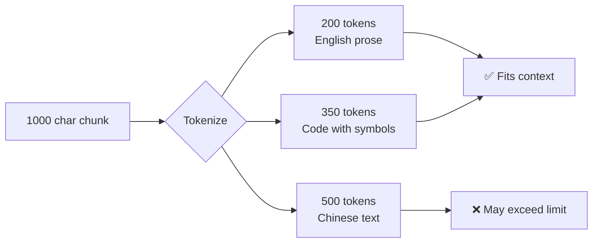
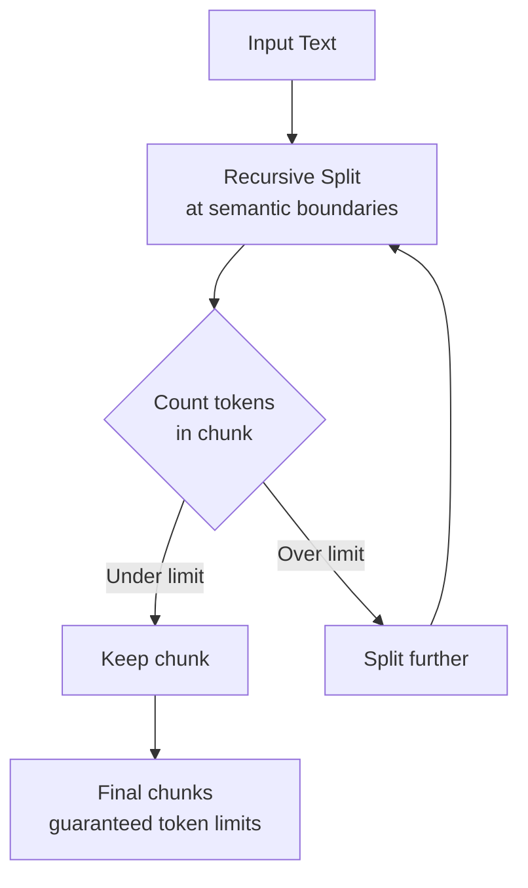

# Token-Based Splitters

## Introduction

Character-based chunking has a fundamental problem: LLMs don't see characters—they see tokens. A 1000-character chunk might be 200 tokens or 400 tokens depending on the content. Token-based splitters solve this by counting tokens directly, ensuring your chunks precisely fit model context windows.

### What We'll Cover

- Understanding tokens vs characters
- TokenTextSplitter for basic token counting
- Using `from_tiktoken_encoder()` for model-specific tokenization
- SentenceTransformersTokenTextSplitter for embedding models
- Handling different tokenizers across models

### Prerequisites

- Completion of [Character Splitters](./02-character-splitters.md)
- Basic understanding of LLM tokenization

---

## Why Token-Based Splitting Matters

### The Token-Character Mismatch

```python
import tiktoken

# Different texts, same character count
texts = [
    "Hello world hello world" * 10,  # Simple words
    "Künstliche Intelligenz" * 4,    # German (complex)
    "αβγδεζηθικλμνξοπρστυφχψω",       # Greek alphabet
    "{'key': 'value', 'n': 42}",      # JSON/code
]

encoder = tiktoken.get_encoding("cl100k_base")

print("Text                          | Chars | Tokens | Ratio")
print("-" * 60)
for text in texts:
    tokens = len(encoder.encode(text))
    ratio = len(text) / tokens
    print(f"{text[:30]:30} | {len(text):5} | {tokens:6} | {ratio:.2f}")
```

**Output:**
```
Text                          | Chars | Tokens | Ratio
------------------------------------------------------------
Hello world hello world He... |   240 |     60 | 4.00
Künstliche IntelligenzKünst.. |    88 |     36 | 2.44
αβγδεζηθικλμνξοπρστυφχψω      |    24 |     24 | 1.00
{'key': 'value', 'n': 42}     |    25 |     14 | 1.79
```

> **🔑 Key Insight:** The same character count can produce vastly different token counts. Non-English text, code, and special characters often use more tokens per character.

### Why This Matters for RAG



---

## TokenTextSplitter

The `TokenTextSplitter` uses tiktoken to count and split by tokens:

### Basic Usage

```python
from langchain_text_splitters import TokenTextSplitter

splitter = TokenTextSplitter(
    chunk_size=100,      # Tokens, not characters
    chunk_overlap=20,    # Token overlap
    encoding_name="cl100k_base"  # GPT-4 encoding
)

text = """
Machine learning is a subset of artificial intelligence that enables 
systems to learn and improve from experience without being explicitly 
programmed. Deep learning is a further subset of machine learning 
that uses neural networks with multiple layers to analyze various 
factors of data. Natural language processing allows computers to 
understand, interpret, and generate human language in a valuable way.
"""

chunks = splitter.split_text(text)

print(f"Split into {len(chunks)} chunks")
for i, chunk in enumerate(chunks):
    # Count actual tokens
    import tiktoken
    enc = tiktoken.get_encoding("cl100k_base")
    token_count = len(enc.encode(chunk))
    print(f"\nChunk {i+1}: {token_count} tokens")
    print(chunk.strip()[:100] + "...")
```

### Parameters

| Parameter | Type | Default | Description |
|-----------|------|---------|-------------|
| `chunk_size` | int | `4000` | Maximum tokens per chunk |
| `chunk_overlap` | int | `200` | Overlap tokens between chunks |
| `encoding_name` | str | `"gpt2"` | Tiktoken encoding name |
| `model_name` | str | `None` | Model name (sets encoding automatically) |
| `allowed_special` | set | `set()` | Special tokens to allow |
| `disallowed_special` | str | `"all"` | Special tokens to disallow |

### Available Encodings

| Encoding | Models | Use Case |
|----------|--------|----------|
| `cl100k_base` | GPT-4, GPT-3.5-turbo | Most OpenAI models |
| `p50k_base` | Codex, text-davinci-003 | Older OpenAI models |
| `p50k_edit` | Edit models | Text editing models |
| `r50k_base` | GPT-3 davinci | Legacy models |
| `gpt2` | GPT-2 | Open-source models |

```python
from langchain_text_splitters import TokenTextSplitter

# For GPT-4 / GPT-3.5
gpt4_splitter = TokenTextSplitter(
    encoding_name="cl100k_base",
    chunk_size=1000,
    chunk_overlap=100
)

# Or specify model directly
splitter = TokenTextSplitter(
    model_name="gpt-4",  # Automatically selects cl100k_base
    chunk_size=1000,
    chunk_overlap=100
)
```

---

## Using from_tiktoken_encoder()

The `RecursiveCharacterTextSplitter.from_tiktoken_encoder()` combines the best of both worlds: smart recursive splitting with token-based size limits.

### How It Works



### Basic Usage

```python
from langchain_text_splitters import RecursiveCharacterTextSplitter

# Create splitter with token-based sizing
splitter = RecursiveCharacterTextSplitter.from_tiktoken_encoder(
    model_name="gpt-4",
    chunk_size=500,        # 500 tokens max
    chunk_overlap=50       # 50 token overlap
)

text = """
# Introduction to Neural Networks

Neural networks are computing systems inspired by biological neural 
networks. They consist of interconnected nodes (neurons) that process 
information using connectionist approaches.

## Types of Neural Networks

### Feedforward Networks
Information flows in one direction from input to output.

### Recurrent Networks
Contains cycles, allowing information to persist.

### Convolutional Networks
Specialized for processing grid-like data such as images.
"""

chunks = splitter.split_text(text)

import tiktoken
enc = tiktoken.encoding_for_model("gpt-4")

for i, chunk in enumerate(chunks):
    token_count = len(enc.encode(chunk))
    print(f"Chunk {i+1}: {token_count} tokens")
    print(chunk.strip()[:80] + "...\n")
```

### Why Use from_tiktoken_encoder()?

| Approach | Splits At | Counts By | Best For |
|----------|-----------|-----------|----------|
| `RecursiveCharacterTextSplitter` | Semantic boundaries | Characters | General use |
| `TokenTextSplitter` | Token boundaries | Tokens | Precise token limits |
| `from_tiktoken_encoder()` | Semantic boundaries | Tokens | **Best of both** |

```python
from langchain_text_splitters import RecursiveCharacterTextSplitter

# This is the RECOMMENDED approach for most RAG applications
splitter = RecursiveCharacterTextSplitter.from_tiktoken_encoder(
    model_name="gpt-4",
    chunk_size=800,       # Token limit
    chunk_overlap=100,    # Token overlap
    separators=[          # Still uses semantic boundaries
        "\n\n",
        "\n",
        " ",
        ""
    ]
)
```

---

## SentenceTransformersTokenTextSplitter

For embedding models like Sentence Transformers, use their native tokenizer:

### Why a Separate Splitter?

Embedding models have their own tokenizers that differ from OpenAI's tiktoken:

| Model Type | Tokenizer | Typical Limit |
|------------|-----------|---------------|
| OpenAI GPT-4 | tiktoken cl100k | 128K context |
| Sentence Transformers | HuggingFace tokenizers | 256-512 tokens |
| OpenAI Embeddings | tiktoken cl100k | 8191 tokens |

### Basic Usage

```python
from langchain_text_splitters import SentenceTransformersTokenTextSplitter

# Default: all-mpnet-base-v2 (256 token limit)
splitter = SentenceTransformersTokenTextSplitter(
    chunk_overlap=50,
    tokens_per_chunk=256,  # Match model's limit
)

text = """
Retrieval-Augmented Generation (RAG) combines the power of large 
language models with external knowledge retrieval. This approach 
addresses the knowledge cutoff problem and reduces hallucinations 
by grounding responses in retrieved documents.
""" * 5

chunks = splitter.split_text(text)
print(f"Split into {len(chunks)} chunks")
```

### Specifying a Model

```python
from langchain_text_splitters import SentenceTransformersTokenTextSplitter

# For a specific embedding model
splitter = SentenceTransformersTokenTextSplitter(
    model_name="sentence-transformers/all-MiniLM-L6-v2",
    tokens_per_chunk=128,  # This model has 256 limit, use smaller
    chunk_overlap=20
)

# For OpenAI-compatible embedding models
splitter = SentenceTransformersTokenTextSplitter(
    model_name="sentence-transformers/all-mpnet-base-v2",
    tokens_per_chunk=384,  # Leave room for special tokens
    chunk_overlap=50
)
```

### Parameters

| Parameter | Type | Default | Description |
|-----------|------|---------|-------------|
| `model_name` | str | `"sentence-transformers/all-mpnet-base-v2"` | Model name |
| `tokens_per_chunk` | int | `None` | Max tokens (uses model default) |
| `chunk_overlap` | int | `50` | Overlap in tokens |

---

## Comparing Token Splitters

### Side-by-Side Comparison

```python
from langchain_text_splitters import (
    TokenTextSplitter,
    RecursiveCharacterTextSplitter,
    SentenceTransformersTokenTextSplitter
)
import tiktoken

text = """
Large language models represent a paradigm shift in artificial 
intelligence. These models, trained on vast amounts of text data, 
can generate human-like text, answer questions, and perform complex 
reasoning tasks. The transformer architecture, introduced in 2017, 
forms the backbone of these systems, enabling efficient parallel 
processing of sequential data.
""" * 3

# Token-based (raw token splitting)
token_splitter = TokenTextSplitter(
    encoding_name="cl100k_base",
    chunk_size=100,
    chunk_overlap=20
)

# Tiktoken encoder (semantic + token counting)
tiktoken_splitter = RecursiveCharacterTextSplitter.from_tiktoken_encoder(
    model_name="gpt-4",
    chunk_size=100,
    chunk_overlap=20
)

# Sentence Transformers (embedding model tokenizer)
st_splitter = SentenceTransformersTokenTextSplitter(
    tokens_per_chunk=100,
    chunk_overlap=20
)

print("Comparison of token splitters:")
print("-" * 50)

for name, splitter in [
    ("TokenTextSplitter", token_splitter),
    ("from_tiktoken_encoder", tiktoken_splitter),
    ("SentenceTransformers", st_splitter)
]:
    chunks = splitter.split_text(text)
    print(f"\n{name}:")
    print(f"  Chunks: {len(chunks)}")
    print(f"  First chunk preview: {chunks[0][:50]}...")
```

### When to Use Each

| Splitter | Use When |
|----------|----------|
| `TokenTextSplitter` | Need exact token boundaries (rare) |
| `from_tiktoken_encoder()` | **Most RAG applications** with OpenAI |
| `SentenceTransformersTokenTextSplitter` | Using open-source embedding models |

---

## Token Counting Utilities

### Direct Token Counting

```python
import tiktoken

def count_tokens(text: str, model: str = "gpt-4") -> int:
    """Count tokens for a specific model."""
    encoding = tiktoken.encoding_for_model(model)
    return len(encoding.encode(text))

def count_tokens_for_encoding(text: str, encoding_name: str = "cl100k_base") -> int:
    """Count tokens using a specific encoding."""
    encoding = tiktoken.get_encoding(encoding_name)
    return len(encoding.encode(text))

# Usage
text = "Hello, how are you doing today?"
print(f"GPT-4 tokens: {count_tokens(text, 'gpt-4')}")
print(f"GPT-3.5 tokens: {count_tokens(text, 'gpt-3.5-turbo')}")
```

### Batch Token Counting

```python
import tiktoken
from typing import List

def analyze_chunks(chunks: List[str], model: str = "gpt-4") -> dict:
    """Analyze token statistics for a list of chunks."""
    encoding = tiktoken.encoding_for_model(model)
    token_counts = [len(encoding.encode(chunk)) for chunk in chunks]
    
    return {
        "total_chunks": len(chunks),
        "total_tokens": sum(token_counts),
        "min_tokens": min(token_counts),
        "max_tokens": max(token_counts),
        "avg_tokens": sum(token_counts) / len(token_counts),
        "token_counts": token_counts
    }

# Example usage
from langchain_text_splitters import RecursiveCharacterTextSplitter

splitter = RecursiveCharacterTextSplitter.from_tiktoken_encoder(
    model_name="gpt-4",
    chunk_size=500,
    chunk_overlap=50
)

text = "Long document content here... " * 200
chunks = splitter.split_text(text)

stats = analyze_chunks(chunks)
print(f"Chunks: {stats['total_chunks']}")
print(f"Token range: {stats['min_tokens']} - {stats['max_tokens']}")
print(f"Average: {stats['avg_tokens']:.1f} tokens")
```

---

## Practical Example: Multi-Model Pipeline

```python
from langchain_text_splitters import RecursiveCharacterTextSplitter
from langchain_core.documents import Document
import tiktoken

class MultiModelSplitter:
    """Splitter that supports multiple model tokenizers."""
    
    EMBEDDING_LIMITS = {
        "text-embedding-3-small": 8191,
        "text-embedding-3-large": 8191,
        "text-embedding-ada-002": 8191,
        "all-mpnet-base-v2": 384,
        "all-MiniLM-L6-v2": 256,
    }
    
    def __init__(
        self,
        llm_model: str = "gpt-4",
        embedding_model: str = "text-embedding-3-small",
        llm_chunk_size: int = 1000,
        embedding_chunk_size: int = None
    ):
        self.llm_model = llm_model
        self.embedding_model = embedding_model
        
        # Use embedding model's limit if not specified
        if embedding_chunk_size is None:
            embedding_chunk_size = min(
                llm_chunk_size,
                self.EMBEDDING_LIMITS.get(embedding_model, 512)
            )
        
        # Use the smaller of the two limits
        chunk_size = min(llm_chunk_size, embedding_chunk_size)
        
        self.splitter = RecursiveCharacterTextSplitter.from_tiktoken_encoder(
            model_name=llm_model,
            chunk_size=chunk_size,
            chunk_overlap=int(chunk_size * 0.1)  # 10% overlap
        )
        
        print(f"Configured for:")
        print(f"  LLM: {llm_model}")
        print(f"  Embedding: {embedding_model}")
        print(f"  Chunk size: {chunk_size} tokens")
    
    def split(self, text: str) -> list[str]:
        return self.splitter.split_text(text)
    
    def split_documents(self, docs: list[Document]) -> list[Document]:
        return self.splitter.split_documents(docs)


# Usage
splitter = MultiModelSplitter(
    llm_model="gpt-4",
    embedding_model="all-mpnet-base-v2",  # 384 token limit
    llm_chunk_size=1000
)

text = "Your document content here..." * 100
chunks = splitter.split(text)
print(f"\nCreated {len(chunks)} chunks")
```

---

## Handling Special Tokens

Some content contains special tokens that tokenizers treat differently:

```python
from langchain_text_splitters import TokenTextSplitter

# Allow special tokens (e.g., for chat markup)
splitter = TokenTextSplitter(
    encoding_name="cl100k_base",
    chunk_size=500,
    chunk_overlap=50,
    allowed_special={"<|endoftext|>", "<|im_start|>", "<|im_end|>"}
)

# Or disallow none (allow all)
splitter = TokenTextSplitter(
    encoding_name="cl100k_base",
    chunk_size=500,
    disallowed_special=()  # Empty tuple = allow all
)
```

---

## Hands-on Exercise

### Your Task

Build a token-aware document processor that:
1. Splits documents using token-based limits
2. Validates chunks fit within model limits
3. Reports token statistics

### Requirements

1. Use `from_tiktoken_encoder()` with GPT-4
2. Ensure no chunk exceeds 500 tokens
3. Calculate and display token statistics
4. Handle documents of varying complexity

### Expected Result

```
Processing 3 documents...

Document 1 (english.txt):
  Original: 2,450 tokens
  Chunks: 6
  Max chunk: 495 tokens ✓

Document 2 (code.py):
  Original: 890 tokens
  Chunks: 3
  Max chunk: 488 tokens ✓

Document 3 (mixed.md):
  Original: 1,200 tokens
  Chunks: 4
  Max chunk: 498 tokens ✓

All chunks within 500 token limit!
```

<details>
<summary>💡 Hints (click to expand)</summary>

- Use `tiktoken.encoding_for_model()` for token counting
- Create a validation function that checks max tokens
- Track statistics per document in a dict
- Use emoji for pass/fail indicators

</details>

<details>
<summary>✅ Solution (click to expand)</summary>

```python
from langchain_text_splitters import RecursiveCharacterTextSplitter
import tiktoken

def create_token_splitter(
    model: str = "gpt-4",
    max_tokens: int = 500,
    overlap_tokens: int = 50
):
    """Create a token-aware splitter."""
    return RecursiveCharacterTextSplitter.from_tiktoken_encoder(
        model_name=model,
        chunk_size=max_tokens,
        chunk_overlap=overlap_tokens
    )


def count_tokens(text: str, model: str = "gpt-4") -> int:
    """Count tokens for a given model."""
    encoding = tiktoken.encoding_for_model(model)
    return len(encoding.encode(text))


def process_documents(
    documents: dict[str, str],
    max_tokens: int = 500,
    model: str = "gpt-4"
) -> dict:
    """Process documents with token-aware splitting."""
    
    splitter = create_token_splitter(model, max_tokens)
    encoding = tiktoken.encoding_for_model(model)
    
    results = {}
    all_valid = True
    
    print(f"Processing {len(documents)} documents...\n")
    
    for doc_name, content in documents.items():
        # Count original tokens
        original_tokens = count_tokens(content, model)
        
        # Split
        chunks = splitter.split_text(content)
        
        # Analyze chunks
        chunk_tokens = [len(encoding.encode(chunk)) for chunk in chunks]
        max_chunk_tokens = max(chunk_tokens)
        
        # Validate
        is_valid = max_chunk_tokens <= max_tokens
        if not is_valid:
            all_valid = False
        
        results[doc_name] = {
            "original_tokens": original_tokens,
            "chunks": len(chunks),
            "max_chunk_tokens": max_chunk_tokens,
            "valid": is_valid,
            "chunk_tokens": chunk_tokens
        }
        
        # Print results
        status = "✓" if is_valid else "✗"
        print(f"Document: {doc_name}")
        print(f"  Original: {original_tokens:,} tokens")
        print(f"  Chunks: {len(chunks)}")
        print(f"  Max chunk: {max_chunk_tokens} tokens {status}")
        print()
    
    if all_valid:
        print(f"All chunks within {max_tokens} token limit!")
    else:
        print(f"Warning: Some chunks exceed {max_tokens} token limit!")
    
    return results


# Test with sample documents
sample_documents = {
    "english.txt": """
    Machine learning is transforming industries across the globe. 
    From healthcare to finance, artificial intelligence systems are 
    making decisions that were once the exclusive domain of human experts.
    """ * 20,
    
    "code.py": '''
    def process_data(items: list[dict]) -> list[dict]:
        """Process a list of data items with validation."""
        results = []
        for item in items:
            if validate(item):
                transformed = transform(item)
                results.append(transformed)
        return results
    
    class DataProcessor:
        def __init__(self, config: dict):
            self.config = config
            self._cache = {}
    ''' * 5,
    
    "mixed.md": """
    # Technical Documentation
    
    This guide covers advanced topics in system design.
    
    ## Architecture
    
    The system uses a microservices architecture with the following components:
    
    ```python
    services = {
        "api": APIGateway(),
        "auth": AuthService(),
        "data": DataService()
    }
    ```
    
    ## Deployment
    
    Deploy using Kubernetes with proper resource limits.
    """ * 8
}

# Run the processor
results = process_documents(sample_documents, max_tokens=500)
```

</details>

### Bonus Challenges

- [ ] Add support for different embedding model tokenizers
- [ ] Implement a cost estimator based on token counts
- [ ] Create a visualization of token distribution across chunks

---

## Summary

✅ **Token counting matters** — Characters ≠ tokens, especially for non-English or code

✅ **TokenTextSplitter** — Splits directly on token boundaries using tiktoken

✅ **from_tiktoken_encoder()** — Best approach: semantic splitting + token counting

✅ **SentenceTransformersTokenTextSplitter** — Use for open-source embedding models

✅ **Model limits** — OpenAI embeddings: 8191, Sentence Transformers: 256-512

✅ **Validation** — Always verify chunks fit within model context windows

---

**Next:** [Semantic Splitters](./05-semantic-splitters.md) — Embedding-based semantic chunking

---

## Further Reading

- [tiktoken Documentation](https://github.com/openai/tiktoken)
- [OpenAI Token Counting Guide](https://platform.openai.com/docs/guides/embeddings/limitations-and-risks)
- [Sentence Transformers Models](https://www.sbert.net/docs/pretrained_models.html)

---

**Previous:** [Document-Type Splitters](./03-document-type-splitters.md) | **Next:** [Semantic Splitters](./05-semantic-splitters.md)

<!-- 
Sources Consulted:
- langchain_text_splitters/base.py for TokenTextSplitter
- tiktoken documentation for encoding details
- Sentence Transformers documentation for model limits
-->
