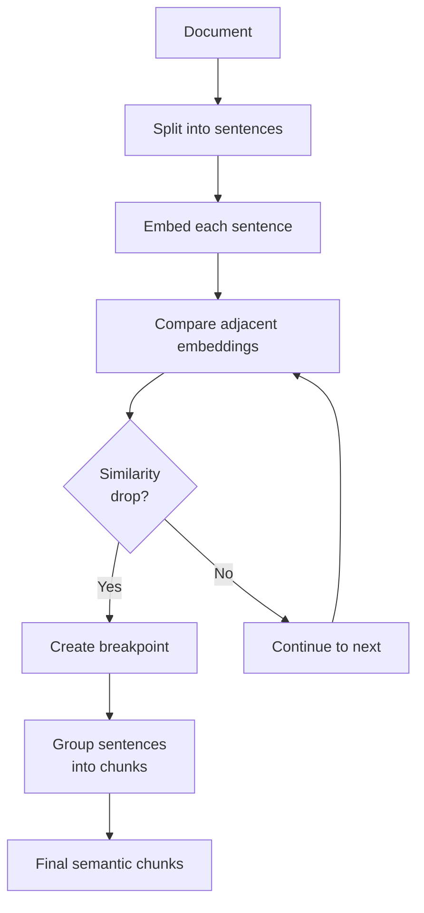

# Semantic Splitters

## Introduction

Traditional splitters use fixed rules—character counts, token limits, or document structure. Semantic splitters take a fundamentally different approach: they use embeddings to understand meaning and split where content naturally shifts topics. This produces more coherent chunks but at higher computational cost.

### What We'll Cover

- How semantic splitting works
- SemanticChunker from langchain-experimental
- Breakpoint detection strategies (percentile, standard deviation, interquartile, gradient)
- When to use semantic vs. rule-based splitting
- Performance and cost considerations

### Prerequisites

- Completion of [Token-Based Splitters](./04-token-based-splitters.md)
- Understanding of embeddings ([Unit 7](../../07-embeddings-vector-search/00-overview.md))

---

## How Semantic Splitting Works

Semantic splitting uses embeddings to detect natural topic boundaries:



### The Key Insight

```python
# Conceptual example of semantic similarity detection
sentences = [
    "Python is a programming language.",        # Topic: Python
    "It was created by Guido van Rossum.",     # Topic: Python
    "Python is popular for data science.",      # Topic: Python  
    "Machine learning uses neural networks.",   # Topic: ML (SHIFT!)
    "Deep learning is a subset of ML.",         # Topic: ML
]

# Embeddings show high similarity within topics
# and low similarity at topic boundaries
# [0.95, 0.92, 0.35, 0.91]  <- Drop at index 2 = breakpoint
```

---

## Installing SemanticChunker

The `SemanticChunker` is in the `langchain-experimental` package:

```bash
pip install langchain-experimental
```

> **⚠️ Important:** This is in the experimental package, meaning the API may change. Always pin your version in production.

---

## Basic Usage

```python
from langchain_experimental.text_splitter import SemanticChunker
from langchain_openai import OpenAIEmbeddings

# Initialize with an embedding model
embeddings = OpenAIEmbeddings(model="text-embedding-3-small")

chunker = SemanticChunker(
    embeddings=embeddings
)

text = """
Python is a versatile programming language created by Guido van Rossum. 
It emphasizes code readability and simplicity. Python supports multiple 
programming paradigms including procedural, object-oriented, and functional.

Machine learning is a branch of artificial intelligence. It enables systems 
to learn from data without being explicitly programmed. Common algorithms 
include decision trees, neural networks, and support vector machines.

Data visualization helps communicate insights from data. Libraries like 
Matplotlib and Seaborn create static visualizations. Plotly enables 
interactive charts and dashboards.
"""

chunks = chunker.split_text(text)

print(f"Split into {len(chunks)} semantic chunks:")
for i, chunk in enumerate(chunks):
    print(f"\n--- Chunk {i+1} ---")
    print(chunk.strip())
```

**Output:**
```
Split into 3 semantic chunks:

--- Chunk 1 ---
Python is a versatile programming language created by Guido van Rossum. 
It emphasizes code readability and simplicity. Python supports multiple 
programming paradigms including procedural, object-oriented, and functional.

--- Chunk 2 ---
Machine learning is a branch of artificial intelligence. It enables systems 
to learn from data without being explicitly programmed. Common algorithms 
include decision trees, neural networks, and support vector machines.

--- Chunk 3 ---
Data visualization helps communicate insights from data. Libraries like 
Matplotlib and Seaborn create static visualizations. Plotly enables 
interactive charts and dashboards.
```

---

## Breakpoint Detection Strategies

The `breakpoint_threshold_type` parameter controls how breakpoints are detected:

### Percentile (Default)

Breakpoints occur where similarity drops below a percentile threshold:

```python
from langchain_experimental.text_splitter import SemanticChunker
from langchain_openai import OpenAIEmbeddings

embeddings = OpenAIEmbeddings()

# Percentile-based detection
chunker = SemanticChunker(
    embeddings=embeddings,
    breakpoint_threshold_type="percentile",
    breakpoint_threshold_amount=95  # Top 5% of drops become breakpoints
)
```

| Threshold | Effect |
|-----------|--------|
| 90 | More breakpoints (more sensitive) |
| 95 | Default, balanced |
| 99 | Fewer breakpoints (only major shifts) |

### Standard Deviation

Breakpoints where similarity drops exceed a standard deviation threshold:

```python
chunker = SemanticChunker(
    embeddings=embeddings,
    breakpoint_threshold_type="standard_deviation",
    breakpoint_threshold_amount=1.5  # 1.5 std deviations from mean
)
```

| Threshold | Effect |
|-----------|--------|
| 1.0 | More breakpoints |
| 1.5 | Balanced |
| 2.0 | Only significant topic shifts |
| 3.0 | Very few breakpoints |

### Interquartile Range

Uses IQR to detect outlier similarity drops:

```python
chunker = SemanticChunker(
    embeddings=embeddings,
    breakpoint_threshold_type="interquartile",
    breakpoint_threshold_amount=1.5  # 1.5 * IQR above Q3
)
```

This method is more robust to outliers in similarity scores.

### Gradient

Detects where the rate of change in similarity is highest:

```python
chunker = SemanticChunker(
    embeddings=embeddings,
    breakpoint_threshold_type="gradient",
    breakpoint_threshold_amount=95  # Percentile of gradient values
)
```

Best for documents with gradual topic transitions.

---

## Comparing Strategies

```python
from langchain_experimental.text_splitter import SemanticChunker
from langchain_openai import OpenAIEmbeddings

embeddings = OpenAIEmbeddings(model="text-embedding-3-small")

text = """
Introduction to web development covers HTML, CSS, and JavaScript.
These are the foundational technologies for building websites.
HTML provides structure, CSS handles styling, and JavaScript adds interactivity.

Backend development involves server-side programming.
Languages like Python, Node.js, and Java are commonly used.
Databases store and manage application data.

DevOps practices bridge development and operations teams.
Continuous integration and deployment automate software delivery.
Container technologies like Docker simplify deployment.

Cloud computing provides scalable infrastructure.
AWS, Azure, and Google Cloud are major providers.
Serverless architectures reduce operational overhead.
"""

strategies = [
    ("percentile", 90),
    ("percentile", 95),
    ("standard_deviation", 1.0),
    ("standard_deviation", 2.0),
    ("interquartile", 1.5),
    ("gradient", 95),
]

print("Strategy Comparison:")
print("-" * 50)

for strategy, threshold in strategies:
    chunker = SemanticChunker(
        embeddings=embeddings,
        breakpoint_threshold_type=strategy,
        breakpoint_threshold_amount=threshold
    )
    chunks = chunker.split_text(text)
    print(f"{strategy} ({threshold}): {len(chunks)} chunks")
```

**Sample Output:**
```
Strategy Comparison:
--------------------------------------------------
percentile (90): 6 chunks
percentile (95): 4 chunks
standard_deviation (1.0): 5 chunks
standard_deviation (2.0): 3 chunks
interquartile (1.5): 4 chunks
gradient (95): 4 chunks
```

---

## Custom Sentence Splitting

By default, SemanticChunker splits on periods. Customize this:

```python
from langchain_experimental.text_splitter import SemanticChunker
from langchain_openai import OpenAIEmbeddings
import re

embeddings = OpenAIEmbeddings()

# Custom sentence splitter function
def split_on_newlines(text: str) -> list[str]:
    """Split text on newlines instead of periods."""
    return [s.strip() for s in text.split('\n') if s.strip()]

# Using regex for sentence detection
def regex_sentence_split(text: str) -> list[str]:
    """Split using regex for better sentence detection."""
    sentences = re.split(r'(?<=[.!?])\s+', text)
    return [s.strip() for s in sentences if s.strip()]
```

> **Note:** The current SemanticChunker uses a simple period-based split. For complex documents, consider pre-processing text or using NLTK/spaCy for sentence tokenization.

---

## Combining Semantic and Size Limits

Semantic chunks can be too large or too small. Combine with size limits:

```python
from langchain_experimental.text_splitter import SemanticChunker
from langchain_text_splitters import RecursiveCharacterTextSplitter
from langchain_openai import OpenAIEmbeddings

embeddings = OpenAIEmbeddings(model="text-embedding-3-small")

# Step 1: Semantic chunking
semantic_chunker = SemanticChunker(
    embeddings=embeddings,
    breakpoint_threshold_type="percentile",
    breakpoint_threshold_amount=95
)

# Step 2: Size limiting
size_splitter = RecursiveCharacterTextSplitter.from_tiktoken_encoder(
    model_name="gpt-4",
    chunk_size=500,    # Max tokens
    chunk_overlap=50
)

def semantic_split_with_limits(text: str) -> list[str]:
    """Semantic split with size limits."""
    # First: semantic split
    semantic_chunks = semantic_chunker.split_text(text)
    
    # Second: ensure size limits
    final_chunks = []
    for chunk in semantic_chunks:
        # If chunk is too large, split further
        if len(chunk) > 2000:  # Approximate character limit
            sub_chunks = size_splitter.split_text(chunk)
            final_chunks.extend(sub_chunks)
        else:
            final_chunks.append(chunk)
    
    return final_chunks


# Example usage
long_text = "Your long document here..." * 100
chunks = semantic_split_with_limits(long_text)
print(f"Created {len(chunks)} chunks")
```

---

## Performance Considerations

Semantic splitting requires embedding every sentence:

### Cost Analysis

```python
def estimate_semantic_splitting_cost(
    text: str,
    model: str = "text-embedding-3-small",
    price_per_1k_tokens: float = 0.00002
) -> dict:
    """Estimate the cost of semantic splitting."""
    import tiktoken
    
    # Approximate sentence count
    sentences = text.split('.')
    sentence_count = len([s for s in sentences if s.strip()])
    
    # Estimate tokens (each sentence embedded separately)
    encoding = tiktoken.get_encoding("cl100k_base")
    total_tokens = len(encoding.encode(text))
    
    # Cost calculation
    cost = (total_tokens / 1000) * price_per_1k_tokens
    
    return {
        "sentences": sentence_count,
        "total_tokens": total_tokens,
        "estimated_cost": cost,
        "api_calls": sentence_count  # One embedding per sentence
    }

# Example
text = "Long document content. " * 500
stats = estimate_semantic_splitting_cost(text)
print(f"Sentences to embed: {stats['sentences']}")
print(f"Total tokens: {stats['total_tokens']:,}")
print(f"Estimated cost: ${stats['estimated_cost']:.4f}")
print(f"API calls: {stats['api_calls']}")
```

### When Semantic Splitting Is Worth It

| Scenario | Recommendation |
|----------|----------------|
| RAG with diverse topics | ✅ Use semantic splitting |
| Homogeneous technical docs | ❌ Use rule-based splitting |
| High retrieval precision needed | ✅ Use semantic splitting |
| Cost-sensitive application | ❌ Use rule-based splitting |
| Real-time processing | ❌ Use rule-based splitting |
| Batch processing | ✅ Consider semantic splitting |

---

## Practical Example: Intelligent Document Processor

```python
from langchain_experimental.text_splitter import SemanticChunker
from langchain_text_splitters import RecursiveCharacterTextSplitter
from langchain_openai import OpenAIEmbeddings
from langchain_core.documents import Document
import tiktoken

class IntelligentSplitter:
    """Smart splitter that chooses strategy based on document characteristics."""
    
    def __init__(
        self,
        embedding_model: str = "text-embedding-3-small",
        max_tokens: int = 500,
        semantic_threshold: int = 95
    ):
        self.embeddings = OpenAIEmbeddings(model=embedding_model)
        self.max_tokens = max_tokens
        
        # Semantic splitter for topic detection
        self.semantic_splitter = SemanticChunker(
            embeddings=self.embeddings,
            breakpoint_threshold_type="percentile",
            breakpoint_threshold_amount=semantic_threshold
        )
        
        # Size splitter for token limits
        self.size_splitter = RecursiveCharacterTextSplitter.from_tiktoken_encoder(
            model_name="gpt-4",
            chunk_size=max_tokens,
            chunk_overlap=int(max_tokens * 0.1)
        )
        
        self.encoding = tiktoken.get_encoding("cl100k_base")
    
    def should_use_semantic(self, text: str) -> bool:
        """Determine if semantic splitting is beneficial."""
        # Count paragraphs (potential topic shifts)
        paragraphs = [p for p in text.split('\n\n') if p.strip()]
        
        # If very few paragraphs, semantic might not help
        if len(paragraphs) < 3:
            return False
        
        # If very long, semantic is expensive
        tokens = len(self.encoding.encode(text))
        if tokens > 50000:
            return False
        
        return True
    
    def split(self, text: str, force_semantic: bool = False) -> list[str]:
        """Split text using the optimal strategy."""
        
        use_semantic = force_semantic or self.should_use_semantic(text)
        
        if use_semantic:
            # Semantic first, then size limit
            chunks = self.semantic_splitter.split_text(text)
            final_chunks = []
            for chunk in chunks:
                if len(self.encoding.encode(chunk)) > self.max_tokens:
                    final_chunks.extend(self.size_splitter.split_text(chunk))
                else:
                    final_chunks.append(chunk)
            return final_chunks
        else:
            # Just size-based splitting
            return self.size_splitter.split_text(text)
    
    def split_documents(
        self,
        documents: list[Document],
        force_semantic: bool = False
    ) -> list[Document]:
        """Split documents maintaining metadata."""
        
        result = []
        for doc in documents:
            chunks = self.split(doc.page_content, force_semantic)
            for i, chunk in enumerate(chunks):
                new_doc = Document(
                    page_content=chunk,
                    metadata={
                        **doc.metadata,
                        "chunk_index": i,
                        "total_chunks": len(chunks),
                        "semantic_split": force_semantic or self.should_use_semantic(doc.page_content)
                    }
                )
                result.append(new_doc)
        
        return result


# Usage example
if __name__ == "__main__":
    splitter = IntelligentSplitter(
        max_tokens=500,
        semantic_threshold=95
    )
    
    # Multi-topic document (good for semantic)
    multi_topic = """
    Python programming is essential for data science. The language 
    offers extensive libraries and a gentle learning curve.
    
    Machine learning algorithms learn patterns from data. Supervised 
    learning uses labeled examples for training.
    
    Cloud computing provides scalable infrastructure. AWS and Azure 
    are popular platforms for deploying applications.
    """
    
    chunks = splitter.split(multi_topic)
    print(f"Multi-topic: {len(chunks)} chunks (semantic: True)")
    
    # Homogeneous document (semantic less useful)
    homogeneous = "Python syntax details. " * 50
    chunks = splitter.split(homogeneous)
    print(f"Homogeneous: {len(chunks)} chunks (semantic: False)")
```

---

## Hands-on Exercise

### Your Task

Build a semantic chunking comparison tool that:
1. Splits a document using multiple breakpoint strategies
2. Compares the results
3. Recommends the best strategy

### Requirements

1. Test at least 3 breakpoint strategies
2. Compare number of chunks produced
3. Calculate average chunk size
4. Recommend based on document characteristics

### Expected Result

```
Analyzing document (2,450 tokens)...

Strategy Comparison:
┌─────────────────────┬────────┬─────────────┐
│ Strategy            │ Chunks │ Avg Tokens  │
├─────────────────────┼────────┼─────────────┤
│ percentile (90)     │ 8      │ 306         │
│ percentile (95)     │ 5      │ 490         │
│ standard_deviation  │ 6      │ 408         │
│ interquartile       │ 5      │ 490         │
└─────────────────────┴────────┴─────────────┘

Recommendation: percentile (95)
Reason: Balanced chunk count with good semantic coherence
```

<details>
<summary>💡 Hints (click to expand)</summary>

- Store results in a list of dicts for easy comparison
- Use tiktoken for accurate token counting
- Consider both chunk count and average size
- Balance between too few (large) and too many (fragmented) chunks

</details>

<details>
<summary>✅ Solution (click to expand)</summary>

```python
from langchain_experimental.text_splitter import SemanticChunker
from langchain_openai import OpenAIEmbeddings
import tiktoken

def compare_semantic_strategies(
    text: str,
    target_chunk_tokens: int = 500
) -> dict:
    """Compare different semantic chunking strategies."""
    
    embeddings = OpenAIEmbeddings(model="text-embedding-3-small")
    encoding = tiktoken.get_encoding("cl100k_base")
    
    total_tokens = len(encoding.encode(text))
    
    strategies = [
        ("percentile", 90),
        ("percentile", 95),
        ("percentile", 99),
        ("standard_deviation", 1.0),
        ("standard_deviation", 1.5),
        ("interquartile", 1.5),
        ("gradient", 95),
    ]
    
    results = []
    
    print(f"Analyzing document ({total_tokens:,} tokens)...\n")
    
    for strategy, threshold in strategies:
        try:
            chunker = SemanticChunker(
                embeddings=embeddings,
                breakpoint_threshold_type=strategy,
                breakpoint_threshold_amount=threshold
            )
            chunks = chunker.split_text(text)
            
            # Calculate statistics
            chunk_tokens = [len(encoding.encode(c)) for c in chunks]
            avg_tokens = sum(chunk_tokens) / len(chunk_tokens)
            
            results.append({
                "strategy": f"{strategy} ({threshold})",
                "chunks": len(chunks),
                "avg_tokens": avg_tokens,
                "min_tokens": min(chunk_tokens),
                "max_tokens": max(chunk_tokens),
                "deviation_from_target": abs(avg_tokens - target_chunk_tokens)
            })
        except Exception as e:
            print(f"Error with {strategy}: {e}")
    
    # Print comparison table
    print("Strategy Comparison:")
    print("┌" + "─" * 25 + "┬" + "─" * 8 + "┬" + "─" * 12 + "┐")
    print(f"│ {'Strategy':<23} │ {'Chunks':>6} │ {'Avg Tokens':>10} │")
    print("├" + "─" * 25 + "┼" + "─" * 8 + "┼" + "─" * 12 + "┤")
    
    for r in results:
        print(f"│ {r['strategy']:<23} │ {r['chunks']:>6} │ {r['avg_tokens']:>10.0f} │")
    
    print("└" + "─" * 25 + "┴" + "─" * 8 + "┴" + "─" * 12 + "┘")
    
    # Find best strategy
    # Prefer strategies that:
    # 1. Have avg tokens close to target
    # 2. Have reasonable chunk count (not too few, not too many)
    
    ideal_chunk_count = total_tokens / target_chunk_tokens
    
    for r in results:
        r["score"] = (
            r["deviation_from_target"] +  # Penalize deviation from target
            abs(r["chunks"] - ideal_chunk_count) * 50  # Penalize wrong chunk count
        )
    
    best = min(results, key=lambda x: x["score"])
    
    print(f"\nRecommendation: {best['strategy']}")
    print(f"Reason: {best['chunks']} chunks averaging {best['avg_tokens']:.0f} tokens")
    
    return {
        "total_tokens": total_tokens,
        "results": results,
        "recommendation": best
    }


# Test document
test_text = """
Introduction to programming covers fundamental concepts that every 
developer should understand. Variables store data, functions encapsulate 
logic, and control structures guide program flow.

Web development has evolved significantly over the past decade. 
Modern frameworks like React, Vue, and Angular enable complex 
single-page applications. Server-side rendering improves performance 
and SEO for content-heavy sites.

Database design is crucial for application performance. Relational 
databases use SQL for structured queries. NoSQL databases offer 
flexibility for unstructured data and horizontal scaling.

API design principles ensure maintainable and usable interfaces. 
RESTful APIs use HTTP methods semantically. GraphQL provides 
flexible querying for complex data requirements.

Testing strategies validate software correctness. Unit tests verify 
individual components. Integration tests check component interactions. 
End-to-end tests simulate real user scenarios.
"""

# Run comparison
results = compare_semantic_strategies(test_text, target_chunk_tokens=200)
```

</details>

### Bonus Challenges

- [ ] Add visualization of similarity scores between chunks
- [ ] Implement caching for embeddings to reduce API calls
- [ ] Create a hybrid strategy that adapts based on content

---

## Summary

✅ **SemanticChunker** — Uses embeddings to detect natural topic boundaries

✅ **Breakpoint strategies** — percentile, standard_deviation, interquartile, gradient

✅ **Cost awareness** — Each sentence requires an embedding API call

✅ **Hybrid approach** — Combine semantic splitting with size limits

✅ **Use wisely** — Best for diverse topics where coherence matters most

✅ **langchain-experimental** — API may change; pin versions in production

---

**Next:** [Splitting Strategies](./06-splitting-strategies.md) — Best practices and optimization

---

## Further Reading

- [SemanticChunker Source Code](https://github.com/langchain-ai/langchain/tree/master/libs/experimental)
- [Embedding Models Comparison](https://platform.openai.com/docs/guides/embeddings)
- [Chunking for RAG Best Practices](https://www.pinecone.io/learn/chunking-strategies/)

---

**Previous:** [Token-Based Splitters](./04-token-based-splitters.md) | **Next:** [Splitting Strategies](./06-splitting-strategies.md)

<!-- 
Sources Consulted:
- langchain-experimental/text_splitter/semantic_chunker.py
- OpenAI embedding documentation for cost estimates
- GitHub research on SemanticChunker breakpoint strategies
-->
