# Splitting Strategies

## Introduction

Choosing the right text splitter is only half the battle. How you configure and evaluate your splitting strategy directly impacts RAG retrieval quality, LLM context efficiency, and overall application performance. This lesson covers best practices, optimization techniques, and evaluation methods for production-ready splitting pipelines.

### What We'll Cover

- Chunk size optimization for different use cases
- Overlap strategies and trade-offs
- Evaluating chunk quality
- Building a production splitting pipeline
- Common pitfalls and how to avoid them

### Prerequisites

- Completion of all previous lessons in this module
- Understanding of RAG fundamentals ([Unit 9](../../09-rag-retrieval-augmented-generation/00-overview.md))

---

## Chunk Size Optimization

### The Chunk Size Trade-off

```mermaid
flowchart LR
    A[Smaller Chunks] --> B[✅ More precise retrieval]
    A --> C[✅ Less noise in results]
    A --> D[❌ Loss of context]
    A --> E[❌ More chunks to search]
    
    F[Larger Chunks] --> G[✅ More context preserved]
    F --> H[✅ Fewer chunks to manage]
    F --> I[❌ Less precise matching]
    F --> J[❌ May exceed context limits]
```



### Size Guidelines by Use Case

| Use Case | Recommended Size | Why |
|----------|------------------|-----|
| Q&A / Factual retrieval | 200-400 tokens | Precise answers, minimal noise |
| Conversational RAG | 400-800 tokens | Enough context for natural responses |
| Document summarization | 800-1500 tokens | Maintain document flow |
| Code analysis | 500-1000 tokens | Keep functions/classes together |
| Legal/Medical | 300-500 tokens | Precise, verifiable chunks |

### Empirical Chunk Size Testing

```python
from langchain_text_splitters import RecursiveCharacterTextSplitter
from langchain_openai import OpenAIEmbeddings
import numpy as np

def test_chunk_sizes(
    text: str,
    query: str,
    sizes: list[int] = [100, 200, 400, 800, 1600],
    overlap_ratio: float = 0.1
) -> dict:
    """Test different chunk sizes for retrieval quality."""
    
    embeddings = OpenAIEmbeddings(model="text-embedding-3-small")
    query_embedding = embeddings.embed_query(query)
    
    results = []
    
    for size in sizes:
        splitter = RecursiveCharacterTextSplitter.from_tiktoken_encoder(
            model_name="gpt-4",
            chunk_size=size,
            chunk_overlap=int(size * overlap_ratio)
        )
        
        chunks = splitter.split_text(text)
        chunk_embeddings = embeddings.embed_documents(chunks)
        
        # Calculate similarities
        similarities = [
            np.dot(query_embedding, chunk_emb) /
            (np.linalg.norm(query_embedding) * np.linalg.norm(chunk_emb))
            for chunk_emb in chunk_embeddings
        ]
        
        results.append({
            "size": size,
            "num_chunks": len(chunks),
            "max_similarity": max(similarities),
            "avg_similarity": np.mean(similarities),
            "top_3_avg": np.mean(sorted(similarities, reverse=True)[:3])
        })
    
    # Print results
    print(f"Query: '{query}'\n")
    print(f"{'Size':>6} | {'Chunks':>6} | {'Best':>6} | {'Top-3':>6}")
    print("-" * 35)
    for r in results:
        print(f"{r['size']:>6} | {r['num_chunks']:>6} | "
              f"{r['max_similarity']:.3f} | {r['top_3_avg']:.3f}")
    
    return results

# Example usage
document = """
[Your long document content here covering multiple topics...]
"""
query = "How do neural networks learn?"

# results = test_chunk_sizes(document, query)
```

---

## Overlap Strategies

### Why Overlap Matters

Without overlap, important context at chunk boundaries is lost:

```
Chunk 1: "...neural networks use backpropagation to"
Chunk 2: "adjust weights during training..."

With overlap:
Chunk 1: "...neural networks use backpropagation to adjust weights"
Chunk 2: "backpropagation to adjust weights during training..."
```

### Overlap Guidelines

| Document Type | Overlap % | Rationale |
|---------------|-----------|-----------|
| Technical docs | 10-15% | Preserve term definitions |
| Narrative text | 15-20% | Maintain story continuity |
| Code | 5-10% | Avoid duplicating functions |
| Q&A content | 0-10% | Distinct Q&A pairs |
| Legal documents | 15-20% | Preserve clause context |

### Calculating Optimal Overlap

```python
def calculate_overlap(
    chunk_size: int,
    content_type: str = "general"
) -> int:
    """Calculate recommended overlap based on chunk size and content."""
    
    overlap_ratios = {
        "technical": 0.12,
        "narrative": 0.18,
        "code": 0.08,
        "qa": 0.05,
        "legal": 0.18,
        "general": 0.15
    }
    
    ratio = overlap_ratios.get(content_type, 0.15)
    overlap = int(chunk_size * ratio)
    
    # Ensure minimum overlap for context
    min_overlap = 20  # tokens
    return max(overlap, min_overlap)


# Examples
print(f"Technical (500 tokens): {calculate_overlap(500, 'technical')} overlap")
print(f"Code (1000 tokens): {calculate_overlap(1000, 'code')} overlap")
print(f"Legal (400 tokens): {calculate_overlap(400, 'legal')} overlap")
```

**Output:**
```
Technical (500 tokens): 60 overlap
Code (1000 tokens): 80 overlap
Legal (400 tokens): 72 overlap
```

---

## Evaluating Chunk Quality

### Quality Metrics

```python
import tiktoken
from typing import List

def evaluate_chunks(
    chunks: List[str],
    model: str = "gpt-4"
) -> dict:
    """Evaluate chunk quality metrics."""
    
    encoding = tiktoken.encoding_for_model(model)
    
    token_counts = [len(encoding.encode(chunk)) for chunk in chunks]
    char_counts = [len(chunk) for chunk in chunks]
    
    # Sentence completeness (rough heuristic)
    incomplete_sentences = sum(
        1 for chunk in chunks
        if chunk.strip() and not chunk.strip()[-1] in '.!?'
    )
    
    # Word truncation (words cut mid-word)
    truncated = sum(
        1 for chunk in chunks
        if chunk and chunk[-1].isalnum() and len(chunk) > 10
    )
    
    metrics = {
        "total_chunks": len(chunks),
        "total_tokens": sum(token_counts),
        "avg_tokens": sum(token_counts) / len(token_counts),
        "std_tokens": (sum((t - sum(token_counts)/len(token_counts))**2 
                          for t in token_counts) / len(token_counts)) ** 0.5,
        "min_tokens": min(token_counts),
        "max_tokens": max(token_counts),
        "incomplete_sentence_ratio": incomplete_sentences / len(chunks),
        "truncated_word_ratio": truncated / len(chunks),
    }
    
    return metrics


def print_evaluation(metrics: dict):
    """Pretty print chunk evaluation."""
    print("Chunk Quality Evaluation")
    print("=" * 40)
    print(f"Total chunks: {metrics['total_chunks']}")
    print(f"Total tokens: {metrics['total_tokens']:,}")
    print(f"Avg tokens/chunk: {metrics['avg_tokens']:.1f}")
    print(f"Std deviation: {metrics['std_tokens']:.1f}")
    print(f"Range: {metrics['min_tokens']} - {metrics['max_tokens']}")
    print(f"Incomplete sentences: {metrics['incomplete_sentence_ratio']:.1%}")
    print(f"Truncated words: {metrics['truncated_word_ratio']:.1%}")
    
    # Quality score (lower is better)
    score = (
        metrics['std_tokens'] / metrics['avg_tokens'] +  # Consistency
        metrics['incomplete_sentence_ratio'] * 2 +        # Sentence breaks
        metrics['truncated_word_ratio'] * 3               # Word breaks
    )
    
    quality = "Excellent" if score < 0.3 else "Good" if score < 0.6 else "Fair"
    print(f"\nQuality: {quality} (score: {score:.2f})")
```

### Retrieval-Based Evaluation

```python
from langchain_text_splitters import RecursiveCharacterTextSplitter
from langchain_openai import OpenAIEmbeddings
from langchain_chroma import Chroma
import numpy as np

def evaluate_retrieval_quality(
    text: str,
    test_queries: list[tuple[str, str]],  # (query, expected_content)
    chunk_size: int = 500,
    k: int = 3
) -> dict:
    """Evaluate how well chunks retrieve expected content."""
    
    splitter = RecursiveCharacterTextSplitter.from_tiktoken_encoder(
        model_name="gpt-4",
        chunk_size=chunk_size,
        chunk_overlap=int(chunk_size * 0.1)
    )
    
    chunks = splitter.split_text(text)
    
    # Create temporary vector store
    embeddings = OpenAIEmbeddings(model="text-embedding-3-small")
    vectorstore = Chroma.from_texts(chunks, embeddings)
    
    results = []
    
    for query, expected in test_queries:
        retrieved = vectorstore.similarity_search(query, k=k)
        retrieved_text = " ".join([doc.page_content for doc in retrieved])
        
        # Check if expected content is in retrieved chunks
        found = expected.lower() in retrieved_text.lower()
        
        results.append({
            "query": query,
            "expected": expected[:50] + "...",
            "found": found
        })
    
    precision = sum(r["found"] for r in results) / len(results)
    
    print(f"Retrieval Evaluation (chunk_size={chunk_size})")
    print("=" * 50)
    for r in results:
        status = "✓" if r["found"] else "✗"
        print(f"{status} {r['query'][:40]}...")
    print(f"\nPrecision: {precision:.1%}")
    
    return {"results": results, "precision": precision}
```

---

## Production Pipeline Architecture

### Complete Splitting Pipeline

```python
from langchain_text_splitters import (
    RecursiveCharacterTextSplitter,
    MarkdownHeaderTextSplitter
)
from langchain_core.documents import Document
from pathlib import Path
import tiktoken
from typing import Optional
import hashlib

class ProductionSplitter:
    """Production-ready document splitting pipeline."""
    
    def __init__(
        self,
        chunk_size: int = 500,
        chunk_overlap: int = 50,
        model_name: str = "gpt-4"
    ):
        self.chunk_size = chunk_size
        self.chunk_overlap = chunk_overlap
        self.model_name = model_name
        self.encoding = tiktoken.encoding_for_model(model_name)
        
        # Header splitter for structured docs
        self.header_splitter = MarkdownHeaderTextSplitter(
            headers_to_split_on=[
                ("#", "h1"),
                ("##", "h2"),
                ("###", "h3"),
            ]
        )
        
        # Size splitter
        self.size_splitter = RecursiveCharacterTextSplitter.from_tiktoken_encoder(
            model_name=model_name,
            chunk_size=chunk_size,
            chunk_overlap=chunk_overlap,
            add_start_index=True
        )
    
    def process_document(
        self,
        content: str,
        metadata: Optional[dict] = None,
        use_headers: bool = True
    ) -> list[Document]:
        """Process a single document into chunks."""
        
        metadata = metadata or {}
        
        # Add content hash for deduplication
        content_hash = hashlib.md5(content.encode()).hexdigest()[:8]
        metadata["content_hash"] = content_hash
        
        # Track original token count
        original_tokens = len(self.encoding.encode(content))
        metadata["original_tokens"] = original_tokens
        
        # Step 1: Header-based splitting (if applicable)
        if use_headers and content.strip().startswith("#"):
            header_chunks = self.header_splitter.split_text(content)
            # Merge metadata
            for chunk in header_chunks:
                chunk.metadata.update(metadata)
        else:
            header_chunks = [Document(page_content=content, metadata=metadata)]
        
        # Step 2: Size-based splitting
        final_chunks = self.size_splitter.split_documents(header_chunks)
        
        # Step 3: Add chunk-specific metadata
        for i, chunk in enumerate(final_chunks):
            chunk.metadata["chunk_index"] = i
            chunk.metadata["total_chunks"] = len(final_chunks)
            chunk.metadata["chunk_tokens"] = len(
                self.encoding.encode(chunk.page_content)
            )
        
        return final_chunks
    
    def process_directory(
        self,
        directory: str,
        extensions: list[str] = [".md", ".txt"]
    ) -> list[Document]:
        """Process all documents in a directory."""
        
        all_chunks = []
        dir_path = Path(directory)
        
        for ext in extensions:
            for file_path in dir_path.glob(f"**/*{ext}"):
                content = file_path.read_text(encoding="utf-8")
                metadata = {
                    "source": str(file_path),
                    "file_name": file_path.name,
                    "file_type": ext
                }
                
                chunks = self.process_document(
                    content,
                    metadata=metadata,
                    use_headers=(ext == ".md")
                )
                all_chunks.extend(chunks)
        
        return all_chunks
    
    def validate_chunks(self, chunks: list[Document]) -> dict:
        """Validate chunks meet quality standards."""
        
        issues = []
        
        for i, chunk in enumerate(chunks):
            tokens = chunk.metadata.get("chunk_tokens", 0)
            
            # Check size limits
            if tokens > self.chunk_size * 1.1:  # 10% tolerance
                issues.append(f"Chunk {i}: Exceeds size limit ({tokens} tokens)")
            
            if tokens < 20:
                issues.append(f"Chunk {i}: Too small ({tokens} tokens)")
            
            # Check content quality
            content = chunk.page_content.strip()
            if not content:
                issues.append(f"Chunk {i}: Empty content")
            
            if len(content) < 50:
                issues.append(f"Chunk {i}: Very short content")
        
        return {
            "valid": len(issues) == 0,
            "issues": issues,
            "total_chunks": len(chunks),
            "issue_count": len(issues)
        }


# Usage example
if __name__ == "__main__":
    splitter = ProductionSplitter(
        chunk_size=500,
        chunk_overlap=50
    )
    
    # Process a single document
    document = """
    # API Documentation
    
    This guide covers our REST API.
    
    ## Authentication
    
    All requests require an API key in the header.
    
    ## Endpoints
    
    ### Users
    
    GET /users - List all users
    POST /users - Create a user
    
    ### Products
    
    GET /products - List products
    """
    
    chunks = splitter.process_document(
        document,
        metadata={"source": "api-docs.md"}
    )
    
    print(f"Created {len(chunks)} chunks")
    for chunk in chunks:
        print(f"\n--- {chunk.metadata.get('h2', 'No header')} ---")
        print(f"Tokens: {chunk.metadata['chunk_tokens']}")
        print(chunk.page_content[:100] + "...")
    
    # Validate
    validation = splitter.validate_chunks(chunks)
    print(f"\nValidation: {'✓ Passed' if validation['valid'] else '✗ Failed'}")
```

---

## Common Pitfalls and Solutions

### 1. Chunks Too Small (Fragmentation)

**Problem:** Aggressive splitting creates tiny, context-less chunks.

```python
# ❌ Bad: Very small chunks
splitter = RecursiveCharacterTextSplitter(
    chunk_size=100,  # Too small!
    chunk_overlap=20
)

# ✅ Better: Reasonable minimum
splitter = RecursiveCharacterTextSplitter(
    chunk_size=300,  # Enough for context
    chunk_overlap=50
)
```

### 2. Chunks Too Large (Context Window Overflow)

**Problem:** Large chunks may not fit in LLM context with other content.

```python
# ❌ Bad: Not accounting for prompt + response
chunk_size = 8000  # Using most of GPT-4's context

# ✅ Better: Leave room for system prompt, query, and response
max_context = 8000
system_prompt_tokens = 500
query_tokens = 100
response_tokens = 1000
num_chunks_retrieved = 3

chunk_size = (max_context - system_prompt_tokens - query_tokens - response_tokens) // num_chunks_retrieved
# chunk_size ≈ 2100 tokens per chunk
```

### 3. Breaking Mid-Sentence

**Problem:** Chunks end in the middle of sentences.

```python
from langchain_text_splitters import RecursiveCharacterTextSplitter

# Use sentence-aware separators
splitter = RecursiveCharacterTextSplitter(
    separators=[
        "\n\n",       # Paragraphs
        "\n",         # Lines
        ". ",         # Sentences (with space)
        "! ",
        "? ",
        "; ",         # Clauses
        ", ",         # Phrases
        " ",          # Words
        ""            # Characters (last resort)
    ],
    chunk_size=500,
    chunk_overlap=50
)
```

### 4. Inconsistent Chunk Sizes

**Problem:** High variance in chunk sizes affects retrieval consistency.

```python
def normalize_chunks(
    chunks: list[str],
    target_size: int,
    tolerance: float = 0.3
) -> list[str]:
    """Normalize chunk sizes by merging small or splitting large."""
    
    normalized = []
    buffer = ""
    
    for chunk in chunks:
        combined = buffer + " " + chunk if buffer else chunk
        combined_size = len(combined)
        
        if combined_size < target_size * (1 - tolerance):
            # Too small, add to buffer
            buffer = combined
        elif combined_size > target_size * (1 + tolerance):
            # Too large, split
            if buffer:
                normalized.append(buffer)
                buffer = ""
            # Add current chunk (may need further splitting)
            normalized.append(chunk)
        else:
            # Just right
            normalized.append(combined)
            buffer = ""
    
    if buffer:
        normalized.append(buffer)
    
    return normalized
```

### 5. Lost Metadata

**Problem:** Original document context is lost during splitting.

```python
# ✅ Always preserve and enhance metadata
def split_with_context(
    document: Document,
    splitter
) -> list[Document]:
    """Split while preserving full context."""
    
    chunks = splitter.split_documents([document])
    
    for i, chunk in enumerate(chunks):
        # Preserve original metadata
        chunk.metadata.update(document.metadata)
        
        # Add positional context
        chunk.metadata["chunk_position"] = f"{i + 1}/{len(chunks)}"
        chunk.metadata["is_first_chunk"] = (i == 0)
        chunk.metadata["is_last_chunk"] = (i == len(chunks) - 1)
    
    return chunks
```

---

## Splitting Strategy Decision Framework


---

## Hands-on Exercise

### Your Task

Build a complete chunk quality analyzer that:
1. Splits a document using configurable parameters
2. Evaluates chunk quality metrics
3. Identifies and reports issues
4. Suggests optimizations

### Requirements

1. Support configurable chunk size and overlap
2. Calculate token statistics (mean, std, min, max)
3. Detect problematic chunks (too small, too large, truncated)
4. Generate a quality report with recommendations

### Expected Result

```
Document Analysis Report
========================

Configuration:
  Chunk Size: 500 tokens
  Overlap: 50 tokens

Statistics:
  Total chunks: 12
  Avg tokens: 485.3
  Std deviation: 42.1
  Range: 398 - 523

Quality Checks:
  ✓ No chunks exceed size limit
  ✓ No chunks under minimum size
  ⚠ 2 chunks end mid-sentence

Recommendations:
  1. Consider adjusting separators for better sentence breaks
  2. Current settings are well-optimized for this content
```

<details>
<summary>💡 Hints (click to expand)</summary>

- Use dataclasses for structured results
- Check last character for sentence completion
- Calculate standard deviation manually or use statistics module
- Group related metrics logically

</details>

<details>
<summary>✅ Solution (click to expand)</summary>

```python
from langchain_text_splitters import RecursiveCharacterTextSplitter
from dataclasses import dataclass
import tiktoken
from statistics import mean, stdev

@dataclass
class ChunkIssue:
    chunk_index: int
    issue_type: str
    description: str
    severity: str  # "warning" or "error"

@dataclass
class ChunkStats:
    total_chunks: int
    total_tokens: int
    avg_tokens: float
    std_tokens: float
    min_tokens: int
    max_tokens: int
    token_counts: list[int]

@dataclass
class QualityReport:
    stats: ChunkStats
    issues: list[ChunkIssue]
    recommendations: list[str]
    quality_score: float  # 0-100

class ChunkQualityAnalyzer:
    """Analyze and report on chunk quality."""
    
    def __init__(
        self,
        chunk_size: int = 500,
        chunk_overlap: int = 50,
        model_name: str = "gpt-4"
    ):
        self.chunk_size = chunk_size
        self.chunk_overlap = chunk_overlap
        self.encoding = tiktoken.encoding_for_model(model_name)
        
        self.splitter = RecursiveCharacterTextSplitter.from_tiktoken_encoder(
            model_name=model_name,
            chunk_size=chunk_size,
            chunk_overlap=chunk_overlap
        )
    
    def analyze(self, text: str) -> QualityReport:
        """Perform complete chunk quality analysis."""
        
        chunks = self.splitter.split_text(text)
        
        # Calculate statistics
        token_counts = [len(self.encoding.encode(c)) for c in chunks]
        stats = ChunkStats(
            total_chunks=len(chunks),
            total_tokens=sum(token_counts),
            avg_tokens=mean(token_counts),
            std_tokens=stdev(token_counts) if len(token_counts) > 1 else 0,
            min_tokens=min(token_counts),
            max_tokens=max(token_counts),
            token_counts=token_counts
        )
        
        # Identify issues
        issues = self._find_issues(chunks, token_counts)
        
        # Generate recommendations
        recommendations = self._generate_recommendations(stats, issues)
        
        # Calculate quality score
        quality_score = self._calculate_score(stats, issues)
        
        return QualityReport(
            stats=stats,
            issues=issues,
            recommendations=recommendations,
            quality_score=quality_score
        )
    
    def _find_issues(
        self,
        chunks: list[str],
        token_counts: list[int]
    ) -> list[ChunkIssue]:
        """Find quality issues in chunks."""
        
        issues = []
        
        for i, (chunk, tokens) in enumerate(zip(chunks, token_counts)):
            # Check size limits
            if tokens > self.chunk_size * 1.1:
                issues.append(ChunkIssue(
                    chunk_index=i,
                    issue_type="oversized",
                    description=f"Chunk exceeds limit: {tokens} tokens",
                    severity="error"
                ))
            
            if tokens < 50:
                issues.append(ChunkIssue(
                    chunk_index=i,
                    issue_type="undersized",
                    description=f"Chunk too small: {tokens} tokens",
                    severity="warning"
                ))
            
            # Check sentence completion
            content = chunk.strip()
            if content and content[-1] not in '.!?':
                issues.append(ChunkIssue(
                    chunk_index=i,
                    issue_type="incomplete_sentence",
                    description="Chunk ends mid-sentence",
                    severity="warning"
                ))
            
            # Check for truncated words
            if content and content[-1].isalpha() and not content.endswith(('.', '!', '?')):
                # Might be truncated
                last_word = content.split()[-1] if content.split() else ""
                if len(last_word) < 3:  # Likely truncated
                    issues.append(ChunkIssue(
                        chunk_index=i,
                        issue_type="truncated_word",
                        description=f"Possible word truncation: '{last_word}'",
                        severity="warning"
                    ))
        
        return issues
    
    def _generate_recommendations(
        self,
        stats: ChunkStats,
        issues: list[ChunkIssue]
    ) -> list[str]:
        """Generate optimization recommendations."""
        
        recommendations = []
        
        # Check consistency
        cv = stats.std_tokens / stats.avg_tokens if stats.avg_tokens > 0 else 0
        if cv > 0.3:
            recommendations.append(
                "High variance in chunk sizes. Consider more consistent separators."
            )
        
        # Check for size issues
        oversized = sum(1 for i in issues if i.issue_type == "oversized")
        if oversized > 0:
            recommendations.append(
                f"Reduce chunk_size to avoid {oversized} oversized chunks."
            )
        
        undersized = sum(1 for i in issues if i.issue_type == "undersized")
        if undersized > stats.total_chunks * 0.1:
            recommendations.append(
                "Many small chunks. Consider increasing chunk_size or merging."
            )
        
        # Check for sentence issues
        incomplete = sum(1 for i in issues if i.issue_type == "incomplete_sentence")
        if incomplete > stats.total_chunks * 0.2:
            recommendations.append(
                "Many incomplete sentences. Add '. ' to separators list."
            )
        
        if not recommendations:
            recommendations.append(
                "Settings are well-optimized for this content."
            )
        
        return recommendations
    
    def _calculate_score(
        self,
        stats: ChunkStats,
        issues: list[ChunkIssue]
    ) -> float:
        """Calculate overall quality score (0-100)."""
        
        score = 100.0
        
        # Penalize for issues
        for issue in issues:
            if issue.severity == "error":
                score -= 10
            else:
                score -= 3
        
        # Penalize for inconsistency
        cv = stats.std_tokens / stats.avg_tokens if stats.avg_tokens > 0 else 0
        score -= cv * 20
        
        # Penalize if avg too far from target
        size_diff = abs(stats.avg_tokens - self.chunk_size) / self.chunk_size
        score -= size_diff * 15
        
        return max(0, min(100, score))
    
    def print_report(self, report: QualityReport):
        """Print formatted quality report."""
        
        print("Document Analysis Report")
        print("=" * 40)
        print()
        print("Configuration:")
        print(f"  Chunk Size: {self.chunk_size} tokens")
        print(f"  Overlap: {self.chunk_overlap} tokens")
        print()
        print("Statistics:")
        print(f"  Total chunks: {report.stats.total_chunks}")
        print(f"  Avg tokens: {report.stats.avg_tokens:.1f}")
        print(f"  Std deviation: {report.stats.std_tokens:.1f}")
        print(f"  Range: {report.stats.min_tokens} - {report.stats.max_tokens}")
        print()
        print("Quality Checks:")
        
        # Group issues by type
        issue_types = {}
        for issue in report.issues:
            if issue.issue_type not in issue_types:
                issue_types[issue.issue_type] = []
            issue_types[issue.issue_type].append(issue)
        
        # Check each category
        checks = [
            ("oversized", "No chunks exceed size limit"),
            ("undersized", "No chunks under minimum size"),
            ("incomplete_sentence", "All chunks end with complete sentences"),
            ("truncated_word", "No truncated words detected")
        ]
        
        for issue_type, success_msg in checks:
            count = len(issue_types.get(issue_type, []))
            if count == 0:
                print(f"  ✓ {success_msg}")
            else:
                print(f"  ⚠ {count} chunks: {issue_type.replace('_', ' ')}")
        
        print()
        print("Recommendations:")
        for i, rec in enumerate(report.recommendations, 1):
            print(f"  {i}. {rec}")
        
        print()
        print(f"Quality Score: {report.quality_score:.0f}/100")
        
        if report.quality_score >= 90:
            print("Status: Excellent ✓")
        elif report.quality_score >= 70:
            print("Status: Good")
        elif report.quality_score >= 50:
            print("Status: Fair - consider adjustments")
        else:
            print("Status: Poor - needs optimization")


# Test the analyzer
if __name__ == "__main__":
    analyzer = ChunkQualityAnalyzer(
        chunk_size=500,
        chunk_overlap=50
    )
    
    test_document = """
    # Introduction to Machine Learning
    
    Machine learning is a subset of artificial intelligence that enables 
    systems to learn from data. Unlike traditional programming where rules 
    are explicitly coded, ML systems discover patterns automatically.
    
    ## Supervised Learning
    
    Supervised learning uses labeled training data. The algorithm learns 
    to map inputs to outputs based on example pairs. Common applications 
    include spam detection and image classification.
    
    ## Unsupervised Learning
    
    Unsupervised learning finds patterns in unlabeled data. Clustering 
    algorithms group similar items together. Dimensionality reduction 
    techniques simplify complex datasets.
    
    ## Deep Learning
    
    Deep learning uses neural networks with many layers. These models 
    excel at processing images, text, and audio. Training requires 
    significant computational resources.
    """ * 3  # Repeat to create longer document
    
    report = analyzer.analyze(test_document)
    analyzer.print_report(report)
```

</details>

### Bonus Challenges

- [ ] Add visualization of token distribution histogram
- [ ] Implement A/B testing framework for chunk configurations
- [ ] Create automatic parameter tuning based on retrieval metrics

---

## Summary

✅ **Chunk size matters** — Balance precision (smaller) vs. context (larger)

✅ **Overlap preserves context** — 10-20% overlap for most content types

✅ **Evaluate systematically** — Token stats, sentence completion, retrieval tests

✅ **Production pipeline** — Combine header + size splitting with validation

✅ **Common pitfalls** — Fragmentation, overflow, mid-sentence breaks, lost metadata

✅ **Iterate and test** — Optimal settings vary by content and use case

---

**Congratulations!** You've completed the Text Splitters module. You now have the knowledge to build production-ready document processing pipelines.

---

## Further Reading

- [Pinecone Chunking Strategies](https://www.pinecone.io/learn/chunking-strategies/)
- [LangChain Text Splitters Reference](https://python.langchain.com/docs/modules/data_connection/document_transformers/)
- [RAG Best Practices](https://www.anthropic.com/research/building-effective-agents)

---

**Previous:** [Semantic Splitters](./05-semantic-splitters.md) | **Back to:** [Text Splitters Overview](./00-text-splitters.md)

<!-- 
Sources Consulted:
- LangChain documentation on text splitters
- Pinecone RAG best practices
- Production experience patterns
-->
