# LlamaIndex Fundamentals

## Overview

LlamaIndex is the leading framework for building context-augmented LLM applications. While LangChain focuses on general LLM orchestration and chaining, LlamaIndex specializes in connecting large language models with your private data sources—making it the go-to choice for retrieval-augmented generation (RAG) systems.

In this lesson series, we explore LlamaIndex's core philosophy, architecture, and the fundamental concepts that make it powerful for building production-ready AI applications that can query, understand, and reason over your data.

### What Makes LlamaIndex Unique

LlamaIndex distinguishes itself through:

| Feature | Description |
|---------|-------------|
| **Data-First Design** | Built from the ground up for ingesting, indexing, and querying structured and unstructured data |
| **RAG-Optimized** | Purpose-built abstractions for retrieval-augmented generation workflows |
| **Modular Architecture** | Swap components (LLMs, embeddings, vector stores) without changing your code |
| **Production Ready** | Battle-tested at scale with observability, caching, and persistence built-in |

---

## Lesson Structure

This lesson is divided into five focused sub-lessons:

### Learning Path


| Lesson | Title | Topics Covered |
|--------|-------|----------------|
| 01 | [Installation & Setup](./01-installation-setup.md) | Package structure, pip install, environment variables, Settings configuration |
| 02 | [Core Abstractions](./02-core-abstractions.md) | Document, Node, Index, Query Engine, Chat Engine, Retriever |
| 03 | [Documents & Nodes](./03-documents-nodes.md) | Creating documents, metadata, relationships, node parsers |
| 04 | [Indices](./04-indices.md) | VectorStoreIndex, SummaryIndex, TreeIndex, KeywordTableIndex |
| 05 | [Basic Usage](./05-basic-usage.md) | Loading data, creating indices, querying, streaming, persistence |

---

## Prerequisites

Before starting this lesson, you should have:

- ✅ Completed [LangChain Fundamentals](../07-text-splitters/00-text-splitters.md) (or equivalent knowledge)
- ✅ Understanding of embeddings and vector search concepts
- ✅ Python 3.9+ installed
- ✅ API key for OpenAI or another LLM provider
- ✅ Familiarity with virtual environments

---

## LlamaIndex vs LangChain

Understanding when to use each framework:

| Aspect | LlamaIndex | LangChain |
|--------|-----------|-----------|
| **Primary Focus** | Data indexing and retrieval | LLM orchestration and chaining |
| **Best For** | RAG applications, Q&A over documents | Complex agent workflows, multi-step chains |
| **Data Handling** | First-class citizen—built-in loaders, indices, retrievers | Good support but more generic |
| **Learning Curve** | Steeper for general LLM tasks | Steeper for advanced RAG |
| **Flexibility** | Highly specialized for retrieval | More general-purpose |

> **🤖 AI Context:** Many production systems use **both frameworks together**—LlamaIndex for data indexing and retrieval, LangChain for orchestration and agent workflows. They're complementary, not competing.

---

## Key Concepts Preview

Here's a preview of the core concepts we'll cover:

```mermaid
flowchart TD
    subgraph DataIngestion["📥 Data Ingestion"]
        A[Raw Data] --> B[Documents]
        B --> C[Nodes]
    end
    
    subgraph Indexing["📊 Indexing"]
        C --> D[Index]
        D --> E[VectorStoreIndex]
        D --> F[SummaryIndex]
        D --> G[TreeIndex]
    end
    
    subgraph Querying["🔍 Querying"]
        H[Query] --> I[Retriever]
        I --> J[Relevant Nodes]
        J --> K[Response Synthesizer]
        K --> L[Response]
    end
    
    E --> I
    F --> I
    G --> I
```



### Core Components

| Component | Purpose | Analogy |
|-----------|---------|---------|
| **Document** | Container for your source data | A book or file |
| **Node** | Chunk of a document | A paragraph or section |
| **Index** | Data structure for efficient retrieval | A library's card catalog |
| **Retriever** | Fetches relevant nodes for a query | A librarian finding relevant books |
| **Query Engine** | End-to-end Q&A interface | Asking the librarian a question |
| **Chat Engine** | Conversational interface with memory | Having a conversation with the librarian |

---

## Environment Setup

Quick setup to get started:

```bash
# Create a virtual environment
python -m venv llama-env
source llama-env/bin/activate  # On Windows: llama-env\Scripts\activate

# Install LlamaIndex starter bundle
pip install llama-index

# Set your OpenAI API key
export OPENAI_API_KEY="your-api-key-here"
```

> **Note:** The `llama-index` package is a starter bundle that includes core components plus OpenAI integrations. For other LLM providers, you'll install additional packages.

---

## Quick Start Example

Here's LlamaIndex in action—from data to answers in 5 lines:

```python
from llama_index.core import VectorStoreIndex, SimpleDirectoryReader

# Load documents from a directory
documents = SimpleDirectoryReader("data").load_data()

# Create an index from documents
index = VectorStoreIndex.from_documents(documents)

# Query the index
query_engine = index.as_query_engine()
response = query_engine.query("What is the main topic of these documents?")

print(response)
```

**This code:**
1. Loads all files from the `data/` directory as Documents
2. Splits documents into Nodes (chunks)
3. Generates embeddings for each Node
4. Stores everything in a VectorStoreIndex
5. Creates a query engine for natural language Q&A

---

## What You'll Build

By the end of this lesson series, you'll be able to:

- ✅ Install and configure LlamaIndex for any LLM provider
- ✅ Understand the Document → Node → Index pipeline
- ✅ Choose the right index type for your use case
- ✅ Build query engines and chat engines
- ✅ Persist and reload indices
- ✅ Customize chunking, embeddings, and retrieval

---

## Navigation

| Previous | Up | Next |
|----------|-----|------|
| [Text Splitters](../07-text-splitters/00-text-splitters.md) | [Unit 8 Overview](../00-overview.md) | [Installation & Setup](./01-installation-setup.md) |

---

## Resources

### Official Documentation
- [LlamaIndex Documentation](https://developers.llamaindex.ai/python/framework/) - Official Python docs
- [LlamaHub](https://llamahub.ai/) - Data loaders and integrations
- [LlamaIndex GitHub](https://github.com/run-llama/llama_index) - Source code and examples

### Community
- [LlamaIndex Discord](https://discord.gg/dGcwcsnxhU) - Community support
- [LlamaIndex Twitter](https://twitter.com/llama_index) - Updates and announcements

### Tutorials
- [Starter Tutorial (OpenAI)](https://developers.llamaindex.ai/python/framework/getting_started/starter_example/) - Quick start with OpenAI
- [Starter Tutorial (Local LLMs)](https://developers.llamaindex.ai/python/framework/getting_started/starter_example_local/) - Quick start with Ollama

---

**Ready to begin?** Start with [Installation & Setup →](./01-installation-setup.md)

<!--
Sources Consulted:
- LlamaIndex Official Docs: https://developers.llamaindex.ai/python/framework/
- LlamaIndex Installation: https://developers.llamaindex.ai/python/framework/getting_started/installation/
- LlamaIndex Concepts: https://developers.llamaindex.ai/python/framework/getting_started/concepts/
- LlamaIndex GitHub: https://github.com/run-llama/llama_index
-->
