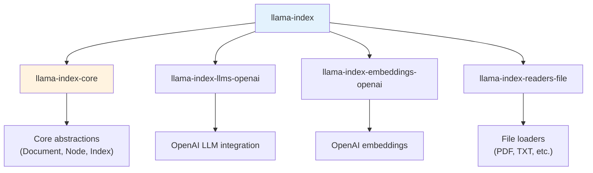

# Installation & Setup

## Introduction

Getting started with LlamaIndex requires understanding its modular package structure. Unlike monolithic libraries, LlamaIndex uses a namespaced package system that lets you install only what you need—keeping your dependencies lean and your environment clean.

In this lesson, we explore how to install LlamaIndex, configure your environment, and set up the global Settings object that controls LLM behavior, embeddings, and text processing throughout your application.

### What We'll Cover

- Understanding the LlamaIndex package ecosystem
- Installing the starter bundle vs custom installations
- Configuring environment variables for LLM providers
- Using the Settings object for global configuration
- Local configuration overrides

### Prerequisites

- Python 3.9 or higher
- pip or poetry for package management
- A virtual environment (recommended)
- An OpenAI API key (or alternative LLM provider credentials)

---

## The LlamaIndex Package Ecosystem

LlamaIndex follows a modular architecture with namespaced packages. This design offers several benefits:

| Benefit | Description |
|---------|-------------|
| **Smaller Footprint** | Install only the integrations you need |
| **Version Independence** | Update individual components without breaking others |
| **Clear Dependencies** | Know exactly which providers your app relies on |
| **Faster Updates** | Individual packages can release independently |

### Package Structure



### Core Packages

| Package | Purpose | When You Need It |
|---------|---------|-----------------|
| `llama-index-core` | Core abstractions and interfaces | Always—it's the foundation |
| `llama-index-llms-*` | LLM provider integrations | When using specific LLMs |
| `llama-index-embeddings-*` | Embedding model integrations | When generating embeddings |
| `llama-index-readers-*` | Data loaders for various formats | When ingesting specific file types |
| `llama-index-vector-stores-*` | Vector database integrations | When using external vector DBs |

---

## Quickstart Installation

The simplest way to get started is with the starter bundle:

```bash
pip install llama-index
```

This installs a curated set of packages:

```python
# What you get with pip install llama-index:
# - llama-index-core           # Core framework
# - llama-index-llms-openai    # OpenAI LLM support
# - llama-index-embeddings-openai  # OpenAI embeddings
# - llama-index-readers-file   # File loaders (PDF, TXT, etc.)
```

> **Note:** The `llama-index-core` package comes pre-bundled with NLTK and tiktoken files to avoid network calls at runtime.

### Verifying Installation

```python
import llama_index
print(f"LlamaIndex version: {llama_index.__version__}")
```

**Output:**
```
LlamaIndex version: 0.11.x
```

---

## Custom Installation

For production applications or when using non-OpenAI providers, install packages individually:

### Example: Local LLM Setup with Ollama

```bash
pip install llama-index-core \
            llama-index-readers-file \
            llama-index-llms-ollama \
            llama-index-embeddings-huggingface
```

### Example: Anthropic Claude Setup

```bash
pip install llama-index-core \
            llama-index-llms-anthropic \
            llama-index-embeddings-openai
```

### Example: Azure OpenAI Setup

```bash
pip install llama-index-core \
            llama-index-llms-azure-openai \
            llama-index-embeddings-azure-openai
```

### Finding Available Packages

All available packages are listed on [LlamaHub](https://llamahub.ai/). Common categories:

| Category | Example Packages |
|----------|-----------------|
| **LLMs** | `llama-index-llms-openai`, `llama-index-llms-anthropic`, `llama-index-llms-ollama` |
| **Embeddings** | `llama-index-embeddings-openai`, `llama-index-embeddings-huggingface`, `llama-index-embeddings-cohere` |
| **Readers** | `llama-index-readers-file`, `llama-index-readers-web`, `llama-index-readers-database` |
| **Vector Stores** | `llama-index-vector-stores-chroma`, `llama-index-vector-stores-pinecone`, `llama-index-vector-stores-qdrant` |

---

## Environment Variables

LlamaIndex respects standard environment variables for API authentication:

### OpenAI (Default)

```bash
# Required for default OpenAI setup
export OPENAI_API_KEY="sk-..."

# Optional: Organization ID
export OPENAI_ORG_ID="org-..."
```

### Anthropic

```bash
export ANTHROPIC_API_KEY="sk-ant-..."
```

### Azure OpenAI

```bash
export AZURE_OPENAI_API_KEY="..."
export AZURE_OPENAI_ENDPOINT="https://your-resource.openai.azure.com"
export AZURE_OPENAI_API_VERSION="2024-02-15-preview"
```

### Setting Variables in Python

You can also set these programmatically:

```python
import os

# Set before importing LlamaIndex components
os.environ["OPENAI_API_KEY"] = "sk-..."

from llama_index.core import VectorStoreIndex
```

> **Warning:** Never commit API keys to version control. Use environment variables, `.env` files with `python-dotenv`, or secret management systems.

---

## The Settings Object

The `Settings` object is a singleton that provides global configuration for your LlamaIndex application. It controls which LLM, embedding model, and text processing strategies are used throughout your code.

### Why Settings Matters

Without explicit configuration, LlamaIndex uses sensible defaults:

| Setting | Default Value |
|---------|---------------|
| `llm` | `OpenAI(model="gpt-3.5-turbo")` |
| `embed_model` | `OpenAIEmbedding(model="text-embedding-ada-002")` |
| `chunk_size` | `1024` tokens |
| `chunk_overlap` | `20` tokens |

### Basic Settings Configuration

```python
from llama_index.core import Settings
from llama_index.llms.openai import OpenAI
from llama_index.embeddings.openai import OpenAIEmbedding

# Configure the LLM
Settings.llm = OpenAI(
    model="gpt-4o",
    temperature=0.1
)

# Configure embeddings
Settings.embed_model = OpenAIEmbedding(
    model="text-embedding-3-small",
    embed_batch_size=100
)

# Now all LlamaIndex operations use these settings
```

---

## Configuring Settings in Detail

### LLM Configuration

The LLM setting controls which language model generates responses:

```python
from llama_index.core import Settings
from llama_index.llms.openai import OpenAI

Settings.llm = OpenAI(
    model="gpt-4o",          # Model name
    temperature=0.1,          # Lower = more deterministic
    max_tokens=1024,          # Maximum response length
    timeout=60.0,             # Request timeout in seconds
)
```

### Embedding Model Configuration

The embedding model converts text to vectors for semantic search:

```python
from llama_index.embeddings.openai import OpenAIEmbedding

Settings.embed_model = OpenAIEmbedding(
    model="text-embedding-3-small",  # Smaller, faster model
    embed_batch_size=100              # Batch size for efficiency
)
```

### Text Splitting Configuration

Control how documents are chunked into nodes:

```python
from llama_index.core.node_parser import SentenceSplitter

# Option 1: Quick chunk size adjustment
Settings.chunk_size = 512
Settings.chunk_overlap = 50

# Option 2: Custom text splitter
Settings.text_splitter = SentenceSplitter(
    chunk_size=512,
    chunk_overlap=50,
    paragraph_separator="\n\n"
)
```

### Transformations Pipeline

For advanced text processing, configure the transformations pipeline:

```python
from llama_index.core.node_parser import SentenceSplitter
from llama_index.core.extractors import TitleExtractor, QuestionsAnsweredExtractor

Settings.transformations = [
    SentenceSplitter(chunk_size=512),
    TitleExtractor(),
    QuestionsAnsweredExtractor(questions=3)
]
```

---

## Tokenizer Configuration

The tokenizer counts tokens to ensure prompts fit within context windows:

```python
from llama_index.core import Settings
import tiktoken

# For OpenAI models
Settings.tokenizer = tiktoken.encoding_for_model("gpt-4o").encode

# For open-source models
from transformers import AutoTokenizer
Settings.tokenizer = AutoTokenizer.from_pretrained(
    "mistralai/Mixtral-8x7B-Instruct-v0.1"
).encode
```

### Context Window Settings

Control how much content can be sent to the LLM:

```python
# Maximum input tokens
Settings.context_window = 4096

# Tokens reserved for output
Settings.num_output = 512
```

---

## Local Configuration Overrides

While `Settings` provides global defaults, you can override configurations locally for specific operations:

### Override at Index Creation

```python
from llama_index.core import VectorStoreIndex, SimpleDirectoryReader
from llama_index.embeddings.huggingface import HuggingFaceEmbedding

documents = SimpleDirectoryReader("data").load_data()

# Use a different embedding model just for this index
index = VectorStoreIndex.from_documents(
    documents,
    embed_model=HuggingFaceEmbedding(model_name="BAAI/bge-small-en-v1.5")
)
```

### Override at Query Time

```python
from llama_index.llms.anthropic import Anthropic

# Global settings use OpenAI
query_engine = index.as_query_engine(
    llm=Anthropic(model="claude-3-sonnet-20240229")  # Override with Claude
)
```

### Override Summary

| Level | Scope | Use Case |
|-------|-------|----------|
| **Settings** | Global (entire application) | Default configuration |
| **Index creation** | Single index | Different embeddings for specific data |
| **Query time** | Single query | Testing different LLMs |

---

## Callbacks and Observability

Track token usage and events with callbacks:

```python
from llama_index.core.callbacks import TokenCountingHandler, CallbackManager
from llama_index.core import Settings

# Create a token counter
token_counter = TokenCountingHandler()

# Set up callback manager
Settings.callback_manager = CallbackManager([token_counter])

# After running queries, check usage
print(f"Total tokens: {token_counter.total_llm_token_count}")
print(f"Prompt tokens: {token_counter.prompt_llm_token_count}")
print(f"Completion tokens: {token_counter.completion_llm_token_count}")
```

**Output:**
```
Total tokens: 1547
Prompt tokens: 1234
Completion tokens: 313
```

---

## Complete Setup Example

Here's a production-ready setup combining all configuration options:

```python
import os
from llama_index.core import Settings, VectorStoreIndex, SimpleDirectoryReader
from llama_index.core.callbacks import TokenCountingHandler, CallbackManager
from llama_index.core.node_parser import SentenceSplitter
from llama_index.llms.openai import OpenAI
from llama_index.embeddings.openai import OpenAIEmbedding
import tiktoken

# ============================================
# 1. Environment Setup
# ============================================
# Ensure API key is set
assert os.environ.get("OPENAI_API_KEY"), "OPENAI_API_KEY not set!"

# ============================================
# 2. Configure LLM
# ============================================
Settings.llm = OpenAI(
    model="gpt-4o",
    temperature=0.1,
    max_tokens=1024
)

# ============================================
# 3. Configure Embeddings
# ============================================
Settings.embed_model = OpenAIEmbedding(
    model="text-embedding-3-small",
    embed_batch_size=100
)

# ============================================
# 4. Configure Text Processing
# ============================================
Settings.chunk_size = 512
Settings.chunk_overlap = 50
Settings.text_splitter = SentenceSplitter(
    chunk_size=512,
    chunk_overlap=50
)

# ============================================
# 5. Configure Tokenizer
# ============================================
Settings.tokenizer = tiktoken.encoding_for_model("gpt-4o").encode
Settings.context_window = 128000  # GPT-4o context window
Settings.num_output = 1024

# ============================================
# 6. Configure Callbacks
# ============================================
token_counter = TokenCountingHandler()
Settings.callback_manager = CallbackManager([token_counter])

# ============================================
# 7. Build and Query
# ============================================
documents = SimpleDirectoryReader("data").load_data()
index = VectorStoreIndex.from_documents(documents)
query_engine = index.as_query_engine()

response = query_engine.query("What are the main topics?")
print(response)

# Check token usage
print(f"\nTokens used: {token_counter.total_llm_token_count}")
```

---

## Best Practices

| Practice | Why It Matters |
|----------|----------------|
| Use virtual environments | Isolate dependencies, avoid conflicts |
| Set `temperature=0.1` for factual tasks | Reduces hallucination in retrieval scenarios |
| Match tokenizer to LLM | Accurate token counting prevents context overflow |
| Configure `embed_batch_size` | Improves embedding throughput for large datasets |
| Track tokens with callbacks | Monitor costs and optimize prompts |

---

## Common Pitfalls

| ❌ Mistake | ✅ Solution |
|-----------|-------------|
| Installing `llama-index` and individual packages | Choose one—starter bundle OR custom packages |
| Missing API key errors at runtime | Check `os.environ.get("OPENAI_API_KEY")` before operations |
| Mismatched tokenizer and LLM | Always configure `Settings.tokenizer` for your chosen LLM |
| Not setting `context_window` | Can cause prompt truncation—set explicitly for your model |
| Hardcoding API keys | Use environment variables or secret managers |

---

## Hands-on Exercise

### Your Task

Set up a LlamaIndex environment with custom configuration and verify everything works.

### Requirements

1. Create a new virtual environment
2. Install LlamaIndex with OpenAI support
3. Configure Settings with:
   - GPT-4o-mini as the LLM
   - text-embedding-3-small for embeddings
   - 256 token chunk size
4. Create a simple test to verify the configuration

### Expected Result

You should see your configuration applied and be able to make a simple query.

<details>
<summary>💡 Hints (click to expand)</summary>

- Use `python -m venv llama-env` to create the environment
- Check that `OPENAI_API_KEY` is set before running
- The `Settings` object is imported from `llama_index.core`
- Test with a simple inline document, no files needed

</details>

<details>
<summary>✅ Solution (click to expand)</summary>

```bash
# Terminal commands
python -m venv llama-env
source llama-env/bin/activate
pip install llama-index
export OPENAI_API_KEY="your-key-here"
```

```python
# test_setup.py
import os
from llama_index.core import Settings, VectorStoreIndex, Document
from llama_index.llms.openai import OpenAI
from llama_index.embeddings.openai import OpenAIEmbedding

# Verify API key
assert os.environ.get("OPENAI_API_KEY"), "Set OPENAI_API_KEY first!"

# Configure Settings
Settings.llm = OpenAI(model="gpt-4o-mini", temperature=0.1)
Settings.embed_model = OpenAIEmbedding(model="text-embedding-3-small")
Settings.chunk_size = 256
Settings.chunk_overlap = 25

# Test with inline document
documents = [
    Document(text="LlamaIndex is a framework for building RAG applications."),
    Document(text="It connects LLMs with your private data sources.")
]

# Create index and query
index = VectorStoreIndex.from_documents(documents)
query_engine = index.as_query_engine()

response = query_engine.query("What is LlamaIndex?")
print(f"Response: {response}")
print(f"\nConfiguration verified!")
print(f"- LLM: {Settings.llm.model}")
print(f"- Embed Model: {Settings.embed_model.model_name}")
print(f"- Chunk Size: {Settings.chunk_size}")
```

**Expected Output:**
```
Response: LlamaIndex is a framework for building RAG applications that connects LLMs with private data sources.

Configuration verified!
- LLM: gpt-4o-mini
- Embed Model: text-embedding-3-small
- Chunk Size: 256
```

</details>

### Bonus Challenges

- [ ] Configure LlamaIndex to use Ollama with a local model
- [ ] Set up token counting and track usage across multiple queries
- [ ] Create a configuration that uses different LLMs for indexing vs querying

---

## Summary

✅ LlamaIndex uses a modular package system—install only what you need

✅ The starter bundle (`pip install llama-index`) includes OpenAI integrations

✅ The `Settings` object provides global configuration for LLM, embeddings, and chunking

✅ Local overrides let you customize behavior at index or query level

✅ Callbacks enable observability and token tracking

**Next:** [Core Abstractions →](./02-core-abstractions.md)

---

## Navigation

| Previous | Up | Next |
|----------|-----|------|
| [LlamaIndex Overview](./00-llamaindex-fundamentals.md) | [Unit 8 Overview](../00-overview.md) | [Core Abstractions](./02-core-abstractions.md) |

---

## Further Reading

- [LlamaIndex Installation Guide](https://developers.llamaindex.ai/python/framework/getting_started/installation/) - Official installation docs
- [Configuring Settings](https://developers.llamaindex.ai/python/framework/module_guides/supporting_modules/settings/) - Complete Settings reference
- [LlamaHub](https://llamahub.ai/) - Browse all available packages and integrations

<!--
Sources Consulted:
- LlamaIndex Installation: https://developers.llamaindex.ai/python/framework/getting_started/installation/
- Settings Configuration: https://developers.llamaindex.ai/python/framework/module_guides/supporting_modules/settings/
- LlamaIndex GitHub: https://github.com/run-llama/llama_index
-->
