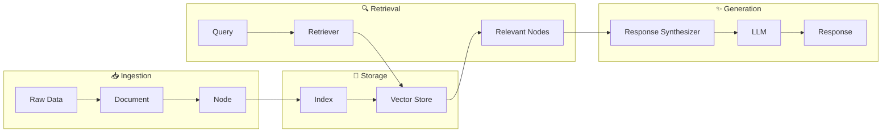
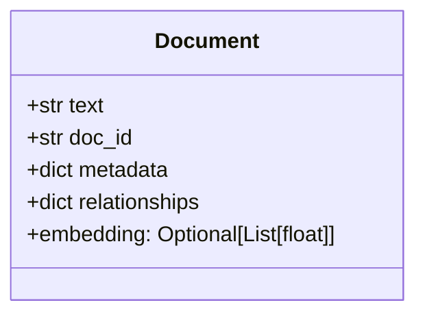
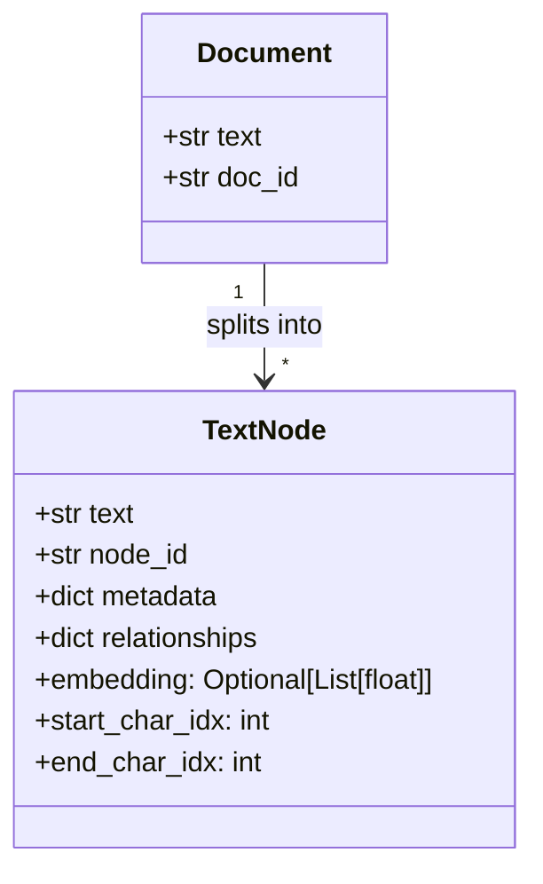
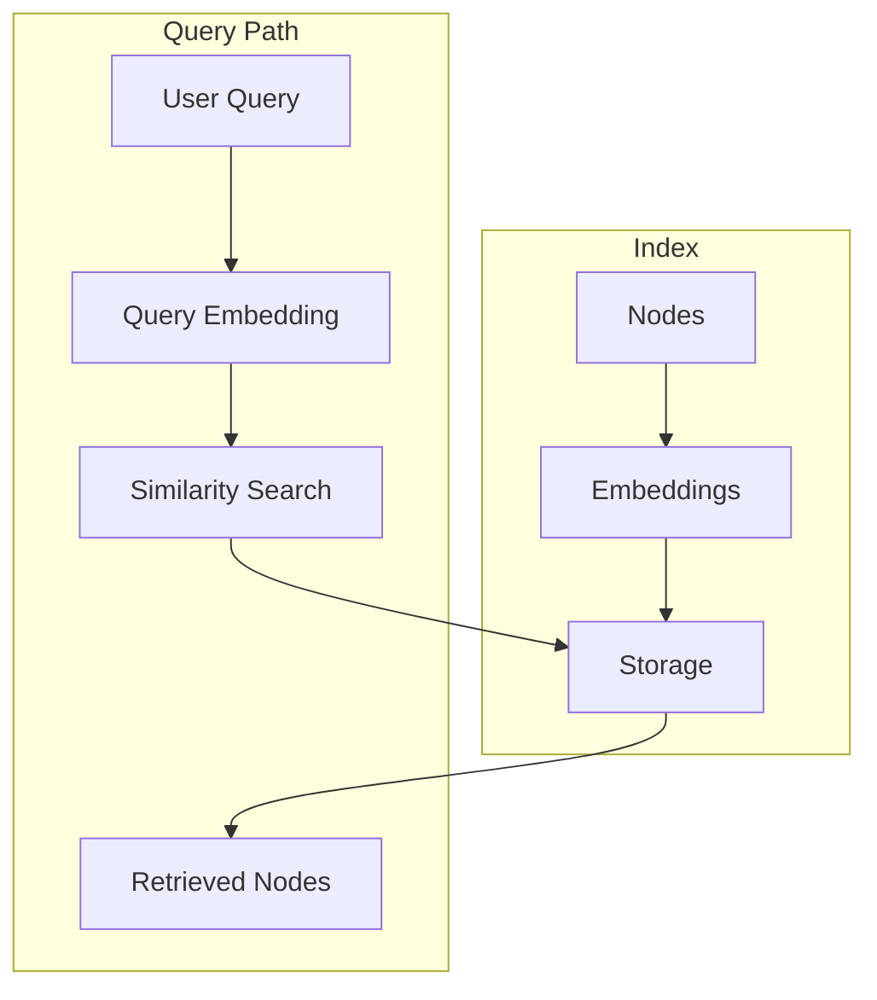
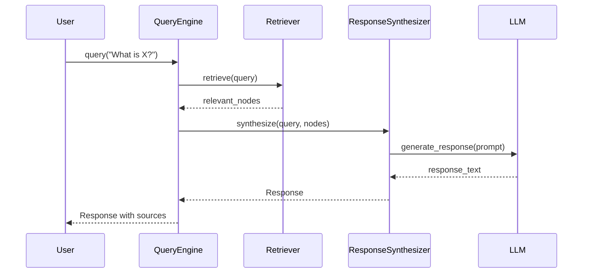
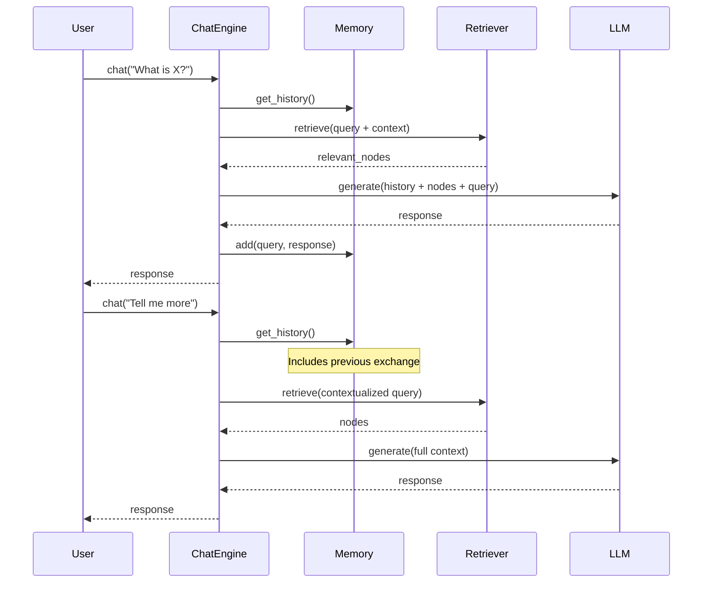
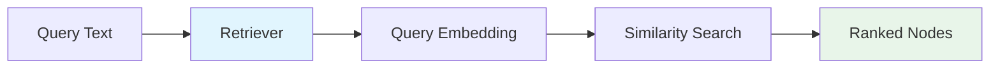

# Core Abstractions

## Introduction

LlamaIndex provides a powerful set of abstractions that simplify building retrieval-augmented generation (RAG) applications. Understanding these core building blocks is essential—they form the vocabulary you'll use to design, build, and reason about your AI applications.

In this lesson, we explore the fundamental abstractions in LlamaIndex: Documents, Nodes, Indices, Query Engines, Chat Engines, and Retrievers. By the end, you'll understand how data flows through a LlamaIndex application and how each component contributes to the final response.

### What We'll Cover

- The Document and Node data model
- Index types and their purposes
- Query Engines vs Chat Engines
- Retrievers and how they find relevant content
- The complete data flow from ingestion to response

### Prerequisites

- Completed [Installation & Setup](./01-installation-setup.md)
- Understanding of embeddings (vectors representing text)
- Basic familiarity with RAG concepts

---

## The Data Flow Pipeline

Before diving into individual abstractions, let's understand how data flows through a LlamaIndex application:



| Stage | What Happens |
|-------|-------------|
| **Ingestion** | Raw data (files, APIs, databases) is loaded into Documents, then split into Nodes |
| **Storage** | Nodes are embedded and stored in an Index backed by a vector store |
| **Retrieval** | User queries are embedded and matched against stored Node embeddings |
| **Generation** | Retrieved Nodes provide context for the LLM to generate a response |

---

## Document

A `Document` is a container for any piece of data you want to index. Think of it as a wrapper that holds your source content along with metadata about that content.

### Document Structure



| Property | Type | Description |
|----------|------|-------------|
| `text` | `str` | The actual content of the document |
| `doc_id` | `str` | Unique identifier (auto-generated if not provided) |
| `metadata` | `dict` | Key-value pairs for filtering and context |
| `relationships` | `dict` | Links to other Documents or Nodes |
| `embedding` | `List[float]` | Optional vector representation |

### Creating Documents

```python
from llama_index.core import Document

# Simple document
doc = Document(text="LlamaIndex is a framework for RAG applications.")

# Document with metadata
doc_with_meta = Document(
    text="The company was founded in 2022.",
    metadata={
        "source": "company_history.pdf",
        "page": 1,
        "author": "John Smith",
        "date": "2024-01-15"
    }
)

print(f"Doc ID: {doc_with_meta.doc_id}")
print(f"Metadata: {doc_with_meta.metadata}")
```

**Output:**
```
Doc ID: 8f3a1b2c-4d5e-6f7a-8b9c-0d1e2f3a4b5c
Metadata: {'source': 'company_history.pdf', 'page': 1, 'author': 'John Smith', 'date': '2024-01-15'}
```

### Documents from Various Sources

LlamaIndex provides loaders for many data sources:

```python
from llama_index.core import SimpleDirectoryReader

# Load all files from a directory
documents = SimpleDirectoryReader("./data").load_data()

# Load specific file types
documents = SimpleDirectoryReader(
    input_dir="./data",
    required_exts=[".pdf", ".txt", ".md"]
).load_data()

print(f"Loaded {len(documents)} documents")
```

> **🤖 AI Context:** Documents in LlamaIndex serve the same purpose as documents in LangChain—they're the standard container for ingested data. However, LlamaIndex's Document class has first-class support for relationships, which becomes important for hierarchical document structures.

---

## Node

A `Node` represents a chunk of a Document. Nodes are the fundamental unit of data in LlamaIndex—they're what gets embedded, stored, and retrieved.

### Why Nodes?

Large documents don't fit in LLM context windows. By splitting documents into smaller Nodes, we can:

1. **Embed efficiently** - Create focused vector representations
2. **Retrieve precisely** - Return only the relevant portions
3. **Optimize context** - Fit multiple relevant chunks in the prompt

### Node Structure



| Property | Description |
|----------|-------------|
| `text` | The chunk content |
| `node_id` | Unique identifier |
| `metadata` | Inherited from parent Document, plus node-specific metadata |
| `relationships` | References to parent Document, previous/next Nodes |
| `start_char_idx` | Character offset in original document |
| `end_char_idx` | End character offset |

### Nodes Inherit Metadata

When a Document is split into Nodes, metadata flows down:

```python
from llama_index.core import Document
from llama_index.core.node_parser import SentenceSplitter

# Create document with metadata
doc = Document(
    text="First paragraph. Second paragraph. Third paragraph.",
    metadata={"source": "example.txt", "category": "tutorial"}
)

# Split into nodes
parser = SentenceSplitter(chunk_size=50)
nodes = parser.get_nodes_from_documents([doc])

for i, node in enumerate(nodes):
    print(f"Node {i}: {node.text[:30]}...")
    print(f"  Metadata: {node.metadata}")
    print()
```

**Output:**
```
Node 0: First paragraph. Second par...
  Metadata: {'source': 'example.txt', 'category': 'tutorial'}

Node 1: Third paragraph....
  Metadata: {'source': 'example.txt', 'category': 'tutorial'}
```

### Node Relationships

Nodes maintain relationships to their parent and siblings:

```python
from llama_index.core.schema import NodeRelationship

# Check node relationships
for node in nodes:
    # Parent document reference
    if NodeRelationship.SOURCE in node.relationships:
        parent_id = node.relationships[NodeRelationship.SOURCE].node_id
        print(f"Parent doc: {parent_id}")
    
    # Previous node reference
    if NodeRelationship.PREVIOUS in node.relationships:
        prev_id = node.relationships[NodeRelationship.PREVIOUS].node_id
        print(f"Previous node: {prev_id}")
    
    # Next node reference
    if NodeRelationship.NEXT in node.relationships:
        next_id = node.relationships[NodeRelationship.NEXT].node_id
        print(f"Next node: {next_id}")
```

---

## Index

An `Index` is a data structure that organizes your Nodes for efficient retrieval. Different index types use different strategies to find relevant content.

### Index as a Library Catalog

Think of an Index like a library's organization system:

| Index Type | Library Analogy |
|------------|-----------------|
| **VectorStoreIndex** | Finding books by topic similarity |
| **SummaryIndex** | Reading through all books in order |
| **TreeIndex** | Following a topic hierarchy (category → subcategory → book) |
| **KeywordTableIndex** | Using a subject index |

### Index Architecture



### Common Index Types

| Index | Retrieval Strategy | Best For |
|-------|-------------------|----------|
| `VectorStoreIndex` | Semantic similarity via embeddings | Most RAG applications, semantic search |
| `SummaryIndex` | Sequential scan or embedding filter | Small datasets, summarization tasks |
| `TreeIndex` | Hierarchical traversal | Large documents with structure |
| `KeywordTableIndex` | Keyword matching | Exact term matching, hybrid search |

### Creating an Index

```python
from llama_index.core import VectorStoreIndex, SimpleDirectoryReader

# Load documents
documents = SimpleDirectoryReader("./data").load_data()

# Create vector index (most common)
index = VectorStoreIndex.from_documents(documents)

# Index is now ready for querying
```

> **Note:** When you create a `VectorStoreIndex`, LlamaIndex automatically:
> 1. Splits documents into Nodes
> 2. Generates embeddings for each Node
> 3. Stores everything in the index

---

## Query Engine

A `Query Engine` provides an end-to-end interface for asking questions about your data. It combines retrieval and response generation into a single, easy-to-use interface.

### Query Engine Flow



### Creating a Query Engine

```python
from llama_index.core import VectorStoreIndex, SimpleDirectoryReader

# Build index
documents = SimpleDirectoryReader("./data").load_data()
index = VectorStoreIndex.from_documents(documents)

# Create query engine
query_engine = index.as_query_engine()

# Ask questions
response = query_engine.query("What are the main topics covered?")
print(response)
```

### Configuring the Query Engine

```python
# Configure retrieval and response settings
query_engine = index.as_query_engine(
    similarity_top_k=5,           # Retrieve top 5 nodes
    response_mode="compact",       # Response synthesis strategy
    streaming=False                # Enable streaming
)
```

### Response Modes

| Mode | Description | Use Case |
|------|-------------|----------|
| `compact` | Combine chunks, then query LLM (default) | General Q&A |
| `refine` | Iteratively refine answer with each chunk | Detailed answers |
| `tree_summarize` | Build summary tree from chunks | Summarization |
| `simple_summarize` | Truncate to fit, then summarize | Quick summaries |
| `no_text` | Return nodes without LLM call | Retrieval only |

### Accessing Source Nodes

The response includes references to the source nodes used:

```python
response = query_engine.query("What is LlamaIndex?")

print(f"Response: {response}")
print(f"\nSources:")
for node in response.source_nodes:
    print(f"  - Score: {node.score:.3f}")
    print(f"    Text: {node.text[:100]}...")
```

**Output:**
```
Response: LlamaIndex is a framework for building RAG applications...

Sources:
  - Score: 0.892
    Text: LlamaIndex is the leading framework for context-augmented LLM applications...
  - Score: 0.756
    Text: The framework provides tools for ingesting, indexing, and querying data...
```

---

## Chat Engine

A `Chat Engine` extends the Query Engine with conversation history. It maintains state across multiple exchanges, enabling natural back-and-forth interactions.

### Chat Engine vs Query Engine

| Aspect | Query Engine | Chat Engine |
|--------|-------------|-------------|
| **State** | Stateless | Stateful (remembers history) |
| **Use Case** | Single questions | Conversations |
| **Method** | `.query()` | `.chat()` |
| **Context** | Only retrieved nodes | History + retrieved nodes |

### Chat Engine Flow



### Creating a Chat Engine

```python
from llama_index.core import VectorStoreIndex, SimpleDirectoryReader

# Build index
documents = SimpleDirectoryReader("./data").load_data()
index = VectorStoreIndex.from_documents(documents)

# Create chat engine
chat_engine = index.as_chat_engine()

# Have a conversation
response1 = chat_engine.chat("What is LlamaIndex?")
print(f"Bot: {response1}")

response2 = chat_engine.chat("What are its main features?")
print(f"Bot: {response2}")  # Uses context from first exchange

response3 = chat_engine.chat("How does it compare to LangChain?")
print(f"Bot: {response3}")  # Uses full conversation context
```

### Chat Engine Modes

| Mode | Description |
|------|-------------|
| `best` | Uses agent with tool-calling for optimal retrieval |
| `condense_question` | Reformulates question using chat history |
| `context` | Retrieves context and uses chat history |
| `condense_plus_context` | Combines both approaches (default) |
| `simple` | Direct chat without retrieval |

```python
# Specify chat mode
chat_engine = index.as_chat_engine(
    chat_mode="condense_plus_context",
    verbose=True  # Show internal reasoning
)
```

### Streaming Chat Responses

```python
chat_engine = index.as_chat_engine()

# Stream response token by token
streaming_response = chat_engine.stream_chat("Explain RAG in detail")

for token in streaming_response.response_gen:
    print(token, end="", flush=True)
```

---

## Retriever

A `Retriever` is responsible for finding relevant Nodes for a given query. While Query Engines and Chat Engines abstract this away, you can use Retrievers directly for more control.

### Retriever Purpose



### Using Retrievers Directly

```python
from llama_index.core import VectorStoreIndex, SimpleDirectoryReader

# Build index
documents = SimpleDirectoryReader("./data").load_data()
index = VectorStoreIndex.from_documents(documents)

# Get retriever
retriever = index.as_retriever(
    similarity_top_k=5  # Return top 5 matches
)

# Retrieve nodes
nodes = retriever.retrieve("What is LlamaIndex?")

for node in nodes:
    print(f"Score: {node.score:.3f}")
    print(f"Text: {node.text[:100]}...")
    print()
```

**Output:**
```
Score: 0.892
Text: LlamaIndex is a framework for building retrieval-augmented generation applications. It provides...

Score: 0.756
Text: The core philosophy of LlamaIndex is to make it easy to connect LLMs with your data...

Score: 0.701
Text: Key features include data connectors, indices, query engines, and agents...
```

### Retriever Types by Index

| Index | Default Retriever | Options |
|-------|-------------------|---------|
| `VectorStoreIndex` | `VectorIndexRetriever` | Similarity-based |
| `SummaryIndex` | `SummaryIndexRetriever` | `default`, `embedding`, `llm` |
| `TreeIndex` | `TreeSelectLeafRetriever` | `select_leaf`, `select_leaf_embedding`, `all_leaf`, `root` |
| `KeywordTableIndex` | `KeywordTableRetriever` | `default`, `simple`, `rake` |

### Custom Retriever Configuration

```python
# Configure retriever behavior
retriever = index.as_retriever(
    similarity_top_k=10,                    # More candidates
    node_postprocessors=[                    # Post-retrieval filtering
        SimilarityPostprocessor(cutoff=0.7)  # Minimum score
    ]
)
```

---

## Putting It All Together

Here's how all the abstractions work together in a complete application:

```python
from llama_index.core import (
    VectorStoreIndex,
    SimpleDirectoryReader,
    Settings,
    Document
)
from llama_index.core.node_parser import SentenceSplitter
from llama_index.llms.openai import OpenAI
from llama_index.embeddings.openai import OpenAIEmbedding

# ============================================
# 1. Configure Settings
# ============================================
Settings.llm = OpenAI(model="gpt-4o-mini")
Settings.embed_model = OpenAIEmbedding(model="text-embedding-3-small")
Settings.chunk_size = 512

# ============================================
# 2. Load Documents
# ============================================
documents = SimpleDirectoryReader("./data").load_data()
print(f"Loaded {len(documents)} documents")

# ============================================
# 3. Create Index (automatically creates Nodes)
# ============================================
index = VectorStoreIndex.from_documents(documents)

# ============================================
# 4. Use Query Engine for Single Questions
# ============================================
query_engine = index.as_query_engine(
    similarity_top_k=3,
    response_mode="compact"
)

response = query_engine.query("What are the key features?")
print(f"\nQuery Response: {response}")

# Show sources
print("\nSources used:")
for node in response.source_nodes:
    print(f"  - {node.text[:50]}... (score: {node.score:.2f})")

# ============================================
# 5. Use Chat Engine for Conversations
# ============================================
chat_engine = index.as_chat_engine(chat_mode="condense_plus_context")

print("\n--- Starting Conversation ---")
r1 = chat_engine.chat("What is this about?")
print(f"Bot: {r1}")

r2 = chat_engine.chat("Can you give more details?")
print(f"Bot: {r2}")

# ============================================
# 6. Use Retriever for Custom Workflows
# ============================================
retriever = index.as_retriever(similarity_top_k=5)
nodes = retriever.retrieve("main topics")

print("\n--- Retrieved Nodes ---")
for i, node in enumerate(nodes):
    print(f"{i+1}. {node.text[:60]}...")
```

---

## Best Practices

| Practice | Why It Matters |
|----------|----------------|
| Use `VectorStoreIndex` as your default | Best balance of quality and performance for most use cases |
| Set appropriate `similarity_top_k` | Too low misses context; too high adds noise |
| Add metadata to Documents | Enables filtering and improves source attribution |
| Use Chat Engine for multi-turn | Query Engine doesn't remember previous questions |
| Check `source_nodes` in responses | Verify the answer is grounded in your data |

---

## Common Pitfalls

| ❌ Mistake | ✅ Solution |
|-----------|-------------|
| Using Query Engine for conversations | Use Chat Engine for multi-turn interactions |
| Setting `similarity_top_k` too high | Start with 3-5, increase if answers lack context |
| Ignoring metadata | Add source, date, category for better filtering |
| Not checking source nodes | Always verify answers are grounded in retrieved content |
| Mixing up `.query()` and `.chat()` | Query Engine uses `.query()`, Chat Engine uses `.chat()` |

---

## Hands-on Exercise

### Your Task

Build a mini knowledge base application that demonstrates all core abstractions.

### Requirements

1. Create 3+ Documents with meaningful metadata
2. Build a VectorStoreIndex
3. Query using a Query Engine and examine source nodes
4. Have a 2-turn conversation using a Chat Engine
5. Use a Retriever directly to fetch nodes

### Expected Result

A working application that shows how Documents become Nodes, how Nodes are retrieved, and how different interfaces (Query Engine, Chat Engine, Retriever) provide different capabilities.

<details>
<summary>💡 Hints (click to expand)</summary>

- Use `Document(text="...", metadata={...})` to create documents inline
- Access `response.source_nodes` to see what was retrieved
- Chat Engine remembers context—your second question can reference the first
- Retriever returns `NodeWithScore` objects with `.text` and `.score`

</details>

<details>
<summary>✅ Solution (click to expand)</summary>

```python
from llama_index.core import VectorStoreIndex, Document, Settings
from llama_index.llms.openai import OpenAI
from llama_index.embeddings.openai import OpenAIEmbedding

# Configure
Settings.llm = OpenAI(model="gpt-4o-mini", temperature=0.1)
Settings.embed_model = OpenAIEmbedding(model="text-embedding-3-small")
Settings.chunk_size = 256

# 1. Create Documents with metadata
documents = [
    Document(
        text="LlamaIndex is a data framework for building LLM applications. It excels at retrieval-augmented generation (RAG) and connects your data with large language models.",
        metadata={"topic": "overview", "source": "docs"}
    ),
    Document(
        text="The VectorStoreIndex is the most commonly used index type. It creates embeddings for your documents and uses similarity search to find relevant content.",
        metadata={"topic": "indexing", "source": "tutorial"}
    ),
    Document(
        text="Query Engines provide an end-to-end interface for asking questions. Chat Engines add conversation history for multi-turn interactions.",
        metadata={"topic": "querying", "source": "guide"}
    )
]

print("=== Documents Created ===")
for i, doc in enumerate(documents):
    print(f"{i+1}. {doc.metadata['topic']}: {doc.text[:50]}...")

# 2. Build Index
print("\n=== Building Index ===")
index = VectorStoreIndex.from_documents(documents)
print("Index created successfully!")

# 3. Query Engine
print("\n=== Query Engine Test ===")
query_engine = index.as_query_engine(similarity_top_k=2)
response = query_engine.query("What is LlamaIndex best for?")
print(f"Response: {response}")
print("\nSources:")
for node in response.source_nodes:
    print(f"  - [{node.metadata.get('topic', 'unknown')}] Score: {node.score:.3f}")

# 4. Chat Engine
print("\n=== Chat Engine Test ===")
chat_engine = index.as_chat_engine()

response1 = chat_engine.chat("What types of indices are available?")
print(f"Q1: What types of indices are available?")
print(f"A1: {response1}\n")

response2 = chat_engine.chat("What makes that one special?")
print(f"Q2: What makes that one special?")
print(f"A2: {response2}")

# 5. Retriever
print("\n=== Retriever Test ===")
retriever = index.as_retriever(similarity_top_k=3)
nodes = retriever.retrieve("querying and conversation")

print("Retrieved Nodes:")
for i, node in enumerate(nodes):
    print(f"  {i+1}. Score: {node.score:.3f} | Topic: {node.metadata.get('topic')}")
    print(f"     Text: {node.text[:60]}...")
```

</details>

### Bonus Challenges

- [ ] Add a `SimilarityPostprocessor` to filter low-score nodes
- [ ] Create Documents with nested metadata and filter by metadata
- [ ] Compare responses with different `similarity_top_k` values

---

## Summary

✅ **Documents** are containers for your source data with metadata

✅ **Nodes** are chunks of Documents—the fundamental unit for retrieval

✅ **Indices** organize Nodes for efficient search (VectorStoreIndex is most common)

✅ **Query Engines** provide end-to-end Q&A with source attribution

✅ **Chat Engines** add conversation history for multi-turn interactions

✅ **Retrievers** give direct access to node retrieval for custom workflows

**Next:** [Documents & Nodes →](./03-documents-nodes.md)

---

## Navigation

| Previous | Up | Next |
|----------|-----|------|
| [Installation & Setup](./01-installation-setup.md) | [LlamaIndex Overview](./00-llamaindex-fundamentals.md) | [Documents & Nodes](./03-documents-nodes.md) |

---

## Further Reading

- [High-Level Concepts](https://developers.llamaindex.ai/python/framework/getting_started/concepts/) - Official concept overview
- [Query Engine Guide](https://developers.llamaindex.ai/python/framework/module_guides/deploying/query_engine/) - Deep dive into query engines
- [Chat Engine Guide](https://developers.llamaindex.ai/python/framework/module_guides/deploying/chat_engines/) - Chat engine patterns
- [Retriever Guide](https://developers.llamaindex.ai/python/framework/module_guides/querying/retriever/) - Retriever configuration

<!--
Sources Consulted:
- LlamaIndex Concepts: https://developers.llamaindex.ai/python/framework/getting_started/concepts/
- Query Engine: https://developers.llamaindex.ai/python/framework/module_guides/deploying/query_engine/
- Chat Engine: https://developers.llamaindex.ai/python/framework/module_guides/deploying/chat_engines/
- Retrievers: https://developers.llamaindex.ai/python/framework/module_guides/querying/retriever/
-->
