# Documents & Nodes

## Introduction

Understanding the Document and Node data model is essential for building effective LlamaIndex applications. Documents represent your raw data sources, while Nodes are the processed chunks that get indexed and retrieved. The quality of your RAG system depends heavily on how you create, enrich, and split your documents.

In this lesson, we explore Documents and Nodes in depth—covering creation, metadata, relationships, and the powerful NodeParser system that transforms Documents into retrieval-ready Nodes.

### What We'll Cover

- Creating Documents from various sources
- Working with document metadata
- Understanding Node structure and relationships
- Using NodeParsers for intelligent text splitting
- Customizing the Document → Node pipeline

### Prerequisites

- Completed [Core Abstractions](./02-core-abstractions.md)
- Understanding of text chunking concepts
- Python 3.9+ with LlamaIndex installed

---

## Understanding Documents

A `Document` in LlamaIndex is a container for any piece of data you want to index. It's a generic wrapper that can hold text from PDFs, web pages, databases, APIs, or any other source.

### Document Properties


| Property | Type | Description |
|----------|------|-------------|
| `text` | `str` | The actual content |
| `id_` | `str` | Unique identifier (auto-generated if not set) |
| `metadata` | `dict` | Key-value pairs for filtering and context |
| `relationships` | `dict` | Links to related Documents or Nodes |
| `embedding` | `List[float]` | Optional pre-computed embedding |
| `hash` | `str` | Content hash for deduplication |

### Creating Documents Manually

```python
from llama_index.core import Document

# Simple document
doc = Document(text="LlamaIndex is a framework for building RAG applications.")

# Document with explicit ID
doc_with_id = Document(
    text="This document has a custom identifier.",
    id_="my-custom-doc-001"
)

# Document with metadata
doc_with_meta = Document(
    text="Quarterly revenue increased by 15% year-over-year.",
    metadata={
        "source": "financial_report_q3.pdf",
        "page": 5,
        "category": "finance",
        "date": "2024-10-15",
        "confidential": True
    }
)

print(f"ID: {doc_with_meta.id_}")
print(f"Metadata: {doc_with_meta.metadata}")
print(f"Text: {doc_with_meta.text[:50]}...")
```

**Output:**
```
ID: 4f3a1b2c-5d6e-7f8a-9b0c-1d2e3f4a5b6c
Metadata: {'source': 'financial_report_q3.pdf', 'page': 5, 'category': 'finance', 'date': '2024-10-15', 'confidential': True}
Text: Quarterly revenue increased by 15% year-over-year...
```

---

## Loading Documents from Files

LlamaIndex provides data loaders (Readers) for many file types. The most common is `SimpleDirectoryReader`.

### SimpleDirectoryReader

```python
from llama_index.core import SimpleDirectoryReader

# Load all files from a directory
documents = SimpleDirectoryReader("./data").load_data()
print(f"Loaded {len(documents)} documents")

# Load specific file types
documents = SimpleDirectoryReader(
    input_dir="./data",
    required_exts=[".pdf", ".txt", ".md"],
    recursive=True  # Include subdirectories
).load_data()

# Load specific files
documents = SimpleDirectoryReader(
    input_files=["./report.pdf", "./notes.txt"]
).load_data()
```

### Automatic Metadata Extraction

`SimpleDirectoryReader` automatically adds metadata to each Document:

```python
documents = SimpleDirectoryReader("./data").load_data()

for doc in documents:
    print(f"File: {doc.metadata.get('file_name')}")
    print(f"Path: {doc.metadata.get('file_path')}")
    print(f"Type: {doc.metadata.get('file_type')}")
    print(f"Size: {doc.metadata.get('file_size')} bytes")
    print()
```

**Output:**
```
File: annual_report.pdf
Path: /workspace/data/annual_report.pdf
Type: application/pdf
Size: 245678 bytes

File: meeting_notes.txt
Path: /workspace/data/meeting_notes.txt
Type: text/plain
Size: 4521 bytes
```

### Custom Metadata with File Metadata Functions

```python
def get_custom_metadata(file_path: str) -> dict:
    """Extract custom metadata from file path."""
    import os
    from datetime import datetime
    
    return {
        "custom_source": os.path.basename(file_path),
        "ingested_at": datetime.now().isoformat(),
        "department": "engineering"  # Custom field
    }

documents = SimpleDirectoryReader(
    input_dir="./data",
    file_metadata=get_custom_metadata
).load_data()
```

---

## Working with Metadata

Metadata is crucial for filtering, organizing, and attributing sources in your RAG application.

### Why Metadata Matters

| Use Case | How Metadata Helps |
|----------|-------------------|
| **Source Attribution** | Show users where answers come from |
| **Filtering** | Retrieve only documents from specific sources/dates |
| **Security** | Enforce access controls based on sensitivity |
| **Deduplication** | Identify and merge duplicate content |
| **Ranking** | Boost results from authoritative sources |

### Adding and Modifying Metadata

```python
from llama_index.core import Document

# Create document
doc = Document(
    text="Important technical specification.",
    metadata={"type": "specification"}
)

# Add more metadata
doc.metadata["version"] = "1.0"
doc.metadata["author"] = "Engineering Team"
doc.metadata["last_updated"] = "2024-10-01"

# Update existing metadata
doc.metadata["type"] = "technical_spec"

print(doc.metadata)
```

**Output:**
```
{'type': 'technical_spec', 'version': '1.0', 'author': 'Engineering Team', 'last_updated': '2024-10-01'}
```

### Metadata in Retrieved Nodes

When you retrieve nodes, their metadata is accessible:

```python
from llama_index.core import VectorStoreIndex

# Build index
index = VectorStoreIndex.from_documents(documents)

# Query
query_engine = index.as_query_engine()
response = query_engine.query("What are the specifications?")

# Access source metadata
for node in response.source_nodes:
    print(f"Source: {node.metadata.get('source', 'unknown')}")
    print(f"Page: {node.metadata.get('page', 'N/A')}")
    print(f"Score: {node.score:.3f}")
    print()
```

### Filtering by Metadata

```python
from llama_index.core.vector_stores import MetadataFilters, MetadataFilter

# Create filters
filters = MetadataFilters(
    filters=[
        MetadataFilter(key="category", value="finance"),
        MetadataFilter(key="year", value="2024")
    ]
)

# Apply to retriever
retriever = index.as_retriever(
    similarity_top_k=5,
    filters=filters
)

# Or apply to query engine
query_engine = index.as_query_engine(
    similarity_top_k=5,
    filters=filters
)
```

---

## Understanding Nodes

A `Node` represents a chunk of a Document. Nodes are the fundamental units that get embedded, stored, and retrieved in LlamaIndex.

### Node Structure


### TextNode Properties

| Property | Description |
|----------|-------------|
| `text` | The chunk content |
| `id_` | Unique identifier |
| `metadata` | Inherited from parent + node-specific |
| `relationships` | Parent doc, previous/next nodes |
| `start_char_idx` | Start position in original document |
| `end_char_idx` | End position in original document |
| `embedding` | Vector representation |

### Creating Nodes Manually

```python
from llama_index.core.schema import TextNode

# Create a text node
node = TextNode(
    text="This is the content of the node.",
    id_="node-001",
    metadata={
        "source": "manual",
        "section": "introduction"
    }
)

print(f"Node ID: {node.id_}")
print(f"Text: {node.text}")
print(f"Metadata: {node.metadata}")
```

**Output:**
```
Node ID: node-001
Text: This is the content of the node.
Metadata: {'source': 'manual', 'section': 'introduction'}
```

---

## Node Relationships

Nodes maintain relationships to their parent Document and sibling Nodes, enabling context-aware retrieval.

### Relationship Types

```mermaid
flowchart TB
    subgraph Document["📄 Document"]
        D[Document]
    end
    
    subgraph Nodes["📝 Nodes"]
        N1[Node 1]
        N2[Node 2]
        N3[Node 3]
    end
    
    D -->|SOURCE| N1
    D -->|SOURCE| N2
    D -->|SOURCE| N3
    
    N1 -->|NEXT| N2
    N2 -->|PREVIOUS| N1
    N2 -->|NEXT| N3
    N3 -->|PREVIOUS| N2
```



| Relationship | Description |
|--------------|-------------|
| `SOURCE` | Link to parent Document |
| `PREVIOUS` | Link to preceding Node |
| `NEXT` | Link to following Node |
| `PARENT` | Link to parent Node (for hierarchical structures) |
| `CHILD` | Link to child Nodes |

### Accessing Relationships

```python
from llama_index.core.schema import NodeRelationship

# After parsing documents into nodes
for node in nodes:
    # Get parent document ID
    if NodeRelationship.SOURCE in node.relationships:
        parent_ref = node.relationships[NodeRelationship.SOURCE]
        print(f"Parent Doc: {parent_ref.node_id}")
    
    # Get previous node
    if NodeRelationship.PREVIOUS in node.relationships:
        prev_ref = node.relationships[NodeRelationship.PREVIOUS]
        print(f"Previous Node: {prev_ref.node_id}")
    
    # Get next node
    if NodeRelationship.NEXT in node.relationships:
        next_ref = node.relationships[NodeRelationship.NEXT]
        print(f"Next Node: {next_ref.node_id}")
```

### Using Relationships for Context

Node relationships enable powerful retrieval patterns:

```python
from llama_index.core.postprocessor import PrevNextNodePostprocessor

# Create postprocessor that includes surrounding context
postprocessor = PrevNextNodePostprocessor(
    num_nodes=2,  # Include 2 nodes before and after
    mode="both"   # "previous", "next", or "both"
)

# Use in query engine
query_engine = index.as_query_engine(
    node_postprocessors=[postprocessor]
)

# Retrieved nodes now include surrounding context
response = query_engine.query("What happened next?")
```

---

## NodeParsers: Transforming Documents to Nodes

NodeParsers are responsible for splitting Documents into Nodes. LlamaIndex provides several parser types for different use cases.

### The Parsing Pipeline


### Available NodeParsers

| Parser | Strategy | Best For |
|--------|----------|----------|
| `SentenceSplitter` | Split on sentences, respect chunk size | General text, articles |
| `TokenTextSplitter` | Split by token count | LLM-aware chunking |
| `SentenceWindowNodeParser` | Create overlapping windows | Better context preservation |
| `SemanticSplitterNodeParser` | Split on semantic boundaries | High-quality chunks |
| `MarkdownNodeParser` | Respect Markdown structure | Markdown documents |
| `HTMLNodeParser` | Parse HTML structure | Web pages |
| `JSONNodeParser` | Parse JSON structure | API responses |

### SentenceSplitter (Most Common)

```python
from llama_index.core.node_parser import SentenceSplitter
from llama_index.core import Document

# Create parser
parser = SentenceSplitter(
    chunk_size=512,           # Maximum chunk size in tokens
    chunk_overlap=50,         # Overlap between chunks
    paragraph_separator="\n\n"  # Split paragraphs first
)

# Create test documents
documents = [
    Document(text="""
    LlamaIndex is a data framework for building LLM applications.
    It provides tools for data ingestion, indexing, and querying.
    
    The framework supports multiple data sources including files,
    databases, and APIs. It's particularly good at RAG applications.
    
    Key features include vector search, text generation, and agents.
    Many companies use LlamaIndex in production environments.
    """)
]

# Parse into nodes
nodes = parser.get_nodes_from_documents(documents)

print(f"Created {len(nodes)} nodes")
for i, node in enumerate(nodes):
    print(f"\nNode {i+1}:")
    print(f"  Text: {node.text[:80]}...")
    print(f"  Chars: {len(node.text)}")
```

**Output:**
```
Created 2 nodes

Node 1:
  Text: LlamaIndex is a data framework for building LLM applications. It provides tools...
  Chars: 245

Node 2:
  Text: Key features include vector search, text generation, and agents. Many companies...
  Chars: 156
```

### TokenTextSplitter

When you need precise token-level control:

```python
from llama_index.core.node_parser import TokenTextSplitter

parser = TokenTextSplitter(
    chunk_size=256,      # Tokens, not characters
    chunk_overlap=20,    # Token overlap
    separator=" "        # Split on spaces
)

nodes = parser.get_nodes_from_documents(documents)
```

### SentenceWindowNodeParser

Creates nodes with surrounding sentence context:

```python
from llama_index.core.node_parser import SentenceWindowNodeParser

parser = SentenceWindowNodeParser.from_defaults(
    window_size=3,  # Include 3 sentences on each side
    window_metadata_key="window",
    original_text_metadata_key="original_text"
)

nodes = parser.get_nodes_from_documents(documents)

# Each node has window context in metadata
for node in nodes:
    print(f"Original: {node.metadata['original_text'][:50]}...")
    print(f"Window: {node.metadata['window'][:100]}...")
```

### MarkdownNodeParser

Respects Markdown structure:

```python
from llama_index.core.node_parser import MarkdownNodeParser

parser = MarkdownNodeParser()

# Markdown document
md_doc = Document(text="""
# Introduction

This is the intro paragraph.

## Features

- Feature 1: Description
- Feature 2: Description

## Conclusion

Final thoughts here.
""")

nodes = parser.get_nodes_from_documents([md_doc])

for node in nodes:
    print(f"Header Path: {node.metadata.get('header_path', 'root')}")
    print(f"Text: {node.text[:50]}...")
    print()
```

---

## Customizing the Transformation Pipeline

For advanced use cases, you can create custom transformation pipelines that include metadata extractors, embedders, and more.

### Using Transformations

```python
from llama_index.core.node_parser import SentenceSplitter
from llama_index.core.extractors import (
    TitleExtractor,
    QuestionsAnsweredExtractor,
    SummaryExtractor,
    KeywordExtractor
)
from llama_index.core.ingestion import IngestionPipeline

# Define transformation pipeline
pipeline = IngestionPipeline(
    transformations=[
        SentenceSplitter(chunk_size=512, chunk_overlap=50),
        TitleExtractor(nodes=5),  # Extract titles
        KeywordExtractor(keywords=5),  # Extract keywords
        SummaryExtractor(summaries=["self"]),  # Generate summaries
    ]
)

# Run pipeline
nodes = pipeline.run(documents=documents)

# Nodes now have enriched metadata
for node in nodes:
    print(f"Text: {node.text[:50]}...")
    print(f"Title: {node.metadata.get('document_title', 'N/A')}")
    print(f"Keywords: {node.metadata.get('excerpt_keywords', 'N/A')}")
    print()
```

### Metadata Extractors

| Extractor | What It Adds |
|-----------|-------------|
| `TitleExtractor` | Document title inferred from content |
| `KeywordExtractor` | Key terms and phrases |
| `SummaryExtractor` | Chunk summaries |
| `QuestionsAnsweredExtractor` | Questions the chunk can answer |
| `EntityExtractor` | Named entities (requires spaCy) |

### Example: Rich Metadata Pipeline

```python
from llama_index.core.ingestion import IngestionPipeline
from llama_index.core.node_parser import SentenceSplitter
from llama_index.core.extractors import TitleExtractor, KeywordExtractor
from llama_index.embeddings.openai import OpenAIEmbedding

# Create pipeline with embedding
pipeline = IngestionPipeline(
    transformations=[
        SentenceSplitter(chunk_size=512),
        TitleExtractor(),
        KeywordExtractor(keywords=5),
        OpenAIEmbedding(model="text-embedding-3-small"),  # Add embeddings
    ]
)

# Run and get nodes with embeddings
nodes = pipeline.run(documents=documents)

# Nodes are ready for indexing
print(f"First node has embedding: {nodes[0].embedding is not None}")
```

---

## Building an Index from Nodes

You can create indices directly from Nodes instead of Documents:

```python
from llama_index.core import VectorStoreIndex
from llama_index.core.node_parser import SentenceSplitter

# Parse documents into nodes
parser = SentenceSplitter(chunk_size=512)
nodes = parser.get_nodes_from_documents(documents)

# Modify nodes if needed
for node in nodes:
    node.metadata["processed"] = True

# Create index from nodes (not documents)
index = VectorStoreIndex(nodes)

# Query as usual
query_engine = index.as_query_engine()
response = query_engine.query("What is this about?")
```

---

## Best Practices

| Practice | Why It Matters |
|----------|----------------|
| Add meaningful metadata | Enables filtering and improves source attribution |
| Use appropriate chunk sizes | Too small loses context; too large reduces precision |
| Include chunk overlap | Prevents information loss at boundaries |
| Choose parsers that match your data | MarkdownNodeParser for MD, HTMLNodeParser for HTML |
| Preserve relationships | Enables context-aware retrieval patterns |

---

## Common Pitfalls

| ❌ Mistake | ✅ Solution |
|-----------|-------------|
| Chunks too small (< 100 tokens) | Use 256-1024 tokens for most use cases |
| No chunk overlap | Add 10-20% overlap to preserve context |
| Ignoring document structure | Use structure-aware parsers (Markdown, HTML) |
| Generic metadata | Add source, date, category for useful filtering |
| Losing relationships | Don't disable relationship tracking |

---

## Hands-on Exercise

### Your Task

Create a document processing pipeline that enriches documents with metadata and splits them intelligently.

### Requirements

1. Create 2+ documents with different types of content (narrative, bullet points)
2. Add custom metadata to each document
3. Use `SentenceSplitter` with appropriate settings
4. Add at least one metadata extractor (e.g., `KeywordExtractor`)
5. Build an index and verify metadata is preserved in retrieved nodes

### Expected Result

A working pipeline that produces metadata-rich nodes that can be filtered and queried effectively.

<details>
<summary>💡 Hints (click to expand)</summary>

- Use `IngestionPipeline` to chain transformations
- Check `node.metadata` to see what was extracted
- The `KeywordExtractor` requires an LLM—make sure Settings is configured
- Use `response.source_nodes` to verify metadata in query results

</details>

<details>
<summary>✅ Solution (click to expand)</summary>

```python
from llama_index.core import Document, VectorStoreIndex, Settings
from llama_index.core.node_parser import SentenceSplitter
from llama_index.core.extractors import KeywordExtractor, TitleExtractor
from llama_index.core.ingestion import IngestionPipeline
from llama_index.llms.openai import OpenAI
from llama_index.embeddings.openai import OpenAIEmbedding

# Configure
Settings.llm = OpenAI(model="gpt-4o-mini")
Settings.embed_model = OpenAIEmbedding(model="text-embedding-3-small")

# 1. Create documents with different content types
documents = [
    Document(
        text="""
        Machine learning is transforming industries worldwide. Companies 
        are using ML for everything from customer service chatbots to 
        predictive maintenance in manufacturing. The adoption rate has 
        increased by 300% over the past five years.
        
        Key drivers of this growth include improved algorithms, cheaper 
        compute resources, and abundant training data. Cloud providers 
        have made ML accessible to organizations of all sizes.
        """,
        metadata={
            "type": "narrative",
            "category": "technology",
            "year": "2024"
        }
    ),
    Document(
        text="""
        Benefits of Machine Learning:
        - Automation of repetitive tasks
        - Improved decision making through data analysis
        - Enhanced customer experiences with personalization
        - Cost reduction in operations
        - Faster time to market for new products
        
        Challenges to consider:
        - Data quality and availability
        - Model interpretability requirements
        - Computational resources
        - Talent acquisition
        """,
        metadata={
            "type": "bullet_points",
            "category": "technology",
            "year": "2024"
        }
    )
]

print("=== Documents Created ===")
for doc in documents:
    print(f"Type: {doc.metadata['type']}, Chars: {len(doc.text)}")

# 2. Create ingestion pipeline
pipeline = IngestionPipeline(
    transformations=[
        SentenceSplitter(chunk_size=256, chunk_overlap=30),
        TitleExtractor(nodes=3),
        KeywordExtractor(keywords=5),
    ]
)

# 3. Process documents
nodes = pipeline.run(documents=documents)

print(f"\n=== Created {len(nodes)} Nodes ===")
for i, node in enumerate(nodes):
    print(f"\nNode {i+1}:")
    print(f"  Type: {node.metadata.get('type', 'N/A')}")
    print(f"  Title: {node.metadata.get('document_title', 'N/A')}")
    print(f"  Keywords: {node.metadata.get('excerpt_keywords', 'N/A')}")
    print(f"  Text: {node.text[:60]}...")

# 4. Build index
index = VectorStoreIndex(nodes)

# 5. Query and verify metadata
print("\n=== Query Test ===")
query_engine = index.as_query_engine(similarity_top_k=2)
response = query_engine.query("What are the benefits of ML?")

print(f"Response: {response}")
print("\nSource Metadata:")
for node in response.source_nodes:
    print(f"  - Type: {node.metadata.get('type')}")
    print(f"    Keywords: {node.metadata.get('excerpt_keywords', 'N/A')}")
    print(f"    Score: {node.score:.3f}")
```

</details>

### Bonus Challenges

- [ ] Add a `QuestionsAnsweredExtractor` and use the extracted questions in your queries
- [ ] Create a custom metadata extractor function
- [ ] Filter query results by metadata (e.g., only `type="narrative"`)

---

## Summary

✅ **Documents** are containers for raw data with customizable metadata

✅ **Nodes** are chunks with text, metadata, and relationships to parent/siblings

✅ **Metadata** enables filtering, attribution, and context-aware retrieval

✅ **NodeParsers** transform Documents into Nodes with configurable strategies

✅ **Transformations** can enrich Nodes with titles, keywords, summaries

**Next:** [Indices →](./04-indices.md)

---

## Navigation

| Previous | Up | Next |
|----------|-----|------|
| [Core Abstractions](./02-core-abstractions.md) | [LlamaIndex Overview](./00-llamaindex-fundamentals.md) | [Indices](./04-indices.md) |

---

## Further Reading

- [Documents & Nodes Guide](https://developers.llamaindex.ai/python/framework/module_guides/loading/documents_and_nodes/) - Official docs
- [Node Parsers](https://developers.llamaindex.ai/python/framework/module_guides/loading/node_parsers/) - All parser types
- [Metadata Extraction](https://developers.llamaindex.ai/python/framework/module_guides/loading/documents_and_nodes/metadata_extraction/) - Advanced extractors
- [Ingestion Pipeline](https://developers.llamaindex.ai/python/framework/module_guides/loading/ingestion_pipeline/) - Custom pipelines

<!--
Sources Consulted:
- Documents & Nodes: https://developers.llamaindex.ai/python/framework/module_guides/loading/documents_and_nodes/
- Node Parsers: https://developers.llamaindex.ai/python/framework/module_guides/loading/node_parsers/
- Ingestion Pipeline: https://developers.llamaindex.ai/python/framework/module_guides/loading/ingestion_pipeline/
- LlamaIndex GitHub: https://github.com/run-llama/llama_index
-->
