# Indices

## Introduction

Indices are the heart of LlamaIndex—they organize your Nodes for efficient retrieval. Different index types implement different strategies for finding relevant content, and choosing the right index is crucial for building effective RAG applications.

In this lesson, we explore the major index types in LlamaIndex: VectorStoreIndex, SummaryIndex, TreeIndex, and KeywordTableIndex. We examine how each works, when to use it, and how to configure it for optimal performance.

### What We'll Cover

- VectorStoreIndex: Semantic search with embeddings
- SummaryIndex: Sequential access and summarization
- TreeIndex: Hierarchical retrieval
- KeywordTableIndex: Keyword-based retrieval
- PropertyGraphIndex: Knowledge graph approach
- Choosing the right index for your use case

### Prerequisites

- Completed [Documents & Nodes](./03-documents-nodes.md)
- Understanding of embeddings and vector similarity
- Familiarity with different search paradigms

---

## Index Overview

An index in LlamaIndex is a data structure that stores your Nodes and provides a retrieval interface. Each index type offers a different trade-off between:

| Factor | Considerations |
|--------|---------------|
| **Query Speed** | How fast can we find relevant content? |
| **Accuracy** | How well do results match the query intent? |
| **Storage** | How much space and compute does it require? |
| **Flexibility** | What types of queries does it support? |

### Index Types at a Glance

```mermaid
flowchart TD
    subgraph Indices["📊 LlamaIndex Index Types"]
        A[VectorStoreIndex] --> A1["Semantic similarity\nTop-k retrieval"]
        B[SummaryIndex] --> B1["Sequential scan\nAll nodes or filtered"]
        C[TreeIndex] --> C1["Hierarchical traversal\nRoot to leaf"]
        D[KeywordTableIndex] --> D1["Keyword matching\nExact term lookup"]
        E[PropertyGraphIndex] --> E1["Knowledge graph\nEntity relationships"]
    end
    
    style A fill:#e3f2fd
    style B fill:#e8f5e9
    style C fill:#fff3e0
    style D fill:#fce4ec
    style E fill:#f3e5f5
```



| Index | Retrieval Method | Best Use Case |
|-------|-----------------|---------------|
| `VectorStoreIndex` | Embedding similarity search | General RAG, semantic search |
| `SummaryIndex` | Sequential or filtered scan | Small datasets, summarization |
| `TreeIndex` | Tree traversal | Large structured documents |
| `KeywordTableIndex` | Keyword lookup | Exact term matching |
| `PropertyGraphIndex` | Graph traversal | Complex relationships |

---

## VectorStoreIndex

The `VectorStoreIndex` is the most commonly used index type. It stores Node embeddings and uses similarity search to find relevant content.

### How It Works


### Creating a VectorStoreIndex

```python
from llama_index.core import VectorStoreIndex, SimpleDirectoryReader

# Load documents
documents = SimpleDirectoryReader("./data").load_data()

# Create index (embeddings generated automatically)
index = VectorStoreIndex.from_documents(documents)

# Query
query_engine = index.as_query_engine()
response = query_engine.query("What are the main features?")
print(response)
```

### Configuration Options

```python
from llama_index.core import VectorStoreIndex, Settings
from llama_index.embeddings.openai import OpenAIEmbedding

# Configure embedding model
Settings.embed_model = OpenAIEmbedding(model="text-embedding-3-small")

# Create index with options
index = VectorStoreIndex.from_documents(
    documents,
    show_progress=True,  # Show indexing progress
)

# Configure retrieval
query_engine = index.as_query_engine(
    similarity_top_k=5,          # Return top 5 matches
    response_mode="compact",      # Response synthesis mode
)
```

### Using External Vector Stores

LlamaIndex supports many vector databases:

```python
from llama_index.vector_stores.chroma import ChromaVectorStore
from llama_index.core import StorageContext
import chromadb

# Create Chroma client and collection
chroma_client = chromadb.PersistentClient(path="./chroma_db")
collection = chroma_client.get_or_create_collection("my_collection")

# Create vector store
vector_store = ChromaVectorStore(chroma_collection=collection)

# Create storage context
storage_context = StorageContext.from_defaults(vector_store=vector_store)

# Build index with external vector store
index = VectorStoreIndex.from_documents(
    documents,
    storage_context=storage_context
)
```

### Supported Vector Stores

| Vector Store | Package | Notes |
|--------------|---------|-------|
| Chroma | `llama-index-vector-stores-chroma` | Local, lightweight |
| Pinecone | `llama-index-vector-stores-pinecone` | Managed, scalable |
| Qdrant | `llama-index-vector-stores-qdrant` | Open source, feature-rich |
| Weaviate | `llama-index-vector-stores-weaviate` | Hybrid search support |
| Milvus | `llama-index-vector-stores-milvus` | High performance |
| PostgreSQL/pgvector | `llama-index-vector-stores-postgres` | SQL + vectors |

### VectorStoreIndex Best Practices

| Practice | Why |
|----------|-----|
| Use `text-embedding-3-small` for cost efficiency | Good quality, lower cost |
| Start with `similarity_top_k=3-5` | Balance between context and noise |
| Enable `show_progress` for large datasets | Track indexing time |
| Use persistent vector stores in production | Don't re-embed on restart |

---

## SummaryIndex

The `SummaryIndex` (formerly `ListIndex`) stores Nodes in a sequential list. It's simple but effective for smaller datasets or summarization tasks.

### How It Works


### Creating a SummaryIndex

```python
from llama_index.core import SummaryIndex, SimpleDirectoryReader

# Load documents
documents = SimpleDirectoryReader("./data").load_data()

# Create summary index
index = SummaryIndex.from_documents(documents)

# Query (by default, uses all nodes)
query_engine = index.as_query_engine()
response = query_engine.query("Summarize the main points")
print(response)
```

### Retrieval Modes

```python
from llama_index.core.indices.list import SummaryIndexRetriever

# Default: Return all nodes
retriever = index.as_retriever(retriever_mode="default")

# Embedding: Filter by similarity
retriever = index.as_retriever(
    retriever_mode="embedding",
    similarity_top_k=3
)

# LLM: Let LLM choose relevant nodes
retriever = index.as_retriever(
    retriever_mode="llm",
    choice_top_k=3
)
```

### When to Use SummaryIndex

| Use Case | Why SummaryIndex |
|----------|-----------------|
| Small document sets (< 100 pages) | Sequential scan is fast enough |
| Summarization tasks | All content is considered |
| When you need all context | No information is filtered out |
| Prototyping | Simple to set up and debug |

---

## TreeIndex

The `TreeIndex` builds a hierarchical tree structure from your Nodes. It's effective for large documents with natural hierarchical organization.

### How It Works


The tree is built bottom-up:
1. Leaf nodes contain original chunks
2. Parent nodes contain summaries of children
3. Root contains summary of entire document

### Creating a TreeIndex

```python
from llama_index.core import TreeIndex, SimpleDirectoryReader

# Load documents
documents = SimpleDirectoryReader("./data").load_data()

# Create tree index
index = TreeIndex.from_documents(
    documents,
    num_children=10,  # Max children per node
    show_progress=True
)

# Query (traverses tree to find relevant leaves)
query_engine = index.as_query_engine()
response = query_engine.query("What is the conclusion?")
print(response)
```

### Retrieval Modes

```python
# Select leaf nodes by traversing tree
query_engine = index.as_query_engine(
    retriever_mode="select_leaf",
    child_branch_factor=2  # Consider top 2 at each level
)

# Use embeddings to select at each level
query_engine = index.as_query_engine(
    retriever_mode="select_leaf_embedding"
)

# Return all leaf nodes
query_engine = index.as_query_engine(
    retriever_mode="all_leaf"
)

# Return only root (full summary)
query_engine = index.as_query_engine(
    retriever_mode="root"
)
```

### TreeIndex Retrieval Modes

| Mode | Description | Use Case |
|------|-------------|----------|
| `select_leaf` | LLM selects path at each level | Focused retrieval |
| `select_leaf_embedding` | Embedding similarity at each level | Faster, still focused |
| `all_leaf` | Return all leaf nodes | Need full context |
| `root` | Return only root summary | High-level answer |

### When to Use TreeIndex

| Use Case | Why TreeIndex |
|----------|--------------|
| Long documents (books, reports) | Hierarchical navigation |
| Structured content | Natural tree organization |
| Both summary and detail queries | Different retrieval modes |
| Memory-constrained environments | Only load relevant branches |

---

## KeywordTableIndex

The `KeywordTableIndex` extracts keywords from Nodes and builds a keyword-to-node mapping. Useful for exact term matching.

### How It Works


### Creating a KeywordTableIndex

```python
from llama_index.core import KeywordTableIndex, SimpleDirectoryReader

# Load documents
documents = SimpleDirectoryReader("./data").load_data()

# Create keyword table index
index = KeywordTableIndex.from_documents(
    documents,
    max_keywords_per_chunk=10  # Keywords extracted per node
)

# Query
query_engine = index.as_query_engine()
response = query_engine.query("neural networks")
print(response)
```

### Simple Keyword Table (No LLM)

For faster indexing without LLM keyword extraction:

```python
from llama_index.core import SimpleKeywordTableIndex

# Uses simple keyword extraction (no LLM)
index = SimpleKeywordTableIndex.from_documents(documents)
```

### Retrieval Modes

```python
# Default: Use LLM to extract query keywords
query_engine = index.as_query_engine(
    retriever_mode="default"
)

# Simple: Basic keyword extraction
query_engine = index.as_query_engine(
    retriever_mode="simple"
)

# RAKE: Use RAKE algorithm for extraction
query_engine = index.as_query_engine(
    retriever_mode="rake"
)
```

### When to Use KeywordTableIndex

| Use Case | Why KeywordTableIndex |
|----------|----------------------|
| Technical documentation | Exact term matching important |
| Domain-specific vocabulary | Keywords carry meaning |
| Hybrid with vector search | Combine keyword + semantic |
| Low-latency requirements | No embedding computation |

---

## PropertyGraphIndex

The `PropertyGraphIndex` creates a knowledge graph with entities and relationships. It's powerful for complex, relationship-heavy data.

### How It Works


### Creating a PropertyGraphIndex

```python
from llama_index.core import PropertyGraphIndex, SimpleDirectoryReader

# Load documents
documents = SimpleDirectoryReader("./data").load_data()

# Create property graph index
index = PropertyGraphIndex.from_documents(
    documents,
    show_progress=True
)

# Query with graph traversal
query_engine = index.as_query_engine(
    include_text=True  # Include original text in response
)

response = query_engine.query("What companies did Person X found?")
print(response)
```

### When to Use PropertyGraphIndex

| Use Case | Why PropertyGraphIndex |
|----------|----------------------|
| Relationship-heavy data | Explicit entity connections |
| Multi-hop questions | Graph traversal answers |
| Knowledge bases | Entity-centric organization |
| Complex reasoning | Relationships inform answers |

---

## Combining Multiple Indices

For complex applications, you can use multiple indices together with routers.

### Router Query Engine

```python
from llama_index.core import (
    VectorStoreIndex,
    SummaryIndex,
    SimpleDirectoryReader
)
from llama_index.core.tools import QueryEngineTool
from llama_index.core.query_engine import RouterQueryEngine
from llama_index.core.selectors import LLMSingleSelector

# Load documents
documents = SimpleDirectoryReader("./data").load_data()

# Create different indices
vector_index = VectorStoreIndex.from_documents(documents)
summary_index = SummaryIndex.from_documents(documents)

# Create tools from indices
vector_tool = QueryEngineTool.from_defaults(
    query_engine=vector_index.as_query_engine(),
    description="Use for specific questions about details"
)

summary_tool = QueryEngineTool.from_defaults(
    query_engine=summary_index.as_query_engine(),
    description="Use for summarization and overview questions"
)

# Create router
query_engine = RouterQueryEngine(
    selector=LLMSingleSelector.from_defaults(),
    query_engine_tools=[vector_tool, summary_tool]
)

# Router chooses appropriate index
response = query_engine.query("Give me a summary of the document")
# -> Routes to summary_index

response = query_engine.query("What was the revenue in Q3?")
# -> Routes to vector_index
```

---

## Index Selection Guide

### Decision Tree


### Quick Reference

| Question | Recommended Index |
|----------|------------------|
| "What's the best general-purpose choice?" | VectorStoreIndex |
| "I have < 50 pages of content" | SummaryIndex |
| "My content is hierarchical (chapters, sections)" | TreeIndex |
| "I need exact term matching" | KeywordTableIndex |
| "I'm answering relationship questions" | PropertyGraphIndex |
| "I need both summary and detail queries" | Router with multiple indices |

---

## Best Practices

| Practice | Why It Matters |
|----------|----------------|
| Start with VectorStoreIndex | Best balance for most use cases |
| Use persistent storage in production | Avoid re-indexing on restart |
| Match index to query patterns | Keyword for exact, vector for semantic |
| Consider hybrid approaches | Combine strengths of multiple indices |
| Profile retrieval quality | Test with representative queries |

---

## Common Pitfalls

| ❌ Mistake | ✅ Solution |
|-----------|-------------|
| Using TreeIndex for flat content | Use VectorStoreIndex for unstructured text |
| SummaryIndex with large datasets | Switch to VectorStoreIndex for > 100 pages |
| KeywordTableIndex for semantic queries | Keywords miss synonyms—use vector search |
| Not persisting indices | Always persist in production |
| Single index for diverse query types | Use routers to combine indices |

---

## Hands-on Exercise

### Your Task

Create and compare two different index types on the same dataset.

### Requirements

1. Create 4+ documents with varied content
2. Build both a VectorStoreIndex and a KeywordTableIndex
3. Query both with the same questions
4. Compare the results and explain differences

### Expected Result

Understanding of how different indices retrieve different results for the same query.

<details>
<summary>💡 Hints (click to expand)</summary>

- Use `SimpleKeywordTableIndex` to avoid LLM calls during indexing
- Try queries with exact terms vs. semantic variations
- Check `response.source_nodes` to see what each index retrieved
- Synonyms work with VectorStore but not Keyword

</details>

<details>
<summary>✅ Solution (click to expand)</summary>

```python
from llama_index.core import (
    Document,
    VectorStoreIndex,
    SimpleKeywordTableIndex,
    Settings
)
from llama_index.llms.openai import OpenAI
from llama_index.embeddings.openai import OpenAIEmbedding

# Configure
Settings.llm = OpenAI(model="gpt-4o-mini", temperature=0.1)
Settings.embed_model = OpenAIEmbedding(model="text-embedding-3-small")

# 1. Create documents
documents = [
    Document(text="Machine learning is transforming the healthcare industry. AI algorithms can detect diseases earlier than human doctors."),
    Document(text="Neural networks are a subset of machine learning. Deep learning uses multiple layers of neural networks."),
    Document(text="Natural language processing enables computers to understand human language. NLP is used in chatbots and translation."),
    Document(text="Computer vision allows machines to interpret images. Self-driving cars use computer vision for navigation."),
]

# 2. Build both indices
print("Building VectorStoreIndex...")
vector_index = VectorStoreIndex.from_documents(documents)

print("Building KeywordTableIndex...")
keyword_index = SimpleKeywordTableIndex.from_documents(documents)

# 3. Create query engines
vector_engine = vector_index.as_query_engine(similarity_top_k=2)
keyword_engine = keyword_index.as_query_engine()

# 4. Test queries
test_queries = [
    "What is machine learning?",           # Exact term match
    "Tell me about AI in medicine",        # Semantic variation
    "neural network architecture",         # Partial match
]

for query in test_queries:
    print(f"\n{'='*60}")
    print(f"Query: {query}")
    print("="*60)
    
    # Vector search
    vector_response = vector_engine.query(query)
    print(f"\n📊 VectorStoreIndex:")
    print(f"Response: {str(vector_response)[:150]}...")
    print("Sources:")
    for node in vector_response.source_nodes:
        print(f"  - Score: {node.score:.3f} | {node.text[:50]}...")
    
    # Keyword search
    keyword_response = keyword_engine.query(query)
    print(f"\n🔑 KeywordTableIndex:")
    print(f"Response: {str(keyword_response)[:150]}...")
    print("Sources:")
    for node in keyword_response.source_nodes[:2]:
        print(f"  - {node.text[:50]}...")

print("\n\n📋 Analysis:")
print("- VectorStore finds 'AI in medicine' → 'healthcare' (semantic)")
print("- KeywordTable misses synonyms—only exact matches work")
print("- For technical terms, both perform similarly")
print("- VectorStore provides relevance scores; KeywordTable doesn't")
```

**Expected Output Analysis:**
- Query "AI in medicine" → VectorStore finds healthcare doc (semantic match)
- Query "neural network architecture" → KeywordTable finds exact "neural networks" doc
- VectorStore scores show confidence; KeywordTable just returns matches

</details>

### Bonus Challenges

- [ ] Add a SummaryIndex and compare summarization results
- [ ] Create a RouterQueryEngine that chooses between indices
- [ ] Test with queries that have synonyms vs. exact terms

---

## Summary

✅ **VectorStoreIndex** is the go-to choice for semantic search

✅ **SummaryIndex** works well for small datasets and summarization

✅ **TreeIndex** excels with hierarchical, structured content

✅ **KeywordTableIndex** provides exact term matching

✅ **PropertyGraphIndex** handles relationship-heavy data

✅ **Routers** combine multiple indices for diverse query patterns

**Next:** [Basic Usage →](./05-basic-usage.md)

---

## Navigation

| Previous | Up | Next |
|----------|-----|------|
| [Documents & Nodes](./03-documents-nodes.md) | [LlamaIndex Overview](./00-llamaindex-fundamentals.md) | [Basic Usage](./05-basic-usage.md) |

---

## Further Reading

- [Index Guide](https://developers.llamaindex.ai/python/framework/module_guides/indexing/) - Official index documentation
- [VectorStoreIndex](https://developers.llamaindex.ai/python/framework/module_guides/indexing/vector_store_guide/) - Deep dive
- [Vector Store Integrations](https://llamahub.ai/) - Available vector databases
- [Query Engine Modules](https://developers.llamaindex.ai/python/framework/module_guides/deploying/query_engine/modules/) - Router and composability

<!--
Sources Consulted:
- Index Guide: https://developers.llamaindex.ai/python/framework/module_guides/indexing/
- VectorStoreIndex: https://developers.llamaindex.ai/python/framework/module_guides/indexing/vector_store_guide/
- LlamaIndex Concepts: https://developers.llamaindex.ai/python/framework/getting_started/concepts/
- LlamaIndex GitHub: https://github.com/run-llama/llama_index
-->
