# LlamaIndex Data Ingestion

## Introduction

Data ingestion is the foundation of every RAG (Retrieval-Augmented Generation) application. Before you can query your data with an LLM, you need to load it from various sources, transform it into queryable chunks, generate embeddings, and store those embeddings for efficient retrieval.

LlamaIndex provides a comprehensive, modular data ingestion system that handles everything from reading files to storing vectors in production databases. Whether you're building a simple document Q&A system or a complex multi-source knowledge base, understanding this pipeline is essential.

In this lesson, we'll explore the complete data ingestion workflow—from raw files to queryable vector stores.

### What We'll Cover

- **Data Connectors**: Loading data from files, web pages, databases, and APIs
- **LlamaHub**: Accessing hundreds of community-contributed data loaders
- **Transformations**: Parsing documents into nodes with text splitters and metadata extractors
- **Ingestion Pipeline**: Building repeatable, cached data processing workflows
- **Embeddings**: Converting text to vectors using various embedding models
- **Vector Stores**: Storing and persisting embeddings for retrieval

### Prerequisites

Before diving in, you should be familiar with:

- [LlamaIndex Fundamentals](../08-llamaindex-fundamentals/00-llamaindex-fundamentals.md) (Documents, Nodes, Indices)
- [Text Splitters](../07-text-splitters.md) (chunking concepts)
- Basic Python and environment setup

---

## The Data Ingestion Pipeline

At a high level, LlamaIndex data ingestion follows this flow:

```mermaid
flowchart LR
    A[📄 Raw Data] --> B[📖 Documents]
    B --> C[🔲 Nodes]
    C --> D[🔢 Embeddings]
    D --> E[💾 Vector Store]
```



Let's break down each stage:

### Stage 1: Data Connectors (Readers)

**Purpose**: Load raw data from various sources into `Document` objects.

```python
from llama_index.core import SimpleDirectoryReader

# Load from local files
documents = SimpleDirectoryReader("./data").load_data()
```

LlamaIndex supports 15+ file types out of the box, including PDF, DOCX, images, audio, and more. For specialized sources (databases, APIs, SaaS tools), you can use connectors from LlamaHub.

### Stage 2: Transformations

**Purpose**: Convert Documents into smaller, queryable `Node` objects.

```python
from llama_index.core.node_parser import SentenceSplitter

splitter = SentenceSplitter(chunk_size=1024, chunk_overlap=200)
nodes = splitter.get_nodes_from_documents(documents)
```

Transformations include:
- **Text Splitters**: Break documents into chunks
- **Metadata Extractors**: Automatically extract titles, summaries, and entities

### Stage 3: Embeddings

**Purpose**: Convert text into numerical vectors that capture semantic meaning.

```python
from llama_index.embeddings.openai import OpenAIEmbedding

embed_model = OpenAIEmbedding()
embedding = embed_model.get_text_embedding("Hello, world!")
```

You can use cloud-based embeddings (OpenAI, Cohere) or local models (HuggingFace).

### Stage 4: Vector Stores

**Purpose**: Store embeddings for efficient similarity search.

```python
from llama_index.core import VectorStoreIndex

index = VectorStoreIndex.from_documents(documents)
```

For production, you'll use external vector databases like Chroma, Pinecone, or Weaviate.

---

## The IngestionPipeline Class

For complex workflows, LlamaIndex provides `IngestionPipeline`—a powerful class that chains transformations together with built-in caching.

```python
from llama_index.core.ingestion import IngestionPipeline
from llama_index.core.node_parser import SentenceSplitter
from llama_index.core.extractors import TitleExtractor
from llama_index.embeddings.openai import OpenAIEmbedding

pipeline = IngestionPipeline(
    transformations=[
        SentenceSplitter(chunk_size=512, chunk_overlap=50),
        TitleExtractor(),
        OpenAIEmbedding(),
    ]
)

nodes = pipeline.run(documents=documents)
```

Key benefits:
- **Caching**: Avoids reprocessing unchanged documents
- **Document Management**: Tracks document hashes for incremental updates
- **Vector Store Integration**: Can write directly to external databases

---

## Lesson Roadmap

This lesson folder contains detailed guides for each component:

| Lesson | Topic | Description |
|--------|-------|-------------|
| [01-data-connectors](./01-data-connectors.md) | Data Connectors | SimpleDirectoryReader, file types, web/database readers |
| [02-llamahub](./02-llamahub.md) | LlamaHub | Community connectors, installation, custom readers |
| [03-transformations](./03-transformations.md) | Transformations | Node parsers, text splitters, metadata extractors |
| [04-ingestion-pipeline](./04-ingestion-pipeline.md) | Ingestion Pipeline | Pipeline configuration, caching, document management |
| [05-embeddings](./05-embeddings.md) | Embeddings | OpenAI, HuggingFace, local, and custom embeddings |
| [06-vector-stores](./06-vector-stores.md) | Vector Stores | Chroma, Pinecone, Weaviate, persistence |

---

## Quick Start Example

Here's a complete data ingestion example that demonstrates the full pipeline:

```python
from llama_index.core import SimpleDirectoryReader, VectorStoreIndex
from llama_index.core.ingestion import IngestionPipeline
from llama_index.core.node_parser import SentenceSplitter
from llama_index.core.extractors import TitleExtractor, SummaryExtractor
from llama_index.embeddings.openai import OpenAIEmbedding
from llama_index.vector_stores.chroma import ChromaVectorStore
import chromadb

# Step 1: Load documents
documents = SimpleDirectoryReader(
    input_dir="./data",
    recursive=True,
    required_exts=[".pdf", ".md", ".txt"]
).load_data()

print(f"Loaded {len(documents)} documents")

# Step 2: Set up vector store
chroma_client = chromadb.PersistentClient(path="./chroma_db")
chroma_collection = chroma_client.get_or_create_collection("my_collection")
vector_store = ChromaVectorStore(chroma_collection=chroma_collection)

# Step 3: Create ingestion pipeline
pipeline = IngestionPipeline(
    transformations=[
        SentenceSplitter(chunk_size=512, chunk_overlap=50),
        TitleExtractor(nodes=5),
        OpenAIEmbedding(),
    ],
    vector_store=vector_store,
)

# Step 4: Run the pipeline
nodes = pipeline.run(documents=documents, show_progress=True)

print(f"Created {len(nodes)} nodes")

# Step 5: Build index and query
index = VectorStoreIndex.from_vector_store(vector_store)
query_engine = index.as_query_engine()

response = query_engine.query("What are the main topics covered?")
print(response)
```

**Output:**
```
Loaded 25 documents
Created 147 nodes
The main topics covered include...
```

---

## Key Concepts Reference

| Component | Purpose | Key Classes |
|-----------|---------|-------------|
| **Data Connectors** | Load data into Documents | `SimpleDirectoryReader`, `WebPageReader` |
| **Node Parsers** | Split Documents into Nodes | `SentenceSplitter`, `TokenTextSplitter` |
| **Metadata Extractors** | Enrich Nodes with metadata | `TitleExtractor`, `SummaryExtractor` |
| **Embeddings** | Generate vector representations | `OpenAIEmbedding`, `HuggingFaceEmbedding` |
| **Vector Stores** | Store and retrieve embeddings | `ChromaVectorStore`, `PineconeVectorStore` |
| **Ingestion Pipeline** | Chain transformations | `IngestionPipeline` |

---

## Summary

✅ Data ingestion transforms raw data into queryable vector embeddings

✅ The pipeline flows from **Data Connectors → Transformations → Embeddings → Vector Stores**

✅ `IngestionPipeline` provides caching and document management for production workflows

✅ LlamaHub offers 100s of community connectors for specialized data sources

✅ You can mix cloud (OpenAI) and local (HuggingFace) models based on your needs

**Next:** [Data Connectors (Readers)](./01-data-connectors.md)

---

## Further Reading

- [LlamaIndex Documentation: Loading Data](https://developers.llamaindex.ai/python/framework/module_guides/loading/)
- [LlamaHub Registry](https://llamahub.ai/)
- [Vector Store Guide](https://developers.llamaindex.ai/python/framework/module_guides/storing/vector_stores/)

---

<!-- 
Sources Consulted:
- LlamaIndex Loading Data: https://developers.llamaindex.ai/python/framework/module_guides/loading/
- LlamaIndex SimpleDirectoryReader: https://developers.llamaindex.ai/python/framework/module_guides/loading/simpledirectoryreader/
- LlamaIndex Ingestion Pipeline: https://developers.llamaindex.ai/python/framework/module_guides/loading/ingestion_pipeline/
- LlamaIndex Embeddings: https://developers.llamaindex.ai/python/framework/module_guides/models/embeddings/
- LlamaIndex Vector Stores: https://developers.llamaindex.ai/python/framework/module_guides/storing/vector_stores/
- LlamaHub: https://llamahub.ai/
-->
