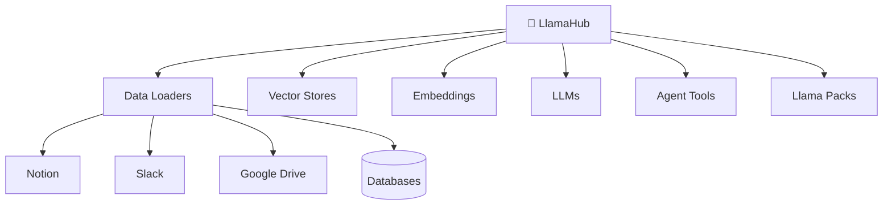

# LlamaHub

## Introduction

While `SimpleDirectoryReader` handles common file types, real-world applications often need to connect to specialized data sources—Notion databases, Slack channels, Confluence wikis, Google Drive, databases, and hundreds of other platforms.

LlamaHub is LlamaIndex's open-source registry of data connectors, containing 300+ community-contributed loaders that you can plug directly into your applications. Think of it as "npm for data loading"—a central repository where you can find, install, and use connectors for virtually any data source.

### What We'll Cover

- Understanding the LlamaHub ecosystem
- Installing and using community connectors
- Popular integrations by category
- Creating custom connectors
- Contributing to LlamaHub

### Prerequisites

- [Data Connectors (Readers)](./01-data-connectors.md)
- Basic understanding of LlamaIndex Documents

---

## What is LlamaHub?

LlamaHub ([llamahub.ai](https://llamahub.ai/)) is an open-source repository containing:

| Category | Count | Examples |
|----------|-------|----------|
| **Data Loaders** | 150+ | Notion, Slack, Google Drive, databases |
| **Vector Stores** | 40+ | Pinecone, Chroma, Weaviate, Qdrant |
| **Embeddings** | 30+ | OpenAI, HuggingFace, Cohere |
| **LLMs** | 40+ | OpenAI, Anthropic, Ollama |
| **Agent Tools** | 50+ | Web search, code execution, APIs |
| **Llama Packs** | 30+ | Pre-built RAG pipelines |



All integrations follow a consistent installation and usage pattern, making it easy to swap between different providers.

---

## Installing Connectors

LlamaHub connectors are distributed as separate pip packages, allowing you to install only what you need.

### Package Naming Convention

All LlamaHub packages follow this naming pattern:

```
llama-index-{category}-{provider}
```

Examples:
- `llama-index-readers-notion` — Notion data loader
- `llama-index-readers-slack` — Slack data loader
- `llama-index-vector-stores-chroma` — Chroma vector store
- `llama-index-embeddings-huggingface` — HuggingFace embeddings
- `llama-index-llms-anthropic` — Anthropic LLM

### Installation

```bash
# Install a single loader
pip install llama-index-readers-notion

# Install multiple loaders
pip install llama-index-readers-slack llama-index-readers-confluence

# Install via requirements.txt
echo "llama-index-readers-notion" >> requirements.txt
pip install -r requirements.txt
```

---

## Using Community Connectors

Once installed, connectors are imported and used consistently:

### Pattern 1: Direct Import

```python
from llama_index.readers.notion import NotionPageReader

reader = NotionPageReader(integration_token="secret_xxx")
documents = reader.load_data(page_ids=["page-id-123"])
```

### Pattern 2: Download Loader (Legacy)

The older `download_loader` function still works but direct imports are preferred:

```python
from llama_index.core import download_loader

NotionPageReader = download_loader("NotionPageReader")
reader = NotionPageReader(integration_token="secret_xxx")
```

> **Note:** Direct imports (`from llama_index.readers.notion import ...`) are the recommended approach as of 2024.

---

## Popular Integrations by Category

### Productivity & Documentation

| Loader | Package | Use Case |
|--------|---------|----------|
| **Notion** | `llama-index-readers-notion` | Wiki pages, databases |
| **Confluence** | `llama-index-readers-confluence` | Atlassian documentation |
| **Google Docs** | `llama-index-readers-google` | Google Workspace documents |
| **Slack** | `llama-index-readers-slack` | Channel messages, threads |
| **Discord** | `llama-index-readers-discord` | Server messages |

#### Notion Example

```python
from llama_index.readers.notion import NotionPageReader

# Get token from https://www.notion.so/my-integrations
reader = NotionPageReader(integration_token="secret_xxx")

# Load specific pages
documents = reader.load_data(page_ids=["abc123", "def456"])

# Or load entire database
documents = reader.load_data(database_id="database-id")
```

#### Slack Example

```python
from llama_index.readers.slack import SlackReader

reader = SlackReader(slack_token="xoxb-xxx")

# Load from specific channels
documents = reader.load_data(
    channel_ids=["C12345678", "C87654321"],
    earliest_date="2024-01-01"
)
```

### Cloud Storage

| Loader | Package | Use Case |
|--------|---------|----------|
| **S3** | `llama-index-readers-s3` | AWS S3 buckets |
| **Google Drive** | `llama-index-readers-google` | Google Drive files |
| **Azure Blob** | `llama-index-readers-azstorage-blob` | Azure storage |
| **OneDrive** | `llama-index-readers-microsoft-onedrive` | Microsoft OneDrive |

#### Google Drive Example

```python
from llama_index.readers.google import GoogleDriveReader

reader = GoogleDriveReader()

# Load from folder
documents = reader.load_data(folder_id="folder-id-123")

# Or specific files
documents = reader.load_data(file_ids=["file-id-1", "file-id-2"])
```

### Databases

| Loader | Package | Use Case |
|--------|---------|----------|
| **Database** | `llama-index-readers-database` | SQL databases |
| **MongoDB** | `llama-index-readers-mongodb` | MongoDB collections |
| **Pinecone** | `llama-index-readers-pinecone` | Read from Pinecone |

#### SQL Database Example

```python
from llama_index.readers.database import DatabaseReader

reader = DatabaseReader(
    scheme="postgresql",
    host="localhost",
    port=5432,
    user="admin",
    password="password",
    dbname="knowledge_base"
)

# Load via SQL query
documents = reader.load_data(
    query="""
        SELECT title, content, author, created_at
        FROM articles
        WHERE published = true
        ORDER BY created_at DESC
        LIMIT 1000
    """
)
```

### Web Content

| Loader | Package | Use Case |
|--------|---------|----------|
| **Web Pages** | `llama-index-readers-web` | Static websites |
| **YouTube** | `llama-index-readers-youtube-transcript` | Video transcripts |
| **Wikipedia** | `llama-index-readers-wikipedia` | Wikipedia articles |
| **ArXiv** | `llama-index-readers-papers` | Academic papers |

#### YouTube Transcript Example

```python
from llama_index.readers.youtube_transcript import YoutubeTranscriptReader

reader = YoutubeTranscriptReader()

documents = reader.load_data(
    ytlinks=[
        "https://www.youtube.com/watch?v=dQw4w9WgXcQ",
        "https://www.youtube.com/watch?v=xyz123"
    ]
)
```

#### Wikipedia Example

```python
from llama_index.readers.wikipedia import WikipediaReader

reader = WikipediaReader()

documents = reader.load_data(
    pages=["Machine learning", "Artificial intelligence", "Neural network"]
)
```

### Development Tools

| Loader | Package | Use Case |
|--------|---------|----------|
| **GitHub** | `llama-index-readers-github` | Repositories, issues |
| **Jira** | `llama-index-readers-jira` | Tickets, projects |

#### GitHub Example

```python
from llama_index.readers.github import GithubRepositoryReader

reader = GithubRepositoryReader(
    owner="run-llama",
    repo="llama_index",
    github_token="ghp_xxx"
)

# Load code files
documents = reader.load_data(
    branch="main",
    filter_file_extensions=[".py", ".md"]
)
```

---

## Specialized Loaders

### LlamaParse for Complex PDFs

For complex PDFs with tables, images, and mixed layouts, LlamaIndex offers [LlamaParse](https://cloud.llamaindex.ai/)—a managed parsing service:

```python
from llama_index.readers.llama_parse import LlamaParse

parser = LlamaParse(
    api_key="llx-xxx",
    result_type="markdown"  # or "text"
)

documents = parser.load_data("./complex_report.pdf")
```

LlamaParse excels at:
- Tables and structured data
- Multi-column layouts
- Embedded images with OCR
- Financial documents, academic papers

> **Note:** LlamaParse is a paid service with a free tier.

---

## Creating Custom Connectors

You can create custom connectors by extending `BaseReader`:

```python
from llama_index.core.readers.base import BaseReader
from llama_index.core import Document
from typing import List
import requests

class CustomAPIReader(BaseReader):
    """Reader for a custom REST API."""
    
    def __init__(self, api_key: str, base_url: str):
        self.api_key = api_key
        self.base_url = base_url
    
    def load_data(self, endpoint: str = "/articles") -> List[Document]:
        """Load documents from the API."""
        headers = {"Authorization": f"Bearer {self.api_key}"}
        response = requests.get(f"{self.base_url}{endpoint}", headers=headers)
        response.raise_for_status()
        
        data = response.json()
        
        documents = []
        for item in data["articles"]:
            doc = Document(
                text=item["content"],
                metadata={
                    "title": item["title"],
                    "author": item["author"],
                    "published_at": item["published_at"],
                    "source": "custom_api"
                }
            )
            documents.append(doc)
        
        return documents

# Usage
reader = CustomAPIReader(
    api_key="xxx",
    base_url="https://api.example.com"
)
documents = reader.load_data(endpoint="/v1/articles")
```

### Best Practices for Custom Readers

| Practice | Description |
|----------|-------------|
| **Handle errors gracefully** | Use try/except and provide clear error messages |
| **Include rich metadata** | Add source, timestamps, and category information |
| **Support pagination** | Handle large datasets with pagination |
| **Implement async** | Override `aload_data()` for async support |
| **Document requirements** | List required dependencies and credentials |

---

## Contributing to LlamaHub

LlamaHub is open-source and welcomes contributions!

### Contribution Workflow


### Structure of a Connector Package

```
llama-index-readers-myservice/
├── llama_index/
│   └── readers/
│       └── myservice/
│           ├── __init__.py
│           └── base.py       # Your reader implementation
├── tests/
│   └── test_readers.py
├── pyproject.toml
├── README.md
└── BUILD
```

### Key Files

**base.py** - Your reader class:

```python
from llama_index.core.readers.base import BaseReader
from llama_index.core import Document
from typing import List

class MyServiceReader(BaseReader):
    """Load documents from MyService."""
    
    def __init__(self, api_key: str):
        self.api_key = api_key
    
    def load_data(self, resource_id: str) -> List[Document]:
        # Implementation here
        pass
```

**__init__.py** - Export your reader:

```python
from llama_index.readers.myservice.base import MyServiceReader

__all__ = ["MyServiceReader"]
```

For detailed contribution guidelines, see the [LlamaIndex Contributing Guide](https://github.com/run-llama/llama_index/blob/main/CONTRIBUTING.md).

---

## Finding the Right Connector

### Browse LlamaHub.ai

Visit [llamahub.ai](https://llamahub.ai/) to browse all integrations with:
- Download counts
- Usage examples
- Direct links to documentation

### Search by Category

```python
# In your terminal or script
pip search llama-index-readers  # List all readers
pip search llama-index-vector   # List vector stores
```

### Check GitHub

The [llama_index GitHub repo](https://github.com/run-llama/llama_index/tree/main/llama-index-integrations) contains all connector source code.

---

## Best Practices

| Practice | Description |
|----------|-------------|
| **Install only what you need** | Each connector is a separate package |
| **Check download counts** | Popular connectors are better maintained |
| **Read the README** | Each package has usage examples |
| **Handle credentials securely** | Use environment variables, not hardcoded keys |
| **Cache loaded data** | Avoid repeated API calls during development |

---

## Common Pitfalls

| ❌ Mistake | ✅ Solution |
|-----------|------------|
| Installing `llama-hub` package | Use `llama-index-readers-{name}` instead |
| Hardcoding API keys | Use environment variables |
| Not handling rate limits | Add retry logic for API-based loaders |
| Loading too much data at once | Use pagination or date filters |
| Missing dependencies | Read package requirements carefully |

---

## Hands-on Exercise

### Your Task

Set up a LlamaHub connector to load data from an external source:

1. Choose a connector (Wikipedia, GitHub, or YouTube)
2. Install the package
3. Load at least 3 documents
4. Display document metadata

### Requirements

1. Install the connector via pip
2. Configure with appropriate parameters
3. Load documents and verify content
4. Print metadata for each document

### Expected Result

```
Loaded 3 documents from Wikipedia

Document 1: Machine learning
  - Length: 45,231 characters
  - URL: https://en.wikipedia.org/wiki/Machine_learning

Document 2: Artificial intelligence
  - Length: 62,847 characters
  - URL: https://en.wikipedia.org/wiki/Artificial_intelligence
```

<details>
<summary>💡 Hints</summary>

- Wikipedia reader requires no API key
- Use `pages=["Topic1", "Topic2"]` for multiple articles
- Access metadata via `doc.metadata`

</details>

<details>
<summary>✅ Solution</summary>

```python
# Install first: pip install llama-index-readers-wikipedia

from llama_index.readers.wikipedia import WikipediaReader

# Initialize reader
reader = WikipediaReader()

# Load documents
documents = reader.load_data(
    pages=[
        "Machine learning",
        "Artificial intelligence", 
        "Neural network"
    ]
)

print(f"Loaded {len(documents)} documents from Wikipedia\n")

for i, doc in enumerate(documents):
    print(f"Document {i + 1}: {doc.metadata.get('title', 'Unknown')}")
    print(f"  - Length: {len(doc.text):,} characters")
    print(f"  - URL: {doc.metadata.get('url', 'N/A')}")
    print()
```

</details>

### Bonus Challenges

- [ ] Load YouTube video transcripts and extract key topics
- [ ] Build a GitHub repo loader that filters by file extension
- [ ] Create a custom reader for a public API

---

## Summary

✅ LlamaHub is the central registry for 300+ LlamaIndex integrations

✅ Connectors are installed via pip: `pip install llama-index-readers-{name}`

✅ Import directly: `from llama_index.readers.{name} import Reader`

✅ Popular categories include productivity tools, databases, cloud storage, and web content

✅ Custom connectors extend `BaseReader` and implement `load_data()`

✅ LlamaHub is open-source—contributions are welcome!

**Next:** [Transformations](./03-transformations.md)

---

## Further Reading

- [LlamaHub Registry](https://llamahub.ai/)
- [Data Connectors Documentation](https://developers.llamaindex.ai/python/framework/module_guides/loading/connector/)
- [LlamaIndex GitHub Integrations](https://github.com/run-llama/llama_index/tree/main/llama-index-integrations)
- [Contributing Guide](https://github.com/run-llama/llama_index/blob/main/CONTRIBUTING.md)

---

<!-- 
Sources Consulted:
- LlamaHub: https://llamahub.ai/
- LlamaIndex Data Connectors: https://developers.llamaindex.ai/python/framework/module_guides/loading/connector/
- LlamaIndex GitHub: https://github.com/run-llama/llama_index
-->
