# Transformations

## Introduction

After loading documents with data connectors, the next step is transforming them into queryable chunks. Raw documents are often too large for LLMs to process effectively—a 100-page PDF won't fit in a context window, and even if it did, the LLM would struggle to find specific information.

Transformations solve this by breaking documents into smaller, meaningful pieces called `Nodes`. This process involves text splitting, metadata extraction, and optionally generating embeddings—all of which prepare your data for efficient retrieval.

### What We'll Cover

- Understanding the transformation pipeline
- Text splitters: SentenceSplitter vs. TokenTextSplitter
- Metadata extractors for automatic enrichment
- Creating custom transformations
- Combining transformations in a pipeline

### Prerequisites

- [Data Connectors (Readers)](./01-data-connectors.md)
- [Text Splitters](../07-text-splitters.md) (recommended)
- Understanding of Documents and Nodes

---

## What Are Transformations?

A transformation is any operation that takes a list of nodes as input and returns a list of nodes as output. Transformations can:

- **Split**: Break documents into smaller chunks
- **Extract**: Add metadata like titles, summaries, or entities
- **Embed**: Generate vector representations
- **Clean**: Remove unwanted content or normalize text

```mermaid
flowchart LR
    D[📄 Documents] --> T1[Text Splitter]
    T1 --> T2[Metadata Extractor]
    T2 --> T3[Embeddings]
    T3 --> N[🔲 Nodes]
```



All transformation classes implement the `TransformComponent` base class, providing both synchronous `__call__()` and asynchronous `acall()` methods.

---

## Node Parsers (Text Splitters)

Node parsers are the most fundamental transformations—they split documents into nodes based on different strategies.

### SentenceSplitter

The default and most commonly used splitter. It splits text at sentence boundaries while respecting a maximum chunk size.

```python
from llama_index.core.node_parser import SentenceSplitter

splitter = SentenceSplitter(
    chunk_size=1024,      # Maximum characters per chunk
    chunk_overlap=200     # Overlap between chunks
)

# Use with documents
nodes = splitter.get_nodes_from_documents(documents)

print(f"Created {len(nodes)} nodes")
print(f"First node: {nodes[0].text[:200]}...")
```

**Output:**
```
Created 47 nodes
First node: Machine learning is a branch of artificial intelligence that focuses on...
```

#### Key Parameters

| Parameter | Default | Description |
|-----------|---------|-------------|
| `chunk_size` | 1024 | Maximum size of each chunk in characters |
| `chunk_overlap` | 200 | Characters to overlap between chunks |
| `separator` | `" "` | Primary separator for splitting |
| `paragraph_separator` | `"\n\n\n"` | Separator for paragraph breaks |
| `secondary_chunking_regex` | `"[^,\.;]+[,\.;]?"` | Regex for secondary splitting |

### TokenTextSplitter

Splits based on token count rather than character count. Useful when you need precise control over context window usage.

```python
from llama_index.core.node_parser import TokenTextSplitter

splitter = TokenTextSplitter(
    chunk_size=512,       # Tokens per chunk
    chunk_overlap=50      # Overlap in tokens
)

nodes = splitter.get_nodes_from_documents(documents)
```

> **🤖 AI Context:** TokenTextSplitter is essential when working with models that have strict token limits. A 4K context model may silently truncate character-based chunks that exceed its token limit.

### Semantic Splitter (Experimental)

Splits based on semantic similarity between sentences, keeping related content together.

```python
from llama_index.core.node_parser import SemanticSplitterNodeParser
from llama_index.embeddings.openai import OpenAIEmbedding

# Requires an embedding model to compute similarity
splitter = SemanticSplitterNodeParser(
    buffer_size=1,
    breakpoint_percentile_threshold=95,
    embed_model=OpenAIEmbedding()
)

nodes = splitter.get_nodes_from_documents(documents)
```

### Hierarchical Node Parser

Creates parent-child relationships between nodes at different granularities.

```python
from llama_index.core.node_parser import HierarchicalNodeParser

splitter = HierarchicalNodeParser.from_defaults(
    chunk_sizes=[2048, 512, 128]  # Parent → Child → Leaf
)

nodes = splitter.get_nodes_from_documents(documents)
```

This enables retrieval strategies that first find relevant sections, then drill down to specific passages.

---

## Splitter Comparison

| Splitter | Best For | Pros | Cons |
|----------|----------|------|------|
| **SentenceSplitter** | General use | Fast, respects sentences | May split mid-paragraph |
| **TokenTextSplitter** | Token-limited models | Precise token control | Slower, may split mid-word |
| **SemanticSplitter** | Coherent topics | Keeps related content together | Requires embeddings, slow |
| **HierarchicalNodeParser** | Multi-level retrieval | Enables parent-child retrieval | Complex setup |

---

## Using Splitters

### Standalone Usage

Apply splitters directly to documents:

```python
from llama_index.core import Document
from llama_index.core.node_parser import SentenceSplitter

doc = Document(text="Your long document text here...")
splitter = SentenceSplitter(chunk_size=512, chunk_overlap=50)

nodes = splitter.get_nodes_from_documents([doc])
```

### In an Ingestion Pipeline

Combine with other transformations:

```python
from llama_index.core.ingestion import IngestionPipeline
from llama_index.core.node_parser import TokenTextSplitter

pipeline = IngestionPipeline(
    transformations=[
        TokenTextSplitter(chunk_size=256, chunk_overlap=32),
        # ... other transformations
    ]
)

nodes = pipeline.run(documents=documents)
```

### Per-Index Configuration

Set splitters when building an index:

```python
from llama_index.core import VectorStoreIndex
from llama_index.core.node_parser import SentenceSplitter

index = VectorStoreIndex.from_documents(
    documents,
    transformations=[SentenceSplitter(chunk_size=1024)]
)
```

### Global Settings

Set a default splitter for all operations:

```python
from llama_index.core import Settings
from llama_index.core.node_parser import SentenceSplitter

Settings.text_splitter = SentenceSplitter(
    chunk_size=1024,
    chunk_overlap=200
)
```

---

## Metadata Extractors

Metadata extractors automatically enrich nodes with additional information, improving retrieval accuracy and enabling filtering.

### Available Extractors

| Extractor | Purpose | Adds to Metadata |
|-----------|---------|------------------|
| **TitleExtractor** | Infers document title | `document_title` |
| **SummaryExtractor** | Generates node summary | `excerpt_keywords`, `section_summary` |
| **QuestionsAnsweredExtractor** | Questions this node answers | `questions_this_excerpt_can_answer` |
| **EntityExtractor** | Named entities (people, places) | `entities` |
| **KeywordExtractor** | Key terms | `keywords` |

### TitleExtractor

Automatically extracts or infers the document title:

```python
from llama_index.core.extractors import TitleExtractor

extractor = TitleExtractor(
    nodes=5  # Use first 5 nodes to infer title
)

nodes_with_titles = extractor(nodes)

print(nodes_with_titles[0].metadata)
```

**Output:**
```python
{
    'file_name': 'report.pdf',
    'document_title': 'Annual Financial Report 2024'  # Extracted
}
```

### SummaryExtractor

Generates a summary for each node:

```python
from llama_index.core.extractors import SummaryExtractor

extractor = SummaryExtractor(
    summaries=["self", "prev", "next"]  # Include context
)

nodes_with_summaries = extractor(nodes)
```

### QuestionsAnsweredExtractor

Generates questions that each node can answer:

```python
from llama_index.core.extractors import QuestionsAnsweredExtractor

extractor = QuestionsAnsweredExtractor(
    questions=3  # Generate 3 questions per node
)

nodes_with_questions = extractor(nodes)

print(nodes_with_questions[0].metadata["questions_this_excerpt_can_answer"])
```

**Output:**
```python
[
    "What is the company's revenue growth?",
    "How did Q4 compare to previous quarters?",
    "What are the projected earnings?"
]
```

> **🤖 AI Context:** This extractor is powerful for RAG—it pre-computes questions at indexing time, making retrieval more accurate when users ask questions in different phrasings.

### EntityExtractor

Extracts named entities using NLP:

```python
from llama_index.extractors.entity import EntityExtractor

# Uses spaCy by default
extractor = EntityExtractor(
    prediction_threshold=0.5,
    label_entities=True  # Include entity type
)

nodes_with_entities = extractor(nodes)
```

---

## Combining Transformations

Chain multiple transformations for a complete processing pipeline:

```python
from llama_index.core.ingestion import IngestionPipeline
from llama_index.core.node_parser import SentenceSplitter
from llama_index.core.extractors import (
    TitleExtractor,
    SummaryExtractor,
    QuestionsAnsweredExtractor,
)
from llama_index.embeddings.openai import OpenAIEmbedding

pipeline = IngestionPipeline(
    transformations=[
        # Step 1: Split into chunks
        SentenceSplitter(chunk_size=512, chunk_overlap=50),
        
        # Step 2: Extract title
        TitleExtractor(nodes=5),
        
        # Step 3: Generate questions (optional, expensive)
        QuestionsAnsweredExtractor(questions=3),
        
        # Step 4: Generate embeddings
        OpenAIEmbedding(),
    ]
)

nodes = pipeline.run(documents=documents, show_progress=True)
```

**Processing Order Matters:**


Always split first, then extract metadata, then embed.

---

## Custom Transformations

Create custom transformations by extending `TransformComponent`:

```python
import re
from llama_index.core.schema import TransformComponent
from llama_index.core.schema import BaseNode

class TextCleaner(TransformComponent):
    """Remove special characters and normalize whitespace."""
    
    def __call__(self, nodes: list[BaseNode], **kwargs) -> list[BaseNode]:
        for node in nodes:
            # Remove special characters
            node.text = re.sub(r"[^\w\s.,!?]", "", node.text)
            
            # Normalize whitespace
            node.text = " ".join(node.text.split())
            
            # Add processing metadata
            node.metadata["cleaned"] = True
        
        return nodes

# Use in pipeline
pipeline = IngestionPipeline(
    transformations=[
        SentenceSplitter(chunk_size=512),
        TextCleaner(),  # Custom transformation
        OpenAIEmbedding(),
    ]
)
```

### Async Custom Transformations

For I/O-bound operations, implement async:

```python
from llama_index.core.schema import TransformComponent
import aiohttp

class AsyncEnricher(TransformComponent):
    """Enrich nodes with external API data."""
    
    def __call__(self, nodes, **kwargs):
        # Sync fallback
        import asyncio
        return asyncio.run(self.acall(nodes, **kwargs))
    
    async def acall(self, nodes, **kwargs):
        async with aiohttp.ClientSession() as session:
            for node in nodes:
                # Async API call
                async with session.get(f"https://api.example.com/enrich?text={node.text[:100]}") as resp:
                    data = await resp.json()
                    node.metadata["enrichment"] = data
        
        return nodes
```

---

## Transformation Best Practices

| Practice | Description |
|----------|-------------|
| **Chunk size depends on model** | Match chunk size to your LLM's context window |
| **Use overlap for continuity** | 10-20% overlap preserves context across chunks |
| **Extract metadata sparingly** | Each extractor adds latency and API costs |
| **Embed last** | Generate embeddings after all text modifications |
| **Cache expensive operations** | Use IngestionPipeline caching for extractors |

### Recommended Chunk Sizes

| Model Context | Recommended Chunk Size |
|---------------|----------------------|
| 4K tokens | 256-512 tokens |
| 8K tokens | 512-1024 tokens |
| 16K+ tokens | 1024-2048 tokens |
| 128K+ tokens | 2048-4096 tokens |

> **Tip:** Smaller chunks improve retrieval precision but may lose context. Larger chunks preserve context but may retrieve irrelevant information.

---

## Common Pitfalls

| ❌ Mistake | ✅ Solution |
|-----------|------------|
| Embedding before cleaning | Apply text cleaning before embedding |
| Excessive metadata extraction | Only extract what you'll query against |
| Ignoring chunk overlap | Use overlap to maintain context |
| Character-based splitting for LLMs | Use TokenTextSplitter for precise limits |
| Not testing chunk quality | Review sample nodes before full indexing |

---

## Hands-on Exercise

### Your Task

Build a transformation pipeline that:
1. Splits documents into 512-character chunks with overlap
2. Extracts document titles
3. Adds a custom "word_count" metadata field
4. Shows node statistics

### Requirements

1. Create a sample document
2. Use SentenceSplitter with appropriate settings
3. Apply TitleExtractor
4. Create a custom transformation for word count
5. Print statistics about the resulting nodes

### Expected Result

```
Created 8 nodes from 1 document

Node Statistics:
  - Average length: 487 characters
  - Average word count: 82 words
  - Title: "Introduction to Machine Learning"
```

<details>
<summary>💡 Hints</summary>

- Use `len(node.text.split())` for word count
- Chain transformations in a list
- Access metadata via `node.metadata`

</details>

<details>
<summary>✅ Solution</summary>

```python
from llama_index.core import Document
from llama_index.core.ingestion import IngestionPipeline
from llama_index.core.node_parser import SentenceSplitter
from llama_index.core.extractors import TitleExtractor
from llama_index.core.schema import TransformComponent

class WordCountTransformation(TransformComponent):
    """Add word count to node metadata."""
    
    def __call__(self, nodes, **kwargs):
        for node in nodes:
            node.metadata["word_count"] = len(node.text.split())
        return nodes

# Create sample document
sample_text = """
# Introduction to Machine Learning

Machine learning is a subset of artificial intelligence that focuses on building 
systems that learn from data. Unlike traditional programming where rules are 
explicitly coded, machine learning algorithms discover patterns automatically.

## Types of Machine Learning

There are three main types of machine learning: supervised learning, unsupervised 
learning, and reinforcement learning. Each has unique characteristics and use cases.

### Supervised Learning

In supervised learning, the algorithm learns from labeled training data. Examples 
include classification and regression problems. Common algorithms include decision 
trees, random forests, and neural networks.

### Unsupervised Learning

Unsupervised learning works with unlabeled data to find hidden patterns. Clustering 
and dimensionality reduction are common applications.
"""

document = Document(text=sample_text)

# Build pipeline
pipeline = IngestionPipeline(
    transformations=[
        SentenceSplitter(chunk_size=512, chunk_overlap=50),
        TitleExtractor(nodes=3),
        WordCountTransformation(),
    ]
)

# Run pipeline
nodes = pipeline.run(documents=[document])

# Calculate statistics
total_length = sum(len(n.text) for n in nodes)
total_words = sum(n.metadata.get("word_count", 0) for n in nodes)

print(f"Created {len(nodes)} nodes from 1 document\n")
print("Node Statistics:")
print(f"  - Average length: {total_length // len(nodes)} characters")
print(f"  - Average word count: {total_words // len(nodes)} words")
print(f"  - Title: \"{nodes[0].metadata.get('document_title', 'Unknown')}\"")
```

</details>

---

## Summary

✅ Transformations convert Documents into queryable Nodes

✅ **SentenceSplitter** is the default—splits at sentence boundaries

✅ **TokenTextSplitter** provides precise token control for LLM context limits

✅ Metadata extractors automatically enrich nodes with titles, summaries, and questions

✅ Custom transformations extend `TransformComponent`

✅ Always split first, then extract metadata, then embed

**Next:** [Ingestion Pipeline](./04-ingestion-pipeline.md)

---

## Further Reading

- [Node Parser Usage Pattern](https://developers.llamaindex.ai/python/framework/module_guides/loading/node_parsers/)
- [Node Parser Modules](https://developers.llamaindex.ai/python/framework/module_guides/loading/node_parsers/modules/)
- [Metadata Extraction](https://developers.llamaindex.ai/python/framework/module_guides/loading/documents_and_nodes/usage_metadata_extractor/)
- [Transformations Guide](https://developers.llamaindex.ai/python/framework/module_guides/loading/ingestion_pipeline/transformations/)

---

<!-- 
Sources Consulted:
- LlamaIndex Node Parsers: https://developers.llamaindex.ai/python/framework/module_guides/loading/node_parsers/
- LlamaIndex Transformations: https://developers.llamaindex.ai/python/framework/module_guides/loading/ingestion_pipeline/transformations/
- LlamaIndex Metadata Extraction: https://developers.llamaindex.ai/python/framework/module_guides/loading/documents_and_nodes/usage_metadata_extractor/
-->
