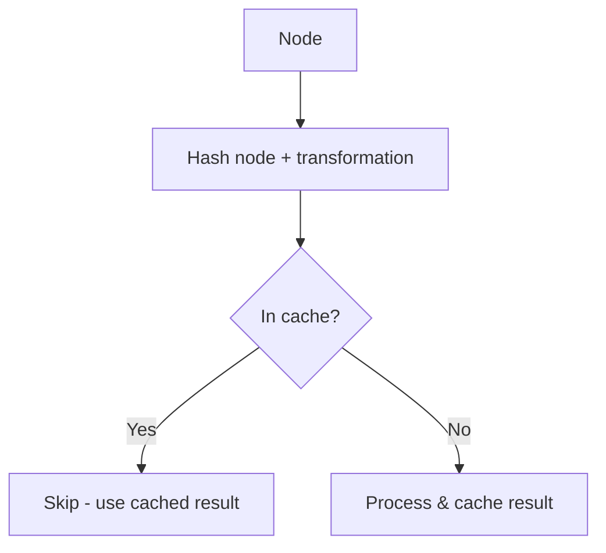
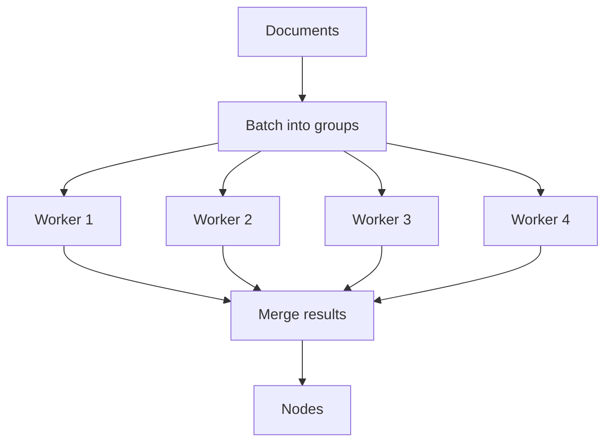

# Ingestion Pipeline

## Introduction

When building production RAG applications, you need more than just loading and splitting documents. You need caching to avoid reprocessing unchanged data, document management to handle updates, and the ability to write directly to vector databases—all while maintaining reproducibility.

The `IngestionPipeline` class provides all of this. It's LlamaIndex's recommended approach for building robust, repeatable data ingestion workflows that scale from development to production.

### What We'll Cover

- IngestionPipeline fundamentals and configuration
- Transformation chaining
- Local and remote caching
- Document management with deduplication
- Parallel processing for performance
- Direct vector store integration

### Prerequisites

- [Transformations](./03-transformations.md)
- Understanding of Documents, Nodes, and text splitting

---

## Why Use IngestionPipeline?

Without `IngestionPipeline`:

```python
# Manual approach - no caching, no deduplication
documents = SimpleDirectoryReader("./data").load_data()
nodes = SentenceSplitter().get_nodes_from_documents(documents)
nodes = TitleExtractor()(nodes)
nodes = embed_model.embed_nodes(nodes)
# What if you run this again? Everything reprocesses!
```

With `IngestionPipeline`:

```python
# Automatic caching, deduplication, and vector store integration
pipeline = IngestionPipeline(
    transformations=[SentenceSplitter(), TitleExtractor(), embed_model],
    vector_store=vector_store,
    docstore=docstore,  # Enables deduplication
)
nodes = pipeline.run(documents=documents)  # Cached on subsequent runs
```

Key benefits:
- **Caching**: Skip unchanged documents/nodes
- **Document Management**: Detect and update modified documents
- **Vector Store Integration**: Write directly to databases
- **Reproducibility**: Same pipeline = same results
- **Parallel Processing**: Scale across CPU cores

---

## Basic Usage

### Creating a Pipeline

```python
from llama_index.core.ingestion import IngestionPipeline
from llama_index.core.node_parser import SentenceSplitter
from llama_index.core.extractors import TitleExtractor
from llama_index.embeddings.openai import OpenAIEmbedding

pipeline = IngestionPipeline(
    transformations=[
        SentenceSplitter(chunk_size=512, chunk_overlap=50),
        TitleExtractor(nodes=5),
        OpenAIEmbedding(),
    ]
)
```

### Running the Pipeline

```python
from llama_index.core import SimpleDirectoryReader

# Load documents
documents = SimpleDirectoryReader("./data").load_data()

# Run pipeline
nodes = pipeline.run(documents=documents, show_progress=True)

print(f"Created {len(nodes)} nodes")
```

**Output:**
```
Processing documents: 100%|██████████| 25/25 [00:32<00:00,  1.28s/doc]
Created 147 nodes
```

### Async Execution

For I/O-bound operations:

```python
nodes = await pipeline.arun(documents=documents)
```

---

## Transformation Chaining

Transformations are applied in order. Each transformation receives the output of the previous one.


### Example: Full Processing Pipeline

```python
from llama_index.core.ingestion import IngestionPipeline
from llama_index.core.node_parser import SentenceSplitter
from llama_index.core.extractors import (
    TitleExtractor,
    SummaryExtractor,
    QuestionsAnsweredExtractor,
)
from llama_index.embeddings.openai import OpenAIEmbedding

pipeline = IngestionPipeline(
    transformations=[
        # 1. Split documents into chunks
        SentenceSplitter(chunk_size=512, chunk_overlap=50),
        
        # 2. Extract document title
        TitleExtractor(nodes=5),
        
        # 3. Generate summary for each chunk
        SummaryExtractor(summaries=["self"]),
        
        # 4. Generate questions each chunk can answer
        QuestionsAnsweredExtractor(questions=3),
        
        # 5. Generate embeddings (must be last for text transforms)
        OpenAIEmbedding(),
    ]
)
```

> **Important:** Embeddings should be the last transformation since they capture the final text state.

---

## Caching

`IngestionPipeline` automatically caches each node + transformation combination. On subsequent runs, unchanged combinations are skipped.

### How Caching Works



### Local Cache Management

```python
from llama_index.core.ingestion import IngestionPipeline

pipeline = IngestionPipeline(
    transformations=[SentenceSplitter(), OpenAIEmbedding()]
)

# First run - processes everything
nodes = pipeline.run(documents=documents)

# Save cache to disk
pipeline.persist("./pipeline_cache")
```

To restore from cache:

```python
# Create new pipeline with same transformations
new_pipeline = IngestionPipeline(
    transformations=[SentenceSplitter(), OpenAIEmbedding()]
)

# Load cache
new_pipeline.load("./pipeline_cache")

# Second run - uses cache, much faster!
nodes = new_pipeline.run(documents=documents)
```

### Cache Statistics

```python
# Check what's cached
print(f"Cached entries: {len(pipeline.cache.cache)}")

# Clear cache if needed
pipeline.cache.clear()
```

---

## Remote Caching

For production deployments, use remote cache backends that persist across restarts and deployments.

### Redis Cache

```python
from llama_index.core.ingestion import IngestionPipeline, IngestionCache
from llama_index.storage.kvstore.redis import RedisKVStore

# Create remote cache
redis_cache = IngestionCache(
    cache=RedisKVStore.from_host_and_port(
        host="localhost",
        port=6379
    ),
    collection="my_pipeline_cache"
)

pipeline = IngestionPipeline(
    transformations=[SentenceSplitter(), OpenAIEmbedding()],
    cache=redis_cache
)

# Cache is automatically persisted to Redis
nodes = pipeline.run(documents=documents)
```

### MongoDB Cache

```python
from llama_index.storage.kvstore.mongodb import MongoDBKVStore

mongo_cache = IngestionCache(
    cache=MongoDBKVStore.from_uri(
        uri="mongodb://localhost:27017",
        db_name="llamaindex"
    ),
    collection="pipeline_cache"
)

pipeline = IngestionPipeline(
    transformations=[...],
    cache=mongo_cache
)
```

### Firestore Cache

```python
from llama_index.storage.kvstore.firestore import FirestoreKVStore

firestore_cache = IngestionCache(
    cache=FirestoreKVStore(),
    collection="pipeline_cache"
)
```

---

## Document Management

By attaching a `docstore`, the pipeline can detect and handle duplicate or updated documents.

### How It Works

1. Pipeline stores `doc_id → document_hash` mappings
2. On each run, compares incoming document hashes
3. Skips unchanged documents
4. Reprocesses modified documents
5. Removes stale data (if vector store attached)

```python
from llama_index.core.ingestion import IngestionPipeline
from llama_index.core.storage.docstore import SimpleDocumentStore

pipeline = IngestionPipeline(
    transformations=[SentenceSplitter(), OpenAIEmbedding()],
    docstore=SimpleDocumentStore()
)

# First run - processes all documents
nodes = pipeline.run(documents=documents)

# Second run - skips unchanged, reprocesses modified
updated_docs = SimpleDirectoryReader("./data").load_data()
nodes = pipeline.run(documents=updated_docs)
```

### With Vector Store (Upsert Pattern)

When both docstore and vector_store are attached, the pipeline can:
- Skip unchanged documents entirely
- Reprocess and upsert modified documents
- Delete removed documents from the vector store

```python
from llama_index.core.ingestion import IngestionPipeline
from llama_index.core.storage.docstore import SimpleDocumentStore
from llama_index.vector_stores.chroma import ChromaVectorStore
import chromadb

# Set up stores
docstore = SimpleDocumentStore()
chroma_client = chromadb.PersistentClient("./chroma_db")
vector_store = ChromaVectorStore(
    chroma_collection=chroma_client.get_or_create_collection("docs")
)

pipeline = IngestionPipeline(
    transformations=[SentenceSplitter(), OpenAIEmbedding()],
    docstore=docstore,
    vector_store=vector_store
)

# Documents are automatically tracked and synced
nodes = pipeline.run(documents=documents)
```

---

## Connecting to Vector Databases

Attach a vector store to automatically insert nodes after processing:

```python
from llama_index.core.ingestion import IngestionPipeline
from llama_index.core.node_parser import SentenceSplitter
from llama_index.embeddings.openai import OpenAIEmbedding
from llama_index.vector_stores.qdrant import QdrantVectorStore
import qdrant_client

# Set up Qdrant
client = qdrant_client.QdrantClient(location=":memory:")
vector_store = QdrantVectorStore(
    client=client,
    collection_name="my_documents"
)

# Create pipeline with vector store
pipeline = IngestionPipeline(
    transformations=[
        SentenceSplitter(chunk_size=512),
        OpenAIEmbedding(),  # Required when using vector store
    ],
    vector_store=vector_store
)

# Nodes are automatically inserted into Qdrant
pipeline.run(documents=documents)

# Build index from vector store
from llama_index.core import VectorStoreIndex

index = VectorStoreIndex.from_vector_store(vector_store)
```

> **Important:** When connecting to a vector store, embeddings MUST be included in transformations.

---

## Parallel Processing

Speed up processing with multiple worker processes:

```python
pipeline = IngestionPipeline(
    transformations=[SentenceSplitter(), TitleExtractor()]
)

# Use 4 parallel workers
nodes = pipeline.run(
    documents=documents,
    num_workers=4
)
```

### How It Works



### Best Practices for Parallelism

| Scenario | Workers | Notes |
|----------|---------|-------|
| CPU-bound (splitting) | # of CPU cores | e.g., `os.cpu_count()` |
| API-bound (embeddings) | 2-4 | Limited by rate limits |
| Mixed workload | 4-8 | Balance based on bottleneck |

```python
import os

# Adaptive worker count
num_workers = min(os.cpu_count(), len(documents))
nodes = pipeline.run(documents=documents, num_workers=num_workers)
```

---

## Complete Production Example

```python
from llama_index.core import SimpleDirectoryReader, VectorStoreIndex
from llama_index.core.ingestion import IngestionPipeline, IngestionCache
from llama_index.core.node_parser import SentenceSplitter
from llama_index.core.extractors import TitleExtractor
from llama_index.core.storage.docstore import SimpleDocumentStore
from llama_index.embeddings.openai import OpenAIEmbedding
from llama_index.vector_stores.chroma import ChromaVectorStore
from llama_index.storage.kvstore.redis import RedisKVStore
import chromadb
import os

# 1. Set up vector store
chroma_client = chromadb.PersistentClient(path="./chroma_db")
vector_store = ChromaVectorStore(
    chroma_collection=chroma_client.get_or_create_collection("knowledge_base")
)

# 2. Set up remote cache (optional)
redis_cache = IngestionCache(
    cache=RedisKVStore.from_host_and_port("localhost", 6379),
    collection="pipeline_cache"
)

# 3. Set up document store for deduplication
docstore = SimpleDocumentStore()

# 4. Create pipeline
pipeline = IngestionPipeline(
    transformations=[
        SentenceSplitter(chunk_size=512, chunk_overlap=50),
        TitleExtractor(nodes=5),
        OpenAIEmbedding(model="text-embedding-3-small"),
    ],
    vector_store=vector_store,
    docstore=docstore,
    cache=redis_cache,
)

# 5. Load and process documents
documents = SimpleDirectoryReader(
    input_dir="./data",
    recursive=True,
    required_exts=[".pdf", ".md", ".txt"]
).load_data()

print(f"Loading {len(documents)} documents...")

# 6. Run with parallel processing
nodes = pipeline.run(
    documents=documents,
    num_workers=os.cpu_count(),
    show_progress=True
)

print(f"Created {len(nodes)} nodes")

# 7. Build index and query
index = VectorStoreIndex.from_vector_store(vector_store)
query_engine = index.as_query_engine()

response = query_engine.query("What are the main topics?")
print(response)
```

---

## Pipeline Configuration Options

| Parameter | Type | Description |
|-----------|------|-------------|
| `transformations` | `List[TransformComponent]` | Ordered list of transformations |
| `vector_store` | `VectorStore` | Optional vector database for auto-insert |
| `docstore` | `BaseDocumentStore` | Optional store for document tracking |
| `cache` | `IngestionCache` | Cache for skipping processed nodes |
| `disable_cache` | `bool` | Disable caching (default: `False`) |

### Run Options

| Parameter | Type | Description |
|-----------|------|-------------|
| `documents` | `List[Document]` | Documents to process |
| `nodes` | `List[BaseNode]` | Nodes to process (alternative to documents) |
| `num_workers` | `int` | Parallel workers (default: 1) |
| `show_progress` | `bool` | Show progress bar (default: `False`) |
| `in_place` | `bool` | Modify nodes in place (default: `True`) |

---

## Best Practices

| Practice | Description |
|----------|-------------|
| **Enable caching** | Always use caching in development and production |
| **Use docstore** | Enable document management for incremental updates |
| **Persist cache** | Save cache to disk or remote store for durability |
| **Order transformations wisely** | Split → Extract → Embed |
| **Monitor performance** | Use `show_progress=True` to identify bottlenecks |

---

## Common Pitfalls

| ❌ Mistake | ✅ Solution |
|-----------|------------|
| No embeddings with vector store | Include embedding model in transformations |
| Embeddings before text modification | Put embeddings last in transformation chain |
| Not persisting cache | Call `pipeline.persist()` or use remote cache |
| Ignoring document management | Add docstore for incremental processing |
| Too many parallel workers | Match workers to rate limits and CPU cores |

---

## Hands-on Exercise

### Your Task

Build a production-ready ingestion pipeline that:
1. Splits documents into chunks
2. Extracts titles
3. Generates embeddings
4. Caches results locally
5. Demonstrates cache effectiveness on re-run

### Requirements

1. Create sample documents
2. Configure IngestionPipeline with caching
3. Run pipeline twice and compare timing
4. Persist and reload cache

### Expected Result

```
First run: 5.23 seconds, 15 nodes created
Second run: 0.12 seconds, 15 nodes from cache
Cache saved to ./pipeline_cache
```

<details>
<summary>💡 Hints</summary>

- Use `time.time()` to measure execution
- Call `pipeline.persist()` after first run
- Create new pipeline and call `pipeline.load()` for second run

</details>

<details>
<summary>✅ Solution</summary>

```python
import time
from llama_index.core import Document
from llama_index.core.ingestion import IngestionPipeline
from llama_index.core.node_parser import SentenceSplitter
from llama_index.core.extractors import TitleExtractor
from llama_index.embeddings.openai import OpenAIEmbedding

# Create sample documents
documents = [
    Document(text=f"Document {i}: " + "This is sample content. " * 50)
    for i in range(5)
]

# Create pipeline
pipeline = IngestionPipeline(
    transformations=[
        SentenceSplitter(chunk_size=256, chunk_overlap=20),
        TitleExtractor(nodes=3),
        OpenAIEmbedding(),
    ]
)

# First run
start = time.time()
nodes = pipeline.run(documents=documents)
first_time = time.time() - start

print(f"First run: {first_time:.2f} seconds, {len(nodes)} nodes created")

# Save cache
pipeline.persist("./pipeline_cache")

# Create new pipeline and load cache
new_pipeline = IngestionPipeline(
    transformations=[
        SentenceSplitter(chunk_size=256, chunk_overlap=20),
        TitleExtractor(nodes=3),
        OpenAIEmbedding(),
    ]
)
new_pipeline.load("./pipeline_cache")

# Second run (should be fast due to cache)
start = time.time()
nodes = new_pipeline.run(documents=documents)
second_time = time.time() - start

print(f"Second run: {second_time:.2f} seconds, {len(nodes)} nodes from cache")
print(f"Cache saved to ./pipeline_cache")
print(f"Speedup: {first_time / second_time:.1f}x faster")
```

</details>

---

## Summary

✅ `IngestionPipeline` chains transformations with caching and document management

✅ Caching skips unchanged node + transformation combinations

✅ Document management with docstore enables incremental updates

✅ Vector store integration writes nodes directly to databases

✅ Parallel processing with `num_workers` scales across CPU cores

✅ Always put embeddings last in the transformation chain

**Next:** [Embeddings](./05-embeddings.md)

---

## Further Reading

- [Ingestion Pipeline Documentation](https://developers.llamaindex.ai/python/framework/module_guides/loading/ingestion_pipeline/)
- [Document Management Pipeline Example](https://developers.llamaindex.ai/python/examples/ingestion/document_management_pipeline)
- [Redis Ingestion Pipeline Example](https://developers.llamaindex.ai/python/examples/ingestion/redis_ingestion_pipeline)
- [Parallel Execution Pipeline](https://developers.llamaindex.ai/python/examples/ingestion/parallel_execution_ingestion_pipeline)

---

<!-- 
Sources Consulted:
- LlamaIndex Ingestion Pipeline: https://developers.llamaindex.ai/python/framework/module_guides/loading/ingestion_pipeline/
- LlamaIndex Transformations: https://developers.llamaindex.ai/python/framework/module_guides/loading/ingestion_pipeline/transformations/
- LlamaIndex Document Management: https://developers.llamaindex.ai/python/examples/ingestion/document_management_pipeline
-->
