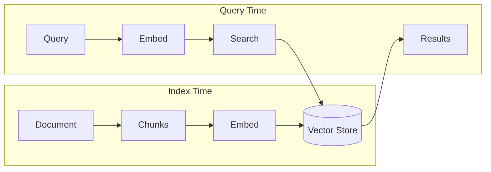

# Embeddings

## Introduction

Embeddings are numerical representations of text that capture semantic meaning. In RAG applications, they're the bridge between human-readable text and machine-searchable vectors—enabling your application to find relevant content based on meaning, not just keywords.

When a user asks "How do I deploy to production?", the embedding model converts this question into a vector. The system then finds documents with similar vectors, even if they use different words like "production deployment" or "releasing to live."

LlamaIndex supports a wide range of embedding models, from cloud APIs (OpenAI, Cohere) to local models (HuggingFace, ONNX), giving you flexibility in cost, speed, and privacy.

### What We'll Cover

- Understanding embeddings in LlamaIndex
- OpenAI embeddings (default)
- HuggingFace and local embeddings
- ONNX and OpenVINO optimization
- Custom embedding models
- Performance optimization strategies

### Prerequisites

- [Ingestion Pipeline](./04-ingestion-pipeline.md)
- Basic understanding of vector representations

---

## How Embeddings Work in LlamaIndex

Embeddings are used at two key moments:

1. **Index Time**: Document chunks are embedded and stored
2. **Query Time**: User queries are embedded for similarity search



The same embedding model must be used for both indexing and querying to ensure consistent vector representations.

---

## Setting Up Embeddings

### Global Configuration

Set a default embedding model for all operations:

```python
from llama_index.core import Settings
from llama_index.embeddings.openai import OpenAIEmbedding

# Set globally
Settings.embed_model = OpenAIEmbedding()
```

### Per-Index Configuration

Override for specific indices:

```python
from llama_index.core import VectorStoreIndex

index = VectorStoreIndex.from_documents(
    documents,
    embed_model=OpenAIEmbedding()
)
```

### In Ingestion Pipeline

Include as a transformation:

```python
from llama_index.core.ingestion import IngestionPipeline
from llama_index.embeddings.openai import OpenAIEmbedding

pipeline = IngestionPipeline(
    transformations=[
        SentenceSplitter(),
        OpenAIEmbedding(),  # Embeddings generated here
    ]
)
```

---

## OpenAI Embeddings

OpenAI provides high-quality embeddings through their API. This is the default in LlamaIndex.

### Installation

```bash
pip install llama-index-embeddings-openai
```

### Basic Usage

```python
from llama_index.embeddings.openai import OpenAIEmbedding

# Default model: text-embedding-ada-002
embed_model = OpenAIEmbedding()

# Generate embedding for a single text
embedding = embed_model.get_text_embedding("Hello, world!")
print(f"Embedding dimension: {len(embedding)}")
```

**Output:**
```
Embedding dimension: 1536
```

### Available Models

| Model | Dimensions | Cost | Best For |
|-------|-----------|------|----------|
| `text-embedding-3-small` | 1536 | $0.00002/1K tokens | General use, cost-effective |
| `text-embedding-3-large` | 3072 | $0.00013/1K tokens | Higher quality, larger datasets |
| `text-embedding-ada-002` | 1536 | $0.0001/1K tokens | Legacy, widely tested |

### Configuring Model

```python
embed_model = OpenAIEmbedding(
    model="text-embedding-3-small",
    dimensions=512,  # Optional: reduce dimensions
    api_key="sk-xxx"  # Optional: override env var
)
```

### Dimension Reduction

`text-embedding-3-*` models support native dimension reduction:

```python
# Reduce from 1536 to 512 dimensions (saves storage)
embed_model = OpenAIEmbedding(
    model="text-embedding-3-small",
    dimensions=512
)

embedding = embed_model.get_text_embedding("Sample text")
print(f"Reduced dimensions: {len(embedding)}")  # 512
```

### Batch Embedding

```python
texts = ["First document", "Second document", "Third document"]

# Embed multiple texts efficiently
embeddings = embed_model.get_text_embedding_batch(texts)
print(f"Generated {len(embeddings)} embeddings")
```

### Batch Size Configuration

```python
# Adjust batch size for rate limits
embed_model = OpenAIEmbedding(
    embed_batch_size=10  # Default is 10
)
```

---

## HuggingFace Embeddings

For cost savings and privacy, use local HuggingFace models.

### Installation

```bash
pip install llama-index-embeddings-huggingface
```

### Basic Usage

```python
from llama_index.embeddings.huggingface import HuggingFaceEmbedding

# Use a popular open model
embed_model = HuggingFaceEmbedding(
    model_name="BAAI/bge-small-en-v1.5"
)

embedding = embed_model.get_text_embedding("Hello, world!")
print(f"Embedding dimension: {len(embedding)}")
```

**Output:**
```
Embedding dimension: 384
```

### Popular Models

| Model | Dimensions | Size | Best For |
|-------|-----------|------|----------|
| `BAAI/bge-small-en-v1.5` | 384 | 33M | Fast, good quality |
| `BAAI/bge-base-en-v1.5` | 768 | 110M | Balanced |
| `BAAI/bge-large-en-v1.5` | 1024 | 335M | Best quality |
| `sentence-transformers/all-MiniLM-L6-v2` | 384 | 23M | Very fast |
| `sentence-transformers/all-mpnet-base-v2` | 768 | 110M | High quality |

### Set as Global Default

```python
from llama_index.core import Settings
from llama_index.embeddings.huggingface import HuggingFaceEmbedding

Settings.embed_model = HuggingFaceEmbedding(
    model_name="BAAI/bge-small-en-v1.5"
)
```

### GPU Acceleration

```python
embed_model = HuggingFaceEmbedding(
    model_name="BAAI/bge-base-en-v1.5",
    device="cuda"  # Use GPU
)
```

---

## ONNX and OpenVINO Optimization

For faster local inference, use optimized backends.

### ONNX (CPU and GPU)

```bash
pip install llama-index-embeddings-huggingface
pip install optimum[onnxruntime-gpu]  # GPU
# or
pip install optimum[onnxruntime]  # CPU only
```

```python
from llama_index.embeddings.huggingface import HuggingFaceEmbedding

embed_model = HuggingFaceEmbedding(
    model_name="BAAI/bge-small-en-v1.5",
    backend="onnx"
)
```

### OpenVINO (Intel CPUs)

```bash
pip install optimum-intel[openvino]
```

```python
embed_model = HuggingFaceEmbedding(
    model_name="BAAI/bge-small-en-v1.5",
    backend="openvino"
)
```

> **Note:** Models are automatically converted to ONNX/OpenVINO format on first use.

### Performance Comparison

| Backend | Speed (relative) | Best Hardware |
|---------|-----------------|---------------|
| PyTorch (default) | 1x | GPU |
| ONNX Runtime | 1.5-3x | CPU/GPU |
| OpenVINO | 2-4x | Intel CPUs |

---

## Ollama Embeddings

Run embeddings locally using Ollama.

### Installation

```bash
pip install llama-index-embeddings-ollama
```

### Setup Ollama

```bash
# Install Ollama
curl -fsSL https://ollama.ai/install.sh | sh

# Pull embedding model
ollama pull nomic-embed-text
```

### Usage

```python
from llama_index.embeddings.ollama import OllamaEmbedding

embed_model = OllamaEmbedding(
    model_name="nomic-embed-text",
    base_url="http://localhost:11434"
)

embedding = embed_model.get_text_embedding("Hello, world!")
```

---

## Other Providers

### Cohere

```bash
pip install llama-index-embeddings-cohere
```

```python
from llama_index.embeddings.cohere import CohereEmbedding

embed_model = CohereEmbedding(
    model_name="embed-english-v3.0",
    api_key="xxx",
    input_type="search_document"  # or "search_query"
)
```

### Voyage AI

```bash
pip install llama-index-embeddings-voyageai
```

```python
from llama_index.embeddings.voyageai import VoyageEmbedding

embed_model = VoyageEmbedding(
    model_name="voyage-2",
    voyage_api_key="xxx"
)
```

### Azure OpenAI

```bash
pip install llama-index-embeddings-azure-openai
```

```python
from llama_index.embeddings.azure_openai import AzureOpenAIEmbedding

embed_model = AzureOpenAIEmbedding(
    deployment_name="text-embedding-ada-002",
    api_key="xxx",
    azure_endpoint="https://xxx.openai.azure.com/",
    api_version="2024-02-15-preview"
)
```

---

## Custom Embedding Models

Create your own embedding class by extending `BaseEmbedding`:

```python
from typing import List
from llama_index.core.embeddings import BaseEmbedding
from pydantic import PrivateAttr

class CustomEmbedding(BaseEmbedding):
    """Custom embedding using an external API or model."""
    
    _model: any = PrivateAttr()
    
    def __init__(self, model_path: str, **kwargs):
        super().__init__(**kwargs)
        # Initialize your model here
        self._model = self._load_model(model_path)
    
    def _load_model(self, path: str):
        # Load your custom model
        import your_embedding_library
        return your_embedding_library.load(path)
    
    def _get_text_embedding(self, text: str) -> List[float]:
        """Get embedding for a single text."""
        return self._model.encode(text).tolist()
    
    def _get_query_embedding(self, query: str) -> List[float]:
        """Get embedding for a query (may differ from document embedding)."""
        return self._get_text_embedding(query)
    
    def _get_text_embeddings(self, texts: List[str]) -> List[List[float]]:
        """Get embeddings for multiple texts."""
        return [self._get_text_embedding(t) for t in texts]
    
    async def _aget_query_embedding(self, query: str) -> List[float]:
        """Async version of query embedding."""
        return self._get_query_embedding(query)
    
    async def _aget_text_embedding(self, text: str) -> List[float]:
        """Async version of text embedding."""
        return self._get_text_embedding(text)

# Usage
embed_model = CustomEmbedding(model_path="./my_model")
embedding = embed_model.get_text_embedding("Hello, world!")
```

---

## Standalone Usage

Use embedding models directly without building indices:

```python
from llama_index.embeddings.openai import OpenAIEmbedding

embed_model = OpenAIEmbedding()

# Single text
embedding = embed_model.get_text_embedding("Hello, world!")

# Multiple texts
embeddings = embed_model.get_text_embedding_batch([
    "First text",
    "Second text",
    "Third text"
])

# Query embedding (may use different processing)
query_embedding = embed_model.get_query_embedding("What is AI?")
```

### Computing Similarity

```python
import numpy as np

def cosine_similarity(a: list, b: list) -> float:
    """Compute cosine similarity between two vectors."""
    a = np.array(a)
    b = np.array(b)
    return np.dot(a, b) / (np.linalg.norm(a) * np.linalg.norm(b))

# Compare embeddings
text1 = "Machine learning is amazing"
text2 = "ML is fascinating"
text3 = "I love pizza"

emb1 = embed_model.get_text_embedding(text1)
emb2 = embed_model.get_text_embedding(text2)
emb3 = embed_model.get_text_embedding(text3)

print(f"Similarity (text1, text2): {cosine_similarity(emb1, emb2):.3f}")
print(f"Similarity (text1, text3): {cosine_similarity(emb1, emb3):.3f}")
```

**Output:**
```
Similarity (text1, text2): 0.892
Similarity (text1, text3): 0.421
```

---

## Optimization Strategies

### 1. Choose the Right Model

| Priority | Recommended Model |
|----------|------------------|
| **Quality** | OpenAI text-embedding-3-large |
| **Cost** | HuggingFace bge-small-en-v1.5 (free) |
| **Speed** | ONNX-optimized local model |
| **Privacy** | Local HuggingFace or Ollama |

### 2. Reduce Dimensions

If your vector store supports it:

```python
embed_model = OpenAIEmbedding(
    model="text-embedding-3-small",
    dimensions=256  # Reduce from 1536
)
```

### 3. Batch Processing

Always use batch methods for multiple texts:

```python
# ❌ Slow
embeddings = [embed_model.get_text_embedding(t) for t in texts]

# ✅ Fast
embeddings = embed_model.get_text_embedding_batch(texts)
```

### 4. Cache Embeddings

Use `IngestionPipeline` caching:

```python
pipeline = IngestionPipeline(
    transformations=[SentenceSplitter(), OpenAIEmbedding()],
    cache=cache  # Caches computed embeddings
)
```

### 5. Use Async for I/O-Bound Operations

```python
import asyncio

async def embed_many(texts):
    tasks = [embed_model.aget_text_embedding(t) for t in texts]
    return await asyncio.gather(*tasks)

embeddings = asyncio.run(embed_many(texts))
```

---

## Best Practices

| Practice | Description |
|----------|-------------|
| **Match index and query models** | Use the same model for indexing and querying |
| **Batch when possible** | Use `get_text_embedding_batch` for efficiency |
| **Consider dimension reduction** | Smaller dimensions = faster search, less storage |
| **Cache embeddings** | Use IngestionPipeline caching for repeated processing |
| **Monitor costs** | Track API usage for cloud embedding providers |

---

## Common Pitfalls

| ❌ Mistake | ✅ Solution |
|-----------|------------|
| Different models for index/query | Use the same embed_model for both |
| Embedding one text at a time | Use batch methods |
| Ignoring rate limits | Configure `embed_batch_size` appropriately |
| Not setting global default | Set `Settings.embed_model` for consistency |
| Using large models unnecessarily | Start with small models, scale up if needed |

---

## Hands-on Exercise

### Your Task

Compare different embedding models:
1. Create embeddings using OpenAI and HuggingFace
2. Compute similarity between semantically similar texts
3. Compute similarity between unrelated texts
4. Compare embedding dimensions and quality

### Requirements

1. Choose 3 test sentences (2 similar, 1 different)
2. Generate embeddings with both models
3. Compute and display cosine similarities
4. Compare dimensions

### Expected Result

```
OpenAI Embeddings (1536 dimensions):
  Similar pair: 0.89
  Different pair: 0.42

HuggingFace Embeddings (384 dimensions):
  Similar pair: 0.85
  Different pair: 0.38
```

<details>
<summary>💡 Hints</summary>

- Use `numpy` for cosine similarity
- OpenAI requires API key; HuggingFace works locally
- Check `len(embedding)` for dimensions

</details>

<details>
<summary>✅ Solution</summary>

```python
import numpy as np
from llama_index.embeddings.openai import OpenAIEmbedding
from llama_index.embeddings.huggingface import HuggingFaceEmbedding

def cosine_similarity(a, b):
    a, b = np.array(a), np.array(b)
    return np.dot(a, b) / (np.linalg.norm(a) * np.linalg.norm(b))

# Test sentences
text1 = "Machine learning is transforming industries"
text2 = "AI and ML are revolutionizing business"  # Similar
text3 = "I enjoy hiking in the mountains"  # Different

# OpenAI embeddings
openai_model = OpenAIEmbedding(model="text-embedding-3-small")
openai_embs = [openai_model.get_text_embedding(t) for t in [text1, text2, text3]]

print(f"OpenAI Embeddings ({len(openai_embs[0])} dimensions):")
print(f"  Similar pair: {cosine_similarity(openai_embs[0], openai_embs[1]):.2f}")
print(f"  Different pair: {cosine_similarity(openai_embs[0], openai_embs[2]):.2f}")

# HuggingFace embeddings
hf_model = HuggingFaceEmbedding(model_name="BAAI/bge-small-en-v1.5")
hf_embs = [hf_model.get_text_embedding(t) for t in [text1, text2, text3]]

print(f"\nHuggingFace Embeddings ({len(hf_embs[0])} dimensions):")
print(f"  Similar pair: {cosine_similarity(hf_embs[0], hf_embs[1]):.2f}")
print(f"  Different pair: {cosine_similarity(hf_embs[0], hf_embs[2]):.2f}")
```

</details>

---

## Summary

✅ Embeddings convert text to vectors for semantic similarity search

✅ **OpenAI** provides high-quality cloud embeddings (default in LlamaIndex)

✅ **HuggingFace** offers free, local alternatives like `bge-small-en-v1.5`

✅ **ONNX/OpenVINO** accelerate local inference by 2-4x

✅ Always use the same model for indexing and querying

✅ Batch processing and caching optimize performance

**Next:** [Vector Stores](./06-vector-stores.md)

---

## Further Reading

- [LlamaIndex Embeddings](https://developers.llamaindex.ai/python/framework/module_guides/models/embeddings/)
- [OpenAI Embeddings](https://platform.openai.com/docs/guides/embeddings)
- [Sentence Transformers](https://www.sbert.net/)
- [MTEB Leaderboard](https://huggingface.co/spaces/mteb/leaderboard) (embedding model benchmarks)

---

<!-- 
Sources Consulted:
- LlamaIndex Embeddings: https://developers.llamaindex.ai/python/framework/module_guides/models/embeddings/
- OpenAI Embeddings: https://platform.openai.com/docs/guides/embeddings
- HuggingFace Sentence Transformers: https://www.sbert.net/
-->
