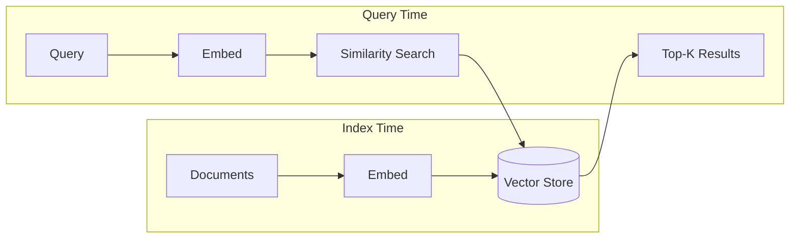
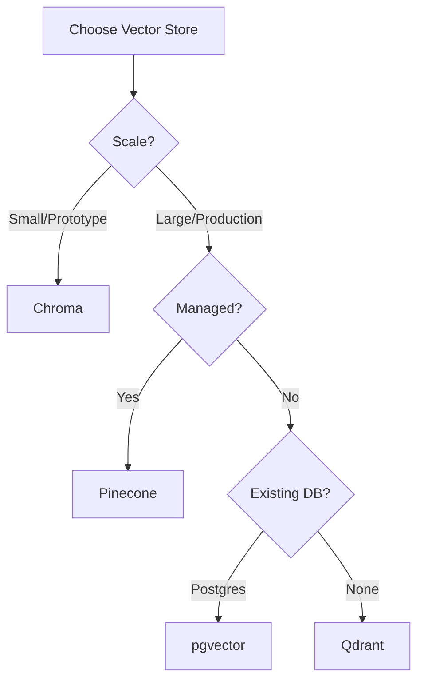

# Vector Stores

## Introduction

Vector stores are specialized databases optimized for storing and searching high-dimensional vectors. In RAG applications, they're the backbone of semantic search—enabling your application to find relevant documents based on meaning rather than exact keyword matches.

When a user asks a question, the query is embedded into a vector, and the vector store performs a similarity search to find the most relevant document chunks. The quality and speed of your RAG system depend heavily on your vector store choice.

LlamaIndex integrates with 40+ vector stores, from simple in-memory options for development to production-grade databases like Pinecone, Weaviate, and PostgreSQL.

### What We'll Cover

- Understanding vector stores in LlamaIndex
- In-memory storage (SimpleVectorStore)
- Popular managed services (Chroma, Pinecone, Weaviate)
- Self-hosted options (Qdrant, Milvus, PostgreSQL)
- Persistence and the StorageContext
- Integration with IngestionPipeline

### Prerequisites

- [Embeddings](./05-embeddings.md)
- Basic understanding of similarity search

---

## How Vector Stores Work

Vector stores accept embedded documents and enable efficient similarity search:



Key operations:
- **Add**: Insert vectors with metadata
- **Search**: Find similar vectors (k-nearest neighbors)
- **Filter**: Apply metadata filters to narrow results
- **Delete**: Remove vectors by ID or filter

---

## SimpleVectorStore (In-Memory)

The default vector store in LlamaIndex—perfect for development and small datasets.

### Basic Usage

```python
from llama_index.core import VectorStoreIndex, SimpleDirectoryReader

# Load documents
documents = SimpleDirectoryReader("./data").load_data()

# Create index (uses SimpleVectorStore by default)
index = VectorStoreIndex.from_documents(documents)

# Query
query_engine = index.as_query_engine()
response = query_engine.query("What is the main topic?")
print(response)
```

### Persistence

Save and load the index:

```python
# Save to disk
index.storage_context.persist(persist_dir="./storage")

# Load from disk
from llama_index.core import StorageContext, load_index_from_storage

storage_context = StorageContext.from_defaults(persist_dir="./storage")
index = load_index_from_storage(storage_context)
```

### Limitations

| Aspect | SimpleVectorStore |
|--------|-------------------|
| Scalability | ~100K vectors |
| Persistence | File-based |
| Filtering | Basic |
| Production Ready | Development only |

---

## Chroma

A popular open-source vector database with easy local setup.

### Installation

```bash
pip install llama-index-vector-stores-chroma chromadb
```

### Basic Usage

```python
import chromadb
from llama_index.core import VectorStoreIndex, SimpleDirectoryReader
from llama_index.vector_stores.chroma import ChromaVectorStore
from llama_index.core import StorageContext

# Create Chroma client (persistent)
chroma_client = chromadb.PersistentClient(path="./chroma_db")
chroma_collection = chroma_client.get_or_create_collection("my_collection")

# Create vector store
vector_store = ChromaVectorStore(chroma_collection=chroma_collection)
storage_context = StorageContext.from_defaults(vector_store=vector_store)

# Load documents
documents = SimpleDirectoryReader("./data").load_data()

# Create index
index = VectorStoreIndex.from_documents(
    documents,
    storage_context=storage_context
)

# Query
query_engine = index.as_query_engine()
response = query_engine.query("What is RAG?")
print(response)
```

### Reconnecting to Existing Index

```python
# Load existing collection
chroma_client = chromadb.PersistentClient(path="./chroma_db")
chroma_collection = chroma_client.get_collection("my_collection")
vector_store = ChromaVectorStore(chroma_collection=chroma_collection)

# Create index from existing store
index = VectorStoreIndex.from_vector_store(vector_store)
```

### Metadata Filtering

```python
from llama_index.core.vector_stores import MetadataFilter, MetadataFilters

# Query with filters
filters = MetadataFilters(
    filters=[
        MetadataFilter(key="source", value="api_docs"),
        MetadataFilter(key="year", value=2024, operator=">=")
    ]
)

query_engine = index.as_query_engine(filters=filters)
response = query_engine.query("What's new in the API?")
```

---

## Pinecone

A fully managed cloud vector database—ideal for production.

### Installation

```bash
pip install llama-index-vector-stores-pinecone pinecone-client
```

### Setup

```python
from pinecone import Pinecone, ServerlessSpec

# Initialize client
pc = Pinecone(api_key="your-api-key")

# Create index (run once)
pc.create_index(
    name="my-index",
    dimension=1536,  # Match your embedding dimensions
    metric="cosine",
    spec=ServerlessSpec(cloud="aws", region="us-east-1")
)
```

### Integration with LlamaIndex

```python
from llama_index.core import VectorStoreIndex, SimpleDirectoryReader
from llama_index.vector_stores.pinecone import PineconeVectorStore
from llama_index.core import StorageContext
from pinecone import Pinecone

# Connect to Pinecone
pc = Pinecone(api_key="your-api-key")
pinecone_index = pc.Index("my-index")

# Create vector store
vector_store = PineconeVectorStore(pinecone_index=pinecone_index)
storage_context = StorageContext.from_defaults(vector_store=vector_store)

# Load and index documents
documents = SimpleDirectoryReader("./data").load_data()
index = VectorStoreIndex.from_documents(
    documents,
    storage_context=storage_context
)

# Query
query_engine = index.as_query_engine()
response = query_engine.query("What is machine learning?")
```

### Namespaces

Organize data within a single index:

```python
vector_store = PineconeVectorStore(
    pinecone_index=pinecone_index,
    namespace="production"
)
```

---

## Weaviate

A powerful vector database with built-in ML capabilities.

### Installation

```bash
pip install llama-index-vector-stores-weaviate weaviate-client
```

### Setup (Local with Docker)

```bash
docker run -d -p 8080:8080 -p 50051:50051 semitechnologies/weaviate:latest
```

### Integration with LlamaIndex

```python
import weaviate
from llama_index.core import VectorStoreIndex, SimpleDirectoryReader
from llama_index.vector_stores.weaviate import WeaviateVectorStore
from llama_index.core import StorageContext

# Connect to Weaviate
client = weaviate.Client(url="http://localhost:8080")

# Create vector store
vector_store = WeaviateVectorStore(
    weaviate_client=client,
    index_name="MyDocuments"
)
storage_context = StorageContext.from_defaults(vector_store=vector_store)

# Load and index documents
documents = SimpleDirectoryReader("./data").load_data()
index = VectorStoreIndex.from_documents(
    documents,
    storage_context=storage_context
)
```

### Weaviate Cloud

```python
import weaviate
from weaviate.classes.init import Auth

client = weaviate.connect_to_weaviate_cloud(
    cluster_url="https://xxx.weaviate.cloud",
    auth_credentials=Auth.api_key("your-api-key")
)
```

---

## Qdrant

High-performance open-source vector database.

### Installation

```bash
pip install llama-index-vector-stores-qdrant qdrant-client
```

### Local Setup (Docker)

```bash
docker run -p 6333:6333 qdrant/qdrant
```

### Integration with LlamaIndex

```python
import qdrant_client
from llama_index.core import VectorStoreIndex, SimpleDirectoryReader
from llama_index.vector_stores.qdrant import QdrantVectorStore
from llama_index.core import StorageContext

# Connect to Qdrant
client = qdrant_client.QdrantClient(url="http://localhost:6333")

# Create vector store
vector_store = QdrantVectorStore(
    client=client,
    collection_name="my_collection"
)
storage_context = StorageContext.from_defaults(vector_store=vector_store)

# Load and index documents
documents = SimpleDirectoryReader("./data").load_data()
index = VectorStoreIndex.from_documents(
    documents,
    storage_context=storage_context
)
```

### In-Memory (Testing)

```python
client = qdrant_client.QdrantClient(":memory:")
```

---

## PostgreSQL with pgvector

Use your existing PostgreSQL database for vector storage.

### Installation

```bash
pip install llama-index-vector-stores-postgres psycopg2-binary
```

### Setup

Enable pgvector extension in PostgreSQL:

```sql
CREATE EXTENSION vector;
```

### Integration with LlamaIndex

```python
from llama_index.core import VectorStoreIndex, SimpleDirectoryReader
from llama_index.vector_stores.postgres import PGVectorStore
from llama_index.core import StorageContext

# Create vector store
vector_store = PGVectorStore.from_params(
    host="localhost",
    port="5432",
    database="mydb",
    user="user",
    password="password",
    table_name="embeddings",
    embed_dim=1536
)
storage_context = StorageContext.from_defaults(vector_store=vector_store)

# Load and index documents
documents = SimpleDirectoryReader("./data").load_data()
index = VectorStoreIndex.from_documents(
    documents,
    storage_context=storage_context
)
```

---

## StorageContext

The `StorageContext` combines all storage components:

```python
from llama_index.core import StorageContext

storage_context = StorageContext.from_defaults(
    vector_store=vector_store,      # For embeddings
    docstore=docstore,              # For documents
    index_store=index_store         # For index metadata
)

index = VectorStoreIndex.from_documents(
    documents,
    storage_context=storage_context
)
```

### Persisting All Components

```python
# Save everything
storage_context.persist(persist_dir="./storage")

# Load everything
storage_context = StorageContext.from_defaults(persist_dir="./storage")
index = load_index_from_storage(storage_context)
```

---

## IngestionPipeline with Vector Store

Direct pipeline-to-vector-store integration:

```python
from llama_index.core.ingestion import IngestionPipeline
from llama_index.core.node_parser import SentenceSplitter
from llama_index.embeddings.openai import OpenAIEmbedding
from llama_index.vector_stores.chroma import ChromaVectorStore
import chromadb

# Setup vector store
client = chromadb.PersistentClient("./chroma_db")
collection = client.get_or_create_collection("docs")
vector_store = ChromaVectorStore(chroma_collection=collection)

# Create pipeline
pipeline = IngestionPipeline(
    transformations=[
        SentenceSplitter(chunk_size=512, chunk_overlap=50),
        OpenAIEmbedding()
    ],
    vector_store=vector_store  # Nodes inserted automatically
)

# Run pipeline
nodes = pipeline.run(documents=documents)
print(f"Inserted {len(nodes)} nodes into vector store")
```

### Pipeline with Caching

```python
from llama_index.core.ingestion.cache import IngestionCache

pipeline = IngestionPipeline(
    transformations=[...],
    vector_store=vector_store,
    cache=IngestionCache()  # Skip already-processed documents
)
```

---

## Comparison of Vector Stores

| Feature | Chroma | Pinecone | Weaviate | Qdrant | pgvector |
|---------|--------|----------|----------|--------|----------|
| **Type** | Local/Cloud | Managed | Local/Cloud | Local/Cloud | Self-hosted |
| **Setup** | Easy | Easy | Medium | Easy | Medium |
| **Scalability** | Medium | High | High | High | Medium |
| **Cost** | Free/Paid | Paid | Free/Paid | Free/Paid | Free |
| **Filtering** | Good | Excellent | Excellent | Excellent | SQL-based |
| **Best For** | Prototypes | Production | ML workflows | Performance | Existing Postgres |

### Decision Guide



---

## Best Practices

| Practice | Description |
|----------|-------------|
| **Match dimensions** | Vector store dimension must match embedding model |
| **Use namespaces** | Organize different datasets in production |
| **Enable persistence** | Never rely on in-memory for production |
| **Configure filters** | Use metadata for efficient retrieval |
| **Monitor performance** | Track query latency and index size |

---

## Common Pitfalls

| ❌ Mistake | ✅ Solution |
|-----------|------------|
| Dimension mismatch | Verify embedding dimensions match vector store |
| No persistence for production | Always use persistent storage |
| Missing index recreation | Use `from_vector_store()` to reload |
| Ignoring metadata | Store metadata for filtering |
| Not batching inserts | Use IngestionPipeline for bulk operations |

---

## Hands-on Exercise

### Your Task

Build a document search system with persistent storage:
1. Set up Chroma with persistence
2. Load and index sample documents
3. Query the index
4. Restart the program and reload from persistence
5. Verify queries still work

### Requirements

1. Create `./chroma_db` directory for persistence
2. Index at least 3 documents with metadata
3. Implement search with metadata filtering
4. Demonstrate persistence by reloading

### Expected Result

```
First run:
  Indexed 3 documents
  Query result: "RAG combines retrieval with generation..."

Second run (reload):
  Loaded existing index
  Query result: "RAG combines retrieval with generation..."
```

<details>
<summary>💡 Hints</summary>

- Use `chromadb.PersistentClient("./chroma_db")`
- Use `get_or_create_collection` for idempotent collection creation
- Use `VectorStoreIndex.from_vector_store()` to reload

</details>

<details>
<summary>✅ Solution</summary>

```python
import chromadb
from llama_index.core import VectorStoreIndex, Document
from llama_index.vector_stores.chroma import ChromaVectorStore
from llama_index.core import StorageContext

def setup_vector_store():
    """Create or connect to persistent Chroma store."""
    client = chromadb.PersistentClient(path="./chroma_db")
    collection = client.get_or_create_collection("my_docs")
    return ChromaVectorStore(chroma_collection=collection)

def index_documents(vector_store):
    """Index sample documents with metadata."""
    documents = [
        Document(
            text="RAG combines retrieval with generation to improve LLM accuracy.",
            metadata={"topic": "rag", "year": 2024}
        ),
        Document(
            text="Vector databases store high-dimensional embeddings for similarity search.",
            metadata={"topic": "vector_db", "year": 2024}
        ),
        Document(
            text="LlamaIndex provides a unified interface for building RAG applications.",
            metadata={"topic": "llamaindex", "year": 2024}
        )
    ]
    
    storage_context = StorageContext.from_defaults(vector_store=vector_store)
    index = VectorStoreIndex.from_documents(
        documents,
        storage_context=storage_context
    )
    print(f"Indexed {len(documents)} documents")
    return index

def load_existing_index(vector_store):
    """Load index from existing vector store."""
    index = VectorStoreIndex.from_vector_store(vector_store)
    print("Loaded existing index")
    return index

def query_index(index, query):
    """Query the index."""
    query_engine = index.as_query_engine()
    response = query_engine.query(query)
    return response

# Main execution
vector_store = setup_vector_store()

# Check if collection has documents
if vector_store._collection.count() == 0:
    print("First run - indexing documents")
    index = index_documents(vector_store)
else:
    print("Second run - loading from persistence")
    index = load_existing_index(vector_store)

# Query
response = query_index(index, "What is RAG?")
print(f"Query result: {response}")
```

</details>

---

## Summary

✅ **Vector stores** enable semantic similarity search for RAG applications

✅ **SimpleVectorStore** is great for development; use production stores for scale

✅ **Chroma** offers easy local setup; **Pinecone** provides managed production hosting

✅ **StorageContext** combines vector store, docstore, and index store

✅ **IngestionPipeline** can write directly to vector stores with caching

✅ Always **match dimensions** between embedding model and vector store

**Next:** [LlamaIndex Query Engine](../10-llamaindex-query-engine/00-query-engine-overview.md)

---

## Further Reading

- [LlamaIndex Vector Stores](https://developers.llamaindex.ai/python/framework/module_guides/storing/vector_stores/)
- [Chroma Documentation](https://docs.trychroma.com/)
- [Pinecone Documentation](https://docs.pinecone.io/)
- [Qdrant Documentation](https://qdrant.tech/documentation/)
- [pgvector GitHub](https://github.com/pgvector/pgvector)

---

<!-- 
Sources Consulted:
- LlamaIndex Vector Stores: https://developers.llamaindex.ai/python/framework/module_guides/storing/vector_stores/
- Chroma docs: https://docs.trychroma.com/
- Pinecone docs: https://docs.pinecone.io/
- Qdrant docs: https://qdrant.tech/documentation/
-->
