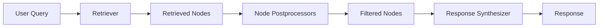

# Query Engines

## Introduction

Query engines are the heart of any LlamaIndex application. They provide the interface between user questions and your indexed data—taking natural language queries, retrieving relevant context, and synthesizing intelligent responses.

Think of a query engine as a smart librarian: when you ask a question, it knows exactly which books to pull from the shelves, which pages to reference, and how to summarize the information into a coherent answer.

This lesson covers everything from basic query engine usage to advanced patterns like routing, composition, and chat-based interactions.

### What We'll Cover

- Query engine basics and configuration
- Response synthesis modes
- Retriever customization
- Routing and query composition
- Chat engines for conversations
- Advanced query techniques

### Prerequisites

- [LlamaIndex Data Ingestion](../09-llamaindex-data-ingestion/00-data-ingestion-overview.md)
- Understanding of indices and embeddings

---

## The Query Pipeline

When you call `query()` on a query engine, a sophisticated pipeline executes:



1. **Retriever**: Finds relevant document chunks from the index
2. **Node Postprocessors**: Filter, rerank, or transform retrieved nodes
3. **Response Synthesizer**: Generates the final answer using an LLM

Each component is configurable, giving you fine-grained control over query behavior.

---

## Quick Start

The simplest way to create a query engine:

```python
from llama_index.core import VectorStoreIndex, SimpleDirectoryReader

# Load documents and create index
documents = SimpleDirectoryReader("./data").load_data()
index = VectorStoreIndex.from_documents(documents)

# Create query engine
query_engine = index.as_query_engine()

# Ask a question
response = query_engine.query("What is the main topic of these documents?")
print(response)
```

**Output:**
```
The documents primarily discuss machine learning fundamentals...
```

---

## Query Engine vs Chat Engine

LlamaIndex provides two high-level interfaces:

| Feature | Query Engine | Chat Engine |
|---------|--------------|-------------|
| **Purpose** | Single question/answer | Multi-turn conversation |
| **Memory** | Stateless | Maintains chat history |
| **Context** | Per-query retrieval | Conversation-aware retrieval |
| **Best For** | Search, Q&A | Chatbots, assistants |

```python
# Query Engine - stateless
query_engine = index.as_query_engine()
response = query_engine.query("What is RAG?")

# Chat Engine - stateful
chat_engine = index.as_chat_engine()
response = chat_engine.chat("What is RAG?")
response = chat_engine.chat("Can you give an example?")  # Remembers context
```

---

## Lesson Roadmap

| Lesson | Topic | Description |
|--------|-------|-------------|
| [01](./01-query-engine-basics.md) | Query Engine Basics | `as_query_engine()`, configuration, streaming |
| [02](./02-response-synthesis.md) | Response Synthesis | Response modes: compact, refine, tree_summarize |
| [03](./03-retrievers.md) | Retrievers | Retriever types, similarity_top_k, hybrid search |
| [04](./04-routing-composition.md) | Routing & Composition | RouterQueryEngine, SubQuestionQueryEngine |
| [05](./05-chat-engines.md) | Chat Engines | `as_chat_engine()`, chat modes, memory |
| [06](./06-advanced-queries.md) | Advanced Queries | Query transformations, HyDE, multi-step |

---

## Key Concepts

### Response Modes

How the LLM generates answers from retrieved chunks:

| Mode | Description | Best For |
|------|-------------|----------|
| `compact` | Concatenate chunks, minimize LLM calls | General use (default) |
| `refine` | Iteratively refine answer per chunk | Detailed answers |
| `tree_summarize` | Recursively summarize chunks | Summarization |
| `simple_summarize` | Truncate to single prompt | Quick summaries |
| `no_text` | Return nodes only, no LLM | Debugging/retrieval only |

### Retrieval Parameters

| Parameter | Description | Default |
|-----------|-------------|---------|
| `similarity_top_k` | Number of chunks to retrieve | 2 |
| `filters` | Metadata filters | None |
| `node_postprocessors` | Post-retrieval processing | None |

---

## Common Patterns

### Basic Q&A

```python
query_engine = index.as_query_engine(
    similarity_top_k=3,
    response_mode="compact"
)
```

### Summarization

```python
query_engine = index.as_query_engine(
    response_mode="tree_summarize"
)
```

### High-Quality Answers

```python
query_engine = index.as_query_engine(
    similarity_top_k=5,
    response_mode="refine",
    node_postprocessors=[reranker]
)
```

### Streaming Responses

```python
query_engine = index.as_query_engine(streaming=True)
response = query_engine.query("Explain this topic")
response.print_response_stream()
```

---

## Summary

✅ Query engines provide the interface between questions and indexed data

✅ The pipeline: Retriever → Postprocessors → Response Synthesizer

✅ Query engines are stateless; chat engines maintain conversation history

✅ Response modes control how answers are generated from chunks

✅ Configuration options allow fine-tuning for different use cases

**Next:** [Query Engine Basics](./01-query-engine-basics.md)

---

## Further Reading

- [LlamaIndex Query Engine](https://developers.llamaindex.ai/python/framework/module_guides/deploying/query_engine/)
- [Chat Engine Guide](https://developers.llamaindex.ai/python/framework/module_guides/deploying/chat_engines/)
- [Response Synthesizers](https://developers.llamaindex.ai/python/framework/module_guides/querying/response_synthesizers/)

---

<!-- 
Sources Consulted:
- LlamaIndex Query Engine: https://developers.llamaindex.ai/python/framework/module_guides/deploying/query_engine/
- LlamaIndex Response Synthesizers: https://developers.llamaindex.ai/python/framework/module_guides/querying/response_synthesizers/
- LlamaIndex Chat Engines: https://developers.llamaindex.ai/python/framework/module_guides/deploying/chat_engines/
-->
