# Query Engine Basics

## Introduction

The query engine is your primary interface for asking questions about your data. With a single line of code, you can transform an index into a powerful question-answering system that retrieves relevant context and generates intelligent responses.

In this lesson, we'll explore how to create, configure, and customize query engines for different use cases—from simple Q&A to streaming responses and detailed answer generation.

### What We'll Cover

- Creating query engines with `as_query_engine()`
- Configuration options and parameters
- Response modes for different use cases
- Streaming query responses
- Error handling and debugging

### Prerequisites

- [Query Engines Overview](./00-query-engines-overview.md)
- Basic LlamaIndex index creation

---

## Creating a Query Engine

The simplest way to create a query engine is from an index:

```python
from llama_index.core import VectorStoreIndex, SimpleDirectoryReader

# Load documents
documents = SimpleDirectoryReader("./data").load_data()

# Create index
index = VectorStoreIndex.from_documents(documents)

# Create query engine
query_engine = index.as_query_engine()

# Query
response = query_engine.query("What are the main topics covered?")
print(response)
```

**Output:**
```
The documents cover three main topics: machine learning basics, 
neural network architectures, and practical implementation strategies...
```

---

## Configuration Options

The `as_query_engine()` method accepts numerous configuration parameters:

```python
query_engine = index.as_query_engine(
    # Retrieval settings
    similarity_top_k=3,
    
    # Response settings
    response_mode="compact",
    
    # Streaming
    streaming=False,
    
    # Node postprocessors
    node_postprocessors=[],
    
    # Verbose output
    verbose=True
)
```

### Key Parameters

| Parameter | Type | Description | Default |
|-----------|------|-------------|---------|
| `similarity_top_k` | int | Number of chunks to retrieve | 2 |
| `response_mode` | str | How to synthesize response | "compact" |
| `streaming` | bool | Enable streaming output | False |
| `node_postprocessors` | list | Post-retrieval processors | [] |
| `verbose` | bool | Print debug information | False |

---

## Response Modes

Response modes control how the LLM synthesizes an answer from retrieved chunks:

### Compact (Default)

Concatenates chunks to minimize LLM calls while staying within context limits:

```python
query_engine = index.as_query_engine(
    response_mode="compact"
)
```

**How it works:**
1. Concatenate as many chunks as fit in context window
2. If too long, split into parts
3. Process each part, then refine

### Refine

Iteratively builds and refines the answer through each chunk:

```python
query_engine = index.as_query_engine(
    response_mode="refine"
)
```

**How it works:**
1. Generate initial answer from first chunk
2. Refine answer using each subsequent chunk
3. More LLM calls, but more thorough

**Best for:** Detailed, comprehensive answers

### Tree Summarize

Recursively summarizes chunks in a tree structure:

```python
query_engine = index.as_query_engine(
    response_mode="tree_summarize"
)
```

**How it works:**
1. Summarize groups of chunks
2. Summarize the summaries
3. Repeat until one final summary

**Best for:** Summarization tasks

### Simple Summarize

Truncates all chunks to fit in one prompt:

```python
query_engine = index.as_query_engine(
    response_mode="simple_summarize"
)
```

**Best for:** Quick summaries when detail isn't critical

### No Text

Returns retrieved nodes without LLM processing:

```python
query_engine = index.as_query_engine(
    response_mode="no_text"
)

response = query_engine.query("What is RAG?")
# Access nodes directly
for node in response.source_nodes:
    print(node.text[:200])
```

**Best for:** Debugging, custom processing

### Accumulate

Runs the query against each chunk separately:

```python
query_engine = index.as_query_engine(
    response_mode="accumulate"
)
```

**Best for:** When you need answers from each chunk independently

---

## Response Mode Comparison

```mermaid
flowchart TD
    subgraph "compact"
        C1[Chunks] --> C2[Concatenate]
        C2 --> C3[Single LLM Call]
        C3 --> C4[Response]
    end
    
    subgraph "refine"
        R1[Chunk 1] --> R2[Initial Answer]
        R2 --> R3[Chunk 2 + Answer]
        R3 --> R4[Refined Answer]
        R4 --> R5[Chunk N + Answer]
        R5 --> R6[Final Response]
    end
    
    subgraph "tree_summarize"
        T1[Chunks] --> T2[Summaries]
        T2 --> T3[Meta-Summaries]
        T3 --> T4[Final Summary]
    end
```



| Mode | LLM Calls | Speed | Detail Level |
|------|-----------|-------|--------------|
| `compact` | Few | Fast | Good |
| `refine` | Many | Slow | High |
| `tree_summarize` | Medium | Medium | Good for summaries |
| `simple_summarize` | 1 | Fastest | May lose detail |
| `accumulate` | Per chunk | Slow | Per-chunk answers |

---

## Streaming Responses

Enable streaming to receive tokens as they're generated:

```python
# Enable streaming
query_engine = index.as_query_engine(streaming=True)

# Query returns StreamingResponse
streaming_response = query_engine.query(
    "Explain machine learning in detail"
)

# Print as tokens arrive
streaming_response.print_response_stream()
```

### Manual Token Processing

```python
streaming_response = query_engine.query("Explain this concept")

# Iterate over tokens
for text in streaming_response.response_gen:
    print(text, end="", flush=True)
```

### Streaming with Response Metadata

```python
streaming_response = query_engine.query("What is RAG?")

# Consume generator to get full response
full_response = ""
for text in streaming_response.response_gen:
    full_response += text
    
# Now access metadata
print(f"\nSources: {len(streaming_response.source_nodes)}")
```

> **Note:** Source nodes are available after consuming the generator.

---

## Accessing Response Data

The response object contains rich information:

```python
response = query_engine.query("What is the main topic?")

# The generated answer
print(response.response)

# Source nodes (retrieved chunks)
for node in response.source_nodes:
    print(f"Score: {node.score:.3f}")
    print(f"Text: {node.text[:100]}...")
    print(f"Metadata: {node.metadata}")
    print("---")

# Response metadata
print(response.metadata)
```

**Output:**
```
The main topic is artificial intelligence and its applications...

Score: 0.856
Text: Artificial intelligence (AI) refers to the simulation of human intelligence...
Metadata: {'file_name': 'intro.md', 'page': 1}
---
Score: 0.823
Text: AI applications span many industries including healthcare, finance...
Metadata: {'file_name': 'applications.md', 'page': 1}
---
```

---

## Low-Level Composition

For more control, compose query engines from individual components:

```python
from llama_index.core import VectorStoreIndex, get_response_synthesizer
from llama_index.core.retrievers import VectorIndexRetriever
from llama_index.core.query_engine import RetrieverQueryEngine
from llama_index.core.postprocessor import SimilarityPostprocessor

# Build index
index = VectorStoreIndex.from_documents(documents)

# Configure retriever
retriever = VectorIndexRetriever(
    index=index,
    similarity_top_k=5,
)

# Configure response synthesizer
response_synthesizer = get_response_synthesizer(
    response_mode="refine",
)

# Configure postprocessor
postprocessor = SimilarityPostprocessor(similarity_cutoff=0.7)

# Assemble query engine
query_engine = RetrieverQueryEngine(
    retriever=retriever,
    response_synthesizer=response_synthesizer,
    node_postprocessors=[postprocessor],
)

# Query
response = query_engine.query("What is the main topic?")
```

This approach gives you:
- Custom retriever configuration
- Custom response synthesis
- Multiple postprocessors
- Full control over the pipeline

---

## Custom Query Engines

Create completely custom query engines:

```python
from llama_index.core.query_engine import CustomQueryEngine
from llama_index.core.retrievers import BaseRetriever
from llama_index.core.response_synthesizers import BaseSynthesizer
from llama_index.core import get_response_synthesizer

class RAGQueryEngine(CustomQueryEngine):
    """Custom RAG query engine with logging."""
    
    retriever: BaseRetriever
    response_synthesizer: BaseSynthesizer
    
    def custom_query(self, query_str: str):
        # Retrieve nodes
        nodes = self.retriever.retrieve(query_str)
        print(f"Retrieved {len(nodes)} nodes")
        
        # Log scores
        for i, node in enumerate(nodes):
            print(f"  Node {i+1}: score={node.score:.3f}")
        
        # Synthesize response
        response = self.response_synthesizer.synthesize(
            query_str, nodes
        )
        
        return response

# Usage
retriever = index.as_retriever(similarity_top_k=3)
synthesizer = get_response_synthesizer(response_mode="compact")

query_engine = RAGQueryEngine(
    retriever=retriever,
    response_synthesizer=synthesizer
)

response = query_engine.query("Explain the main concepts")
```

---

## Adjusting Retrieval Count

The `similarity_top_k` parameter controls how many chunks are retrieved:

```python
# Few chunks - faster, may miss context
query_engine = index.as_query_engine(similarity_top_k=2)

# More chunks - slower, more comprehensive
query_engine = index.as_query_engine(similarity_top_k=10)
```

### Guidelines

| Use Case | Recommended top_k |
|----------|-------------------|
| Quick answers | 2-3 |
| General Q&A | 3-5 |
| Research/detailed | 5-10 |
| Summarization | 10-20 |

> **Note:** More chunks = more context = higher LLM costs

---

## Error Handling

Handle common query errors gracefully:

```python
from llama_index.core.response.schema import Response

def safe_query(query_engine, query: str) -> str:
    try:
        response = query_engine.query(query)
        
        if not response.response:
            return "No answer could be generated."
        
        if not response.source_nodes:
            return "Answer generated but no sources found."
            
        return response.response
        
    except Exception as e:
        return f"Query failed: {str(e)}"

# Usage
result = safe_query(query_engine, "What is RAG?")
print(result)
```

### Common Issues

| Issue | Cause | Solution |
|-------|-------|----------|
| Empty response | No relevant chunks | Increase `similarity_top_k` |
| Hallucination | Too few sources | Add more documents, lower temperature |
| Slow queries | Large top_k, refine mode | Use compact mode, reduce top_k |
| Rate limits | Too many LLM calls | Use compact mode, add delays |

---

## Best Practices

| Practice | Description |
|----------|-------------|
| **Start with defaults** | Use `compact` mode and `top_k=2` initially |
| **Tune incrementally** | Adjust one parameter at a time |
| **Use streaming for UX** | Better user experience for long answers |
| **Check source nodes** | Verify retrieved context is relevant |
| **Log during development** | Use `verbose=True` to debug |

---

## Common Pitfalls

| ❌ Mistake | ✅ Solution |
|-----------|------------|
| Always using `refine` | Use `compact` for most cases |
| Very high top_k | Start low, increase if needed |
| Ignoring source nodes | Always verify retrieval quality |
| No error handling | Wrap queries in try/except |
| Not testing response modes | Try different modes for your use case |

---

## Hands-on Exercise

### Your Task

Create a query engine with different configurations and compare results:
1. Create an index from sample documents
2. Test `compact` vs `refine` response modes
3. Compare different `similarity_top_k` values
4. Enable streaming and process tokens

### Requirements

1. Create 3+ sample documents
2. Query with at least 2 different response modes
3. Compare retrieval with top_k=2 vs top_k=5
4. Implement streaming response

### Expected Result

```
Compact Mode (top_k=2):
  Response length: 150 words
  Sources: 2
  
Refine Mode (top_k=5):
  Response length: 280 words
  Sources: 5
  
Streaming output: [tokens appear incrementally]
```

<details>
<summary>💡 Hints</summary>

- Create documents using `Document(text="...")`
- Compare response lengths with `len(response.response.split())`
- Use `streaming_response.print_response_stream()` for streaming

</details>

<details>
<summary>✅ Solution</summary>

```python
from llama_index.core import VectorStoreIndex, Document

# Create sample documents
documents = [
    Document(text="""
    Machine learning is a subset of artificial intelligence that enables 
    systems to learn from data. It uses algorithms to identify patterns 
    and make decisions with minimal human intervention.
    """),
    Document(text="""
    Deep learning is a type of machine learning based on neural networks.
    These networks have multiple layers that learn increasingly abstract
    representations of the data.
    """),
    Document(text="""
    Natural language processing (NLP) allows computers to understand,
    interpret, and generate human language. Modern NLP relies heavily
    on transformer architectures and large language models.
    """),
]

# Create index
index = VectorStoreIndex.from_documents(documents)

# Test 1: Compact mode with top_k=2
print("=== Compact Mode (top_k=2) ===")
qe_compact = index.as_query_engine(
    response_mode="compact",
    similarity_top_k=2
)
response = qe_compact.query("What is machine learning?")
print(f"Response: {response.response[:200]}...")
print(f"Word count: {len(response.response.split())}")
print(f"Sources: {len(response.source_nodes)}")

# Test 2: Refine mode with top_k=5
print("\n=== Refine Mode (top_k=5) ===")
qe_refine = index.as_query_engine(
    response_mode="refine",
    similarity_top_k=5
)
response = qe_refine.query("What is machine learning?")
print(f"Response: {response.response[:200]}...")
print(f"Word count: {len(response.response.split())}")
print(f"Sources: {len(response.source_nodes)}")

# Test 3: Streaming
print("\n=== Streaming ===")
qe_stream = index.as_query_engine(streaming=True)
streaming_response = qe_stream.query("Explain NLP briefly")
streaming_response.print_response_stream()
```

</details>

---

## Summary

✅ Use `index.as_query_engine()` for quick setup

✅ **Response modes** control answer synthesis: compact, refine, tree_summarize

✅ **similarity_top_k** controls how many chunks are retrieved

✅ **Streaming** enables real-time token output for better UX

✅ **Low-level composition** provides full control over the pipeline

✅ Always access **source_nodes** to verify retrieval quality

**Next:** [Response Synthesis](./02-response-synthesis.md)

---

## Further Reading

- [LlamaIndex Query Engine Usage](https://developers.llamaindex.ai/python/framework/module_guides/deploying/query_engine/usage_pattern/)
- [Response Modes](https://developers.llamaindex.ai/python/framework/module_guides/deploying/query_engine/response_modes/)
- [Streaming Guide](https://developers.llamaindex.ai/python/framework/module_guides/deploying/query_engine/streaming/)

---

<!-- 
Sources Consulted:
- LlamaIndex Query Engine: https://developers.llamaindex.ai/python/framework/module_guides/deploying/query_engine/usage_pattern/
- Response Modes: https://developers.llamaindex.ai/python/framework/module_guides/deploying/query_engine/response_modes/
- Streaming: https://developers.llamaindex.ai/python/framework/module_guides/deploying/query_engine/streaming/
-->
