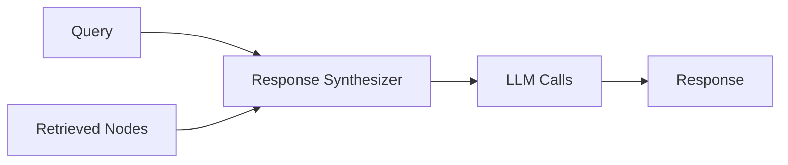
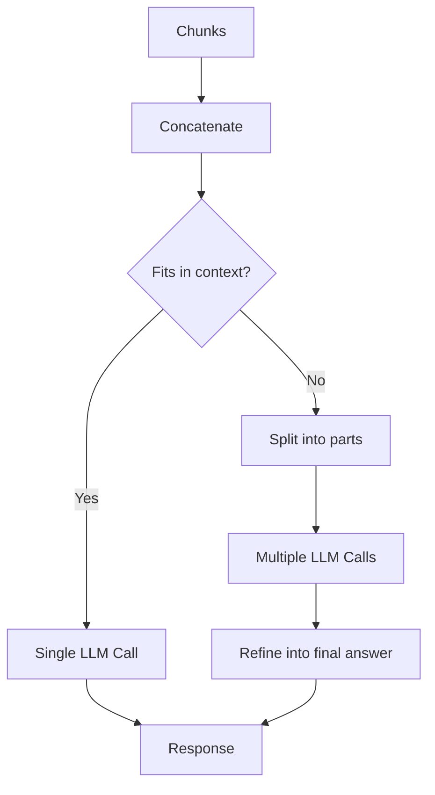
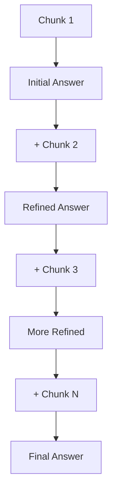
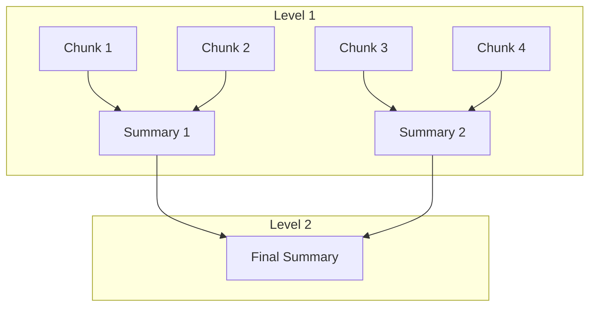

# Response Synthesis

## Introduction

Response synthesis is the process of generating coherent answers from retrieved document chunks. It's the final step in the RAG pipeline—where the LLM transforms raw context into a meaningful response to the user's question.

LlamaIndex provides multiple response synthesis strategies, each with different trade-offs between speed, cost, and answer quality. Understanding these options helps you choose the right approach for your use case.

### What We'll Cover

- Response synthesizer fundamentals
- Built-in response modes in depth
- Custom response synthesizers
- Prompt customization
- Structured answer filtering
- Handling source nodes

### Prerequisites

- [Query Engine Basics](./01-query-engine-basics.md)
- Understanding of LLM prompts

---

## How Response Synthesis Works

After retrieval, the response synthesizer takes:
1. The user's query
2. A list of retrieved text chunks (nodes)

And produces a coherent answer:



The synthesizer handles:
- Prompt construction
- Context window management
- Multi-step LLM calls (if needed)
- Response formatting

---

## Using Response Synthesizers

### Via Query Engine (High-Level)

```python
from llama_index.core import VectorStoreIndex

index = VectorStoreIndex.from_documents(documents)

# Set response mode directly
query_engine = index.as_query_engine(
    response_mode="tree_summarize"
)

response = query_engine.query("Summarize the main points")
```

### Standalone Usage

```python
from llama_index.core import get_response_synthesizer
from llama_index.core.schema import NodeWithScore, TextNode

# Create synthesizer
response_synthesizer = get_response_synthesizer(
    response_mode="compact"
)

# Create nodes manually
nodes = [
    NodeWithScore(node=TextNode(text="First chunk of text"), score=0.9),
    NodeWithScore(node=TextNode(text="Second chunk of text"), score=0.85),
]

# Synthesize response
response = response_synthesizer.synthesize(
    "What is the main topic?",
    nodes=nodes
)

print(response.response)
```

---

## Response Modes Deep Dive

### Compact Mode (Default)

The default mode balances quality and efficiency:

```python
response_synthesizer = get_response_synthesizer(
    response_mode="compact"
)
```

**Algorithm:**
1. Concatenate chunks until they fill the context window
2. If text exceeds limits, split into parts
3. Query each part using `text_qa_template`
4. If multiple parts, refine answers together



**Pros:** Fewer LLM calls, cost-effective
**Cons:** May lose nuance in very long contexts

### Refine Mode

Iteratively builds the answer through each chunk:

```python
response_synthesizer = get_response_synthesizer(
    response_mode="refine"
)
```

**Algorithm:**
1. Generate initial answer from first chunk using `text_qa_template`
2. For each subsequent chunk:
   - Pass current answer + new chunk to `refine_template`
   - Update answer with refined version
3. Return final refined answer



**Pros:** Thorough, considers all context
**Cons:** More LLM calls, slower, higher cost

### Tree Summarize

Recursively summarizes in a tree structure:

```python
response_synthesizer = get_response_synthesizer(
    response_mode="tree_summarize"
)
```

**Algorithm:**
1. Group chunks and summarize each group
2. Take summaries and group/summarize again
3. Repeat until single summary remains



**Pros:** Great for summarization, handles many chunks
**Cons:** May lose specific details

### Simple Summarize

Truncates to fit in one prompt:

```python
response_synthesizer = get_response_synthesizer(
    response_mode="simple_summarize"
)
```

**Pros:** Fast, single LLM call
**Cons:** Loses information beyond context window

### No Text

Returns retrieved nodes without LLM:

```python
response_synthesizer = get_response_synthesizer(
    response_mode="no_text"
)

response = response_synthesizer.synthesize("query", nodes=nodes)
# response.response is empty
# Access nodes via response.source_nodes
```

**Use case:** Custom processing, debugging

### Accumulate

Runs query against each chunk separately:

```python
response_synthesizer = get_response_synthesizer(
    response_mode="accumulate"
)
```

**Result:** Concatenated responses from each chunk

### Compact Accumulate

Like accumulate, but compacts chunks first:

```python
response_synthesizer = get_response_synthesizer(
    response_mode="compact_accumulate"
)
```

---

## Response Mode Comparison

| Mode | LLM Calls | Speed | Detail | Cost | Best For |
|------|-----------|-------|--------|------|----------|
| `compact` | 1-3 | Fast | Good | Low | General Q&A |
| `refine` | Per chunk | Slow | High | High | Detailed analysis |
| `tree_summarize` | O(log n) | Medium | Good | Medium | Summarization |
| `simple_summarize` | 1 | Fastest | Limited | Lowest | Quick answers |
| `no_text` | 0 | Instant | None | None | Debugging |
| `accumulate` | Per chunk | Slow | Per-chunk | High | Multi-perspective |

---

## Custom Prompts

Override default prompts for custom behavior:

```python
from llama_index.core import PromptTemplate

# Custom QA prompt
custom_qa_prompt = PromptTemplate(
    """\
Context information is below.
---------------------
{context_str}
---------------------
Given the context above, please answer the following question.
Provide specific examples where possible.
If the answer is not in the context, say "I don't have that information."

Question: {query_str}
Answer: """
)

# Custom refine prompt
custom_refine_prompt = PromptTemplate(
    """\
The original question is: {query_str}
We have an existing answer: {existing_answer}

We have new context below:
---------------------
{context_str}
---------------------

Given the new context, refine the original answer.
If the new context isn't useful, return the original answer.

Refined Answer: """
)

response_synthesizer = get_response_synthesizer(
    response_mode="refine",
    text_qa_template=custom_qa_prompt,
    refine_template=custom_refine_prompt,
)
```

### Using Extra Variables in Prompts

```python
from llama_index.core.response_synthesizers import TreeSummarize

# Template with custom variable
custom_template = PromptTemplate(
    """\
Context: {context_str}

Please answer in the style of {tone_name}.

Question: {query_str}
Answer: """
)

summarizer = TreeSummarize(
    summary_template=custom_template,
    verbose=True
)

# Pass extra variable at query time
response = summarizer.get_response(
    "What are the key points?",
    [text_chunk],
    tone_name="a friendly teacher"
)
```

---

## Structured Answer Filtering

Filter out irrelevant chunks during synthesis:

```python
response_synthesizer = get_response_synthesizer(
    response_mode="compact",
    structured_answer_filtering=True
)
```

**How it works:**
- Uses function calling to determine if a chunk is relevant
- Filters out irrelevant chunks before synthesis
- Works best with models that support function calling (OpenAI)

**Benefits:**
- Reduces noise in responses
- Improves answer quality
- Prevents hallucination from irrelevant context

---

## Handling Source Nodes

Access source information in responses:

```python
response = query_engine.query("What is RAG?")

# The answer
print("Answer:", response.response)

# Source nodes
print(f"\nSources ({len(response.source_nodes)}):")
for i, node in enumerate(response.source_nodes, 1):
    print(f"\n--- Source {i} ---")
    print(f"Score: {node.score:.3f}")
    print(f"Text: {node.text[:150]}...")
    
    # Metadata
    if node.metadata:
        print(f"File: {node.metadata.get('file_name', 'N/A')}")
```

### Adding Source Citations

```python
def format_with_citations(response):
    """Format response with source citations."""
    answer = response.response
    citations = []
    
    for i, node in enumerate(response.source_nodes, 1):
        source = node.metadata.get('file_name', f'Source {i}')
        citations.append(f"[{i}] {source}")
    
    return f"{answer}\n\nSources:\n" + "\n".join(citations)

formatted = format_with_citations(response)
print(formatted)
```

**Output:**
```
RAG (Retrieval-Augmented Generation) combines retrieval and generation...

Sources:
[1] rag_overview.md
[2] ai_concepts.md
```

---

## Custom Response Synthesizers

Create custom synthesizers for specialized needs:

```python
from llama_index.core.response_synthesizers import BaseSynthesizer
from llama_index.core.prompts import PromptTemplate
from typing import Sequence, Optional

class BulletPointSynthesizer(BaseSynthesizer):
    """Synthesizes responses as bullet points."""
    
    def __init__(self, llm=None, **kwargs):
        super().__init__(llm=llm, **kwargs)
        self.prompt = PromptTemplate(
            """\
Based on the following context, provide a bullet-point answer.

Context:
{context}

Question: {query}

Answer (use bullet points):"""
        )
    
    def get_response(
        self,
        query_str: str,
        text_chunks: Sequence[str],
        **response_kwargs,
    ) -> str:
        # Combine chunks
        context = "\n\n".join(text_chunks)
        
        # Format prompt
        prompt = self.prompt.format(
            context=context,
            query=query_str
        )
        
        # Get LLM response
        response = self._llm.complete(prompt)
        return response.text
    
    async def aget_response(
        self,
        query_str: str,
        text_chunks: Sequence[str],
        **response_kwargs,
    ) -> str:
        # Async implementation
        return self.get_response(query_str, text_chunks, **response_kwargs)

# Usage
from llama_index.core.query_engine import RetrieverQueryEngine

synthesizer = BulletPointSynthesizer()
retriever = index.as_retriever()

query_engine = RetrieverQueryEngine(
    retriever=retriever,
    response_synthesizer=synthesizer
)

response = query_engine.query("What are the main benefits?")
```

---

## Best Practices

| Practice | Description |
|----------|-------------|
| **Start with compact** | Default mode works well for most cases |
| **Use refine for accuracy** | When thoroughness matters more than speed |
| **Tree summarize for long docs** | Better than refine for summarization |
| **Enable structured filtering** | Improves quality with function-calling LLMs |
| **Check source nodes** | Verify context is relevant |
| **Customize prompts** | Tailor to your domain and requirements |

---

## Common Pitfalls

| ❌ Mistake | ✅ Solution |
|-----------|------------|
| Always using refine | Use compact for cost/speed balance |
| Ignoring source quality | Check source_nodes for relevance |
| Generic prompts | Customize prompts for your domain |
| Not testing modes | Compare modes for your use case |
| Large context with simple_summarize | Use tree_summarize instead |

---

## Hands-on Exercise

### Your Task

Build a response synthesizer comparison tool:
1. Create an index with sample documents
2. Query using compact, refine, and tree_summarize
3. Compare response quality, length, and source usage
4. Create a custom prompt for one mode

### Requirements

1. Test 3 different response modes
2. Measure and compare response lengths
3. Implement a custom QA prompt
4. Display source citations

### Expected Result

```
=== Compact Mode ===
Response: [concise answer]
Length: 45 words
Sources: 2

=== Refine Mode ===
Response: [detailed answer]
Length: 120 words
Sources: 3

=== Custom Prompt ===
Response: [formatted with examples]
```

<details>
<summary>💡 Hints</summary>

- Use `get_response_synthesizer()` for standalone testing
- Count words with `len(response.split())`
- Custom prompts use `{context_str}` and `{query_str}` variables

</details>

<details>
<summary>✅ Solution</summary>

```python
from llama_index.core import VectorStoreIndex, Document, get_response_synthesizer
from llama_index.core import PromptTemplate

# Create sample documents
documents = [
    Document(text="""
    Machine learning models learn patterns from data. They can classify,
    predict, and generate content. Common types include decision trees,
    neural networks, and support vector machines.
    """),
    Document(text="""
    Deep learning uses neural networks with many layers. These models
    excel at image recognition, natural language processing, and
    complex pattern detection in large datasets.
    """),
    Document(text="""
    Transfer learning allows models trained on one task to be adapted
    for another. This reduces training time and data requirements,
    making AI more accessible.
    """),
]

# Create index
index = VectorStoreIndex.from_documents(documents)
query = "What are the main concepts in machine learning?"

# Test 1: Compact mode
print("=== Compact Mode ===")
qe_compact = index.as_query_engine(
    response_mode="compact",
    similarity_top_k=3
)
response = qe_compact.query(query)
print(f"Response: {response.response[:200]}...")
print(f"Length: {len(response.response.split())} words")
print(f"Sources: {len(response.source_nodes)}")

# Test 2: Refine mode
print("\n=== Refine Mode ===")
qe_refine = index.as_query_engine(
    response_mode="refine",
    similarity_top_k=3
)
response = qe_refine.query(query)
print(f"Response: {response.response[:200]}...")
print(f"Length: {len(response.response.split())} words")
print(f"Sources: {len(response.source_nodes)}")

# Test 3: Custom prompt
print("\n=== Custom Prompt ===")
custom_prompt = PromptTemplate(
    """\
Context:
{context_str}

Based on the context above, answer the question with specific examples.
Format your answer with clear sections.

Question: {query_str}
Answer:"""
)

response_synthesizer = get_response_synthesizer(
    response_mode="compact",
    text_qa_template=custom_prompt
)

qe_custom = index.as_query_engine(
    response_synthesizer=response_synthesizer,
    similarity_top_k=3
)
response = qe_custom.query(query)
print(f"Response: {response.response}")
print(f"Length: {len(response.response.split())} words")

# Display sources
print("\n=== Source Citations ===")
for i, node in enumerate(response.source_nodes, 1):
    print(f"[{i}] Score: {node.score:.2f} - {node.text[:50]}...")
```

</details>

---

## Summary

✅ **Response synthesis** converts retrieved chunks into coherent answers

✅ **Compact mode** (default) balances speed and quality

✅ **Refine mode** iteratively improves answers for thoroughness

✅ **Tree summarize** works best for summarization tasks

✅ **Custom prompts** let you tailor synthesis to your domain

✅ **Structured filtering** improves quality with function-calling LLMs

✅ Always check **source nodes** to verify answer quality

**Next:** [Retrievers](./03-retrievers.md)

---

## Further Reading

- [Response Synthesizers](https://developers.llamaindex.ai/python/framework/module_guides/querying/response_synthesizers/)
- [Custom Prompts](https://developers.llamaindex.ai/python/examples/prompts/prompt_mixin/)

---

<!-- 
Sources Consulted:
- LlamaIndex Response Synthesizers: https://developers.llamaindex.ai/python/framework/module_guides/querying/response_synthesizers/
- Response Modes documentation
-->
