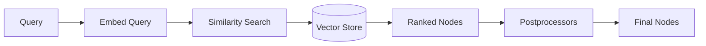
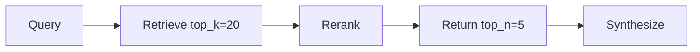

# Retrievers

## Introduction

Retrievers are the discovery engine of your RAG pipeline. When a user asks a question, the retriever finds the most relevant document chunks from your index—determining what context the LLM will use to generate an answer.

The quality of your retrieval directly impacts answer quality. Even the most powerful LLM can't generate good answers from irrelevant context. LlamaIndex provides flexible retriever options from simple vector search to hybrid approaches and custom implementations.

### What We'll Cover

- Retriever fundamentals and configuration
- Vector retrievers and similarity_top_k
- Retriever modes for different index types
- Hybrid retrieval (vector + keyword)
- Custom retrievers
- Metadata filtering

### Prerequisites

- [Response Synthesis](./02-response-synthesis.md)
- Understanding of embeddings and vector search

---

## How Retrievers Work

Retrievers take a query and return relevant nodes:



Key steps:
1. **Embed** the query using the same model used for documents
2. **Search** the vector store for similar embeddings
3. **Rank** results by similarity score
4. **Postprocess** (filter, rerank, etc.)

---

## Basic Retriever Usage

### From Index (High-Level)

```python
from llama_index.core import VectorStoreIndex, SimpleDirectoryReader

documents = SimpleDirectoryReader("./data").load_data()
index = VectorStoreIndex.from_documents(documents)

# Create retriever
retriever = index.as_retriever()

# Retrieve nodes
nodes = retriever.retrieve("What is machine learning?")

for node in nodes:
    print(f"Score: {node.score:.3f}")
    print(f"Text: {node.text[:100]}...")
    print("---")
```

**Output:**
```
Score: 0.892
Text: Machine learning is a subset of artificial intelligence that enables systems to learn from data...
---
Score: 0.847
Text: ML algorithms can be categorized into supervised, unsupervised, and reinforcement learning...
---
```

### Configuring similarity_top_k

Control how many nodes are retrieved:

```python
# Retrieve more nodes
retriever = index.as_retriever(similarity_top_k=5)

# Retrieve fewer nodes (faster)
retriever = index.as_retriever(similarity_top_k=2)
```

| top_k | Use Case | Trade-off |
|-------|----------|-----------|
| 1-2 | Quick answers | May miss context |
| 3-5 | General Q&A | Good balance |
| 5-10 | Research, detailed | Slower, more tokens |
| 10+ | Summarization | High cost, comprehensive |

---

## Low-Level Retriever Construction

For more control, construct retrievers directly:

```python
from llama_index.core.retrievers import VectorIndexRetriever

retriever = VectorIndexRetriever(
    index=index,
    similarity_top_k=5,
)

nodes = retriever.retrieve("query")
```

### Use in Query Engine

```python
from llama_index.core.query_engine import RetrieverQueryEngine
from llama_index.core import get_response_synthesizer

retriever = VectorIndexRetriever(
    index=index,
    similarity_top_k=5,
)

response_synthesizer = get_response_synthesizer(
    response_mode="compact"
)

query_engine = RetrieverQueryEngine(
    retriever=retriever,
    response_synthesizer=response_synthesizer,
)
```

---

## Retriever Modes

Different index types support different retriever modes:

### Vector Index

```python
# Vector index always uses VectorIndexRetriever
retriever = vector_index.as_retriever(
    similarity_top_k=3
)
```

### Summary Index

```python
# Default: returns all nodes
retriever = summary_index.as_retriever()

# Embedding-based retrieval
retriever = summary_index.as_retriever(
    retriever_mode="embedding"
)

# LLM-based retrieval
retriever = summary_index.as_retriever(
    retriever_mode="llm"
)
```

### Keyword Table Index

```python
# GPT-based keyword extraction
retriever = keyword_index.as_retriever(
    retriever_mode="default"
)

# Simple keyword matching
retriever = keyword_index.as_retriever(
    retriever_mode="simple"
)

# RAKE algorithm
retriever = keyword_index.as_retriever(
    retriever_mode="rake"
)
```

### Document Summary Index

```python
# LLM-based summary matching
retriever = doc_summary_index.as_retriever(
    retriever_mode="llm"
)

# Embedding-based summary matching
retriever = doc_summary_index.as_retriever(
    retriever_mode="embedding"
)
```

---

## Node Postprocessors

Postprocessors filter and transform retrieved nodes:

```python
from llama_index.core.postprocessor import (
    SimilarityPostprocessor,
    KeywordNodePostprocessor,
)

# Filter by similarity score
similarity_filter = SimilarityPostprocessor(
    similarity_cutoff=0.7
)

# Filter by keywords
keyword_filter = KeywordNodePostprocessor(
    required_keywords=["machine learning"],
    exclude_keywords=["deprecated"]
)

# Apply in query engine
query_engine = index.as_query_engine(
    node_postprocessors=[
        similarity_filter,
        keyword_filter,
    ]
)
```

### Common Postprocessors

| Postprocessor | Purpose |
|---------------|---------|
| `SimilarityPostprocessor` | Filter by similarity score |
| `KeywordNodePostprocessor` | Include/exclude keywords |
| `MetadataReplacementPostProcessor` | Replace content with metadata field |
| `LongContextReorder` | Reorder nodes for better LLM performance |
| `TimeWeightedPostprocessor` | Favor recent or less-accessed nodes |

---

## Reranking

Rerank retrieved nodes for better relevance:

### Cohere Reranker

```python
from llama_index.postprocessor.cohere_rerank import CohereRerank

reranker = CohereRerank(
    api_key="your-api-key",
    model="rerank-english-v2.0",
    top_n=3,
)

query_engine = index.as_query_engine(
    similarity_top_k=10,  # Retrieve more
    node_postprocessors=[reranker],  # Then rerank
)
```

### Sentence Transformer Reranker

```python
from llama_index.core.postprocessor import SentenceTransformerRerank

reranker = SentenceTransformerRerank(
    model="cross-encoder/ms-marco-MiniLM-L-2-v2",
    top_n=3,
)
```

### LLM Reranker

```python
from llama_index.core.postprocessor import LLMRerank

reranker = LLMRerank(
    top_n=3,
)
```

### Reranking Strategy



Retrieve broadly (high top_k), then rerank to get the best results.

---

## Hybrid Retrieval

Combine vector search with keyword search:

### BM25 + Vector Hybrid

```python
from llama_index.retrievers.bm25 import BM25Retriever
from llama_index.core.retrievers import QueryFusionRetriever

# Vector retriever
vector_retriever = index.as_retriever(similarity_top_k=5)

# BM25 retriever (keyword-based)
bm25_retriever = BM25Retriever.from_defaults(
    nodes=nodes,
    similarity_top_k=5,
)

# Combine with fusion
hybrid_retriever = QueryFusionRetriever(
    retrievers=[vector_retriever, bm25_retriever],
    similarity_top_k=5,
    num_queries=1,  # Don't generate additional queries
    mode="reciprocal_rerank",
)

nodes = hybrid_retriever.retrieve("What is machine learning?")
```

### Why Hybrid?

| Search Type | Strengths | Weaknesses |
|-------------|-----------|------------|
| **Vector** | Semantic understanding | May miss exact terms |
| **Keyword (BM25)** | Exact term matching | No semantic understanding |
| **Hybrid** | Best of both | More complex |

---

## Metadata Filtering

Filter retrieval by document metadata:

```python
from llama_index.core.vector_stores import (
    MetadataFilter,
    MetadataFilters,
    FilterOperator,
)

# Define filters
filters = MetadataFilters(
    filters=[
        MetadataFilter(
            key="category",
            value="tutorial",
        ),
        MetadataFilter(
            key="year",
            value=2024,
            operator=FilterOperator.GTE,
        ),
    ]
)

# Apply to retriever
retriever = index.as_retriever(
    similarity_top_k=5,
    filters=filters,
)

# Or in query engine
query_engine = index.as_query_engine(
    filters=filters,
)
```

### Filter Operators

| Operator | Description |
|----------|-------------|
| `EQ` | Equal (default) |
| `NE` | Not equal |
| `GT` | Greater than |
| `GTE` | Greater than or equal |
| `LT` | Less than |
| `LTE` | Less than or equal |
| `IN` | In list |
| `NIN` | Not in list |
| `CONTAINS` | Contains substring |

---

## Custom Retrievers

Build custom retrievers for specialized needs:

```python
from llama_index.core.retrievers import BaseRetriever
from llama_index.core.schema import NodeWithScore, QueryBundle
from typing import List

class CustomRetriever(BaseRetriever):
    """Custom retriever with logging and filtering."""
    
    def __init__(
        self,
        vector_retriever,
        min_score: float = 0.5,
    ):
        super().__init__()
        self._vector_retriever = vector_retriever
        self._min_score = min_score
    
    def _retrieve(self, query_bundle: QueryBundle) -> List[NodeWithScore]:
        # Get nodes from base retriever
        nodes = self._vector_retriever.retrieve(query_bundle.query_str)
        
        # Log retrieval
        print(f"Query: {query_bundle.query_str}")
        print(f"Retrieved {len(nodes)} nodes")
        
        # Filter by score
        filtered = [n for n in nodes if n.score >= self._min_score]
        print(f"After filtering: {len(filtered)} nodes")
        
        # Add custom metadata
        for node in filtered:
            node.node.metadata["retrieved_at"] = "2024-01-01"
        
        return filtered

# Usage
base_retriever = index.as_retriever(similarity_top_k=10)
custom_retriever = CustomRetriever(
    vector_retriever=base_retriever,
    min_score=0.7,
)

nodes = custom_retriever.retrieve("What is RAG?")
```

---

## Ensemble Retrieval

Combine multiple retrievers:

```python
from llama_index.core.retrievers import QueryFusionRetriever

# Multiple retrievers
retriever1 = index1.as_retriever(similarity_top_k=5)
retriever2 = index2.as_retriever(similarity_top_k=5)

# Ensemble with reciprocal rank fusion
ensemble = QueryFusionRetriever(
    retrievers=[retriever1, retriever2],
    similarity_top_k=10,
    num_queries=1,
    mode="reciprocal_rerank",
)

nodes = ensemble.retrieve("query")
```

### Fusion Modes

| Mode | Description |
|------|-------------|
| `simple` | Concatenate results |
| `reciprocal_rerank` | Rank fusion algorithm |
| `relative_score` | Combine by relative scores |

---

## Router Retriever

Route queries to different retrievers:

```python
from llama_index.core.retrievers import RouterRetriever
from llama_index.core.selectors import PydanticSingleSelector
from llama_index.core.tools import RetrieverTool

# Define retriever tools
code_retriever = code_index.as_retriever()
docs_retriever = docs_index.as_retriever()

code_tool = RetrieverTool.from_defaults(
    retriever=code_retriever,
    description="Retrieves code examples and implementations",
)

docs_tool = RetrieverTool.from_defaults(
    retriever=docs_retriever,
    description="Retrieves documentation and explanations",
)

# Router retriever
router = RouterRetriever(
    selector=PydanticSingleSelector.from_defaults(),
    retriever_tools=[code_tool, docs_tool],
)

# Routes automatically based on query
nodes = router.retrieve("Show me an implementation example")
```

---

## Best Practices

| Practice | Description |
|----------|-------------|
| **Tune similarity_top_k** | Balance coverage vs. noise |
| **Use reranking** | Retrieve broadly, rerank precisely |
| **Add metadata filters** | Reduce search space |
| **Consider hybrid** | Vector + keyword for best results |
| **Log retrieval** | Debug with custom retrievers |
| **Test retrieval separately** | Verify results before synthesis |

---

## Common Pitfalls

| ❌ Mistake | ✅ Solution |
|-----------|------------|
| Too low top_k | May miss relevant context |
| Too high top_k | Adds noise, increases cost |
| No reranking | Miss best results from large retrieval |
| Ignoring metadata | Use filters to narrow search |
| No score threshold | Filter out low-quality results |

---

## Hands-on Exercise

### Your Task

Build a retrieval pipeline with filtering and reranking:
1. Create an index with documents containing metadata
2. Implement metadata filtering
3. Add similarity score filtering
4. Compare retrieval with and without reranking

### Requirements

1. Documents with category metadata
2. Filter by category before retrieval
3. Filter by similarity score (> 0.6)
4. Use SentenceTransformerRerank

### Expected Result

```
Without reranking: [0.82, 0.78, 0.71, 0.65, 0.62]
With reranking:    [0.91, 0.88, 0.85]

Filtered to category 'tutorial': 3 nodes
```

<details>
<summary>💡 Hints</summary>

- Add metadata when creating `Document` objects
- Use `MetadataFilters` for filtering
- Use `SimilarityPostprocessor` for score threshold
- Compare scores before and after reranking

</details>

<details>
<summary>✅ Solution</summary>

```python
from llama_index.core import VectorStoreIndex, Document
from llama_index.core.vector_stores import MetadataFilter, MetadataFilters
from llama_index.core.postprocessor import (
    SimilarityPostprocessor,
    SentenceTransformerRerank,
)

# Create documents with metadata
documents = [
    Document(
        text="Machine learning basics: supervised and unsupervised learning.",
        metadata={"category": "tutorial", "level": "beginner"}
    ),
    Document(
        text="Advanced neural network architectures for deep learning.",
        metadata={"category": "advanced", "level": "expert"}
    ),
    Document(
        text="Getting started with Python for machine learning projects.",
        metadata={"category": "tutorial", "level": "beginner"}
    ),
    Document(
        text="Research paper on transformer attention mechanisms.",
        metadata={"category": "research", "level": "expert"}
    ),
    Document(
        text="Tutorial on building your first ML model with scikit-learn.",
        metadata={"category": "tutorial", "level": "beginner"}
    ),
]

# Create index
index = VectorStoreIndex.from_documents(documents)

# Test 1: Without reranking
print("=== Without Reranking ===")
retriever = index.as_retriever(similarity_top_k=5)
nodes = retriever.retrieve("How do I learn machine learning?")
scores = [f"{n.score:.2f}" for n in nodes]
print(f"Scores: {scores}")

# Test 2: With reranking
print("\n=== With Reranking ===")
reranker = SentenceTransformerRerank(
    model="cross-encoder/ms-marco-MiniLM-L-2-v2",
    top_n=3,
)

query_engine = index.as_query_engine(
    similarity_top_k=5,
    node_postprocessors=[reranker],
)
response = query_engine.query("How do I learn machine learning?")
scores = [f"{n.score:.2f}" for n in response.source_nodes]
print(f"Reranked scores: {scores}")

# Test 3: Metadata filtering
print("\n=== Metadata Filtering ===")
filters = MetadataFilters(
    filters=[
        MetadataFilter(key="category", value="tutorial"),
    ]
)

retriever_filtered = index.as_retriever(
    similarity_top_k=5,
    filters=filters,
)
nodes = retriever_filtered.retrieve("machine learning")
print(f"Tutorial category: {len(nodes)} nodes")
for node in nodes:
    print(f"  - {node.text[:50]}... (category: {node.metadata['category']})")

# Test 4: Similarity threshold
print("\n=== Similarity Threshold ===")
similarity_filter = SimilarityPostprocessor(similarity_cutoff=0.6)

query_engine = index.as_query_engine(
    similarity_top_k=5,
    node_postprocessors=[similarity_filter],
)
response = query_engine.query("machine learning tutorial")
print(f"Above 0.6 threshold: {len(response.source_nodes)} nodes")
```

</details>

---

## Summary

✅ **Retrievers** find relevant chunks from your index

✅ **similarity_top_k** controls how many chunks are retrieved

✅ **Postprocessors** filter and transform retrieved nodes

✅ **Reranking** improves result quality from broad retrieval

✅ **Hybrid retrieval** combines vector and keyword search

✅ **Metadata filters** narrow search to specific categories

✅ **Custom retrievers** enable specialized retrieval logic

**Next:** [Routing & Composition](./04-routing-composition.md)

---

## Further Reading

- [LlamaIndex Retrievers](https://developers.llamaindex.ai/python/framework/module_guides/querying/retriever/)
- [Node Postprocessors](https://developers.llamaindex.ai/python/framework/module_guides/querying/node_postprocessors/)
- [Hybrid Retrieval](https://developers.llamaindex.ai/python/examples/retrievers/bm25_retriever/)

---

<!-- 
Sources Consulted:
- LlamaIndex Retrievers: https://developers.llamaindex.ai/python/framework/module_guides/querying/retriever/
- Node Postprocessors: https://developers.llamaindex.ai/python/framework/module_guides/querying/node_postprocessors/node_postprocessors/
- Retriever Modes: https://developers.llamaindex.ai/python/framework/module_guides/querying/retriever/retriever_modes/
-->
