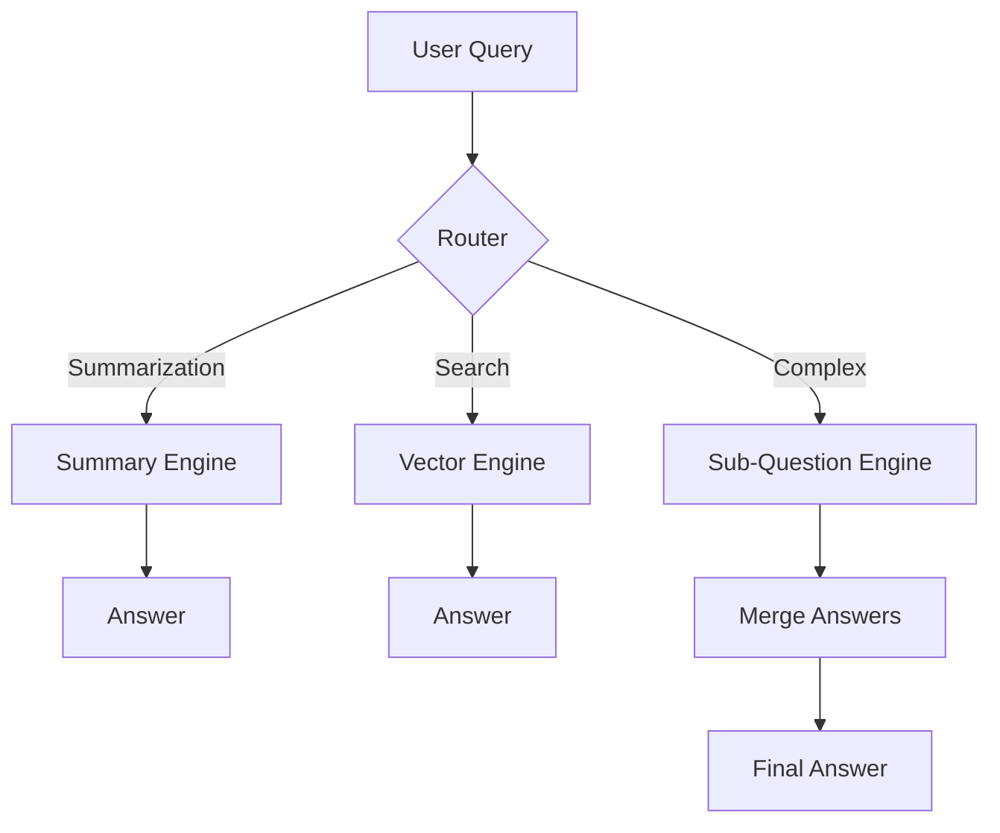
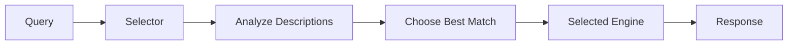
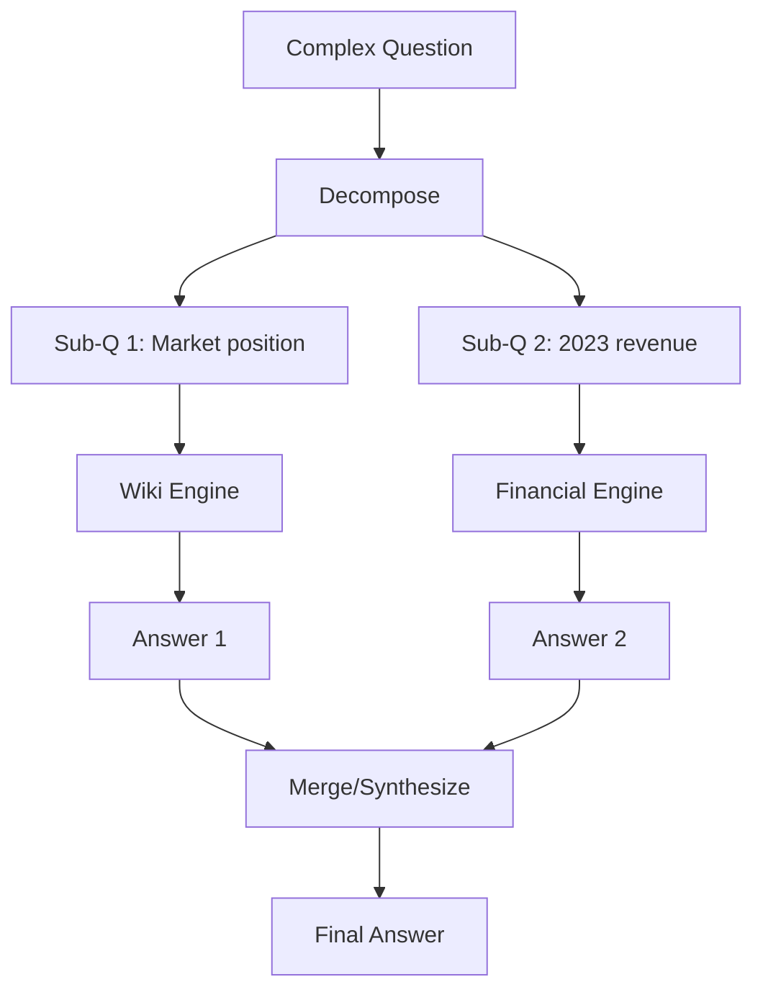

# Routing and Composition

## Introduction

Real-world applications often require more than a single query engine. You might have multiple data sources, different index types for different purposes, or questions that need to be broken into sub-questions. LlamaIndex provides powerful routing and composition tools to handle these complex scenarios.

Routing automatically directs queries to the most appropriate engine, while composition enables multi-step reasoning and complex query workflows.

### What We'll Cover

- RouterQueryEngine for dynamic routing
- SubQuestionQueryEngine for query decomposition
- Multi-index queries
- Query planning and orchestration
- Building complex query pipelines

### Prerequisites

- [Retrievers](./03-retrievers.md)
- Understanding of multiple indices

---

## Why Routing and Composition?

Consider these scenarios:

| Scenario | Solution |
|----------|----------|
| Multiple data sources | Route to correct source |
| Summarize vs. search | Route based on intent |
| Complex questions | Decompose into sub-questions |
| Multi-document analysis | Query across indices |



---

## RouterQueryEngine

Routes queries to the most appropriate engine based on descriptions:

```python
from llama_index.core.query_engine import RouterQueryEngine
from llama_index.core.selectors import PydanticSingleSelector
from llama_index.core.tools import QueryEngineTool

# Create different query engines
summary_engine = summary_index.as_query_engine(
    response_mode="tree_summarize"
)
vector_engine = vector_index.as_query_engine(
    similarity_top_k=5
)

# Define as tools with descriptions
summary_tool = QueryEngineTool.from_defaults(
    query_engine=summary_engine,
    description="Useful for summarizing documents and getting overviews",
)

vector_tool = QueryEngineTool.from_defaults(
    query_engine=vector_engine,
    description="Useful for finding specific information and details",
)

# Create router
router_engine = RouterQueryEngine(
    selector=PydanticSingleSelector.from_defaults(),
    query_engine_tools=[summary_tool, vector_tool],
)

# Routes automatically
response = router_engine.query("Summarize the main points")
response = router_engine.query("What is the specific definition of RAG?")
```

### How Routing Works



The selector:
1. Takes the query and tool descriptions
2. Uses an LLM to determine best match
3. Routes to the selected engine

---

## Selector Types

### PydanticSingleSelector

Uses function calling to select one engine:

```python
from llama_index.core.selectors import PydanticSingleSelector

selector = PydanticSingleSelector.from_defaults()
```

### LLMSingleSelector

Uses text completion for selection:

```python
from llama_index.core.selectors import LLMSingleSelector

selector = LLMSingleSelector.from_defaults()
```

### Multi-Selectors

Allow routing to multiple engines:

```python
from llama_index.core.selectors import (
    PydanticMultiSelector,
    LLMMultiSelector,
)

# Can select multiple tools
multi_selector = PydanticMultiSelector.from_defaults()

router_engine = RouterQueryEngine(
    selector=multi_selector,
    query_engine_tools=[tool1, tool2, tool3],
)
```

### Selector Comparison

| Selector | Type | Multi-Select | Best For |
|----------|------|--------------|----------|
| `PydanticSingleSelector` | Function calling | No | OpenAI models |
| `LLMSingleSelector` | Text completion | No | Any LLM |
| `PydanticMultiSelector` | Function calling | Yes | Query multiple sources |
| `LLMMultiSelector` | Text completion | Yes | Flexible multi-routing |

---

## SubQuestionQueryEngine

Breaks complex questions into sub-questions:

```python
from llama_index.core.query_engine import SubQuestionQueryEngine
from llama_index.core.tools import QueryEngineTool

# Multiple query engines for different sources
wiki_engine = wiki_index.as_query_engine()
financial_engine = financial_index.as_query_engine()

# Define as tools
wiki_tool = QueryEngineTool.from_defaults(
    query_engine=wiki_engine,
    description="Contains general knowledge and encyclopedia information",
)

financial_tool = QueryEngineTool.from_defaults(
    query_engine=financial_engine,
    description="Contains financial reports and company earnings data",
)

# Create sub-question engine
sub_question_engine = SubQuestionQueryEngine.from_defaults(
    query_engine_tools=[wiki_tool, financial_tool],
)

# Complex question
response = sub_question_engine.query(
    "Compare Apple's market position with its 2023 revenue performance"
)
```

### How Sub-Questions Work



The engine:
1. Uses LLM to break down the question
2. Routes each sub-question to appropriate tool
3. Collects answers
4. Synthesizes final response

---

## Verbose Mode

See the decomposition and routing in action:

```python
sub_question_engine = SubQuestionQueryEngine.from_defaults(
    query_engine_tools=[wiki_tool, financial_tool],
    verbose=True,
)

response = sub_question_engine.query(
    "How does Tesla's battery technology compare to its stock performance?"
)
```

**Output:**
```
Generated 2 sub-questions:
  1. [wiki_tool] What is Tesla's battery technology?
  2. [financial_tool] What is Tesla's recent stock performance?
  
Sub-question 1 answer: Tesla uses lithium-ion batteries...
Sub-question 2 answer: Tesla stock has shown...

Final response: [synthesized answer]
```

---

## Multi-Index Queries

Query across multiple indices simultaneously:

### Simple Approach

```python
from llama_index.core.query_engine import RouterQueryEngine
from llama_index.core.tools import QueryEngineTool

# Multiple indices
code_index = VectorStoreIndex.from_documents(code_docs)
docs_index = VectorStoreIndex.from_documents(documentation)
api_index = VectorStoreIndex.from_documents(api_reference)

# Create tools
tools = [
    QueryEngineTool.from_defaults(
        query_engine=code_index.as_query_engine(),
        description="Code examples and implementations",
    ),
    QueryEngineTool.from_defaults(
        query_engine=docs_index.as_query_engine(),
        description="Tutorials and conceptual documentation",
    ),
    QueryEngineTool.from_defaults(
        query_engine=api_index.as_query_engine(),
        description="API reference and function signatures",
    ),
]

# Router for single-source queries
router = RouterQueryEngine(
    selector=PydanticSingleSelector.from_defaults(),
    query_engine_tools=tools,
)

# Sub-question for multi-source queries
multi_source = SubQuestionQueryEngine.from_defaults(
    query_engine_tools=tools,
)
```

### Combined Approach

Use router to decide between single vs. multi-source:

```python
# Wrap in another router
single_source_tool = QueryEngineTool.from_defaults(
    query_engine=router,
    description="Simple questions that need one source",
)

multi_source_tool = QueryEngineTool.from_defaults(
    query_engine=multi_source,
    description="Complex questions that need multiple sources",
)

meta_router = RouterQueryEngine(
    selector=PydanticSingleSelector.from_defaults(),
    query_engine_tools=[single_source_tool, multi_source_tool],
)
```

---

## Router Retriever

Route at the retriever level (before synthesis):

```python
from llama_index.core.retrievers import RouterRetriever
from llama_index.core.tools import RetrieverTool

# Define retriever tools
vector_tool = RetrieverTool.from_defaults(
    retriever=vector_index.as_retriever(),
    description="Semantic search over general documents",
)

keyword_tool = RetrieverTool.from_defaults(
    retriever=keyword_index.as_retriever(),
    description="Keyword search for specific terms and names",
)

# Create router retriever
router_retriever = RouterRetriever(
    selector=PydanticSingleSelector.from_defaults(),
    retriever_tools=[vector_tool, keyword_tool],
)

# Use in query engine
from llama_index.core.query_engine import RetrieverQueryEngine

query_engine = RetrieverQueryEngine(
    retriever=router_retriever,
)
```

---

## SQL + Vector Routing

Route between SQL and vector queries:

```python
from llama_index.core.query_engine import RouterQueryEngine

# SQL query engine for structured data
sql_engine = NLSQLTableQueryEngine(
    sql_database=sql_database,
)

# Vector engine for unstructured data
vector_engine = vector_index.as_query_engine()

# Define tools
sql_tool = QueryEngineTool.from_defaults(
    query_engine=sql_engine,
    description="Query structured data like sales, inventory, and user tables",
)

vector_tool = QueryEngineTool.from_defaults(
    query_engine=vector_engine,
    description="Search product descriptions and documentation",
)

# Router decides SQL vs. vector
router = RouterQueryEngine(
    selector=PydanticSingleSelector.from_defaults(),
    query_engine_tools=[sql_tool, vector_tool],
)

# Automatically routes
response = router.query("What was total sales last month?")  # SQL
response = router.query("How do I install the product?")     # Vector
```

---

## Joint QA Summary

Combine Q&A and summarization:

```python
from llama_index.core.query_engine import RouterQueryEngine

# Detailed QA engine
qa_engine = vector_index.as_query_engine(
    response_mode="refine",
    similarity_top_k=10,
)

# Summary engine  
summary_engine = summary_index.as_query_engine(
    response_mode="tree_summarize",
)

qa_tool = QueryEngineTool.from_defaults(
    query_engine=qa_engine,
    description="Answers specific questions with detailed responses",
)

summary_tool = QueryEngineTool.from_defaults(
    query_engine=summary_engine,
    description="Provides high-level summaries and overviews",
)

router = RouterQueryEngine(
    selector=PydanticSingleSelector.from_defaults(),
    query_engine_tools=[qa_tool, summary_tool],
)
```

---

## Writing Good Tool Descriptions

Descriptions are critical for routing accuracy:

### ❌ Bad Descriptions

```python
# Too vague
QueryEngineTool.from_defaults(
    query_engine=engine1,
    description="First engine",
)

# Too similar
QueryEngineTool.from_defaults(
    query_engine=engine1,
    description="Searches documents",
)
QueryEngineTool.from_defaults(
    query_engine=engine2,
    description="Finds information in documents",
)
```

### ✅ Good Descriptions

```python
# Specific and differentiated
QueryEngineTool.from_defaults(
    query_engine=code_engine,
    description=(
        "Contains Python code examples, function implementations, "
        "and programming tutorials. Use for questions about how to "
        "implement features or debug code."
    ),
)

QueryEngineTool.from_defaults(
    query_engine=api_engine,
    description=(
        "API reference documentation with function signatures, "
        "parameters, and return types. Use for questions about "
        "specific function arguments or method parameters."
    ),
)
```

### Description Tips

| Tip | Example |
|-----|---------|
| Be specific | "2023 financial reports" not "documents" |
| Mention content type | "code examples", "API reference" |
| Include use cases | "Use for implementation questions" |
| Differentiate clearly | Make each description unique |

---

## Best Practices

| Practice | Description |
|----------|-------------|
| **Clear descriptions** | Be specific about each tool's purpose |
| **Use verbose mode** | Debug routing decisions |
| **Test routing** | Verify correct engine selection |
| **Combine patterns** | Router + SubQuestion for complex apps |
| **Monitor costs** | Multi-query engines make more LLM calls |

---

## Common Pitfalls

| ❌ Mistake | ✅ Solution |
|-----------|------------|
| Vague descriptions | Write specific, differentiated descriptions |
| Too many tools | Keep tools focused and distinct |
| No testing | Verify routing with sample queries |
| Wrong selector | Use Pydantic for function-calling models |
| Ignoring verbose | Always debug with verbose=True first |

---

## Hands-on Exercise

### Your Task

Build a multi-source query system:
1. Create indices for different data types
2. Set up a RouterQueryEngine
3. Create a SubQuestionQueryEngine
4. Test routing with different queries

### Requirements

1. At least 3 different query engine tools
2. Router for simple queries
3. Sub-question engine for complex queries
4. Test with verbose=True

### Expected Result

```
Query: "What is machine learning?"
Route: general_engine ✓

Query: "Compare ML algorithms in papers A and B"
Sub-questions generated:
  1. [paper_engine] What algorithms in paper A?
  2. [paper_engine] What algorithms in paper B?
  3. [general_engine] How do these compare?
```

<details>
<summary>💡 Hints</summary>

- Create at least 3 separate document sets
- Use very distinct descriptions
- Enable `verbose=True` to see routing
- SubQuestionQueryEngine needs multiple tools

</details>

<details>
<summary>✅ Solution</summary>

```python
from llama_index.core import VectorStoreIndex, Document
from llama_index.core.query_engine import (
    RouterQueryEngine,
    SubQuestionQueryEngine,
)
from llama_index.core.selectors import PydanticSingleSelector
from llama_index.core.tools import QueryEngineTool

# Create document sets
general_docs = [
    Document(text="Machine learning is a subset of AI that enables systems to learn from data."),
    Document(text="Deep learning uses neural networks with multiple layers."),
]

paper_a_docs = [
    Document(text="Paper A introduces a new CNN architecture for image classification."),
    Document(text="The algorithm in Paper A achieves 95% accuracy on ImageNet."),
]

paper_b_docs = [
    Document(text="Paper B proposes a transformer-based approach for NLP tasks."),
    Document(text="Paper B's algorithm uses attention mechanisms for better context understanding."),
]

# Create indices
general_index = VectorStoreIndex.from_documents(general_docs)
paper_a_index = VectorStoreIndex.from_documents(paper_a_docs)
paper_b_index = VectorStoreIndex.from_documents(paper_b_docs)

# Create query engines
general_engine = general_index.as_query_engine()
paper_a_engine = paper_a_index.as_query_engine()
paper_b_engine = paper_b_index.as_query_engine()

# Define tools
tools = [
    QueryEngineTool.from_defaults(
        query_engine=general_engine,
        description=(
            "General machine learning and AI concepts. "
            "Use for basic definitions and explanations."
        ),
    ),
    QueryEngineTool.from_defaults(
        query_engine=paper_a_engine,
        description=(
            "Research Paper A about CNN architectures for image classification. "
            "Use for questions specifically about Paper A."
        ),
    ),
    QueryEngineTool.from_defaults(
        query_engine=paper_b_engine,
        description=(
            "Research Paper B about transformer-based NLP approaches. "
            "Use for questions specifically about Paper B."
        ),
    ),
]

# Test 1: Simple router
print("=== Router Query Engine ===")
router = RouterQueryEngine(
    selector=PydanticSingleSelector.from_defaults(),
    query_engine_tools=tools,
    verbose=True,
)

response = router.query("What is machine learning?")
print(f"Response: {response}\n")

# Test 2: Sub-question engine
print("=== Sub-Question Query Engine ===")
sub_q_engine = SubQuestionQueryEngine.from_defaults(
    query_engine_tools=tools,
    verbose=True,
)

response = sub_q_engine.query(
    "Compare the algorithms used in Paper A and Paper B"
)
print(f"\nFinal Response: {response}")
```

</details>

---

## Summary

✅ **RouterQueryEngine** routes queries to the best engine based on descriptions

✅ **SubQuestionQueryEngine** breaks complex questions into sub-questions

✅ **Selectors** (Pydantic/LLM, Single/Multi) control routing behavior

✅ **Tool descriptions** are critical for accurate routing

✅ Combine routing and composition for complex applications

✅ Use **verbose=True** to debug routing decisions

**Next:** [Chat Engines](./05-chat-engines.md)

---

## Further Reading

- [RouterQueryEngine](https://developers.llamaindex.ai/python/examples/query_engine/routerqueryengine/)
- [SubQuestionQueryEngine](https://developers.llamaindex.ai/python/examples/query_engine/sub_question_query_engine/)
- [Routers Guide](https://developers.llamaindex.ai/python/framework/module_guides/querying/router/)

---

<!-- 
Sources Consulted:
- LlamaIndex Routers: https://developers.llamaindex.ai/python/framework/module_guides/querying/router/
- RouterQueryEngine examples: https://developers.llamaindex.ai/python/examples/query_engine/routerqueryengine/
- SubQuestionQueryEngine: https://developers.llamaindex.ai/python/examples/query_engine/sub_question_query_engine/
-->
