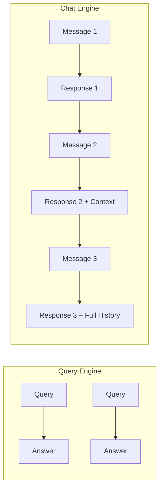

# Chat Engines

## Introduction

While query engines handle single question-answer interactions, chat engines enable multi-turn conversations. They maintain context across messages, remember what was discussed, and can refer back to previous exchanges—just like a human conversation.

Chat engines are the foundation for building RAG-powered chatbots, customer support agents, and interactive assistants that feel natural and contextual.

### What We'll Cover

- Chat engine fundamentals
- Available chat modes
- Conversation memory management
- Streaming chat responses
- Customization and configuration
- Building conversational applications

### Prerequisites

- [Routing & Composition](./04-routing-composition.md)
- Understanding of query engines

---

## Query Engine vs Chat Engine

| Aspect | Query Engine | Chat Engine |
|--------|--------------|-------------|
| **State** | Stateless | Stateful |
| **Memory** | None | Conversation history |
| **Method** | `.query()` | `.chat()` |
| **Use Case** | Single Q&A | Conversations |
| **Context** | Per-query | Accumulated |



---

## Creating a Chat Engine

### Basic Usage

```python
from llama_index.core import VectorStoreIndex, SimpleDirectoryReader

# Load documents
documents = SimpleDirectoryReader("./data").load_data()
index = VectorStoreIndex.from_documents(documents)

# Create chat engine
chat_engine = index.as_chat_engine()

# Start conversation
response = chat_engine.chat("What topics are covered in these documents?")
print(response)

# Continue conversation
response = chat_engine.chat("Tell me more about the first topic")
print(response)

# Ask a follow-up
response = chat_engine.chat("Can you give an example?")
print(response)
```

### Resetting Conversation

```python
# Clear conversation history
chat_engine.reset()

# Start fresh conversation
response = chat_engine.chat("Let's start over. What is RAG?")
```

### Interactive Chat REPL

```python
# Start interactive chat session
chat_engine.chat_repl()
```

This opens an interactive prompt where you can type messages and see responses.

---

## Chat Modes

LlamaIndex provides several chat modes for different use cases:

### Best Mode (Default)

Automatically selects the best approach based on your LLM:

```python
chat_engine = index.as_chat_engine(chat_mode="best")
```

- Uses OpenAI function calling if available
- Falls back to ReAct otherwise

### Context Mode

Retrieves context for every message:

```python
chat_engine = index.as_chat_engine(chat_mode="context")
```

**How it works:**
1. Retrieve relevant nodes for each message
2. Insert context into system prompt
3. Generate response with context

**Best for:** Simple retrieval-based chat

### Condense Question Mode

Rewrites questions to include conversation context:

```python
chat_engine = index.as_chat_engine(chat_mode="condense_question")
```

**How it works:**
1. Look at chat history
2. Rewrite user's message as standalone query
3. Query the index with rewritten question

**Example:**
```
User: What is RAG?
Bot: RAG is Retrieval Augmented Generation...

User: How does it work?
Rewritten: How does RAG (Retrieval Augmented Generation) work?
```

### Condense + Context Mode

Combines both approaches:

```python
chat_engine = index.as_chat_engine(chat_mode="condense_plus_context")
```

**How it works:**
1. Rewrite question with chat context
2. Retrieve relevant nodes
3. Insert context into prompt
4. Generate response

**Best for:** Comprehensive conversational RAG

### Simple Mode

Direct chat with LLM (no retrieval):

```python
chat_engine = index.as_chat_engine(chat_mode="simple")
```

**Best for:** General conversation without document retrieval

### React Mode

Uses ReAct agent pattern:

```python
chat_engine = index.as_chat_engine(chat_mode="react")
```

**Best for:** Complex reasoning with tool use

### OpenAI Mode

Uses OpenAI's function calling:

```python
chat_engine = index.as_chat_engine(chat_mode="openai")
```

**Best for:** OpenAI models with function calling

---

## Chat Mode Comparison

| Mode | Retrieval | Context Rewrite | Agent | Best For |
|------|-----------|-----------------|-------|----------|
| `best` | Auto | Auto | Auto | Default choice |
| `context` | Every message | No | No | Simple retrieval |
| `condense_question` | After rewrite | Yes | No | Follow-up questions |
| `condense_plus_context` | After rewrite | Yes | No | Comprehensive |
| `simple` | No | No | No | General chat |
| `react` | Via tools | No | Yes | Complex reasoning |
| `openai` | Via functions | No | Yes | OpenAI models |

---

## Streaming Chat

Enable streaming for real-time responses:

```python
chat_engine = index.as_chat_engine()

# Stream response
streaming_response = chat_engine.stream_chat(
    "Explain machine learning in detail"
)

# Print as tokens arrive
for token in streaming_response.response_gen:
    print(token, end="", flush=True)
```

### Streaming with Response Access

```python
streaming_response = chat_engine.stream_chat("What is RAG?")

# Consume stream
full_response = ""
for token in streaming_response.response_gen:
    full_response += token
    print(token, end="", flush=True)

print("\n")

# Access source nodes after streaming
print(f"Sources: {len(streaming_response.source_nodes)}")
```

---

## Conversation Memory

Chat engines maintain conversation history automatically:

```python
# First message
response = chat_engine.chat("My name is Alice")

# Second message - remembers context
response = chat_engine.chat("What's my name?")
print(response)  # "Your name is Alice"
```

### Accessing Chat History

```python
from llama_index.core.llms import ChatMessage

# Get chat history
history = chat_engine.chat_history

for message in history:
    print(f"{message.role}: {message.content[:50]}...")
```

### Pre-loading Chat History

```python
from llama_index.core.llms import ChatMessage, MessageRole
from llama_index.core.chat_engine import CondenseQuestionChatEngine

# Create custom history
custom_history = [
    ChatMessage(
        role=MessageRole.USER,
        content="What topics should we discuss today?",
    ),
    ChatMessage(
        role=MessageRole.ASSISTANT,
        content="Let's discuss machine learning and AI applications.",
    ),
]

# Create chat engine with history
query_engine = index.as_query_engine()
chat_engine = CondenseQuestionChatEngine.from_defaults(
    query_engine=query_engine,
    chat_history=custom_history,
)

# Continue from existing context
response = chat_engine.chat("Tell me more about the first topic")
```

---

## Low-Level Chat Engine Construction

For more control, construct chat engines directly:

### CondenseQuestionChatEngine

```python
from llama_index.core.chat_engine import CondenseQuestionChatEngine
from llama_index.core import PromptTemplate

# Custom condense prompt
condense_prompt = PromptTemplate(
    """\
Given the following conversation and a follow-up question, rephrase the 
follow-up question to be a standalone question.

Chat History:
{chat_history}

Follow-up Question: {question}

Standalone Question:"""
)

query_engine = index.as_query_engine()

chat_engine = CondenseQuestionChatEngine.from_defaults(
    query_engine=query_engine,
    condense_question_prompt=condense_prompt,
    verbose=True,
)
```

### ContextChatEngine

```python
from llama_index.core.chat_engine import ContextChatEngine

retriever = index.as_retriever(similarity_top_k=5)

chat_engine = ContextChatEngine.from_defaults(
    retriever=retriever,
    verbose=True,
)
```

---

## Configuring Chat Engines

### System Prompt

Set the assistant's persona:

```python
chat_engine = index.as_chat_engine(
    chat_mode="context",
    system_prompt=(
        "You are a helpful technical support agent. "
        "Answer questions based on the documentation provided. "
        "If you don't know the answer, say so clearly."
    ),
)
```

### Memory Configuration

Limit conversation memory:

```python
from llama_index.core.memory import ChatMemoryBuffer

memory = ChatMemoryBuffer.from_defaults(
    token_limit=3000,  # Limit memory size
)

chat_engine = index.as_chat_engine(
    chat_mode="context",
    memory=memory,
)
```

### Verbose Mode

Debug chat engine behavior:

```python
chat_engine = index.as_chat_engine(
    chat_mode="condense_plus_context",
    verbose=True,
)

response = chat_engine.chat("What did we discuss earlier?")
```

**Output:**
```
Condensed question: What topics were discussed in our previous conversation?
Retrieved 3 nodes with scores: [0.85, 0.82, 0.79]
Generating response...
```

---

## Building a Chatbot

Complete example of a RAG chatbot:

```python
from llama_index.core import VectorStoreIndex, SimpleDirectoryReader
from llama_index.core.memory import ChatMemoryBuffer

# Load and index documents
documents = SimpleDirectoryReader("./docs").load_data()
index = VectorStoreIndex.from_documents(documents)

# Configure memory
memory = ChatMemoryBuffer.from_defaults(token_limit=4000)

# Create chat engine
chat_engine = index.as_chat_engine(
    chat_mode="condense_plus_context",
    memory=memory,
    system_prompt=(
        "You are a helpful assistant that answers questions about "
        "our product documentation. Be concise and accurate. "
        "If information isn't in the docs, say so."
    ),
    verbose=True,
)

# Chat loop
def chatbot():
    print("Chatbot ready! Type 'quit' to exit, 'reset' to clear history.\n")
    
    while True:
        user_input = input("You: ").strip()
        
        if user_input.lower() == 'quit':
            break
        elif user_input.lower() == 'reset':
            chat_engine.reset()
            print("Conversation reset.\n")
            continue
        elif not user_input:
            continue
        
        # Stream response
        response = chat_engine.stream_chat(user_input)
        
        print("Bot: ", end="")
        for token in response.response_gen:
            print(token, end="", flush=True)
        print("\n")

if __name__ == "__main__":
    chatbot()
```

---

## Async Chat

For web applications, use async methods:

```python
import asyncio

async def async_chat():
    chat_engine = index.as_chat_engine()
    
    # Async chat
    response = await chat_engine.achat("What is RAG?")
    print(response)
    
    # Async streaming
    streaming_response = await chat_engine.astream_chat(
        "Explain in more detail"
    )
    
    async for token in streaming_response.async_response_gen():
        print(token, end="", flush=True)

# Run
asyncio.run(async_chat())
```

---

## Best Practices

| Practice | Description |
|----------|-------------|
| **Choose appropriate mode** | Use `condense_plus_context` for most RAG chatbots |
| **Set system prompt** | Define the assistant's persona and constraints |
| **Limit memory** | Prevent context overflow with token limits |
| **Use streaming** | Better UX for long responses |
| **Handle reset** | Allow users to start fresh conversations |
| **Enable verbose** | Debug during development |

---

## Common Pitfalls

| ❌ Mistake | ✅ Solution |
|-----------|------------|
| No system prompt | Always set persona and guidelines |
| Unlimited memory | Set token limits to prevent overflow |
| Ignoring chat mode | Choose mode based on use case |
| No reset option | Let users clear conversation |
| Blocking responses | Use streaming for better UX |

---

## Hands-on Exercise

### Your Task

Build a multi-turn conversational assistant:
1. Create a chat engine with custom system prompt
2. Implement conversation with context awareness
3. Add memory limits
4. Test follow-up questions that rely on context

### Requirements

1. Load sample documents
2. Set a custom system prompt
3. Configure memory with token limit
4. Have at least 3 turn conversation
5. Test context recall

### Expected Result

```
You: What topics are in the documents?
Bot: The documents cover machine learning, including...

You: Tell me more about the first one
Bot: Machine learning is... [uses context from previous turn]

You: Can you give an example?
Bot: Here's an example of machine learning... [remembers ML context]
```

<details>
<summary>💡 Hints</summary>

- Use `condense_plus_context` mode
- Set `verbose=True` to see condensed questions
- Check that follow-up questions are rewritten correctly
- Use `chat_engine.chat_history` to inspect memory

</details>

<details>
<summary>✅ Solution</summary>

```python
from llama_index.core import VectorStoreIndex, Document
from llama_index.core.memory import ChatMemoryBuffer

# Create sample documents
documents = [
    Document(text="""
    Machine learning is a subset of artificial intelligence that enables 
    systems to learn from data without being explicitly programmed. 
    It uses algorithms to identify patterns and make predictions.
    Example: A spam filter learns to classify emails as spam or not spam
    based on examples of both types.
    """),
    Document(text="""
    Deep learning is a type of machine learning using neural networks
    with multiple layers. It excels at tasks like image recognition,
    natural language processing, and speech recognition.
    Example: Image classification systems that can identify objects in photos.
    """),
    Document(text="""
    Natural language processing (NLP) allows computers to understand
    and generate human language. Modern NLP uses transformer models
    like BERT and GPT for tasks like translation and summarization.
    Example: Chatbots that can answer questions in natural language.
    """),
]

# Create index
index = VectorStoreIndex.from_documents(documents)

# Configure memory
memory = ChatMemoryBuffer.from_defaults(token_limit=2000)

# Create chat engine with custom settings
chat_engine = index.as_chat_engine(
    chat_mode="condense_plus_context",
    memory=memory,
    system_prompt=(
        "You are a helpful AI tutor explaining machine learning concepts. "
        "Use the provided documentation to answer questions. "
        "Be clear and provide examples when helpful. "
        "If asked for more details, build on previous explanations."
    ),
    verbose=True,
)

# Simulate multi-turn conversation
print("=== Turn 1 ===")
response = chat_engine.chat("What topics are covered in the documents?")
print(f"Bot: {response}\n")

print("=== Turn 2 ===")
response = chat_engine.chat("Tell me more about the first topic you mentioned")
print(f"Bot: {response}\n")

print("=== Turn 3 ===")
response = chat_engine.chat("Can you give me a practical example?")
print(f"Bot: {response}\n")

# Check chat history
print("=== Chat History ===")
for i, msg in enumerate(chat_engine.chat_history):
    role = "User" if msg.role.value == "user" else "Bot"
    print(f"{i+1}. {role}: {msg.content[:60]}...")
```

</details>

---

## Summary

✅ **Chat engines** maintain conversation state across multiple turns

✅ **Chat modes** control how context is retrieved and used

✅ **condense_plus_context** is ideal for most RAG chatbots

✅ **Streaming** provides better UX for long responses

✅ **Memory configuration** prevents context overflow

✅ **System prompts** define the assistant's persona

✅ Use **reset()** to clear conversation history

**Next:** [Advanced Queries](./06-advanced-queries.md)

---

## Further Reading

- [LlamaIndex Chat Engines](https://developers.llamaindex.ai/python/framework/module_guides/deploying/chat_engines/)
- [Chat Engine Usage Pattern](https://developers.llamaindex.ai/python/framework/module_guides/deploying/chat_engines/usage_pattern/)
- [Chat Memory](https://developers.llamaindex.ai/python/examples/memory/)

---

<!-- 
Sources Consulted:
- LlamaIndex Chat Engines: https://developers.llamaindex.ai/python/framework/module_guides/deploying/chat_engines/
- Chat Engine Usage: https://developers.llamaindex.ai/python/framework/module_guides/deploying/chat_engines/usage_pattern/
-->
