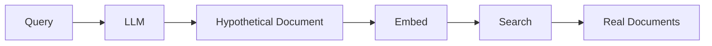
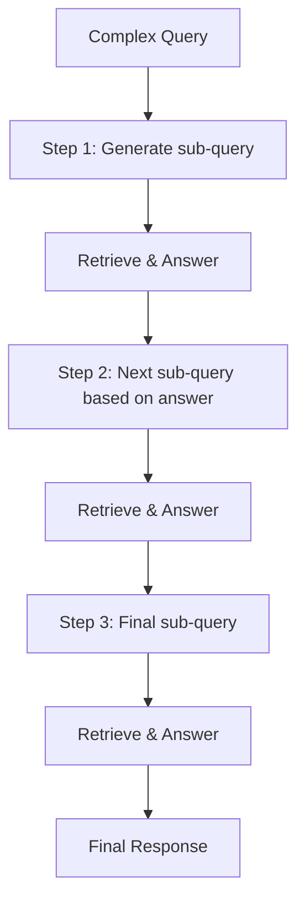

# Advanced Queries

## Introduction

Beyond basic query engines and chat interfaces, LlamaIndex provides advanced query techniques for complex information retrieval scenarios. These include query transformations, hypothetical document embeddings (HyDE), multi-step reasoning, and recursive retrieval.

These advanced patterns help when simple retrieval isn't enough—when questions are ambiguous, require multiple steps to answer, or need context from hierarchical document structures.

### What We'll Cover

- Query transformations
- HyDE (Hypothetical Document Embeddings)
- Multi-step queries
- Recursive retrieval
- Agentic queries
- Custom query pipelines

### Prerequisites

- [Chat Engines](./05-chat-engines.md)
- Understanding of retrieval and response synthesis

---

## Query Transformations

Query transformations modify the user's query before retrieval to improve results.

### Why Transform Queries?

| Problem | Transformation |
|---------|----------------|
| Vague question | Expand with context |
| Too specific | Generalize for broader retrieval |
| Multiple intents | Decompose into sub-queries |
| Ambiguous terms | Clarify meaning |

### HyDE (Hypothetical Document Embeddings)

Instead of embedding the question directly, HyDE:
1. Generates a hypothetical answer
2. Embeds that answer
3. Searches for similar real documents



**Why it works:** The hypothetical answer is semantically closer to actual documents than the question.

```python
from llama_index.core.indices.query.query_transform import HyDEQueryTransform
from llama_index.core.query_engine import TransformQueryEngine

# Create base query engine
base_engine = index.as_query_engine()

# Add HyDE transformation
hyde = HyDEQueryTransform(include_original=True)

# Wrap with transform
hyde_engine = TransformQueryEngine(
    query_engine=base_engine,
    query_transform=hyde,
)

# Query
response = hyde_engine.query("How do I optimize database queries?")
```

**Example transformation:**
```
Original query: "How do I optimize database queries?"

Hypothetical answer: "To optimize database queries, you should use 
proper indexing, avoid SELECT *, use query caching, analyze execution 
plans, and consider denormalization for read-heavy workloads..."

This hypothetical answer is embedded and used for retrieval.
```

### Query Decomposition

Break complex queries into simpler parts:

```python
from llama_index.core.indices.query.query_transform import DecomposeQueryTransform

# Create decomposition transform
decompose = DecomposeQueryTransform(verbose=True)

# Single step decomposition
result = decompose.run(
    "Compare Python and JavaScript for web development"
)

print("Decomposed queries:")
for sub_query in result.sub_queries:
    print(f"  - {sub_query}")
```

**Output:**
```
Decomposed queries:
  - What are Python's strengths for web development?
  - What are JavaScript's strengths for web development?
  - How do Python and JavaScript compare for web development?
```

---

## Multi-Step Query Engine

Iteratively refines queries based on intermediate results:

```python
from llama_index.core.indices.query.query_transform import StepDecomposeQueryTransform
from llama_index.core.query_engine import MultiStepQueryEngine

# Create step decomposition transform
step_decompose = StepDecomposeQueryTransform(
    verbose=True
)

# Multi-step engine
multi_step_engine = MultiStepQueryEngine(
    query_engine=base_engine,
    query_transform=step_decompose,
    num_steps=3,  # Maximum steps
)

response = multi_step_engine.query(
    "What are the prerequisites for understanding transformers?"
)
```

**How it works:**



---

## Recursive Retrieval

Retrieve at multiple levels of a document hierarchy:

### Small-to-Big Retrieval

Retrieve small chunks, but pass larger context to the LLM:

```python
from llama_index.core.node_parser import SentenceWindowNodeParser
from llama_index.core.postprocessor import MetadataReplacementPostProcessor

# Parser that keeps surrounding context
node_parser = SentenceWindowNodeParser.from_defaults(
    window_size=3,  # Sentences before/after
)

# Parse documents
nodes = node_parser.get_nodes_from_documents(documents)

# Index the small chunks
index = VectorStoreIndex(nodes)

# At query time, replace with larger window
postprocessor = MetadataReplacementPostProcessor(
    target_metadata_key="window"
)

query_engine = index.as_query_engine(
    node_postprocessors=[postprocessor],
)
```

**Benefits:**
- More precise retrieval (small chunks)
- Better context for generation (larger window)

### Auto-Merging Retrieval

Automatically merge child nodes into parent when enough are retrieved:

```python
from llama_index.core.node_parser import HierarchicalNodeParser
from llama_index.core.retrievers import AutoMergingRetriever
from llama_index.core.storage.docstore import SimpleDocumentStore

# Create hierarchical parser
node_parser = HierarchicalNodeParser.from_defaults(
    chunk_sizes=[2048, 512, 128]  # Parent -> Child -> Grandchild
)

nodes = node_parser.get_nodes_from_documents(documents)

# Store in docstore for merging
docstore = SimpleDocumentStore()
docstore.add_documents(nodes)

# Only index leaf nodes
leaf_nodes = [n for n in nodes if n.child_nodes is None]
index = VectorStoreIndex(leaf_nodes)

# Auto-merging retriever
retriever = AutoMergingRetriever(
    index.as_retriever(),
    docstore=docstore,
    verbose=True,
)

# When enough child nodes from same parent are retrieved,
# they automatically merge into the parent
nodes = retriever.retrieve("What is machine learning?")
```

---

## Agentic Queries

Use agents for complex, multi-step reasoning:

### Query Engine as Tool

```python
from llama_index.core.tools import QueryEngineTool
from llama_index.core.agent import ReActAgent

# Create tools from query engines
wiki_tool = QueryEngineTool.from_defaults(
    query_engine=wiki_engine,
    name="wikipedia",
    description="Search Wikipedia for general knowledge",
)

docs_tool = QueryEngineTool.from_defaults(
    query_engine=docs_engine,
    name="documentation",
    description="Search technical documentation",
)

# Create agent
agent = ReActAgent.from_tools(
    tools=[wiki_tool, docs_tool],
    verbose=True,
)

# Agent decides which tools to use
response = agent.chat(
    "What is the theory behind transformers and how do I implement one?"
)
```

### OpenAI Agent

```python
from llama_index.agent.openai import OpenAIAgent

agent = OpenAIAgent.from_tools(
    tools=[wiki_tool, docs_tool],
    verbose=True,
)

response = agent.chat("Compare RAG and fine-tuning approaches")
```

---

## Citation Query Engine

Include source citations in responses:

```python
from llama_index.core.query_engine import CitationQueryEngine

citation_engine = CitationQueryEngine.from_args(
    index,
    similarity_top_k=5,
    citation_chunk_size=512,
)

response = citation_engine.query("What is machine learning?")
print(response)
```

**Output:**
```
Machine learning is a subset of artificial intelligence that enables 
systems to learn from data [1]. It uses algorithms to identify patterns 
and make predictions without explicit programming [2].

Sources:
[1] intro_to_ml.pdf, page 1
[2] ai_fundamentals.pdf, page 5
```

---

## Retry Query Engine

Automatically retry failed queries:

```python
from llama_index.core.query_engine import RetryQueryEngine
from llama_index.core.evaluation import RelevancyEvaluator

# Create evaluator
evaluator = RelevancyEvaluator()

# Retry engine
retry_engine = RetryQueryEngine(
    query_engine=base_engine,
    evaluator=evaluator,
    max_retries=3,
)

response = retry_engine.query("Complex question here")
```

**How it works:**
1. Query the engine
2. Evaluate response quality
3. If poor quality, retry with refined query
4. Repeat until quality threshold met or max retries

---

## Custom Query Pipeline

Build custom query pipelines with `QueryPipeline`:

```python
from llama_index.core.query_pipeline import QueryPipeline, InputComponent
from llama_index.core.response_synthesizers import get_response_synthesizer

# Define pipeline components
input_component = InputComponent()
retriever = index.as_retriever(similarity_top_k=5)
synthesizer = get_response_synthesizer(response_mode="compact")

# Build pipeline
pipeline = QueryPipeline(
    modules={
        "input": input_component,
        "retriever": retriever,
        "synthesizer": synthesizer,
    },
    verbose=True,
)

# Connect modules
pipeline.add_link("input", "retriever")
pipeline.add_link("retriever", "synthesizer")
pipeline.add_link("input", "synthesizer", dest_key="query_str")

# Run pipeline
response = pipeline.run(query="What is RAG?")
```

### Pipeline with Transformation

```python
from llama_index.core.query_pipeline import QueryPipeline
from llama_index.core.postprocessor import SimilarityPostprocessor

# Add postprocessor to pipeline
postprocessor = SimilarityPostprocessor(similarity_cutoff=0.7)

pipeline = QueryPipeline(
    modules={
        "retriever": retriever,
        "postprocessor": postprocessor,
        "synthesizer": synthesizer,
    }
)

pipeline.add_chain(["retriever", "postprocessor", "synthesizer"])
```

---

## Combining Techniques

### HyDE + Reranking

```python
from llama_index.core.indices.query.query_transform import HyDEQueryTransform
from llama_index.core.query_engine import TransformQueryEngine
from llama_index.core.postprocessor import SentenceTransformerRerank

# Base engine with reranking
reranker = SentenceTransformerRerank(
    model="cross-encoder/ms-marco-MiniLM-L-2-v2",
    top_n=3,
)

base_engine = index.as_query_engine(
    similarity_top_k=10,
    node_postprocessors=[reranker],
)

# Add HyDE
hyde = HyDEQueryTransform(include_original=True)
advanced_engine = TransformQueryEngine(
    query_engine=base_engine,
    query_transform=hyde,
)
```

### Multi-Index + Sub-Questions

```python
from llama_index.core.query_engine import SubQuestionQueryEngine
from llama_index.core.tools import QueryEngineTool

# Multiple specialized engines
engines = [
    QueryEngineTool.from_defaults(
        query_engine=code_engine,
        description="Code examples and implementations",
    ),
    QueryEngineTool.from_defaults(
        query_engine=theory_engine,
        description="Theoretical explanations and concepts",
    ),
    QueryEngineTool.from_defaults(
        query_engine=tutorial_engine,
        description="Step-by-step tutorials",
    ),
]

# Sub-question engine handles decomposition
comprehensive_engine = SubQuestionQueryEngine.from_defaults(
    query_engine_tools=engines,
    verbose=True,
)
```

---

## Choosing the Right Technique

| Scenario | Technique |
|----------|-----------|
| Questions don't match document language | HyDE |
| Complex multi-part questions | SubQuestionQueryEngine |
| Need source citations | CitationQueryEngine |
| Hierarchical documents | Recursive/AutoMerging |
| Multi-step reasoning | MultiStepQueryEngine |
| Multiple specialized sources | Router + SubQuestion |
| Unreliable results | RetryQueryEngine |

---

## Best Practices

| Practice | Description |
|----------|-------------|
| **Start simple** | Use basic query engine first |
| **Add complexity gradually** | Layer techniques as needed |
| **Use verbose mode** | Debug with verbose=True |
| **Measure quality** | Compare techniques quantitatively |
| **Consider latency** | Advanced techniques are slower |
| **Monitor costs** | More LLM calls = higher cost |

---

## Common Pitfalls

| ❌ Mistake | ✅ Solution |
|-----------|------------|
| Over-engineering | Start with simple query engine |
| Too many transformation steps | Each step adds latency |
| Ignoring evaluation | Measure if techniques help |
| Not testing edge cases | Test with various query types |
| Unlimited retries | Set reasonable max_retries |

---

## Hands-on Exercise

### Your Task

Build an advanced query system using multiple techniques:
1. Implement HyDE query transformation
2. Add reranking
3. Create a multi-step query engine
4. Compare results with basic query engine

### Requirements

1. Base query engine for comparison
2. HyDE-transformed engine
3. Multi-step engine
4. Compare quality and latency

### Expected Result

```
=== Basic Query Engine ===
Response: [basic answer]
Latency: 1.2s

=== HyDE Query Engine ===
Hypothetical doc generated: [...]
Response: [improved answer]
Latency: 2.1s

=== Multi-Step Engine ===
Step 1: [sub-query]
Step 2: [refined query]
Response: [comprehensive answer]
Latency: 3.5s
```

<details>
<summary>💡 Hints</summary>

- Use `TransformQueryEngine` with `HyDEQueryTransform`
- Enable `verbose=True` to see transformations
- Use `time.time()` to measure latency
- Compare response quality manually

</details>

<details>
<summary>✅ Solution</summary>

```python
import time
from llama_index.core import VectorStoreIndex, Document
from llama_index.core.indices.query.query_transform import (
    HyDEQueryTransform,
    StepDecomposeQueryTransform,
)
from llama_index.core.query_engine import (
    TransformQueryEngine,
    MultiStepQueryEngine,
)

# Create sample documents
documents = [
    Document(text="""
    Database optimization involves multiple strategies. Indexing is 
    crucial - create indexes on frequently queried columns. Query 
    optimization includes avoiding SELECT *, using EXPLAIN to analyze 
    queries, and proper join ordering.
    """),
    Document(text="""
    Performance tuning for databases also involves connection pooling,
    query caching, and proper normalization. For read-heavy workloads,
    consider denormalization and read replicas.
    """),
    Document(text="""
    Common database anti-patterns include N+1 queries, missing indexes,
    and over-normalization. Solutions include eager loading, composite
    indexes, and strategic denormalization.
    """),
]

# Create index
index = VectorStoreIndex.from_documents(documents)

query = "How can I make my database queries faster?"

# Test 1: Basic Query Engine
print("=== Basic Query Engine ===")
basic_engine = index.as_query_engine(similarity_top_k=3)

start = time.time()
response = basic_engine.query(query)
basic_time = time.time() - start

print(f"Response: {response.response[:200]}...")
print(f"Latency: {basic_time:.2f}s\n")

# Test 2: HyDE Query Engine
print("=== HyDE Query Engine ===")
hyde = HyDEQueryTransform(include_original=True)
hyde_engine = TransformQueryEngine(
    query_engine=basic_engine,
    query_transform=hyde,
)

start = time.time()
response = hyde_engine.query(query)
hyde_time = time.time() - start

print(f"Response: {response.response[:200]}...")
print(f"Latency: {hyde_time:.2f}s\n")

# Test 3: Multi-Step Engine
print("=== Multi-Step Query Engine ===")
step_decompose = StepDecomposeQueryTransform(verbose=True)

multi_step_engine = MultiStepQueryEngine(
    query_engine=basic_engine,
    query_transform=step_decompose,
    num_steps=2,
)

start = time.time()
response = multi_step_engine.query(query)
multi_time = time.time() - start

print(f"Response: {response.response[:200]}...")
print(f"Latency: {multi_time:.2f}s\n")

# Summary
print("=== Comparison ===")
print(f"Basic:      {basic_time:.2f}s")
print(f"HyDE:       {hyde_time:.2f}s (+{hyde_time - basic_time:.2f}s)")
print(f"Multi-Step: {multi_time:.2f}s (+{multi_time - basic_time:.2f}s)")
```

</details>

---

## Summary

✅ **Query transformations** modify queries for better retrieval

✅ **HyDE** generates hypothetical answers for semantic matching

✅ **Multi-step queries** iteratively refine understanding

✅ **Recursive retrieval** handles hierarchical documents

✅ **Agentic queries** use tools for complex reasoning

✅ **Citation engines** include source references

✅ Start simple and add complexity as needed

**Congratulations!** You've completed the Query Engines lesson series.

---

## Further Reading

- [Query Transformations](https://developers.llamaindex.ai/python/examples/query_transformations/)
- [HyDE](https://developers.llamaindex.ai/python/examples/query_transformations/hyde/)
- [Auto-Merging Retrieval](https://developers.llamaindex.ai/python/examples/retrievers/auto_merging_retriever/)
- [Query Pipeline](https://developers.llamaindex.ai/python/framework/module_guides/workflow/query_pipeline/)

---

<!-- 
Sources Consulted:
- LlamaIndex Query Transformations: https://developers.llamaindex.ai/python/examples/query_transformations/
- Module Guides: https://developers.llamaindex.ai/python/framework/module_guides/deploying/query_engine/modules/
- Advanced Retrieval: https://developers.llamaindex.ai/python/framework/module_guides/querying/retriever/retrievers/
-->
