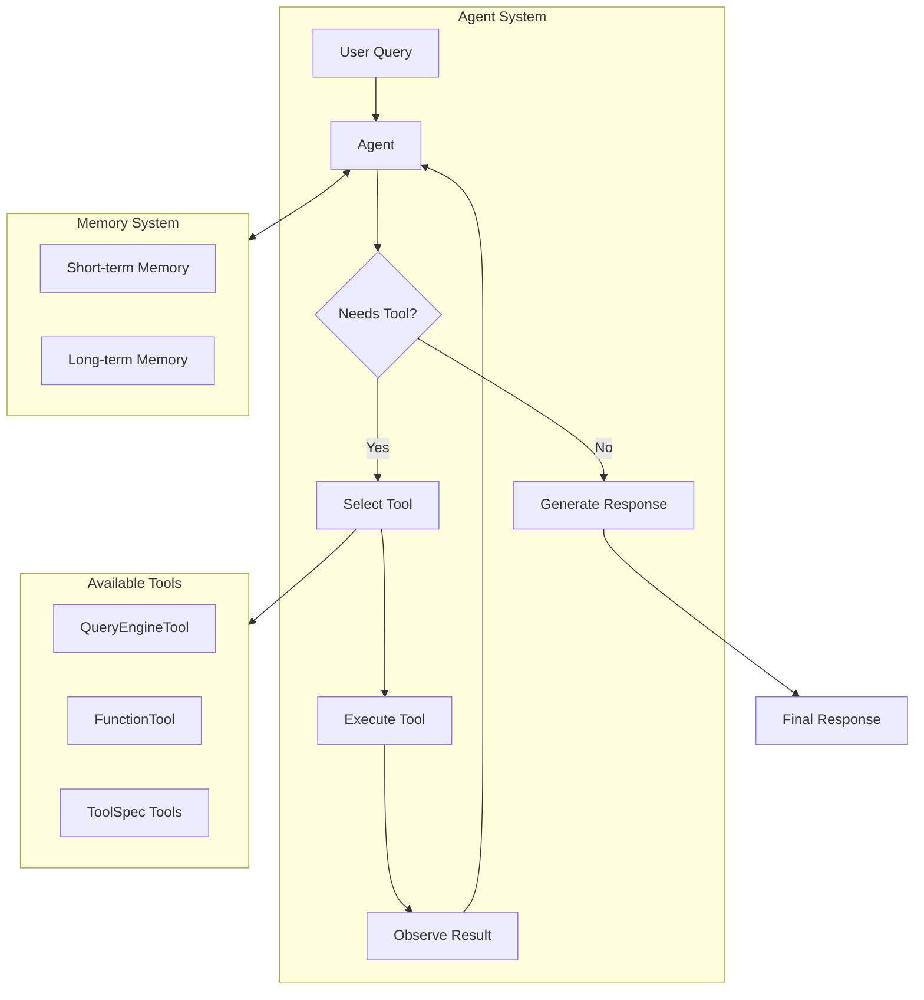
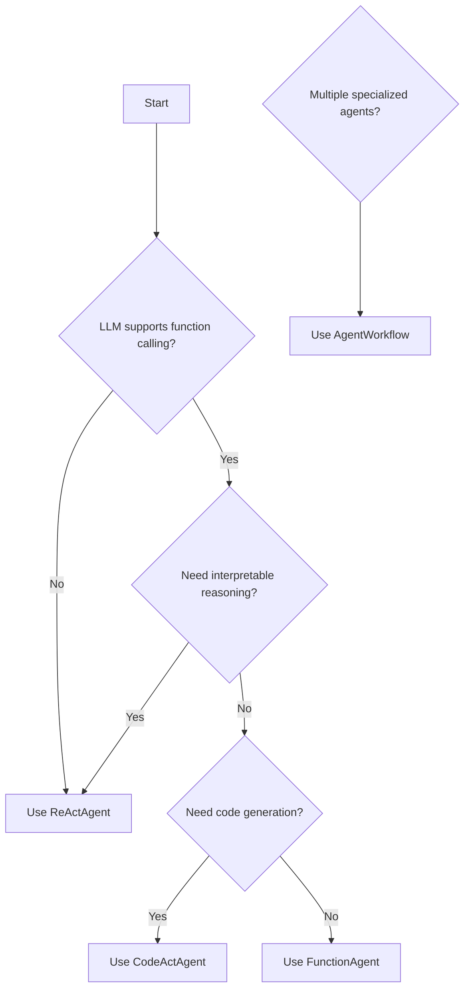
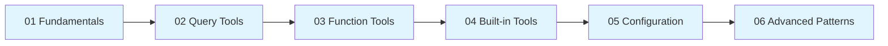

# 8.11 LlamaIndex Agents - Overview

## Introduction

Agents represent one of the most powerful paradigms in AI application development—semi-autonomous systems that can reason about tasks, select appropriate tools, and execute complex multi-step workflows. Unlike simple query-response systems, agents make decisions about *how* to solve problems, adapting their approach based on intermediate results.

In this lesson, we'll explore LlamaIndex's agent framework, which provides both high-level abstractions for rapid development and low-level building blocks for custom agent architectures. We'll cover everything from basic function-calling agents to sophisticated multi-agent systems that can handle complex, real-world tasks.

### Why Agents Matter for AI Applications

| Capability | Query Engine | Agent |
|------------|--------------|-------|
| Single-step retrieval | ✅ | ✅ |
| Multi-step reasoning | ❌ | ✅ |
| Dynamic tool selection | ❌ | ✅ |
| Self-correction | ❌ | ✅ |
| Complex task decomposition | ❌ | ✅ |
| Memory across interactions | Limited | ✅ |

> **🤖 AI Context:** Agents bridge the gap between LLMs and real-world applications by enabling autonomous decision-making, tool usage, and iterative problem-solving—essential capabilities for production AI systems.

---

## What You'll Learn

This lesson covers six comprehensive topics:

### [01 - Agent Fundamentals](./01-agent-fundamentals.md)
Build your foundation with core agent concepts:
- The ReAct (Reasoning + Acting) agent pattern
- Understanding the agent reasoning loop
- FunctionAgent vs ReActAgent comparison
- Tool integration and observation handling
- Streaming agent responses and events

### [02 - Query Engine Tools](./02-query-engine-tools.md)
Connect agents to your knowledge bases:
- Creating QueryEngineTool from existing engines
- Writing effective tool descriptions
- Managing multiple query engines
- Tool selection strategies
- Configuring tool behavior with return_direct

### [03 - Function Tools](./03-function-tools.md)
Create custom tools for any functionality:
- FunctionTool basics and creation patterns
- Using Annotated types for parameter descriptions
- Async tools for concurrent operations
- Tool parameter validation and return types
- Debugging tool schemas

### [04 - Built-in Tools](./04-built-in-tools.md)
Leverage the LlamaIndex ecosystem:
- LlamaHub tool specs and integrations
- Web search tools (DuckDuckGo, Brave, Tavily)
- Database and API tools
- Utility tools for data handling
- Creating and contributing custom tool specs

### [05 - Agent Configuration](./05-agent-configuration.md)
Fine-tune agent behavior for production:
- System prompts and agent personality
- Memory configuration (short-term and long-term)
- Token limits and context management
- Timeout and iteration controls
- Error handling and recovery strategies
- Streaming output and event handling

### [06 - Advanced Agent Patterns](./06-advanced-agent-patterns.md)
Build sophisticated agent systems:
- Multi-agent architectures with AgentWorkflow
- Orchestrator pattern (agents as tools)
- Custom planners and DIY orchestration
- Human-in-the-loop interactions
- Agent state persistence and recovery
- Evaluation and testing strategies

---

## Prerequisites

Before starting this lesson, ensure you understand:

- **LlamaIndex fundamentals** from [Lesson 08](../08-llamaindex-fundamentals/)
- **Data ingestion** from [Lesson 09](../09-data-ingestion/)
- **Query engines** from [Lesson 10](../10-query-engines/)
- **Python async/await** patterns
- **Basic understanding of function calling** in LLMs

### Required Packages

```bash
# Core agent dependencies
pip install llama-index-core llama-index-llms-openai

# For examples in this lesson
pip install llama-index-tools-yahoo-finance
pip install llama-index-tools-duckduckgo
pip install python-dotenv
```

### Environment Setup

```python
import os
from dotenv import load_dotenv

load_dotenv()

# Required: OpenAI API key for examples
os.environ["OPENAI_API_KEY"] = "your-key-here"
```

---

## Agent Architecture Overview



### Key Components

| Component | Purpose | LlamaIndex Class |
|-----------|---------|------------------|
| Agent | Orchestrates reasoning and tool use | `FunctionAgent`, `ReActAgent` |
| Tools | Extend agent capabilities | `FunctionTool`, `QueryEngineTool` |
| Memory | Maintains conversation context | `Memory`, `ChatMemoryBuffer` |
| LLM | Provides reasoning capabilities | `OpenAI`, `Anthropic`, etc. |
| Context | Manages workflow state | `Context` |

---

## Agent Types in LlamaIndex

LlamaIndex provides several agent implementations, each suited for different use cases:

| Agent Type | Description | Best For |
|------------|-------------|----------|
| `FunctionAgent` | Uses LLM function calling | Modern LLMs with native tool support |
| `ReActAgent` | Reasoning + Acting prompting | Any LLM, interpretable reasoning |
| `CodeActAgent` | Generates and executes code | Complex computations, dynamic logic |
| `AgentWorkflow` | Multi-agent orchestration | Complex, multi-step workflows |

### Choosing the Right Agent



---

## Quick Start Example

Here's a minimal agent to get you started:

```python
import asyncio
from llama_index.core.agent.workflow import FunctionAgent
from llama_index.llms.openai import OpenAI


# Define a simple tool
def get_weather(city: str) -> str:
    """Get the current weather for a city."""
    # Simulated response
    return f"The weather in {city} is sunny, 72°F"


# Create the agent
agent = FunctionAgent(
    tools=[get_weather],
    llm=OpenAI(model="gpt-4o-mini"),
    system_prompt="You are a helpful weather assistant."
)


# Run the agent
async def main():
    response = await agent.run("What's the weather in San Francisco?")
    print(response)


if __name__ == "__main__":
    asyncio.run(main())
```

**Output:**
```
The weather in San Francisco is sunny, 72°F.
```

> **Note:** All LlamaIndex agents use async patterns. Wrap calls in `asyncio.run()` for script execution.

---

## Lesson Roadmap



| Lesson | Estimated Time | Difficulty |
|--------|---------------|------------|
| Agent Fundamentals | 45 min | ⭐⭐ |
| Query Engine Tools | 30 min | ⭐⭐ |
| Function Tools | 40 min | ⭐⭐ |
| Built-in Tools | 35 min | ⭐⭐ |
| Agent Configuration | 45 min | ⭐⭐⭐ |
| Advanced Patterns | 60 min | ⭐⭐⭐⭐ |

---

## Key Terminology

| Term | Definition |
|------|------------|
| **Agent** | An LLM-powered system that autonomously reasons and takes actions |
| **Tool** | A function or capability the agent can invoke |
| **ReAct** | Reasoning + Acting pattern for step-by-step problem solving |
| **Tool Calling** | LLM capability to invoke structured functions |
| **Observation** | The result of a tool execution returned to the agent |
| **Memory** | Storage for conversation history and learned information |
| **Workflow** | A structured sequence of agent steps and decisions |
| **Handoff** | Transfer of control between agents in multi-agent systems |

---

## Summary

✅ Agents enable autonomous, multi-step reasoning with tool usage

✅ LlamaIndex provides FunctionAgent, ReActAgent, and AgentWorkflow

✅ Tools extend agent capabilities (QueryEngineTool, FunctionTool, ToolSpecs)

✅ Memory maintains context across agent interactions

✅ Multi-agent systems handle complex workflows through orchestration

**Next:** [Agent Fundamentals →](./01-agent-fundamentals.md)

---

## Further Reading

- [LlamaIndex Agents Documentation](https://developers.llamaindex.ai/python/framework/module_guides/deploying/agents/)
- [Building an Agent Tutorial](https://developers.llamaindex.ai/python/framework/understanding/agent/)
- [LlamaHub Tools](https://llamahub.ai/?tab=tools)
- [Multi-agent Patterns Guide](https://developers.llamaindex.ai/python/framework/understanding/agent/multi_agent/)

---

<!-- 
Sources Consulted:
- LlamaIndex Agents: https://developers.llamaindex.ai/python/framework/module_guides/deploying/agents/
- Building an Agent: https://developers.llamaindex.ai/python/framework/understanding/agent/
- Multi-agent Patterns: https://developers.llamaindex.ai/python/framework/understanding/agent/multi_agent/
- LlamaHub: https://llamahub.ai/
-->
