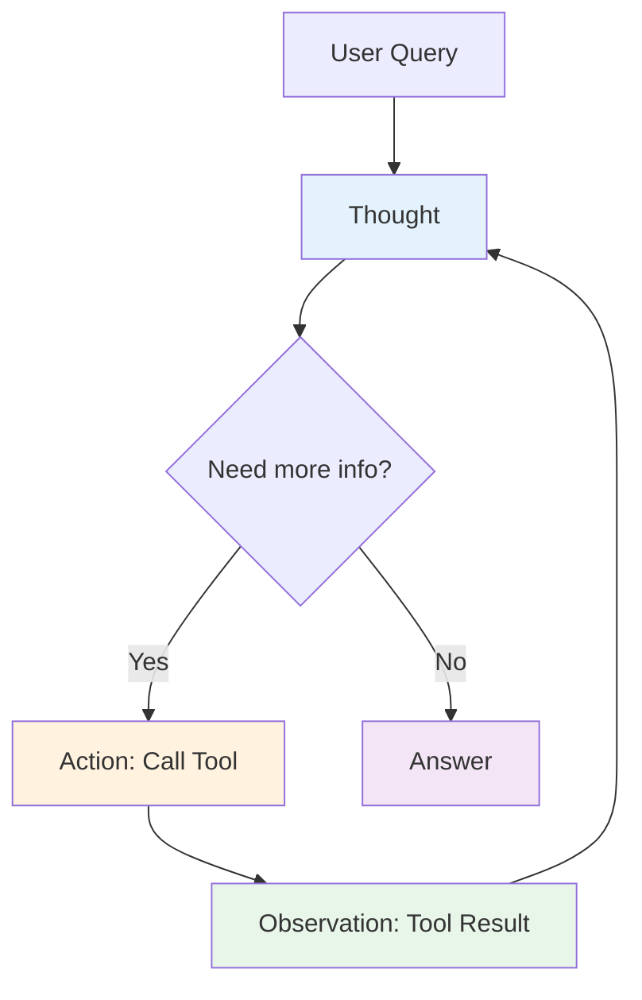
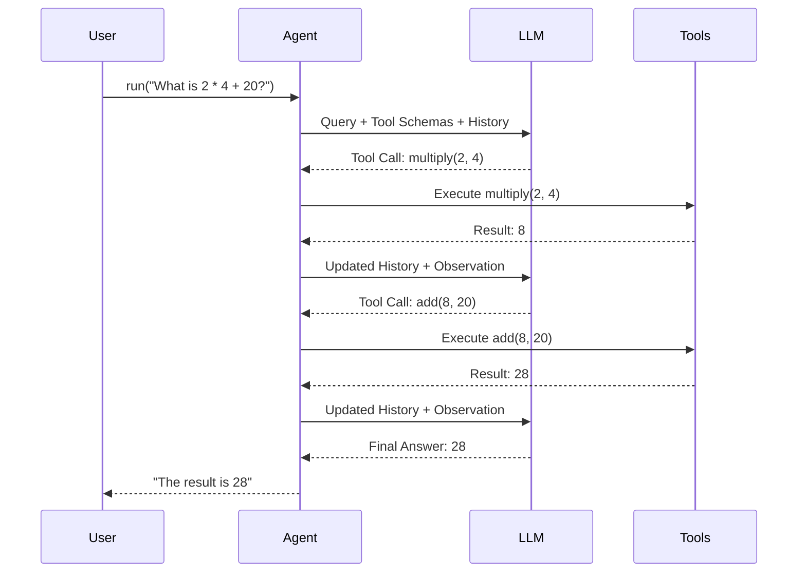

# Agent Fundamentals

## Introduction

At the heart of LlamaIndex's agent framework lies a powerful concept: giving LLMs the ability to reason about problems and take actions to solve them. Unlike query engines that follow a fixed retrieval-synthesis pattern, agents dynamically decide which tools to use, when to use them, and how to combine their results.

In this lesson, we'll build a solid understanding of agent fundamentals—how agents reason, the loop they follow, and the different agent types available in LlamaIndex. By the end, you'll be able to create agents that can solve complex problems through iterative reasoning and tool use.

### What We'll Cover

- Understanding the ReAct (Reasoning + Acting) pattern
- The agent reasoning loop and execution flow
- FunctionAgent vs ReActAgent comparison
- Tool integration and observation handling
- Streaming agent responses and events
- Managing agent context and sessions

### Prerequisites

- Completed [LlamaIndex Fundamentals](../08-llamaindex-fundamentals/)
- Understanding of async/await patterns in Python
- OpenAI API key configured

---

## The ReAct Pattern

The ReAct (Reasoning + Acting) pattern, introduced in the paper "ReAct: Synergizing Reasoning and Acting in Language Models," forms the conceptual foundation for agent behavior. It interleaves reasoning traces with actions, allowing the agent to:

1. **Think** about what it needs to do
2. **Act** by calling a tool
3. **Observe** the result
4. **Repeat** until the task is complete



### ReAct Prompt Structure

The ReAct agent uses a specific prompt format that guides the LLM through this cycle:

```
Thought: I need to find the current stock price for NVIDIA.
Action: stock_lookup
Action Input: {"symbol": "NVDA"}

Observation: The current price of NVDA is $128.41

Thought: I now have the information I need.
Answer: The current stock price of NVIDIA (NVDA) is $128.41.
```

> **🤖 AI Context:** ReAct works with any LLM because it uses natural language prompting rather than structured API calls. This makes it ideal for open-source models that don't support function calling.

---

## Agent Types in LlamaIndex

LlamaIndex provides several agent implementations, each optimized for different scenarios:

### FunctionAgent

The `FunctionAgent` leverages the native function/tool calling capabilities built into modern LLMs like GPT-4, Claude, and Gemini.

```python
from llama_index.core.agent.workflow import FunctionAgent
from llama_index.llms.openai import OpenAI


def multiply(a: int, b: int) -> int:
    """Multiply two integers and return the result."""
    return a * b


def add(a: int, b: int) -> int:
    """Add two integers and return the result."""
    return a + b


agent = FunctionAgent(
    tools=[multiply, add],
    llm=OpenAI(model="gpt-4o-mini"),
    system_prompt="You are a helpful calculator assistant."
)
```

**How it works:**
1. Tools are converted to JSON schemas
2. LLM receives schemas alongside the user query
3. LLM returns structured tool calls (not text)
4. Agent executes tools and returns results to LLM

### ReActAgent

The `ReActAgent` uses prompting to achieve reasoning and acting, working with any LLM:

```python
from llama_index.core.agent.workflow import ReActAgent
from llama_index.llms.openai import OpenAI

agent = ReActAgent(
    tools=[multiply, add],
    llm=OpenAI(model="gpt-4o-mini"),
    system_prompt="You are a helpful calculator assistant."
)
```

**How it works:**
1. A ReAct prompt template guides the LLM
2. LLM generates thought/action text
3. Agent parses the text to extract tool calls
4. Results are formatted as observations

### Comparison Table

| Feature | FunctionAgent | ReActAgent |
|---------|---------------|------------|
| LLM requirement | Function calling support | Any LLM |
| Speed | Faster (structured calls) | Slower (text parsing) |
| Reliability | More reliable | May have parsing errors |
| Interpretability | Less visible reasoning | Clear thought process |
| Token usage | Lower | Higher (prompt overhead) |
| Best for | Production, OpenAI/Anthropic | Debugging, open-source LLMs |

---

## The Agent Loop

Understanding the agent loop is crucial for building effective agents. Here's what happens when you call an agent:



### Step-by-Step Breakdown

1. **Initial Query**: User provides a question or task
2. **LLM Reasoning**: Agent sends query + tools to LLM
3. **Tool Selection**: LLM decides which tool (if any) to use
4. **Tool Execution**: Agent calls the selected tool
5. **Observation**: Result is added to conversation history
6. **Loop or Answer**: LLM either calls more tools or provides final answer

### Example: Tracing the Agent Loop

```python
import asyncio
from llama_index.core.agent.workflow import ReActAgent, AgentStream, ToolCallResult
from llama_index.core.workflow import Context
from llama_index.llms.openai import OpenAI


def multiply(a: int, b: int) -> int:
    """Multiply two integers and return the result."""
    return a * b


def add(a: int, b: int) -> int:
    """Add two integers and return the result."""
    return a + b


llm = OpenAI(model="gpt-4o-mini")
agent = ReActAgent(tools=[multiply, add], llm=llm)

# Create context for session management
ctx = Context(agent)


async def main():
    handler = agent.run("What is 20 + (2 * 4)?", ctx=ctx)
    
    # Stream events to see the agent's reasoning
    async for event in handler.stream_events():
        if isinstance(event, ToolCallResult):
            print(f"\n🔧 Tool: {event.tool_name}")
            print(f"   Args: {event.tool_kwargs}")
            print(f"   Result: {event.tool_output}")
        elif isinstance(event, AgentStream):
            print(event.delta, end="", flush=True)
    
    response = await handler
    print(f"\n\n✅ Final: {response}")


if __name__ == "__main__":
    asyncio.run(main())
```

**Output:**
```
Thought: The current language of the user is: English. I need to use a tool to help me answer the question.
Action: multiply
Action Input: {"a": 2, "b": 4}

🔧 Tool: multiply
   Args: {'a': 2, 'b': 4}
   Result: 8

Thought: Now I have the result of the multiplication, which is 8. I will add this to 20.
Action: add
Action Input: {"a": 20, "b": 8}

🔧 Tool: add
   Args: {'a': 20, 'b': 8}
   Result: 28

Thought: I can answer without using any more tools.
Answer: The result of 20 + (2 * 4) is 28.

✅ Final: The result of 20 + (2 * 4) is 28.
```

---

## Creating Your First Agent

Let's build a complete agent step by step:

### Step 1: Define Tools

Tools are Python functions that the agent can call. The docstring becomes the tool description, which the LLM uses to decide when to use the tool:

```python
from typing import Annotated


def get_weather(
    location: Annotated[str, "City and state, e.g., 'San Francisco, CA'"]
) -> str:
    """Get the current weather for a location."""
    # In production, this would call a weather API
    weather_data = {
        "San Francisco, CA": "Foggy, 58°F",
        "New York, NY": "Sunny, 72°F",
        "Seattle, WA": "Rainy, 52°F",
    }
    return weather_data.get(location, f"Weather data not available for {location}")


def get_time(
    timezone: Annotated[str, "Timezone name, e.g., 'America/New_York'"]
) -> str:
    """Get the current time in a specific timezone."""
    from datetime import datetime
    import pytz
    
    try:
        tz = pytz.timezone(timezone)
        current_time = datetime.now(tz)
        return current_time.strftime("%I:%M %p %Z")
    except Exception:
        return f"Invalid timezone: {timezone}"
```

> **💡 Tip:** Use `Annotated` types to provide clear parameter descriptions. This helps the LLM understand what values to pass.

### Step 2: Create the Agent

```python
from llama_index.core.agent.workflow import FunctionAgent
from llama_index.llms.openai import OpenAI

agent = FunctionAgent(
    tools=[get_weather, get_time],
    llm=OpenAI(model="gpt-4o-mini"),
    system_prompt="""You are a helpful assistant that provides weather 
    and time information. Always be concise and accurate.""",
)
```

### Step 3: Run the Agent

```python
import asyncio


async def main():
    # Simple query
    response = await agent.run(
        "What's the weather in San Francisco and what time is it in New York?"
    )
    print(response)


if __name__ == "__main__":
    asyncio.run(main())
```

**Output:**
```
The weather in San Francisco is foggy at 58°F. The current time in 
New York is 3:45 PM EST.
```

---

## Managing Agent Context

The `Context` object maintains state across agent interactions, enabling multi-turn conversations:

```python
from llama_index.core.workflow import Context


async def multi_turn_conversation():
    agent = FunctionAgent(
        tools=[get_weather, get_time],
        llm=OpenAI(model="gpt-4o-mini"),
        system_prompt="You are a helpful assistant.",
    )
    
    # Create a persistent context
    ctx = Context(agent)
    
    # First turn
    response1 = await agent.run(
        "What's the weather in Seattle?",
        ctx=ctx
    )
    print(f"Turn 1: {response1}")
    
    # Second turn - agent remembers the conversation
    response2 = await agent.run(
        "How about New York?",
        ctx=ctx
    )
    print(f"Turn 2: {response2}")
    
    # Third turn - can reference previous context
    response3 = await agent.run(
        "Which city is warmer?",
        ctx=ctx
    )
    print(f"Turn 3: {response3}")
```

**Output:**
```
Turn 1: The weather in Seattle is rainy at 52°F.
Turn 2: The weather in New York is sunny at 72°F.
Turn 3: New York is warmer at 72°F compared to Seattle at 52°F.
```

### Context Serialization

You can save and restore context for persistence:

```python
# Serialize context to dictionary
ctx_dict = ctx.to_dict()

# Later: restore context
restored_ctx = Context.from_dict(agent, ctx_dict)

# Continue conversation
response = await agent.run("Remind me what cities we discussed?", ctx=restored_ctx)
```

---

## Streaming Agent Output

Streaming provides real-time visibility into agent reasoning:

```python
from llama_index.core.agent.workflow import AgentStream, ToolCallResult, ToolCall


async def stream_agent_output():
    handler = agent.run("What's the weather in all three cities?")
    
    async for event in handler.stream_events():
        if isinstance(event, ToolCall):
            # Tool is about to be called
            print(f"\n📞 Calling: {event.tool_name}({event.tool_kwargs})")
        
        elif isinstance(event, ToolCallResult):
            # Tool completed
            print(f"✅ Result: {event.tool_output.content}")
        
        elif isinstance(event, AgentStream):
            # Text token from LLM
            print(event.delta, end="", flush=True)
    
    # Get final response
    final_response = await handler
    return final_response
```

### Stream Event Types

| Event Type | Description | Use Case |
|------------|-------------|----------|
| `AgentStream` | Streaming text tokens | Display real-time LLM output |
| `ToolCall` | Tool invocation starting | Show loading indicator |
| `ToolCallResult` | Tool execution completed | Display tool output |
| `AgentInput` | Agent received input | Logging, debugging |
| `AgentOutput` | Agent produced output | Logging, metrics |

---

## Observation Handling

Observations are the results of tool executions that get fed back to the agent:

```python
from llama_index.core.tools import ToolOutput


# Tool results are wrapped in ToolOutput
tool_output = ToolOutput(
    content="The weather is sunny",
    tool_name="get_weather",
    raw_input={"args": (), "kwargs": {"location": "NYC"}},
    raw_output="The weather is sunny",
    is_error=False
)
```

### Handling Tool Errors

Agents can gracefully handle tool failures:

```python
def risky_operation(data: str) -> str:
    """Perform an operation that might fail."""
    if not data:
        raise ValueError("Data cannot be empty")
    return f"Processed: {data}"


# The agent will receive error information and can adapt
agent = FunctionAgent(
    tools=[risky_operation],
    llm=OpenAI(model="gpt-4o-mini"),
    system_prompt="If a tool fails, explain the error and suggest alternatives."
)
```

When a tool raises an exception, the agent receives an observation with `is_error=True` and can decide how to proceed.

---

## Best Practices

| Practice | Description |
|----------|-------------|
| Clear tool descriptions | Write specific, action-oriented docstrings |
| Use type hints | Enable proper schema generation |
| Annotate parameters | Provide context for LLM parameter selection |
| Handle errors gracefully | Return informative error messages |
| Stream for UX | Show progress for long-running operations |
| Use context | Maintain conversation state across turns |
| Limit tool count | 5-10 tools is often optimal |

---

## Common Pitfalls

| ❌ Mistake | ✅ Solution |
|-----------|-------------|
| Vague tool descriptions | Write specific descriptions: "Get weather for a city" not "Get data" |
| Missing type hints | Always include types: `def tool(city: str) -> str:` |
| Too many tools | Group related tools or use tool selection strategies |
| Ignoring async | Always use `await` with agent.run() |
| No error handling | Wrap risky operations in try/except |
| Skipping streaming | Use streaming for better user experience |

---

## Hands-on Exercise

### Your Task

Build a personal assistant agent that can:
1. Check the weather in multiple cities
2. Perform basic math calculations
3. Get current time in different timezones
4. Maintain conversation context across multiple turns

### Requirements

1. Create at least 4 tools (weather, math operations, time)
2. Use `FunctionAgent` with `gpt-4o-mini`
3. Implement streaming to show agent reasoning
4. Demonstrate multi-turn conversation using Context
5. Handle at least one error case gracefully

### Expected Result

A working agent that can handle queries like:
- "What's the weather in Boston and what's 15% of $200?"
- "Is it later in Tokyo or London right now?"
- "Based on the temperatures you told me, which city is best for a picnic?"

<details>
<summary>💡 Hints (click to expand)</summary>

1. Use the `Annotated` type for clear parameter descriptions
2. Create a `calculate` tool that can handle multiple operations
3. Use `pytz` for timezone handling
4. Store city data in a dictionary for weather simulation
5. Use `Context` to track conversation history

</details>

<details>
<summary>✅ Solution (click to expand)</summary>

```python
import asyncio
from typing import Annotated
from datetime import datetime

from llama_index.core.agent.workflow import FunctionAgent, AgentStream, ToolCallResult
from llama_index.core.workflow import Context
from llama_index.llms.openai import OpenAI


# Define tools
def get_weather(
    city: Annotated[str, "City name, e.g., 'Boston' or 'Tokyo'"]
) -> str:
    """Get the current weather for a city."""
    weather_data = {
        "boston": "Partly cloudy, 65°F",
        "tokyo": "Clear, 78°F",
        "london": "Overcast, 55°F",
        "paris": "Sunny, 70°F",
        "sydney": "Mild, 68°F",
    }
    city_lower = city.lower()
    return weather_data.get(city_lower, f"Weather unavailable for {city}")


def calculate(
    expression: Annotated[str, "Math expression like '15 * 200 / 100' or '42 + 17'"]
) -> str:
    """Evaluate a mathematical expression safely."""
    try:
        # Safe evaluation of math expressions
        allowed_chars = set("0123456789+-*/().% ")
        if not all(c in allowed_chars for c in expression):
            return "Error: Invalid characters in expression"
        
        result = eval(expression)
        return f"{expression} = {result}"
    except Exception as e:
        return f"Error calculating: {str(e)}"


def get_time(
    city: Annotated[str, "City name to get current time for"]
) -> str:
    """Get the current local time for a city."""
    import pytz
    
    timezone_map = {
        "boston": "America/New_York",
        "tokyo": "Asia/Tokyo",
        "london": "Europe/London",
        "paris": "Europe/Paris",
        "sydney": "Australia/Sydney",
    }
    
    city_lower = city.lower()
    tz_name = timezone_map.get(city_lower)
    
    if not tz_name:
        return f"Timezone unknown for {city}"
    
    try:
        tz = pytz.timezone(tz_name)
        current_time = datetime.now(tz)
        return f"Current time in {city}: {current_time.strftime('%I:%M %p %Z')}"
    except Exception as e:
        return f"Error getting time: {str(e)}"


def compare_temperatures(
    city1: Annotated[str, "First city to compare"],
    city2: Annotated[str, "Second city to compare"]
) -> str:
    """Compare temperatures between two cities."""
    # Get weather for both cities
    weather1 = get_weather(city1)
    weather2 = get_weather(city2)
    
    return f"{city1}: {weather1}\n{city2}: {weather2}\nCompare the temperatures to determine which is warmer."


# Create agent
agent = FunctionAgent(
    tools=[get_weather, calculate, get_time, compare_temperatures],
    llm=OpenAI(model="gpt-4o-mini"),
    system_prompt="""You are a helpful personal assistant that can:
    - Check weather in various cities
    - Perform calculations
    - Tell time in different cities
    
    Be concise and friendly. When comparing, always state the conclusion clearly."""
)


async def main():
    ctx = Context(agent)
    
    # Turn 1: Weather and calculation
    print("=" * 50)
    print("Turn 1: Weather + Calculation")
    print("=" * 50)
    
    handler = agent.run(
        "What's the weather in Boston and what's 15% of $200?",
        ctx=ctx
    )
    
    async for event in handler.stream_events():
        if isinstance(event, ToolCallResult):
            print(f"\n🔧 {event.tool_name}: {event.tool_output.content}")
        elif isinstance(event, AgentStream):
            print(event.delta, end="", flush=True)
    
    response1 = await handler
    print(f"\n\n📝 Response: {response1}\n")
    
    # Turn 2: Time comparison
    print("=" * 50)
    print("Turn 2: Time Comparison")
    print("=" * 50)
    
    response2 = await agent.run(
        "Is it later in Tokyo or London right now?",
        ctx=ctx
    )
    print(f"📝 Response: {response2}\n")
    
    # Turn 3: Context-aware question
    print("=" * 50)
    print("Turn 3: Using Previous Context")
    print("=" * 50)
    
    response3 = await agent.run(
        "Given the weather you told me about, which city would be best for an outdoor picnic?",
        ctx=ctx
    )
    print(f"📝 Response: {response3}\n")


if __name__ == "__main__":
    asyncio.run(main())
```

</details>

### Bonus Challenges

- [ ] Add a tool that fetches real data from an API
- [ ] Implement a CodeActAgent for dynamic calculations
- [ ] Create a tool that returns structured data (JSON)
- [ ] Add verbose logging to trace the full agent loop

---

## Summary

✅ The ReAct pattern interleaves reasoning (Thought) with actions (Tool calls)

✅ FunctionAgent uses native LLM function calling for reliability

✅ ReActAgent works with any LLM through prompting

✅ The agent loop: Query → Reason → Act → Observe → Repeat → Answer

✅ Context maintains conversation state across multiple turns

✅ Streaming provides real-time visibility into agent reasoning

**Next:** [Query Engine Tools →](./02-query-engine-tools.md)

---

## Further Reading

- [ReAct Paper](https://arxiv.org/abs/2210.03629) - Original research paper
- [LlamaIndex Agent Examples](https://developers.llamaindex.ai/python/examples/agent/react_agent)
- [Manual Agent Construction](https://developers.llamaindex.ai/python/framework/module_guides/deploying/agents/)

---

<!-- 
Sources Consulted:
- LlamaIndex Agents: https://developers.llamaindex.ai/python/framework/module_guides/deploying/agents/
- ReActAgent Example: https://developers.llamaindex.ai/python/examples/agent/react_agent
- Building an Agent: https://developers.llamaindex.ai/python/framework/understanding/agent/
-->
