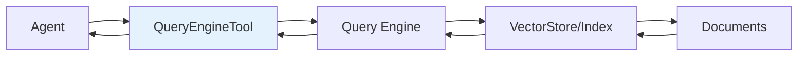
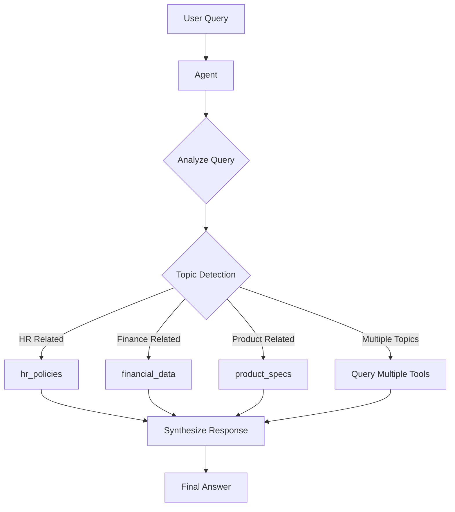

# Query Engine Tools

## Introduction

One of the most powerful capabilities of LlamaIndex agents is their ability to use query engines as tools. This bridges the gap between conversational AI and structured knowledge retrieval, allowing agents to access your indexed data, search documents, and synthesize information from multiple sources—all while reasoning about when and how to use these capabilities.

In this lesson, we'll explore how to wrap query engines as tools, write effective descriptions that guide tool selection, and configure agents to work with multiple knowledge bases simultaneously.

### What We'll Cover

- Creating QueryEngineTool from existing query engines
- Writing effective tool descriptions for accurate selection
- Managing multiple query engines as tools
- Tool configuration options (return_direct, metadata)
- Building a multi-document research agent

### Prerequisites

- Completed [Query Engines lesson](../10-query-engines/)
- Understanding of agent fundamentals from the previous lesson
- Familiarity with VectorStoreIndex

---

## QueryEngineTool Basics

The `QueryEngineTool` wraps any query engine, transforming it into a tool that agents can invoke:



### Creating Your First QueryEngineTool

```python
from llama_index.core import VectorStoreIndex, SimpleDirectoryReader
from llama_index.core.tools import QueryEngineTool
from llama_index.llms.openai import OpenAI

# Load and index documents
documents = SimpleDirectoryReader("./data/company_docs").load_data()
index = VectorStoreIndex.from_documents(documents)

# Create query engine
query_engine = index.as_query_engine(similarity_top_k=3)

# Wrap as tool
company_tool = QueryEngineTool.from_defaults(
    query_engine=query_engine,
    name="company_knowledge",
    description="Useful for answering questions about company policies, "
                "procedures, and internal documentation. Use this tool when "
                "the user asks about HR policies, benefits, or company guidelines."
)
```

### The from_defaults Constructor

| Parameter | Type | Description | Default |
|-----------|------|-------------|---------|
| `query_engine` | `BaseQueryEngine` | The query engine to wrap | Required |
| `name` | `str` | Tool name (alphanumeric + underscore) | Function name |
| `description` | `str` | When to use this tool | Auto-generated |
| `return_direct` | `bool` | Return tool output without LLM rewriting | `False` |

---

## Writing Effective Tool Descriptions

The tool description is critical—it's what the LLM uses to decide when to invoke the tool. Poor descriptions lead to incorrect tool selection or missed opportunities.

### Description Anatomy

A good tool description answers three questions:

1. **What does it do?** (capability)
2. **What data does it access?** (scope)
3. **When should it be used?** (trigger conditions)

```python
# ❌ Bad: Vague and unhelpful
bad_description = "Query the database"

# ✅ Good: Specific and actionable
good_description = """
Searches the 2023 financial reports database for revenue, expenses, 
profit margins, and quarterly performance data. Use this tool when the 
user asks about:
- Company financial performance
- Revenue or expense figures
- Year-over-year comparisons
- Quarterly earnings data

Do NOT use for: stock prices, market analysis, or competitor information.
"""
```

### Description Best Practices

| Practice | Example |
|----------|---------|
| Be specific about data scope | "Contains employee handbook from 2020-2024" |
| List trigger keywords | "Use for questions about: benefits, PTO, policies" |
| Specify limitations | "Does NOT include salary or compensation data" |
| Include time bounds | "Financial data from Q1 2023 to Q4 2024" |
| Mention data format | "Returns structured financial tables and summaries" |

### Template for Tool Descriptions

```python
description_template = """
[CAPABILITY]: Searches the {data_source} for {types_of_information}.

[USE WHEN]: The user asks about:
- {trigger_1}
- {trigger_2}
- {trigger_3}

[DO NOT USE FOR]: {exclusions}

[DATA SCOPE]: {time_range}, {data_limitations}
"""
```

---

## Multiple Query Engine Tools

Real-world agents often need access to multiple knowledge bases. Here's how to configure an agent with several QueryEngineTools:

```python
from llama_index.core.agent.workflow import FunctionAgent
from llama_index.core import VectorStoreIndex, SimpleDirectoryReader
from llama_index.core.tools import QueryEngineTool
from llama_index.llms.openai import OpenAI

# Create indexes for different document sets
hr_docs = SimpleDirectoryReader("./data/hr_policies").load_data()
hr_index = VectorStoreIndex.from_documents(hr_docs)

finance_docs = SimpleDirectoryReader("./data/financial_reports").load_data()
finance_index = VectorStoreIndex.from_documents(finance_docs)

product_docs = SimpleDirectoryReader("./data/product_specs").load_data()
product_index = VectorStoreIndex.from_documents(product_docs)

# Create tools with distinct descriptions
tools = [
    QueryEngineTool.from_defaults(
        query_engine=hr_index.as_query_engine(),
        name="hr_policies",
        description="""
        Search the HR policy database for information about:
        - Employee benefits and compensation
        - Time off policies (PTO, sick leave, holidays)
        - Performance review processes
        - Workplace conduct guidelines
        - Onboarding and offboarding procedures
        """
    ),
    QueryEngineTool.from_defaults(
        query_engine=finance_index.as_query_engine(),
        name="financial_data",
        description="""
        Query financial reports and data for:
        - Quarterly and annual revenue figures
        - Expense breakdowns by department
        - Profit margins and growth metrics
        - Budget allocations and forecasts
        Data covers fiscal years 2022-2024.
        """
    ),
    QueryEngineTool.from_defaults(
        query_engine=product_index.as_query_engine(),
        name="product_specs",
        description="""
        Access product documentation including:
        - Technical specifications
        - Feature descriptions
        - API documentation
        - Integration guides
        - Release notes and changelogs
        """
    ),
]

# Create multi-tool agent
agent = FunctionAgent(
    tools=tools,
    llm=OpenAI(model="gpt-4o-mini"),
    system_prompt="""You are a corporate knowledge assistant with access to 
    HR policies, financial data, and product documentation. Select the 
    appropriate knowledge base based on the user's question. If information 
    spans multiple areas, query each relevant tool."""
)
```

### Tool Selection Flow



---

## Using return_direct

The `return_direct` option bypasses the LLM's response synthesis, returning the query engine's output directly:

```python
# Standard behavior: LLM rewrites the response
standard_tool = QueryEngineTool.from_defaults(
    query_engine=query_engine,
    name="search_docs",
    description="Search documentation",
    return_direct=False  # Default
)

# Direct return: Response goes straight to user
direct_tool = QueryEngineTool.from_defaults(
    query_engine=query_engine,
    name="search_docs",
    description="Search documentation",
    return_direct=True
)
```

### When to Use return_direct

| Use Case | return_direct | Reason |
|----------|---------------|--------|
| General Q&A | `False` | LLM can contextualize and format |
| Raw data retrieval | `True` | Preserve exact data |
| Long documents | `True` | Avoid token usage for rewriting |
| Structured responses | `True` | Maintain formatting |
| Multi-tool synthesis | `False` | LLM needs to combine results |

### Comparison Example

```python
import asyncio
from llama_index.core.agent.workflow import FunctionAgent

# Same query engine, different return_direct settings
tool_standard = QueryEngineTool.from_defaults(
    query_engine=query_engine,
    name="search_standard",
    description="Search with LLM rewriting",
    return_direct=False
)

tool_direct = QueryEngineTool.from_defaults(
    query_engine=query_engine,
    name="search_direct",
    description="Search with direct return",
    return_direct=True
)


async def compare_behaviors():
    # Standard behavior
    agent1 = FunctionAgent(tools=[tool_standard], llm=OpenAI(model="gpt-4o-mini"))
    resp1 = await agent1.run("What is the refund policy?")
    print(f"Standard: {resp1}")
    
    # Direct behavior
    agent2 = FunctionAgent(tools=[tool_direct], llm=OpenAI(model="gpt-4o-mini"))
    resp2 = await agent2.run("What is the refund policy?")
    print(f"Direct: {resp2}")
```

---

## Complete Example: Multi-Document Research Agent

Let's build a comprehensive research agent that can query multiple document sources:

```python
import asyncio
from llama_index.core import VectorStoreIndex, SimpleDirectoryReader, StorageContext
from llama_index.core.tools import QueryEngineTool
from llama_index.core.agent.workflow import FunctionAgent, AgentStream, ToolCallResult
from llama_index.core.workflow import Context
from llama_index.llms.openai import OpenAI
from llama_index.embeddings.openai import OpenAIEmbedding

# Configure LLM and embeddings
llm = OpenAI(model="gpt-4o-mini")
embed_model = OpenAIEmbedding(model="text-embedding-3-small")


def create_index_from_files(input_files: list[str]) -> VectorStoreIndex:
    """Create a vector index from a list of files."""
    documents = SimpleDirectoryReader(input_files=input_files).load_data()
    return VectorStoreIndex.from_documents(
        documents,
        embed_model=embed_model
    )


# Create indexes for different document types
# (In practice, these would be real files)
lyft_index = create_index_from_files(["./data/10k/lyft_2021.pdf"])
uber_index = create_index_from_files(["./data/10k/uber_2021.pdf"])

# Create query engine tools
query_engine_tools = [
    QueryEngineTool.from_defaults(
        query_engine=lyft_index.as_query_engine(similarity_top_k=3),
        name="lyft_10k",
        description="""
        Search Lyft's 2021 10-K SEC filing for:
        - Revenue and financial performance
        - Risk factors and business challenges
        - Rideshare market analysis
        - Driver and rider statistics
        - Company strategy and outlook
        
        Use for questions specifically about Lyft's business and financials.
        """
    ),
    QueryEngineTool.from_defaults(
        query_engine=uber_index.as_query_engine(similarity_top_k=3),
        name="uber_10k",
        description="""
        Search Uber's 2021 10-K SEC filing for:
        - Revenue across segments (rides, eats, freight)
        - Financial performance and metrics
        - Global market presence
        - Competitive landscape analysis
        - Growth strategy and investments
        
        Use for questions specifically about Uber's business and financials.
        """
    ),
]

# Create the research agent
agent = FunctionAgent(
    tools=query_engine_tools,
    llm=llm,
    system_prompt="""You are a financial research analyst assistant with 
    access to SEC 10-K filings for Lyft and Uber from 2021.
    
    When answering questions:
    1. Use the appropriate tool based on which company is mentioned
    2. If comparing companies, query both tools
    3. Cite specific figures and data when available
    4. Note any limitations in the available data
    
    Always be precise with financial figures and provide context."""
)


async def research_query(question: str, ctx: Context) -> str:
    """Run a research query with streaming output."""
    print(f"\n📊 Research Query: {question}")
    print("-" * 50)
    
    handler = agent.run(question, ctx=ctx)
    
    async for event in handler.stream_events():
        if isinstance(event, ToolCallResult):
            print(f"\n🔍 Queried {event.tool_name}")
            # Show snippet of response
            content = str(event.tool_output.content)[:200]
            print(f"   Found: {content}...")
        elif isinstance(event, AgentStream):
            print(event.delta, end="", flush=True)
    
    response = await handler
    return str(response)


async def main():
    ctx = Context(agent)
    
    # Query 1: Single company
    await research_query(
        "What was Lyft's total revenue in 2021?",
        ctx
    )
    
    # Query 2: Comparison
    await research_query(
        "Compare the revenue of Lyft and Uber in 2021. Which company was larger?",
        ctx
    )
    
    # Query 3: Follow-up using context
    await research_query(
        "What were the main risk factors mentioned by both companies?",
        ctx
    )


if __name__ == "__main__":
    asyncio.run(main())
```

**Expected Output:**
```
📊 Research Query: What was Lyft's total revenue in 2021?
--------------------------------------------------

🔍 Queried lyft_10k
   Found: Lyft's total revenue for 2021 was $3,208,323,000, representing...

Lyft's total revenue in 2021 was approximately $3.21 billion ($3,208,323,000).

📊 Research Query: Compare the revenue of Lyft and Uber in 2021...
--------------------------------------------------

🔍 Queried lyft_10k
   Found: Lyft's revenue for fiscal year 2021 was $3.21 billion...
   
🔍 Queried uber_10k
   Found: Uber's total revenue for 2021 was $17.455 billion...

In 2021, Uber's revenue ($17.46 billion) was significantly larger than 
Lyft's ($3.21 billion) - about 5.4 times greater.
```

---

## Best Practices

| Practice | Description |
|----------|-------------|
| Unique names | Use distinct, descriptive tool names |
| Non-overlapping scope | Minimize ambiguity between tools |
| Specific descriptions | Include trigger keywords and exclusions |
| Appropriate similarity_top_k | Balance context size and relevance |
| Test tool selection | Verify agent picks correct tools |
| Consider return_direct | Use for large or structured responses |

---

## Common Pitfalls

| ❌ Mistake | ✅ Solution |
|-----------|-------------|
| Generic descriptions | Write specific, keyword-rich descriptions |
| Overlapping tool scope | Clearly delineate what each tool covers |
| Too many similar tools | Combine or use routing strategies |
| Ignoring response size | Use return_direct for large outputs |
| No error handling | Add fallback behavior for empty results |

---

## Hands-on Exercise

### Your Task

Build a customer support agent that can query three different knowledge bases:
1. Product FAQ (frequently asked questions)
2. Technical documentation
3. Return/refund policies

### Requirements

1. Create three mock document indexes (can use simple text)
2. Write distinct, non-overlapping tool descriptions
3. Implement an agent that correctly routes queries
4. Test with at least 5 different query types
5. Include one comparison query that uses multiple tools

### Expected Result

```
Q: "How do I connect the device to WiFi?"
A: [Uses technical_docs tool] To connect your device to WiFi...

Q: "What's your return window?"
A: [Uses policies tool] Our return window is 30 days...

Q: "Is the product waterproof and can I return it if it breaks?"
A: [Uses both technical_docs and policies tools] The device is IP67 rated 
   for water resistance. If it breaks within warranty, you can...
```

<details>
<summary>💡 Hints (click to expand)</summary>

1. Use `Document` objects with text content for mock data
2. Make tool descriptions focus on different aspects
3. Include "use when" and "do not use for" sections
4. Test edge cases where multiple tools might apply
5. Use streaming to verify correct tool selection

</details>

<details>
<summary>✅ Solution (click to expand)</summary>

```python
import asyncio
from llama_index.core import VectorStoreIndex, Document
from llama_index.core.tools import QueryEngineTool
from llama_index.core.agent.workflow import FunctionAgent, ToolCallResult
from llama_index.core.workflow import Context
from llama_index.llms.openai import OpenAI

# Create mock documents
faq_documents = [
    Document(text="Q: What colors is the product available in? A: Available in black, white, and blue."),
    Document(text="Q: How long does the battery last? A: Battery lasts up to 12 hours."),
    Document(text="Q: Is there a mobile app? A: Yes, download our app from iOS App Store or Google Play."),
]

tech_documents = [
    Document(text="WiFi Setup: Go to Settings > Network > WiFi. Select your network and enter password."),
    Document(text="Waterproof Rating: IP67 certified. Safe for submersion up to 1 meter for 30 minutes."),
    Document(text="Bluetooth Pairing: Enable Bluetooth on your phone. Hold device button for 3 seconds."),
]

policy_documents = [
    Document(text="Return Policy: Items may be returned within 30 days of purchase in original condition."),
    Document(text="Warranty: 1-year limited warranty covers manufacturing defects. Does not cover water damage."),
    Document(text="Refunds: Processed within 5-7 business days after we receive the returned item."),
]

# Create indexes
faq_index = VectorStoreIndex.from_documents(faq_documents)
tech_index = VectorStoreIndex.from_documents(tech_documents)
policy_index = VectorStoreIndex.from_documents(policy_documents)

# Create tools
tools = [
    QueryEngineTool.from_defaults(
        query_engine=faq_index.as_query_engine(),
        name="product_faq",
        description="""
        Answer common product questions about:
        - Available colors and variants
        - Battery life and performance specs
        - Mobile app availability
        - General product features
        
        Use for quick, common customer questions.
        Do NOT use for technical setup or policies.
        """
    ),
    QueryEngineTool.from_defaults(
        query_engine=tech_index.as_query_engine(),
        name="technical_docs",
        description="""
        Provide technical guidance for:
        - WiFi and network setup
        - Bluetooth pairing instructions
        - Waterproof ratings and IP certification
        - Device configuration steps
        
        Use for "how to" and technical specification questions.
        Do NOT use for returns, refunds, or general FAQ.
        """
    ),
    QueryEngineTool.from_defaults(
        query_engine=policy_index.as_query_engine(),
        name="policies",
        description="""
        Explain store policies including:
        - Return windows and conditions
        - Warranty coverage and limitations
        - Refund processing times
        - Exchange procedures
        
        Use for questions about returns, refunds, and warranty.
        Do NOT use for product specs or setup help.
        """
    ),
]

agent = FunctionAgent(
    tools=tools,
    llm=OpenAI(model="gpt-4o-mini"),
    system_prompt="""You are a helpful customer support agent. 
    Select the appropriate knowledge base for each question.
    If a question spans multiple areas, query all relevant tools.
    Be helpful, accurate, and concise."""
)


async def test_queries():
    ctx = Context(agent)
    
    queries = [
        "What colors does the product come in?",
        "How do I connect to WiFi?",
        "What's your return policy?",
        "Is it waterproof?",
        "Is the product waterproof and can I return it if water damages it?",
    ]
    
    for query in queries:
        print(f"\n{'='*50}")
        print(f"Q: {query}")
        
        handler = agent.run(query, ctx=ctx)
        tools_used = []
        
        async for event in handler.stream_events():
            if isinstance(event, ToolCallResult):
                tools_used.append(event.tool_name)
        
        response = await handler
        print(f"Tools: {tools_used}")
        print(f"A: {response}")


if __name__ == "__main__":
    asyncio.run(test_queries())
```

</details>

---

## Summary

✅ QueryEngineTool wraps any query engine for agent use

✅ Tool descriptions are critical for correct tool selection

✅ Include capabilities, scope, and trigger conditions in descriptions

✅ Multiple tools enable agents to query diverse knowledge bases

✅ Use return_direct to bypass LLM response rewriting when appropriate

✅ Well-designed descriptions prevent tool selection errors

**Next:** [Function Tools →](./03-function-tools.md)

---

## Further Reading

- [QueryEngineTool API Reference](https://developers.llamaindex.ai/python/framework-api-reference/)
- [Agent with Query Engine Tools](https://developers.llamaindex.ai/python/examples/agent/openai_agent_with_query_engine)
- [Multi-Document Agents](https://developers.llamaindex.ai/python/examples/agent/multi_document_agents-v1)

---

<!-- 
Sources Consulted:
- LlamaIndex Tools: https://developers.llamaindex.ai/python/framework/module_guides/deploying/agents/tools/
- Agent with Query Engine Tools: https://developers.llamaindex.ai/python/examples/agent/openai_agent_with_query_engine
- Multi-Document Agents: https://developers.llamaindex.ai/python/examples/agent/multi_document_agents-v1
-->
