# Built-in Tools and Tool Specifications

## Introduction

While custom function tools handle specific use cases, LlamaIndex provides an extensive ecosystem of pre-built tools through LlamaHub. These ready-to-use integrations cover web search, databases, file operations, and external services—dramatically accelerating agent development.

In this lesson, we'll explore the built-in tool ecosystem, learn to use tool specifications (ToolSpecs), and integrate popular services like search engines and databases into our agents.

### What We'll Cover

- LlamaHub tools ecosystem overview
- Web search tools (DuckDuckGo, Brave, Tavily)
- Database and utility tools
- ToolSpec pattern for bundled functionality
- Creating custom tool specifications
- Composing agents with multiple tool specs

### Prerequisites

- Understanding of function tools
- Agent fundamentals (FunctionAgent, ReActAgent)
- API key management basics

---

## LlamaHub Tools Ecosystem

LlamaHub ([llamahub.ai](https://llamahub.ai)) hosts a growing collection of tools organized by category:

```mermaid
flowchart TB
    subgraph LlamaHub["LlamaHub Tools"]
        direction TB
        Search["🔍 Search Tools"]
        Data["🗄️ Data Tools"]
        Utils["🛠️ Utility Tools"]
        Services["🌐 Service Integrations"]
    end
    
    Search --> DuckDuckGo
    Search --> Brave
    Search --> Tavily
    Search --> Google
    
    Data --> SQL["SQL Databases"]
    Data --> Neo4j
    Data --> Weaviate
    
    Utils --> Calculator
    Utils --> Code["Code Interpreter"]
    Utils --> Weather
    
    Services --> Gmail
    Services --> Slack
    Services --> GitHub
```



### Tool Categories

| Category | Examples | Use Cases |
|----------|----------|-----------|
| **Search** | DuckDuckGo, Brave, Tavily | Web research, current events |
| **Data** | SQL, Neo4j, Weaviate | Database queries, knowledge graphs |
| **Documents** | OnDemandLoader, FileReader | Dynamic document loading |
| **Communication** | Gmail, Slack | Email, messaging |
| **Development** | GitHub, Jira | Code repos, project management |
| **Utilities** | Calculator, Weather | Common computations |

---

## Web Search Tools

### DuckDuckGo Search

Free, no API key required—ideal for development:

```bash
pip install llama-index-tools-duckduckgo
```

```python
from llama_index.tools.duckduckgo import DuckDuckGoSearchToolSpec
from llama_index.core.agent.workflow import FunctionAgent
from llama_index.llms.openai import OpenAI


# Create the tool spec
duckduckgo_spec = DuckDuckGoSearchToolSpec()

# Get tools from the spec
tools = duckduckgo_spec.to_tool_list()

# Print available tools
for tool in tools:
    print(f"Tool: {tool.metadata.name}")
    print(f"  Description: {tool.metadata.description}")
```

**Output:**
```
Tool: duckduckgo_search
  Description: Search the web using DuckDuckGo. Returns relevant web results.
Tool: duckduckgo_news
  Description: Search DuckDuckGo News for recent news articles.
```

```python
# Create agent with search capability
agent = FunctionAgent(
    tools=tools,
    llm=OpenAI(model="gpt-4o-mini"),
    system_prompt="You are a research assistant. Search the web to answer questions with current information."
)

# Use the agent
response = await agent.run("What's the latest news about AI regulation?")
print(response)
```

### Brave Search

More powerful search with API key:

```bash
pip install llama-index-tools-brave-search
```

```python
import os
from llama_index.tools.brave_search import BraveSearchToolSpec

# Set API key
os.environ["BRAVE_API_KEY"] = "your-api-key"

brave_spec = BraveSearchToolSpec(api_key=os.environ["BRAVE_API_KEY"])
tools = brave_spec.to_tool_list()

# Brave provides:
# - brave_search: General web search
# - brave_news: News search
# - brave_images: Image search (if enabled)
```

### Tavily Search

Optimized for LLM consumption:

```bash
pip install llama-index-tools-tavily-research
```

```python
import os
from llama_index.tools.tavily_research import TavilyToolSpec

tavily_spec = TavilyToolSpec(api_key=os.environ["TAVILY_API_KEY"])
tools = tavily_spec.to_tool_list()

# Tavily returns clean, structured results
# designed specifically for LLM consumption
```

### Search Tool Comparison

| Tool | API Key | Best For | Speed |
|------|---------|----------|-------|
| DuckDuckGo | ❌ None | Development, testing | Fast |
| Brave | ✅ Required | Production, news | Fast |
| Tavily | ✅ Required | LLM apps, research | Medium |
| Google | ✅ Required | Comprehensive search | Medium |

---

## Database Tools

### SQL Database Tool

Query relational databases directly:

```bash
pip install llama-index-tools-database
```

```python
from llama_index.tools.database import DatabaseToolSpec
from sqlalchemy import create_engine

# Connect to database
engine = create_engine("sqlite:///company.db")

# Create tool spec
db_spec = DatabaseToolSpec(engine=engine)
tools = db_spec.to_tool_list()

# Available tools:
# - list_tables: List all tables in the database
# - describe_tables: Get schema for specific tables
# - load_data: Execute SQL queries

agent = FunctionAgent(
    tools=tools,
    llm=OpenAI(model="gpt-4o-mini"),
    system_prompt="""You are a database analyst. You can:
    - List tables to understand the database structure
    - Describe tables to see their columns and types
    - Run SQL queries to analyze data
    
    Always explain your findings clearly."""
)
```

### Neo4j Graph Database

For knowledge graph queries:

```bash
pip install llama-index-tools-neo4j
```

```python
from llama_index.tools.neo4j import Neo4jQueryToolSpec

neo4j_spec = Neo4jQueryToolSpec(
    url="bolt://localhost:7687",
    user="neo4j",
    password="password",
    database="neo4j"
)

tools = neo4j_spec.to_tool_list()
# Provides Cypher query execution capabilities
```

---

## Utility Tools

### OnDemandLoaderTool

Load and search documents dynamically:

```python
from llama_index.core.tools import OnDemandLoaderTool
from llama_index.readers.web import SimpleWebPageReader


def create_web_loader_tool():
    """Create a tool that loads and searches web pages on demand."""
    return OnDemandLoaderTool.from_defaults(
        reader=SimpleWebPageReader(html_to_text=True),
        name="web_page_reader",
        description="Load and search content from a web page URL"
    )


web_tool = create_web_loader_tool()

# Agent can now load web pages as needed
agent = FunctionAgent(
    tools=[web_tool],
    llm=OpenAI(model="gpt-4o-mini"),
    system_prompt="You can read web pages to answer questions."
)
```

### LoadAndSearchToolSpec

Combines loading with automatic indexing:

```python
from llama_index.core.tools import LoadAndSearchToolSpec
from llama_index.readers.file import PDFReader


pdf_spec = LoadAndSearchToolSpec.from_defaults(
    reader=PDFReader(),
    name="pdf_analyzer",
    description="Load and analyze PDF documents"
)

tools = pdf_spec.to_tool_list()
# - pdf_analyzer_load: Load a PDF file
# - pdf_analyzer_search: Search within loaded PDFs
```

---

## Understanding ToolSpecs

A `ToolSpec` bundles related tools together with shared configuration:


### ToolSpec Structure

```python
from llama_index.core.tools.tool_spec.base import BaseToolSpec


class ExampleToolSpec(BaseToolSpec):
    """A tool specification with multiple related tools."""
    
    # List of functions to expose as tools
    spec_functions = ["search", "get_details", "list_items"]
    
    def __init__(self, api_key: str):
        self.api_key = api_key
    
    def search(self, query: str) -> str:
        """Search for items matching a query."""
        return f"Searching for: {query}"
    
    def get_details(self, item_id: str) -> str:
        """Get detailed information about an item."""
        return f"Details for: {item_id}"
    
    def list_items(self, category: str = "all") -> str:
        """List items in a category."""
        return f"Items in {category}"
```

---

## Creating Custom Tool Specifications

Let's create a custom tool spec for a weather service:

```python
from typing import Annotated, Optional
from llama_index.core.tools.tool_spec.base import BaseToolSpec


class WeatherToolSpec(BaseToolSpec):
    """Weather information tool specification."""
    
    spec_functions = [
        "get_current_weather",
        "get_forecast",
        "get_alerts"
    ]
    
    def __init__(self, api_key: str, units: str = "fahrenheit"):
        """Initialize the weather tool spec.
        
        Args:
            api_key: API key for weather service
            units: Temperature units (fahrenheit or celsius)
        """
        self.api_key = api_key
        self.units = units
        
    def get_current_weather(
        self,
        city: Annotated[str, "City name, e.g., 'New York' or 'London'"],
        country: Annotated[Optional[str], "Country code, e.g., 'US', 'UK'"] = None
    ) -> str:
        """Get current weather conditions for a city."""
        # Simulated API call
        location = f"{city}, {country}" if country else city
        return f"Current weather in {location}: 72°F, Partly Cloudy, Humidity: 45%"
    
    def get_forecast(
        self,
        city: Annotated[str, "City name"],
        days: Annotated[int, "Number of days (1-7)"] = 3
    ) -> str:
        """Get weather forecast for upcoming days."""
        if days < 1 or days > 7:
            return "Days must be between 1 and 7"
        return f"{days}-day forecast for {city}: Mostly sunny, highs 70-75°F"
    
    def get_alerts(
        self,
        city: Annotated[str, "City name"]
    ) -> str:
        """Get active weather alerts for a location."""
        return f"No active weather alerts for {city}"


# Use the custom tool spec
weather_spec = WeatherToolSpec(api_key="demo-key", units="fahrenheit")
weather_tools = weather_spec.to_tool_list()

print(f"Available tools: {[t.metadata.name for t in weather_tools]}")
```

**Output:**
```
Available tools: ['get_current_weather', 'get_forecast', 'get_alerts']
```

---

## Composing Multiple Tool Specs

Combine tools from multiple specs for powerful agents:

```python
from llama_index.tools.duckduckgo import DuckDuckGoSearchToolSpec
from llama_index.core.agent.workflow import FunctionAgent
from llama_index.llms.openai import OpenAI


# Create multiple tool specs
search_spec = DuckDuckGoSearchToolSpec()
weather_spec = WeatherToolSpec(api_key="demo-key")

# Custom tools for the agent
def get_current_time() -> str:
    """Get the current date and time."""
    from datetime import datetime
    return datetime.now().strftime("%Y-%m-%d %H:%M:%S")


def calculate(expression: str) -> str:
    """Evaluate a mathematical expression."""
    try:
        # Safe evaluation (in production, use a proper parser)
        result = eval(expression, {"__builtins__": {}})
        return str(result)
    except Exception as e:
        return f"Error: {e}"


# Combine all tools
all_tools = (
    search_spec.to_tool_list() +
    weather_spec.to_tool_list() +
    [get_current_time, calculate]
)

# Create a multi-capability agent
agent = FunctionAgent(
    tools=all_tools,
    llm=OpenAI(model="gpt-4o-mini"),
    system_prompt="""You are a versatile assistant with access to:
    - Web search (DuckDuckGo)
    - Weather information
    - Current time
    - Calculator
    
    Use the appropriate tools to answer questions comprehensively."""
)
```

---

## Tool Selection Strategies

When an agent has many tools, guide selection with clear descriptions:

```python
# ✅ Good: Specific, action-oriented descriptions
search_tool.metadata.description = (
    "Search the web for current information about news, events, "
    "people, companies, or any topic requiring up-to-date data."
)

weather_tool.metadata.description = (
    "Get current weather conditions or forecasts. Use for questions "
    "about temperature, precipitation, or weather-related planning."
)

# ❌ Bad: Vague descriptions
search_tool.metadata.description = "Search for stuff"
weather_tool.metadata.description = "Weather tool"
```

### Tool Selection Diagram

```mermaid
flowchart TD
    Query["User Query"] --> Analyze["LLM Analyzes Query"]
    
    Analyze --> Match{"Match to<br/>Tool Description"}
    
    Match -->|"Current info?"| Search["🔍 Search Tool"]
    Match -->|"Weather?"| Weather["🌤️ Weather Tool"]
    Match -->|"Math?"| Calc["🔢 Calculator"]
    Match -->|"No match"| Direct["💬 Direct Response"]
    
    Search --> Execute["Execute Tool"]
    Weather --> Execute
    Calc --> Execute
    
    Execute --> Response["Generate Response"]
    Direct --> Response
```



---

## Complete Example: Research Assistant

Build a research assistant that combines multiple tool specs:

```python
import asyncio
from typing import Annotated, List
from llama_index.tools.duckduckgo import DuckDuckGoSearchToolSpec
from llama_index.core.tools.tool_spec.base import BaseToolSpec
from llama_index.core.agent.workflow import FunctionAgent, ToolCallResult
from llama_index.core.workflow import Context
from llama_index.llms.openai import OpenAI


class NoteTakingSpec(BaseToolSpec):
    """Tool spec for managing research notes."""
    
    spec_functions = ["save_note", "list_notes", "get_note", "search_notes"]
    
    def __init__(self, ctx: Context):
        self.ctx = ctx
    
    async def save_note(
        self,
        title: Annotated[str, "Short title for the note"],
        content: Annotated[str, "Note content"],
        tags: Annotated[List[str], "Tags for categorization"] = []
    ) -> str:
        """Save a research note."""
        notes = await self.ctx.get("notes", default={})
        notes[title] = {"content": content, "tags": tags}
        await self.ctx.set("notes", notes)
        return f"Saved note: '{title}' with tags {tags}"
    
    async def list_notes(self) -> str:
        """List all saved notes."""
        notes = await self.ctx.get("notes", default={})
        if not notes:
            return "No notes saved yet."
        
        result = "📝 Saved Notes:\n"
        for title, data in notes.items():
            tags = ", ".join(data["tags"]) if data["tags"] else "no tags"
            result += f"  • {title} [{tags}]\n"
        return result
    
    async def get_note(
        self,
        title: Annotated[str, "Title of the note to retrieve"]
    ) -> str:
        """Retrieve a specific note."""
        notes = await self.ctx.get("notes", default={})
        if title not in notes:
            return f"Note '{title}' not found"
        note = notes[title]
        return f"**{title}**\nTags: {note['tags']}\n\n{note['content']}"
    
    async def search_notes(
        self,
        query: Annotated[str, "Search query"]
    ) -> str:
        """Search notes by content or tags."""
        notes = await self.ctx.get("notes", default={})
        matches = []
        
        for title, data in notes.items():
            if (query.lower() in title.lower() or 
                query.lower() in data["content"].lower() or
                any(query.lower() in tag.lower() for tag in data["tags"])):
                matches.append(title)
        
        if not matches:
            return f"No notes matching '{query}'"
        return f"Notes matching '{query}':\n" + "\n".join(f"  • {m}" for m in matches)


class SummarizationSpec(BaseToolSpec):
    """Tool spec for text analysis."""
    
    spec_functions = ["summarize", "extract_key_points", "count_words"]
    
    def summarize(
        self,
        text: Annotated[str, "Text to summarize"],
        max_sentences: Annotated[int, "Maximum sentences in summary"] = 3
    ) -> str:
        """Create a brief summary of text."""
        sentences = text.replace('!', '.').replace('?', '.').split('.')
        sentences = [s.strip() for s in sentences if s.strip()]
        summary = '. '.join(sentences[:max_sentences])
        return f"Summary: {summary}." if summary else "No content to summarize."
    
    def extract_key_points(
        self,
        text: Annotated[str, "Text to analyze"]
    ) -> str:
        """Extract key points from text."""
        words = text.split()
        word_count = len(words)
        sentences = text.count('.') + text.count('!') + text.count('?')
        
        return (
            f"Key Points Analysis:\n"
            f"  • Word count: {word_count}\n"
            f"  • Sentence count: {sentences}\n"
            f"  • Avg words/sentence: {word_count/max(sentences,1):.1f}"
        )
    
    def count_words(self, text: str) -> str:
        """Count words in text."""
        return f"Word count: {len(text.split())}"


async def main():
    # Initialize context
    agent = None  # Will be set after creation
    ctx = Context(agent)
    
    # Create tool specs
    search_spec = DuckDuckGoSearchToolSpec()
    notes_spec = NoteTakingSpec(ctx)
    summary_spec = SummarizationSpec()
    
    # Combine all tools
    all_tools = (
        search_spec.to_tool_list() +
        notes_spec.to_tool_list() +
        summary_spec.to_tool_list()
    )
    
    # Create the research assistant
    agent = FunctionAgent(
        tools=all_tools,
        llm=OpenAI(model="gpt-4o-mini"),
        system_prompt="""You are a research assistant that helps users:
        1. Search the web for information (DuckDuckGo)
        2. Save and organize research notes
        3. Summarize and analyze text
        
        When researching a topic:
        - Search for relevant information
        - Save key findings as notes with appropriate tags
        - Provide summaries when helpful
        
        Be thorough but concise in your responses."""
    )
    
    # Update context with agent reference
    ctx = Context(agent)
    notes_spec.ctx = ctx
    
    # Research session
    print("=== Research Assistant Demo ===\n")
    
    queries = [
        "Search for information about large language models",
        "Save a note titled 'LLM Basics' with content about how they work, tag it with AI and ML",
        "List my notes",
        "Summarize: Large language models are neural networks trained on vast amounts of text data. They can generate human-like text and perform various NLP tasks.",
    ]
    
    for query in queries:
        print(f"User: {query}")
        
        handler = agent.run(query, ctx=ctx)
        tools_used = []
        
        async for event in handler.stream_events():
            if isinstance(event, ToolCallResult):
                tools_used.append(event.tool_name)
        
        response = await handler
        print(f"Tools: {tools_used}")
        print(f"Assistant: {response}\n")


if __name__ == "__main__":
    asyncio.run(main())
```

---

## Best Practices

| Practice | Description |
|----------|-------------|
| Use existing specs | Check LlamaHub before building custom tools |
| Meaningful names | Tool names should describe the action |
| Clear descriptions | Help the LLM choose the right tool |
| Handle rate limits | Implement backoff for API-based tools |
| Test independently | Verify each tool works before combining |
| Document requirements | Note API keys and dependencies |

---

## Common Pitfalls

| ❌ Mistake | ✅ Solution |
|-----------|-------------|
| Too many tools | Group related tools into focused specs |
| Missing API keys | Use environment variables, check at startup |
| No error handling | Wrap API calls in try/except |
| Overlapping tools | Ensure distinct descriptions to avoid confusion |
| Ignoring rate limits | Implement proper throttling |
| Outdated packages | Keep tool packages updated |

---

## Hands-on Exercise

### Your Task

Create a "News Research Assistant" that can:
1. Search for news on any topic
2. Save interesting articles as bookmarks
3. Categorize bookmarks by topic
4. Generate summaries of saved bookmarks

### Requirements

1. Use DuckDuckGoSearchToolSpec for news search
2. Create a custom BookmarkToolSpec with:
   - `save_bookmark(url, title, category, summary)`
   - `list_bookmarks(category=None)`
   - `get_bookmark(title)`
   - `search_bookmarks(query)`
3. Store bookmarks in Context
4. Add at least 3 different news categories

### Expected Result

```
User: Search for AI news
Assistant: [Uses duckduckgo_news, returns results]

User: Save a bookmark for the top result about OpenAI, categorize as AI
Assistant: Saved bookmark: "OpenAI Releases New Model" in AI category

User: List my AI bookmarks
Assistant: AI Bookmarks:
  • OpenAI Releases New Model
  • GPT-5 Rumors Swirl
```

<details>
<summary>💡 Hints (click to expand)</summary>

1. Use `spec_functions` to list methods to expose as tools
2. Pass Context to your BookmarkToolSpec constructor
3. Store bookmarks as a dict: `{title: {url, category, summary}}`
4. Filter by category in `list_bookmarks` when provided
5. Search title, category, and summary in `search_bookmarks`

</details>

<details>
<summary>✅ Solution (click to expand)</summary>

```python
import asyncio
from typing import Annotated, Optional, List, Dict
from llama_index.tools.duckduckgo import DuckDuckGoSearchToolSpec
from llama_index.core.tools.tool_spec.base import BaseToolSpec
from llama_index.core.agent.workflow import FunctionAgent
from llama_index.core.workflow import Context
from llama_index.llms.openai import OpenAI


class BookmarkToolSpec(BaseToolSpec):
    """Tool spec for managing news bookmarks."""
    
    spec_functions = [
        "save_bookmark",
        "list_bookmarks",
        "get_bookmark",
        "search_bookmarks",
        "list_categories"
    ]
    
    CATEGORIES = ["AI", "Technology", "Science", "Business", "World", "Other"]
    
    def __init__(self, ctx: Context):
        self.ctx = ctx
    
    async def save_bookmark(
        self,
        title: Annotated[str, "Article title"],
        url: Annotated[str, "Article URL"],
        category: Annotated[str, "Category: AI, Technology, Science, Business, World, Other"],
        summary: Annotated[str, "Brief summary of the article"]
    ) -> str:
        """Save a news article as a bookmark."""
        if category not in self.CATEGORIES:
            return f"Invalid category. Choose from: {self.CATEGORIES}"
        
        bookmarks = await self.ctx.get("bookmarks", default={})
        bookmarks[title] = {
            "url": url,
            "category": category,
            "summary": summary
        }
        await self.ctx.set("bookmarks", bookmarks)
        
        return f"✓ Saved bookmark: '{title}' in {category} category"
    
    async def list_bookmarks(
        self,
        category: Annotated[Optional[str], "Filter by category (optional)"] = None
    ) -> str:
        """List saved bookmarks, optionally filtered by category."""
        bookmarks = await self.ctx.get("bookmarks", default={})
        
        if not bookmarks:
            return "No bookmarks saved yet."
        
        # Filter by category if provided
        if category:
            filtered = {
                k: v for k, v in bookmarks.items() 
                if v["category"].lower() == category.lower()
            }
            if not filtered:
                return f"No bookmarks in category: {category}"
            bookmarks = filtered
            header = f"📚 {category} Bookmarks"
        else:
            header = "📚 All Bookmarks"
        
        result = f"{header}:\n"
        for title, data in bookmarks.items():
            result += f"  • [{data['category']}] {title}\n"
        
        return result
    
    async def get_bookmark(
        self,
        title: Annotated[str, "Title of the bookmark to retrieve"]
    ) -> str:
        """Get details of a specific bookmark."""
        bookmarks = await self.ctx.get("bookmarks", default={})
        
        if title not in bookmarks:
            # Try partial match
            matches = [k for k in bookmarks if title.lower() in k.lower()]
            if matches:
                title = matches[0]
            else:
                return f"Bookmark '{title}' not found"
        
        data = bookmarks[title]
        return (
            f"**{title}**\n"
            f"Category: {data['category']}\n"
            f"URL: {data['url']}\n"
            f"Summary: {data['summary']}"
        )
    
    async def search_bookmarks(
        self,
        query: Annotated[str, "Search term"]
    ) -> str:
        """Search bookmarks by title, category, or summary."""
        bookmarks = await self.ctx.get("bookmarks", default={})
        
        if not bookmarks:
            return "No bookmarks to search."
        
        matches = []
        for title, data in bookmarks.items():
            searchable = f"{title} {data['category']} {data['summary']}".lower()
            if query.lower() in searchable:
                matches.append(title)
        
        if not matches:
            return f"No bookmarks matching '{query}'"
        
        return f"Bookmarks matching '{query}':\n" + "\n".join(f"  • {m}" for m in matches)
    
    def list_categories(self) -> str:
        """List available bookmark categories."""
        return f"Available categories: {', '.join(self.CATEGORIES)}"


async def main():
    # Create agent and context
    agent = None
    ctx = Context(agent)
    
    # Create tool specs
    search_spec = DuckDuckGoSearchToolSpec()
    bookmark_spec = BookmarkToolSpec(ctx)
    
    # Combine tools
    all_tools = search_spec.to_tool_list() + bookmark_spec.to_tool_list()
    
    # Create the news research assistant
    agent = FunctionAgent(
        tools=all_tools,
        llm=OpenAI(model="gpt-4o-mini"),
        system_prompt="""You are a News Research Assistant that helps users:
        
        1. Search for news using DuckDuckGo
        2. Save interesting articles as bookmarks
        3. Organize bookmarks by category
        4. Find saved bookmarks
        
        When saving bookmarks:
        - Extract the title and URL from search results
        - Categorize as: AI, Technology, Science, Business, World, or Other
        - Write a brief 1-2 sentence summary
        
        Be helpful and organized in your responses."""
    )
    
    # Update context
    ctx = Context(agent)
    bookmark_spec.ctx = ctx
    
    # Demo session
    print("=== News Research Assistant ===\n")
    
    queries = [
        "What categories can I use for bookmarks?",
        "Search for recent AI news",
        "Save a bookmark about the top AI story with category AI",
        "Search for climate news",
        "Save the top climate story in Science category",
        "List all my bookmarks",
        "List just AI bookmarks",
    ]
    
    for query in queries:
        print(f"User: {query}")
        response = await agent.run(query, ctx=ctx)
        print(f"Assistant: {response}\n")


if __name__ == "__main__":
    asyncio.run(main())
```

</details>

---

## Summary

✅ LlamaHub provides extensive pre-built tools for common tasks

✅ Web search tools (DuckDuckGo, Brave, Tavily) enable real-time information access

✅ ToolSpecs bundle related tools with shared configuration

✅ Custom ToolSpecs organize domain-specific functionality

✅ Combine multiple specs for powerful multi-capability agents

✅ Clear tool descriptions guide correct tool selection

**Next:** [Agent Configuration →](./05-agent-configuration.md)

---

## Further Reading

- [LlamaHub Tools Gallery](https://llamahub.ai/?tab=tools)
- [LlamaIndex Tools Documentation](https://developers.llamaindex.ai/python/framework/module_guides/deploying/agents/tools/)
- [DuckDuckGo Tool Spec](https://docs.llamaindex.ai/en/stable/examples/tools/duckduckgo/)
- [Database Tools Guide](https://docs.llamaindex.ai/en/stable/examples/tools/database/)

---

<!-- 
Sources Consulted:
- LlamaIndex Tools: https://developers.llamaindex.ai/python/framework/module_guides/deploying/agents/tools/
- LlamaHub: https://llamahub.ai/
- DuckDuckGo integration example
- Tool specs documentation
-->
