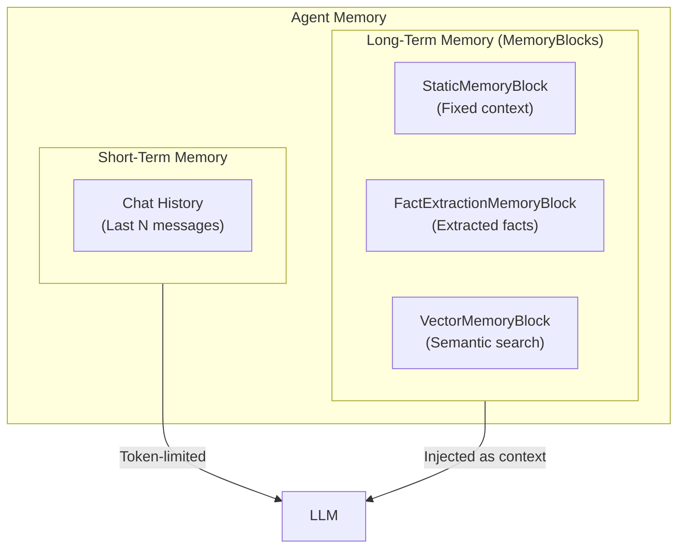
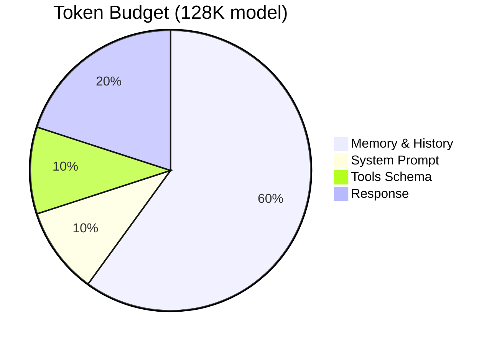
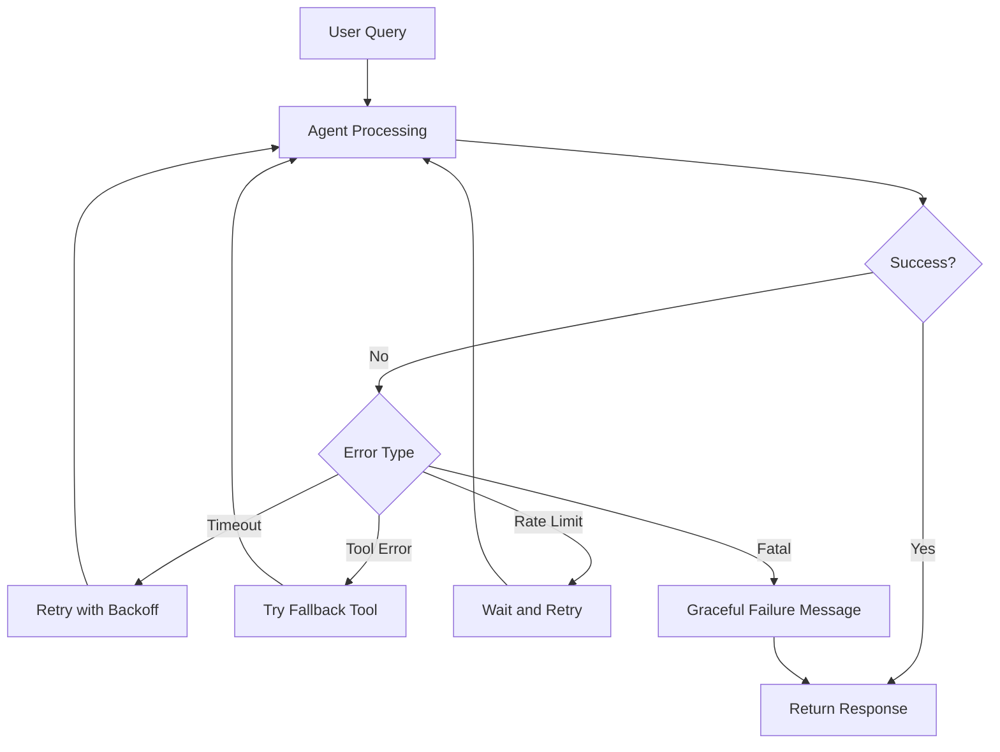

# Agent Configuration

## Introduction

Building capable agents requires more than just attaching tools—proper configuration determines how agents reason, remember, and respond. This lesson covers the essential configuration options that transform a basic agent into a production-ready assistant.

We'll explore system prompts for behavior shaping, memory systems for contextual awareness, streaming for responsive UIs, and error handling for robust operation.

### What We'll Cover

- System prompts and behavior customization
- Memory architecture (short-term and long-term)
- Memory blocks for persistent knowledge
- Streaming events for real-time feedback
- Timeout and iteration limits
- Error handling strategies

### Prerequisites

- Agent fundamentals
- Understanding of tools and Context
- Basic async Python patterns

---

## System Prompts

The system prompt defines the agent's personality, capabilities, and constraints:

```python
from llama_index.core.agent.workflow import FunctionAgent
from llama_index.llms.openai import OpenAI


agent = FunctionAgent(
    tools=[...],
    llm=OpenAI(model="gpt-4o-mini"),
    system_prompt="""You are a senior technical support specialist for CloudTech Inc.

Your expertise:
- Cloud infrastructure (AWS, GCP, Azure)
- Container orchestration (Kubernetes, Docker)
- CI/CD pipelines
- Database administration

Guidelines:
1. Always verify the customer's environment before troubleshooting
2. Provide step-by-step solutions with commands
3. Warn about destructive operations
4. Escalate to Level 2 if issue isn't resolved in 3 exchanges

Tone: Professional but friendly. Use technical terms with brief explanations."""
)
```

### System Prompt Components

| Component | Purpose | Example |
|-----------|---------|---------|
| **Role** | Define who the agent is | "You are a senior data analyst..." |
| **Expertise** | Specify knowledge domains | "Your expertise: Python, SQL, Tableau" |
| **Guidelines** | Set behavioral rules | "Always cite sources, Never make up data" |
| **Tone** | Define communication style | "Professional, concise, approachable" |
| **Constraints** | Set boundaries | "Never share customer PII" |
| **Examples** | Demonstrate expected format | "Format responses as: Problem → Solution" |

### Dynamic System Prompts

Customize prompts based on runtime context:

```python
def create_agent_for_user(user_role: str, department: str) -> FunctionAgent:
    """Create an agent customized for the user."""
    
    base_prompt = f"""You are an AI assistant for {department} department employees.
    
Current user role: {user_role}

Access level:
"""
    
    # Customize based on role
    if user_role == "admin":
        access_prompt = """- Full access to all tools
- Can modify system settings
- Can access sensitive data"""
    elif user_role == "analyst":
        access_prompt = """- Read-only access to data tools
- Cannot modify settings
- Cannot access PII"""
    else:
        access_prompt = """- Limited to basic queries
- Must request access for advanced features"""
    
    return FunctionAgent(
        tools=[...],
        llm=OpenAI(model="gpt-4o-mini"),
        system_prompt=base_prompt + access_prompt
    )
```

---

## Memory Architecture

LlamaIndex agents use the `Memory` class which combines short-term and long-term memory:



### Basic Memory Configuration

```python
from llama_index.core.memory import Memory


# Create memory with token limit
memory = Memory.from_defaults(
    session_id="user-session-123",
    token_limit=4000  # Max tokens for chat history
)

# Create agent with memory
agent = FunctionAgent(
    tools=[...],
    llm=OpenAI(model="gpt-4o-mini"),
    memory=memory,
    system_prompt="You are a helpful assistant."
)
```

### Memory Persistence

Save and restore memory across sessions:

```python
import json
from llama_index.core.memory import Memory


# Create memory
memory = Memory.from_defaults(session_id="user-123")

# After conversation, serialize
memory_state = memory.to_dict()
with open("memory_backup.json", "w") as f:
    json.dump(memory_state, f)

# Restore in new session
with open("memory_backup.json", "r") as f:
    saved_state = json.load(f)
memory = Memory.from_dict(saved_state)

# Continue conversation with restored context
agent = FunctionAgent(
    tools=[...],
    llm=OpenAI(model="gpt-4o-mini"),
    memory=memory
)
```

---

## Memory Blocks

Memory blocks provide long-term memory that persists across conversations:

### StaticMemoryBlock

Inject fixed context that's always available:

```python
from llama_index.core.memory import Memory, StaticMemoryBlock


# Create static context
company_context = StaticMemoryBlock(
    name="company_info",
    priority=1,  # Lower = higher priority
    static_content="""Company Information:
- Name: TechCorp Inc.
- Founded: 2010
- Products: CloudSuite, DataFlow, SecureAuth
- Support hours: 24/7
- SLA: 99.9% uptime guarantee"""
)

user_context = StaticMemoryBlock(
    name="user_preferences",
    priority=2,
    static_content="""User Preferences:
- Preferred language: English
- Technical level: Advanced
- Notification preference: Email"""
)

# Create memory with blocks
memory = Memory.from_defaults(
    session_id="support-session",
    memory_blocks=[company_context, user_context]
)
```

### FactExtractionMemoryBlock

Automatically extract and store facts from conversations:

```python
from llama_index.core.memory import Memory, FactExtractionMemoryBlock
from llama_index.llms.openai import OpenAI


# Create fact extraction block
facts_block = FactExtractionMemoryBlock(
    name="user_facts",
    llm=OpenAI(model="gpt-4o-mini"),
    max_facts=20  # Maximum facts to store
)

memory = Memory.from_defaults(
    session_id="personalized-session",
    memory_blocks=[facts_block]
)

# As conversation progresses, facts are extracted:
# "My name is Sarah and I work in engineering"
# → Stored fact: "User's name is Sarah"
# → Stored fact: "User works in engineering department"
```

### VectorMemoryBlock

Store memories with semantic search:

```python
from llama_index.core.memory import Memory, VectorMemoryBlock


# Create vector memory block
vector_block = VectorMemoryBlock(
    name="conversation_memories",
    max_memories=100,  # Max entries to store
    similarity_top_k=5  # Retrieve top 5 relevant memories
)

memory = Memory.from_defaults(
    session_id="long-term-session",
    memory_blocks=[vector_block]
)

# Previous conversations are embedded and retrieved
# based on semantic similarity to current query
```

---

## Token Management

Managing token limits prevents context overflow:

```python
from llama_index.core.memory import Memory


def create_memory_for_model(model_name: str) -> Memory:
    """Create memory with appropriate token limits."""
    
    token_limits = {
        "gpt-4o-mini": 128000,
        "gpt-4o": 128000,
        "gpt-3.5-turbo": 16000,
        "claude-3-sonnet": 200000,
    }
    
    max_tokens = token_limits.get(model_name, 8000)
    
    # Reserve tokens for response and tools
    memory_limit = int(max_tokens * 0.6)  # 60% for memory
    
    return Memory.from_defaults(
        token_limit=memory_limit
    )


# Usage
memory = create_memory_for_model("gpt-4o-mini")
```

### Token Limit Diagram



---

## Streaming Events

Stream agent events for responsive user interfaces:

```python
import asyncio
from llama_index.core.agent.workflow import (
    FunctionAgent,
    AgentInput,
    AgentOutput,
    ToolCall,
    ToolCallResult,
    AgentStream
)
from llama_index.llms.openai import OpenAI


async def stream_agent_response(agent: FunctionAgent, query: str):
    """Stream agent events with detailed feedback."""
    
    handler = agent.run(query)
    
    async for event in handler.stream_events():
        if isinstance(event, AgentInput):
            print(f"📥 Input received: {event.input[:50]}...")
        
        elif isinstance(event, ToolCall):
            print(f"🔧 Calling tool: {event.tool_name}")
            print(f"   Arguments: {event.tool_kwargs}")
        
        elif isinstance(event, ToolCallResult):
            print(f"✅ Tool result from {event.tool_name}:")
            result_preview = str(event.tool_output)[:100]
            print(f"   {result_preview}...")
        
        elif isinstance(event, AgentStream):
            # Token-by-token streaming
            print(event.delta, end="", flush=True)
        
        elif isinstance(event, AgentOutput):
            print(f"\n📤 Final response ready")
    
    response = await handler
    return response
```

### Event Types Reference

| Event Type | When Emitted | Useful For |
|------------|--------------|------------|
| `AgentInput` | Query received | Logging, validation |
| `ToolCall` | Before tool execution | Progress indication |
| `ToolCallResult` | After tool completes | Result display |
| `AgentStream` | LLM token generated | Real-time typing |
| `AgentOutput` | Response complete | Final processing |

### Building a Streaming UI

```python
import asyncio
from typing import AsyncIterator


class StreamingUI:
    """Simple streaming UI for agent responses."""
    
    def __init__(self, agent: FunctionAgent):
        self.agent = agent
    
    async def stream_response(self, query: str) -> AsyncIterator[str]:
        """Yield formatted updates for UI."""
        handler = self.agent.run(query)
        
        async for event in handler.stream_events():
            if isinstance(event, ToolCall):
                yield f"[Using {event.tool_name}...]\n"
            
            elif isinstance(event, ToolCallResult):
                yield f"[Got result from {event.tool_name}]\n"
            
            elif isinstance(event, AgentStream):
                yield event.delta
        
        await handler


# Usage with async generator
async def main():
    agent = FunctionAgent(...)
    ui = StreamingUI(agent)
    
    async for chunk in ui.stream_response("What's the weather?"):
        print(chunk, end="", flush=True)
```

---

## Timeout and Iteration Limits

Prevent runaway agents with proper limits:

```python
from llama_index.core.agent.workflow import FunctionAgent
from llama_index.core.workflow import Workflow


# Method 1: Set timeout on run
async def query_with_timeout(agent: FunctionAgent, query: str):
    """Run agent with timeout."""
    try:
        response = await asyncio.wait_for(
            agent.run(query),
            timeout=30.0  # 30 second limit
        )
        return response
    except asyncio.TimeoutError:
        return "Request timed out. Please try a simpler query."


# Method 2: Limit tool calls per turn
class LimitedAgent(FunctionAgent):
    """Agent with tool call limits."""
    
    def __init__(self, max_tool_calls: int = 5, **kwargs):
        super().__init__(**kwargs)
        self.max_tool_calls = max_tool_calls
    
    async def run(self, query: str, **kwargs):
        tool_count = 0
        handler = super().run(query, **kwargs)
        
        async for event in handler.stream_events():
            if isinstance(event, ToolCall):
                tool_count += 1
                if tool_count > self.max_tool_calls:
                    raise RuntimeError(
                        f"Exceeded maximum tool calls ({self.max_tool_calls})"
                    )
        
        return await handler
```

### Recommended Limits

| Setting | Development | Production |
|---------|-------------|------------|
| Timeout | 60 seconds | 30 seconds |
| Max tool calls | 10 | 5 |
| Max retries | 3 | 2 |
| Memory tokens | 8000 | 4000 |

---

## Error Handling

Build robust agents that handle failures gracefully:

### Tool-Level Error Handling

```python
from typing import Annotated
import logging


logger = logging.getLogger(__name__)


def safe_api_call(
    endpoint: Annotated[str, "API endpoint to call"],
    params: Annotated[dict, "Request parameters"]
) -> str:
    """Make an API call with error handling."""
    try:
        import httpx
        response = httpx.get(endpoint, params=params, timeout=10.0)
        response.raise_for_status()
        return response.text
    
    except httpx.TimeoutException:
        logger.warning(f"Timeout calling {endpoint}")
        return "The API request timed out. Please try again."
    
    except httpx.HTTPStatusError as e:
        logger.error(f"HTTP error: {e.response.status_code}")
        return f"API error: {e.response.status_code}. Please check the endpoint."
    
    except Exception as e:
        logger.exception(f"Unexpected error: {e}")
        return f"An unexpected error occurred: {str(e)}"
```

### Agent-Level Error Handling

```python
async def run_agent_safely(
    agent: FunctionAgent,
    query: str,
    max_retries: int = 2
) -> str:
    """Run agent with retry logic."""
    
    last_error = None
    
    for attempt in range(max_retries + 1):
        try:
            response = await asyncio.wait_for(
                agent.run(query),
                timeout=30.0
            )
            return response
        
        except asyncio.TimeoutError:
            last_error = "Request timed out"
            logger.warning(f"Attempt {attempt + 1}: Timeout")
        
        except Exception as e:
            last_error = str(e)
            logger.error(f"Attempt {attempt + 1}: {e}")
        
        # Exponential backoff
        if attempt < max_retries:
            await asyncio.sleep(2 ** attempt)
    
    return f"Unable to complete request after {max_retries + 1} attempts. Last error: {last_error}"
```

### Error Handling Strategies



---

## Complete Configuration Example

Here's a fully configured production-ready agent:

```python
import asyncio
import logging
from typing import Annotated, Optional
from llama_index.core.agent.workflow import FunctionAgent, ToolCallResult, AgentStream
from llama_index.core.memory import Memory, StaticMemoryBlock, FactExtractionMemoryBlock
from llama_index.core.workflow import Context
from llama_index.llms.openai import OpenAI

logging.basicConfig(level=logging.INFO)
logger = logging.getLogger(__name__)


# Tools with error handling
def search_knowledge_base(
    query: Annotated[str, "Search query"]
) -> str:
    """Search the company knowledge base."""
    try:
        # Simulated search
        return f"Found 3 articles matching '{query}': [Article 1], [Article 2], [Article 3]"
    except Exception as e:
        logger.error(f"Search error: {e}")
        return f"Search temporarily unavailable: {e}"


def create_ticket(
    title: Annotated[str, "Ticket title"],
    description: Annotated[str, "Detailed description"],
    priority: Annotated[str, "Priority: low, medium, high"] = "medium"
) -> str:
    """Create a support ticket."""
    if priority not in ["low", "medium", "high"]:
        return f"Invalid priority '{priority}'. Use: low, medium, high"
    
    ticket_id = "TKT-" + str(hash(title))[:6].upper()
    return f"Created ticket {ticket_id}: {title} (Priority: {priority})"


def get_user_info(ctx: Context) -> str:
    """Get current user information."""
    user = ctx.get("user", default={"name": "Guest", "plan": "free"})
    return f"User: {user['name']}, Plan: {user['plan']}"


def configure_agent() -> tuple[FunctionAgent, Memory]:
    """Configure a production-ready agent."""
    
    # Company context
    company_block = StaticMemoryBlock(
        name="company_context",
        priority=1,
        static_content="""Company: TechSupport Pro
Products: CloudSuite (cloud platform), DataFlow (ETL tool), SecureAuth (SSO)
Support tiers: Basic (email), Pro (chat + phone), Enterprise (dedicated)
SLA: Basic 48h, Pro 4h, Enterprise 1h
Escalation: Level 1 → Level 2 → Engineering"""
    )
    
    # User fact extraction
    facts_block = FactExtractionMemoryBlock(
        name="user_facts",
        llm=OpenAI(model="gpt-4o-mini"),
        max_facts=10
    )
    
    # Memory with blocks
    memory = Memory.from_defaults(
        session_id="production-session",
        token_limit=4000,
        memory_blocks=[company_block, facts_block]
    )
    
    # System prompt
    system_prompt = """You are a senior support specialist for TechSupport Pro.

Your responsibilities:
1. Help users troubleshoot product issues
2. Search the knowledge base for solutions
3. Create support tickets when needed
4. Escalate critical issues appropriately

Guidelines:
- Be professional and empathetic
- Ask clarifying questions before assuming
- Provide step-by-step solutions when possible
- Always confirm user satisfaction before closing

Available products: CloudSuite, DataFlow, SecureAuth
Support tiers: Basic, Pro, Enterprise"""

    # Create agent
    agent = FunctionAgent(
        tools=[search_knowledge_base, create_ticket, get_user_info],
        llm=OpenAI(model="gpt-4o-mini", temperature=0.3),
        memory=memory,
        system_prompt=system_prompt
    )
    
    return agent, memory


async def run_with_streaming(
    agent: FunctionAgent,
    query: str,
    timeout: float = 30.0
) -> str:
    """Run agent with streaming and timeout."""
    
    try:
        handler = agent.run(query)
        
        # Stream events
        async for event in handler.stream_events():
            if isinstance(event, ToolCallResult):
                logger.info(f"Tool {event.tool_name} completed")
            elif isinstance(event, AgentStream):
                print(event.delta, end="", flush=True)
        
        print()  # Newline after streaming
        
        response = await asyncio.wait_for(handler, timeout=timeout)
        return response
    
    except asyncio.TimeoutError:
        logger.error("Request timed out")
        return "I apologize, but the request took too long. Please try again."
    
    except Exception as e:
        logger.exception(f"Error: {e}")
        return f"I encountered an error: {e}. Please try again."


async def main():
    # Configure
    agent, memory = configure_agent()
    ctx = Context(agent)
    
    # Set user context
    await ctx.set("user", {"name": "Alice", "plan": "Pro"})
    
    # Conversation
    queries = [
        "Hi, I'm having trouble with CloudSuite. The dashboard isn't loading.",
        "I've already tried clearing my cache. It started yesterday.",
        "Yes, please create a ticket. This is blocking my work.",
    ]
    
    for query in queries:
        print(f"\n{'='*50}")
        print(f"User: {query}")
        print("Agent: ", end="")
        
        response = await run_with_streaming(agent, query)
        
        # Log memory state
        logger.info(f"Memory tokens used: {memory.token_count}")


if __name__ == "__main__":
    asyncio.run(main())
```

---

## Best Practices

| Practice | Description |
|----------|-------------|
| Specific system prompts | Define role, guidelines, and constraints clearly |
| Token budgeting | Reserve tokens for response and tools |
| Memory persistence | Save/restore memory for continuity |
| Graceful degradation | Always return something useful on error |
| Logging | Log tool calls and errors for debugging |
| Timeouts | Set reasonable limits for all operations |

---

## Common Pitfalls

| ❌ Mistake | ✅ Solution |
|-----------|-------------|
| Vague system prompt | Be specific about role and constraints |
| No memory limits | Set token_limit to prevent overflow |
| Missing error handling | Wrap tools and agent calls in try/except |
| No timeout | Always set timeouts for production |
| Ignoring events | Use streaming for better UX |
| Hardcoded limits | Make limits configurable per environment |

---

## Hands-on Exercise

### Your Task

Create a configurable customer service agent with:
1. Dynamic system prompt based on user tier (Basic, Pro, Enterprise)
2. Memory with company context and fact extraction
3. Streaming output with progress indicators
4. Error handling with retry logic

### Requirements

1. Create a `configure_for_tier(tier: str)` function
2. Use `StaticMemoryBlock` for company policies
3. Implement `FactExtractionMemoryBlock` for user preferences
4. Stream tool usage and responses
5. Handle timeout and API errors gracefully

### Expected Result

```
[Pro Tier Support]
User: My API integration is failing

[🔍 Searching knowledge base...]
[✅ Found relevant articles]

Agent: I found some information about API integration issues...
Based on your Pro tier, I can offer you immediate phone support.
Should I connect you with a specialist?
```

<details>
<summary>💡 Hints (click to expand)</summary>

1. Use a dictionary to map tiers to response times and capabilities
2. Include tier-specific instructions in the system prompt
3. Create a wrapper function that handles streaming and errors
4. Store tier info in Context for tools to access
5. Use `asyncio.wait_for()` for timeout handling

</details>

<details>
<summary>✅ Solution (click to expand)</summary>

```python
import asyncio
from typing import Annotated
from llama_index.core.agent.workflow import (
    FunctionAgent, ToolCall, ToolCallResult, AgentStream
)
from llama_index.core.memory import Memory, StaticMemoryBlock, FactExtractionMemoryBlock
from llama_index.core.workflow import Context
from llama_index.llms.openai import OpenAI


# Tier configuration
TIER_CONFIG = {
    "Basic": {
        "response_time": "48 hours",
        "channels": ["email"],
        "priority": "Standard queue",
        "features": ["Knowledge base access", "Email support"]
    },
    "Pro": {
        "response_time": "4 hours",
        "channels": ["email", "chat", "phone"],
        "priority": "Priority queue",
        "features": ["24/7 chat", "Phone support", "Screen sharing"]
    },
    "Enterprise": {
        "response_time": "1 hour",
        "channels": ["email", "chat", "phone", "dedicated"],
        "priority": "Immediate",
        "features": ["Dedicated manager", "Custom integrations", "SLA guarantee"]
    }
}


def search_knowledge_base(
    query: Annotated[str, "Search query"]
) -> str:
    """Search the knowledge base."""
    return f"Found 3 relevant articles for '{query}'"


async def escalate_to_specialist(
    ctx: Context,
    issue_type: Annotated[str, "Type of issue"]
) -> str:
    """Escalate to a specialist based on user tier."""
    tier = await ctx.get("tier", default="Basic")
    config = TIER_CONFIG[tier]
    
    if "phone" in config["channels"]:
        return f"Connecting you to a specialist now ({config['priority']})"
    else:
        return f"Escalation scheduled. Response within {config['response_time']}"


def configure_for_tier(tier: str) -> tuple[FunctionAgent, Memory, Context]:
    """Configure agent for specific tier."""
    
    if tier not in TIER_CONFIG:
        tier = "Basic"
    
    config = TIER_CONFIG[tier]
    
    # Company policies
    company_block = StaticMemoryBlock(
        name="company_policies",
        priority=1,
        static_content=f"""Support Tier: {tier}
Response Time SLA: {config['response_time']}
Available Channels: {', '.join(config['channels'])}
Features: {', '.join(config['features'])}"""
    )
    
    # Fact extraction for preferences
    facts_block = FactExtractionMemoryBlock(
        name="user_facts",
        llm=OpenAI(model="gpt-4o-mini"),
        max_facts=10
    )
    
    memory = Memory.from_defaults(
        session_id=f"support-{tier.lower()}",
        token_limit=4000,
        memory_blocks=[company_block, facts_block]
    )
    
    system_prompt = f"""You are a customer support agent for a {tier} tier customer.

Tier Benefits:
- Response time: {config['response_time']}
- Support channels: {', '.join(config['channels'])}
- Priority: {config['priority']}

Guidelines:
1. Acknowledge the customer's tier and its benefits
2. Search knowledge base before escalating
3. Offer tier-appropriate support options
4. Be professional and solution-oriented

Remember: {tier} customers expect {config['priority'].lower()} handling."""

    agent = FunctionAgent(
        tools=[search_knowledge_base, escalate_to_specialist],
        llm=OpenAI(model="gpt-4o-mini", temperature=0.3),
        memory=memory,
        system_prompt=system_prompt
    )
    
    ctx = Context(agent)
    
    return agent, memory, ctx


async def stream_with_handling(
    agent: FunctionAgent,
    query: str,
    ctx: Context,
    tier: str,
    timeout: float = 30.0,
    max_retries: int = 2
) -> str:
    """Stream response with error handling."""
    
    print(f"\n[{tier} Tier Support]")
    print(f"User: {query}\n")
    
    for attempt in range(max_retries + 1):
        try:
            handler = agent.run(query, ctx=ctx)
            
            async for event in handler.stream_events():
                if isinstance(event, ToolCall):
                    print(f"[🔍 {event.tool_name}...]")
                elif isinstance(event, ToolCallResult):
                    print(f"[✅ {event.tool_name} complete]")
                elif isinstance(event, AgentStream):
                    print(event.delta, end="", flush=True)
            
            print()
            response = await asyncio.wait_for(handler, timeout=timeout)
            return response
        
        except asyncio.TimeoutError:
            if attempt < max_retries:
                print(f"\n[⏱️ Timeout, retrying...]")
                await asyncio.sleep(2 ** attempt)
            else:
                return "Request timed out. A support agent will follow up."
        
        except Exception as e:
            if attempt < max_retries:
                print(f"\n[⚠️ Error, retrying...]")
                await asyncio.sleep(2 ** attempt)
            else:
                return f"Error occurred. Please try again: {e}"


async def main():
    # Test different tiers
    for tier in ["Basic", "Pro", "Enterprise"]:
        agent, memory, ctx = configure_for_tier(tier)
        await ctx.set("tier", tier)
        
        query = "My API integration is failing and I need help"
        response = await stream_with_handling(
            agent, query, ctx, tier
        )
        
        print(f"\nAgent: {response}")
        print("=" * 60)


if __name__ == "__main__":
    asyncio.run(main())
```

</details>

---

## Summary

✅ System prompts define agent personality, capabilities, and constraints

✅ Memory combines short-term chat history with long-term memory blocks

✅ Memory blocks (Static, FactExtraction, Vector) provide persistent context

✅ Streaming events enable responsive, real-time user interfaces

✅ Timeouts and iteration limits prevent runaway agents

✅ Proper error handling ensures graceful degradation

**Next:** [Advanced Agent Patterns →](./06-advanced-agent-patterns.md)

---

## Further Reading

- [LlamaIndex Memory Documentation](https://developers.llamaindex.ai/python/framework/module_guides/deploying/agents/memory/)
- [Agent Workflow Events](https://developers.llamaindex.ai/python/framework/module_guides/workflow/)
- [LLM Configuration Options](https://developers.llamaindex.ai/python/framework/module_guides/models/llms/)

---

<!-- 
Sources Consulted:
- LlamaIndex Memory: https://developers.llamaindex.ai/python/framework/module_guides/deploying/agents/memory/
- Agent documentation: https://developers.llamaindex.ai/python/framework/module_guides/deploying/agents/
- Workflow events: https://developers.llamaindex.ai/python/framework/module_guides/workflow/
-->
