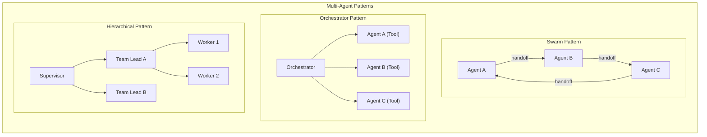
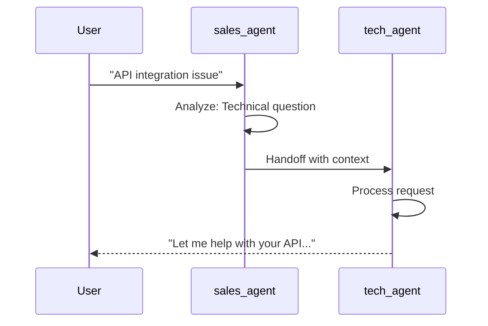
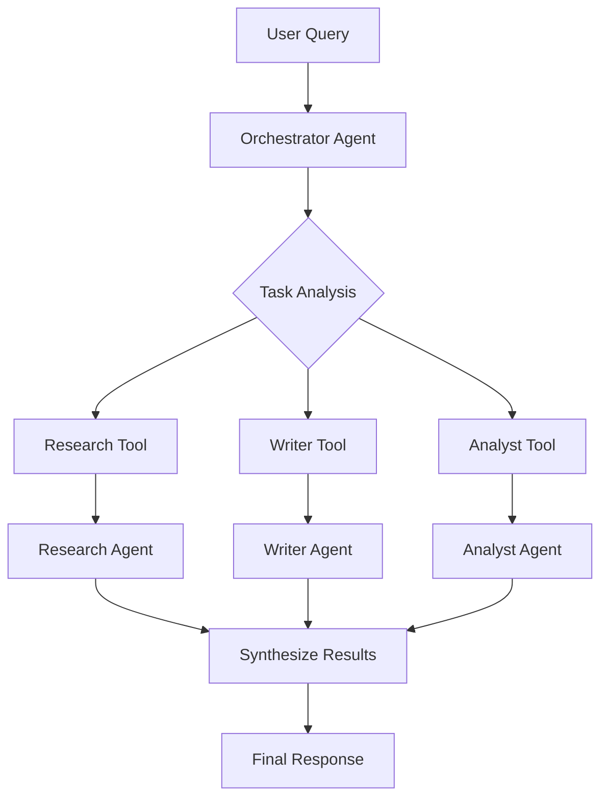
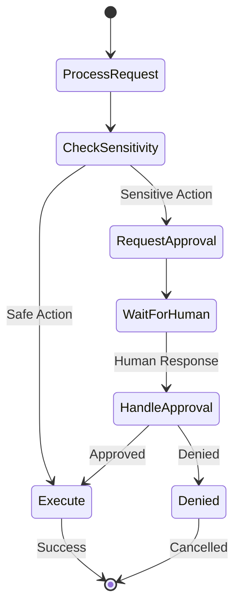

# Advanced Agent Patterns

## Introduction

Single agents with tools are powerful, but complex applications require sophisticated orchestration patterns. This lesson explores multi-agent architectures, human-in-the-loop workflows, and evaluation strategies that enable production-grade agent systems.

We'll implement the AgentWorkflow pattern for agent handoffs, build human approval mechanisms, and establish metrics for agent performance evaluation.

### What We'll Cover

- Multi-agent orchestration with AgentWorkflow
- Agent handoff patterns (swarm architecture)
- Orchestrator pattern (agents as tools)
- Human-in-the-loop approval workflows
- Agent state persistence and recovery
- Evaluation metrics and debugging strategies

### Prerequisites

- Solid understanding of agent fundamentals
- Experience with function and query engine tools
- Agent configuration concepts (memory, streaming)
- Familiarity with async Python patterns

---

## Multi-Agent Architecture Overview

Different scenarios call for different multi-agent patterns:



### Pattern Comparison

| Pattern | Best For | Complexity | Coordination |
|---------|----------|------------|--------------|
| **Swarm** | Domain specialists, sequential tasks | Medium | Peer-to-peer |
| **Orchestrator** | Parallel tasks, dynamic routing | Medium | Central control |
| **Hierarchical** | Complex workflows, large teams | High | Multi-level |

---

## AgentWorkflow: The Swarm Pattern

LlamaIndex's `AgentWorkflow` enables agents to hand off conversations to each other:

```python
import asyncio
from llama_index.core.agent.workflow import (
    AgentWorkflow,
    FunctionAgent,
    AgentOutput
)
from llama_index.llms.openai import OpenAI


# Create specialized agents
def create_support_team():
    """Create a team of specialized support agents."""
    
    # Sales Agent
    sales_agent = FunctionAgent(
        name="sales_agent",
        description="Handles pricing, plans, and purchase inquiries",
        llm=OpenAI(model="gpt-4o-mini"),
        system_prompt="""You are a sales specialist.
        Handle questions about pricing, plans, and purchases.
        If the question is technical, hand off to the tech_agent.
        If the question is about billing, hand off to the billing_agent.""",
        tools=[],
        can_handoff_to=["tech_agent", "billing_agent"]
    )
    
    # Technical Agent
    tech_agent = FunctionAgent(
        name="tech_agent",
        description="Handles technical support and troubleshooting",
        llm=OpenAI(model="gpt-4o-mini"),
        system_prompt="""You are a technical support specialist.
        Handle troubleshooting, integration, and technical questions.
        If the question is about sales, hand off to the sales_agent.
        If the question is about billing, hand off to the billing_agent.""",
        tools=[],
        can_handoff_to=["sales_agent", "billing_agent"]
    )
    
    # Billing Agent
    billing_agent = FunctionAgent(
        name="billing_agent",
        description="Handles billing, invoices, and payment issues",
        llm=OpenAI(model="gpt-4o-mini"),
        system_prompt="""You are a billing specialist.
        Handle invoices, payments, refunds, and account issues.
        If the question is about sales, hand off to the sales_agent.
        If the question is technical, hand off to the tech_agent.""",
        tools=[],
        can_handoff_to=["sales_agent", "tech_agent"]
    )
    
    return [sales_agent, tech_agent, billing_agent]


# Create workflow
agents = create_support_team()
workflow = AgentWorkflow(
    agents=agents,
    root_agent="sales_agent"  # Initial agent
)

# Run the workflow
async def main():
    response = await workflow.run("I'm having trouble with my API integration")
    print(response)

asyncio.run(main())
```

### Handoff Mechanism



### Adding Tools to Workflow Agents

```python
from llama_index.core.tools import FunctionTool


def check_api_status(endpoint: str) -> str:
    """Check the status of an API endpoint."""
    return f"API endpoint {endpoint} is operational (200 OK)"


def lookup_account(email: str) -> str:
    """Look up account information by email."""
    return f"Account found for {email}: Pro Plan, Active since 2024-01"


# Tech agent with tools
tech_agent = FunctionAgent(
    name="tech_agent",
    description="Technical support specialist",
    llm=OpenAI(model="gpt-4o-mini"),
    system_prompt="You are a technical support specialist with API tools.",
    tools=[check_api_status],  # Technical tools
    can_handoff_to=["sales_agent", "billing_agent"]
)

# Billing agent with tools
billing_agent = FunctionAgent(
    name="billing_agent",
    description="Billing specialist",
    llm=OpenAI(model="gpt-4o-mini"),
    system_prompt="You are a billing specialist with account tools.",
    tools=[lookup_account],  # Billing tools
    can_handoff_to=["sales_agent", "tech_agent"]
)
```

---

## Orchestrator Pattern: Agents as Tools

In the orchestrator pattern, a central agent uses other agents as tools:

```python
import asyncio
from typing import Annotated
from llama_index.core.agent.workflow import FunctionAgent
from llama_index.core.tools import FunctionTool
from llama_index.llms.openai import OpenAI


class AgentOrchestrator:
    """Orchestrator that delegates to specialized agents."""
    
    def __init__(self):
        # Create specialized agents
        self.research_agent = FunctionAgent(
            tools=[],
            llm=OpenAI(model="gpt-4o-mini"),
            system_prompt="You are a research specialist. Provide detailed, factual responses."
        )
        
        self.writer_agent = FunctionAgent(
            tools=[],
            llm=OpenAI(model="gpt-4o-mini"),
            system_prompt="You are a creative writer. Transform information into engaging content."
        )
        
        self.analyst_agent = FunctionAgent(
            tools=[],
            llm=OpenAI(model="gpt-4o-mini"),
            system_prompt="You are a data analyst. Analyze information and provide insights."
        )
    
    async def research(
        self,
        topic: Annotated[str, "Topic to research"]
    ) -> str:
        """Delegate research tasks to the research agent."""
        return await self.research_agent.run(f"Research this topic: {topic}")
    
    async def write_content(
        self,
        brief: Annotated[str, "Writing brief or requirements"]
    ) -> str:
        """Delegate writing tasks to the writer agent."""
        return await self.writer_agent.run(f"Write content based on: {brief}")
    
    async def analyze(
        self,
        data: Annotated[str, "Data or information to analyze"]
    ) -> str:
        """Delegate analysis tasks to the analyst agent."""
        return await self.analyst_agent.run(f"Analyze this: {data}")


# Create the orchestrator
orchestrator = AgentOrchestrator()

# Create tools from orchestrator methods
research_tool = FunctionTool.from_defaults(
    orchestrator.research,
    async_fn=orchestrator.research,
    name="research",
    description="Delegate research tasks to a specialized research agent"
)

write_tool = FunctionTool.from_defaults(
    orchestrator.write_content,
    async_fn=orchestrator.write_content,
    name="write_content",
    description="Delegate writing tasks to a specialized writer agent"
)

analyze_tool = FunctionTool.from_defaults(
    orchestrator.analyze,
    async_fn=orchestrator.analyze,
    name="analyze",
    description="Delegate analysis tasks to a specialized analyst agent"
)

# Create the main orchestrator agent
main_agent = FunctionAgent(
    tools=[research_tool, write_tool, analyze_tool],
    llm=OpenAI(model="gpt-4o"),  # Smarter model for orchestration
    system_prompt="""You are an orchestrator that coordinates specialized agents.

Available specialists:
- Research: For gathering information and facts
- Writer: For creating engaging content
- Analyst: For data analysis and insights

Break complex tasks into subtasks and delegate appropriately.
Synthesize results from multiple agents when needed."""
)


async def main():
    query = "Research AI trends in 2024, then write a blog post about the top 3 trends"
    response = await main_agent.run(query)
    print(response)

asyncio.run(main())
```

### Orchestration Flow



---

## Human-in-the-Loop Workflows

For critical decisions, require human approval before proceeding:

```python
import asyncio
from typing import Annotated
from llama_index.core.agent.workflow import FunctionAgent
from llama_index.core.workflow import (
    Workflow,
    Context,
    StartEvent,
    StopEvent,
    step
)
from llama_index.core.agent.workflow.workflow_events import (
    InputRequiredEvent,
    HumanResponseEvent
)
from llama_index.llms.openai import OpenAI


class HumanApprovalWorkflow(Workflow):
    """Workflow requiring human approval for sensitive actions."""
    
    def __init__(self, agent: FunctionAgent, **kwargs):
        super().__init__(**kwargs)
        self.agent = agent
    
    @step
    async def process_request(
        self, ctx: Context, ev: StartEvent
    ) -> InputRequiredEvent | StopEvent:
        """Process request and check if approval needed."""
        query = ev.input
        
        # Store the query for later
        await ctx.set("original_query", query)
        
        # Check if this requires approval
        sensitive_keywords = ["delete", "refund", "cancel", "terminate"]
        needs_approval = any(kw in query.lower() for kw in sensitive_keywords)
        
        if needs_approval:
            # Request human approval
            return InputRequiredEvent(
                prefix="⚠️ APPROVAL REQUIRED\n"
                       f"Action: {query}\n"
                       "Type 'approve' to proceed or 'deny' to cancel: "
            )
        
        # No approval needed, proceed
        response = await self.agent.run(query)
        return StopEvent(result=response)
    
    @step
    async def handle_approval(
        self, ctx: Context, ev: HumanResponseEvent
    ) -> StopEvent:
        """Handle human approval response."""
        human_response = ev.response.lower().strip()
        query = await ctx.get("original_query")
        
        if human_response == "approve":
            response = await self.agent.run(query)
            return StopEvent(result=f"✅ Approved and executed:\n{response}")
        else:
            return StopEvent(result="❌ Action denied by human operator")


# Create tools that might need approval
def delete_record(
    record_id: Annotated[str, "ID of record to delete"]
) -> str:
    """Delete a record from the database."""
    return f"Record {record_id} deleted successfully"


def process_refund(
    order_id: Annotated[str, "Order ID for refund"],
    amount: Annotated[float, "Refund amount"]
) -> str:
    """Process a customer refund."""
    return f"Refund of ${amount:.2f} processed for order {order_id}"


agent = FunctionAgent(
    tools=[delete_record, process_refund],
    llm=OpenAI(model="gpt-4o-mini"),
    system_prompt="You help with data management and refunds."
)

workflow = HumanApprovalWorkflow(agent=agent)


async def main():
    # Safe query - no approval needed
    print("=== Safe Query ===")
    result = await workflow.run("What's the status of order 12345?")
    print(result)
    
    # Sensitive query - requires approval
    print("\n=== Sensitive Query (Simulated Approval) ===")
    handler = workflow.run("Delete record ABC123")
    
    async for event in handler.stream_events():
        if isinstance(event, InputRequiredEvent):
            print(event.prefix)
            # Simulate human input
            handler.ctx.send_event(HumanResponseEvent(response="approve"))
    
    result = await handler
    print(result)


asyncio.run(main())
```

### Human-in-the-Loop Flow



---

## State Persistence and Recovery

Save and restore agent state for long-running workflows:

```python
import json
import asyncio
from datetime import datetime
from pathlib import Path
from llama_index.core.agent.workflow import FunctionAgent
from llama_index.core.workflow import Context
from llama_index.core.memory import Memory
from llama_index.llms.openai import OpenAI


class PersistentAgentSession:
    """Manage agent sessions with persistence."""
    
    def __init__(self, session_id: str, storage_path: str = "./sessions"):
        self.session_id = session_id
        self.storage_path = Path(storage_path)
        self.storage_path.mkdir(exist_ok=True)
        self.session_file = self.storage_path / f"{session_id}.json"
    
    def save_state(self, memory: Memory, context_data: dict):
        """Save session state to disk."""
        state = {
            "session_id": self.session_id,
            "saved_at": datetime.now().isoformat(),
            "memory": memory.to_dict(),
            "context": context_data
        }
        
        with open(self.session_file, "w") as f:
            json.dump(state, f, indent=2)
        
        print(f"Session {self.session_id} saved")
    
    def load_state(self) -> tuple[Memory | None, dict]:
        """Load session state from disk."""
        if not self.session_file.exists():
            return None, {}
        
        with open(self.session_file, "r") as f:
            state = json.load(f)
        
        memory = Memory.from_dict(state["memory"])
        context_data = state.get("context", {})
        
        print(f"Session {self.session_id} restored from {state['saved_at']}")
        return memory, context_data
    
    def delete_state(self):
        """Delete session state."""
        if self.session_file.exists():
            self.session_file.unlink()
            print(f"Session {self.session_id} deleted")


async def demo_persistent_session():
    """Demonstrate session persistence."""
    
    session = PersistentAgentSession("user-alice-001")
    
    # Try to restore existing session
    memory, context_data = session.load_state()
    
    if memory is None:
        # New session
        memory = Memory.from_defaults(session_id="user-alice-001")
        context_data = {"user": "Alice", "visits": 0}
        print("Started new session")
    
    # Update context
    context_data["visits"] = context_data.get("visits", 0) + 1
    context_data["last_visit"] = datetime.now().isoformat()
    
    # Create agent with restored memory
    agent = FunctionAgent(
        tools=[],
        llm=OpenAI(model="gpt-4o-mini"),
        memory=memory,
        system_prompt=f"You are helping {context_data['user']}. This is visit #{context_data['visits']}."
    )
    
    # Have a conversation
    response = await agent.run("Hi, what do you remember about our conversations?")
    print(f"Agent: {response}")
    
    # Save state before exit
    session.save_state(memory, context_data)


asyncio.run(demo_persistent_session())
```

---

## Agent Evaluation Strategies

Measure and improve agent performance:

### Evaluation Metrics

```python
from dataclasses import dataclass
from typing import List, Dict, Any
from datetime import datetime
import asyncio


@dataclass
class AgentMetrics:
    """Metrics for agent evaluation."""
    query: str
    response: str
    tools_used: List[str]
    latency_ms: float
    token_count: int
    success: bool
    error: str | None = None


class AgentEvaluator:
    """Evaluate agent performance."""
    
    def __init__(self):
        self.metrics: List[AgentMetrics] = []
    
    async def evaluate_query(
        self,
        agent: FunctionAgent,
        query: str
    ) -> AgentMetrics:
        """Run a query and collect metrics."""
        start_time = datetime.now()
        tools_used = []
        error = None
        success = True
        
        try:
            handler = agent.run(query)
            
            async for event in handler.stream_events():
                if hasattr(event, 'tool_name'):
                    tools_used.append(event.tool_name)
            
            response = await handler
        except Exception as e:
            response = str(e)
            error = str(e)
            success = False
        
        latency_ms = (datetime.now() - start_time).total_seconds() * 1000
        
        metrics = AgentMetrics(
            query=query,
            response=str(response),
            tools_used=tools_used,
            latency_ms=latency_ms,
            token_count=len(str(response).split()),  # Approximate
            success=success,
            error=error
        )
        
        self.metrics.append(metrics)
        return metrics
    
    def get_summary(self) -> Dict[str, Any]:
        """Get summary statistics."""
        if not self.metrics:
            return {}
        
        successful = [m for m in self.metrics if m.success]
        
        return {
            "total_queries": len(self.metrics),
            "success_rate": len(successful) / len(self.metrics) * 100,
            "avg_latency_ms": sum(m.latency_ms for m in self.metrics) / len(self.metrics),
            "avg_tools_per_query": sum(len(m.tools_used) for m in self.metrics) / len(self.metrics),
            "most_used_tools": self._get_tool_frequency(),
            "errors": [m.error for m in self.metrics if m.error]
        }
    
    def _get_tool_frequency(self) -> Dict[str, int]:
        """Count tool usage frequency."""
        frequency = {}
        for m in self.metrics:
            for tool in m.tools_used:
                frequency[tool] = frequency.get(tool, 0) + 1
        return dict(sorted(frequency.items(), key=lambda x: -x[1]))


# Example usage
async def evaluate_agent():
    agent = FunctionAgent(
        tools=[...],
        llm=OpenAI(model="gpt-4o-mini"),
        system_prompt="You are a helpful assistant."
    )
    
    evaluator = AgentEvaluator()
    
    test_queries = [
        "What's the weather today?",
        "Calculate 15% of 250",
        "Search for Python tutorials",
        "This should cause an error: @#$%",
    ]
    
    for query in test_queries:
        metrics = await evaluator.evaluate_query(agent, query)
        print(f"Query: {query[:30]}... | Latency: {metrics.latency_ms:.0f}ms | Tools: {metrics.tools_used}")
    
    print("\n=== Summary ===")
    summary = evaluator.get_summary()
    print(f"Success Rate: {summary['success_rate']:.1f}%")
    print(f"Avg Latency: {summary['avg_latency_ms']:.0f}ms")
    print(f"Tool Frequency: {summary['most_used_tools']}")


asyncio.run(evaluate_agent())
```

### Evaluation Checklist

| Dimension | Metric | Target |
|-----------|--------|--------|
| **Accuracy** | Correct tool selection | >95% |
| **Latency** | Response time | <3s for simple queries |
| **Efficiency** | Tools per query | 1-3 average |
| **Reliability** | Success rate | >99% |
| **Cost** | Tokens per query | Monitor and optimize |

---

## Debugging Multi-Agent Systems

```python
import logging
from typing import List
from llama_index.core.agent.workflow import FunctionAgent, AgentWorkflow


# Configure detailed logging
logging.basicConfig(
    level=logging.DEBUG,
    format='%(asctime)s | %(name)s | %(levelname)s | %(message)s'
)
logger = logging.getLogger("multi_agent")


class DebugAgentWorkflow(AgentWorkflow):
    """Workflow with enhanced debugging."""
    
    async def run(self, query: str, **kwargs):
        """Run with debug logging."""
        logger.info(f"Starting workflow with query: {query}")
        logger.info(f"Initial agent: {self.root_agent}")
        
        handler = super().run(query, **kwargs)
        
        current_agent = self.root_agent
        step_count = 0
        
        async for event in handler.stream_events():
            step_count += 1
            event_type = type(event).__name__
            
            # Log handoffs
            if hasattr(event, 'next_agent'):
                old_agent = current_agent
                current_agent = event.next_agent
                logger.info(f"Step {step_count}: Handoff {old_agent} → {current_agent}")
            
            # Log tool calls
            if hasattr(event, 'tool_name'):
                logger.debug(f"Step {step_count}: Tool call - {event.tool_name}")
            
            # Log outputs
            if hasattr(event, 'response'):
                logger.debug(f"Step {step_count}: Response preview - {str(event.response)[:100]}")
        
        result = await handler
        logger.info(f"Workflow completed in {step_count} steps")
        
        return result


# Debug visualization
def visualize_agent_graph(agents: List[FunctionAgent]) -> str:
    """Generate a Mermaid diagram of agent relationships."""
    lines = ["flowchart LR"]
    
    for agent in agents:
        name = agent.name
        handoffs = getattr(agent, 'can_handoff_to', [])
        
        for target in handoffs:
            lines.append(f"    {name} --> {target}")
    
    return "\n".join(lines)
```

---

## Complete Example: Support Escalation System

```python
import asyncio
from typing import Annotated
from llama_index.core.agent.workflow import (
    AgentWorkflow,
    FunctionAgent,
    ToolCallResult
)
from llama_index.core.workflow import Context
from llama_index.llms.openai import OpenAI


# Tools for each agent level
def search_knowledge_base(query: str) -> str:
    """Search the knowledge base for solutions."""
    return f"Found 3 articles matching '{query}'"


def check_system_status(service: str) -> str:
    """Check system status for a service."""
    return f"{service} is operational (99.9% uptime)"


def create_ticket(
    title: Annotated[str, "Issue title"],
    priority: Annotated[str, "Priority: P1, P2, P3"],
    details: Annotated[str, "Issue details"]
) -> str:
    """Create a support ticket."""
    ticket_id = f"TKT-{hash(title) % 10000:04d}"
    return f"Created {priority} ticket {ticket_id}: {title}"


def escalate_to_engineering(
    ticket_id: Annotated[str, "Ticket ID to escalate"],
    reason: Annotated[str, "Reason for escalation"]
) -> str:
    """Escalate a ticket to engineering team."""
    return f"Ticket {ticket_id} escalated to engineering: {reason}"


# Create the support team
def create_escalation_system() -> AgentWorkflow:
    """Create a multi-tier support system."""
    
    # Level 1: Frontline Support
    l1_agent = FunctionAgent(
        name="L1_support",
        description="Frontline support for common issues",
        llm=OpenAI(model="gpt-4o-mini"),
        system_prompt="""You are Level 1 frontline support.

Your responsibilities:
1. Greet customers and understand their issue
2. Search the knowledge base for solutions
3. Check system status if relevant
4. Solve common issues independently

Escalation rules:
- If issue is complex/technical → hand off to L2_support
- If customer requests a supervisor → hand off to L2_support
- If issue involves billing → hand off to billing_support""",
        tools=[search_knowledge_base, check_system_status],
        can_handoff_to=["L2_support", "billing_support"]
    )
    
    # Level 2: Technical Support
    l2_agent = FunctionAgent(
        name="L2_support",
        description="Technical support for complex issues",
        llm=OpenAI(model="gpt-4o-mini"),
        system_prompt="""You are Level 2 technical support.

Your responsibilities:
1. Handle escalated technical issues
2. Create tickets for tracking
3. Perform advanced troubleshooting
4. Escalate to engineering if needed

Escalation rules:
- If issue requires code changes → escalate_to_engineering
- If issue is a bug → create ticket and escalate
- If billing related → hand off to billing_support""",
        tools=[search_knowledge_base, check_system_status, create_ticket, escalate_to_engineering],
        can_handoff_to=["L1_support", "billing_support"]
    )
    
    # Billing Support
    billing_agent = FunctionAgent(
        name="billing_support",
        description="Billing and account support",
        llm=OpenAI(model="gpt-4o-mini"),
        system_prompt="""You are billing support.

Your responsibilities:
1. Handle billing and payment inquiries
2. Process refund requests (create ticket)
3. Explain charges and invoices
4. Update account information

Escalation rules:
- If technical issue → hand off to L1_support
- If complex technical issue → hand off to L2_support""",
        tools=[create_ticket],
        can_handoff_to=["L1_support", "L2_support"]
    )
    
    # Create workflow
    return AgentWorkflow(
        agents=[l1_agent, l2_agent, billing_agent],
        root_agent="L1_support"
    )


async def main():
    workflow = create_escalation_system()
    
    # Test scenarios
    scenarios = [
        "Hi, how do I reset my password?",  # L1 can handle
        "My API is returning 500 errors consistently",  # Escalate to L2
        "I was charged twice last month",  # Route to billing
    ]
    
    for scenario in scenarios:
        print(f"\n{'='*60}")
        print(f"Customer: {scenario}")
        print("-" * 60)
        
        handler = workflow.run(scenario)
        agents_involved = []
        
        async for event in handler.stream_events():
            # Track agent handoffs
            if hasattr(event, 'agent_name'):
                if event.agent_name not in agents_involved:
                    agents_involved.append(event.agent_name)
                    print(f"[{event.agent_name}]")
            
            if isinstance(event, ToolCallResult):
                print(f"  → {event.tool_name}: {event.tool_output[:50]}...")
        
        response = await handler
        print(f"\nResponse: {response}")
        print(f"Agents involved: {' → '.join(agents_involved)}")


if __name__ == "__main__":
    asyncio.run(main())
```

---

## Best Practices

| Practice | Description |
|----------|-------------|
| Clear agent boundaries | Define distinct responsibilities for each agent |
| Explicit handoff rules | Document when and why to hand off |
| Shared context | Pass relevant context during handoffs |
| Logging and tracing | Track agent interactions for debugging |
| Graceful degradation | Handle agent failures without crashing |
| Human escalation | Always provide path to human support |

---

## Common Pitfalls

| ❌ Mistake | ✅ Solution |
|-----------|-------------|
| Infinite handoff loops | Limit handoff depth, detect cycles |
| Lost context on handoff | Pass conversation history explicitly |
| No fallback | Always have a default handler |
| Overlapping responsibilities | Clear, non-overlapping agent domains |
| No observability | Log handoffs, tool calls, and responses |
| Synchronous blocking | Use async patterns for all operations |

---

## Hands-on Exercise

### Your Task

Build a multi-agent content creation system with:
1. **Research Agent**: Gathers information on topics
2. **Writer Agent**: Creates draft content
3. **Editor Agent**: Reviews and improves content
4. Human approval for final publication

### Requirements

1. Use AgentWorkflow for agent coordination
2. Implement handoffs: Research → Writer → Editor
3. Add human approval before "publishing"
4. Track metrics (latency, handoffs, success rate)
5. Handle errors gracefully

### Expected Result

```
User: Write a blog post about quantum computing

[Research Agent] Gathering information...
  → search_web: Found 5 relevant sources
  
[Writer Agent] Creating draft...
  → create_outline: Generated 5-section outline
  
[Editor Agent] Reviewing...
  → check_grammar: No issues found
  → improve_clarity: 3 suggestions applied

⚠️ APPROVAL REQUIRED
Review the final content before publishing.
[approve/deny]: approve

✅ Content published successfully!
```

<details>
<summary>💡 Hints (click to expand)</summary>

1. Use `can_handoff_to` for sequential flow
2. Store content in Context as it flows between agents
3. Use InputRequiredEvent for human approval
4. Create an evaluator class to track metrics
5. Wrap the workflow in try/except for error handling

</details>

<details>
<summary>✅ Solution (click to expand)</summary>

```python
import asyncio
from typing import Annotated
from datetime import datetime
from llama_index.core.agent.workflow import (
    AgentWorkflow,
    FunctionAgent,
    ToolCallResult
)
from llama_index.core.workflow import Context
from llama_index.llms.openai import OpenAI


class ContentMetrics:
    def __init__(self):
        self.start_time = None
        self.handoffs = []
        self.tools_used = []
    
    def start(self):
        self.start_time = datetime.now()
    
    def record_handoff(self, from_agent: str, to_agent: str):
        self.handoffs.append({"from": from_agent, "to": to_agent})
    
    def record_tool(self, tool_name: str):
        self.tools_used.append(tool_name)
    
    def get_summary(self):
        latency = (datetime.now() - self.start_time).total_seconds() if self.start_time else 0
        return {
            "latency_seconds": latency,
            "handoff_count": len(self.handoffs),
            "tools_used": self.tools_used,
            "handoff_path": " → ".join([h["from"] for h in self.handoffs] + 
                                       [self.handoffs[-1]["to"]] if self.handoffs else [])
        }


# Research Agent Tools
def search_web(query: Annotated[str, "Search query"]) -> str:
    """Search the web for information."""
    return f"Found 5 sources about '{query}': [Source 1], [Source 2], [Source 3]..."


def summarize_sources(sources: Annotated[str, "Sources to summarize"]) -> str:
    """Summarize research sources."""
    return "Key findings: 1) Main concept, 2) Applications, 3) Future trends"


# Writer Agent Tools
def create_outline(topic: Annotated[str, "Topic for outline"]) -> str:
    """Create a content outline."""
    return "Outline: 1. Introduction, 2. Background, 3. Key Points, 4. Applications, 5. Conclusion"


def write_section(
    section: Annotated[str, "Section title"],
    points: Annotated[str, "Key points to cover"]
) -> str:
    """Write a content section."""
    return f"[{section}]\n{points}\n(200 words of engaging content)"


# Editor Agent Tools
def check_grammar(content: Annotated[str, "Content to check"]) -> str:
    """Check grammar and spelling."""
    return "Grammar check passed. No issues found."


def improve_clarity(content: Annotated[str, "Content to improve"]) -> str:
    """Suggest clarity improvements."""
    return "Applied 3 clarity improvements: simplified jargon, added transitions, improved flow."


def create_content_system() -> AgentWorkflow:
    """Create the content creation system."""
    
    research_agent = FunctionAgent(
        name="research_agent",
        description="Researches topics and gathers information",
        llm=OpenAI(model="gpt-4o-mini"),
        system_prompt="""You are a research specialist.

Your job:
1. Search for information on the given topic
2. Summarize key findings
3. Hand off to writer_agent with research summary

Always provide thorough research before handing off.""",
        tools=[search_web, summarize_sources],
        can_handoff_to=["writer_agent"]
    )
    
    writer_agent = FunctionAgent(
        name="writer_agent",
        description="Creates content drafts from research",
        llm=OpenAI(model="gpt-4o-mini"),
        system_prompt="""You are a content writer.

Your job:
1. Create an outline based on research
2. Write engaging content for each section
3. Hand off to editor_agent for review

Focus on clarity and engagement.""",
        tools=[create_outline, write_section],
        can_handoff_to=["editor_agent"]
    )
    
    editor_agent = FunctionAgent(
        name="editor_agent",
        description="Reviews and improves content",
        llm=OpenAI(model="gpt-4o-mini"),
        system_prompt="""You are a content editor.

Your job:
1. Check grammar and spelling
2. Improve clarity and flow
3. Prepare final content for approval

Ensure high quality before final submission.""",
        tools=[check_grammar, improve_clarity],
        can_handoff_to=[]  # Final agent
    )
    
    return AgentWorkflow(
        agents=[research_agent, writer_agent, editor_agent],
        root_agent="research_agent"
    )


async def run_with_approval(workflow: AgentWorkflow, query: str):
    """Run workflow with human approval step."""
    
    metrics = ContentMetrics()
    metrics.start()
    
    print(f"User: {query}\n")
    
    try:
        handler = workflow.run(query)
        current_agent = "research_agent"
        
        async for event in handler.stream_events():
            # Track handoffs
            if hasattr(event, 'agent_name') and event.agent_name != current_agent:
                metrics.record_handoff(current_agent, event.agent_name)
                print(f"\n[{event.agent_name}]")
                current_agent = event.agent_name
            
            # Track tool usage
            if isinstance(event, ToolCallResult):
                metrics.record_tool(event.tool_name)
                print(f"  → {event.tool_name}: {event.tool_output[:60]}...")
        
        content = await handler
        
        # Human approval
        print("\n" + "="*50)
        print("⚠️ APPROVAL REQUIRED")
        print("Review the final content before publishing.")
        print("-"*50)
        print(f"Content preview: {str(content)[:200]}...")
        print("-"*50)
        
        # Simulate approval (in real app, wait for input)
        approval = "approve"  # input("[approve/deny]: ")
        print(f"[Simulated approval: {approval}]")
        
        if approval.lower() == "approve":
            print("\n✅ Content published successfully!")
            success = True
        else:
            print("\n❌ Publication cancelled")
            success = False
        
        # Print metrics
        summary = metrics.get_summary()
        print(f"\n📊 Metrics:")
        print(f"  Latency: {summary['latency_seconds']:.2f}s")
        print(f"  Handoffs: {summary['handoff_count']}")
        print(f"  Path: {summary['handoff_path']}")
        print(f"  Tools: {', '.join(summary['tools_used'])}")
        
        return content, success
    
    except Exception as e:
        print(f"\n❌ Error: {e}")
        return None, False


async def main():
    workflow = create_content_system()
    
    queries = [
        "Write a blog post about quantum computing for beginners",
    ]
    
    for query in queries:
        print("="*60)
        await run_with_approval(workflow, query)
        print()


if __name__ == "__main__":
    asyncio.run(main())
```

</details>

---

## Summary

✅ **AgentWorkflow** enables swarm-style agent handoffs

✅ **Orchestrator pattern** treats agents as callable tools

✅ **Human-in-the-loop** workflows ensure human oversight for critical actions

✅ **State persistence** enables long-running, resumable workflows

✅ **Evaluation metrics** help measure and improve agent performance

✅ **Debug logging** is essential for multi-agent troubleshooting

**Next:** [LlamaIndex Observability →](../12-observability-debugging.md)

---

## Further Reading

- [LlamaIndex Multi-Agent Documentation](https://developers.llamaindex.ai/python/framework/module_guides/deploying/agents/multi-agent/)
- [AgentWorkflow Guide](https://developers.llamaindex.ai/python/framework/module_guides/workflow/)
- [Human-in-the-Loop Patterns](https://developers.llamaindex.ai/python/framework/examples/agent/human_in_the_loop/)
- [Agent Evaluation Best Practices](https://www.anthropic.com/research/evaluating-ai-systems)

---

<!-- 
Sources Consulted:
- LlamaIndex Multi-Agent: https://developers.llamaindex.ai/python/framework/module_guides/deploying/agents/multi-agent/
- Human-in-the-loop: https://developers.llamaindex.ai/python/examples/agent/human_in_the_loop_simple/
- AgentWorkflow: https://developers.llamaindex.ai/python/framework/module_guides/deploying/agents/
-->
