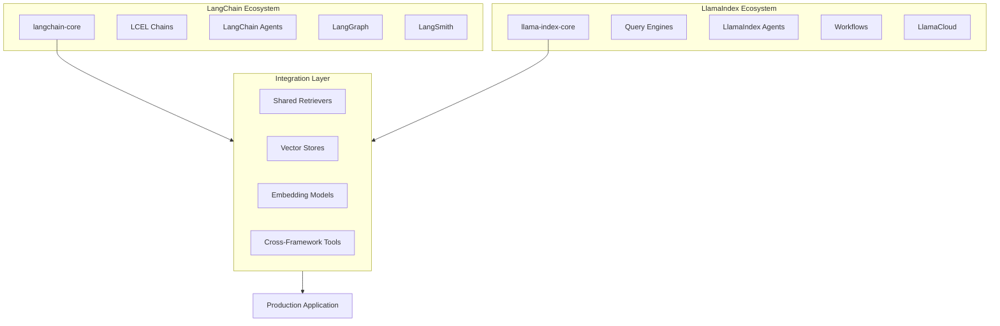

# Framework Integration Overview

## Introduction

LangChain and LlamaIndex are the two dominant frameworks for building LLM-powered applications, each with distinct strengths. Rather than treating them as competitors, modern production systems often combine both frameworks to leverage their complementary capabilities.

This lesson module explores when to use each framework, how to integrate them effectively, and the architectural patterns that emerge when combining their strengths.

### Why Framework Integration Matters

- **Leverage best-in-class capabilities** from each framework
- **Avoid lock-in** to a single ecosystem
- **Optimize for specific use cases** (retrieval, orchestration, agents)
- **Build production systems** that scale with evolving requirements
- **Reduce development time** by using pre-built components from both

---

## Module Roadmap

| Lesson | Topic | Description |
|--------|-------|-------------|
| 01 | [Choosing the Right Framework](./01-choosing-the-right-framework.md) | LangChain vs LlamaIndex strengths, decision framework |
| 02 | [LangChain with LlamaIndex](./02-langchain-with-llamaindex.md) | Using LlamaIndex retrievers and query engines in LangChain |
| 03 | [LangGraph Integration](./03-langgraph-integration.md) | LlamaIndex components in LangGraph workflows |
| 04 | [Common Architectures](./04-common-architectures.md) | RAG, multi-agent, and routing patterns |
| 05 | [Production Considerations](./05-production-considerations.md) | Dependencies, performance, monitoring |

---

## Framework Ecosystem Overview



---

## Prerequisites

Before diving into framework integration, ensure you have:

- ✅ Completed LangChain fundamentals (Lessons 1-7)
- ✅ Completed LlamaIndex fundamentals (Lessons 8-11)
- ✅ Understanding of LCEL and chains
- ✅ Experience with LlamaIndex query engines
- ✅ Familiarity with agent patterns from both frameworks

---

## Key Terminology

| Term | Definition |
|------|------------|
| **LCEL** | LangChain Expression Language - composable chain syntax |
| **Query Engine** | LlamaIndex interface for querying indexed data |
| **Retriever** | Component that fetches relevant documents for a query |
| **StateGraph** | LangGraph construct for stateful workflows |
| **Workflow** | LlamaIndex event-driven execution pattern |
| **Tool** | Function callable by an agent for specific tasks |

---

## Learning Outcomes

By completing this module, you will be able to:

1. **Evaluate** when to use LangChain, LlamaIndex, or both
2. **Integrate** LlamaIndex retrievers into LangChain chains
3. **Build** LangGraph workflows with LlamaIndex components
4. **Design** hybrid architectures for production RAG systems
5. **Manage** dependencies and monitoring across frameworks
6. **Optimize** performance when combining frameworks

---

## Quick Start: Framework Integration

Here's a preview of what's possible when combining frameworks:

```python
# LlamaIndex for document indexing and retrieval
from llama_index.core import VectorStoreIndex, SimpleDirectoryReader

# LangChain for orchestration and agents
from langchain_core.prompts import ChatPromptTemplate
from langchain_core.runnables import RunnablePassthrough
from langchain_openai import ChatOpenAI

# Load and index with LlamaIndex
documents = SimpleDirectoryReader("./data").load_data()
index = VectorStoreIndex.from_documents(documents)
retriever = index.as_retriever(similarity_top_k=3)

# Create LangChain-compatible retriever wrapper
class LlamaIndexRetrieverWrapper:
    def __init__(self, retriever):
        self.retriever = retriever
    
    def invoke(self, query: str):
        nodes = self.retriever.retrieve(query)
        return "\n".join([node.text for node in nodes])

# Use in LangChain LCEL chain
lc_retriever = LlamaIndexRetrieverWrapper(retriever)

prompt = ChatPromptTemplate.from_template(
    "Context: {context}\n\nQuestion: {question}\n\nAnswer:"
)

chain = (
    {"context": lc_retriever.invoke, "question": RunnablePassthrough()}
    | prompt
    | ChatOpenAI(model="gpt-4o-mini")
)

response = chain.invoke("What is the main topic?")
```

This is just the beginning—the following lessons explore these patterns in depth.

---

**Next:** [Choosing the Right Framework →](./01-choosing-the-right-framework.md)

---

<!-- 
Sources Consulted:
- LangChain documentation: https://docs.langchain.com/
- LlamaIndex documentation: https://developers.llamaindex.ai/
- DataCamp comparison: https://www.datacamp.com/blog/langchain-vs-llamaindex
-->
