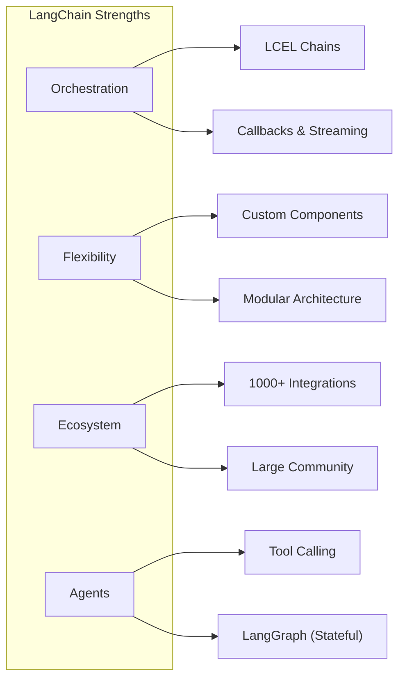
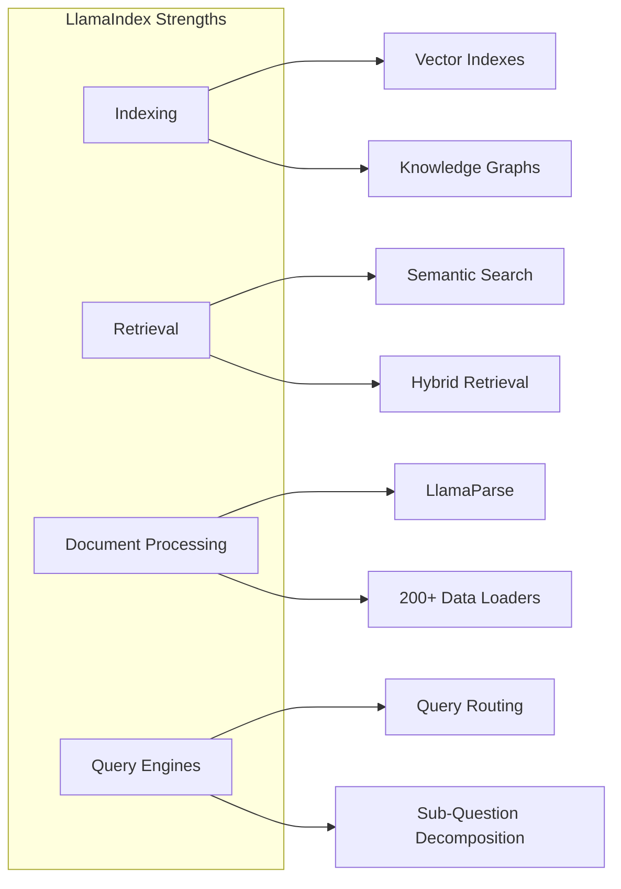
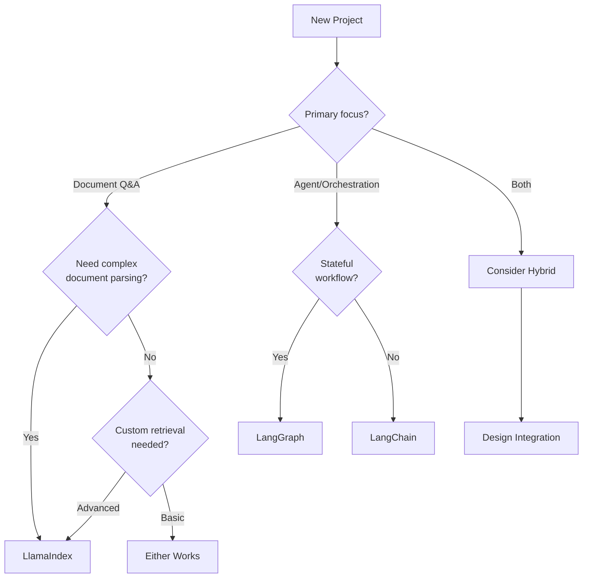
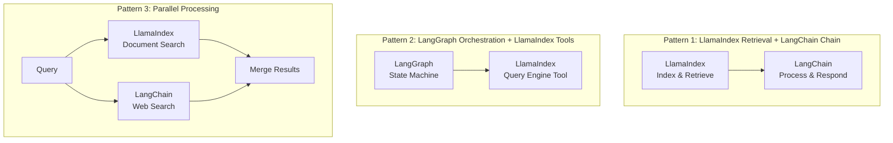

# Choosing the Right Framework

## Introduction

Both LangChain and LlamaIndex enable building powerful LLM applications, but they excel in different areas. Understanding their strengths helps you make informed architectural decisions—whether to use one framework exclusively or combine them strategically.

In this lesson, we'll analyze each framework's core strengths, common use cases, and develop a decision framework for choosing the right tool for your needs.

### What We'll Cover

- LangChain core strengths and ideal use cases
- LlamaIndex core strengths and ideal use cases
- Decision framework for framework selection
- When to combine both frameworks
- Migration considerations

### Prerequisites

- Experience with both LangChain and LlamaIndex basics
- Understanding of RAG and agent concepts
- Familiarity with production AI application requirements

---

## LangChain: Core Strengths

LangChain is a general-purpose framework for building LLM-powered applications with emphasis on **orchestration**, **flexibility**, and **ecosystem breadth**.



### Key Advantages

| Strength | Description | Best For |
|----------|-------------|----------|
| **LCEL (LangChain Expression Language)** | Declarative, composable chain syntax | Complex multi-step pipelines |
| **Extensive integrations** | 1000+ providers, tools, databases | Connecting diverse services |
| **LangGraph** | Stateful, durable agent workflows | Production agents with persistence |
| **LangSmith** | Tracing, evaluation, deployment | Production observability |
| **Memory systems** | Multiple memory implementations | Conversational applications |
| **Agent flexibility** | Build agents with any LLM | Custom agent architectures |

### Ideal Use Cases

```python
# LangChain excels at: Complex chains with multiple steps
from langchain_core.prompts import ChatPromptTemplate
from langchain_core.output_parsers import StrOutputParser
from langchain_openai import ChatOpenAI

# Multi-step processing pipeline
summarize = ChatPromptTemplate.from_template("Summarize: {text}")
analyze = ChatPromptTemplate.from_template("Analyze sentiment: {summary}")
recommend = ChatPromptTemplate.from_template("Based on: {analysis}, recommend actions")

llm = ChatOpenAI(model="gpt-4o-mini")

chain = (
    {"summary": summarize | llm | StrOutputParser()}
    | {"analysis": analyze | llm | StrOutputParser()}
    | recommend
    | llm
    | StrOutputParser()
)
```

### When LangChain is the Best Choice

1. **Complex orchestration** - Multi-step pipelines with branching logic
2. **Agent development** - Especially with LangGraph for stateful agents
3. **Integration-heavy apps** - Connecting multiple external services
4. **Memory-intensive apps** - Chatbots needing sophisticated memory
5. **Production deployment** - LangSmith provides comprehensive observability
6. **Streaming requirements** - First-class streaming support throughout

---

## LlamaIndex: Core Strengths

LlamaIndex is optimized for **data indexing**, **retrieval**, and **knowledge-intensive applications** with focus on accuracy and structured data handling.



### Key Advantages

| Strength | Description | Best For |
|----------|-------------|----------|
| **Advanced indexing** | Multiple index types (vector, tree, keyword) | Optimized retrieval |
| **Document processing** | LlamaParse for complex PDFs, tables | Structured data extraction |
| **Query engines** | Built-in response synthesis | Q&A over documents |
| **Retrieval strategies** | Hybrid, recursive, fusion retrieval | High-accuracy RAG |
| **Knowledge graphs** | Native graph support | Relational knowledge |
| **LlamaHub** | Extensive data loaders | Data ingestion from anywhere |

### Ideal Use Cases

```python
# LlamaIndex excels at: Document Q&A with advanced retrieval
from llama_index.core import (
    VectorStoreIndex,
    SimpleDirectoryReader,
    Settings
)
from llama_index.core.retrievers import VectorIndexRetriever
from llama_index.core.query_engine import RetrieverQueryEngine
from llama_index.core.postprocessor import SimilarityPostprocessor

# Load documents
documents = SimpleDirectoryReader("./data").load_data()

# Create index with custom settings
index = VectorStoreIndex.from_documents(documents)

# Configure advanced retriever
retriever = VectorIndexRetriever(
    index=index,
    similarity_top_k=10  # Retrieve more for reranking
)

# Add post-processing for quality
query_engine = RetrieverQueryEngine(
    retriever=retriever,
    node_postprocessors=[
        SimilarityPostprocessor(similarity_cutoff=0.7)
    ]
)

# High-quality Q&A
response = query_engine.query("What are the key findings?")
```

### When LlamaIndex is the Best Choice

1. **Document-centric applications** - Q&A, search, knowledge bases
2. **Complex document processing** - PDFs with tables, images, structures
3. **High-accuracy retrieval** - When retrieval quality is critical
4. **Knowledge graphs** - Applications requiring relational knowledge
5. **Multi-document reasoning** - Comparing, synthesizing across documents
6. **Rapid prototyping** - Quick document Q&A with minimal code

---

## Decision Framework

Use this framework to guide your choice:



### Quick Decision Table

| If You Need... | Choose | Why |
|----------------|--------|-----|
| Simple chatbot with memory | LangChain | Superior memory systems |
| Document Q&A system | LlamaIndex | Optimized retrieval |
| Complex multi-step pipeline | LangChain | LCEL composability |
| PDF/table extraction | LlamaIndex | LlamaParse |
| Production agents | LangGraph | Durable execution |
| Knowledge graph RAG | LlamaIndex | Native graph support |
| Integration with 3rd parties | LangChain | Broader integrations |
| Event-driven workflows | LlamaIndex | Workflows |
| Enterprise observability | LangChain | LangSmith |
| Quick RAG prototype | LlamaIndex | Less boilerplate |

---

## Combining Both Frameworks

The frameworks aren't mutually exclusive. Many production systems use both:

### Common Combination Patterns



### When to Combine

| Scenario | LlamaIndex Role | LangChain Role |
|----------|-----------------|----------------|
| RAG with complex agents | Document indexing, retrieval | Agent orchestration |
| Multi-source search | Document search | Web/API search |
| Production RAG pipeline | Query engines | LCEL chains, observability |
| Hybrid knowledge systems | Knowledge graphs | Memory, conversation |

### Example: Hybrid Architecture

```python
# Combine strengths: LlamaIndex retrieval + LangChain orchestration
from llama_index.core import VectorStoreIndex, SimpleDirectoryReader
from langchain_core.prompts import ChatPromptTemplate
from langchain_core.runnables import RunnablePassthrough, RunnableLambda
from langchain_openai import ChatOpenAI

# LlamaIndex: Best-in-class document indexing
documents = SimpleDirectoryReader("./knowledge_base").load_data()
index = VectorStoreIndex.from_documents(documents)
li_retriever = index.as_retriever(similarity_top_k=5)

# Adapter: Make LlamaIndex work with LangChain
def llamaindex_retrieve(query: str) -> str:
    """Retrieve using LlamaIndex, format for LangChain."""
    nodes = li_retriever.retrieve(query)
    return "\n\n".join([
        f"[Source {i+1}]: {node.text}" 
        for i, node in enumerate(nodes)
    ])

# LangChain: Flexible chain orchestration
prompt = ChatPromptTemplate.from_messages([
    ("system", "You are a helpful assistant. Use the provided context to answer questions."),
    ("human", "Context:\n{context}\n\nQuestion: {question}")
])

chain = (
    {
        "context": RunnableLambda(llamaindex_retrieve),
        "question": RunnablePassthrough()
    }
    | prompt
    | ChatOpenAI(model="gpt-4o-mini")
)

# Use the hybrid chain
response = chain.invoke("What are the main features?")
```

---

## Migration Considerations

### From LlamaIndex to LangChain

| LlamaIndex Concept | LangChain Equivalent |
|-------------------|---------------------|
| `VectorStoreIndex` | Vector store retrievers |
| `QueryEngine` | LCEL chain with retriever |
| `ChatEngine` | Conversation chain with memory |
| `FunctionAgent` | LangChain agent or LangGraph |
| `Workflows` | LangGraph StateGraph |

### From LangChain to LlamaIndex

| LangChain Concept | LlamaIndex Equivalent |
|------------------|----------------------|
| `VectorStoreRetriever` | `VectorIndexRetriever` |
| `ConversationChain` | `ChatEngine` |
| `AgentExecutor` | `FunctionAgent` or `ReActAgent` |
| `LangGraph` | `Workflows` |
| Memory classes | Context + Memory blocks |

### Migration Tips

1. **Start with retrieval** - Often the easiest component to migrate
2. **Keep agent logic last** - Most complex to migrate
3. **Test thoroughly** - Same inputs should produce similar outputs
4. **Maintain adapters** - Keep wrapper functions during transition
5. **Document differences** - Note semantic differences in behavior

---

## Best Practices

| Practice | Description |
|----------|-------------|
| Evaluate objectively | Benchmark both on your specific use case |
| Start simple | Begin with one framework, add complexity |
| Use adapters | Create clean interfaces between frameworks |
| Monitor both | Ensure observability across boundaries |
| Version carefully | Lock versions to prevent breaking changes |
| Document decisions | Record why you chose specific frameworks |

---

## Common Pitfalls

| ❌ Mistake | ✅ Solution |
|-----------|-------------|
| Choosing based on hype | Evaluate based on specific requirements |
| Over-engineering | Start simple, add complexity as needed |
| Ignoring maintenance cost | Consider long-term dependency management |
| Mixing without adapters | Create clean interfaces between frameworks |
| Not testing integration | Test cross-framework boundaries thoroughly |
| Forgetting about updates | Both frameworks evolve rapidly |

---

## Hands-on Exercise

### Your Task

Evaluate LangChain and LlamaIndex for a hypothetical project:

**Project Requirements:**
1. Build a customer support system
2. Index 1000+ support documents
3. Handle multi-turn conversations
4. Route to human agents when needed
5. Track all interactions for analysis
6. Deploy to production with monitoring

### Requirements

1. Create a decision matrix for this project
2. Recommend primary framework choice
3. Identify components where the other framework might help
4. Design a high-level architecture

### Expected Result

A structured analysis document with:
- Framework comparison for each requirement
- Recommended architecture
- Integration points if using both
- Production considerations

<details>
<summary>💡 Hints (click to expand)</summary>

1. Document indexing → LlamaIndex advantage
2. Conversation memory → LangChain advantage
3. Human routing → LangGraph (durable state)
4. Production monitoring → LangSmith advantage
5. Consider hybrid: LlamaIndex for retrieval, LangGraph for orchestration

</details>

<details>
<summary>✅ Sample Analysis (click to expand)</summary>

```markdown
# Customer Support System - Framework Analysis

## Decision Matrix

| Requirement | LangChain | LlamaIndex | Winner |
|-------------|-----------|------------|--------|
| Index 1000+ docs | ⭐⭐⭐ | ⭐⭐⭐⭐⭐ | LlamaIndex |
| Multi-turn conversations | ⭐⭐⭐⭐⭐ | ⭐⭐⭐ | LangChain |
| Human agent routing | ⭐⭐⭐⭐⭐ | ⭐⭐⭐ | LangGraph |
| Interaction tracking | ⭐⭐⭐⭐⭐ | ⭐⭐⭐ | LangSmith |
| Production deployment | ⭐⭐⭐⭐⭐ | ⭐⭐⭐⭐ | Even |

## Recommendation: Hybrid Architecture

**Primary: LangGraph** (for stateful conversation management)
**Supporting: LlamaIndex** (for document retrieval)
**Observability: LangSmith** (for production monitoring)

## Architecture

```
Customer Query
    ↓
[LangGraph StateGraph]
    ↓
[State: conversation_history, intent, escalation_status]
    ↓
[LlamaIndex QueryEngine] ← Knowledge Base
    ↓
[Response Synthesis]
    ↓
[Human Routing Decision] → [Escalate if needed]
    ↓
[Response to Customer]
    ↓
[LangSmith Tracing]
```

## Integration Points

1. LlamaIndex QueryEngine as LangGraph tool
2. LangSmith traces LlamaIndex calls
3. Shared embedding model configuration
4. Common vector store (e.g., Pinecone)
```

</details>

---

## Summary

✅ **LangChain** excels at orchestration, integrations, and agent development

✅ **LlamaIndex** excels at document indexing, retrieval, and knowledge applications

✅ Neither is universally "better"—choose based on specific requirements

✅ Combining frameworks leverages complementary strengths

✅ Use adapters for clean integration between frameworks

✅ Consider maintenance, observability, and long-term support

**Next:** [LangChain with LlamaIndex →](./02-langchain-with-llamaindex.md)

---

## Further Reading

- [LangChain Documentation](https://docs.langchain.com/)
- [LlamaIndex Documentation](https://developers.llamaindex.ai/)
- [LangGraph Overview](https://docs.langchain.com/oss/python/langgraph/overview)
- [LlamaIndex Workflows](https://developers.llamaindex.ai/python/framework/module_guides/workflow/)

---

<!-- 
Sources Consulted:
- DataCamp LangChain vs LlamaIndex: https://www.datacamp.com/blog/langchain-vs-llamaindex
- LangChain documentation: https://docs.langchain.com/
- LlamaIndex documentation: https://developers.llamaindex.ai/
-->
