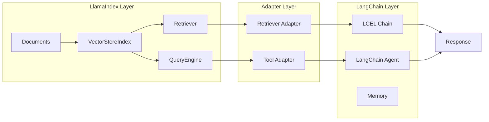

# LangChain with LlamaIndex

## Introduction

LlamaIndex's document indexing and retrieval capabilities can enhance LangChain applications. By integrating LlamaIndex retrievers, query engines, and tools into LangChain chains and agents, you combine best-in-class retrieval with flexible orchestration.

In this lesson, we'll explore practical patterns for using LlamaIndex components within LangChain workflows.

### What We'll Cover

- Using LlamaIndex retrievers in LangChain chains
- LlamaIndex as a tool for LangChain agents
- Shared vector stores between frameworks
- Embedding model compatibility
- Practical code patterns and adapters

### Prerequisites

- LangChain LCEL basics
- LlamaIndex query engines and retrievers
- Understanding of tool calling patterns

---

## Integration Architecture



---

## LlamaIndex Retriever in LCEL Chains

The most common integration pattern uses LlamaIndex for retrieval within a LangChain chain.

### Basic Retriever Wrapper

```python
from llama_index.core import VectorStoreIndex, SimpleDirectoryReader
from langchain_core.prompts import ChatPromptTemplate
from langchain_core.runnables import RunnablePassthrough, RunnableLambda
from langchain_core.output_parsers import StrOutputParser
from langchain_openai import ChatOpenAI


# Step 1: Create LlamaIndex index and retriever
documents = SimpleDirectoryReader("./data").load_data()
index = VectorStoreIndex.from_documents(documents)
li_retriever = index.as_retriever(similarity_top_k=5)


# Step 2: Create adapter function
def retrieve_with_llamaindex(query: str) -> str:
    """Retrieve documents using LlamaIndex, format for LangChain."""
    nodes = li_retriever.retrieve(query)
    
    # Format nodes as context string
    context_parts = []
    for i, node in enumerate(nodes, 1):
        context_parts.append(f"[Document {i}]\n{node.text}")
    
    return "\n\n".join(context_parts)


# Step 3: Build LangChain LCEL chain
prompt = ChatPromptTemplate.from_messages([
    ("system", "You are a helpful assistant. Answer based on the provided context."),
    ("human", "Context:\n{context}\n\nQuestion: {question}")
])

llm = ChatOpenAI(model="gpt-4o-mini", temperature=0)

rag_chain = (
    {
        "context": RunnableLambda(retrieve_with_llamaindex),
        "question": RunnablePassthrough()
    }
    | prompt
    | llm
    | StrOutputParser()
)

# Use the chain
response = rag_chain.invoke("What are the key features?")
print(response)
```

### Retriever Wrapper Class

For more control, create a reusable wrapper class:

```python
from typing import List, Any
from dataclasses import dataclass
from llama_index.core import VectorStoreIndex
from llama_index.core.schema import NodeWithScore


@dataclass
class LangChainDocument:
    """LangChain-compatible document format."""
    page_content: str
    metadata: dict


class LlamaIndexRetrieverAdapter:
    """Adapts LlamaIndex retriever for LangChain compatibility."""
    
    def __init__(
        self,
        index: VectorStoreIndex,
        similarity_top_k: int = 5,
        include_metadata: bool = True
    ):
        self.retriever = index.as_retriever(similarity_top_k=similarity_top_k)
        self.include_metadata = include_metadata
    
    def invoke(self, query: str) -> List[LangChainDocument]:
        """Retrieve and convert to LangChain document format."""
        nodes: List[NodeWithScore] = self.retriever.retrieve(query)
        
        documents = []
        for node in nodes:
            doc = LangChainDocument(
                page_content=node.text,
                metadata={
                    "score": node.score,
                    "node_id": node.node_id,
                    **(node.metadata if self.include_metadata else {})
                }
            )
            documents.append(doc)
        
        return documents
    
    def invoke_as_string(self, query: str) -> str:
        """Retrieve and return as formatted string."""
        docs = self.invoke(query)
        return "\n\n".join([
            f"[Score: {doc.metadata.get('score', 'N/A'):.3f}]\n{doc.page_content}"
            for doc in docs
        ])
    
    # Make it callable like a LangChain retriever
    def __call__(self, query: str) -> List[LangChainDocument]:
        return self.invoke(query)


# Usage
adapter = LlamaIndexRetrieverAdapter(index, similarity_top_k=5)

# In LCEL chain
chain = (
    {"context": adapter.invoke_as_string, "question": RunnablePassthrough()}
    | prompt
    | llm
    | StrOutputParser()
)
```

---

## LlamaIndex QueryEngine as LangChain Tool

Use LlamaIndex's query engines as tools in LangChain agents:

```python
from langchain_core.tools import tool
from langchain.agents import create_tool_calling_agent, AgentExecutor
from langchain_core.prompts import ChatPromptTemplate
from langchain_openai import ChatOpenAI
from llama_index.core import VectorStoreIndex, SimpleDirectoryReader


# Create LlamaIndex query engines for different knowledge bases
def create_knowledge_base_tool(path: str, name: str, description: str):
    """Factory function to create knowledge base tools."""
    documents = SimpleDirectoryReader(path).load_data()
    index = VectorStoreIndex.from_documents(documents)
    query_engine = index.as_query_engine()
    
    @tool(name=name, description=description)
    def knowledge_tool(query: str) -> str:
        """Query the knowledge base."""
        response = query_engine.query(query)
        return str(response)
    
    return knowledge_tool


# Create tools for different domains
product_tool = create_knowledge_base_tool(
    "./docs/products",
    "product_search",
    "Search product documentation for features, specifications, and usage."
)

policy_tool = create_knowledge_base_tool(
    "./docs/policies",
    "policy_search", 
    "Search company policies for HR, legal, and compliance information."
)

tech_tool = create_knowledge_base_tool(
    "./docs/technical",
    "technical_search",
    "Search technical documentation for API references and implementation guides."
)

# Create LangChain agent with LlamaIndex tools
llm = ChatOpenAI(model="gpt-4o-mini")

prompt = ChatPromptTemplate.from_messages([
    ("system", """You are a helpful assistant with access to multiple knowledge bases.
    Use the appropriate tool based on the user's question:
    - product_search: For product features and specifications
    - policy_search: For company policies and compliance
    - technical_search: For API and technical documentation"""),
    ("human", "{input}"),
    ("placeholder", "{agent_scratchpad}")
])

tools = [product_tool, policy_tool, tech_tool]
agent = create_tool_calling_agent(llm, tools, prompt)
agent_executor = AgentExecutor(agent=agent, tools=tools, verbose=True)

# Run the agent
response = agent_executor.invoke({
    "input": "What is the return policy and how do I integrate the payment API?"
})
```

---

## Shared Vector Stores

Both frameworks can share the same underlying vector store:

```python
import chromadb
from llama_index.core import VectorStoreIndex, StorageContext
from llama_index.vector_stores.chroma import ChromaVectorStore
from langchain_chroma import Chroma
from langchain_openai import OpenAIEmbeddings


# Shared ChromaDB instance
chroma_client = chromadb.PersistentClient(path="./chroma_db")
collection = chroma_client.get_or_create_collection("shared_collection")


# LlamaIndex: Index documents
from llama_index.core import SimpleDirectoryReader

# Create LlamaIndex vector store
li_vector_store = ChromaVectorStore(chroma_collection=collection)
storage_context = StorageContext.from_defaults(vector_store=li_vector_store)

# Index documents with LlamaIndex
documents = SimpleDirectoryReader("./data").load_data()
li_index = VectorStoreIndex.from_documents(
    documents,
    storage_context=storage_context
)


# LangChain: Use the same collection
lc_vectorstore = Chroma(
    client=chroma_client,
    collection_name="shared_collection",
    embedding_function=OpenAIEmbeddings()
)

# Now both frameworks use the same data!
# LlamaIndex retrieval
li_results = li_index.as_retriever().retrieve("query")

# LangChain retrieval
lc_results = lc_vectorstore.similarity_search("query")
```

### Shared Vector Store Considerations

| Aspect | Consideration |
|--------|---------------|
| **Embedding model** | Must use same model for both frameworks |
| **Metadata schema** | Ensure compatible metadata formats |
| **Index updates** | Coordinate updates to prevent conflicts |
| **Concurrency** | Handle concurrent access appropriately |
| **IDs** | Use consistent document ID schemes |

---

## Embedding Model Compatibility

Ensure both frameworks use the same embedding model:

```python
from langchain_openai import OpenAIEmbeddings
from llama_index.embeddings.openai import OpenAIEmbedding
from llama_index.core import Settings


# Configure both to use the same model
EMBEDDING_MODEL = "text-embedding-3-small"

# LangChain embedding
lc_embeddings = OpenAIEmbeddings(model=EMBEDDING_MODEL)

# LlamaIndex embedding (set globally)
Settings.embed_model = OpenAIEmbedding(model=EMBEDDING_MODEL)

# Or configure per-index
from llama_index.core import VectorStoreIndex

index = VectorStoreIndex.from_documents(
    documents,
    embed_model=OpenAIEmbedding(model=EMBEDDING_MODEL)
)
```

### Embedding Compatibility Matrix

| Provider | LangChain Package | LlamaIndex Package |
|----------|------------------|-------------------|
| OpenAI | `langchain-openai` | `llama-index-embeddings-openai` |
| Cohere | `langchain-cohere` | `llama-index-embeddings-cohere` |
| HuggingFace | `langchain-huggingface` | `llama-index-embeddings-huggingface` |
| Azure | `langchain-openai` | `llama-index-embeddings-azure-openai` |
| Ollama | `langchain-ollama` | `llama-index-embeddings-ollama` |

---

## Advanced Integration Patterns

### Pattern 1: LlamaIndex for Preprocessing, LangChain for Chat

```python
from llama_index.core import VectorStoreIndex, SimpleDirectoryReader
from langchain_core.prompts import ChatPromptTemplate, MessagesPlaceholder
from langchain_core.messages import HumanMessage, AIMessage
from langchain_core.runnables import RunnablePassthrough, RunnableLambda
from langchain_openai import ChatOpenAI


# LlamaIndex: Document processing and retrieval
documents = SimpleDirectoryReader("./data").load_data()
index = VectorStoreIndex.from_documents(documents)
retriever = index.as_retriever(similarity_top_k=3)


def get_context(inputs: dict) -> dict:
    """Retrieve context based on the latest message."""
    query = inputs["messages"][-1].content if inputs["messages"] else ""
    nodes = retriever.retrieve(query)
    context = "\n".join([n.text for n in nodes])
    return {**inputs, "context": context}


# LangChain: Conversational interface with memory
prompt = ChatPromptTemplate.from_messages([
    ("system", "You are a helpful assistant. Use the context to answer questions.\n\nContext: {context}"),
    MessagesPlaceholder("messages"),
])

llm = ChatOpenAI(model="gpt-4o-mini")

chain = (
    RunnableLambda(get_context)
    | prompt
    | llm
)

# Conversation with history
history = []
while True:
    user_input = input("You: ")
    if user_input.lower() == "quit":
        break
    
    history.append(HumanMessage(content=user_input))
    response = chain.invoke({"messages": history})
    history.append(response)
    
    print(f"Assistant: {response.content}")
```

### Pattern 2: Routing Between LlamaIndex Engines

```python
from typing import Literal
from langchain_core.prompts import ChatPromptTemplate
from langchain_core.output_parsers import PydanticOutputParser
from langchain_openai import ChatOpenAI
from pydantic import BaseModel, Field
from llama_index.core import VectorStoreIndex, SimpleDirectoryReader


# Create multiple LlamaIndex engines
def create_engine(path: str):
    docs = SimpleDirectoryReader(path).load_data()
    index = VectorStoreIndex.from_documents(docs)
    return index.as_query_engine()


engines = {
    "products": create_engine("./docs/products"),
    "support": create_engine("./docs/support"),
    "legal": create_engine("./docs/legal"),
}


# LangChain: Route to appropriate engine
class RouteDecision(BaseModel):
    """Decision on which knowledge base to query."""
    route: Literal["products", "support", "legal"] = Field(
        description="The knowledge base to route the query to"
    )
    reasoning: str = Field(description="Brief reasoning for the choice")


router_prompt = ChatPromptTemplate.from_template("""
Given the user query, decide which knowledge base to search:
- products: Product features, specifications, pricing
- support: Technical support, troubleshooting, FAQs
- legal: Terms of service, privacy policy, compliance

Query: {query}

{format_instructions}
""")

parser = PydanticOutputParser(pydantic_object=RouteDecision)
llm = ChatOpenAI(model="gpt-4o-mini")

router_chain = (
    router_prompt.partial(format_instructions=parser.get_format_instructions())
    | llm
    | parser
)


def route_and_query(query: str) -> str:
    """Route query to appropriate LlamaIndex engine."""
    decision = router_chain.invoke({"query": query})
    engine = engines[decision.route]
    response = engine.query(query)
    return f"[Routed to: {decision.route}]\n\n{response}"


# Usage
result = route_and_query("What is your refund policy?")
print(result)
```

---

## Complete Example: Hybrid RAG System

```python
import asyncio
from typing import List
from dataclasses import dataclass
from llama_index.core import VectorStoreIndex, SimpleDirectoryReader
from llama_index.core.schema import NodeWithScore
from langchain_core.prompts import ChatPromptTemplate
from langchain_core.runnables import RunnablePassthrough, RunnableLambda, RunnableParallel
from langchain_core.output_parsers import StrOutputParser
from langchain_openai import ChatOpenAI


@dataclass
class RetrievalResult:
    """Unified retrieval result."""
    content: str
    source: str
    score: float


class HybridRAGSystem:
    """RAG system combining LlamaIndex retrieval with LangChain orchestration."""
    
    def __init__(self, data_path: str):
        # LlamaIndex: Document indexing
        documents = SimpleDirectoryReader(data_path).load_data()
        self.index = VectorStoreIndex.from_documents(documents)
        self.retriever = self.index.as_retriever(similarity_top_k=5)
        
        # LangChain: LLM and chain
        self.llm = ChatOpenAI(model="gpt-4o-mini", temperature=0)
        
        self.qa_prompt = ChatPromptTemplate.from_messages([
            ("system", """You are a helpful assistant. Answer based on the provided context.
            If the context doesn't contain relevant information, say so.
            Always cite which document(s) you used."""),
            ("human", "Context:\n{context}\n\nQuestion: {question}")
        ])
        
        self.summarize_prompt = ChatPromptTemplate.from_template(
            "Summarize the key points:\n\n{text}"
        )
    
    def retrieve(self, query: str) -> List[RetrievalResult]:
        """Retrieve using LlamaIndex."""
        nodes: List[NodeWithScore] = self.retriever.retrieve(query)
        
        return [
            RetrievalResult(
                content=node.text,
                source=node.metadata.get("file_name", "unknown"),
                score=node.score or 0.0
            )
            for node in nodes
        ]
    
    def format_context(self, results: List[RetrievalResult]) -> str:
        """Format retrieval results for LLM context."""
        formatted = []
        for i, result in enumerate(results, 1):
            formatted.append(
                f"[Document {i} - {result.source} (score: {result.score:.3f})]\n{result.content}"
            )
        return "\n\n".join(formatted)
    
    def query(self, question: str) -> str:
        """Execute RAG query."""
        # Retrieve with LlamaIndex
        results = self.retrieve(question)
        context = self.format_context(results)
        
        # Generate with LangChain
        chain = self.qa_prompt | self.llm | StrOutputParser()
        response = chain.invoke({
            "context": context,
            "question": question
        })
        
        return response
    
    def query_with_summary(self, question: str) -> dict:
        """Query with both answer and summary."""
        results = self.retrieve(question)
        context = self.format_context(results)
        
        # Parallel generation
        parallel_chain = RunnableParallel(
            answer=self.qa_prompt | self.llm | StrOutputParser(),
            summary=self.summarize_prompt | self.llm | StrOutputParser()
        )
        
        output = parallel_chain.invoke({
            "context": context,
            "question": question,
            "text": context
        })
        
        return {
            "answer": output["answer"],
            "summary": output["summary"],
            "sources": [r.source for r in results]
        }


# Usage
system = HybridRAGSystem("./knowledge_base")

# Simple query
answer = system.query("What are the main features?")
print(answer)

# Query with summary
result = system.query_with_summary("Explain the pricing model")
print(f"Answer: {result['answer']}")
print(f"Summary: {result['summary']}")
print(f"Sources: {result['sources']}")
```

---

## Best Practices

| Practice | Description |
|----------|-------------|
| Use adapters | Create clean interfaces between frameworks |
| Match embeddings | Use identical embedding models |
| Handle errors | Wrap cross-framework calls in try/except |
| Log at boundaries | Add logging for debugging integration |
| Test independently | Verify each component before integration |
| Version lock | Pin specific versions of both frameworks |

---

## Common Pitfalls

| ❌ Mistake | ✅ Solution |
|-----------|-------------|
| Mismatched embeddings | Use same model and dimensions |
| Direct object passing | Convert to compatible formats |
| Ignoring async | Handle sync/async boundaries properly |
| No error handling | Wrap integration points |
| Memory leaks | Properly manage index lifecycles |
| Conflicting dependencies | Use compatible version combinations |

---

## Hands-on Exercise

### Your Task

Build a multi-source Q&A system that:
1. Uses LlamaIndex to index 3 different document collections
2. Routes queries using LangChain
3. Returns responses with source attribution

### Requirements

1. Create 3 separate LlamaIndex indexes (simulate with folders)
2. Build a LangChain routing chain
3. Execute queries against the appropriate index
4. Format responses with source information

### Expected Result

```
Query: "What is the pricing for the enterprise plan?"

[Routing to: products]
Based on the product documentation, the enterprise plan costs $499/month...

Sources:
- products/pricing.md (score: 0.89)
- products/plans.md (score: 0.76)
```

<details>
<summary>💡 Hints (click to expand)</summary>

1. Create a dict mapping route names to LlamaIndex query engines
2. Use LangChain's structured output for routing decisions
3. Return both the response and source metadata
4. Consider caching indexes for performance

</details>

<details>
<summary>✅ Solution (click to expand)</summary>

```python
from typing import Literal
from pydantic import BaseModel, Field
from llama_index.core import VectorStoreIndex, Document
from langchain_core.prompts import ChatPromptTemplate
from langchain_core.output_parsers import PydanticOutputParser
from langchain_openai import ChatOpenAI


# Simulate document collections
def create_mock_index(category: str, docs: list) -> VectorStoreIndex:
    """Create index from mock documents."""
    documents = [Document(text=text, metadata={"category": category}) for text in docs]
    return VectorStoreIndex.from_documents(documents)


# Create indexes
indexes = {
    "products": create_mock_index("products", [
        "Enterprise plan: $499/month with unlimited users",
        "Starter plan: $49/month for up to 5 users",
        "Pro plan: $199/month for up to 25 users"
    ]),
    "support": create_mock_index("support", [
        "For password reset, go to Settings > Security",
        "Contact support at support@example.com",
        "FAQ: Most common issues and solutions"
    ]),
    "legal": create_mock_index("legal", [
        "Terms of Service last updated January 2025",
        "Privacy Policy: We do not sell user data",
        "GDPR compliance: Request data deletion via email"
    ])
}

query_engines = {name: idx.as_query_engine() for name, idx in indexes.items()}


# Router
class RouteDecision(BaseModel):
    route: Literal["products", "support", "legal"]
    confidence: float = Field(ge=0, le=1)


parser = PydanticOutputParser(pydantic_object=RouteDecision)
llm = ChatOpenAI(model="gpt-4o-mini")

router_prompt = ChatPromptTemplate.from_template("""
Route this query to the appropriate knowledge base:
- products: pricing, features, plans
- support: help, troubleshooting, contact
- legal: terms, privacy, compliance

Query: {query}

{format_instructions}
""")

router = router_prompt.partial(
    format_instructions=parser.get_format_instructions()
) | llm | parser


def multi_source_query(query: str) -> dict:
    """Route and execute query."""
    # Route
    decision = router.invoke({"query": query})
    
    # Query appropriate engine
    engine = query_engines[decision.route]
    response = engine.query(query)
    
    # Get source nodes
    sources = [
        {"text": node.text[:50] + "...", "score": node.score}
        for node in response.source_nodes
    ]
    
    return {
        "route": decision.route,
        "confidence": decision.confidence,
        "answer": str(response),
        "sources": sources
    }


# Test
result = multi_source_query("What is the pricing for the enterprise plan?")
print(f"[Routed to: {result['route']} (confidence: {result['confidence']:.2f})]")
print(f"\nAnswer: {result['answer']}")
print(f"\nSources:")
for src in result['sources']:
    print(f"  - {src['text']} (score: {src['score']:.2f})")
```

</details>

---

## Summary

✅ LlamaIndex retrievers integrate into LangChain via adapter functions

✅ LlamaIndex query engines work as LangChain agent tools

✅ Shared vector stores enable seamless data sharing

✅ Embedding model compatibility is critical for shared stores

✅ Router patterns enable intelligent query distribution

✅ Clean adapters make integration maintainable

**Next:** [LangGraph Integration →](./03-langgraph-integration.md)

---

## Further Reading

- [LlamaIndex Retriever Documentation](https://developers.llamaindex.ai/python/framework/module_guides/querying/retriever/)
- [LangChain LCEL Documentation](https://docs.langchain.com/oss/python/langchain/lcel)
- [LlamaHub LangChain Tools](https://llamahub.ai/l/tools/llama-index-tools-langchain)

---

<!-- 
Sources Consulted:
- LlamaIndex Retriever: https://developers.llamaindex.ai/python/framework/module_guides/querying/retriever/
- LangChain documentation: https://docs.langchain.com/
- LlamaHub: https://llamahub.ai/
-->
