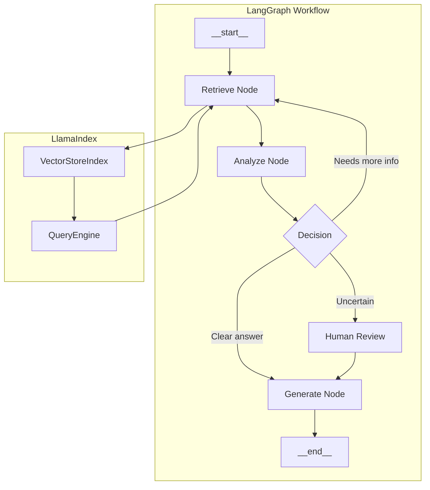

# LangGraph Integration

## Introduction

LangGraph extends LangChain with stateful, graph-based orchestration for building complex AI workflows. By integrating LlamaIndex components within LangGraph nodes, you can create sophisticated agents that combine powerful retrieval with durable execution and human-in-the-loop capabilities.

In this lesson, we'll explore how to build LangGraph workflows that leverage LlamaIndex's indexing and query capabilities.

### What We'll Cover

- LangGraph fundamentals and state management
- LlamaIndex nodes within LangGraph workflows
- Multi-step retrieval agents
- Human-in-the-loop patterns with retrieval
- Error handling and recovery

### Prerequisites

- LangGraph basics (StateGraph, nodes, edges)
- LlamaIndex query engines
- LangChain agent patterns

---

## LangGraph Architecture



---

## LangGraph Fundamentals

### StateGraph Basics

```python
from typing import TypedDict, Annotated, List
from langgraph.graph import StateGraph, START, END
from langgraph.graph.message import add_messages
from langchain_core.messages import BaseMessage, HumanMessage, AIMessage


# Define state schema
class AgentState(TypedDict):
    """State that persists across nodes."""
    messages: Annotated[List[BaseMessage], add_messages]
    context: str
    iteration: int
    complete: bool


# Create graph
graph = StateGraph(AgentState)


# Define nodes (functions that modify state)
def retriever_node(state: AgentState) -> AgentState:
    """Retrieve relevant context."""
    # Implementation here
    return {"context": "Retrieved context...", "iteration": state.get("iteration", 0) + 1}


def generator_node(state: AgentState) -> AgentState:
    """Generate response based on context."""
    # Implementation here
    return {"messages": [AIMessage(content="Generated response...")]}


# Add nodes
graph.add_node("retrieve", retriever_node)
graph.add_node("generate", generator_node)

# Add edges
graph.add_edge(START, "retrieve")
graph.add_edge("retrieve", "generate")
graph.add_edge("generate", END)

# Compile
app = graph.compile()
```

---

## LlamaIndex in LangGraph Nodes

### Basic Integration

```python
from typing import TypedDict, Annotated, List
from langgraph.graph import StateGraph, START, END
from langgraph.graph.message import add_messages
from langchain_core.messages import BaseMessage, HumanMessage, AIMessage
from langchain_openai import ChatOpenAI
from llama_index.core import VectorStoreIndex, SimpleDirectoryReader


# Load documents and create index
documents = SimpleDirectoryReader("./data").load_data()
index = VectorStoreIndex.from_documents(documents)
query_engine = index.as_query_engine()

llm = ChatOpenAI(model="gpt-4o-mini")


# State definition
class RAGState(TypedDict):
    messages: Annotated[List[BaseMessage], add_messages]
    context: str
    query: str


# Node: Extract query from messages
def extract_query(state: RAGState) -> RAGState:
    """Extract the query from the last message."""
    last_message = state["messages"][-1]
    return {"query": last_message.content}


# Node: Retrieve with LlamaIndex
def retrieve_context(state: RAGState) -> RAGState:
    """Use LlamaIndex to retrieve relevant context."""
    query = state["query"]
    
    # Use LlamaIndex retriever
    retriever = index.as_retriever(similarity_top_k=5)
    nodes = retriever.retrieve(query)
    
    # Format context
    context_parts = []
    for i, node in enumerate(nodes, 1):
        score = node.score or 0
        context_parts.append(f"[{i}] (score: {score:.3f})\n{node.text}")
    
    return {"context": "\n\n".join(context_parts)}


# Node: Generate response
def generate_response(state: RAGState) -> RAGState:
    """Generate answer using context."""
    context = state["context"]
    query = state["query"]
    
    prompt = f"""Based on the following context, answer the question.

Context:
{context}

Question: {query}

Provide a clear, concise answer with citations to the relevant documents."""
    
    response = llm.invoke(prompt)
    
    return {"messages": [AIMessage(content=response.content)]}


# Build graph
graph = StateGraph(RAGState)

graph.add_node("extract", extract_query)
graph.add_node("retrieve", retrieve_context)
graph.add_node("generate", generate_response)

graph.add_edge(START, "extract")
graph.add_edge("extract", "retrieve")
graph.add_edge("retrieve", "generate")
graph.add_edge("generate", END)

rag_app = graph.compile()


# Usage
result = rag_app.invoke({
    "messages": [HumanMessage(content="What are the main features?")],
    "context": "",
    "query": ""
})

print(result["messages"][-1].content)
```

---

## Conditional Retrieval Flow

### Multi-step Retrieval with Quality Check

```python
from typing import TypedDict, Annotated, List, Literal
from langgraph.graph import StateGraph, START, END
from langgraph.graph.message import add_messages
from langchain_core.messages import BaseMessage, HumanMessage, AIMessage
from langchain_openai import ChatOpenAI
from llama_index.core import VectorStoreIndex


class RetrievalState(TypedDict):
    messages: Annotated[List[BaseMessage], add_messages]
    query: str
    context: str
    context_quality: str  # "sufficient", "insufficient", "empty"
    retrieval_attempts: int


def retrieve_with_llamaindex(state: RetrievalState) -> RetrievalState:
    """Retrieve context using LlamaIndex."""
    query = state["query"]
    attempts = state.get("retrieval_attempts", 0)
    
    # Adjust retrieval parameters based on attempts
    top_k = 3 + (attempts * 2)  # Get more docs on retry
    
    retriever = index.as_retriever(similarity_top_k=top_k)
    nodes = retriever.retrieve(query)
    
    if not nodes:
        return {
            "context": "",
            "context_quality": "empty",
            "retrieval_attempts": attempts + 1
        }
    
    # Format context
    context = "\n\n".join([n.text for n in nodes])
    
    return {
        "context": context,
        "retrieval_attempts": attempts + 1
    }


def evaluate_context(state: RetrievalState) -> RetrievalState:
    """Evaluate if retrieved context is sufficient."""
    context = state["context"]
    query = state["query"]
    
    if not context:
        return {"context_quality": "empty"}
    
    # Use LLM to evaluate relevance
    evaluation_prompt = f"""Evaluate if this context can answer the question.

Question: {query}

Context: {context[:1000]}...

Is this context sufficient to provide a good answer?
Respond with only: SUFFICIENT or INSUFFICIENT"""
    
    llm = ChatOpenAI(model="gpt-4o-mini")
    result = llm.invoke(evaluation_prompt)
    
    if "SUFFICIENT" in result.content.upper():
        return {"context_quality": "sufficient"}
    else:
        return {"context_quality": "insufficient"}


def generate_answer(state: RetrievalState) -> RetrievalState:
    """Generate final answer."""
    llm = ChatOpenAI(model="gpt-4o-mini")
    
    prompt = f"""Answer based on the context.

Context: {state['context']}

Question: {state['query']}"""
    
    response = llm.invoke(prompt)
    return {"messages": [AIMessage(content=response.content)]}


def generate_fallback(state: RetrievalState) -> RetrievalState:
    """Generate fallback when context is insufficient."""
    return {
        "messages": [AIMessage(
            content=f"I couldn't find sufficient information to answer: {state['query']}. "
                   "Please try rephrasing your question or ask about a different topic."
        )]
    }


# Routing function
def route_after_evaluation(state: RetrievalState) -> Literal["generate", "retry", "fallback"]:
    """Decide next step based on context quality."""
    quality = state["context_quality"]
    attempts = state["retrieval_attempts"]
    
    if quality == "sufficient":
        return "generate"
    elif quality == "insufficient" and attempts < 3:
        return "retry"
    else:
        return "fallback"


# Build graph
graph = StateGraph(RetrievalState)

graph.add_node("retrieve", retrieve_with_llamaindex)
graph.add_node("evaluate", evaluate_context)
graph.add_node("generate", generate_answer)
graph.add_node("fallback", generate_fallback)

graph.add_edge(START, "retrieve")
graph.add_edge("retrieve", "evaluate")

graph.add_conditional_edges(
    "evaluate",
    route_after_evaluation,
    {
        "generate": "generate",
        "retry": "retrieve",
        "fallback": "fallback"
    }
)

graph.add_edge("generate", END)
graph.add_edge("fallback", END)

conditional_rag = graph.compile()
```

---

## Multi-Index Router

### Routing Between Multiple LlamaIndex Engines

```python
from typing import TypedDict, Annotated, List, Literal
from langgraph.graph import StateGraph, START, END
from langgraph.graph.message import add_messages
from langchain_core.messages import BaseMessage, AIMessage
from langchain_openai import ChatOpenAI
from llama_index.core import VectorStoreIndex, SimpleDirectoryReader
from pydantic import BaseModel, Field


# Create multiple indexes
def create_index(path: str) -> VectorStoreIndex:
    docs = SimpleDirectoryReader(path).load_data()
    return VectorStoreIndex.from_documents(docs)


indexes = {
    "products": create_index("./docs/products"),
    "support": create_index("./docs/support"),
    "legal": create_index("./docs/legal")
}


class RouterState(TypedDict):
    messages: Annotated[List[BaseMessage], add_messages]
    query: str
    route: str
    context: str


class RouteDecision(BaseModel):
    """Route decision for query."""
    route: Literal["products", "support", "legal"] = Field(
        description="Which knowledge base to query"
    )


def route_query(state: RouterState) -> RouterState:
    """Determine which index to query."""
    query = state["query"]
    llm = ChatOpenAI(model="gpt-4o-mini")
    
    prompt = f"""Classify this query into one category:
- products: Product features, pricing, specifications
- support: Technical help, troubleshooting, how-to
- legal: Terms, privacy, compliance

Query: {query}

Respond with only the category name: products, support, or legal"""
    
    response = llm.invoke(prompt)
    route = response.content.strip().lower()
    
    # Validate route
    if route not in indexes:
        route = "support"  # Default fallback
    
    return {"route": route}


def retrieve_from_index(state: RouterState) -> RouterState:
    """Retrieve from the selected index."""
    route = state["route"]
    query = state["query"]
    
    index = indexes[route]
    retriever = index.as_retriever(similarity_top_k=5)
    nodes = retriever.retrieve(query)
    
    context = f"[Source: {route}]\n\n"
    context += "\n\n".join([n.text for n in nodes])
    
    return {"context": context}


def generate_response(state: RouterState) -> RouterState:
    """Generate response with source attribution."""
    llm = ChatOpenAI(model="gpt-4o-mini")
    
    prompt = f"""Answer the question based on the context.
Include which source you used in your response.

Context: {state['context']}

Question: {state['query']}"""
    
    response = llm.invoke(prompt)
    return {"messages": [AIMessage(content=response.content)]}


# Build graph
router_graph = StateGraph(RouterState)

router_graph.add_node("route", route_query)
router_graph.add_node("retrieve", retrieve_from_index)
router_graph.add_node("generate", generate_response)

router_graph.add_edge(START, "route")
router_graph.add_edge("route", "retrieve")
router_graph.add_edge("retrieve", "generate")
router_graph.add_edge("generate", END)

router_app = router_graph.compile()
```

---

## Human-in-the-Loop Patterns

### Retrieval with Human Approval

```python
from typing import TypedDict, Annotated, List, Literal
from langgraph.graph import StateGraph, START, END
from langgraph.checkpoint.memory import MemorySaver
from langgraph.graph.message import add_messages
from langchain_core.messages import BaseMessage, AIMessage, HumanMessage
from langchain_openai import ChatOpenAI


class HumanInLoopState(TypedDict):
    messages: Annotated[List[BaseMessage], add_messages]
    query: str
    context: str
    draft_response: str
    human_approved: bool
    human_feedback: str


def retrieve_context(state: HumanInLoopState) -> HumanInLoopState:
    """Retrieve using LlamaIndex."""
    query = state["query"]
    retriever = index.as_retriever(similarity_top_k=5)
    nodes = retriever.retrieve(query)
    
    context = "\n\n".join([
        f"[Doc {i+1}] {n.text}" for i, n in enumerate(nodes)
    ])
    
    return {"context": context}


def generate_draft(state: HumanInLoopState) -> HumanInLoopState:
    """Generate draft response for human review."""
    llm = ChatOpenAI(model="gpt-4o-mini")
    
    prompt = f"""Generate a response based on the context.

Context: {state['context']}

Question: {state['query']}"""
    
    response = llm.invoke(prompt)
    
    return {"draft_response": response.content}


def request_human_review(state: HumanInLoopState) -> HumanInLoopState:
    """Pause for human review."""
    # This node returns an interrupt
    # The graph will pause here until resumed
    return {
        "messages": [AIMessage(
            content=f"**Draft Response (pending approval):**\n\n{state['draft_response']}"
        )]
    }


def process_feedback(state: HumanInLoopState) -> HumanInLoopState:
    """Process human feedback."""
    feedback = state.get("human_feedback", "")
    approved = state.get("human_approved", False)
    
    if approved:
        return {"messages": [AIMessage(content=state["draft_response"])]}
    else:
        # Regenerate with feedback
        llm = ChatOpenAI(model="gpt-4o-mini")
        
        prompt = f"""Revise the response based on feedback.

Original Response: {state['draft_response']}

Feedback: {feedback}

Context: {state['context']}

Question: {state['query']}

Provide an improved response:"""
        
        response = llm.invoke(prompt)
        return {"messages": [AIMessage(content=response.content)]}


def route_after_review(state: HumanInLoopState) -> Literal["process", "end"]:
    """Route based on human decision."""
    if state.get("human_approved"):
        return "end"
    return "process"


# Build graph with checkpointing
memory = MemorySaver()

hitl_graph = StateGraph(HumanInLoopState)

hitl_graph.add_node("retrieve", retrieve_context)
hitl_graph.add_node("draft", generate_draft)
hitl_graph.add_node("review", request_human_review)
hitl_graph.add_node("process", process_feedback)

hitl_graph.add_edge(START, "retrieve")
hitl_graph.add_edge("retrieve", "draft")
hitl_graph.add_edge("draft", "review")
hitl_graph.add_conditional_edges(
    "review",
    route_after_review,
    {"process": "process", "end": END}
)
hitl_graph.add_edge("process", END)

hitl_app = hitl_graph.compile(
    checkpointer=memory,
    interrupt_before=["review"]  # Pause before human review
)


# Usage with interruption
config = {"configurable": {"thread_id": "1"}}

# Start the workflow
result = hitl_app.invoke({
    "messages": [HumanMessage(content="Explain the refund policy")],
    "query": "Explain the refund policy",
    "context": "",
    "draft_response": "",
    "human_approved": False,
    "human_feedback": ""
}, config)

# Graph is now paused at "review" node
# Get current state
current_state = hitl_app.get_state(config)
print(f"Draft: {current_state.values['draft_response']}")

# Resume with approval
hitl_app.update_state(config, {"human_approved": True})
final_result = hitl_app.invoke(None, config)
```

---

## Error Handling and Recovery

### Resilient RAG with Retry Logic

```python
from typing import TypedDict, Annotated, List, Literal, Optional
from langgraph.graph import StateGraph, START, END
from langgraph.graph.message import add_messages
from langchain_core.messages import BaseMessage, AIMessage
import traceback


class ResilientState(TypedDict):
    messages: Annotated[List[BaseMessage], add_messages]
    query: str
    context: str
    error: Optional[str]
    retry_count: int
    max_retries: int


def safe_retrieve(state: ResilientState) -> ResilientState:
    """Retrieve with error handling."""
    try:
        query = state["query"]
        retriever = index.as_retriever(similarity_top_k=5)
        nodes = retriever.retrieve(query)
        
        context = "\n\n".join([n.text for n in nodes])
        
        return {
            "context": context,
            "error": None
        }
    except Exception as e:
        return {
            "context": "",
            "error": f"Retrieval error: {str(e)}",
            "retry_count": state.get("retry_count", 0) + 1
        }


def safe_generate(state: ResilientState) -> ResilientState:
    """Generate with error handling."""
    try:
        if not state["context"]:
            return {
                "messages": [AIMessage(
                    content="I couldn't find relevant information. Please try a different question."
                )]
            }
        
        llm = ChatOpenAI(model="gpt-4o-mini")
        
        prompt = f"""Answer based on context.

Context: {state['context']}
Question: {state['query']}"""
        
        response = llm.invoke(prompt)
        
        return {"messages": [AIMessage(content=response.content)]}
    except Exception as e:
        return {
            "error": f"Generation error: {str(e)}",
            "retry_count": state.get("retry_count", 0) + 1
        }


def handle_error(state: ResilientState) -> ResilientState:
    """Handle errors gracefully."""
    error = state.get("error", "Unknown error")
    retry_count = state.get("retry_count", 0)
    max_retries = state.get("max_retries", 3)
    
    message = f"I encountered an issue: {error}\n\n"
    
    if retry_count < max_retries:
        message += f"Retrying... (attempt {retry_count + 1}/{max_retries})"
    else:
        message += "Please try again later or contact support."
    
    return {"messages": [AIMessage(content=message)]}


def route_after_retrieve(state: ResilientState) -> Literal["generate", "error"]:
    """Route based on retrieval success."""
    if state.get("error"):
        return "error"
    return "generate"


def route_after_error(state: ResilientState) -> Literal["retrieve", "end"]:
    """Decide whether to retry."""
    retry_count = state.get("retry_count", 0)
    max_retries = state.get("max_retries", 3)
    
    if retry_count < max_retries:
        return "retrieve"
    return "end"


# Build resilient graph
resilient_graph = StateGraph(ResilientState)

resilient_graph.add_node("retrieve", safe_retrieve)
resilient_graph.add_node("generate", safe_generate)
resilient_graph.add_node("error", handle_error)

resilient_graph.add_edge(START, "retrieve")
resilient_graph.add_conditional_edges(
    "retrieve",
    route_after_retrieve,
    {"generate": "generate", "error": "error"}
)
resilient_graph.add_edge("generate", END)
resilient_graph.add_conditional_edges(
    "error",
    route_after_error,
    {"retrieve": "retrieve", "end": END}
)

resilient_app = resilient_graph.compile()
```

---

## Complete Example: Research Agent

```python
from typing import TypedDict, Annotated, List, Literal
from langgraph.graph import StateGraph, START, END
from langgraph.graph.message import add_messages
from langchain_core.messages import BaseMessage, HumanMessage, AIMessage
from langchain_openai import ChatOpenAI
from llama_index.core import VectorStoreIndex, SimpleDirectoryReader
from pydantic import BaseModel, Field


# Initialize
documents = SimpleDirectoryReader("./research_papers").load_data()
index = VectorStoreIndex.from_documents(documents)


class ResearchState(TypedDict):
    messages: Annotated[List[BaseMessage], add_messages]
    original_query: str
    current_query: str
    findings: List[str]
    synthesis: str
    iteration: int
    max_iterations: int
    needs_more_research: bool


class ResearchDecision(BaseModel):
    """Decision about research completeness."""
    complete: bool = Field(description="Is research complete?")
    next_query: str = Field(description="Follow-up query if not complete")
    reasoning: str = Field(description="Reasoning for decision")


def initial_research(state: ResearchState) -> ResearchState:
    """First research pass."""
    query = state["original_query"]
    
    retriever = index.as_retriever(similarity_top_k=5)
    nodes = retriever.retrieve(query)
    
    findings = [f"Initial: {n.text[:200]}..." for n in nodes]
    
    return {
        "current_query": query,
        "findings": findings,
        "iteration": 1
    }


def evaluate_completeness(state: ResearchState) -> ResearchState:
    """Evaluate if we have enough information."""
    llm = ChatOpenAI(model="gpt-4o-mini")
    
    findings_text = "\n".join(state["findings"])
    
    prompt = f"""Evaluate if we have enough information to answer the original question.

Original Question: {state['original_query']}

Findings so far:
{findings_text}

Respond with:
1. COMPLETE if we have enough information
2. INCOMPLETE with a follow-up query if we need more research

Format: COMPLETE or INCOMPLETE: <follow-up query>"""
    
    response = llm.invoke(prompt)
    content = response.content.strip()
    
    if content.startswith("COMPLETE"):
        return {"needs_more_research": False}
    else:
        # Extract follow-up query
        follow_up = content.replace("INCOMPLETE:", "").strip()
        return {
            "needs_more_research": True,
            "current_query": follow_up
        }


def additional_research(state: ResearchState) -> ResearchState:
    """Conduct follow-up research."""
    query = state["current_query"]
    
    retriever = index.as_retriever(similarity_top_k=3)
    nodes = retriever.retrieve(query)
    
    new_findings = [f"Follow-up: {n.text[:200]}..." for n in nodes]
    
    return {
        "findings": state["findings"] + new_findings,
        "iteration": state["iteration"] + 1
    }


def synthesize(state: ResearchState) -> ResearchState:
    """Synthesize all findings into final answer."""
    llm = ChatOpenAI(model="gpt-4o-mini")
    
    findings_text = "\n\n".join(state["findings"])
    
    prompt = f"""Synthesize these research findings into a comprehensive answer.

Original Question: {state['original_query']}

Research Findings:
{findings_text}

Provide a well-structured, complete answer:"""
    
    response = llm.invoke(prompt)
    
    return {
        "synthesis": response.content,
        "messages": [AIMessage(content=response.content)]
    }


def route_after_evaluation(state: ResearchState) -> Literal["more", "synthesize"]:
    """Decide whether to research more or synthesize."""
    if state.get("needs_more_research") and state["iteration"] < state["max_iterations"]:
        return "more"
    return "synthesize"


# Build research agent
research_graph = StateGraph(ResearchState)

research_graph.add_node("initial", initial_research)
research_graph.add_node("evaluate", evaluate_completeness)
research_graph.add_node("additional", additional_research)
research_graph.add_node("synthesize", synthesize)

research_graph.add_edge(START, "initial")
research_graph.add_edge("initial", "evaluate")
research_graph.add_conditional_edges(
    "evaluate",
    route_after_evaluation,
    {"more": "additional", "synthesize": "synthesize"}
)
research_graph.add_edge("additional", "evaluate")
research_graph.add_edge("synthesize", END)

research_agent = research_graph.compile()


# Usage
result = research_agent.invoke({
    "messages": [],
    "original_query": "What are the latest developments in transformer architectures?",
    "current_query": "",
    "findings": [],
    "synthesis": "",
    "iteration": 0,
    "max_iterations": 3,
    "needs_more_research": True
})

print(f"Research completed in {result['iteration']} iterations")
print(f"\nAnswer:\n{result['synthesis']}")
```

---

## Best Practices

| Practice | Description |
|----------|-------------|
| Define clear state | Explicitly type all state fields |
| Limit iterations | Set max retries/iterations to prevent infinite loops |
| Handle errors | Wrap external calls in try/except |
| Use checkpoints | Enable recovery with MemorySaver |
| Log transitions | Log node entries/exits for debugging |
| Test nodes independently | Unit test each node function |

---

## Common Pitfalls

| ❌ Mistake | ✅ Solution |
|-----------|-------------|
| Unbounded loops | Always set max_iterations |
| Missing state keys | Initialize all required fields |
| Blocking on external calls | Add timeouts and retries |
| No error recovery | Use conditional edges to error handlers |
| Ignoring state immutability | Return new state dicts, don't mutate |
| Complex routing logic | Break into multiple nodes |

---

## Hands-on Exercise

### Your Task

Build a LangGraph workflow that:
1. Takes a research question
2. Retrieves context using LlamaIndex
3. Evaluates if more context is needed
4. Iterates up to 3 times
5. Synthesizes a final answer

### Requirements

1. Define proper state with typing
2. Implement retrieval, evaluation, and synthesis nodes
3. Use conditional routing
4. Handle the case where no relevant context is found

### Expected Result

```
Query: "What are the key benefits of RAG systems?"

[Iteration 1] Retrieved 5 documents
[Evaluation] Need more specific information about accuracy benefits
[Iteration 2] Retrieved 3 more documents
[Evaluation] Research complete

Final Answer:
RAG systems provide several key benefits:
1. Reduced hallucinations...
2. Up-to-date information...
3. Source attribution...
```

<details>
<summary>💡 Hints (click to expand)</summary>

1. Use TypedDict for state definition
2. Track iteration count in state
3. Use conditional_edges for routing
4. Return partial state updates from nodes
5. Check iteration count before looping

</details>

<details>
<summary>✅ Solution (click to expand)</summary>

```python
from typing import TypedDict, Annotated, List, Literal
from langgraph.graph import StateGraph, START, END
from langgraph.graph.message import add_messages
from langchain_core.messages import BaseMessage, AIMessage
from langchain_openai import ChatOpenAI
from llama_index.core import VectorStoreIndex, Document


# Mock index
mock_docs = [
    Document(text="RAG reduces hallucinations by grounding responses in facts."),
    Document(text="RAG provides up-to-date information beyond training data."),
    Document(text="RAG enables source attribution for transparency."),
]
index = VectorStoreIndex.from_documents(mock_docs)


class IterativeRAGState(TypedDict):
    messages: Annotated[List[BaseMessage], add_messages]
    query: str
    context: str
    iteration: int
    max_iterations: int
    is_complete: bool


def retrieve(state: IterativeRAGState) -> IterativeRAGState:
    """Retrieve context."""
    retriever = index.as_retriever(similarity_top_k=3)
    nodes = retriever.retrieve(state["query"])
    
    context = state.get("context", "")
    new_context = "\n".join([n.text for n in nodes])
    
    print(f"[Iteration {state['iteration'] + 1}] Retrieved {len(nodes)} documents")
    
    return {
        "context": context + "\n\n" + new_context if context else new_context,
        "iteration": state["iteration"] + 1
    }


def evaluate(state: IterativeRAGState) -> IterativeRAGState:
    """Evaluate completeness."""
    llm = ChatOpenAI(model="gpt-4o-mini")
    
    prompt = f"""Is this context sufficient to answer the question?

Question: {state['query']}
Context: {state['context'][:500]}

Respond: COMPLETE or INCOMPLETE"""
    
    response = llm.invoke(prompt)
    is_complete = "COMPLETE" in response.content.upper()
    
    print(f"[Evaluation] {'Research complete' if is_complete else 'Need more information'}")
    
    return {"is_complete": is_complete}


def synthesize(state: IterativeRAGState) -> IterativeRAGState:
    """Generate final answer."""
    llm = ChatOpenAI(model="gpt-4o-mini")
    
    prompt = f"""Answer the question based on context.

Context: {state['context']}
Question: {state['query']}

Provide a structured answer:"""
    
    response = llm.invoke(prompt)
    
    return {"messages": [AIMessage(content=response.content)]}


def should_continue(state: IterativeRAGState) -> Literal["retrieve", "synthesize"]:
    """Decide whether to continue or synthesize."""
    if state["is_complete"] or state["iteration"] >= state["max_iterations"]:
        return "synthesize"
    return "retrieve"


# Build graph
graph = StateGraph(IterativeRAGState)

graph.add_node("retrieve", retrieve)
graph.add_node("evaluate", evaluate)
graph.add_node("synthesize", synthesize)

graph.add_edge(START, "retrieve")
graph.add_edge("retrieve", "evaluate")
graph.add_conditional_edges("evaluate", should_continue)
graph.add_edge("synthesize", END)

app = graph.compile()

# Run
result = app.invoke({
    "messages": [],
    "query": "What are the key benefits of RAG systems?",
    "context": "",
    "iteration": 0,
    "max_iterations": 3,
    "is_complete": False
})

print(f"\nFinal Answer:\n{result['messages'][-1].content}")
```

</details>

---

## Summary

✅ LangGraph provides stateful, graph-based AI workflow orchestration

✅ LlamaIndex components integrate naturally as node functions

✅ Conditional edges enable dynamic retrieval strategies

✅ Human-in-the-loop patterns require checkpointing

✅ Error handling and retry logic are essential for production

✅ State management is key to multi-step retrieval workflows

**Next:** [Common Architectures →](./04-common-architectures.md)

---

## Further Reading

- [LangGraph Documentation](https://langchain-ai.github.io/langgraph/)
- [LangGraph Tutorials](https://langchain-ai.github.io/langgraph/tutorials/)
- [LlamaIndex Query Engines](https://docs.llamaindex.ai/en/stable/module_guides/querying/)

---

<!-- 
Sources Consulted:
- LangGraph: https://langchain-ai.github.io/langgraph/
- LlamaIndex: https://docs.llamaindex.ai/
-->
