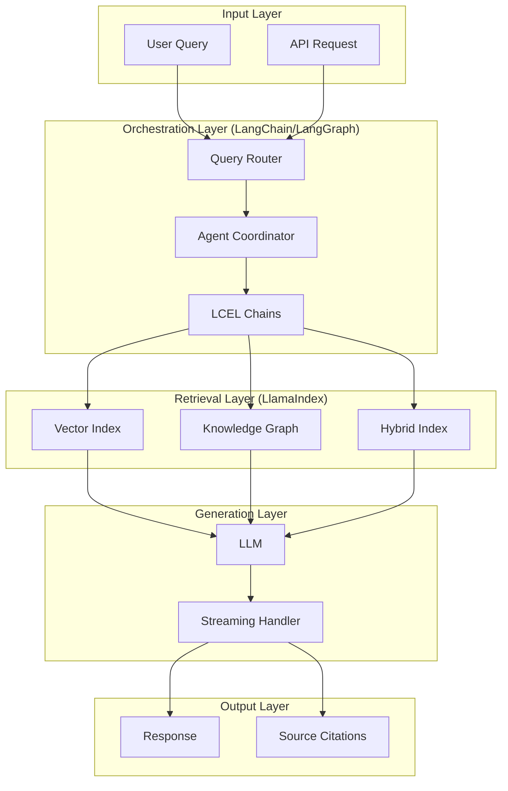
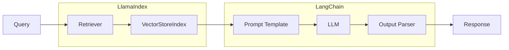
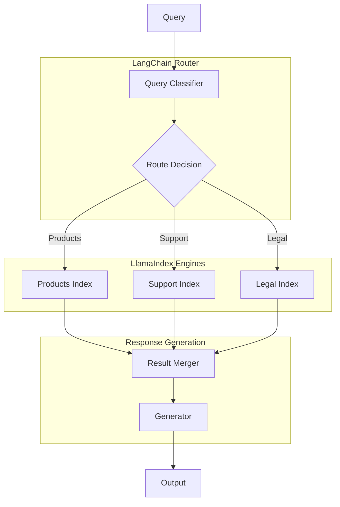
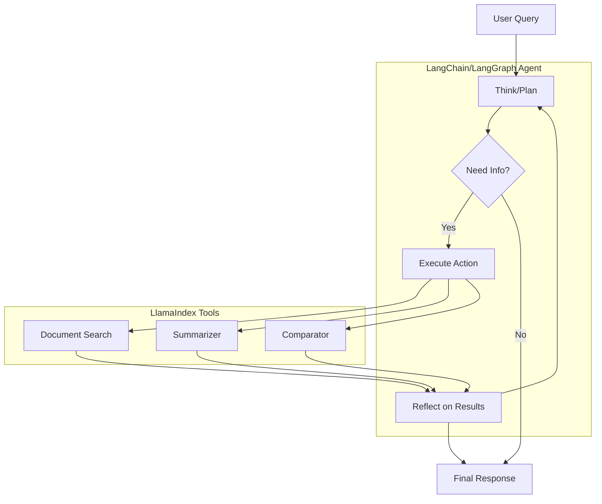
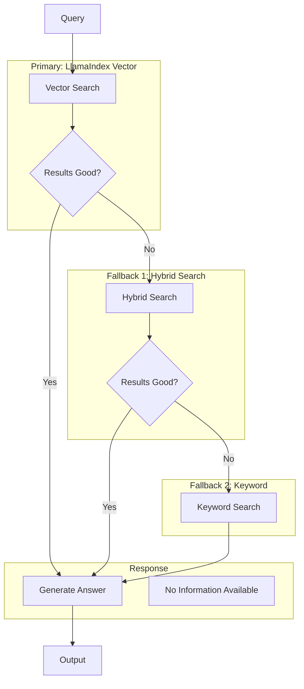
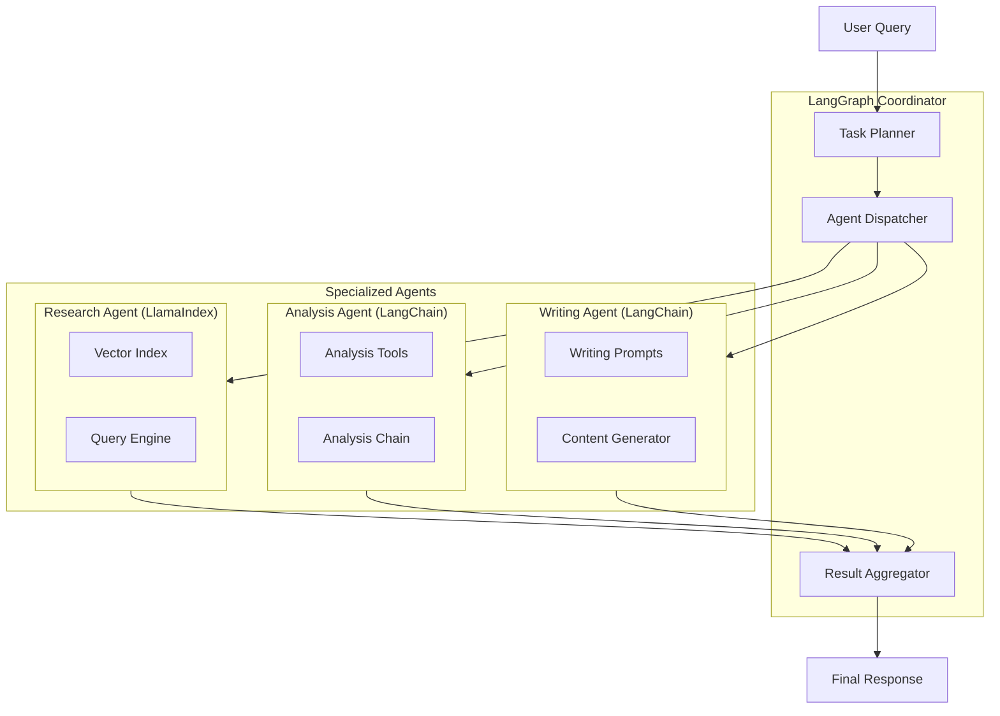
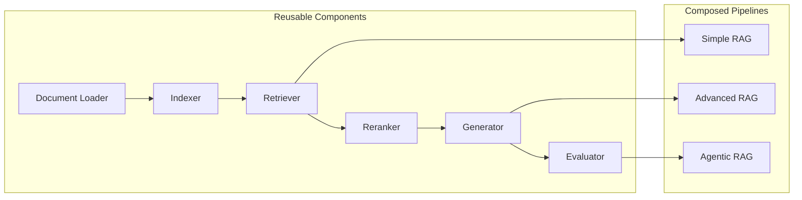

# Common Architectures

## Introduction

Production AI applications often combine multiple frameworks to leverage their unique strengths. This lesson explores proven architectural patterns for building systems that integrate LangChain, LlamaIndex, and LangGraph effectively.

We'll examine real-world architectures from simple RAG systems to complex multi-agent deployments.

### What We'll Cover

- RAG architectures with both frameworks
- Multi-agent mixed framework patterns
- Query routing and orchestration
- Fallback and redundancy patterns
- Modular architecture design

### Prerequisites

- LangChain and LlamaIndex fundamentals
- LangGraph basics
- Understanding of RAG patterns

---

## Architecture Overview



---

## Pattern 1: Basic Hybrid RAG

The simplest integration pattern uses LlamaIndex for indexing/retrieval and LangChain for the generation chain.

### Architecture



### Implementation

```python
from typing import List
from llama_index.core import VectorStoreIndex, SimpleDirectoryReader
from langchain_core.prompts import ChatPromptTemplate
from langchain_core.runnables import RunnablePassthrough, RunnableLambda
from langchain_core.output_parsers import StrOutputParser
from langchain_openai import ChatOpenAI


class HybridRAG:
    """Basic Hybrid RAG: LlamaIndex retrieval + LangChain generation."""
    
    def __init__(self, data_path: str, model: str = "gpt-4o-mini"):
        # LlamaIndex: Indexing
        documents = SimpleDirectoryReader(data_path).load_data()
        self.index = VectorStoreIndex.from_documents(documents)
        self.retriever = self.index.as_retriever(similarity_top_k=5)
        
        # LangChain: Generation
        self.llm = ChatOpenAI(model=model, temperature=0)
        
        self.prompt = ChatPromptTemplate.from_messages([
            ("system", """You are a helpful assistant. Answer based on the provided context.
            If the context doesn't contain relevant information, say so.
            Cite sources when possible."""),
            ("human", "Context:\n{context}\n\nQuestion: {question}")
        ])
        
        # Build chain
        self.chain = (
            {"context": self._retrieve, "question": RunnablePassthrough()}
            | self.prompt
            | self.llm
            | StrOutputParser()
        )
    
    def _retrieve(self, query: str) -> str:
        """Retrieve using LlamaIndex."""
        nodes = self.retriever.retrieve(query)
        return "\n\n".join([
            f"[Source: {n.metadata.get('file_name', 'unknown')}]\n{n.text}"
            for n in nodes
        ])
    
    def query(self, question: str) -> str:
        """Execute query."""
        return self.chain.invoke(question)


# Usage
rag = HybridRAG("./documents")
answer = rag.query("What are the key features?")
print(answer)
```

---

## Pattern 2: Multi-Index Router

Route queries to specialized indexes based on query classification.

### Architecture



### Implementation

```python
from typing import Literal, Dict
from pydantic import BaseModel, Field
from llama_index.core import VectorStoreIndex, SimpleDirectoryReader
from langchain_core.prompts import ChatPromptTemplate
from langchain_core.output_parsers import PydanticOutputParser
from langchain_openai import ChatOpenAI


class QueryRoute(BaseModel):
    """Query routing decision."""
    primary_route: Literal["products", "support", "legal"] = Field(
        description="Primary knowledge base to query"
    )
    secondary_route: Literal["products", "support", "legal", "none"] = Field(
        default="none",
        description="Secondary knowledge base if query spans domains"
    )
    confidence: float = Field(ge=0, le=1, description="Routing confidence")


class MultiIndexRouter:
    """Route queries to specialized LlamaIndex indexes."""
    
    def __init__(self, index_paths: Dict[str, str]):
        # Create indexes for each domain
        self.indexes = {}
        self.query_engines = {}
        
        for name, path in index_paths.items():
            docs = SimpleDirectoryReader(path).load_data()
            index = VectorStoreIndex.from_documents(docs)
            self.indexes[name] = index
            self.query_engines[name] = index.as_query_engine()
        
        # LangChain router
        self.llm = ChatOpenAI(model="gpt-4o-mini")
        self.parser = PydanticOutputParser(pydantic_object=QueryRoute)
        
        self.router_prompt = ChatPromptTemplate.from_template("""
Classify this query to route it to the appropriate knowledge base:
- products: Product features, specifications, pricing, comparisons
- support: Technical help, troubleshooting, how-to guides
- legal: Terms of service, privacy, compliance, contracts

If the query spans multiple domains, specify both primary and secondary routes.

Query: {query}

{format_instructions}
""")
    
    def route(self, query: str) -> QueryRoute:
        """Determine query route."""
        chain = (
            self.router_prompt.partial(
                format_instructions=self.parser.get_format_instructions()
            )
            | self.llm
            | self.parser
        )
        return chain.invoke({"query": query})
    
    def query(self, question: str) -> Dict:
        """Route and execute query."""
        route = self.route(question)
        
        results = {}
        
        # Query primary index
        primary_response = self.query_engines[route.primary_route].query(question)
        results["primary"] = {
            "route": route.primary_route,
            "response": str(primary_response),
            "sources": [n.text[:100] for n in primary_response.source_nodes]
        }
        
        # Query secondary if specified
        if route.secondary_route != "none":
            secondary_response = self.query_engines[route.secondary_route].query(question)
            results["secondary"] = {
                "route": route.secondary_route,
                "response": str(secondary_response),
                "sources": [n.text[:100] for n in secondary_response.source_nodes]
            }
        
        results["confidence"] = route.confidence
        
        return results


# Usage
router = MultiIndexRouter({
    "products": "./docs/products",
    "support": "./docs/support",
    "legal": "./docs/legal"
})

result = router.query("What is the pricing and refund policy?")
print(f"Primary ({result['primary']['route']}): {result['primary']['response']}")
if "secondary" in result:
    print(f"Secondary ({result['secondary']['route']}): {result['secondary']['response']}")
```

---

## Pattern 3: Agentic RAG

Agents that dynamically decide when and what to retrieve.

### Architecture



### Implementation

```python
from typing import List, Dict
from langchain_core.tools import tool
from langchain.agents import create_tool_calling_agent, AgentExecutor
from langchain_core.prompts import ChatPromptTemplate
from langchain_openai import ChatOpenAI
from llama_index.core import VectorStoreIndex, SimpleDirectoryReader, SummaryIndex


# Create LlamaIndex-powered tools
class LlamaIndexTools:
    """LlamaIndex-powered tools for LangChain agents."""
    
    def __init__(self, data_path: str):
        documents = SimpleDirectoryReader(data_path).load_data()
        
        # Different index types for different operations
        self.vector_index = VectorStoreIndex.from_documents(documents)
        self.summary_index = SummaryIndex.from_documents(documents)
        
        self.search_engine = self.vector_index.as_query_engine()
        self.summary_engine = self.summary_index.as_query_engine(
            response_mode="tree_summarize"
        )
    
    def get_tools(self) -> List:
        """Return LangChain-compatible tools."""
        
        search_engine = self.search_engine
        summary_engine = self.summary_engine
        vector_index = self.vector_index
        
        @tool
        def semantic_search(query: str) -> str:
            """Search documents for specific information. Use for factual questions."""
            response = search_engine.query(query)
            sources = [f"- {n.metadata.get('file_name', 'doc')}" 
                      for n in response.source_nodes]
            return f"{response}\n\nSources:\n" + "\n".join(sources)
        
        @tool
        def summarize_topic(topic: str) -> str:
            """Get a comprehensive summary of a topic. Use for overview questions."""
            response = summary_engine.query(f"Summarize everything about: {topic}")
            return str(response)
        
        @tool
        def compare_items(item1: str, item2: str) -> str:
            """Compare two items or concepts. Use for comparison questions."""
            retriever = vector_index.as_retriever(similarity_top_k=3)
            
            nodes1 = retriever.retrieve(item1)
            nodes2 = retriever.retrieve(item2)
            
            comparison = f"## {item1}\n"
            comparison += "\n".join([n.text[:200] for n in nodes1])
            comparison += f"\n\n## {item2}\n"
            comparison += "\n".join([n.text[:200] for n in nodes2])
            
            return comparison
        
        return [semantic_search, summarize_topic, compare_items]


# Build agentic RAG
def create_agentic_rag(data_path: str) -> AgentExecutor:
    """Create an agent with LlamaIndex-powered tools."""
    
    li_tools = LlamaIndexTools(data_path)
    tools = li_tools.get_tools()
    
    llm = ChatOpenAI(model="gpt-4o-mini")
    
    prompt = ChatPromptTemplate.from_messages([
        ("system", """You are a helpful research assistant with access to a document knowledge base.

Available tools:
- semantic_search: For specific factual questions
- summarize_topic: For comprehensive overviews
- compare_items: For comparing two things

Think step by step:
1. Understand what the user needs
2. Choose the appropriate tool(s)
3. Synthesize information from multiple sources if needed
4. Provide a clear, well-organized answer"""),
        ("human", "{input}"),
        ("placeholder", "{agent_scratchpad}")
    ])
    
    agent = create_tool_calling_agent(llm, tools, prompt)
    
    return AgentExecutor(
        agent=agent,
        tools=tools,
        verbose=True,
        max_iterations=5
    )


# Usage
agent = create_agentic_rag("./knowledge_base")

result = agent.invoke({
    "input": "Compare the Pro and Enterprise plans, and summarize the key differences"
})
print(result["output"])
```

---

## Pattern 4: Fallback Architecture

Graceful degradation with multiple retrieval strategies.

### Architecture



### Implementation

```python
from typing import List, Optional, Tuple
from dataclasses import dataclass
from llama_index.core import VectorStoreIndex, SimpleDirectoryReader
from llama_index.core.schema import NodeWithScore
from langchain_core.prompts import ChatPromptTemplate
from langchain_core.runnables import RunnableLambda
from langchain_core.output_parsers import StrOutputParser
from langchain_openai import ChatOpenAI


@dataclass
class RetrievalResult:
    """Result from retrieval attempt."""
    nodes: List[NodeWithScore]
    strategy: str
    score: float


class FallbackRAG:
    """RAG with fallback retrieval strategies."""
    
    def __init__(self, data_path: str, min_score: float = 0.5):
        documents = SimpleDirectoryReader(data_path).load_data()
        self.index = VectorStoreIndex.from_documents(documents)
        self.min_score = min_score
        
        self.llm = ChatOpenAI(model="gpt-4o-mini")
        
        self.prompt = ChatPromptTemplate.from_messages([
            ("system", """Answer based on the provided context.
            Strategy used: {strategy}
            Confidence: {confidence}
            
            If context is insufficient, say so clearly."""),
            ("human", "Context:\n{context}\n\nQuestion: {question}")
        ])
    
    def _vector_search(self, query: str, top_k: int = 5) -> RetrievalResult:
        """Primary: Vector similarity search."""
        retriever = self.index.as_retriever(similarity_top_k=top_k)
        nodes = retriever.retrieve(query)
        
        avg_score = sum(n.score or 0 for n in nodes) / len(nodes) if nodes else 0
        
        return RetrievalResult(
            nodes=nodes,
            strategy="vector",
            score=avg_score
        )
    
    def _expanded_search(self, query: str, top_k: int = 10) -> RetrievalResult:
        """Fallback 1: Expanded vector search with more results."""
        retriever = self.index.as_retriever(similarity_top_k=top_k)
        nodes = retriever.retrieve(query)
        
        avg_score = sum(n.score or 0 for n in nodes) / len(nodes) if nodes else 0
        
        return RetrievalResult(
            nodes=nodes,
            strategy="expanded_vector",
            score=avg_score
        )
    
    def _keyword_search(self, query: str) -> RetrievalResult:
        """Fallback 2: Keyword-based search."""
        # Simulate keyword search with lower threshold
        retriever = self.index.as_retriever(
            similarity_top_k=15
        )
        nodes = retriever.retrieve(query)
        
        # Filter to any relevance
        filtered = [n for n in nodes if (n.score or 0) > 0.1]
        
        avg_score = sum(n.score or 0 for n in filtered) / len(filtered) if filtered else 0
        
        return RetrievalResult(
            nodes=filtered,
            strategy="keyword_fallback",
            score=avg_score
        )
    
    def retrieve_with_fallback(self, query: str) -> Tuple[RetrievalResult, str]:
        """Try retrieval strategies with fallback."""
        strategies = [
            ("vector", self._vector_search),
            ("expanded", self._expanded_search),
            ("keyword", self._keyword_search)
        ]
        
        for name, strategy in strategies:
            result = strategy(query)
            
            if result.nodes and result.score >= self.min_score:
                return result, "success"
            elif result.nodes:
                # Keep best result so far
                best_result = result
        
        # Return best result even if below threshold
        if 'best_result' in locals():
            return best_result, "low_confidence"
        
        return RetrievalResult(nodes=[], strategy="none", score=0), "no_results"
    
    def query(self, question: str) -> Dict:
        """Execute query with fallback."""
        result, status = self.retrieve_with_fallback(question)
        
        if status == "no_results":
            return {
                "answer": "I couldn't find any relevant information for your question.",
                "strategy": "none",
                "confidence": 0,
                "status": status
            }
        
        context = "\n\n".join([n.text for n in result.nodes])
        
        chain = self.prompt | self.llm | StrOutputParser()
        
        answer = chain.invoke({
            "context": context,
            "question": question,
            "strategy": result.strategy,
            "confidence": f"{result.score:.2f}"
        })
        
        return {
            "answer": answer,
            "strategy": result.strategy,
            "confidence": result.score,
            "status": status,
            "sources": [n.metadata.get("file_name", "unknown") for n in result.nodes]
        }


# Usage
rag = FallbackRAG("./documents", min_score=0.6)
result = rag.query("What are the advanced integration features?")

print(f"Strategy used: {result['strategy']}")
print(f"Confidence: {result['confidence']:.2f}")
print(f"Status: {result['status']}")
print(f"\nAnswer: {result['answer']}")
```

---

## Pattern 5: Multi-Agent with Mixed Frameworks

Specialized agents using different frameworks for different tasks.

### Architecture



### Implementation

```python
from typing import TypedDict, Annotated, List, Literal, Dict, Any
from langgraph.graph import StateGraph, START, END
from langgraph.graph.message import add_messages
from langchain_core.messages import BaseMessage, HumanMessage, AIMessage
from langchain_core.prompts import ChatPromptTemplate
from langchain_openai import ChatOpenAI
from llama_index.core import VectorStoreIndex, SimpleDirectoryReader


# State for multi-agent system
class MultiAgentState(TypedDict):
    messages: Annotated[List[BaseMessage], add_messages]
    query: str
    task_plan: List[Dict[str, str]]
    research_results: str
    analysis_results: str
    final_output: str
    current_step: int


# Research Agent (LlamaIndex-powered)
class ResearchAgent:
    """Research agent using LlamaIndex."""
    
    def __init__(self, data_path: str):
        documents = SimpleDirectoryReader(data_path).load_data()
        self.index = VectorStoreIndex.from_documents(documents)
        self.query_engine = self.index.as_query_engine()
    
    def research(self, query: str) -> str:
        """Conduct research on a topic."""
        response = self.query_engine.query(query)
        
        sources = [n.metadata.get("file_name", "unknown") 
                  for n in response.source_nodes]
        
        return f"Research Findings:\n{response}\n\nSources: {', '.join(sources)}"


# Analysis Agent (LangChain-powered)
class AnalysisAgent:
    """Analysis agent using LangChain."""
    
    def __init__(self):
        self.llm = ChatOpenAI(model="gpt-4o-mini")
        
        self.prompt = ChatPromptTemplate.from_template("""
Analyze the following research findings and extract key insights:

Research:
{research}

Provide:
1. Key themes
2. Important findings
3. Gaps or areas needing more research
4. Recommendations
""")
    
    def analyze(self, research: str) -> str:
        """Analyze research findings."""
        chain = self.prompt | self.llm
        response = chain.invoke({"research": research})
        return response.content


# Writing Agent (LangChain-powered)
class WritingAgent:
    """Writing agent for content generation."""
    
    def __init__(self):
        self.llm = ChatOpenAI(model="gpt-4o-mini")
        
        self.prompt = ChatPromptTemplate.from_template("""
Create a comprehensive response based on the research and analysis:

Original Query: {query}

Research: {research}

Analysis: {analysis}

Write a clear, well-structured response that directly addresses the query.
Include relevant examples and cite sources where appropriate.
""")
    
    def write(self, query: str, research: str, analysis: str) -> str:
        """Generate final content."""
        chain = self.prompt | self.llm
        response = chain.invoke({
            "query": query,
            "research": research,
            "analysis": analysis
        })
        return response.content


# Build LangGraph coordinator
def create_multi_agent_system(data_path: str):
    """Create multi-agent system with LangGraph coordination."""
    
    research_agent = ResearchAgent(data_path)
    analysis_agent = AnalysisAgent()
    writing_agent = WritingAgent()
    planner_llm = ChatOpenAI(model="gpt-4o-mini")
    
    def plan_tasks(state: MultiAgentState) -> MultiAgentState:
        """Plan which agents to invoke."""
        query = state["query"]
        
        # Simple planning: always use all agents in sequence
        plan = [
            {"agent": "research", "task": f"Research: {query}"},
            {"agent": "analysis", "task": "Analyze research findings"},
            {"agent": "writing", "task": "Generate final response"}
        ]
        
        return {"task_plan": plan, "current_step": 0}
    
    def execute_research(state: MultiAgentState) -> MultiAgentState:
        """Execute research agent."""
        query = state["query"]
        results = research_agent.research(query)
        return {"research_results": results, "current_step": 1}
    
    def execute_analysis(state: MultiAgentState) -> MultiAgentState:
        """Execute analysis agent."""
        research = state["research_results"]
        results = analysis_agent.analyze(research)
        return {"analysis_results": results, "current_step": 2}
    
    def execute_writing(state: MultiAgentState) -> MultiAgentState:
        """Execute writing agent."""
        output = writing_agent.write(
            state["query"],
            state["research_results"],
            state["analysis_results"]
        )
        return {
            "final_output": output,
            "messages": [AIMessage(content=output)],
            "current_step": 3
        }
    
    # Build graph
    graph = StateGraph(MultiAgentState)
    
    graph.add_node("plan", plan_tasks)
    graph.add_node("research", execute_research)
    graph.add_node("analyze", execute_analysis)
    graph.add_node("write", execute_writing)
    
    graph.add_edge(START, "plan")
    graph.add_edge("plan", "research")
    graph.add_edge("research", "analyze")
    graph.add_edge("analyze", "write")
    graph.add_edge("write", END)
    
    return graph.compile()


# Usage
system = create_multi_agent_system("./knowledge_base")

result = system.invoke({
    "messages": [],
    "query": "What are the best practices for API security?",
    "task_plan": [],
    "research_results": "",
    "analysis_results": "",
    "final_output": "",
    "current_step": 0
})

print(result["final_output"])
```

---

## Pattern 6: Modular Pipeline

Reusable, composable components for flexible architectures.

### Architecture



### Implementation

```python
from abc import ABC, abstractmethod
from typing import List, Dict, Any, Optional, Protocol
from dataclasses import dataclass
from llama_index.core import VectorStoreIndex, SimpleDirectoryReader
from langchain_core.prompts import ChatPromptTemplate
from langchain_openai import ChatOpenAI


# Component interfaces
class Retriever(Protocol):
    """Retriever component interface."""
    def retrieve(self, query: str) -> List[Dict[str, Any]]: ...


class Generator(Protocol):
    """Generator component interface."""
    def generate(self, query: str, context: str) -> str: ...


class Reranker(Protocol):
    """Reranker component interface."""
    def rerank(self, query: str, documents: List[Dict]) -> List[Dict]: ...


# LlamaIndex-based retriever
class LlamaIndexRetriever:
    """Retriever using LlamaIndex."""
    
    def __init__(self, data_path: str, top_k: int = 5):
        documents = SimpleDirectoryReader(data_path).load_data()
        self.index = VectorStoreIndex.from_documents(documents)
        self.top_k = top_k
    
    def retrieve(self, query: str) -> List[Dict[str, Any]]:
        retriever = self.index.as_retriever(similarity_top_k=self.top_k)
        nodes = retriever.retrieve(query)
        
        return [
            {
                "content": n.text,
                "score": n.score,
                "metadata": n.metadata
            }
            for n in nodes
        ]


# LangChain-based generator
class LangChainGenerator:
    """Generator using LangChain."""
    
    def __init__(self, model: str = "gpt-4o-mini", temperature: float = 0):
        self.llm = ChatOpenAI(model=model, temperature=temperature)
        
        self.prompt = ChatPromptTemplate.from_messages([
            ("system", "You are a helpful assistant. Answer based on the provided context."),
            ("human", "Context:\n{context}\n\nQuestion: {query}")
        ])
    
    def generate(self, query: str, context: str) -> str:
        chain = self.prompt | self.llm
        response = chain.invoke({"query": query, "context": context})
        return response.content


# LLM-based reranker
class LLMReranker:
    """Reranker using LLM scoring."""
    
    def __init__(self, model: str = "gpt-4o-mini"):
        self.llm = ChatOpenAI(model=model, temperature=0)
        
        self.prompt = ChatPromptTemplate.from_template("""
Rate the relevance of this document to the query on a scale of 1-10.
Only respond with the number.

Query: {query}
Document: {document}

Relevance score:""")
    
    def rerank(self, query: str, documents: List[Dict]) -> List[Dict]:
        scored = []
        
        for doc in documents:
            chain = self.prompt | self.llm
            response = chain.invoke({
                "query": query,
                "document": doc["content"][:500]
            })
            
            try:
                score = float(response.content.strip())
            except:
                score = doc.get("score", 5)
            
            scored.append({**doc, "rerank_score": score})
        
        return sorted(scored, key=lambda x: x["rerank_score"], reverse=True)


# Pipeline builder
class RAGPipeline:
    """Composable RAG pipeline."""
    
    def __init__(
        self,
        retriever: Retriever,
        generator: Generator,
        reranker: Optional[Reranker] = None,
        top_k_rerank: int = 3
    ):
        self.retriever = retriever
        self.generator = generator
        self.reranker = reranker
        self.top_k_rerank = top_k_rerank
    
    def run(self, query: str) -> Dict[str, Any]:
        """Execute the pipeline."""
        # Retrieve
        documents = self.retriever.retrieve(query)
        
        # Optionally rerank
        if self.reranker:
            documents = self.reranker.rerank(query, documents)
            documents = documents[:self.top_k_rerank]
        
        # Format context
        context = "\n\n".join([
            f"[{i+1}] {doc['content']}"
            for i, doc in enumerate(documents)
        ])
        
        # Generate
        answer = self.generator.generate(query, context)
        
        return {
            "answer": answer,
            "documents": documents,
            "query": query
        }


# Usage: Simple RAG
simple_rag = RAGPipeline(
    retriever=LlamaIndexRetriever("./docs"),
    generator=LangChainGenerator()
)

# Usage: Advanced RAG with reranking
advanced_rag = RAGPipeline(
    retriever=LlamaIndexRetriever("./docs", top_k=10),
    generator=LangChainGenerator(),
    reranker=LLMReranker(),
    top_k_rerank=3
)

# Execute
result = advanced_rag.run("What are the key features?")
print(result["answer"])
```

---

## Architecture Comparison

| Pattern | Complexity | Use Case | Strengths |
|---------|------------|----------|-----------|
| **Basic Hybrid** | Low | Simple Q&A | Fast to implement |
| **Multi-Index Router** | Medium | Multi-domain | Specialized knowledge |
| **Agentic RAG** | Medium-High | Dynamic retrieval | Flexible, adaptive |
| **Fallback** | Medium | Production systems | Reliability |
| **Multi-Agent** | High | Complex tasks | Specialization |
| **Modular Pipeline** | Variable | Experimentation | Flexibility |

---

## Best Practices

| Practice | Description |
|----------|-------------|
| Start simple | Begin with Basic Hybrid, add complexity as needed |
| Measure first | Benchmark before adding components |
| Use interfaces | Define clear component contracts |
| Handle failures | Every external call needs error handling |
| Log transitions | Track data flow between frameworks |
| Version together | Pin compatible framework versions |

---

## Common Pitfalls

| ❌ Mistake | ✅ Solution |
|-----------|-------------|
| Over-engineering | Start simple, add complexity based on data |
| Ignoring latency | Measure end-to-end latency for each pattern |
| Tight coupling | Use adapters and interfaces |
| No fallbacks | Always have degradation strategy |
| Missing observability | Log at framework boundaries |
| Inconsistent state | Clear state management in multi-agent |

---

## Hands-on Exercise

### Your Task

Build a multi-pattern RAG system that:
1. Routes queries to specialized indexes
2. Uses fallback strategies when results are poor
3. Provides source attribution

### Requirements

1. Create 2 mock indexes (products, support)
2. Implement routing logic
3. Add fallback to combined search
4. Return answers with sources

### Expected Result

```
Query: "What is the pricing?"

Route: products
Strategy: vector
Confidence: 0.85

Answer: Based on the product documentation...

Sources:
- pricing.md
- plans.md
```

<details>
<summary>💡 Hints (click to expand)</summary>

1. Combine router and fallback patterns
2. Use confidence scores for fallback decisions
3. Track which strategy produced the final answer
4. Format sources from node metadata

</details>

<details>
<summary>✅ Solution (click to expand)</summary>

```python
from typing import Dict, List, Literal
from llama_index.core import VectorStoreIndex, Document
from langchain_openai import ChatOpenAI


# Mock indexes
def create_mock_index(docs: List[str]) -> VectorStoreIndex:
    documents = [Document(text=t) for t in docs]
    return VectorStoreIndex.from_documents(documents)


indexes = {
    "products": create_mock_index([
        "Pricing: Starter $49/mo, Pro $199/mo, Enterprise $499/mo",
        "Features: API access, dashboard, analytics, support"
    ]),
    "support": create_mock_index([
        "For billing issues, contact billing@example.com",
        "Technical support: support@example.com or live chat"
    ])
}


class RoutedFallbackRAG:
    def __init__(self, indexes: Dict[str, VectorStoreIndex]):
        self.indexes = indexes
        self.llm = ChatOpenAI(model="gpt-4o-mini")
    
    def route(self, query: str) -> str:
        """Simple keyword-based routing."""
        if any(w in query.lower() for w in ["price", "pricing", "cost", "plan"]):
            return "products"
        elif any(w in query.lower() for w in ["help", "support", "contact"]):
            return "support"
        return "products"  # default
    
    def retrieve(self, query: str, index_name: str) -> tuple:
        """Retrieve with score."""
        retriever = self.indexes[index_name].as_retriever(similarity_top_k=3)
        nodes = retriever.retrieve(query)
        
        if nodes:
            avg_score = sum(n.score or 0 for n in nodes) / len(nodes)
            return nodes, avg_score
        return [], 0.0
    
    def query(self, question: str) -> Dict:
        """Route, retrieve with fallback, generate."""
        route = self.route(question)
        nodes, score = self.retrieve(question, route)
        strategy = "vector"
        
        # Fallback if score too low
        if score < 0.5:
            # Try all indexes
            all_nodes = []
            for name, index in self.indexes.items():
                idx_nodes, _ = self.retrieve(question, name)
                all_nodes.extend(idx_nodes)
            nodes = sorted(all_nodes, key=lambda n: n.score or 0, reverse=True)[:3]
            strategy = "fallback_combined"
            route = "combined"
        
        context = "\n".join([n.text for n in nodes])
        
        response = self.llm.invoke(
            f"Answer based on context:\n{context}\n\nQuestion: {question}"
        )
        
        return {
            "route": route,
            "strategy": strategy,
            "confidence": score,
            "answer": response.content,
            "sources": [f"doc_{i}" for i in range(len(nodes))]
        }


# Test
rag = RoutedFallbackRAG(indexes)
result = rag.query("What is the pricing?")

print(f"Route: {result['route']}")
print(f"Strategy: {result['strategy']}")
print(f"Confidence: {result['confidence']:.2f}")
print(f"\nAnswer: {result['answer']}")
print(f"\nSources: {result['sources']}")
```

</details>

---

## Summary

✅ Basic Hybrid RAG combines LlamaIndex retrieval with LangChain generation

✅ Multi-Index Routers direct queries to specialized knowledge bases

✅ Agentic RAG enables dynamic retrieval decisions

✅ Fallback patterns ensure graceful degradation

✅ Multi-Agent systems use specialized frameworks for different tasks

✅ Modular pipelines enable flexible experimentation

**Next:** [Production Considerations →](./05-production-considerations.md)

---

## Further Reading

- [LangChain RAG Tutorial](https://python.langchain.com/docs/tutorials/rag/)
- [LlamaIndex Architecture Guide](https://docs.llamaindex.ai/en/stable/)
- [LangGraph Multi-Agent](https://langchain-ai.github.io/langgraph/tutorials/multi_agent/)

---

<!-- 
Sources Consulted:
- LangChain docs: https://python.langchain.com/
- LlamaIndex docs: https://docs.llamaindex.ai/
- LangGraph: https://langchain-ai.github.io/langgraph/
-->
