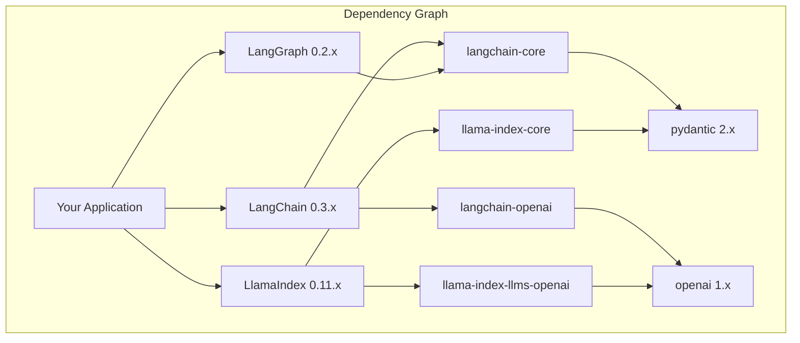

# Production Considerations

## Introduction

Deploying multi-framework AI systems requires careful attention to dependency management, performance optimization, cost control, and observability. When combining LangChain, LlamaIndex, and LangGraph, production challenges multiply.

This lesson covers essential practices for running framework integrations reliably at scale.

### What We'll Cover

- Dependency management and version compatibility
- Performance optimization strategies
- Cost control and monitoring
- Observability across frameworks
- Deployment patterns
- Troubleshooting common issues

### Prerequisites

- Experience with at least one framework
- Basic understanding of Python packaging
- Familiarity with production deployment concepts

---

## Dependency Management

### The Version Challenge



### Requirements File Structure

```txt
# requirements.txt - Production dependencies

# Core frameworks - pin major.minor
langchain>=0.3.0,<0.4.0
langchain-core>=0.3.0,<0.4.0
langchain-openai>=0.2.0,<0.3.0
langgraph>=0.2.0,<0.3.0

llama-index>=0.11.0,<0.12.0
llama-index-core>=0.11.0,<0.12.0
llama-index-llms-openai>=0.2.0,<0.3.0
llama-index-embeddings-openai>=0.2.0,<0.3.0
llama-index-vector-stores-chroma>=0.2.0,<0.3.0

# Shared dependencies - pin to avoid conflicts
openai>=1.40.0,<2.0.0
pydantic>=2.7.0,<3.0.0
chromadb>=0.5.0,<0.6.0

# Observability
langsmith>=0.1.0,<0.2.0
```

### Poetry Configuration

```toml
# pyproject.toml
[tool.poetry]
name = "rag-system"
version = "1.0.0"
python = "^3.10"

[tool.poetry.dependencies]
python = "^3.10"

# LangChain ecosystem
langchain = "^0.3.0"
langchain-core = "^0.3.0"
langchain-openai = "^0.2.0"
langgraph = "^0.2.0"

# LlamaIndex ecosystem
llama-index = "^0.11.0"
llama-index-core = "^0.11.0"
llama-index-llms-openai = "^0.2.0"
llama-index-embeddings-openai = "^0.2.0"

# Shared
openai = "^1.40.0"
pydantic = "^2.7.0"
chromadb = "^0.5.0"

[tool.poetry.group.dev.dependencies]
pytest = "^8.0.0"
pytest-asyncio = "^0.23.0"
```

### Version Compatibility Matrix

| LangChain | LlamaIndex | LangGraph | OpenAI SDK | Pydantic |
|-----------|------------|-----------|------------|----------|
| 0.3.x | 0.11.x | 0.2.x | 1.40+ | 2.7+ |
| 0.2.x | 0.10.x | 0.1.x | 1.30+ | 2.5+ |
| 0.1.x | 0.9.x | — | 1.0+ | 1.x/2.x |

> **Warning:** Always test after dependency updates. Breaking changes are common.

---

## Performance Optimization

### Profiling Multi-Framework Calls

```python
import time
import functools
from typing import Callable, Any
from dataclasses import dataclass, field
from collections import defaultdict


@dataclass
class PerformanceMetrics:
    """Track performance across frameworks."""
    call_times: dict = field(default_factory=lambda: defaultdict(list))
    call_counts: dict = field(default_factory=lambda: defaultdict(int))
    
    def record(self, component: str, duration: float):
        self.call_times[component].append(duration)
        self.call_counts[component] += 1
    
    def summary(self) -> dict:
        return {
            component: {
                "count": self.call_counts[component],
                "total_ms": sum(times) * 1000,
                "avg_ms": (sum(times) / len(times)) * 1000 if times else 0,
                "max_ms": max(times) * 1000 if times else 0
            }
            for component, times in self.call_times.items()
        }


metrics = PerformanceMetrics()


def track_performance(component: str):
    """Decorator to track component performance."""
    def decorator(func: Callable) -> Callable:
        @functools.wraps(func)
        def wrapper(*args, **kwargs) -> Any:
            start = time.perf_counter()
            try:
                result = func(*args, **kwargs)
                return result
            finally:
                duration = time.perf_counter() - start
                metrics.record(component, duration)
        return wrapper
    return decorator


# Usage
class OptimizedRAG:
    def __init__(self, index, llm):
        self.index = index
        self.llm = llm
        self.retriever = index.as_retriever(similarity_top_k=5)
    
    @track_performance("llamaindex_retrieve")
    def retrieve(self, query: str):
        return self.retriever.retrieve(query)
    
    @track_performance("langchain_generate")
    def generate(self, query: str, context: str):
        return self.llm.invoke(f"Context: {context}\n\nQ: {query}")
    
    @track_performance("total_query")
    def query(self, question: str) -> str:
        nodes = self.retrieve(question)
        context = "\n".join([n.text for n in nodes])
        response = self.generate(question, context)
        return response.content


# After queries, check metrics
print(metrics.summary())
# Output:
# {
#   'llamaindex_retrieve': {'count': 10, 'total_ms': 234, 'avg_ms': 23.4, 'max_ms': 45},
#   'langchain_generate': {'count': 10, 'total_ms': 1520, 'avg_ms': 152, 'max_ms': 210},
#   'total_query': {'count': 10, 'total_ms': 1754, 'avg_ms': 175.4, 'max_ms': 255}
# }
```

### Caching Strategies

```python
import hashlib
import json
from typing import Optional, Any
from functools import lru_cache
from diskcache import Cache


class MultiLevelCache:
    """Multi-level caching for framework calls."""
    
    def __init__(self, cache_dir: str = "./.cache"):
        self.memory_cache = {}
        self.disk_cache = Cache(cache_dir)
    
    def _make_key(self, prefix: str, *args, **kwargs) -> str:
        """Create cache key from arguments."""
        data = json.dumps({"args": args, "kwargs": kwargs}, sort_keys=True)
        hash_val = hashlib.md5(data.encode()).hexdigest()
        return f"{prefix}:{hash_val}"
    
    def get(self, key: str) -> Optional[Any]:
        """Get from cache (memory first, then disk)."""
        if key in self.memory_cache:
            return self.memory_cache[key]
        if key in self.disk_cache:
            value = self.disk_cache[key]
            self.memory_cache[key] = value  # Promote to memory
            return value
        return None
    
    def set(self, key: str, value: Any, ttl: int = 3600):
        """Set in both caches."""
        self.memory_cache[key] = value
        self.disk_cache.set(key, value, expire=ttl)
    
    def cached(self, prefix: str, ttl: int = 3600):
        """Decorator for caching function results."""
        def decorator(func):
            @functools.wraps(func)
            def wrapper(*args, **kwargs):
                key = self._make_key(prefix, *args, **kwargs)
                
                cached_value = self.get(key)
                if cached_value is not None:
                    return cached_value
                
                result = func(*args, **kwargs)
                self.set(key, result, ttl)
                return result
            return wrapper
        return decorator


cache = MultiLevelCache()


# Cache LlamaIndex retrieval results
@cache.cached("retrieval", ttl=1800)
def cached_retrieve(query: str, top_k: int = 5):
    retriever = index.as_retriever(similarity_top_k=top_k)
    nodes = retriever.retrieve(query)
    return [(n.text, n.score, n.metadata) for n in nodes]


# Cache embeddings
@cache.cached("embedding", ttl=86400)  # 24 hours
def cached_embed(text: str):
    from llama_index.embeddings.openai import OpenAIEmbedding
    embed_model = OpenAIEmbedding()
    return embed_model.get_text_embedding(text)
```

### Async Optimization

```python
import asyncio
from typing import List
from concurrent.futures import ThreadPoolExecutor
from llama_index.core import VectorStoreIndex
from langchain_openai import ChatOpenAI


class AsyncHybridRAG:
    """Async-optimized RAG with parallel operations."""
    
    def __init__(self, indexes: dict, max_workers: int = 4):
        self.indexes = indexes
        self.llm = ChatOpenAI(model="gpt-4o-mini")
        self.executor = ThreadPoolExecutor(max_workers=max_workers)
    
    async def retrieve_from_index(self, index_name: str, query: str) -> dict:
        """Retrieve from a single index asynchronously."""
        loop = asyncio.get_event_loop()
        
        def sync_retrieve():
            retriever = self.indexes[index_name].as_retriever(similarity_top_k=3)
            nodes = retriever.retrieve(query)
            return {
                "index": index_name,
                "nodes": [(n.text, n.score) for n in nodes]
            }
        
        return await loop.run_in_executor(self.executor, sync_retrieve)
    
    async def parallel_retrieve(self, query: str) -> List[dict]:
        """Retrieve from all indexes in parallel."""
        tasks = [
            self.retrieve_from_index(name, query)
            for name in self.indexes
        ]
        
        results = await asyncio.gather(*tasks)
        return results
    
    async def query(self, question: str) -> str:
        """Execute async query."""
        # Parallel retrieval from all indexes
        all_results = await self.parallel_retrieve(question)
        
        # Combine and sort by score
        all_nodes = []
        for result in all_results:
            for text, score in result["nodes"]:
                all_nodes.append((text, score, result["index"]))
        
        all_nodes.sort(key=lambda x: x[1], reverse=True)
        top_nodes = all_nodes[:5]
        
        # Format context
        context = "\n\n".join([
            f"[{source}] {text}" for text, score, source in top_nodes
        ])
        
        # Generate (async via langchain)
        response = await self.llm.ainvoke(
            f"Answer based on context:\n{context}\n\nQuestion: {question}"
        )
        
        return response.content


# Usage
async def main():
    rag = AsyncHybridRAG(indexes)
    answer = await rag.query("What are the key features?")
    print(answer)

asyncio.run(main())
```

---

## Cost Control

### Token Usage Tracking

```python
from dataclasses import dataclass, field
from typing import Dict
import tiktoken


@dataclass
class CostTracker:
    """Track token usage and costs across frameworks."""
    
    # Pricing per 1M tokens (as of 2024)
    PRICING = {
        "gpt-4o": {"input": 2.50, "output": 10.00},
        "gpt-4o-mini": {"input": 0.15, "output": 0.60},
        "text-embedding-3-small": {"input": 0.02, "output": 0},
        "text-embedding-3-large": {"input": 0.13, "output": 0},
    }
    
    usage: Dict[str, Dict[str, int]] = field(default_factory=dict)
    
    def record(self, model: str, input_tokens: int, output_tokens: int = 0):
        """Record token usage."""
        if model not in self.usage:
            self.usage[model] = {"input": 0, "output": 0}
        
        self.usage[model]["input"] += input_tokens
        self.usage[model]["output"] += output_tokens
    
    def estimate_cost(self) -> Dict:
        """Calculate estimated costs."""
        costs = {}
        total = 0.0
        
        for model, tokens in self.usage.items():
            if model not in self.PRICING:
                continue
            
            pricing = self.PRICING[model]
            input_cost = (tokens["input"] / 1_000_000) * pricing["input"]
            output_cost = (tokens["output"] / 1_000_000) * pricing["output"]
            
            costs[model] = {
                "input_tokens": tokens["input"],
                "output_tokens": tokens["output"],
                "input_cost": f"${input_cost:.4f}",
                "output_cost": f"${output_cost:.4f}",
                "total_cost": f"${input_cost + output_cost:.4f}"
            }
            total += input_cost + output_cost
        
        costs["total"] = f"${total:.4f}"
        return costs
    
    @staticmethod
    def count_tokens(text: str, model: str = "gpt-4o") -> int:
        """Count tokens for text."""
        try:
            encoding = tiktoken.encoding_for_model(model)
        except KeyError:
            encoding = tiktoken.get_encoding("cl100k_base")
        
        return len(encoding.encode(text))


cost_tracker = CostTracker()


# Wrap LLM calls to track costs
class CostTrackedLLM:
    def __init__(self, llm, model_name: str):
        self.llm = llm
        self.model_name = model_name
    
    def invoke(self, prompt: str) -> str:
        input_tokens = cost_tracker.count_tokens(prompt, self.model_name)
        
        response = self.llm.invoke(prompt)
        
        output_tokens = cost_tracker.count_tokens(response.content, self.model_name)
        
        cost_tracker.record(self.model_name, input_tokens, output_tokens)
        
        return response


# Usage
llm = CostTrackedLLM(ChatOpenAI(model="gpt-4o-mini"), "gpt-4o-mini")

# After running queries
print(cost_tracker.estimate_cost())
# {
#   'gpt-4o-mini': {
#     'input_tokens': 5000,
#     'output_tokens': 2000,
#     'input_cost': '$0.0008',
#     'output_cost': '$0.0012',
#     'total_cost': '$0.0020'
#   },
#   'total': '$0.0020'
# }
```

### Cost Optimization Strategies

| Strategy | Implementation | Savings |
|----------|----------------|---------|
| **Cache embeddings** | Store in vector DB | 80-95% embedding costs |
| **Cache responses** | Query deduplication | Varies by query overlap |
| **Use smaller models** | gpt-4o-mini for simple tasks | 20-50x vs gpt-4o |
| **Limit context** | Top-k retrieval, summarization | 30-50% token reduction |
| **Batch requests** | Combine multiple queries | API call overhead |
| **Rate limiting** | Prevent runaway costs | Budget protection |

```python
class CostOptimizedRAG:
    """RAG system with cost optimization."""
    
    def __init__(self, index):
        self.index = index
        
        # Use cheaper model for routing
        self.router_llm = ChatOpenAI(model="gpt-4o-mini", temperature=0)
        
        # Use better model only when needed
        self.answer_llm = ChatOpenAI(model="gpt-4o-mini", temperature=0)
        
        # Cache for deduplication
        self.response_cache = {}
        
        # Token budget
        self.max_context_tokens = 2000
    
    def truncate_context(self, context: str) -> str:
        """Truncate context to token budget."""
        tokens = cost_tracker.count_tokens(context)
        
        if tokens <= self.max_context_tokens:
            return context
        
        # Truncate to fit
        words = context.split()
        while cost_tracker.count_tokens(" ".join(words)) > self.max_context_tokens:
            words = words[:-100]  # Remove 100 words at a time
        
        return " ".join(words) + "\n\n[Context truncated]"
    
    def query(self, question: str) -> str:
        """Cost-optimized query."""
        # Check cache first
        cache_key = question.lower().strip()
        if cache_key in self.response_cache:
            return self.response_cache[cache_key]
        
        # Retrieve with limited top_k
        retriever = self.index.as_retriever(similarity_top_k=3)
        nodes = retriever.retrieve(question)
        
        context = "\n".join([n.text for n in nodes])
        context = self.truncate_context(context)
        
        # Generate with smaller model
        response = self.answer_llm.invoke(
            f"Context: {context}\n\nQuestion: {question}"
        )
        
        # Cache response
        self.response_cache[cache_key] = response.content
        
        return response.content
```

---

## Observability

### Unified Logging

```python
import logging
import json
from datetime import datetime
from typing import Any, Dict
from contextlib import contextmanager
import uuid


# Configure structured logging
logging.basicConfig(
    level=logging.INFO,
    format='%(message)s'
)
logger = logging.getLogger("rag_system")


class StructuredLogger:
    """Structured logging for multi-framework observability."""
    
    def __init__(self, service_name: str):
        self.service_name = service_name
    
    def _log(self, level: str, event: str, **kwargs):
        """Log structured event."""
        entry = {
            "timestamp": datetime.utcnow().isoformat(),
            "service": self.service_name,
            "level": level,
            "event": event,
            **kwargs
        }
        logger.info(json.dumps(entry))
    
    def info(self, event: str, **kwargs):
        self._log("INFO", event, **kwargs)
    
    def error(self, event: str, **kwargs):
        self._log("ERROR", event, **kwargs)
    
    def metric(self, name: str, value: float, tags: Dict = None):
        """Log metric."""
        self._log("METRIC", name, value=value, tags=tags or {})
    
    @contextmanager
    def span(self, name: str, **kwargs):
        """Create a traced span."""
        span_id = str(uuid.uuid4())[:8]
        start_time = datetime.utcnow()
        
        self.info(f"{name}_start", span_id=span_id, **kwargs)
        
        try:
            yield span_id
        except Exception as e:
            self.error(f"{name}_error", span_id=span_id, error=str(e))
            raise
        finally:
            duration = (datetime.utcnow() - start_time).total_seconds()
            self.info(f"{name}_end", span_id=span_id, duration_seconds=duration)
            self.metric(f"{name}_duration", duration)


log = StructuredLogger("hybrid_rag")


# Usage in RAG system
class ObservableRAG:
    def __init__(self, index):
        self.index = index
        self.llm = ChatOpenAI(model="gpt-4o-mini")
    
    def query(self, question: str) -> str:
        request_id = str(uuid.uuid4())[:8]
        
        log.info("query_received", request_id=request_id, query=question[:100])
        
        with log.span("retrieval", request_id=request_id, framework="llamaindex"):
            retriever = self.index.as_retriever(similarity_top_k=5)
            nodes = retriever.retrieve(question)
            
            log.metric("retrieval_results", len(nodes), 
                      tags={"request_id": request_id})
        
        context = "\n".join([n.text for n in nodes])
        
        with log.span("generation", request_id=request_id, framework="langchain"):
            response = self.llm.invoke(
                f"Context: {context}\n\nQuestion: {question}"
            )
        
        log.info("query_completed", request_id=request_id, 
                response_length=len(response.content))
        
        return response.content
```

### LangSmith Integration

```python
import os
from langsmith import traceable
from langchain_openai import ChatOpenAI
from llama_index.core import VectorStoreIndex


# Enable LangSmith
os.environ["LANGCHAIN_TRACING_V2"] = "true"
os.environ["LANGCHAIN_PROJECT"] = "hybrid-rag-production"


class LangSmithTracedRAG:
    """RAG with LangSmith tracing."""
    
    def __init__(self, index: VectorStoreIndex):
        self.index = index
        self.llm = ChatOpenAI(model="gpt-4o-mini")
    
    @traceable(name="llamaindex_retrieve")
    def retrieve(self, query: str):
        """Traced LlamaIndex retrieval."""
        retriever = self.index.as_retriever(similarity_top_k=5)
        nodes = retriever.retrieve(query)
        return [{"text": n.text, "score": n.score} for n in nodes]
    
    @traceable(name="format_context")
    def format_context(self, nodes: list) -> str:
        """Format retrieved nodes into context."""
        return "\n\n".join([
            f"[Score: {n['score']:.3f}]\n{n['text']}"
            for n in nodes
        ])
    
    @traceable(name="langchain_generate")
    def generate(self, query: str, context: str) -> str:
        """Traced LangChain generation."""
        response = self.llm.invoke(
            f"Context: {context}\n\nQuestion: {query}"
        )
        return response.content
    
    @traceable(name="rag_query")
    def query(self, question: str) -> str:
        """Traced end-to-end query."""
        nodes = self.retrieve(question)
        context = self.format_context(nodes)
        answer = self.generate(question, context)
        return answer
```

---

## Deployment Patterns

### Docker Configuration

```dockerfile
# Dockerfile
FROM python:3.11-slim

WORKDIR /app

# Install system dependencies
RUN apt-get update && apt-get install -y \
    build-essential \
    && rm -rf /var/lib/apt/lists/*

# Install Python dependencies
COPY requirements.txt .
RUN pip install --no-cache-dir -r requirements.txt

# Copy application
COPY . .

# Set environment variables
ENV PYTHONUNBUFFERED=1
ENV LANGCHAIN_TRACING_V2=true

# Health check
HEALTHCHECK --interval=30s --timeout=10s --start-period=5s --retries=3 \
    CMD python -c "import langchain; import llama_index; print('OK')"

# Run application
CMD ["python", "-m", "uvicorn", "main:app", "--host", "0.0.0.0", "--port", "8000"]
```

### Docker Compose for Development

```yaml
# docker-compose.yml
version: '3.8'

services:
  rag-api:
    build: .
    ports:
      - "8000:8000"
    environment:
      - OPENAI_API_KEY=${OPENAI_API_KEY}
      - LANGCHAIN_TRACING_V2=true
      - LANGCHAIN_API_KEY=${LANGCHAIN_API_KEY}
      - LANGCHAIN_PROJECT=hybrid-rag
    volumes:
      - ./data:/app/data
      - ./cache:/app/.cache
    depends_on:
      - chromadb
      - redis

  chromadb:
    image: chromadb/chroma:latest
    ports:
      - "8001:8000"
    volumes:
      - chroma_data:/chroma/chroma

  redis:
    image: redis:7-alpine
    ports:
      - "6379:6379"
    volumes:
      - redis_data:/data

volumes:
  chroma_data:
  redis_data:
```

### Health Checks

```python
from fastapi import FastAPI, Response
from typing import Dict
import asyncio


app = FastAPI()


async def check_llamaindex() -> Dict:
    """Check LlamaIndex health."""
    try:
        from llama_index.core import Document, VectorStoreIndex
        doc = Document(text="test")
        index = VectorStoreIndex.from_documents([doc])
        return {"status": "healthy", "framework": "llamaindex"}
    except Exception as e:
        return {"status": "unhealthy", "framework": "llamaindex", "error": str(e)}


async def check_langchain() -> Dict:
    """Check LangChain health."""
    try:
        from langchain_openai import ChatOpenAI
        llm = ChatOpenAI(model="gpt-4o-mini")
        # Quick test with minimal tokens
        response = llm.invoke("Say 'OK'")
        return {"status": "healthy", "framework": "langchain"}
    except Exception as e:
        return {"status": "unhealthy", "framework": "langchain", "error": str(e)}


@app.get("/health")
async def health_check():
    """Comprehensive health check."""
    checks = await asyncio.gather(
        check_llamaindex(),
        check_langchain(),
        return_exceptions=True
    )
    
    all_healthy = all(
        isinstance(c, dict) and c.get("status") == "healthy"
        for c in checks
    )
    
    status_code = 200 if all_healthy else 503
    
    return Response(
        content={
            "status": "healthy" if all_healthy else "degraded",
            "checks": checks
        },
        status_code=status_code
    )


@app.get("/ready")
async def readiness_check():
    """Readiness check for kubernetes."""
    # Check if indexes are loaded
    try:
        # Your index loading check here
        return {"status": "ready"}
    except Exception as e:
        return Response(
            content={"status": "not_ready", "error": str(e)},
            status_code=503
        )
```

---

## Troubleshooting

### Common Issues and Solutions

| Issue | Symptom | Solution |
|-------|---------|----------|
| **Version conflict** | Import errors, unexpected behavior | Pin versions, use virtual env |
| **Memory leak** | Growing memory usage | Explicit cleanup, connection pooling |
| **Slow first query** | Initial query takes 10-30s | Lazy load indexes, warmup on startup |
| **Rate limiting** | 429 errors from OpenAI | Implement retry with backoff |
| **Context too long** | Token limit errors | Truncate context, use summarization |
| **Stale cache** | Outdated responses | Set appropriate TTLs |

### Debug Mode Configuration

```python
import os
import logging


def configure_debug_mode():
    """Enable comprehensive debug logging."""
    
    # LangChain debugging
    os.environ["LANGCHAIN_VERBOSE"] = "true"
    
    # LlamaIndex debugging
    logging.getLogger("llama_index").setLevel(logging.DEBUG)
    
    # OpenAI debugging
    logging.getLogger("openai").setLevel(logging.DEBUG)
    logging.getLogger("httpx").setLevel(logging.DEBUG)
    
    # Application debugging
    logging.basicConfig(
        level=logging.DEBUG,
        format='%(asctime)s - %(name)s - %(levelname)s - %(message)s'
    )


def configure_production_mode():
    """Production logging configuration."""
    
    # Reduce noise
    logging.getLogger("httpx").setLevel(logging.WARNING)
    logging.getLogger("httpcore").setLevel(logging.WARNING)
    
    # Application logs
    logging.basicConfig(
        level=logging.INFO,
        format='{"time": "%(asctime)s", "level": "%(levelname)s", "message": "%(message)s"}'
    )
```

### Error Recovery

```python
from tenacity import retry, stop_after_attempt, wait_exponential
from typing import Optional


class ResilientRAG:
    """RAG with error recovery."""
    
    def __init__(self, index):
        self.index = index
        self.llm = ChatOpenAI(model="gpt-4o-mini")
    
    @retry(
        stop=stop_after_attempt(3),
        wait=wait_exponential(multiplier=1, min=2, max=10)
    )
    def retrieve_with_retry(self, query: str):
        """Retrieve with automatic retry."""
        retriever = self.index.as_retriever(similarity_top_k=5)
        return retriever.retrieve(query)
    
    @retry(
        stop=stop_after_attempt(3),
        wait=wait_exponential(multiplier=1, min=2, max=10)
    )
    def generate_with_retry(self, prompt: str):
        """Generate with automatic retry."""
        return self.llm.invoke(prompt)
    
    def query(self, question: str) -> Optional[str]:
        """Query with comprehensive error handling."""
        try:
            nodes = self.retrieve_with_retry(question)
            
            if not nodes:
                return "No relevant information found."
            
            context = "\n".join([n.text for n in nodes])
            
            response = self.generate_with_retry(
                f"Context: {context}\n\nQuestion: {question}"
            )
            
            return response.content
            
        except Exception as e:
            logger.error(f"Query failed: {e}")
            return f"I encountered an error processing your question. Please try again."
```

---

## Best Practices

| Practice | Description |
|----------|-------------|
| Pin versions | Use exact or range-bounded versions |
| Test upgrades | Validate in staging before production |
| Monitor costs | Track token usage per request |
| Cache aggressively | Embeddings, responses, routing decisions |
| Log at boundaries | Track data flow between frameworks |
| Handle failures | Retry with backoff, graceful degradation |

---

## Common Pitfalls

| ❌ Mistake | ✅ Solution |
|-----------|-------------|
| Unpinned dependencies | Use requirements.txt with versions |
| No cost tracking | Implement token counting |
| Missing health checks | Add /health and /ready endpoints |
| Ignoring memory | Monitor and limit index sizes |
| Tight coupling | Use interfaces and adapters |
| No observability | Add structured logging and tracing |

---

## Hands-on Exercise

### Your Task

Create a production-ready RAG configuration that:
1. Tracks costs per query
2. Implements caching for embeddings
3. Has health check endpoints
4. Logs structured events

### Requirements

1. Cost tracker that counts tokens
2. Cache with TTL for query results
3. Health check function
4. Structured logging decorator

### Expected Result

```python
# After running queries
print(cost_tracker.summary())
# {'total_cost': '$0.0045', 'queries': 10}

print(cache.stats())
# {'hits': 7, 'misses': 3, 'hit_rate': 0.70}

print(health_check())
# {'status': 'healthy', 'components': ['llamaindex', 'langchain']}
```

<details>
<summary>💡 Hints (click to expand)</summary>

1. Use tiktoken for token counting
2. Use a dict with timestamps for simple caching
3. Wrap component checks in try/except
4. Use a decorator for structured logging

</details>

<details>
<summary>✅ Solution (click to expand)</summary>

```python
import time
import tiktoken
from dataclasses import dataclass, field
from typing import Dict, Optional
from functools import wraps


@dataclass
class CostTracker:
    total_input_tokens: int = 0
    total_output_tokens: int = 0
    query_count: int = 0
    
    def record(self, input_text: str, output_text: str):
        enc = tiktoken.get_encoding("cl100k_base")
        self.total_input_tokens += len(enc.encode(input_text))
        self.total_output_tokens += len(enc.encode(output_text))
        self.query_count += 1
    
    def summary(self) -> Dict:
        # gpt-4o-mini pricing
        input_cost = (self.total_input_tokens / 1_000_000) * 0.15
        output_cost = (self.total_output_tokens / 1_000_000) * 0.60
        return {
            "total_cost": f"${input_cost + output_cost:.4f}",
            "queries": self.query_count
        }


@dataclass
class SimpleCache:
    data: Dict = field(default_factory=dict)
    hits: int = 0
    misses: int = 0
    ttl: int = 3600
    
    def get(self, key: str) -> Optional[str]:
        if key in self.data:
            entry = self.data[key]
            if time.time() - entry["time"] < self.ttl:
                self.hits += 1
                return entry["value"]
        self.misses += 1
        return None
    
    def set(self, key: str, value: str):
        self.data[key] = {"value": value, "time": time.time()}
    
    def stats(self) -> Dict:
        total = self.hits + self.misses
        return {
            "hits": self.hits,
            "misses": self.misses,
            "hit_rate": self.hits / total if total > 0 else 0
        }


def health_check() -> Dict:
    components = []
    
    try:
        from llama_index.core import Document
        Document(text="test")
        components.append("llamaindex")
    except:
        pass
    
    try:
        from langchain_openai import ChatOpenAI
        components.append("langchain")
    except:
        pass
    
    return {
        "status": "healthy" if len(components) == 2 else "degraded",
        "components": components
    }


def logged(func):
    @wraps(func)
    def wrapper(*args, **kwargs):
        start = time.time()
        print(f'{{"event": "{func.__name__}_start", "time": "{start}"}}')
        try:
            result = func(*args, **kwargs)
            duration = time.time() - start
            print(f'{{"event": "{func.__name__}_end", "duration": {duration:.3f}}}')
            return result
        except Exception as e:
            print(f'{{"event": "{func.__name__}_error", "error": "{str(e)}"}}')
            raise
    return wrapper


# Usage
cost_tracker = CostTracker()
cache = SimpleCache(ttl=1800)

@logged
def query_rag(question: str) -> str:
    # Check cache
    cached = cache.get(question)
    if cached:
        return cached
    
    # Simulate query
    response = f"Answer to: {question}"
    
    # Track costs
    cost_tracker.record(question, response)
    
    # Cache result
    cache.set(question, response)
    
    return response


# Test
for i in range(10):
    query_rag("What are the features?")

print(cost_tracker.summary())
print(cache.stats())
print(health_check())
```

</details>

---

## Summary

✅ Pin framework versions to avoid compatibility issues

✅ Implement multi-level caching for cost optimization

✅ Track token usage and costs per request

✅ Use structured logging for cross-framework observability

✅ Add health checks for production monitoring

✅ Implement retry logic with exponential backoff

**Previous:** [← Common Architectures](./04-common-architectures.md)

---

## Further Reading

- [LangSmith Documentation](https://docs.smith.langchain.com/)
- [LlamaIndex Observability](https://docs.llamaindex.ai/en/stable/module_guides/observability/)
- [Python Packaging Best Practices](https://packaging.python.org/en/latest/guides/)
- [Tiktoken](https://github.com/openai/tiktoken)

---

<!-- 
Sources Consulted:
- LangChain: https://python.langchain.com/
- LlamaIndex: https://docs.llamaindex.ai/
- LangSmith: https://docs.smith.langchain.com/
- OpenAI Pricing: https://openai.com/pricing
-->
