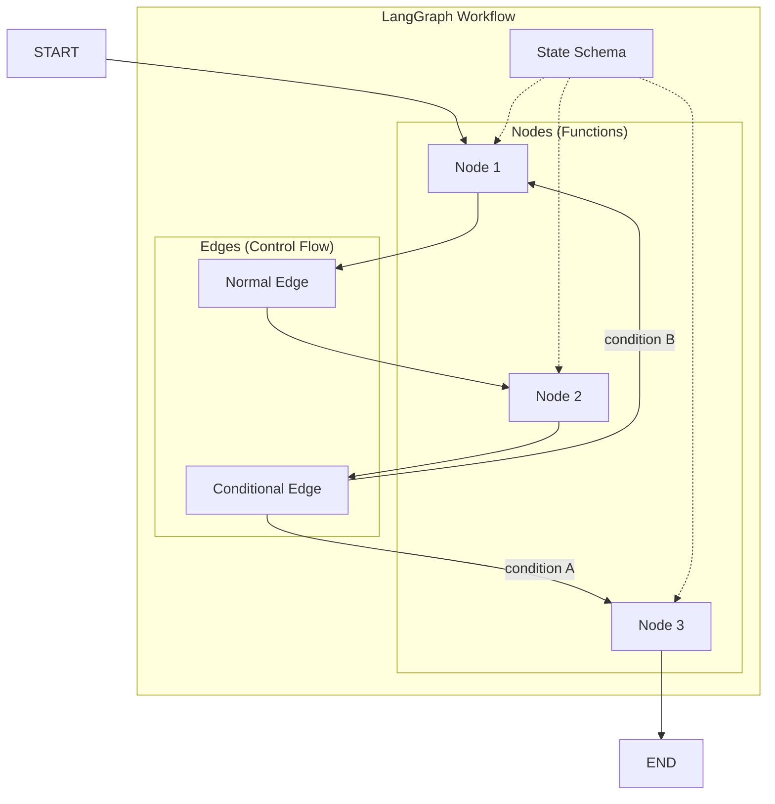

# LangGraph Fundamentals

## Module Overview

LangGraph is the low-level orchestration framework that powers modern LangChain agents. It provides stateful, durable execution for building production-ready AI workflows with fine-grained control over agent behavior.

This module covers the core concepts you need to build sophisticated agent systems with LangGraph.

---

## What is LangGraph?

LangGraph models agent workflows as **graphs** where:
- **State** flows between processing steps
- **Nodes** perform work on state
- **Edges** determine what happens next

Inspired by Google's Pregel and Apache Beam, LangGraph enables:
- **Durable execution**: Survive failures and resume
- **Stateful processing**: Maintain context across steps
- **Cyclic workflows**: Support loops and complex control flow
- **Human-in-the-loop**: Pause for human input and approval

---

## Module Roadmap

| Lesson | Topic | Key Concepts |
|--------|-------|--------------|
| [01](./01-stategraph-basics.md) | StateGraph Basics | StateGraph, state schema, TypedDict, compilation |
| [02](./02-nodes-and-edges.md) | Nodes and Edges | Node functions, START/END, conditional routing |
| [03](./03-state-management.md) | State Management | Reducers, add_messages, MessagesState |
| [04](./04-execution-and-streaming.md) | Execution & Streaming | invoke, stream, async, visualization |
| [05](./05-building-your-first-agent.md) | Building Your First Agent | Complete tool-calling agent example |

---

## Core Architecture



---

## Prerequisites

Before starting this module, you should understand:

- ✅ Python type hints (`TypedDict`, `Annotated`)
- ✅ LangChain basics (models, tools, messages)
- ✅ Async Python fundamentals
- ✅ Basic agent concepts from previous lessons

---

## Key Terminology

| Term | Definition |
|------|------------|
| **StateGraph** | The main class for building stateful graph workflows |
| **Node** | A function that processes and updates state |
| **Edge** | Connection between nodes defining control flow |
| **Reducer** | Function that defines how state updates merge |
| **Checkpointer** | Persistence layer for durable execution |
| **Super-step** | One iteration over graph nodes |

---

## When to Use LangGraph

| Use Case | LangGraph | Simple Chains |
|----------|-----------|---------------|
| Multi-step reasoning | ✅ | ❌ |
| Human approval workflows | ✅ | ❌ |
| Complex branching logic | ✅ | ❌ |
| State persistence | ✅ | ❌ |
| Error recovery | ✅ | ❌ |
| Simple Q&A | ❌ | ✅ |
| Linear pipelines | ❌ | ✅ |

---

## Quick Start Example

```python
from langgraph.graph import StateGraph, START, END, MessagesState


def greet(state: MessagesState):
    """Simple node that adds a greeting."""
    return {"messages": [{"role": "ai", "content": "Hello! How can I help?"}]}


# Create graph
graph = StateGraph(MessagesState)
graph.add_node("greet", greet)
graph.add_edge(START, "greet")
graph.add_edge("greet", END)

# Compile and run
app = graph.compile()
result = app.invoke({"messages": [{"role": "user", "content": "Hi!"}]})

print(result["messages"][-1]["content"])
# Output: Hello! How can I help?
```

---

## Installation

```bash
pip install langgraph langchain-openai
```

For persistence:

```bash
pip install langgraph-checkpoint-sqlite
# or
pip install langgraph-checkpoint-postgres
```

---

## Learning Path

1. **Start with StateGraph Basics** - Understand the fundamental building block
2. **Master Nodes and Edges** - Learn how to control workflow flow
3. **Deep dive into State Management** - Handle complex state with reducers
4. **Practice Execution Patterns** - Stream, async, and debug workflows
5. **Build a Complete Agent** - Put it all together

---

**Next:** [StateGraph Basics →](./01-stategraph-basics.md)

---

<!-- 
Sources Consulted:
- LangGraph Overview: https://docs.langchain.com/oss/python/langgraph/overview
- LangGraph Graph API: https://docs.langchain.com/oss/python/langgraph/graph-api
- LangGraph Quickstart: https://docs.langchain.com/oss/python/langgraph/quickstart
-->
