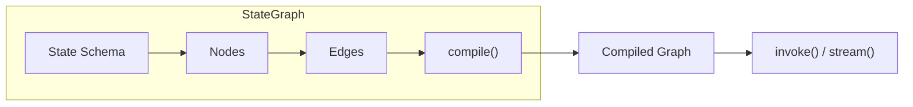

# StateGraph Basics

## Introduction

The `StateGraph` class is the foundation of LangGraph. It allows you to define stateful workflows where data flows between nodes, enabling complex agent architectures with full control over execution.

In this lesson, we'll explore how to create state schemas, build graphs, and compile them for execution.

### What We'll Cover

- Understanding the StateGraph class
- Defining state with TypedDict
- Using MessagesState for chat applications
- Multiple schema patterns
- Compiling graphs for execution

### Prerequisites

- Python type hints (`TypedDict`, `Annotated`)
- Basic understanding of LangChain messages
- Previous lessons on LangChain fundamentals

---

## The StateGraph Class



A `StateGraph` is parameterized by a **state schema** that defines what data flows through your workflow:

```python
from langgraph.graph import StateGraph, START, END
from typing_extensions import TypedDict


class MyState(TypedDict):
    """Define the state schema for the graph."""
    input_text: str
    processed: bool
    result: str


# Create a StateGraph with this schema
graph = StateGraph(MyState)
```

---

## Defining State with TypedDict

The state schema defines what data your graph tracks. Use `TypedDict` for type safety:

```python
from typing import Optional
from typing_extensions import TypedDict


class AgentState(TypedDict):
    """State for a simple agent workflow."""
    
    # Required fields
    query: str
    
    # Optional fields with defaults handled in nodes
    context: str
    response: str
    iteration: int
```

### State Schema Best Practices

| Practice | Description |
|----------|-------------|
| Use descriptive names | `user_query` not `q` |
| Document fields | Add docstrings explaining purpose |
| Keep it minimal | Only include what nodes actually use |
| Consider defaults | Handle missing values in nodes |

---

## Adding Nodes

Nodes are functions that receive state and return updates:

```python
from langgraph.graph import StateGraph, START, END
from typing_extensions import TypedDict


class ProcessState(TypedDict):
    text: str
    word_count: int
    processed: bool


def count_words(state: ProcessState) -> dict:
    """Count words in the text."""
    words = state["text"].split()
    return {
        "word_count": len(words)
    }


def mark_processed(state: ProcessState) -> dict:
    """Mark the text as processed."""
    return {
        "processed": True
    }


# Build the graph
graph = StateGraph(ProcessState)

# Add nodes
graph.add_node("count", count_words)
graph.add_node("mark", mark_processed)

# Add edges
graph.add_edge(START, "count")
graph.add_edge("count", "mark")
graph.add_edge("mark", END)
```

### Node Return Values

Nodes return **partial state updates**, not the full state:

```python
def my_node(state: MyState) -> dict:
    # ✅ Return only the fields you're updating
    return {"result": "processed"}
    
    # ❌ Don't return the entire state
    # return {**state, "result": "processed"}
```

---

## Compiling the Graph

Before using a graph, you must compile it:

```python
# Basic compilation
app = graph.compile()

# With checkpointer for persistence
from langgraph.checkpoint.memory import MemorySaver

memory = MemorySaver()
app = graph.compile(checkpointer=memory)
```

### Compilation Options

| Option | Purpose |
|--------|---------|
| `checkpointer` | Enable state persistence |
| `interrupt_before` | Pause before specific nodes |
| `interrupt_after` | Pause after specific nodes |

```python
# Compile with interrupts for human-in-the-loop
app = graph.compile(
    checkpointer=memory,
    interrupt_before=["human_review"]
)
```

---

## MessagesState for Chat Applications

For chat applications, use the built-in `MessagesState`:

```python
from langgraph.graph import StateGraph, START, END, MessagesState
from langchain_openai import ChatOpenAI


llm = ChatOpenAI(model="gpt-4o-mini")


def chat_node(state: MessagesState) -> dict:
    """Process chat messages."""
    response = llm.invoke(state["messages"])
    return {"messages": [response]}


# MessagesState includes a pre-configured 'messages' field
graph = StateGraph(MessagesState)
graph.add_node("chat", chat_node)
graph.add_edge(START, "chat")
graph.add_edge("chat", END)

app = graph.compile()

# Invoke with messages
result = app.invoke({
    "messages": [{"role": "user", "content": "Hello!"}]
})
```

### Extending MessagesState

Add custom fields by subclassing:

```python
from langgraph.graph import MessagesState


class CustomChatState(MessagesState):
    """Extended chat state with additional fields."""
    user_name: str
    session_id: str
    tool_calls_made: int


def personalized_chat(state: CustomChatState) -> dict:
    """Chat with user context."""
    name = state.get("user_name", "there")
    
    # Access messages from MessagesState
    messages = state["messages"]
    
    # Add greeting to first message
    greeting = f"Hello, {name}! "
    
    response = llm.invoke(messages)
    return {"messages": [response]}


graph = StateGraph(CustomChatState)
```

---

## Multiple Schemas Pattern

For complex workflows, use separate input/output schemas:

```python
from typing_extensions import TypedDict
from langgraph.graph import StateGraph, START, END


# Separate schemas for input and output
class InputState(TypedDict):
    """What the user provides."""
    user_query: str


class OutputState(TypedDict):
    """What we return to the user."""
    answer: str


class InternalState(TypedDict):
    """Internal state with all fields."""
    user_query: str
    context: str
    answer: str


def retrieve_context(state: InputState) -> dict:
    """Retrieve context for the query."""
    # Node receives InputState but writes to InternalState
    context = f"Context for: {state['user_query']}"
    return {"context": context}


def generate_answer(state: InternalState) -> dict:
    """Generate answer using context."""
    answer = f"Answer based on {state['context']}"
    return {"answer": answer}


# Create graph with multiple schemas
graph = StateGraph(
    InternalState,
    input=InputState,
    output=OutputState
)

graph.add_node("retrieve", retrieve_context)
graph.add_node("generate", generate_answer)
graph.add_edge(START, "retrieve")
graph.add_edge("retrieve", "generate")
graph.add_edge("generate", END)

app = graph.compile()

# Input only requires InputState fields
result = app.invoke({"user_query": "What is LangGraph?"})

# Output only contains OutputState fields
print(result)  # {"answer": "Answer based on..."}
```

### When to Use Multiple Schemas

| Scenario | Pattern |
|----------|---------|
| Simple workflows | Single state schema |
| Complex internal state | Internal + Input/Output |
| API endpoints | Strict input/output validation |
| Large teams | Clear contract between nodes |

---

## State Schema Options

### Using TypedDict

```python
from typing_extensions import TypedDict


class State(TypedDict):
    messages: list
    current_step: str
```

### Using Dataclasses

```python
from dataclasses import dataclass, field


@dataclass
class State:
    messages: list = field(default_factory=list)
    current_step: str = ""
```

### Using Pydantic

```python
from pydantic import BaseModel, Field


class State(BaseModel):
    messages: list = Field(default_factory=list)
    current_step: str = ""
    
    class Config:
        arbitrary_types_allowed = True
```

### Comparison

| Schema Type | Validation | Defaults | Performance |
|------------|------------|----------|-------------|
| TypedDict | Type hints only | Manual | Fastest |
| Dataclass | Type hints only | Built-in | Fast |
| Pydantic | Runtime validation | Built-in | Slower |

> **Tip:** Use `TypedDict` for performance, Pydantic when you need validation.

---

## Complete Example: Research Workflow

```python
from typing import List
from typing_extensions import TypedDict
from langgraph.graph import StateGraph, START, END
from langchain_openai import ChatOpenAI


class ResearchState(TypedDict):
    """State for research workflow."""
    topic: str
    sources: List[str]
    summary: str
    complete: bool


llm = ChatOpenAI(model="gpt-4o-mini")


def gather_sources(state: ResearchState) -> dict:
    """Simulate gathering research sources."""
    topic = state["topic"]
    
    # Simulated sources
    sources = [
        f"Source 1 about {topic}",
        f"Source 2 about {topic}",
        f"Source 3 about {topic}"
    ]
    
    return {"sources": sources}


def synthesize(state: ResearchState) -> dict:
    """Synthesize sources into summary."""
    sources = state["sources"]
    topic = state["topic"]
    
    prompt = f"Summarize these sources about {topic}: {sources}"
    response = llm.invoke(prompt)
    
    return {
        "summary": response.content,
        "complete": True
    }


# Build graph
graph = StateGraph(ResearchState)

graph.add_node("gather", gather_sources)
graph.add_node("synthesize", synthesize)

graph.add_edge(START, "gather")
graph.add_edge("gather", "synthesize")
graph.add_edge("synthesize", END)

# Compile
research_app = graph.compile()

# Run
result = research_app.invoke({
    "topic": "LangGraph fundamentals",
    "sources": [],
    "summary": "",
    "complete": False
})

print(f"Summary: {result['summary']}")
print(f"Complete: {result['complete']}")
```

---

## Best Practices

| Practice | Description |
|----------|-------------|
| Define clear schemas | Document all state fields |
| Use MessagesState for chat | Built-in message handling |
| Return partial updates | Only return changed fields |
| Compile once | Reuse compiled graphs |
| Name nodes descriptively | Helps with debugging |

---

## Common Pitfalls

| ❌ Mistake | ✅ Solution |
|-----------|-------------|
| Returning full state | Return only updated fields |
| Forgetting to compile | Always call `.compile()` |
| Missing required fields | Initialize all fields or handle None |
| Mutable default values | Use `field(default_factory=list)` |
| Skipping type hints | Use TypedDict for clarity |

---

## Hands-on Exercise

### Your Task

Create a StateGraph for a document processing workflow:
1. Define a state with: `document`, `word_count`, `summary`, `processed`
2. Create nodes for counting words and generating summary
3. Connect nodes with edges
4. Compile and test

### Requirements

1. Use TypedDict for state schema
2. Two nodes: `count_words` and `summarize`
3. Linear flow: START → count → summarize → END
4. Return appropriate state updates from each node

### Expected Result

```python
result = app.invoke({
    "document": "LangGraph is a framework for building agents.",
    "word_count": 0,
    "summary": "",
    "processed": False
})

print(result)
# {
#   "document": "LangGraph is a framework...",
#   "word_count": 7,
#   "summary": "This document describes LangGraph...",
#   "processed": True
# }
```

<details>
<summary>💡 Hints (click to expand)</summary>

1. Define state with `TypedDict`
2. Node functions receive state, return dict with updates
3. Use `graph.add_node(name, function)`
4. Connect with `graph.add_edge(source, target)`
5. `START` and `END` are special constants

</details>

<details>
<summary>✅ Solution (click to expand)</summary>

```python
from typing_extensions import TypedDict
from langgraph.graph import StateGraph, START, END


class DocumentState(TypedDict):
    document: str
    word_count: int
    summary: str
    processed: bool


def count_words(state: DocumentState) -> dict:
    """Count words in the document."""
    words = state["document"].split()
    return {"word_count": len(words)}


def summarize(state: DocumentState) -> dict:
    """Generate a simple summary."""
    doc = state["document"]
    word_count = state["word_count"]
    
    summary = f"Document with {word_count} words. First 20 chars: {doc[:20]}..."
    
    return {
        "summary": summary,
        "processed": True
    }


# Build graph
graph = StateGraph(DocumentState)

graph.add_node("count", count_words)
graph.add_node("summarize", summarize)

graph.add_edge(START, "count")
graph.add_edge("count", "summarize")
graph.add_edge("summarize", END)

# Compile
app = graph.compile()

# Test
result = app.invoke({
    "document": "LangGraph is a framework for building agents.",
    "word_count": 0,
    "summary": "",
    "processed": False
})

print(f"Word count: {result['word_count']}")
print(f"Summary: {result['summary']}")
print(f"Processed: {result['processed']}")
```

</details>

---

## Summary

✅ `StateGraph` is the core class for building LangGraph workflows

✅ State schemas define what data flows through your graph

✅ Use `TypedDict` for type-safe state definitions

✅ `MessagesState` provides built-in support for chat applications

✅ Nodes return partial state updates, not the full state

✅ Always compile your graph before execution

**Next:** [Nodes and Edges →](./02-nodes-and-edges.md)

---

## Further Reading

- [LangGraph Graph API](https://docs.langchain.com/oss/python/langgraph/graph-api)
- [LangGraph Quickstart](https://docs.langchain.com/oss/python/langgraph/quickstart)
- [Python TypedDict Documentation](https://docs.python.org/3/library/typing.html#typing.TypedDict)

---

<!-- 
Sources Consulted:
- LangGraph Graph API: https://docs.langchain.com/oss/python/langgraph/graph-api
- LangGraph Quickstart: https://docs.langchain.com/oss/python/langgraph/quickstart
-->
