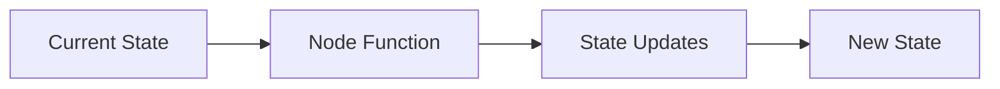
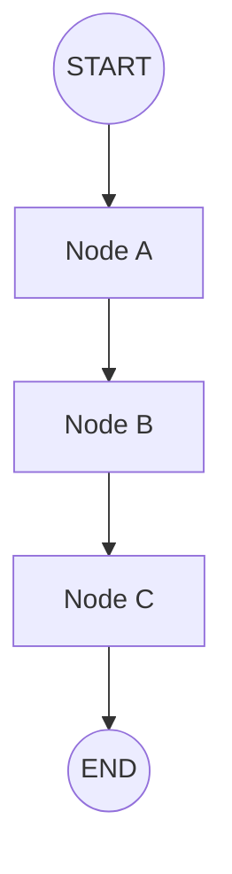
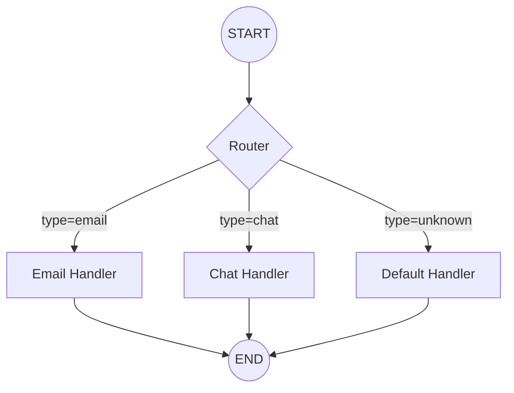
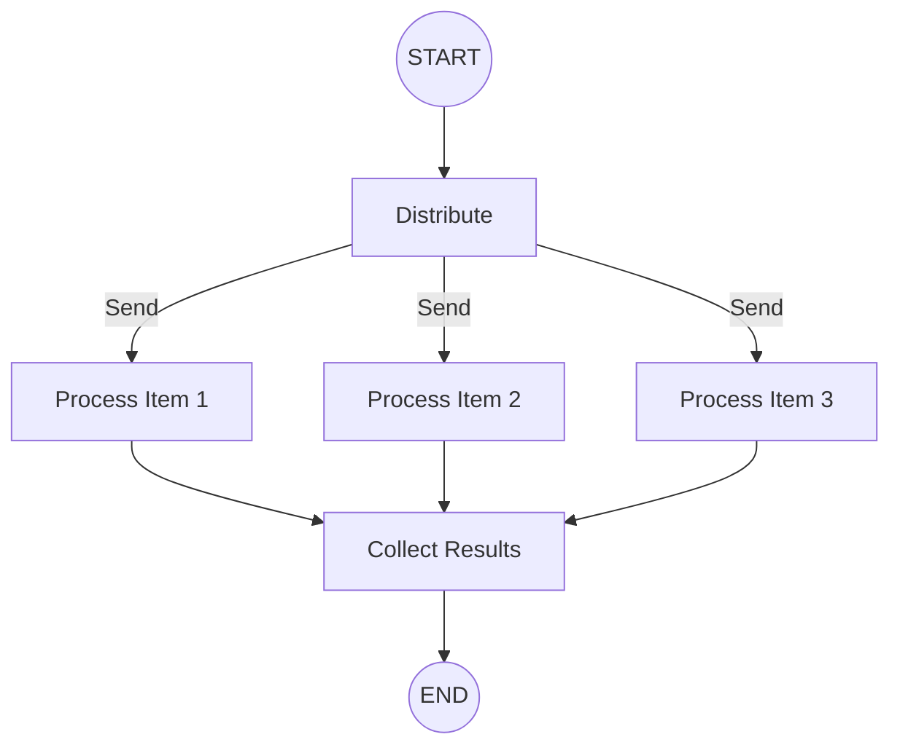

# Nodes and Edges

## Introduction

Nodes and edges are the building blocks of LangGraph workflows. Nodes perform actions and transform state, while edges define how execution flows between nodes.

In this lesson, we'll master the patterns for creating effective nodes and controlling flow with different edge types.

### What We'll Cover

- Node function signatures and patterns
- START and END constants
- Normal edges for linear flow
- Conditional edges for branching logic
- The Command pattern for combined updates and routing

### Prerequisites

- StateGraph basics from the previous lesson
- Python functions and type hints
- Understanding of graph concepts

---

## Node Functions

Nodes are Python functions (or callables) that:
1. Receive the current state
2. Perform some action
3. Return state updates



### Basic Node Signature

```python
from typing_extensions import TypedDict


class MyState(TypedDict):
    query: str
    result: str


def my_node(state: MyState) -> dict:
    """Basic node that transforms state."""
    query = state["query"]
    result = f"Processed: {query}"
    
    return {"result": result}
```

### Node with Configuration

Access runtime configuration using `RunnableConfig`:

```python
from langchain_core.runnables import RunnableConfig


def configurable_node(state: MyState, config: RunnableConfig) -> dict:
    """Node that uses runtime configuration."""
    
    # Access configuration values
    model_name = config.get("configurable", {}).get("model", "gpt-4o-mini")
    user_id = config.get("configurable", {}).get("user_id")
    
    return {
        "result": f"Processed with {model_name} for user {user_id}"
    }


# Pass configuration at runtime
result = app.invoke(
    {"query": "Hello"},
    config={"configurable": {"model": "gpt-4o", "user_id": "123"}}
)
```

### Async Nodes

For I/O-bound operations, use async functions:

```python
import httpx


async def fetch_data(state: MyState) -> dict:
    """Async node for API calls."""
    async with httpx.AsyncClient() as client:
        response = await client.get(f"https://api.example.com/{state['query']}")
        data = response.json()
    
    return {"result": str(data)}
```

---

## START and END Constants

LangGraph provides special constants to mark entry and exit points:

```python
from langgraph.graph import StateGraph, START, END


graph = StateGraph(MyState)

# START: Entry point (where execution begins)
graph.add_edge(START, "first_node")

# END: Exit point (where execution completes)
graph.add_edge("last_node", END)
```

### Visualizing Flow



> **Note:** Every graph must have at least one edge from START and at least one edge to END.

---

## Normal Edges

Normal edges create fixed connections between nodes:

```python
from langgraph.graph import StateGraph, START, END
from typing_extensions import TypedDict


class PipelineState(TypedDict):
    data: str
    step: str


def step_one(state: PipelineState) -> dict:
    return {"data": state["data"].upper(), "step": "one"}


def step_two(state: PipelineState) -> dict:
    return {"data": state["data"] + "!", "step": "two"}


def step_three(state: PipelineState) -> dict:
    return {"data": f"[{state['data']}]", "step": "three"}


graph = StateGraph(PipelineState)

# Add nodes
graph.add_node("one", step_one)
graph.add_node("two", step_two)
graph.add_node("three", step_three)

# Add linear edges
graph.add_edge(START, "one")
graph.add_edge("one", "two")
graph.add_edge("two", "three")
graph.add_edge("three", END)

app = graph.compile()

result = app.invoke({"data": "hello", "step": ""})
print(result)  # {"data": "[HELLO!]", "step": "three"}
```

---

## Conditional Edges

Conditional edges enable dynamic routing based on state:



### add_conditional_edges()

```python
from langgraph.graph import StateGraph, START, END
from typing import Literal
from typing_extensions import TypedDict


class TicketState(TypedDict):
    ticket_type: str
    content: str
    response: str


def classify(state: TicketState) -> dict:
    """Classify the ticket type."""
    content = state["content"].lower()
    
    if "bug" in content or "error" in content:
        return {"ticket_type": "technical"}
    elif "bill" in content or "payment" in content:
        return {"ticket_type": "billing"}
    else:
        return {"ticket_type": "general"}


def route_ticket(state: TicketState) -> Literal["technical", "billing", "general"]:
    """Routing function - returns the next node name."""
    return state["ticket_type"]


def handle_technical(state: TicketState) -> dict:
    return {"response": "Technical team will investigate."}


def handle_billing(state: TicketState) -> dict:
    return {"response": "Billing team will review your account."}


def handle_general(state: TicketState) -> dict:
    return {"response": "Thank you for your inquiry."}


# Build graph
graph = StateGraph(TicketState)

graph.add_node("classify", classify)
graph.add_node("technical", handle_technical)
graph.add_node("billing", handle_billing)
graph.add_node("general", handle_general)

# Linear edge to classifier
graph.add_edge(START, "classify")

# Conditional edges from classifier
graph.add_conditional_edges(
    "classify",           # Source node
    route_ticket,         # Routing function
    {                     # Path map: return value -> node name
        "technical": "technical",
        "billing": "billing",
        "general": "general"
    }
)

# All handlers go to END
graph.add_edge("technical", END)
graph.add_edge("billing", END)
graph.add_edge("general", END)

app = graph.compile()

# Test
result = app.invoke({
    "content": "I have a bug in my code",
    "ticket_type": "",
    "response": ""
})
print(result["response"])  # "Technical team will investigate."
```

### Routing Function Patterns

| Pattern | Description | Example Return |
|---------|-------------|----------------|
| Return node name | Simple routing | `"process"` or `"skip"` |
| Return END | End execution | `END` |
| Return list | Multiple next nodes | `["node_a", "node_b"]` |

#### Routing to END

```python
from langgraph.graph import END


def check_complete(state: MyState) -> Literal["continue", "__end__"]:
    """Route to END when complete."""
    if state.get("complete"):
        return END  # END is "__end__"
    return "continue"


graph.add_conditional_edges(
    "check",
    check_complete,
    {
        "continue": "process",
        END: END
    }
)
```

---

## The Command Pattern

`Command` lets you update state AND route in a single return:

```python
from langgraph.graph import StateGraph, START, END
from langgraph.types import Command
from typing import Literal
from typing_extensions import TypedDict


class OrderState(TypedDict):
    order_id: str
    status: str
    amount: float
    approved: bool


def review_order(state: OrderState) -> Command[Literal["ship", "reject"]]:
    """Review order and route based on amount."""
    amount = state["amount"]
    
    if amount > 1000:
        # Large orders need manual approval
        return Command(
            update={"status": "pending_approval"},
            goto="manual_review"
        )
    elif amount > 0:
        # Auto-approve small orders
        return Command(
            update={"status": "approved", "approved": True},
            goto="ship"
        )
    else:
        # Invalid orders
        return Command(
            update={"status": "rejected"},
            goto="reject"
        )


def manual_review(state: OrderState) -> Command[Literal["ship", "reject"]]:
    """Simulate manual review."""
    # In reality, this might pause for human input
    return Command(
        update={"approved": True, "status": "approved"},
        goto="ship"
    )


def ship_order(state: OrderState) -> dict:
    return {"status": "shipped"}


def reject_order(state: OrderState) -> dict:
    return {"status": "rejected"}


graph = StateGraph(OrderState)

graph.add_node("review", review_order)
graph.add_node("manual_review", manual_review)
graph.add_node("ship", ship_order)
graph.add_node("reject", reject_order)

graph.add_edge(START, "review")
graph.add_edge("ship", END)
graph.add_edge("reject", END)

app = graph.compile()
```

### Command vs Conditional Edges

| Feature | Conditional Edges | Command |
|---------|-------------------|---------|
| Separate routing logic | Yes (routing function) | No (inline) |
| Update state + route | Two steps | Single return |
| Code organization | More modular | More compact |
| Use case | Complex routing | Simple routing + update |

---

## Multiple Edges from One Node

A node can have multiple outgoing edges:

```python
from langgraph.graph import StateGraph, START, END
from langgraph.types import Send
from typing_extensions import TypedDict


class FanOutState(TypedDict):
    items: list[str]
    results: list[str]


def distribute(state: FanOutState) -> list[Send]:
    """Send each item to a separate process."""
    return [
        Send("process", {"item": item})
        for item in state["items"]
    ]


def process(state: dict) -> dict:
    """Process individual item."""
    item = state["item"]
    return {"result": f"Processed: {item}"}
```

### The Send Pattern

Use `Send` for dynamic fan-out patterns:



---

## Node Runtime Context

Access runtime information with `runtime` parameter:

```python
from langgraph.graph import StateGraph
from langgraph.types import Runtime


def context_aware_node(state: MyState, runtime: Runtime) -> dict:
    """Node with runtime context access."""
    
    # Access the store for cross-thread data
    store = runtime.store
    
    # Get remaining steps before recursion limit
    remaining = runtime.remaining_steps
    
    if remaining < 5:
        # Wrap up quickly if running low on steps
        return {"result": "Quick summary"}
    
    return {"result": "Full processing"}
```

### Runtime Properties

| Property | Description |
|----------|-------------|
| `runtime.store` | Shared key-value store |
| `runtime.remaining_steps` | Steps until recursion limit |
| `runtime.config` | Runtime configuration |

---

## Graph Visualization

Visualize your graph structure:

```python
from IPython.display import Image


# Get graph as PNG
image_data = app.get_graph().draw_mermaid_png()

# Display in Jupyter
Image(image_data)

# Or get as Mermaid text
mermaid_text = app.get_graph().draw_mermaid()
print(mermaid_text)
```

---

## Best Practices

| Practice | Description |
|----------|-------------|
| Keep nodes focused | One responsibility per node |
| Use descriptive names | `validate_input` not `node1` |
| Type hint everything | Clear state and return types |
| Handle edge cases | Check for missing state fields |
| Use Command for simple routing | When update + route are coupled |

---

## Common Pitfalls

| ❌ Mistake | ✅ Solution |
|-----------|-------------|
| Missing edge to END | Ensure all paths terminate |
| Routing function returns wrong type | Return node name or END |
| Forgetting START edge | Always add `add_edge(START, ...)` |
| Circular dependencies | Use conditional logic to break cycles |
| Complex routing in nodes | Extract to routing function |

---

## Hands-on Exercise

### Your Task

Create a content moderation workflow:
1. Classify content as `safe`, `review`, or `block`
2. Route to appropriate handler
3. Return moderation decision

### Requirements

1. State: `content`, `category`, `decision`, `reason`
2. Classifier node sets category
3. Three handler nodes for each category
4. Use conditional edges for routing

### Expected Result

```python
result = app.invoke({
    "content": "This is a normal message",
    "category": "",
    "decision": "",
    "reason": ""
})

print(result)
# {
#   "content": "This is a normal message",
#   "category": "safe",
#   "decision": "approved",
#   "reason": "Content is safe"
# }
```

<details>
<summary>💡 Hints (click to expand)</summary>

1. Use keywords to classify (e.g., "spam", "inappropriate")
2. Routing function returns the category
3. Each handler sets `decision` and `reason`
4. All handlers connect to END

</details>

<details>
<summary>✅ Solution (click to expand)</summary>

```python
from typing import Literal
from typing_extensions import TypedDict
from langgraph.graph import StateGraph, START, END


class ModerationState(TypedDict):
    content: str
    category: str
    decision: str
    reason: str


def classify_content(state: ModerationState) -> dict:
    """Classify content for moderation."""
    content = state["content"].lower()
    
    blocked_words = ["spam", "scam", "banned"]
    review_words = ["maybe", "uncertain", "check"]
    
    if any(word in content for word in blocked_words):
        return {"category": "block"}
    elif any(word in content for word in review_words):
        return {"category": "review"}
    else:
        return {"category": "safe"}


def route_content(state: ModerationState) -> Literal["safe", "review", "block"]:
    """Route to appropriate handler."""
    return state["category"]


def handle_safe(state: ModerationState) -> dict:
    return {"decision": "approved", "reason": "Content is safe"}


def handle_review(state: ModerationState) -> dict:
    return {"decision": "pending", "reason": "Needs human review"}


def handle_block(state: ModerationState) -> dict:
    return {"decision": "blocked", "reason": "Violates content policy"}


# Build graph
graph = StateGraph(ModerationState)

graph.add_node("classify", classify_content)
graph.add_node("safe", handle_safe)
graph.add_node("review", handle_review)
graph.add_node("block", handle_block)

graph.add_edge(START, "classify")
graph.add_conditional_edges(
    "classify",
    route_content,
    {
        "safe": "safe",
        "review": "review",
        "block": "block"
    }
)
graph.add_edge("safe", END)
graph.add_edge("review", END)
graph.add_edge("block", END)

app = graph.compile()

# Test cases
test_cases = [
    "This is a normal message",
    "Please check this uncertain content",
    "This looks like spam"
]

for content in test_cases:
    result = app.invoke({
        "content": content,
        "category": "",
        "decision": "",
        "reason": ""
    })
    print(f"{content[:30]}... -> {result['decision']}: {result['reason']}")
```

</details>

---

## Summary

✅ Nodes are functions that receive state and return updates

✅ START and END mark graph entry and exit points

✅ Normal edges create fixed connections with `add_edge()`

✅ Conditional edges enable dynamic routing with `add_conditional_edges()`

✅ Command pattern combines state updates with routing

✅ Use routing functions to separate decision logic

**Next:** [State Management →](./03-state-management.md)

---

## Further Reading

- [LangGraph Graph API](https://docs.langchain.com/oss/python/langgraph/graph-api)
- [Conditional Edges Guide](https://docs.langchain.com/oss/python/langgraph/how-tos/branching)
- [Command Documentation](https://docs.langchain.com/oss/python/langgraph/concepts/command)

---

<!-- 
Sources Consulted:
- LangGraph Graph API: https://docs.langchain.com/oss/python/langgraph/graph-api
- LangGraph Quickstart: https://docs.langchain.com/oss/python/langgraph/quickstart
-->
