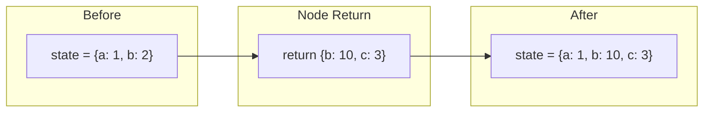
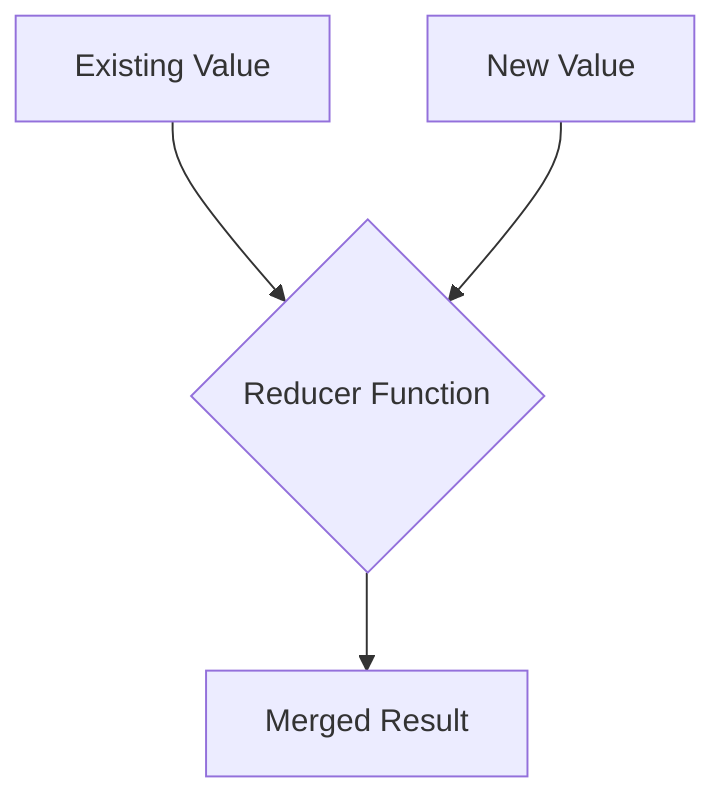
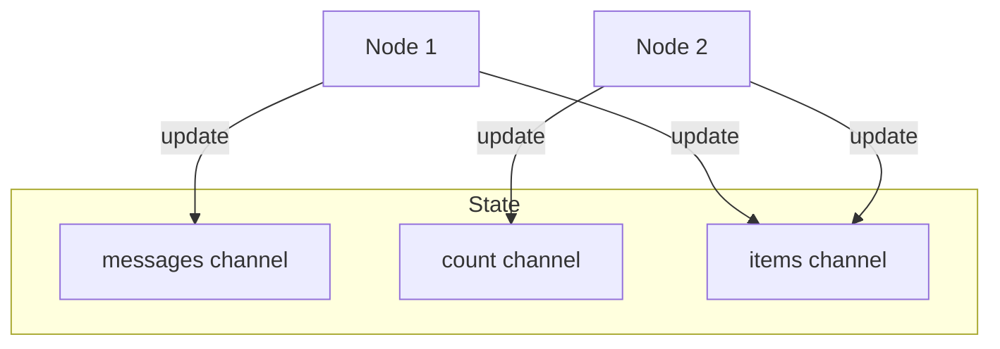

# State Management

## Introduction

State management is what makes LangGraph powerful. Unlike simple function chains, LangGraph provides sophisticated mechanisms for updating, merging, and persisting state across your workflow.

In this lesson, we'll explore reducers, the built-in message handling, and patterns for complex state scenarios.

### What We'll Cover

- How state updates work
- Reducers and their role
- The `add_messages` reducer
- Custom reducer functions
- State persistence with checkpointers

### Prerequisites

- StateGraph and node basics
- Understanding of Python type annotations
- Familiarity with `Annotated` type hints

---

## How State Updates Work

When a node returns state updates, LangGraph merges them with the existing state:



By default, **returned values overwrite existing values**:

```python
from typing_extensions import TypedDict


class State(TypedDict):
    count: int
    items: list[str]


def increment(state: State) -> dict:
    """Default behavior: overwrite."""
    return {"count": state["count"] + 1}


def add_item(state: State) -> dict:
    """This REPLACES the entire list!"""
    return {"items": ["new_item"]}  # Previous items are lost!
```

> **Warning:** Default overwrites can cause data loss with lists!

---

## Understanding Reducers

Reducers define **how to merge** new values with existing values:

```python
from typing import Annotated
from typing_extensions import TypedDict
import operator


class State(TypedDict):
    # Default: new value overwrites old
    count: int
    
    # With reducer: values are combined
    items: Annotated[list[str], operator.add]
```

### Reducer Flow



---

## Built-in Reducers

### operator.add (Append Lists)

```python
from typing import Annotated
from typing_extensions import TypedDict
import operator


class LogState(TypedDict):
    logs: Annotated[list[str], operator.add]


def log_action(state: LogState) -> dict:
    """Each return appends to the list."""
    return {"logs": ["Action performed"]}


# After multiple nodes:
# logs = ["Step 1", "Step 2", "Action performed"]
```

### The add_messages Reducer

For chat applications, use `add_messages`:

```python
from typing import Annotated
from langgraph.graph import MessagesState
from langgraph.graph.message import add_messages
from langchain_core.messages import AIMessage, HumanMessage


class ChatState(TypedDict):
    messages: Annotated[list, add_messages]


def respond(state: ChatState) -> dict:
    """New messages are intelligently merged."""
    response = AIMessage(content="Hello!")
    return {"messages": [response]}
```

### How add_messages Works

| Scenario | Behavior |
|----------|----------|
| New message | Appends to list |
| Message with same ID | Updates existing message |
| ToolMessage response | Matches to ToolCall |

```python
from langchain_core.messages import AIMessage, HumanMessage, RemoveMessage


# Adding new messages
def add_response(state):
    return {"messages": [AIMessage(content="Hi!")]}


# Updating existing message (same ID)
def update_response(state):
    existing_id = state["messages"][-1].id
    return {"messages": [AIMessage(id=existing_id, content="Updated!")]}


# Removing messages
def clear_old(state):
    old_msg = state["messages"][0]
    return {"messages": [RemoveMessage(id=old_msg.id)]}
```

---

## MessagesState Convenience Class

LangGraph provides `MessagesState` with `add_messages` pre-configured:

```python
from langgraph.graph import StateGraph, MessagesState, START, END
from langchain_openai import ChatOpenAI


llm = ChatOpenAI(model="gpt-4o-mini")


def chat(state: MessagesState) -> dict:
    """MessagesState includes 'messages' with add_messages reducer."""
    response = llm.invoke(state["messages"])
    return {"messages": [response]}


graph = StateGraph(MessagesState)
graph.add_node("chat", chat)
graph.add_edge(START, "chat")
graph.add_edge("chat", END)

app = graph.compile()

# Conversation automatically accumulates
result1 = app.invoke({"messages": [("user", "Hi!")]})
# messages: [HumanMessage("Hi!"), AIMessage("Hello!")]
```

### Extending MessagesState

```python
from langgraph.graph import MessagesState


class AgentState(MessagesState):
    """Extended state with custom fields."""
    current_tool: str
    iteration: int
    context: Annotated[list[str], operator.add]


def agent_step(state: AgentState) -> dict:
    return {
        "messages": [AIMessage(content="Thinking...")],
        "context": ["new context added"],
        "iteration": state["iteration"] + 1
    }
```

---

## Custom Reducers

Create custom reducers for specialized merge logic:

```python
from typing import Annotated
from typing_extensions import TypedDict


def merge_dicts(existing: dict, new: dict) -> dict:
    """Deep merge two dictionaries."""
    result = existing.copy()
    for key, value in new.items():
        if key in result and isinstance(result[key], dict) and isinstance(value, dict):
            result[key] = merge_dicts(result[key], value)
        else:
            result[key] = value
    return result


class ConfigState(TypedDict):
    settings: Annotated[dict, merge_dicts]


def update_settings(state: ConfigState) -> dict:
    """Settings are deep merged, not replaced."""
    return {
        "settings": {
            "display": {"theme": "dark"}
        }
    }


# If existing settings = {"display": {"font": "Arial"}, "audio": {"volume": 50}}
# After update: {"display": {"font": "Arial", "theme": "dark"}, "audio": {"volume": 50}}
```

### Reducer Function Signature

```python
def my_reducer(existing_value, new_value):
    """
    Args:
        existing_value: Current state value
        new_value: Value returned by node
    
    Returns:
        Merged/combined result
    """
    return combined_result
```

### Common Custom Reducer Patterns

```python
from typing import Annotated


def keep_max(existing: int, new: int) -> int:
    """Keep the maximum value."""
    return max(existing, new)


def keep_latest_n(n: int):
    """Factory for keeping only N latest items."""
    def reducer(existing: list, new: list) -> list:
        combined = existing + new
        return combined[-n:]  # Keep last N
    return reducer


def deduplicate(existing: list, new: list) -> list:
    """Merge lists without duplicates."""
    return list(dict.fromkeys(existing + new))


class State(TypedDict):
    high_score: Annotated[int, keep_max]
    recent_actions: Annotated[list, keep_latest_n(10)]
    seen_items: Annotated[list, deduplicate]
```

---

## State Channels

Internally, LangGraph uses "channels" to manage state fields:



Each field is an independent channel with its own reducer.

---

## Checkpointers and Persistence

Persist state across executions with checkpointers:

```python
from langgraph.graph import StateGraph, MessagesState, START, END
from langgraph.checkpoint.memory import MemorySaver


def chat(state: MessagesState) -> dict:
    return {"messages": [AIMessage(content="Hello!")]}


graph = StateGraph(MessagesState)
graph.add_node("chat", chat)
graph.add_edge(START, "chat")
graph.add_edge("chat", END)

# Add checkpointer for persistence
memory = MemorySaver()
app = graph.compile(checkpointer=memory)

# Use thread_id to maintain conversation
config = {"configurable": {"thread_id": "user-123"}}

# First invocation
result1 = app.invoke(
    {"messages": [("user", "Hi!")]},
    config=config
)

# Second invocation - continues the thread
result2 = app.invoke(
    {"messages": [("user", "What did I say?")]},
    config=config
)

# result2 includes history from result1!
```

### Checkpointer Types

| Type | Use Case | Persistence |
|------|----------|-------------|
| `MemorySaver` | Development, testing | In-memory (lost on restart) |
| `SqliteSaver` | Local persistence | SQLite file |
| `PostgresSaver` | Production | PostgreSQL database |

```python
# SQLite persistence
from langgraph.checkpoint.sqlite import SqliteSaver

with SqliteSaver.from_conn_string(":memory:") as memory:
    app = graph.compile(checkpointer=memory)

# PostgreSQL persistence
from langgraph.checkpoint.postgres import PostgresSaver

with PostgresSaver.from_conn_string("postgresql://...") as memory:
    app = graph.compile(checkpointer=memory)
```

---

## State Access Patterns

### Getting State History

```python
# Get all state snapshots
for state in app.get_state_history(config):
    print(state.values)
    print(state.metadata)
```

### Getting Current State

```python
# Get current checkpoint
current = app.get_state(config)
print(current.values)
print(current.next)  # What nodes run next
```

### Updating State Externally

```python
# Update state directly (for human-in-the-loop)
app.update_state(
    config,
    {"messages": [HumanMessage(content="Manual addition")]}
)
```

---

## Best Practices

| Practice | Description |
|----------|-------------|
| Use `add_messages` for chat | Handles message ID tracking |
| Use `operator.add` for lists | Prevents accidental overwrites |
| Keep reducers pure | No side effects in reducers |
| Use checkpointers in production | Enable recovery and history |
| Document your reducers | Make merge logic clear |

---

## Common Pitfalls

| ❌ Mistake | ✅ Solution |
|-----------|-------------|
| Overwriting lists | Use `Annotated[list, operator.add]` |
| Missing message IDs | Use `add_messages` reducer |
| State not persisting | Configure checkpointer |
| Complex reducer logic | Keep reducers simple, move logic to nodes |
| Forgetting thread_id | Always use consistent thread IDs |

---

## Hands-on Exercise

### Your Task

Create a stateful task manager with:
1. Tasks that accumulate (not overwrite)
2. Completed task count that increments
3. History of actions taken

### Requirements

1. State with `tasks`, `completed_count`, `action_history`
2. Use appropriate reducers for each field
3. Nodes: `add_task`, `complete_task`
4. Test accumulation works correctly

### Expected Behavior

```python
result = app.invoke({"tasks": [], "completed_count": 0, "action_history": []})
# After add_task and complete_task:
# {
#   "tasks": ["Task 1", "Task 2"],
#   "completed_count": 1,
#   "action_history": ["Added Task 1", "Added Task 2", "Completed Task 1"]
# }
```

<details>
<summary>💡 Hints (click to expand)</summary>

1. `tasks` needs `operator.add` reducer
2. `completed_count` can use default (overwrite with incremented value)
3. `action_history` needs `operator.add` reducer
4. Each node returns lists for appended fields

</details>

<details>
<summary>✅ Solution (click to expand)</summary>

```python
from typing import Annotated
from typing_extensions import TypedDict
from langgraph.graph import StateGraph, START, END
import operator


class TaskState(TypedDict):
    tasks: Annotated[list[str], operator.add]
    completed_count: int
    action_history: Annotated[list[str], operator.add]


def add_first_task(state: TaskState) -> dict:
    """Add first task."""
    return {
        "tasks": ["Task 1"],
        "action_history": ["Added Task 1"]
    }


def add_second_task(state: TaskState) -> dict:
    """Add second task."""
    return {
        "tasks": ["Task 2"],
        "action_history": ["Added Task 2"]
    }


def complete_task(state: TaskState) -> dict:
    """Complete first task."""
    completed = state["tasks"][0] if state["tasks"] else "Unknown"
    return {
        "completed_count": state["completed_count"] + 1,
        "action_history": [f"Completed {completed}"]
    }


# Build graph
graph = StateGraph(TaskState)

graph.add_node("add_first", add_first_task)
graph.add_node("add_second", add_second_task)
graph.add_node("complete", complete_task)

graph.add_edge(START, "add_first")
graph.add_edge("add_first", "add_second")
graph.add_edge("add_second", "complete")
graph.add_edge("complete", END)

app = graph.compile()

# Test
result = app.invoke({
    "tasks": [],
    "completed_count": 0,
    "action_history": []
})

print(f"Tasks: {result['tasks']}")
print(f"Completed: {result['completed_count']}")
print(f"History: {result['action_history']}")

# Output:
# Tasks: ['Task 1', 'Task 2']
# Completed: 1
# History: ['Added Task 1', 'Added Task 2', 'Completed Task 1']
```

</details>

---

## Summary

✅ State updates merge with existing state (default: overwrite)

✅ Reducers define custom merge behavior

✅ `operator.add` appends to lists instead of replacing

✅ `add_messages` handles chat message tracking intelligently

✅ `MessagesState` provides pre-configured chat state

✅ Checkpointers enable state persistence across sessions

**Next:** [Execution and Streaming →](./04-execution-and-streaming.md)

---

## Further Reading

- [LangGraph State Management](https://docs.langchain.com/oss/python/langgraph/concepts/state)
- [Checkpointers Documentation](https://docs.langchain.com/oss/python/langgraph/concepts/persistence)
- [Message Handling](https://docs.langchain.com/oss/python/langgraph/concepts/messages)

---

<!-- 
Sources Consulted:
- LangGraph Graph API: https://docs.langchain.com/oss/python/langgraph/graph-api
- LangGraph Durable Execution: https://docs.langchain.com/oss/python/langgraph/durable-execution
-->
