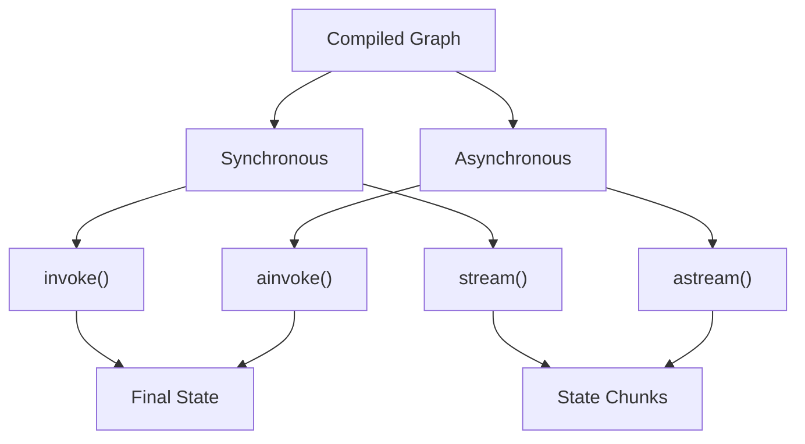

# Execution and Streaming

## Introduction

Once you've built and compiled your graph, you need to execute it. LangGraph provides multiple execution methods—from simple synchronous calls to sophisticated streaming modes that deliver real-time updates.

In this lesson, we'll explore all the ways to run your graphs and capture their output.

### What We'll Cover

- Synchronous execution with `invoke()`
- Streaming with `stream()`
- Async execution patterns
- Stream modes (values, updates, messages, custom)
- Debugging and visualization

### Prerequisites

- Built and compiled a StateGraph
- Understanding of Python async/await
- Basic streaming concepts

---

## Execution Methods Overview



| Method | Returns | Use Case |
|--------|---------|----------|
| `invoke()` | Final state | Simple execution |
| `stream()` | Iterator of updates | Real-time UI updates |
| `ainvoke()` | Awaitable final state | Async applications |
| `astream()` | Async iterator | Async streaming |

---

## Synchronous Execution

### invoke()

The simplest way to run a graph:

```python
from langgraph.graph import StateGraph, MessagesState, START, END
from langchain_openai import ChatOpenAI


llm = ChatOpenAI(model="gpt-4o-mini")


def chat(state: MessagesState) -> dict:
    response = llm.invoke(state["messages"])
    return {"messages": [response]}


graph = StateGraph(MessagesState)
graph.add_node("chat", chat)
graph.add_edge(START, "chat")
graph.add_edge("chat", END)

app = graph.compile()

# Simple invocation
result = app.invoke({
    "messages": [("user", "What is LangGraph?")]
})

print(result["messages"][-1].content)
```

### With Configuration

```python
# Pass runtime configuration
result = app.invoke(
    {"messages": [("user", "Hello")]},
    config={
        "configurable": {
            "thread_id": "session-123",
            "user_id": "user-456"
        },
        "recursion_limit": 50
    }
)
```

---

## Streaming Basics

### stream()

Get updates as the graph executes:

```python
# Stream all state updates
for chunk in app.stream({"messages": [("user", "Hello")]}):
    print(chunk)
```

### What Streams Look Like

```python
# Default stream output (stream_mode="values")
# Chunk 1: Full state after node 1
{"messages": [HumanMessage("Hello"), AIMessage("Hi there!")]}

# Chunk 2: Full state after node 2
{"messages": [HumanMessage("Hello"), AIMessage("Hi there!"), AIMessage("How can I help?")]}
```

---

## Stream Modes

LangGraph offers multiple streaming modes for different use cases:

```python
# Specify stream mode
for chunk in app.stream(input, stream_mode="values"):
    ...
```

### Mode Comparison

| Mode | Output | Use Case |
|------|--------|----------|
| `values` | Full state after each step | Show complete state |
| `updates` | Only the changes per node | Efficient updates |
| `messages` | LLM token stream | Real-time chat UI |
| `custom` | Developer-defined | Custom streaming logic |
| `debug` | Detailed execution info | Debugging |

---

## stream_mode="values"

Returns the complete state after each node:

```python
from langgraph.graph import StateGraph, START, END
from typing_extensions import TypedDict


class State(TypedDict):
    value: int


def add_one(state: State) -> dict:
    return {"value": state["value"] + 1}


def multiply_two(state: State) -> dict:
    return {"value": state["value"] * 2}


graph = StateGraph(State)
graph.add_node("add", add_one)
graph.add_node("multiply", multiply_two)
graph.add_edge(START, "add")
graph.add_edge("add", "multiply")
graph.add_edge("multiply", END)

app = graph.compile()

print("Stream mode: values")
for chunk in app.stream({"value": 5}, stream_mode="values"):
    print(f"  {chunk}")

# Output:
#   {'value': 5}      # Input
#   {'value': 6}      # After add
#   {'value': 12}     # After multiply
```

---

## stream_mode="updates"

Returns only what each node changed:

```python
print("Stream mode: updates")
for chunk in app.stream({"value": 5}, stream_mode="updates"):
    print(f"  {chunk}")

# Output:
#   {'add': {'value': 6}}        # Node name + its update
#   {'multiply': {'value': 12}}  # Node name + its update
```

This is more efficient when you only need to know what changed.

---

## stream_mode="messages"

Stream individual LLM tokens for real-time chat:

```python
from langgraph.graph import StateGraph, MessagesState, START, END
from langchain_openai import ChatOpenAI


llm = ChatOpenAI(model="gpt-4o-mini", streaming=True)


def chat(state: MessagesState) -> dict:
    response = llm.invoke(state["messages"])
    return {"messages": [response]}


graph = StateGraph(MessagesState)
graph.add_node("chat", chat)
graph.add_edge(START, "chat")
graph.add_edge("chat", END)

app = graph.compile()

# Stream tokens
for message, metadata in app.stream(
    {"messages": [("user", "Write a haiku")]},
    stream_mode="messages"
):
    if hasattr(message, "content") and message.content:
        print(message.content, end="", flush=True)

# Output streams token by token:
# Autumn leaves falling
# Whispers of change in the wind
# Nature's gentle dance
```

### Message Metadata

```python
for message, metadata in app.stream(input, stream_mode="messages"):
    print(f"Node: {metadata.get('langgraph_node')}")
    print(f"Content: {message.content}")
```

---

## stream_mode="custom"

Emit custom data from nodes:

```python
from langgraph.config import get_stream_writer


def progress_node(state: State) -> dict:
    """Node that streams custom progress updates."""
    writer = get_stream_writer()
    
    for i in range(5):
        # Emit custom progress data
        writer({"progress": i * 20, "status": f"Step {i+1}/5"})
        # Do some work...
    
    writer({"progress": 100, "status": "Complete"})
    
    return {"result": "done"}


# Capture custom streams
for chunk in app.stream(input, stream_mode="custom"):
    print(f"Progress: {chunk.get('progress')}% - {chunk.get('status')}")
```

---

## stream_mode="debug"

Get detailed execution information:

```python
for chunk in app.stream({"value": 5}, stream_mode="debug"):
    print(f"Type: {chunk.get('type')}")
    print(f"Data: {chunk}")
    print("---")

# Output includes:
# - task starts
# - task results  
# - state snapshots
# - metadata
```

---

## Multiple Stream Modes

Combine modes to get different views:

```python
# Stream both values and updates
for chunk in app.stream(
    {"messages": [("user", "Hello")]},
    stream_mode=["values", "updates"]
):
    mode = "values" if "messages" in chunk else "updates"
    print(f"[{mode}] {chunk}")
```

---

## Async Execution

### ainvoke()

Async version of invoke:

```python
import asyncio


async def main():
    result = await app.ainvoke({
        "messages": [("user", "Hello")]
    })
    print(result["messages"][-1].content)


asyncio.run(main())
```

### astream()

Async streaming:

```python
async def stream_chat():
    async for chunk in app.astream(
        {"messages": [("user", "Tell me a story")]},
        stream_mode="messages"
    ):
        message, metadata = chunk
        if message.content:
            print(message.content, end="", flush=True)


asyncio.run(stream_chat())
```

---

## Events API

For more control, use the events streaming API:

```python
async def process_events():
    async for event in app.astream_events(
        {"messages": [("user", "Hello")]},
        version="v2"
    ):
        kind = event["event"]
        
        if kind == "on_chat_model_stream":
            # LLM token
            content = event["data"]["chunk"].content
            if content:
                print(content, end="")
        
        elif kind == "on_chain_start":
            print(f"\nStarting: {event['name']}")
        
        elif kind == "on_chain_end":
            print(f"\nCompleted: {event['name']}")
```

### Event Types

| Event | Description |
|-------|-------------|
| `on_chain_start` | Node execution begins |
| `on_chain_end` | Node execution completes |
| `on_chat_model_start` | LLM call begins |
| `on_chat_model_stream` | LLM token received |
| `on_chat_model_end` | LLM call completes |
| `on_tool_start` | Tool execution begins |
| `on_tool_end` | Tool execution completes |

---

## Visualization and Debugging

### Get Graph Image

```python
from IPython.display import Image


# Generate PNG visualization
image = app.get_graph().draw_mermaid_png()

# In Jupyter
Image(image)

# Save to file
with open("graph.png", "wb") as f:
    f.write(image)
```

### Get Mermaid Diagram

```python
# Get Mermaid markup
mermaid = app.get_graph().draw_mermaid()
print(mermaid)

# Output:
# %%{init: {'flowchart': {'curve': 'linear'}}}%%
# graph TD
#     __start__([__start__])
#     add(add)
#     multiply(multiply)
#     __end__([__end__])
#     __start__ --> add
#     add --> multiply
#     multiply --> __end__
```

### Inspect Graph Structure

```python
# Get graph nodes and edges
print("Nodes:", list(app.get_graph().nodes))
print("Edges:", list(app.get_graph().edges))
```

---

## Recursion Limits

Protect against infinite loops:

```python
# Set recursion limit
result = app.invoke(
    {"messages": [...]},
    config={"recursion_limit": 25}
)

# Or set at compile time
app = graph.compile(
    recursion_limit=25  # Default is 25
)
```

### Handling Recursion Errors

```python
from langgraph.errors import GraphRecursionError

try:
    result = app.invoke(input, config={"recursion_limit": 10})
except GraphRecursionError:
    print("Graph exceeded maximum recursion depth")
```

---

## Execution with Persistence

```python
from langgraph.checkpoint.memory import MemorySaver


memory = MemorySaver()
app = graph.compile(checkpointer=memory)

config = {"configurable": {"thread_id": "conversation-1"}}

# First turn
result1 = app.invoke(
    {"messages": [("user", "Hi, I'm Alice")]},
    config=config
)

# Second turn - continues conversation
result2 = app.invoke(
    {"messages": [("user", "What's my name?")]},
    config=config
)

# The graph remembers: "Your name is Alice!"
```

---

## Best Practices

| Practice | Description |
|----------|-------------|
| Use `stream()` for UX | Show progress to users |
| Use `stream_mode="updates"` | More efficient than "values" |
| Enable streaming on LLMs | Set `streaming=True` on models |
| Handle recursion limits | Catch `GraphRecursionError` |
| Use async in web apps | Better concurrency with `ainvoke` |

---

## Common Pitfalls

| ❌ Mistake | ✅ Solution |
|-----------|-------------|
| Not consuming stream | Always iterate the full stream |
| Forgetting async context | Use `asyncio.run()` for async methods |
| Ignoring recursion limits | Set appropriate limits |
| Blocking on streaming | Use async for concurrent streams |
| Not handling errors | Wrap execution in try/except |

---

## Hands-on Exercise

### Your Task

Create a progress-reporting workflow:
1. Three processing steps
2. Each step takes simulated time
3. Stream progress updates to the user

### Requirements

1. Use `stream_mode="updates"` to track progress
2. Three nodes: `step_one`, `step_two`, `step_three`
3. State tracks: `progress`, `current_step`, `result`
4. Print progress as each step completes

### Expected Output

```
Step 1 starting...
  Progress: 33% - Step one complete
Step 2 starting...
  Progress: 66% - Step two complete  
Step 3 starting...
  Progress: 100% - Step three complete
Final result: All steps completed!
```

<details>
<summary>💡 Hints (click to expand)</summary>

1. Each node updates `progress` percentage
2. Use `stream_mode="updates"` to see node outputs
3. Each chunk is `{node_name: {state_updates}}`
4. Add `time.sleep()` to simulate work

</details>

<details>
<summary>✅ Solution (click to expand)</summary>

```python
import time
from typing_extensions import TypedDict
from langgraph.graph import StateGraph, START, END


class ProgressState(TypedDict):
    progress: int
    current_step: str
    result: str


def step_one(state: ProgressState) -> dict:
    """First processing step."""
    time.sleep(0.5)  # Simulate work
    return {
        "progress": 33,
        "current_step": "step_one",
        "result": "Step one complete"
    }


def step_two(state: ProgressState) -> dict:
    """Second processing step."""
    time.sleep(0.5)
    return {
        "progress": 66,
        "current_step": "step_two",
        "result": "Step two complete"
    }


def step_three(state: ProgressState) -> dict:
    """Third processing step."""
    time.sleep(0.5)
    return {
        "progress": 100,
        "current_step": "step_three",
        "result": "All steps completed!"
    }


# Build graph
graph = StateGraph(ProgressState)

graph.add_node("step_one", step_one)
graph.add_node("step_two", step_two)
graph.add_node("step_three", step_three)

graph.add_edge(START, "step_one")
graph.add_edge("step_one", "step_two")
graph.add_edge("step_two", "step_three")
graph.add_edge("step_three", END)

app = graph.compile()

# Stream with progress updates
for chunk in app.stream(
    {"progress": 0, "current_step": "", "result": ""},
    stream_mode="updates"
):
    for node_name, updates in chunk.items():
        print(f"{node_name}:")
        print(f"  Progress: {updates['progress']}%")
        print(f"  Status: {updates['result']}")
```

</details>

---

## Summary

✅ `invoke()` returns the final state after complete execution

✅ `stream()` yields updates for real-time progress

✅ Use `stream_mode` to control what data is streamed

✅ `messages` mode streams LLM tokens for chat interfaces

✅ Async methods (`ainvoke`, `astream`) for non-blocking execution

✅ Visualization helps debug graph structure

**Next:** [Building Your First Agent →](./05-building-your-first-agent.md)

---

## Further Reading

- [LangGraph Streaming Guide](https://docs.langchain.com/oss/python/langgraph/streaming)
- [Async Programming in LangGraph](https://docs.langchain.com/oss/python/langgraph/concepts/async)
- [Debugging LangGraph](https://docs.langchain.com/oss/python/langgraph/how-tos/debugging)

---

<!-- 
Sources Consulted:
- LangGraph Streaming: https://docs.langchain.com/oss/python/langgraph/streaming
- LangGraph Overview: https://docs.langchain.com/oss/python/langgraph/overview
-->
